#################################################################################
Інструкція користувача
#################################################################################

.. картинки:

.. contents:: Зміст:
   :depth: 4

---------

Скорочення:

ОС - облікова система

ЕЦП - електронно-цифровий підпис/печатка

---------

****************************************
**Робота з модулем**
****************************************

Вступ
==========================

Дана інструкція описує роботу з інтеграційним модулем сервісу EDIN "Вільний" для облікової системи 1С | BAS (далі ОС). Інтеграційний модуль являє собою зовнішню обробку для інтеграції електронного документообігу між обліковою системою користувача та сервісом платформи EDIN 2.0. Модуль інтеграції створено для звичайних форм конфігурацій ОС, але також є можливість налаштування під нестандартні конфігурації. Для роботи з документами меню інтеграційного модуля розділено на:

* **"Вхідні"** - розділ для роботи з вхідними документами
* **"Відправлені"** - розділ для роботи з вихідними документами
* **"Чернетки"** - розділ для роботи зі створеними / підписаними, але ще не відправленими документами
* **"Документи ОС"** - розділ для роботи з документами ОС та їх швидкої відправки через модуль  

.. hint::
   Розділ **"Налаштування"** описано в `Інструкції по налаштуванню <https://wiki.edin.ua/uk/latest/Vilnyi/Integration_Vilnyi/integration_Vilnyi_guide.html>`__

-------------------------------------

.. _doc-statuses:

В сервісі **"Вільний"** для документів передбачені наступні статуси:

* **Очікує підписання** - статус чернетки, відправленого непідписаного чи підписаного документа з однієї сторони;
* **Підписано частково** - якщо частина контрагентів-Отримувачів підтвердили документ;
* **Прийнято** - документ прийнятий всіма контрагентами (кінцевий статус);
* **Відхилено** - документ відхилено одним з контрагентів (документ вважається відхиленим незважаючи на дії інших контрагентів) - кінцевий статус.

1 "Чернетки"
=======================

**"Чернетки"** - це розділ, журнал якого містить створені, але ще не відправлені документи. Саме в цьому розділі можливо повністю з "нуля" створити та відправити документ. Розділ "Чернетки" містить фільтри за датою документа (поля "Дата з" / "по") і також дозволяє налаштувати кількість документів, що будуть виводитись на одній сторінці журналу (пагінація). 

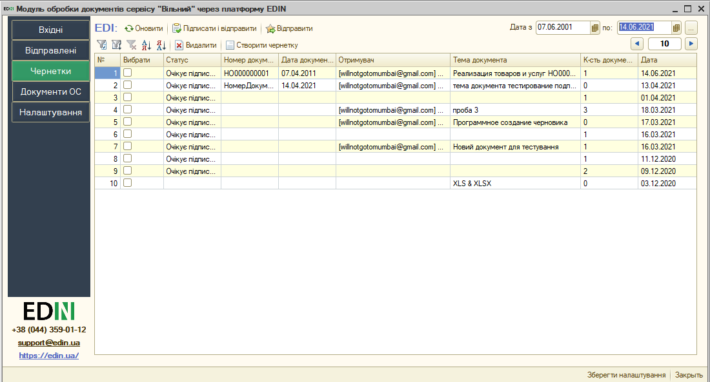

1.1 Створення та відправка документів
--------------------------------------------------------------

Документи сервісу EDIN "Вільний" можливо створювати безпосередньо з розділу **"Чернетки"**, натиснувши кнопку **"Створити чернетку"**: 

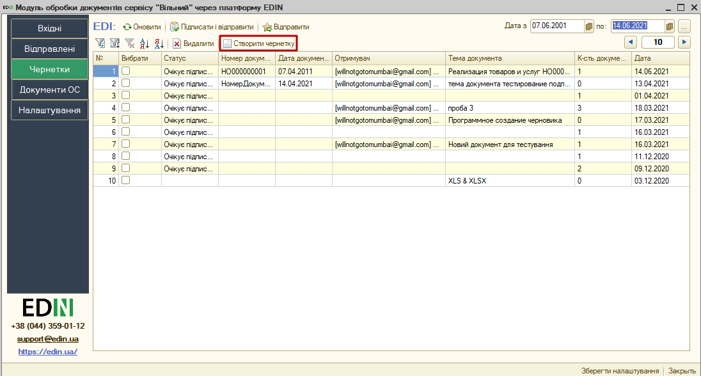

Після чого відкриється порожня форма документа сервісу "Вільний":

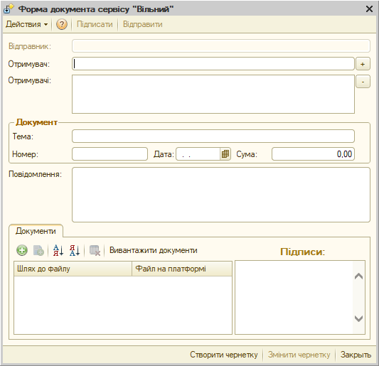

При внесенні контрагентів в поле "Отримувач" (min 3 символи + Enter) спрацьовує автоматичний пошук зареєстрованих користувачів сервісу EDIN "Вільний" (за прізвищем, поштою, ІПН, ЄДРПОУ чи номером телефону) для вибору контрагента з вікна-підказки (незареєстрований користувач додається кнопкою **"+"**):

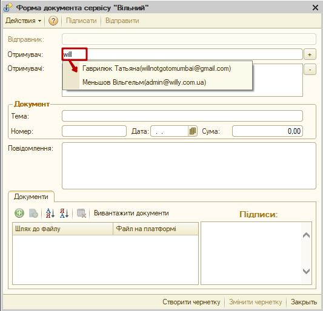

Всі отримувачі майбутнього документа відображаються в полі "Отримувачі" і можуть бути видалені до відправки документа за допомогою кнопки **"-"**.

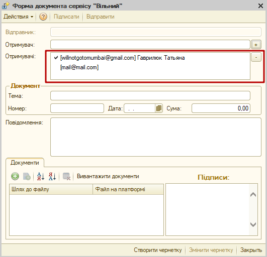

В полі "Отримувачі" галочкой відмічені адреси, контрагенти яких зареєстровані в сервісі EDIN "Вільний". Якщо адреса без позначки, на неї буде відправлено запрошення (`детальніше в інструкції сервісу <https://wiki.edin.ua/uk/latest/Vilnyi/Work_with_Vilnyi.html#counterparty-add>`__). 

За допомогою кнопок **"+"** потрібно додати поля та вказати шлях до файлів, що будуть вкладені до документа:  

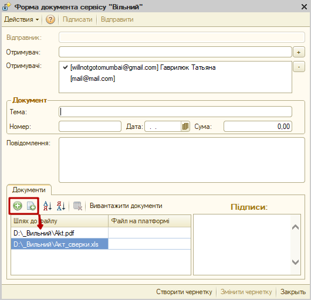

.. note::
   Один документ може містити не більше 10 файлів в наступних форматах: PDF/JPG/JPEG/PNG/BMP/DOC/DOCX/XLS/XLSX/PPT/PPTX/CSV/TXT/XML/P7S з розміром файлу не більше 5 Мб.

Далі потрібно **"Вивантажити документи"** на платформу:

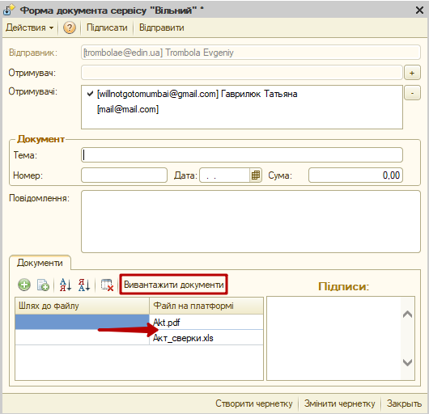

Заповнений документ з вивантаженими документами можливо **"Підписати"** і **"Відправити"**:

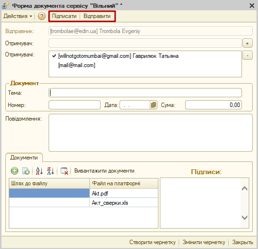

При першому підписанні за поточну сесію потрібно ввести пароль ключа підписанта:

.. image:: pics_user_instruction_Vilnyi/user_instruction_Vilnyi_02.png
   :align: center

Підписаний документ має блок з даними про підписи:

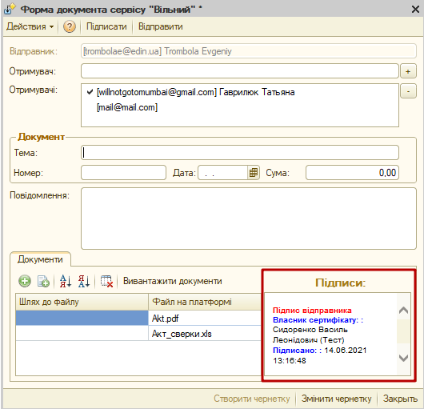

Документ можливо **"Відправити"** з форми документа чи відправити документи масово, обравши готові до відправки документи в журналі **"Чернеток"**. 

.. important::
   Якщо після підписання чернетки до неї були внесені зміни, наприклад, змінена Тема, то такий редагований документ потребує повторного підписання!

Всі відправлені документи потрапляють в розділ **"Відправлені"**. Відправлений документ недоступний до редагування (редагувати можливо лише документ-чернетку).

2 "Відправлені"
=======================

Розділ відправлених документів (до контрагентів) відображає в журналі документів всі відправлені документи за датою їх відправки. Аналогічно до розділу "Чернеток" документів "Відправлені" містить фільтри за датою документа (поля "Дата з" / "по") і також дозволяє налаштувати кількість документів, що будуть виводитись на одній сторінці журналу (пагінація). 

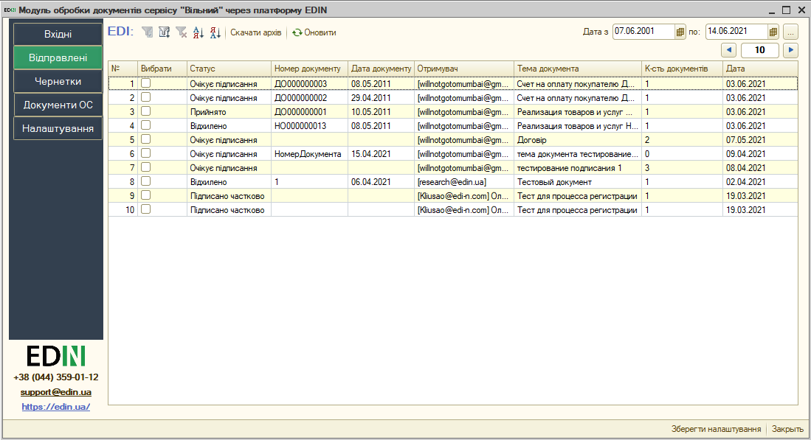

В журналі документів обов'язково вказується Отримувач, Тема, Кількість файлів в документі, Дата та `Статус <https://wiki.edin.ua/uk/latest/Vilnyi/Integration_Vilnyi/user_instruction_Vilnyi.html#doc-statuses>`__.

У розділі присутні кнопки оновлення списку документів |refresh| (оновлення вхідних документів з платформи електронного документообігу та довантаження створених документів з ОС).

За допомогою кнопки **"Скачати архів"** вибрані документи завантажуються у вигляді zip-архівів. Кожен з архівів містить каталоги для кожного вкладення. Кожен каталог містить:

* якщо документ не підписаний: оригінал файлу;
* якщо документ підписаний: оригінал файлу та підписаний файл в форматі p7s.

.. note::
   Якщо підписаний документ містить файл в форматі PDF/JPG/JPEG/PNG/BMP, то завантажуваний zip-архів для кожного такого файлу додатково містить друкований макет з візуалізацією підпису в вигляді водяного знаку та листом підписання в форматі pdf (`детальніше <https://wiki.edin.ua/uk/latest/Vilnyi/Work_with_Vilnyi.html#signing-watermark>`__).

3 "Вхідні"
================

Розділ вхідних документів (від контрагентів) при запуску модуля відкривається за замовчуванням. В журналі документів відображаються всі вхідні документи за датою їх отримання. Список документів можливо відфільтрувати за датою документа (поля "Дата з" / "по"). Також можливо налаштувати кількість документів, що будуть виводитись на одній сторінці журналу (пагінація) - це дозволяє пришвидшити завантаження сторінки та роботу з новими документами.

.. image:: pics_user_instruction_Vilnyi/user_instruction_Vilnyi_01.png
   :align: center

В журналі документів обов'язково вказується Відправник, Тема, Кількість файлів в документі, Дата та `Статус <https://wiki.edin.ua/uk/latest/Vilnyi/Integration_Vilnyi/user_instruction_Vilnyi.html#doc-statuses>`__.

У розділі присутні кнопки оновлення списку документів |refresh| (оновлення вхідних документів з платформи електронного документообігу та довантаження створених документів з ОС).

Для підписаних відправником вхідних документи можливо виконати дію: **"Підтвердити"** чи **"Відхилити"**, попередньо відмітивши ці документи в списку. При **"Підтвердженні"** відбувається підписання вхідного документа і для цього модуль може запросити пароль:

.. image:: pics_user_instruction_Vilnyi/user_instruction_Vilnyi_02.png
   :align: center

.. hint::
   Пароль вказується один раз за сесію, наприклад, при підписанні першого документа (підписання інших документів на протязі поточної сесії не потребує введення пароля).

Підписаний з обох сторін документ ("Прийнятий") містить підписи Відправника та Отримувача:

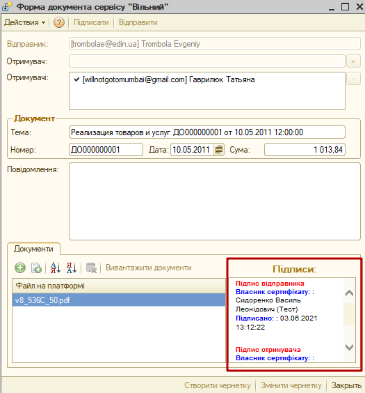

При **"Відхиленні"** обов'язково вказується причина відхилення документа, що зберігається у вкладці "Повідомлення відхилення" на формі документа (при цьому документ містить лише один підпис):

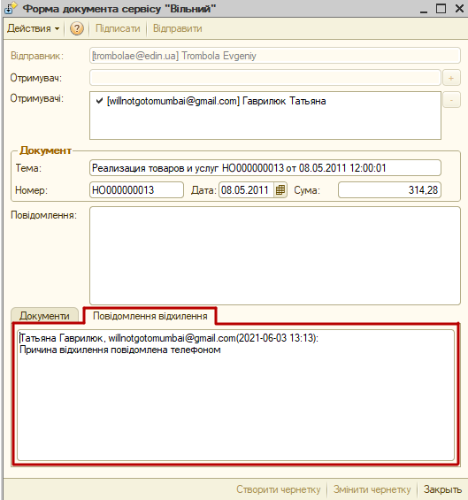

За допомогою кнопки **"Скачати архів"** вибрані документи завантажуються у вигляді zip-архівів. Кожен з архівів містить каталоги для кожного вкладення. Кожен каталог містить:

* якщо документ не підписаний: оригінал файлу;
* якщо документ підписаний: оригінал файлу та підписаний файл в форматі p7s.

.. note::
   Якщо підписаний документ містить файл в форматі PDF/JPG/JPEG/PNG/BMP, то завантажуваний zip-архів для кожного такого файлу додатково містить друкований макет з візуалізацією підпису в вигляді водяного знаку та листом підписання в форматі pdf (`детальніше <https://wiki.edin.ua/uk/latest/Vilnyi/Work_with_Vilnyi.html#signing-watermark>`__).

4 "Документи ОС"
================================

Розділ містить документи облікової системи, що можуть бути використані для формування і відправки документа в сервіс "Вільний" (для цього попередньо потрібно виконати `налаштування <https://wiki.edin.ua/uk/latest/Vilnyi/Integration_Vilnyi/integration_Vilnyi_guide.html>`__. В журналі документів за обраний період (поля "Дата з" / "по") відображаються лише ті документи ОС, тип яких вказаний в `налаштуваннях <https://wiki.edin.ua/uk/latest/Vilnyi/Integration_Vilnyi/integration_Vilnyi_guide.html>`__. Після внесення змін в період вибірки потрібно **"Оновити документи ОС"**.

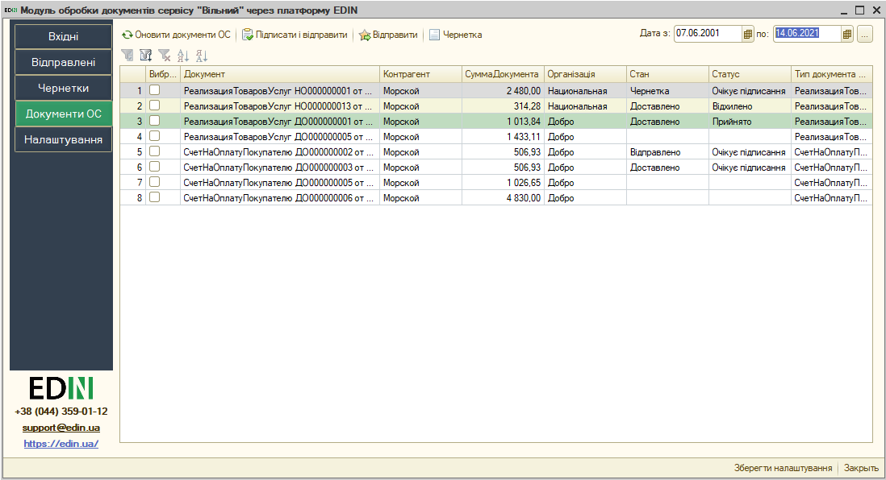

В журналі документів вказується Повна назва документа, Контрагент, Сума, Стан та `Статус <https://wiki.edin.ua/uk/latest/Vilnyi/Integration_Vilnyi/user_instruction_Vilnyi.html#doc-statuses>`__ документа сервісу EDIN "Вільний".

З цих документів ОС можливо:

* створити чернетку документа "Вільний" (кнопка **"Чернетка"**) для подальшого редагування в розділі "Чернетки";
* створити та відправити документ (кнопка **"Відправити"**);
* створити, підписати та відправити документ (кнопка **"Підписати і відправити"**).

Всі відправлені документи потрапляють в розділ **"Відправлені"**.

При формуванні документа в розділі "Документи ОС" згідно налаштувань поля документа-чернетка автоматично заповнюються (Тема документа заповнюється повною назвою документа), а незаповнені поля (за потреби) можливо ввести вручну, відкривши документ-чернетку:

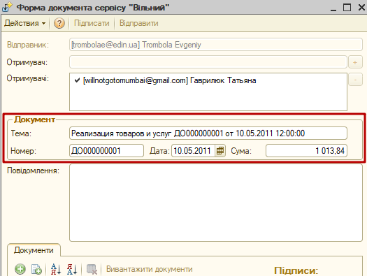

-------------------------------------

.. include:: /_constant/kontakti.rst

