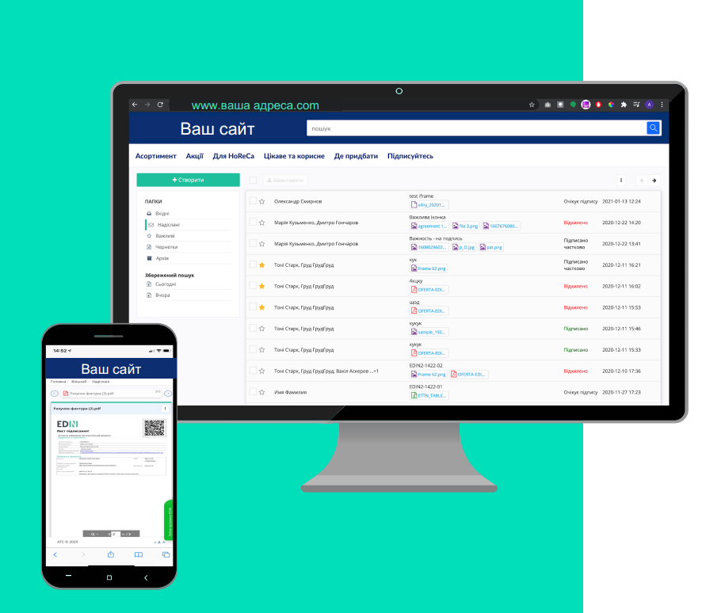

Інтеграція з Вашим сайтом
#############################################################

.. role:: green

Сервіс "Вільний" можливо вбудувати в особистий кабінет сайту за допомогою кількох простих кроків і організувати електронний документообіг прямо у Вас на сайті під	власним	брендом:

---------

Для того аби вбудувати "Вільний" до Вашого особистого кабінету потрібно:

**1. Пройти ініціалізацію сесії за допомогою метода API (HTTP запит)**

.. important::
    В цілях безпеки, ініціалізація сесії повинна виконуватись на стороні Вашого сервера, щоб ніхто не зміг отримати доступ до Вашого ключа доступу (**api_key**).  

+-------------------+-----------------------------------------------------------------------------------------------------------------------------------------------------------------------------------------------------+
| **Метод запиту**  | POST                                                                                                                                                                                                |
+-------------------+-----------------------------------------------------------------------------------------------------------------------------------------------------------------------------------------------------+
| **URL запиту**    | **https://edo-v2.edin.ua/api/sd/session?api_key=a4ab5f49-9f5b-4a05-ae61-825b76ef3e4a**                                                                                                              |
+-------------------+-----------------------------------------------------------------------------------------------------------------------------------------------------------------------------------------------------+
| **URL параметри** | **api_key** UUID - ключ доступу, що окремо надається нашим клієнтам                                                                                                                                 |
+-------------------+-----------------------------------------------------------------------------------------------------------------------------------------------------------------------------------------------------+
| **Content-Type**  | application/json                                                                                                                                                                                    |
+-------------------+-----------------------------------------------------------------------------------------------------------------------------------------------------------------------------------------------------+
| **REQUEST**       | В тілі запиту передається об'єкт з даними користувача:                                                                                                                                              |
| (JSON Body)       |                                                                                                                                                                                                     |
|                   | **email** String - email зареєстованого на платформі EDIN 2.0 користувача. :green:`Для незареєстрованих email автоматично створюється новий користувач сервісу "Вільний" (автоматична реєстрація).` |
|                   |                                                                                                                                                                                                     |
|                   | **lastName** String - прізвище користувача                                                                                                                                                          |
|                   |                                                                                                                                                                                                     |
|                   | **firstName** String - ім'я користувача                                                                                                                                                             |
|                   |                                                                                                                                                                                                     |
|                   | **tel** (опціонально) String - телефонний номер користувача                                                                                                                                         |
+-------------------+-----------------------------------------------------------------------------------------------------------------------------------------------------------------------------------------------------+
| **RESPONSE**      | в тілі відповіді передається об'єкт з **session_id** - ідентифікатором сесії                                                                                                                        |
| (JSON)            |                                                                                                                                                                                                     |
+-------------------+-----------------------------------------------------------------------------------------------------------------------------------------------------------------------------------------------------+

**REQUEST EXAMPLE (json):**

.. code:: json

	{
	  "email": "varota8213@netjook.com",
	  "lastName": "Пострибайко",
	  "firstName": "Іван"
	}

**RESPONSE EXAMPLE (json):**

.. code:: json

	{"session_id": "b1499776-8f00-4d94-8521-15020410c9e3"}

**2. Ініціалізувати бібліотеку на своїй сторінці (в своєму особистому кабінеті):**

.. code:: html

	<!DOCTYPE html>
	<html lang="en">
	<head>
	    <meta charset="utf-8">
	    <title>Ваш особистий кабінет</title>
	</head>
	<body style="margin: 0">
	<!--  Id елемента, в який буде вбудовано компонент сервісу "Вільний"  -->
	

	<!--  Підключаємо бібліотеку  -->
	
	<!-- Ініціалізація -->
	
	</body>
	</html>

.. note::
    Після того, як бібліотека пройде ініціалізацію, в цілях безпеки ключ ``session_id`` видаляється і створити таку ж сесію буде неможливо. 

----------------------------
   
.. include:: /_constant/kontakti.rst
