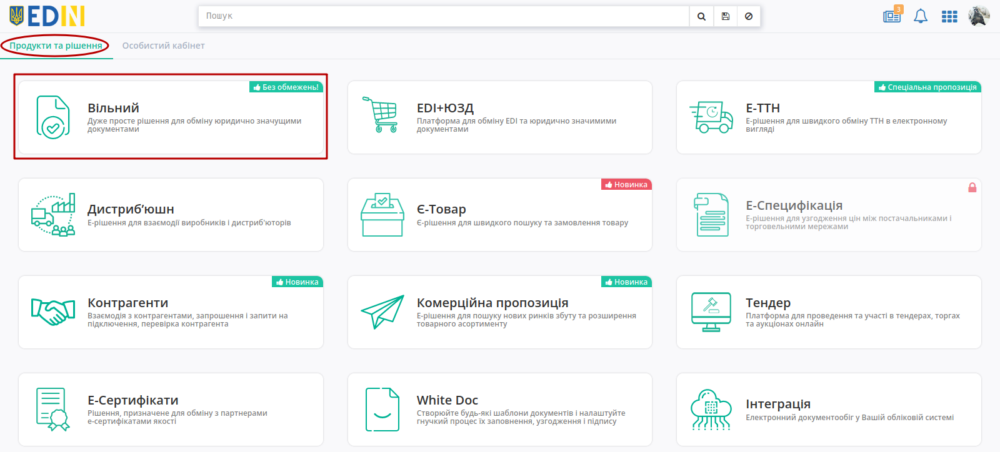
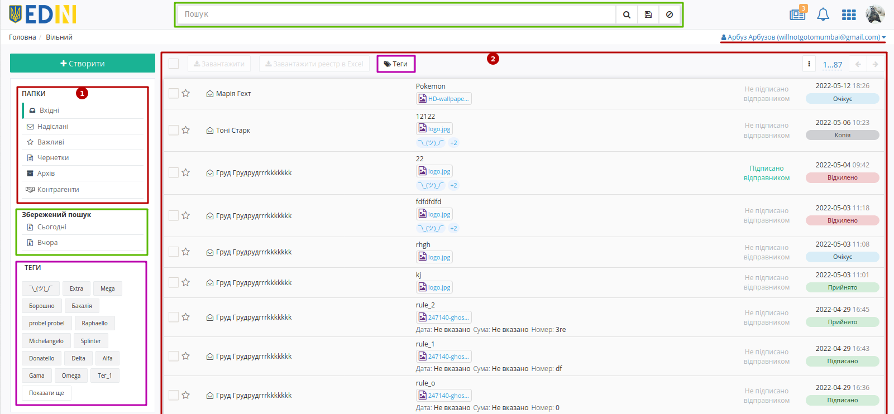
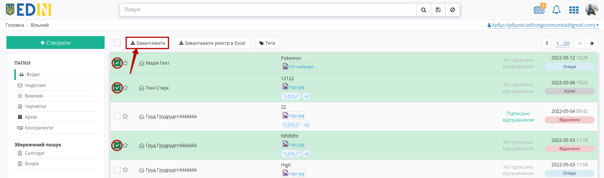
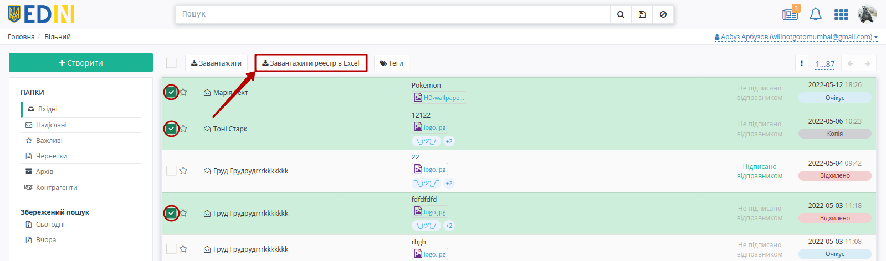
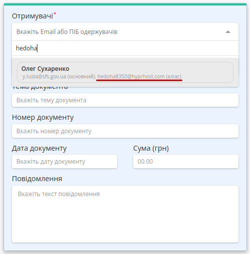
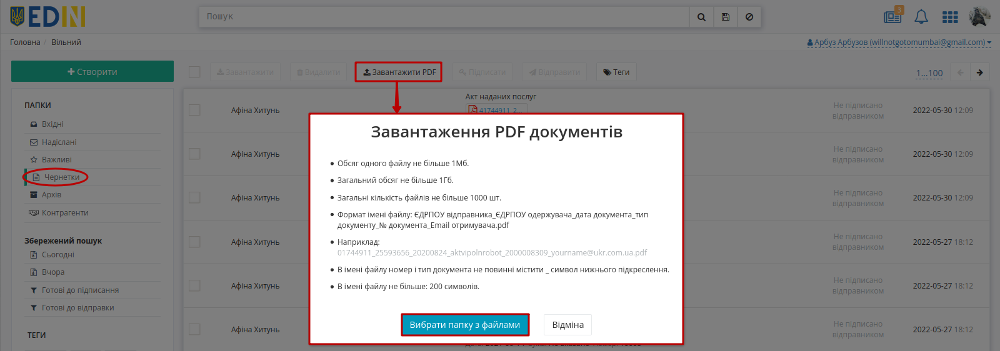
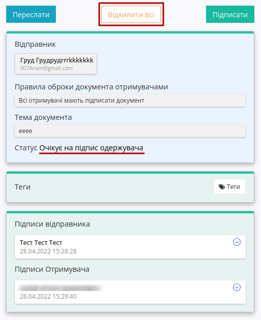

Робота з сервісом Вільний
#############################################################

.. role:: red

.. role:: underline

.. сюда закину немного картинок для текста

.. |пресуха| image:: pics_Work_with_Vilnyi/Work_with_Vilnyi_03.png

.. |звезда2| image:: pics_Work_with_Vilnyi/Work_with_Vilnyi_07.png

.. |прокрутка1| image:: pics_Work_with_Vilnyi/Work_with_Vilnyi_12.png

.. |прокрутка2| image:: pics_Work_with_Vilnyi/Work_with_Vilnyi_11.png

.. |лупа| image:: pics_Work_with_Vilnyi/Work_with_Vilnyi_49.png

.. |save| image:: pics_Work_with_Vilnyi/Work_with_Vilnyi_50.png

.. |yellow_tag| image:: pics_Work_with_Vilnyi/Work_with_Vilnyi_58.png

.. |red_tag| image:: pics_Work_with_Vilnyi/Work_with_Vilnyi_59.png

.. |del_key| image:: signing/del_key2.png

.. |зареєстрований| image:: pics_Work_with_Vilnyi/Work_with_Vilnyi_74.png

.. |незареєстрований| image:: pics_Work_with_Vilnyi/Work_with_Vilnyi_73.png

.. |clock| image:: pics_Work_with_Vilnyi/Work_with_Vilnyi_90.png

.. |round| image:: pics_Work_with_Vilnyi/Work_with_Vilnyi_88.png

.. |accepted| image:: pics_Work_with_Vilnyi/Work_with_Vilnyi_89.png

.. contents:: Зміст:
   :depth: 3

---------

**1 Вхід на платформу**
================================================

Для роботи з WEB сервісом Ви можете використовувати будь-який браузер (рекомендованим є **Google Chrome** останньої версії). Для входу до сервісу платформи необхідно перейти за посиланням https://edo-v2.edin.ua/auth .

При переході за вказаним посиланням відкриється вікно авторизації. Необхідно ввести Ваш логін і пароль користувача і натиснути «**Вхід**»:

.. image:: pics_Work_with_Vilnyi/Work_with_Vilnyi_01.png
   :align: center

.. hint::
   Нові користувачі можуть самостійно пройти "Реєстрацію" на платформі (детальніше в `інструкції <https://wiki.edin.ua/uk/latest/general_2_0/User_registration.html>`__)

Після успішної авторизації відкриється головне меню з сервісами платформи EDIN:

Лівою кнопкою миші потрібно вибрати **"Вільний"**.

.. hint::
   Для повернення до меню сервісів, товарного довідника потрібно натиснути кнопку |пресуха| або натиснувши на логотип EDIN

**2 Загальний вигляд сервісу**
================================================

Зовнішній вигляд сервісу **"Вільний"** складається з кількох наступних основних частин: функціонал переходу по каталогами папок (1), журналу документів (2), пошуку документів (3), кнопки переходу в меню сервісів, вибору мови, `налаштувань користувача <https://wiki.edin.ua/uk/latest/general_2_0/rabota_s_platformoj_EDIN_2.0.html#pers-settings>`__ та виходу з платформи (4).

Якщо у користувача налаштований `доступ до документів сервісу інших співробітників компанії <https://wiki.edin.ua/uk/latest/Personal_Cabinet/PCInstruction.html#shard-entrance>`__, то є можливість переключитись на каталоги тих співробітників і виконувати дії з документами від їх імені:

.. image:: pics_Work_with_Vilnyi/Work_with_Vilnyi_102.gif
   :align: center

**3 Перегляд каталогів платформи**
================================================

В путівнику, а також зеленим маркером відмічене поточне місце перебування користувача в сервісі (при первинному вході - в каталозі **"Вхідних"** документів).

.. image:: pics_Work_with_Vilnyi/Work_with_Vilnyi_05n.png
   :align: center

Для переходу в потрібний Вам каталог необхідно його вибрати:

#. **"Вхідні"** - каталог вхідних документів організації (від контрагентів).
#. **"Надіслані"** - каталог відправлених документів організації (до контрагентів).
#. **"Важливі"** - каталог всіх документів, що були відзначені, як "важливі" символом зірочки ("важливі" |звезда| / |звезда2| "звичайні").
#. **"Чернетки"** - каталог для документів, що були створені, але не були відправлені. 
#. **"Архів"** - каталог для документів, що були перенесені в архів.
#. **"Контрагенти"** - дозволяє знайти своїх незареєстрованих контрагентів та відправити їм запрошення на e-mail.
#. **"Збережений пошук"** - стандартні та створені користувачем комбінації критеріїв пошуку документів для зручної фільтрації документів у вище перерахованих каталогах (детальніше за `посиланням <https://wiki.edin.ua/uk/latest/Vilnyi/Work_with_Vilnyi.html#search>`__).

.. _doc-statuses:

**3.1 Статуси документів**
-------------------------------------------------

В сервісі **"Вільний"** для документів передбачені наступні статуси:

* **Очікує підпису** - Відправник підписав та відправив документ (жоден Отримувач ще не підписав документ);
* **Підписано частково** - Відправник та частина контрагентів-Отримувачів підписали документ;
* **Підписано** - кінцевий статус документа; документ підписано всіма контрагентами-отримувачами;
* **Відхилено** - кінцевий статус документа; документ відхилено одним з контрагентів (документ вважається відхиленим незважаючи на дії інших контрагентів);
* **Не доступна до редагування копія** - "snapshot"-копія документа (містить статус оригіналу й інформацію про підписи на момент формування копії). Жодні дії з документом недоступні (виключення: Відправник може `додавати Отримувачів <https://wiki.edin.ua/uk/latest/Vilnyi/Work_with_Vilnyi.html#new-counterparty-add>`__ до вже відправленої копії).

.. _mass-download:

**3.2 Масове завантаження документів**
-------------------------------------------------

Масове завантаження документів доступне з журналу документів. Для цього потрібно відмітити потрібні документи і натиснути кнопку **"Завантажити"**:

Документи завантажуються у вигляді zip-архівів (найменування архіву = перші 10 символів теми документа + Дата + Час створення). Кожен з архівів містить каталоги (найменування=назві файлу з роширенням) для кожного вкладення. Кожен каталог містить:

* якщо документ не підписаний: оригінал файлу;
* якщо документ підписаний: оригінал файлу та підписаний файл в форматі p7s.

.. note::
   Якщо підписаний документ містить файл в форматі PDF/JPG/JPEG/PNG/BMP, то завантажуваний zip-архів для кожного такого файлу додатково містить друкований макет з візуалізацією підпису в вигляді водяного знаку та листом підписання в форматі pdf (`детальніше <https://wiki.edin.ua/uk/latest/Vilnyi/Work_with_Vilnyi.html#signing-watermark>`__).

.. _reestr:

**3.3 Формування та завантаження реєстру документів**
---------------------------------------------------------

Для бухгалтерського обліку передбачене консолідоване вивантаження даних обраних документів каталога (не більше 100 документів). Для цього потрібно відмітити потрібні документи і натиснути кнопку **"Завантажити реєстр в Excel"**:

Реєстр формується з обраних документів в xlsx-файл з назвою, що формується згідно шаблону: *List_of_documents _НазваПапки_Дата(YYYY-MM-DD)_час(hh-mm-ss)*, наприклад: List_of_documents_Inbox_2021-06-30_12-47-31.xlsx. В реєстр з документів записуються наступні поля: Отримувач (для "Надіслані"/"Важливі"), Відправник (для "Вхідні"/"Важливі"), Ім’я файлу вкладення, Тема документу, Статус, Дата відправки, Дата зміни статусу, Дата документу, Номер документу, Сума документу:

.. image:: pics_Work_with_Vilnyi/Work_with_Vilnyi_70.png
   :align: center

.. note::
   Перезавантаження сторінки може перервати процес формування файлу (файл реєстра не зберігається)! При виникненні помилки в правому верхньому куті екрану відображається повідомлення "Помилка створення реєстра."

**4 Створення і відправка документа**
================================================

Для створення документа на платформі необхідно натиснути кнопку - "**Створити**"

.. image:: pics_Work_with_Vilnyi/Work_with_Vilnyi_08n.png
   :align: center

Після цього на формі створення документа обов'язково потрібно вказати "Отримувачів", "Тему документа" (від 1 до 100 символів) та додати файли-вкладення.

.. note::
   Поля "Номер документу", "Дата документу", "Сума (грн)", "Повідомлення" не є обов'язковими до заповнення.

.. _counterparty-add:

**4.1 Додавання отримувачів**
-------------------------------------------------

Отримувачам документа відображається лише контрагент-Відправник, однак Отримувачам відображається статус документа і загальна кількість

Для вибору потрібних **Отримувачів** (може бути декілька) потрібно в полі почати вводити прізвище, пошту чи ЕДРПОУ контрагента (min 3 символи) і обрати зі списку зареєстрованих на платформі користувачів:

.. image:: pics_Work_with_Vilnyi/Work_with_Vilnyi_13.gif
   :align: center

При введенні в поле Отримувачів пошти, що є аліасом (детальніше про `налаштування аліасів <https://wiki.edin.ua/uk/latest/Personal_Cabinet/PCInstruction.html#alias>`__) відображається ПІБ контрагента, основний email та аліас:

Реалізована можливість вказати Email незареєстрованого на платформі користувача в полі **"Отримувачі"**. При додаванні такого користувача потрібно обрати "Запросити нового користувача" в результатах випадаючого списка:

.. image:: pics_Work_with_Vilnyi/Work_with_Vilnyi_38.png
   :align: center

При відправці документа у відправника з'являється попередження, що потребує підтвердження:

.. image:: pics_Work_with_Vilnyi/Work_with_Vilnyi_39.png
   :align: center

Незареєстрованому отримувачу на вказаний Email відправляється запрошення з посиланням на `реєстрацію <https://wiki.edin.ua/uk/latest/general_2_0/User_registration.html>`__ та вкладеним одним (першим) файлом без підпису:

.. image:: pics_Work_with_Vilnyi/Work_with_Vilnyi_68.png
   :align: center

Також :underline:`незареєстрованим отримувачам` на Email приходять нагадування про запрошення на наступний день, 3-ій, 6-ий, 12-ий та 27-ий зі списком відправників та темами повідомлень:

.. image:: pics_Work_with_Vilnyi/Work_with_Vilnyi_60.png
   :align: center

Також можливе масове додавання зареєстрованих / незареєстрованих Отримувачів, скопіювавши (Ctrl+C) список (значення через кому, пробіл чи крапку з комою) потрібних Email-адрес та вставши (Ctrl+V) їх з буфера обміну:  

.. image:: pics_Work_with_Vilnyi/Work_with_Vilnyi_67.gif
   :align: center

.. _files-add:

**4.2 Додавання файлів**
-------------------------------------------------

Файли можливо додати з локального носія через кнопку "Додати файл" чи "Drag-and-drop" способом:

.. image:: pics_Work_with_Vilnyi/Work_with_Vilnyi_09n.png
   :align: center

.. note::
   Один документ може містити не більше 10 файлів в наступних форматах: PDF/JPG/JPEG/PNG/BMP/DOC/DOCX/XLS/XLSX/PPT/PPTX/CSV/TXT/XML/P7S (попередній перегляд працює лише для PDF/JPG/JPEG/PNG/BMP/TXT/XML) з розміром файлу не більше 5 Мб.

При додаванні більше 3 файлів частина файлів прихована за стрілками прокручування (|прокрутка1| |прокрутка2|). Для доданих файлів доступний попередній перегляд їх вмісту:

.. image:: pics_Work_with_Vilnyi/Work_with_Vilnyi_10n.gif
   :align: center

При перегляді доданого файлу можливо масштабувати попередній перегляд файлу (1), використовувати пагінацію сторінок (2), роздрукувати макет з візуалізацією підпису в вигляді водяного знаку та листом підписання (3) |print| (кнопка активна лише для файлів в форматі PDF/JPG/JPEG/PNG/BMP), завантажити (4) |download| чи видалити (5) |trash| файл.

.. image:: pics_Work_with_Vilnyi/Work_with_Vilnyi_51.png
   :align: center

.. note::
   При завантаженні (4) |download| файлу:

   * якщо документ НЕ підписано, то завантажується лише оригінал файлу;
   * якщо документ підписано, то завантажується zip-архів (найменування архіву = назва файлу + Дата + Час створення), що містить оригінал файлу та підписаний файл в форматі p7s;
   * якщо документ підписано і файл має розширення формату PDF/JPG/JPEG/PNG/BMP, то завантажується zip-архів (найменування архіву = назва файлу + Дата + Час створення), що містить оригінал файлу, підписаний файл в форматі p7s та друкований макет з візуалізацією підпису в вигляді водяного знаку та листом підписання в форматі pdf (`детальніше <https://wiki.edin.ua/uk/latest/Vilnyi/Work_with_Vilnyi.html#signing-watermark>`__).

Після додавання файлу/-ів та заповнення всіх обов'язковий полей можливо масово **"Підписати всі"** файли документа та **"Відправити"** документ (також можливо "Відправити документ без підписання"). При відправці непідписанного документа з'являється підказка, що потребує підтвердження дії:

.. image:: pics_Work_with_Vilnyi/Work_with_Vilnyi_14.png
   :align: center

Однак "Підписати" файли документа можливо і після відправки документа (якщо він не був відхилений):

Підписання Відправника не є обов'язковим, однак такий функціонал дозволяє реалізувати схеми документообігу, в яких Отримувач першим виконує підписання.

.. _mass-pdf:

**4.3 Масове завантаження pdf-файлів**
-------------------------------------------------

В каталозі **"Чернетки"** можливо масово завантажити pdf-файли за допомогою кнопки **"Завантажити PDF"**. Після натискання кнопки в popup вікні вказуються правила до завантаження: 

Для вибору та завантаження pdf-файлів потрібно вказати папку, в якій знаходяться ці файли (кнопка **"Вибрати папку з файлами"**), після чого відобразиться процес завантаження:

Процес завантаження можливо перервати кнопкою **"Зупинити процес завантаження"**. Навпроти кожного документа показується відмітка статусу завантаження конкретного файлу:

* |clock| - файл в черзі;
* |round| - файл в процесі обробки/завантаження;
* |accepted| - файл успішно завантажено;
* |denied| - помилка завантаження файлу (такий файл супроводжується детальним описом причини помилки):

.. image:: pics_Work_with_Vilnyi/Work_with_Vilnyi_91.png
   :align: center

Після того, як процес завантаженя завершено можливо ознайомитись з результатом (за потреби виправити помилки, що могли виниктути при завантаженні) та **"Закрити"** вікно результатів завантаження:

.. image:: pics_Work_with_Vilnyi/Work_with_Vilnyi_86.png
   :align: center

.. _sign:

**4.4 Підписання та відправка документа**
-------------------------------------------------

Для підписання при перегляді документа необхідно натиcнути на кнопку **"Підписати всі"**:

.. image:: pics_Work_with_Vilnyi/Work_with_Vilnyi_15n.png
   :align: center

.. note::
   Також в папці **Чернетки** доступний функціонал масового підписання (не більше 100 документів). Для цього потрібно спочатку відібрати всі готові до підписання документи (непідписані документи з вкладеннями) за допомогою зручного фільтра **"Готові до підписання"** (1): 

   .. image:: pics_Work_with_Vilnyi/Work_with_Vilnyi_93.png
      :align: center

   Далі потрібно відмітити бажані документи зі списку для того, щоб **"Підписати"** (2) їх:

   .. image:: pics_Work_with_Vilnyi/Work_with_Vilnyi_94.png
      :align: center

Після ініціалізації бібліотеки підписання, система надасть можливість додати ключ для підписання. При :underline:`першому` підписанні у модальному вікні потрібно обрати файл чи токен (1), ввести пароль (2) та натиснути **"Зчитати"** (3) ключ для підписання:

.. image:: signing/file1n.png
   :align: center

.. image:: signing/file2n.png
   :align: center

При успішному додаванні ключа автоматично відобразиться особа, від імені якої буде здійснено підписання. У користувача може бути додано кілька ключів - для вибору потрібного для здійснення операції підписання потрібно проставити відмітку (4) лівою кнопкою миші і натиснути **"Підписати"** (5):

.. image:: signing/file3n.png
   :align: center

.. important::
   Якщо підписання цим ключем вже було здійснено або знайдена невідповідність даних ЄДРПОУ/ІПН (перевірка), то підписання блокується, а користувачу виводиться відповідне повідомлення:

.. image:: signing/wrong_key.png
   :align: center

Додатково в вікні підписання можливо натиснути **"Детальніше"** для того, щоб переглянути інформацію про підписанта; можливо видалити помилкові ключі (|del_key|).

При подальшій роботі з раніше доданим ключем/-ами потрібно вводити лише пароль для обраного ключа:

.. image:: signing/file4n.png
   :align: center

.. image:: signing/file5n.png
   :align: center

.. attention::
   При масовому підписанні наноситься лише один підпис за раз. При додаванні/видаленні файлів в/з документа - раніше накладені підписи видаляються!

.. note::
   При масовому підписанні відображається процес підписання, який можливо перервати кнопкою **"Зупинити процес підписання"**:

   .. image:: pics_Work_with_Vilnyi/Work_with_Vilnyi_96.png
      :align: center

   Навпроти кожного документа показується відмітка статусу підписання:

   * |clock| - документ в черзі;
   * |round| - документ в процесі підписання;
   * |accepted| - документ успішно підписано;
   * |denied| - помилка підписання.

   Після того, як процес підписання завершено можливо ознайомитись з результатом та **"Закрити"** вікно результатів підписання:

   .. image:: pics_Work_with_Vilnyi/Work_with_Vilnyi_95.png
      :align: center

.. _signing-watermark:

.. note::
   Після підписання файлів в форматах PDF, JPG (JPEG), PNG, BMP при їх попередньому перегляді додається водяний знак в верхньому лівому куті кожної сторінки файлу, а також додається сторінка листа підписання:

   .. image:: pics_Work_with_Vilnyi/Work_with_Vilnyi_53.png
      :align: center
   
   Водяний знак містить інформацію, про те що файл було підписано в EDI Network, GUID документа та поточну сторінку файлу.

   .. image:: pics_Work_with_Vilnyi/Work_with_Vilnyi_54.png
      :align: center

   Лист підписання містить посилання та QR-код для скачування архіва документа, інформацію по документу та його підписантів.

Після підписання під даними документа відображається інформація щодо підписантів. Для відправки документів потрібно натиснути на кнопку **"Відправити"**.

.. image:: pics_Work_with_Vilnyi/Work_with_Vilnyi_55.png
   :align: center

.. note::
   Також в папці **Чернетки** доступний функціонал масової відправки (не більше 100 документів). Для цього потрібно спочатку відібрати всі готові до відправки документи (документи з вкладеннями, заповненими полями "Отримувач" і "Тема") за допомогою зручного фільтра **"Готові до відправки"** (1): 

   .. image:: pics_Work_with_Vilnyi/Work_with_Vilnyi_97.png
      :align: center

   Далі потрібно відмітити бажані документи зі списку для того, щоб **"Відправити"** (2) їх:

   .. image:: pics_Work_with_Vilnyi/Work_with_Vilnyi_98.png
      :align: center

   Якщо серед обраних до відправки документів є непідписані документи та/або незареєстровані користувачі, то вказується загальна кількість таких документів і таку відправку потрібно **"Підтвердити"**:

   .. image:: pics_Work_with_Vilnyi/Work_with_Vilnyi_101.png
      :align: center

   При масовій відправці відображається вікно відправки - процес можливо перервати кнопкою **"Зупинити процес відправки"**:

   .. image:: pics_Work_with_Vilnyi/Work_with_Vilnyi_99.png
      :align: center

   Навпроти кожного документа показується відмітка статусу відправки:

   * |clock| - документ в черзі;
   * |round| - документ в процесі відправки;
   * |accepted| - документ успішно відправлено;
   * |denied| - помилка відправки.

   Після того, як процес відправки завершено можливо ознайомитись з результатом та **"Закрити"** вікно результатів відправки:

   .. image:: pics_Work_with_Vilnyi/Work_with_Vilnyi_100.png
      :align: center

В випадку підписання документа Відправником (після відправки документа) на Email приходить повідомлення всім Отримувачам:

.. image:: pics_Work_with_Vilnyi/Work_with_Vilnyi_110.png
   :align: center

Після відправки документа контрагентам він відображається в журналі надісланих документів і має статус **Очікує підпису** (кнопки додавання файлів та підписання не активні):

.. note::
   Надіслані документи мають мітки (з підказками при наведенні курсора):

   * |yellow_tag| - "Частково доставлено" (серед отримувачів є зареєстровані і незареєстровані користувачі)
   * |green_tag| - "Доставлено" (всі отримувачі зареєстровані на платформі)
   * |red_tag| - "Очікуємо реєстрації отримувача" (всі отримувачі - незареєстровані користувачі)

Також при відправці документа, на вказаний e-mail **"Отримувача"** відправляється лист:

.. image:: pics_Work_with_Vilnyi/Work_with_Vilnyi_36n.png
   :align: center

.. _new-counterparty-add:

**5 Додавання отримувачів до відправленого документа**
===================================================================

.. attention::
   Лише Відправник документа має можливість додавати нових контрагентів. Додавання отримувачів до вже відправленого документа можливо поки документ (оригінал) знаходиться в статусі **Очікує підпису** / **Підписано частково** (`детальніше про статуси документів <https://wiki.edin.ua/uk/latest/Vilnyi/Work_with_Vilnyi.html#doc-statuses>`__).

Для цього Відправнику потрібно перейти у документ і натиснути кнопку **"+Додати"**:

.. image:: pics_Work_with_Vilnyi/Work_with_Vilnyi_63.png
   :align: center

Пошук і додавання нового отримувача аналогічно `формуванню нового документа <https://wiki.edin.ua/uk/latest/Vilnyi/Work_with_Vilnyi.html#counterparty-add>`__ (з можливістю додавання незареєстрованого учасника):

Документ відправляється новим контрагентам кнопкою **"Відправити"**.

.. _forward-doc:

**6 Переслати**
================================================

"Вхідні" чи "Надіслані" документи можливо **"Переслати"**:

.. image:: pics_Work_with_Vilnyi/Work_with_Vilnyi_23.png
   :align: center

Пошук і додавання нового отримувача аналогічно `формуванню нового документа <https://wiki.edin.ua/uk/latest/Vilnyi/Work_with_Vilnyi.html#counterparty-add>`__ (з можливістю додавання незареєстрованого учасника):

При цьому формується "snapshot"-копія документа зі статусом "Не доступна до редагування копія" (містить статус оригіналу й інформацію про підписи на момент формування копії):

.. image:: pics_Work_with_Vilnyi/Work_with_Vilnyi_65.png
   :align: center

Жодні дії з документом-копією недоступні (окрім можливості завантажити вкладення).

.. _search:

**7 Пошук і фільтрація документів**
================================================

**7.1 Пошук документів**
-------------------------------------------------

Фільтрування документів в сервісі зручно здійснювати за допомогою функціоналу **"Пошук"** (всі "Доступні ключі пошуку" можливо переглянути в один клік):

.. image:: pics_Work_with_Vilnyi/Work_with_Vilnyi_23.png
   :align: center

.. image:: pics_Work_with_Vilnyi/Work_with_Vilnyi_48.png
   :align: center

Потрібно обрати/ввести параметр (кілька параметрів вводяться через кому), текст за потреби і натиснути |лупа|. Часто використовувані пошукові запити для зручності рекомендовано зберігати (|save|) до власного пошуку (блок "**Збережений пошук**"):

.. image:: pics_Work_with_Vilnyi/Work_with_Vilnyi_45.png
   :align: center

Збережений пошук відноситься тільки до певного статусу документа: "Вхідні", "Надіслані". У блоці "Збережений пошук" за замовчуванням доступні фільтри по документам за сьогодні та вчора. Вилучити збережений пошук можна за допомогою хрестика. Очистити рядок "Пошук" можна за допомогою кнопки **"Скинути фільтри"** |non| . При переході між папками "Вхідні", "Надіслані" пошуковий рядок очищається. Якщо користувач відфільтрував список документів, після чого перейшов до перегляду цього документа та повернувся назад, — пошук зберігається.

.. image:: pics_Work_with_Vilnyi/Work_with_Vilnyi_27.png
   :align: center

**7.2 Швидкі фільтри по документам**
-------------------------------------------------

Кнопка швидкої фільтрації доступна для папок "Вхідні" та "Надіслані" і розташована в правому верхньому куті журнала документів:

Для "Вхідні":

* Всі - всі вхідні документи;
* Непрочитані - документи, що ще не були переглянуті (відкриті);
* Прочитані - документи, що вже були переглянуті (відкриті).

Для "Надіслані":

* Всі - всі надіслані (вихідні) документи;
* Доставлені - документи, всі Отримувачі яких отримали документ (відмічені |green_tag|);
* Помилка - документи з помилками (Отримувачі їх не отримають);
* Відправлені - надіслані (вихідні) документи, що очікують дій Отримувачів (в статусі "Очікує підпису"). 

.. hint::
   Значення фільтру дублюється в рядок пошуку і зберігається при переході між папками під час даної сесії.

**8 Робота з вхідними документами**
================================================

Всі непрочитані **"Вхідні"** документи відображаються жирним шрифтом:

.. image:: pics_Work_with_Vilnyi/Work_with_Vilnyi_28n.png
   :align: center

При переході в сам документ відкриваються дані про підписанта, файли доступні до перегляду та скачування (|download|), а сам з документом можливо виконати наступні дії: **"Відхилити всі"** підписані файли чи **"Підписати"** їх у відповідь:

.. image:: pics_Work_with_Vilnyi/Work_with_Vilnyi_30n.png
   :align: center

.. hint::
   Процес **Підписання** "Отримувачем" документа не відрізняється від підписання "Відправника" та описаний в `розділі вище <https://wiki.edin.ua/uk/latest/ProstoDoc/Work_with_Vilnyi.html#sign>`__ .

Після підписання документ змінює свій статус на:

* **"Підписано частково"**, якщо є інші отримувачі, що ще не наклали свій підпис;
* **"Підписано"**, якщо решта учасників вже підписали документ.

.. Підписаний документ можливо лише **"Переслати"** (кнопки відхилення файлів та підписання не активні):

При підписанні документа Отримувачем на email Відправника приходить лист-сповіщення:

.. image:: pics_Work_with_Vilnyi/Work_with_Vilnyi_108.png
   :align: center

Документообіг завершуєтся, коли документ змінює свій статус на **"Підписано"**.

**8.1 Відхилення вхідного документа**
================================================

.. attention::
   Якщо один з отримувачів **відхилить** документ до того, як він буде підписаний усіма учасниками (документ в статусі  **"Очікує підпису"** чи **"Підписано частково"**) документ змінює свій статус на **"Відхилено"** для всіх учасників. Відхилений документ не підписується, а контрагент, що виконав відхилення зазначається під статусом.

Для відхилення всіх підписаних файлів потрібно відкрити сам документ і натиснути кнопку **"Відхилити всі"**:

При відхиленні потрібно обов'язково вказати причину відхилення та **"Відправити"**:

.. image:: pics_Work_with_Vilnyi/Work_with_Vilnyi_34.png
   :align: center

Після відхилення документ змінює свій статус на **"Відхилено"**.

.. Відхилений документ можливо лише **"Переслати"** (кнопки відхилення файлів та підписання не активні):

.. image:: pics_Work_with_Vilnyi/Work_with_Vilnyi_43.png
   :align: center

При відхиленні документа на email Відправника приходить лист-сповіщення:

.. image:: pics_Work_with_Vilnyi/Work_with_Vilnyi_109.png
   :align: center

Документообіг завершено.

.. _contractors:

**9 Контрагенти (відправка запрошень)**
================================================

Розділ дозволяє знайти своїх незареєстрованих контрагентів та масово відправити їм запрошення на e-mail. Для початку потрібно долучити контрагентів до журналу - це можливо зробити за допомогою кнопки **"Створити контрагента"**, після чого **"Зберегти"** дані в журналі:

.. image:: pics_Work_with_Vilnyi/Work_with_Vilnyi_77.png
   :align: center

Також розроблено функціонал масового завантаження e-mail адрес через xls-файл, що повинен відповідати шаблону. Для коректного додавання даних спочатку потрібно завантажити **"Шаблон"** (1), орієнтуючись на який буде можливо без помилок долучити список своїх контрагентів кнопкою **"З Excel"** (2):

.. image:: pics_Work_with_Vilnyi/Work_with_Vilnyi_71.png
   :align: center

Дані контрагентів в журналі можливо відредагувати:

.. attention::
   Якщо Excel-документ містить поля з помилками чи невідповідним шаблону змістом, то такі поля виділяються жовтим кольором, виводиться повідомлення про необхідність внесення правок (такі поля можливо видалити кнопкою |trash2|):

   .. image:: pics_Work_with_Vilnyi/Work_with_Vilnyi_80.png
      :align: center

   При редагуванні конкретного рядка вказується помилка:

   .. image:: pics_Work_with_Vilnyi/Work_with_Vilnyi_82.png
      :align: center

   .. image:: pics_Work_with_Vilnyi/Work_with_Vilnyi_83.png
      :align: center

Після того, як контрагенти успішно завантажені сервіс **"Вільний"** перевіряє введені адреси, чи зареєстровані вони в сервісі і проставляє "Статус реєстрації" (зареєстрований |зареєстрований| чи незареєстрований |незареєстрований|):

Кожного з незареєстрованих контрагентів |незареєстрований| можливо **"Запросити"** індивідуально клікаючи на кнопку в рядку контрагента чи масово: відмітивши незареєстрованих контрагентів |незареєстрований| та надіславши **"Запрошення"** всім одразу:

Незареєстрованим контрагентам на e-mail відправляється запрошення:

.. image:: pics_Work_with_Vilnyi/Work_with_Vilnyi_84.png
   :align: center

Після відправки запрошення проставляється дата його відправлення зі статусом "Відправлено":

.. image:: pics_Work_with_Vilnyi/Work_with_Vilnyi_78.png
   :align: center

Після того, як запрошений користувач пройде реєстрацію в полі запрошення з'явиться відмітка зареестрованого користувача |зареєстрований| - такому користувачу немає можливості повторно відправити запрошення:

----------------------------
   
.. include:: kontakti.rst
