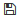

Робота з сервісом Вільний
#############################################################

.. role:: red

.. role:: underline

.. сюда закину немного картинок для текста

.. |пресуха| image:: pics_Work_with_Vilnyi/Work_with_Vilnyi_03.png

.. |звезда| image:: pics_Work_with_Vilnyi/Work_with_Vilnyi_06.png

.. |прокрутка1| image:: pics_Work_with_Vilnyi/Work_with_Vilnyi_12.png

.. |download| image:: pics_Work_with_Vilnyi/Work_with_Vilnyi_17.png

.. |trash| image:: pics_Work_with_Vilnyi/Work_with_Vilnyi_18.png

.. |print| image:: pics_Work_with_Vilnyi/Work_with_Vilnyi_52.png

.. |non| image:: pics_Work_with_Vilnyi/Work_with_Vilnyi_21.png

.. |лупа| image:: pics_Work_with_Vilnyi/Work_with_Vilnyi_49.png

.. |del_key| image:: signing/del_key2.png

.. contents:: Зміст:
   :depth: 3

---------

**1 Вхід на платформу**
================================================

Для роботи з WEB сервісом Ви можете використовувати будь-який браузер (рекомендованим є **Google Chrome** останньої версії). Для входу до сервісу платформи необхідно перейти за посиланням https://edo-v2.edin.ua/auth .

При переході за вказаним посиланням відкриється вікно авторизації. Необхідно ввести Ваш логін і пароль користувача і натиснути «**Вхід**»:

.. image:: pics_Work_with_Vilnyi/Work_with_Vilnyi_01.png
   :align: center

.. hint::
   Нові користувачі можуть самостійно пройти "Реєстрацію" на платформі (детальніше в `інструкції <https://wiki.edin.ua/uk/latest/general_2_0/User_registration.html>`__)

Після успішної авторизації відкриється головне меню з сервісами платформи EDIN:

.. image:: pics_Work_with_Vilnyi/Work_with_Vilnyi_02n.png
   :align: center

Лівою кнопкою миші потрібно вибрати **"Вільний"**.

.. hint::
   Для повернення до меню сервісів, товарного довідника потрібно натиснути кнопку |пресуха| або натиснувши на логотип EDIN

**2 Загальний вигляд сервісу**
================================================

Зовнішній вигляд сервісу **"Вільний"** складається з кількох наступних основних частин: функціонал переходу по каталогами папок (1), журналу документів (2), пошуку документів (3), кнопки переходу в меню сервісів, вибору мови, `налаштувань користувача <https://wiki.edin.ua/uk/latest/general_2_0/rabota_s_platformoj_EDIN_2.0.html#pers-settings>`__ та виходу з платформи (4).

.. image:: pics_Work_with_Vilnyi/Work_with_Vilnyi_46.png
   :align: center

**3 Перегляд каталогів платформи**
================================================

В путівнику, а також зеленим маркером відмічене поточне місце перебування користувача в сервісі (при первинному вході - в каталозі "**Вхідних**" документів).

.. image:: pics_Work_with_Vilnyi/Work_with_Vilnyi_05n.png
   :align: center

Для переходу в потрібний Вам каталог необхідно його вибрати:

#. **"Вхідні"** - каталог вхідних документів організації (від контрагентів).
#. **"Надіслані"** - каталог відправлених документів організації (до контрагентів).
#. **"Важливі"** - каталог всіх документів, що були відзначені, як "важливі" символом зірочки ("важливі" |звезда| / |звезда2| "звичайні").
#. **"Чернетки"** - каталог для документів, що були створені, але не були відправлені. 
#. **"Архів"** - каталог для документів, що були перенесені в архів.
#. **"Збережений пошук"** - стандартні та створені користувачем комбінації критеріїв пошуку документів для зручної фільтрації документів у вище перерахованих каталогах (детальніше за `посиланням <https://wiki.edin.ua/uk/latest/Vilnyi/Work_with_Vilnyi.html#search>`__).

.. _mass-download:

**3.1 Масове завантаження документів**
-------------------------------------------------

Масове завантаження документів доступне з журналу документів. Для цього потрібно відмітити потрібні документи і натиснути кнопку **"Завантажити"**:

.. image:: pics_Work_with_Vilnyi/Work_with_Vilnyi_44.png
   :align: center

Документи завантажуються у вигляді zip-архівів (найменування архіву = перші 10 символів теми документа + Дата + Час створення). Кожен з архівів містить каталоги (найменування=назві файлу з роширенням) для кожного вкладення. Кожен каталог містить:

* якщо документ не підписаний: оригінал файлу-вкладення;
* якщо документ підписаний: оригінал файлу-вкладення та підписаний файл в форматі p7s.

**4 Створення документа**
================================================

Для створення документа на платформі необхідно натиснути кнопку - "**Створити**"

.. image:: pics_Work_with_Vilnyi/Work_with_Vilnyi_08n.png
   :align: center

Після цього на формі створення документа обов'язково потрібно вказати "Отримувача", "Тему документа" (від 1 до 100 символів) та додати файли-вкладення.

**4.1 Додавання отримувачів**
-------------------------------------------------

Для вибору потрібних **Отримувачів** (може бути декілька) потрібно в полі почати вводити прізвище, пошту чи ЕДРПОУ контрагента (min 3 символи) і обрати зі списку зареєстрованих на платформі користувачів:

.. image:: pics_Work_with_Vilnyi/Work_with_Vilnyi_13.gif
   :align: center

Реалізована можливість вказати Email незареєстрованого на платформі користувача в полі **"Отримувачі"**. При додаванні такого користувача потрібно обрати "Запросити нового користувача" в результатах випадаючого списка:

.. image:: pics_Work_with_Vilnyi/Work_with_Vilnyi_37.png
   :align: center

При відправці документа у відправника з'являється попередження, що потребує підтвердження:

.. image:: pics_Work_with_Vilnyi/Work_with_Vilnyi_39.png
   :align: center

Незареєстрованому отримувачу на вказаний Email відправляється запрошення з посиланням на `реєстрацію <https://wiki.edin.ua/uk/latest/general_2_0/User_registration.html>`__):

.. image:: pics_Work_with_Vilnyi/Work_with_Vilnyi_47.png
   :align: center

**4.2 Додавання файлів**
-------------------------------------------------

Файли можливо додати з локального носія через кнопку "Додати файл" чи "Drag-and-drop" способом:

.. image:: pics_Work_with_Vilnyi/Work_with_Vilnyi_09n.png
   :align: center

.. note::
   Один документ може містити не більше 10 файлів в наступних форматах: PDF/JPG/JPEG/PNG/BMP/DOC/DOCX/XLS/XLSX/PPT/PPTX/CSV/TXT/XML/P7S (попередній перегляд працює лише для PDF/JPG/JPEG/PNG/BMP/TXT/XML) з розміром файлу не більше 5 Мб.

При додаванні більше 3 файлів частина файлів прихована за стрілками прокручування (|прокрутка1| |прокрутка2|). Для доданих файлів доступний попередній перегляд їх вмісту:

.. image:: pics_Work_with_Vilnyi/Work_with_Vilnyi_10n.gif
   :align: center

При перегляді доданого файлу можливо масштабувати попередній перегляд файлу (1), використовувати пагінацію сторінок (2), роздрукувати |print| (доступно лише для документів в форматі PDF, JPG (JPEG), PNG, BMP), завантажити |download| (логіка отримання файлів описана в `масовому завантаженні <https://wiki.edin.ua/uk/latest/Vilnyi/Work_with_Vilnyi.html#mass-download>`__) чи видалити (|trash|) файл (3).

.. image:: pics_Work_with_Vilnyi/Work_with_Vilnyi_51.png
   :align: center

Після додавання файлу/-ів та заповнення всіх обов'язковий полей можливо масово **"Підписати всі"** файли документа та **"Відправити"** документ (також можливо "Відправити документ без підписання"). При відправці непідписанного документа з'являється підказка, що потребує підтвердження дії:

.. _sign:

**4.3 Підписання та відправка документа**
-------------------------------------------------

Для підписання необхідно натинути на кнопку **"Підписати всі"**:

.. image:: pics_Work_with_Vilnyi/Work_with_Vilnyi_15n.png
   :align: center

Після ініціалізації бібліотеки підписання, система надасть можливість додати ключ для підписання. При :underline:`першому` підписанні у модальному вікні потрібно обрати файл чи токен (1), ввести пароль (2) та натиснути **"Зчитати"** (3) ключ для підписання:

.. image:: signing/file1n.png
   :align: center

.. image:: signing/file2n.png
   :align: center

При успішному додаванні ключа автоматично відобразиться особа, від імені якої буде здійснено підписання. У користувача може бути додано кілька ключів - для вибору потрібного для здійснення операції підписання потрібно проставити відмітку (4) лівою кнопкою миші і натиснути **"Підписати"** (5):

.. image:: signing/file3n.png
   :align: center

.. important::
   Якщо підписання цим ключем вже було здійснено або знайдена невідповідність даних ЄДРПОУ/ІПН (перевірка), то підписання блокується, а користувачу виводиться відповідне повідомлення:

.. image:: signing/wrong_key.png
   :align: center

Додатково в вікні підписання можливо натиснути **"Детальніше"** для того, щоб переглянути інформацію про підписанта; можливо видалити помилкові ключі (|del_key|).

При подальшій роботі з раніше доданим ключем/-ами потрібно вводити лише пароль для обраного ключа:

.. image:: signing/file4n.png
   :align: center

.. image:: signing/file5n.png
   :align: center

.. attention::
   Один користувач може накласти не більше 2 унікальних підписів. При додаванні/видаленні файлів в/з документа - раніше накладені підписи видаляються!

Після підписання під даними документа відображається інформація щодо підписантів. Для відправки документів потрібно натиснути на кнопку **"Відправити"**.

.. image:: pics_Work_with_Vilnyi/Work_with_Vilnyi_22n.png
   :align: center

Після відправки документа контрагентам він відображається в журналі надісланих документів і має статус **"Очікує підпису"** (кнопки додавання файлів та підписання не активні):

.. Відправлений документ можливо лише **"Переслати"** - функціонал поки в розробці 

.. image:: pics_Work_with_Vilnyi/Work_with_Vilnyi_19n.png
   :align: center

.. image:: pics_Work_with_Vilnyi/Work_with_Vilnyi_20n.png
   :align: center

Також при відправці документа, на вказаний e-mail **"Отримувача"** відправляється лист:

.. image:: pics_Work_with_Vilnyi/Work_with_Vilnyi_36n.png
   :align: center

.. _search:

**5 Пошук документів**
================================================

Фільтрування документів в сервісі зручно здійснювати за допомогою функціоналу **"Пошук"** (всі "Доступні ключі пошуку" можливо переглянути в один клік):

.. image:: pics_Work_with_Vilnyi/Work_with_Vilnyi_23.png
   :align: center

.. image:: pics_Work_with_Vilnyi/Work_with_Vilnyi_48.png
   :align: center

Потрібно обрати/ввести параметр (кілька параметрів вводяться через кому), текст за потреби і натиснути |лупа|. Часто використовувані пошукові запити для зручності рекомендовано зберігати (|save|) до власного пошуку (блок "**Збережений пошук**"):

.. image:: pics_Work_with_Vilnyi/Work_with_Vilnyi_45.png
   :align: center

Збережений пошук відноситься тільки до певного статусу документа: "Вхідні", "Вихідні". У блоці "Збережений пошук" за замовчуванням доступні фільтри по документам за сьогодні та вчора. Вилучити збережений пошук можна за допомогою хрестика. Очистити рядок "Пошук" можна за допомогою кнопки **"Скинути фільтри"** |non| . При переході між папками "Вхідні", "Вихідні" пошуковий рядок очищається. Якщо користувач відфільтрував список документів, після чого перейшов до перегляду цього документа та повернувся назад, — пошук зберігається.

**6 Робота з вхідними документами**
================================================

Всі непрочитані **"Вхідні"** документи відображаються жирним шрифтом:

.. image:: pics_Work_with_Vilnyi/Work_with_Vilnyi_28n.png
   :align: center

При переході в сам документ відкриваються дані про підписанта, файли доступні до перегляду та скачування (|download|), а сам з документом можливо виконати наступні дії: **"Відхилити всі"** підписані файли чи **"Підписати"** їх у відповідь:

.. image:: pics_Work_with_Vilnyi/Work_with_Vilnyi_30n.png
   :align: center

.. hint::
   Процес **Підписання** "Отримувачем" документа не відрізняється від підписання "Відправника" та описаний в `розділі вище <https://wiki.edin.ua/uk/latest/ProstoDoc/Work_with_Vilnyi.html#sign>`__ .

Після підписання документ змінює свій статус на:

* **"Підписано частково"**, якщо є інші отримувачі, що ще не наклали свій підпис (кожен користувач може накласти не більше 2 унікальних підписів);
* **"Підписано"**, якщо решта учасників вже підписали документ.

.. Підписаний документ можливо лише **"Переслати"** (кнопки відхилення файлів та підписання не активні):

.. image:: pics_Work_with_Vilnyi/Work_with_Vilnyi_32.png
   :align: center

Документообіг завершуєтся, коли документ змінює свій статус на **"Підписано"**.

**6.1 Відхилення вхідного документа**
================================================

.. attention::
   Якщо один з отримувачів **відхилить** документ до того, як він буде підписаний усіма учасниками (документ в статусі  **"Очікує підпису"** чи **"Підписано частково"**) документ змінює свій статус на **"Відхилено"** для всіх учасників. Відхилений документ не підписується, а контрагент, що виконав відхилення зазначається під статусом.

Для відхилення всіх підписаних файлів потрібно відкрити сам документ і натиснути кнопку **"Відхилити всі"**:

.. image:: pics_Work_with_Vilnyi/Work_with_Vilnyi_42.png
   :align: center

При відхиленні потрібно обов'язково вказати причину відхилення та **"Відправити"**:

.. image:: pics_Work_with_Vilnyi/Work_with_Vilnyi_34.png
   :align: center

Після відхилення документ змінює свій статус на **"Відхилено"**.

.. Відхилений документ можливо лише **"Переслати"** (кнопки відхилення файлів та підписання не активні):

.. image:: pics_Work_with_Vilnyi/Work_with_Vilnyi_43.png
   :align: center

Документообіг завершено.

----------------------------
   
.. include:: kontakti.rst
