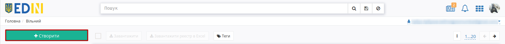
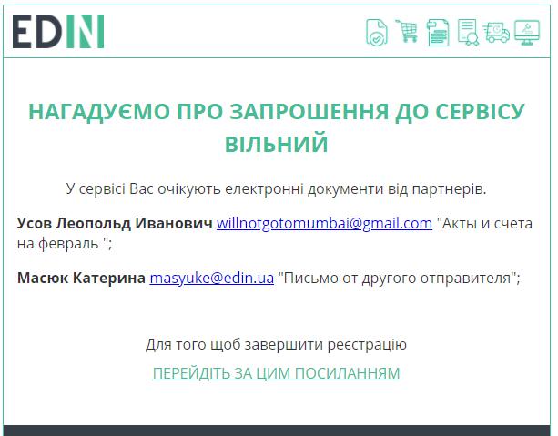
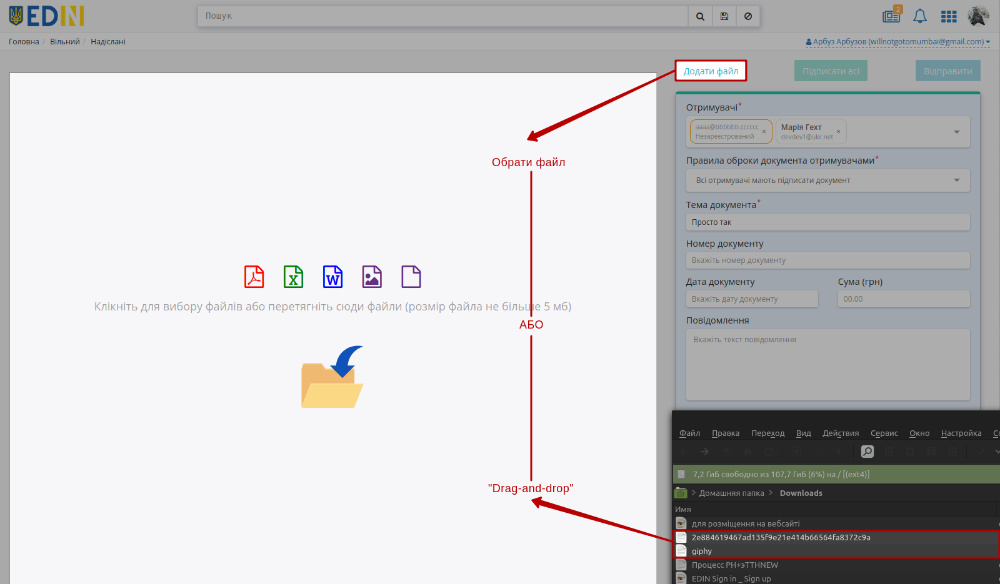
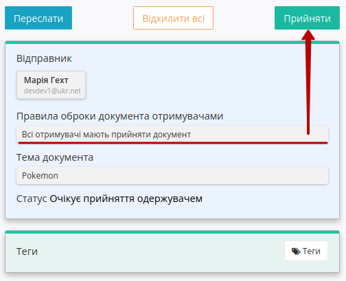
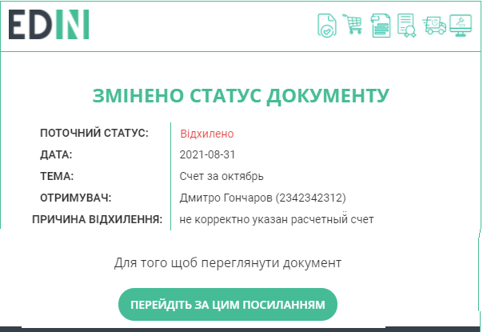

Робота з сервісом Вільний
#############################################################

.. role:: red

.. role:: green

.. role:: orange

.. role:: olive

.. role:: navy

.. role:: underline

.. сюда закину немного картинок для текста

.. |пресуха| image:: pics_Work_with_Vilnyi/Work_with_Vilnyi_03.png

.. |звезда| image:: pics_Work_with_Vilnyi/Work_with_Vilnyi_06.png

.. |звезда2| image:: pics_Work_with_Vilnyi/Work_with_Vilnyi_07.png

.. |прокрутка1| image:: /Vilnyi/pics_Work_with_Vilnyi/Work_with_Vilnyi_12.png

.. |прокрутка2| image:: /Vilnyi/pics_Work_with_Vilnyi/Work_with_Vilnyi_11.png

.. |download| image:: pics_Work_with_Vilnyi/Work_with_Vilnyi_17.png

.. |trash| image:: pics_Work_with_Vilnyi/Work_with_Vilnyi_18.png

.. |print| image:: pics_Work_with_Vilnyi/Work_with_Vilnyi_52.png

.. |non| image:: pics_Work_with_Vilnyi/Work_with_Vilnyi_21.png

.. |лупа| image:: pics_Work_with_Vilnyi/Work_with_Vilnyi_49.png

.. |save| image:: pics_Work_with_Vilnyi/Work_with_Vilnyi_50.png

.. |yellow_tag| image:: pics_Work_with_Vilnyi/Work_with_Vilnyi_58.png

.. |red_tag| image:: pics_Work_with_Vilnyi/Work_with_Vilnyi_59.png

.. |green_tag| image:: pics_Work_with_Vilnyi/Work_with_Vilnyi_57.png

.. |зареєстрований| image:: pics_Work_with_Vilnyi/Work_with_Vilnyi_74.png

.. |незареєстрований| image:: pics_Work_with_Vilnyi/Work_with_Vilnyi_73.png

.. |trash2| image:: pics_Work_with_Vilnyi/Work_with_Vilnyi_81.png

.. |clock| image:: pics_Work_with_Vilnyi/Work_with_Vilnyi_90.png

.. |accepted| image:: pics_Work_with_Vilnyi/Work_with_Vilnyi_89.png

.. |denied| image:: pics_Work_with_Vilnyi/Work_with_Vilnyi_92.png

.. |edit_tag| image:: pics_Work_with_Vilnyi/Work_with_Vilnyi_118.png

.. |del_tag| image:: pics_Work_with_Vilnyi/Work_with_Vilnyi_119.png

.. |ring| image:: /_constant/icons/ring.gif

.. |success| image:: /_constant/icons/success.png

.. |error| image:: /_constant/icons/error.png

.. |repeat| image:: /_constant/icons/repeat.png

.. contents:: Зміст:
   :depth: 3

---------

**1 Вхід на платформу**
================================================

.. include:: /general_2_0/rabota_s_platformoj_EDIN_2.0.rst
   :start-after: .. початок блоку для Enter
   :end-before: .. кінець блоку для Enter

Після успішної авторизації відкриється основне меню, де у вкладці **"Продукти та рішення"** EDIN потрібно обрати сервіс **"Вільний"**:

.. image:: /_constant/pics_landing/landing_vilnyi.png
   :align: center

.. hint::
   Для повернення до меню сервісів, товарного довідника потрібно натиснути кнопку |пресуха| або натиснувши на логотип EDIN.

.. _main:

**2 Загальний вигляд сервісу**
================================================

Сервіс **"Вільний"** містить `загальні функціональні елементи платформи <https://wiki.edin.ua/uk/latest/general_2_0/rabota_s_platformoj_EDIN_2.0.html#header>`__, а серед основних елементів: власні папки з документами (1) та журнал документів (2) для перегляду та роботи з ними. Функціонал `Пошуку <https://wiki.edin.ua/uk/latest/Vilnyi/Work_with_Vilnyi.html#search>`__ та `Теги <https://wiki.edin.ua/uk/latest/Vilnyi/Work_with_Vilnyi.html#tags>`__ суттєво спрощують роботу в сервісі.

.. image:: pics_Work_with_Vilnyi/Work_with_Vilnyi_105.png
   :align: center

Якщо у користувача налаштований `доступ до документів сервісу інших співробітників компанії <https://wiki.edin.ua/uk/latest/Personal_Cabinet/PCInstruction.html#shard-entrance>`__, то є можливість переключитись на каталоги тих співробітників і виконувати дії з документами від їх імені:

.. image:: pics_Work_with_Vilnyi/Work_with_Vilnyi_102.gif
   :align: center

**3 Перегляд каталогів сервісу**
================================================

В путівнику, а також зеленим маркером відмічене поточне місце перебування користувача в сервісі (при первинному вході - в каталозі **"Вхідних"** документів).

Для переходу в потрібний Вам каталог необхідно його вибрати:

#. **"Вхідні"** - каталог вхідних документів організації (від контрагентів).
#. **"Надіслані"** - каталог відправлених документів організації (до контрагентів).
#. **"Важливі"** - каталог всіх документів, що були відзначені, як "важливі" символом зірочки ("важливі" |звезда| / |звезда2| "звичайні").
#. **"Чернетки"** - каталог для документів, що були створені, але не були відправлені. 
#. **"Архів"** - каталог для документів, що були перенесені в архів.
#. **"Контрагенти"** - дозволяє знайти своїх незареєстрованих контрагентів та відправити їм запрошення на e-mail.

.. _doc-statuses:

**3.1 Статуси документів**
-------------------------------------------------

В сервісі **"Вільний"** передбачені наступні статуси:

Для **вхідних** документів:

* :navy:`"Очікує на підпис одержувача"` - відправлено підписаний/непідписаний документ (Отримувач ще не підписав документ);
* :navy:`"Очікує прийняття одержувача"` - відправлено підписаний/непідписаний документ (Отримувач ще не прийняв документ);
* :olive:`"Підписано"` - вхідний документ був підписаний Отримувачем; може виступати кінцевим статусом, якщо Відправник не підписував документ;
* :olive:`"Прийнято"` - вхідний документ був прийнятий Отримувачем; може виступати кінцевим статусом, якщо Відправник не підписував документ;
* :green:`"Завершено"` - кінцевий статус документа; відправлений підписаний Відправником документ, що був підписаний/прийнятий всіма Отримувачами;
* :red:`"Відхилено одержувачем"` - кінцевий статус документа; відправлений підписаний/непідписаний документ відхилено одним з контрагентів (документ вважається відхиленим незважаючи на дії інших контрагентів);
* "Копія" - не доступна до редагування "snapshot"-копія документа (містить статус оригіналу й інформацію про підписи на момент формування копії). Жодні дії з документом недоступні (виключення: Відправник може `додавати Отримувачів <https://wiki.edin.ua/uk/latest/Vilnyi/Work_with_Vilnyi.html#new-counterparty-add>`__ до вже відправленої копії).

Для **надісланих** документів:

* :navy:`"Очікує на підпис одержувача"` - відправлено підписаний/непідписаний документ (жоден Отримувач ще не підписав документ);
* :navy:`"Очікує прийняття одержувача"` - відправлено підписаний/непідписаний документ (жоден Отримувач ще не прийняв документ);
* :orange:`"Частково підписано"` - відправлено підписаний/непідписаний документ і частина контрагентів-Отримувачів підписали його;
* :orange:`"Частково прийнято"` - відправлено підписаний/непідписаний документ і частина контрагентів-Отримувачів прийняли його;
* :olive:`"Підписано"` - кінцевий статус документа; відправлений непідписаний Відправником документ, що був підписаний всіма Отримувачами;
* :olive:`"Прийнято"` - кінцевий статус документа; відправлений непідписаний Відправником документ, що був прийнятий всіма Отримувачами;
* :green:`"Завершено"` - кінцевий статус документа; відправлений підписаний Відправником документ, що був підписаний/прийнятий всіма Отримувачами;
* :red:`"Відхилено одержувачем"` - кінцевий статус документа; відправлений підписаний/непідписаний документ відхилено одним з контрагентів (документ вважається відхиленим незважаючи на дії інших контрагентів);
* "Копія" - не доступна до редагування "snapshot"-копія документа (містить статус оригіналу й інформацію про підписи на момент формування копії). Жодні дії з документом недоступні (виключення: Відправник може `додавати Отримувачів <https://wiki.edin.ua/uk/latest/Vilnyi/Work_with_Vilnyi.html#new-counterparty-add>`__ до вже відправленої копії).

.. hint::
   Додатково в каталогах сервісу документи, що були підписані Відправником для зручності мають зелену відмітку :green:`"Підписано відправником"`.

.. _create-and-send:

**4 Створення і відправка документа**
================================================

Для створення документа на платформі необхідно натиснути кнопку - **"Створити"**:

Після цього на формі створення документа обов'язково потрібно вказати "Отримувачів", "Правила обробки документа отримувачами", "Тему документа" (від 1 до 100 символів) та додати файли-вкладення.

.. note::
   Поля "Номер документу", "Дата документу", "Сума (грн)", "Повідомлення" не є обов'язковими до заповнення.

.. початок блоку для Repeat

.. warning::
   Поля "ЄДРПОУ отримувача" та "ЄДРПОУ відправника" є опціональними до заповнення. Поля можуть бути заповнені для формування контролю корректності підписання документів за ЄДРПОУ. Якщо поля заповнені, то сервіс "Вільний" буде перевіряти Вас та Ваших контрагентів на етапі підписання документів (вказане значення ЄДРПОУ та ЄДРПОУ ключа ЕЦП підписанта повинні співпадати). В разі некоректного значення (дозволено 8,9,10,12 цифр, комбінація із 2 літер та 6 цифр) Ви не зможете підписати/відправити документ, а в разі невідповідності значення під час підписання буде виникати помилка:

   .. image:: /Vilnyi/pics_Work_with_Vilnyi/Work_with_Vilnyi_140.png
      :align: center

.. кінець блоку для Repeat

.. _rules-for-recipients:

**4.1 Правила обробки документів отримувачами**
-------------------------------------------------

Ініціатор документообігу (Відправник) налаштовує вимоги завершення документообігу за допомогою доступних **"Правил обробки документа отримувачами"**:

* **Всі отримувачі мають підписати документ** - документ отримує кінцевий статус "Підписано" / "Завершено" після того, як всі вказані Контрагенти-отримувачі підпишуть документ;
* **Один з отримувачів має підписати документ** - документ отримує кінцевий статус "Підписано" / "Завершено" одразу після того, як один з Контрагентів-отримувачів (хто перший) підписує документ;
* **Всі отримувачі мають прийняти документ** - документ отримує кінцевий статус "Прийнято" / "Завершено" після того, як всі вказані Контрагенти-отримувачі приймуть документ;
* **Один з отримувачів має прийняти документ** - документ отримує кінцевий статус "Прийнято" / "Завершено" одразу після того, як один з Контрагентів-отримувачів (хто перший) прийме документ.

.. _counterparty-add:

**4.2 Додавання отримувачів**
-------------------------------------------------

Отримувачам документа відображається лише контрагент-Відправник, однак Отримувачам відображається статус документа.

Для вибору потрібних **Отримувачів** (може бути декілька) потрібно в полі почати вводити прізвище, пошту чи ЕДРПОУ контрагента (min 3 символи) і обрати зі списку зареєстрованих на платформі користувачів:

При введенні в поле Отримувачів пошти, що є аліасом (детальніше про `налаштування аліасів <https://wiki.edin.ua/uk/latest/Personal_Cabinet/PCInstruction.html#alias>`__) відображається ПІБ контрагента, основний email та аліас:

Реалізована можливість вказати Email незареєстрованого на платформі користувача в полі **"Отримувачі"**. При додаванні такого користувача потрібно обрати "Запросити нового користувача" в результатах випадаючого списка:

При відправці документа у відправника з'являється попередження, що потребує підтвердження:

.. image:: pics_Work_with_Vilnyi/Work_with_Vilnyi_39.png
   :align: center

Незареєстрованому отримувачу на вказаний Email відправляється запрошення з посиланням на `реєстрацію <https://wiki.edin.ua/uk/latest/general_2_0/User_registration.html>`__ та вкладеним одним (першим) файлом без підпису:

.. image:: pics_Work_with_Vilnyi/Work_with_Vilnyi_68.png
   :align: center

Також :underline:`незареєстрованим отримувачам` на Email приходять нагадування про запрошення на наступний день, 3-ій, 6-ий, 12-ий та 27-ий зі списком відправників та темами повідомлень:

Також можливе масове додавання зареєстрованих / незареєстрованих Отримувачів, скопіювавши (Ctrl+C) список (значення через кому, пробіл чи крапку з комою) потрібних Email-адрес та вставши (Ctrl+V) їх з буфера обміну:  

.. _files-add:

**4.3 Додавання файлів**
-------------------------------------------------

Файли можливо додати з локального носія через кнопку "Додати файл" чи "Drag-and-drop" способом:

.. note::
   Один документ може містити не більше 10 файлів в наступних форматах: PDF/JPG/JPEG/PNG/BMP/DOC/DOCX/XLS/XLSX/PPT/PPTX/CSV/TXT/XML/P7S (попередній перегляд не доступний лише для CSV та P7S) з розміром файлу не більше 5 Мб.

.. початок блоку для GS1

При додаванні більше 3 файлів частина файлів прихована за стрілками прокручування (|прокрутка1| |прокрутка2|). Для доданих файлів доступний попередній перегляд їх вмісту:

.. image:: /Vilnyi/pics_Work_with_Vilnyi/Work_with_Vilnyi_10n.gif
   :align: center

.. кінець блоку для GS1

При перегляді доданого файлу можливо масштабувати попередній перегляд файлу (1), використовувати пагінацію сторінок (2), роздрукувати макет з візуалізацією підпису в вигляді водяного знаку та листом підписання (3) |print| (кнопка активна лише для файлів в форматі PDF/JPG/JPEG/PNG/BMP), завантажити (4) |download| чи видалити (5) |trash| файл.

.. note::
   При завантаженні (4) |download| файлу:

   .. image:: pics_Work_with_Vilnyi/Work_with_Vilnyi_148.png
      :align: center

   * якщо документ НЕ підписано, то завантажується лише оригінал файлу;
   * якщо документ підписано, то завантажується zip-архів (найменування архіву = назва файлу з розширенням + Дата + Час створення) з папкою (найменування папки = назва файлу + розширення файлу), що містить оригінал файлу, підписаний файл в форматі p7s та друкований макет з візуалізацією підпису в вигляді водяного знаку та листом підписання в форматі pdf (`детальніше <https://wiki.edin.ua/uk/latest/Vilnyi/Work_with_Vilnyi.html#signing-watermark>`__).

   При завантаженні (4) |download| всіх файлів документа:

   .. image:: pics_Work_with_Vilnyi/Work_with_Vilnyi_149.png
      :align: center

   * якщо документ НЕ підписано, то завантажується zip-архів (найменування архіву = Тема документа + Дата + Час створення) з папками по кожному файлу (найменування папки = назва файлу + розширення файлу), що містять оригінали файлів;
   * якщо документ підписано, то завантажується zip-архів (найменування архіву = Тема документа + Дата + Час створення) з папками по кожному файлу (найменування папки = назва файлу + розширення файлу), що містять оригінали файлів, підписані файли в форматі p7s та друковані макети з візуалізацією підпису в вигляді водяного знаку та листом підписання в форматі pdf (`детальніше <https://wiki.edin.ua/uk/latest/Vilnyi/Work_with_Vilnyi.html#signing-watermark>`__).

Після додавання файлу/-ів та заповнення всіх обов'язковий полей можливо масово **"Підписати всі"** файли документа та **"Відправити"** документ (також можливо "Відправити документ без підписання"). При відправці непідписанного документа з'являється підказка, що потребує підтвердження дії:

.. image:: pics_Work_with_Vilnyi/Work_with_Vilnyi_14.png
   :align: center

Однак "Підписати" файли документа можливо і після відправки документа (якщо він не був відхилений):

.. image:: pics_Work_with_Vilnyi/Work_with_Vilnyi_107.png
   :align: center

Підписання Відправника не є обов'язковим, однак такий функціонал дозволяє реалізувати схеми документообігу, в яких Отримувач першим виконує підписання.

.. _sign:

**4.4 Підписання та відправка документа**
-------------------------------------------------

.. include:: /Vilnyi/Work_with_Vilnyi.rst
   :start-after: .. початок блоку для Repeat
   :end-before: .. кінець блоку для Repeat

Для підписання при перегляді документа необхідно натиcнути на кнопку **"Підписати всі"**:

.. image:: pics_Work_with_Vilnyi/Work_with_Vilnyi_15n.png
   :align: center

.. hint::
   Також в папці **Чернетки** доступний `функціонал масового підписання <https://wiki.edin.ua/uk/latest/Vilnyi/Work_with_Vilnyi.html#mass-sign>`__.

.. attention::
   При масовому підписанні наноситься лише один підпис за раз. При додаванні/видаленні файлів в/з документа - раніше накладені підписи видаляються!

.. початок блоку для Metro

.. початок блоку для GS1_sign

.. tabs::

   .. tab:: Файловий ключ

      .. include:: /_constant/signing/signing.rst
         :start-after: .. початок блоку для Signing
         :end-before: .. кінець блоку для Signing

   .. tab:: Token

      .. include:: /_constant/token_signing/token_signing.rst
         :start-after: .. початок блоку для TokenSign
         :end-before: .. кінець блоку для TokenSign

   .. tab:: Гряда

      .. include:: /_constant/gryada_signing/gryada_signing.rst
         :start-after: .. початок блоку для GryadaSign
         :end-before: .. кінець блоку для GryadaSign

   .. tab:: Дія.Підпис

      .. include:: /_constant/diya_signing/diya_signing.rst
         :start-after: .. початок блоку для DiyaPidps
         :end-before: .. кінець блоку для DiyaPidps

   .. tab:: Cloud

      .. include:: /_constant/cloud_signing/cloud_signing.rst
         :start-after: .. початок блоку для CloudSign
         :end-before: .. кінець блоку для CloudSign

.. кінець блоку для Metro

.. _signing-watermark:

.. note::
   Після підписання файлів в форматах PDF, JPG (JPEG), PNG, BMP при їх попередньому перегляді додається водяний знак в верхньому лівому куті кожної сторінки файлу, а також додається сторінка листа підписання:

   .. image:: /Vilnyi/pics_Work_with_Vilnyi/Work_with_Vilnyi_53.png
      :align: center
   
   Водяний знак містить інформацію, про те що файл було підписано в EDI Network, GUID документа та поточну сторінку файлу.

   .. image:: /Vilnyi/pics_Work_with_Vilnyi/Work_with_Vilnyi_54.png
      :align: center

   Лист підписання містить посилання та QR-код для скачування архіва документа, інформацію по документу та його підписантів.

.. кінець блоку для GS1_sign

Після підписання під даними документа відображається інформація щодо підписантів. Для відправки документів потрібно натиснути на кнопку **"Відправити"**.

.. hint::
   Також в папці **Чернетки** доступний `функціонал масової відправки <https://wiki.edin.ua/uk/latest/Vilnyi/Work_with_Vilnyi.html#mass-send>`__.

В випадку підписання документа Відправником (після відправки документа) на Email приходить повідомлення всім Отримувачам:

Після відправки документа контрагентам він відображається в журналі надісланих документів і має статус **Очікує підпису** (кнопки додавання файлів та підписання не активні):

.. image:: pics_Work_with_Vilnyi/Work_with_Vilnyi_56.png
   :align: center

.. note::
   Надіслані документи мають мітки (з підказками при наведенні курсора):

   * |yellow_tag| - "Частково доставлено" (серед отримувачів є зареєстровані і незареєстровані користувачі)
   * |green_tag| - "Доставлено" (всі отримувачі зареєстровані на платформі)
   * |red_tag| - "Очікуємо реєстрації отримувача" (всі отримувачі - незареєстровані користувачі)

Також при відправці документа, на вказаний e-mail **"Отримувача"** відправляється лист:

.. _new-counterparty-add:

**5 Додавання отримувачів до відправленого документа**
===================================================================

.. attention::
   Лише Відправник документа має можливість додавати нових контрагентів. Додавання отримувачів до вже відправленого документа можливо поки документ (оригінал) знаходиться в статусі :navy:`"Очікує на підпис одержувача"` / :navy:`"Очікує прийняття одержувача"` / :orange:`"Частково підписано"` / :orange:`"В обробці"` (`детальніше про статуси документів <https://wiki.edin.ua/uk/latest/Vilnyi/Work_with_Vilnyi.html#doc-statuses>`__).

Для цього Відправнику потрібно перейти у документ і натиснути кнопку **"+Додати"**:

Пошук і додавання нового отримувача аналогічно `формуванню нового документа <https://wiki.edin.ua/uk/latest/Vilnyi/Work_with_Vilnyi.html#counterparty-add>`__ (з можливістю додавання незареєстрованого учасника):

.. image:: pics_Work_with_Vilnyi/Work_with_Vilnyi_64.gif
   :align: center

Документ відправляється новим контрагентам кнопкою **"Відправити"**.

.. _inbox-doc:

**6 Робота з вхідними документами**
================================================

Всі непрочитані **"Вхідні"** документи відображаються жирним шрифтом:

При переході в сам документ відкриваються дані про підписанта (якщо Відправник підписував документ), файли доступні до перегляду та скачування (|download|), а з документом можливо виконати наступні дії: **"Відхилити всі"** вкладені файли чи **"Підписати"** / **"Прийняти"** їх у відповідь (в залежності від встановлених `правил обробки <https://wiki.edin.ua/uk/latest/Vilnyi/Work_with_Vilnyi.html#rules-for-recipients>`__ для цього документа):

.. include:: /Vilnyi/Work_with_Vilnyi.rst
   :start-after: .. початок блоку для Repeat
   :end-before: .. кінець блоку для Repeat

.. hint::
   Процес **Підписання** "Отримувачем" документа не відрізняється від підписання "Відправника" та описаний в `розділі вище <https://wiki.edin.ua/uk/latest/Vilnyi/Work_with_Vilnyi.html#sign>`__.

Після приймання / підписання документ змінює свій статус на :orange:`"Частково підписано"` / :orange:`"В обробці"` / :olive:`"Підписано"` / :olive:`"Прийнято"` / :green:`"Завершено"` в залежності від встановлених правил обробки документа, дій Контрагентів-Отримувачів (`детальніше про статуси документів <https://wiki.edin.ua/uk/latest/Vilnyi/Work_with_Vilnyi.html#doc-statuses>`__).

При підписанні/прийманні документа Отримувачем на email Відправника приходить лист-сповіщення, наприклад:

.. _rejection:

**6.1 Відхилення документа**
------------------------------------------------

.. attention::
   Відхилити можливо лише вхідні документи! Відхилити можливо документ до того, як він змінить свій статус на кінцевий (`детальніше про статуси документів <https://wiki.edin.ua/uk/latest/Vilnyi/Work_with_Vilnyi.html#doc-statuses>`__)! Відхилений документ змінює свій статус на **"Відхилено"** для всіх учасників, після чого його підписання/приймання будь-яким учасником стає неможливим.

Для відхилення всіх вкладених файлів потрібно відкрити сам документ і натиснути кнопку **"Відхилити всі"**:

.. image:: pics_Work_with_Vilnyi/Work_with_Vilnyi_42.png
   :align: center

При відхиленні потрібно обов'язково вказати причину відхилення та **"Відправити"**:

Після відхилення документ змінює свій статус на **"Відхилено"**. Контрагент, що виконав відхилення вказується під статусом разом з причиною відхилення.

.. Відхилений документ можливо лише **"Переслати"** (кнопки відхилення файлів, приймання/підписання не активні):

При відхиленні документа на email Відправника приходить лист-сповіщення:

Документообіг завершено.

.. _forward-doc:

**7 Переслати документ**
================================================

"Вхідні" чи "Надіслані" документи можливо **"Переслати"**:

Пошук і додавання нового отримувача аналогічно `формуванню нового документа <https://wiki.edin.ua/uk/latest/Vilnyi/Work_with_Vilnyi.html#counterparty-add>`__ (з можливістю додавання незареєстрованого учасника):

.. image:: pics_Work_with_Vilnyi/Work_with_Vilnyi_66.gif
   :align: center

При цьому формується "snapshot"-копія документа зі статусом "Не доступна до редагування копія" (містить статус оригіналу й інформацію про підписи на момент формування копії):

Жодні дії з документом-копією недоступні (окрім можливості завантажити вкладення).

.. _contractors:

**8 Контрагенти (відправка запрошень)**
================================================

Розділ дозволяє знайти своїх незареєстрованих контрагентів та масово відправити їм запрошення на e-mail. Для початку потрібно долучити контрагентів до журналу - це можливо зробити за допомогою кнопки **"Створити контрагента"**, після чого **"Зберегти"** дані в журналі:

Також розроблено функціонал масового завантаження e-mail адрес через xls-файл, що повинен відповідати шаблону. Для коректного додавання даних спочатку потрібно завантажити **"Шаблон"** (1), орієнтуючись на який буде можливо без помилок долучити список своїх контрагентів кнопкою **"З Excel"** (2):

Дані контрагентів в журналі можливо відредагувати:

.. image:: pics_Work_with_Vilnyi/Work_with_Vilnyi_76.png
   :align: center

.. attention::
   Якщо Excel-документ містить поля з помилками чи невідповідним шаблону змістом, то такі поля виділяються жовтим кольором, виводиться повідомлення про необхідність внесення правок (такі поля можливо видалити кнопкою |trash2|):

   .. image:: pics_Work_with_Vilnyi/Work_with_Vilnyi_80.png
      :align: center

   При редагуванні конкретного рядка вказується помилка:

   .. image:: pics_Work_with_Vilnyi/Work_with_Vilnyi_82.png
      :align: center

   ⠀⠀⠀⠀⠀⠀⠀

   .. image:: pics_Work_with_Vilnyi/Work_with_Vilnyi_83.png
      :align: center

Після того, як контрагенти успішно завантажені сервіс **"Вільний"** перевіряє введені адреси, чи зареєстровані вони в сервісі і проставляє "Статус реєстрації" (зареєстрований |зареєстрований| чи незареєстрований |незареєстрований|):

.. image:: pics_Work_with_Vilnyi/Work_with_Vilnyi_72.png
   :align: center

Кожного з незареєстрованих контрагентів |незареєстрований| можливо **"Запросити"** індивідуально клікаючи на кнопку в рядку контрагента чи масово: відмітивши незареєстрованих контрагентів |незареєстрований| та надіславши **"Запрошення"** всім одразу:

.. image:: pics_Work_with_Vilnyi/Work_with_Vilnyi_75.png
   :align: center

Незареєстрованим контрагентам на e-mail відправляється запрошення:

.. image:: pics_Work_with_Vilnyi/Work_with_Vilnyi_84.png
   :align: center

Після відправки запрошення проставляється дата його відправлення зі статусом "Відправлено":

Після того, як запрошений користувач пройде реєстрацію в полі запрошення з'явиться відмітка зареестрованого користувача |зареєстрований| - такому користувачу немає можливості повторно відправити запрошення:

.. image:: pics_Work_with_Vilnyi/Work_with_Vilnyi_79.png
   :align: center

.. _mass-operations:

**9 Масові операції**
================================================

За допомогою масових операцій в сервісі легко завантажувати, підписувати, відправляти, видаляти одразу кілька документів в один клік! При запуску масових операцій в правому нижньому куті екрану запускається віджет, що відображає :navy:`процес` та :green:`успішний` / :red:`з помилками` результат виконання поставлених задач для кожного документа/дії окремо:

.. image:: pics_Work_with_Vilnyi/Work_with_Vilnyi_128.png

Навпроти назви документа/дії у віджеті відображається статус:

* |ring| - задача в процесі обробки;
* |success| - задача успішно виконана;
* |error| - помилка виконання задачі + |repeat| - повторити виконання дії.

А іконка на початку завершеної дії підкаже, який процес було виконано:

.. image:: pics_Work_with_Vilnyi/Work_with_Vilnyi_136.png
   :align: center

Віджет можливо згорнути чи закрити навіть під час виконання задач. Віджет можливо відновити, натиснувши на іконку процесу/помилки в нижній частині екрану (віджет з усіма успішно виконаними задачами не відновлюється після закривання):

.. _mass-download:

**9.1 Масове завантаження документів**
-------------------------------------------------

**Масово завантажити документи** можливо за допомогою кнопки **"Завантажити"**:

.. image:: pics_Work_with_Vilnyi/Work_with_Vilnyi_44.png
   :align: center

Документи завантажуються у вигляді zip-архівів (найменування архіву = перші 10 символів теми документа + Дата + Час створення). Кожен з архівів містить каталоги (найменування=назві файлу з роширенням) для кожного вкладення. Кожен каталог містить:

* якщо документ не підписаний: оригінал файлу;
* якщо документ підписаний: оригінал файлу, підписаний файл в форматі p7s та друкований макет з візуалізацією підпису в вигляді водяного знаку та листом підписання в форматі pdf (`детальніше <https://wiki.edin.ua/uk/latest/Vilnyi/Work_with_Vilnyi.html#signing-watermark>`__).

.. _reestr:

**9.2 Формування та завантаження реєстру документів**
---------------------------------------------------------

Для бухгалтерського обліку передбачене консолідоване вивантаження даних обраних документів каталога (не більше 100 документів). Для цього потрібно відмітити потрібні документи і натиснути кнопку **"Завантажити реєстр в Excel"**:

.. image:: pics_Work_with_Vilnyi/Work_with_Vilnyi_69.png
   :align: center

Реєстр формується з обраних документів в xlsx-файл з назвою, що формується згідно шаблону: *List_of_documents _НазваПапки_Дата(YYYY-MM-DD)_час(hh-mm-ss)*, наприклад: List_of_documents_Inbox_2021-06-30_12-47-31.xlsx. В реєстр з документів записуються наступні поля: Отримувач (для "Надіслані"/"Важливі"), Відправник (для "Вхідні"/"Важливі"), Ім’я файлу вкладення, Тема документу, Статус, Дата відправки, Дата зміни статусу, Дата документу, Номер документу, Сума документу:

.. image:: pics_Work_with_Vilnyi/Work_with_Vilnyi_70.png
   :align: center

.. note::
   Перезавантаження сторінки може перервати процес формування файлу (файл реєстра не зберігається)! При виникненні помилки в правому верхньому куті екрану відображається повідомлення "Помилка створення реєстра."

.. _mass-sign:

**9.3 Масове підписання документів**
---------------------------------------------------------

Функціонал масового підписання (не більше 100 документів) доступний лише в папці **Чернетки**.

.. include:: /Vilnyi/Work_with_Vilnyi.rst
   :start-after: .. початок блоку для Repeat
   :end-before: .. кінець блоку для Repeat

Для масового підписання потрібно спочатку відібрати всі готові до підписання документи (непідписані документи з вкладеннями) за допомогою зручного фільтра **"Готові до підписання"** (1): 

Далі потрібно відмітити бажані документи зі списку для того, щоб **"Підписати"** (2) їх:

.. attention::
   При масовому підписанні наноситься лише один підпис за раз. При додаванні/видаленні файлів в/з документа - раніше накладені підписи видаляються!

.. hint::
   Процес **Підписання** документів не відрізняється від процесу описаного в `розділі вище <https://wiki.edin.ua/uk/latest/Vilnyi/Work_with_Vilnyi.html#sign>`__.

.. _mass-send:

**9.4 Масова відправка документів**
---------------------------------------------------------

Функціонал масової відправки (не більше 100 документів) доступний лише в папці **Чернетки**. Для масової відправки потрібно спочатку відібрати всі готові до відправки документи (документи з вкладеннями, заповненими полями "Отримувач" і "Тема") за допомогою зручного фільтра **"Готові до відправки"** (1): 

Далі потрібно відмітити бажані документи зі списку для того, щоб **"Відправити"** (2) їх:

.. _mass-pdf:

**9.5 Масове завантаження pdf-файлів**
-------------------------------------------------

В каталозі **"Чернетки"** можливо масово завантажити pdf-файли за допомогою кнопки **"Завантажити PDF"**. Після натискання кнопки в popup вікні вказуються правила до завантаження: 

.. image:: pics_Work_with_Vilnyi/Work_with_Vilnyi_85.png
   :align: center

Для вибору та завантаження pdf-файлів потрібно вказати папку, в якій знаходяться ці файли (кнопка **"Вибрати папку з файлами"**), після чого відобразиться процес завантаження:

.. image:: pics_Work_with_Vilnyi/Work_with_Vilnyi_87.png
   :align: center

Процес завантаження можливо перервати кнопкою **"Зупинити процес завантаження"**. Навпроти кожного документа показується відмітка статусу завантаження конкретного файлу:

* |clock| - файл в черзі;
* |round| - файл в процесі обробки/завантаження;
* |accepted| - файл успішно завантажено;
* |denied| - помилка завантаження файлу (такий файл супроводжується детальним описом причини помилки):

Після того, як процес завантаженя завершено можливо ознайомитись з результатом (за потреби виправити помилки, що могли виниктути при завантаженні) та **"Закрити"** вікно результатів завантаження:

.. _mass-arch:

**9.6 Масове архівування/розархівування документів**
--------------------------------------------------------------------

В каталогах **"Вхідні"** / **"Надіслані"** можливо масово **"Архівувати"** документи (тобто пернести обрані документи в папку **"Архів"**): 

Архівні документи (з папки **"Архів"**) можливо **"Розархівувати"** (обернена операція):

.. image:: pics_Work_with_Vilnyi/Work_with_Vilnyi_147.png
   :align: center

.. _tags:

**10 Теги**
================================================

До документів сервісу можливо "прив'язувати" теги - Ваші ідентифікатори, що відображаються лише Вам. Теги полегшують `пошук <https://wiki.edin.ua/uk/latest/Vilnyi/Work_with_Vilnyi.html#search-by-tags>`__ потрібного документа чи групи документів:

Для того, щоб **створити новий тег** потрібно натиснути на кнопку **"Теги"**, в pop-up вікні ввести *унікальну* назву майбутнього тега (не більше 20 символів) та натиснути на кнопку **"Створити"**:

.. image:: pics_Work_with_Vilnyi/Work_with_Vilnyi_111.png
   :align: center

Останні 10 створених тегів відображаються при повторному натисканні кнопки **"Теги"** (інші теги потрібно шукати за назвою):

Для того, щоб додати / вилучити тег/-и потрібно обрати документ/-и, натиснути на кнопку **"Теги"**, поставити / забрати відмітку відповідно та натиснути на кнопку **"Застосувати"**:

Теги відображаються в журналі документів:

.. hint::
   Якщо обрати кілька документів в pop-up **"Теги"** спільні і унікальні призначені теги матимуть різні помітки:

   .. image:: pics_Work_with_Vilnyi/Work_with_Vilnyi_117.png
      :align: center

Повний список тегів відображається при перегляді документа:

При перегляді документа присутня кнопка **"Теги"**, що має аналогічний функціонал по створенню / редагуванню / видаленню тегів, дозволяє додати теги до відкритого документа:

За допомогою спеціальних кнопок створені теги можливо **Редагувати** - |edit_tag| чи **Видалити** |del_tag|. При редагуванні назви тега потрібно **"Зберегти"** зміни - всі документи, що вже мали цей тег оновлюються автоматично:

.. _search:

**11 Пошук і фільтрація документів**
================================================

**11.1 Пошук документів**
-------------------------------------------------

Фільтрування документів в сервісі зручно здійснювати за допомогою функціоналу **"Пошук"** (всі "Доступні ключі пошуку" можливо переглянути в один клік):

Потрібно обрати/ввести параметр (кілька параметрів вводяться через кому), текст за потреби і натиснути |лупа|. Часто використовувані пошукові запити для зручності рекомендовано зберігати (|save|) до власного пошуку (блок "**Збережений пошук**"):

Збережений пошук відноситься тільки до певної папки документа: "Вхідні" / "Надіслані" / "Важливі" / "Чернетки" / "Архів". У блоці "Збережений пошук" за замовчуванням доступні фільтри по документам за сьогодні та вчора.

.. note::
   У фільтрі Відправник/Отримувач під час пошуку та фільтрації відображається ПІБ, email та UUID документа, однак при збереженні цих фільтрів та при подальшому їх виборі для спрощення зберігається та відображається лише uuid:

   .. image:: pics_Work_with_Vilnyi/Work_with_Vilnyi_138.png
      :align: center

Вилучити збережений пошук можна за допомогою іконки хрестика. Очистити рядок "Пошук" можна за допомогою кнопки **"Скинути фільтри"** |non| . При переході між папками пошуковий рядок очищається. Якщо користувач відфільтрував список документів, після чого перейшов до перегляду цього документа та повернувся назад — пошук зберігається.

.. image:: pics_Work_with_Vilnyi/Work_with_Vilnyi_27.png
   :align: center

**11.2 Швидкі фільтри по документам**
-------------------------------------------------

Кнопка швидкої фільтрації доступна для папок "Вхідні" та "Надіслані" і розташована в правому верхньому куті журнала документів:

.. image:: pics_Work_with_Vilnyi/Work_with_Vilnyi_61.png
   :align: center

Для "Вхідні":

* Всі - всі вхідні документи;
* Непрочитані - документи, що ще не були переглянуті (відкриті);
* Прочитані - документи, що вже були переглянуті (відкриті).

Для "Надіслані":

* Всі - всі надіслані (вихідні) документи;
* Доставлені - документи, всі Отримувачі яких отримали документ (відмічені |green_tag|);
* Помилка - документи з помилками (Отримувачі їх не отримають);
* Відправлені - надіслані (вихідні) документи, що очікують дій Отримувачів (в статусі "Очікує"). 

.. image:: pics_Work_with_Vilnyi/Work_with_Vilnyi_62.png
   :align: center

.. hint::
   Значення фільтру дублюється в рядок пошуку і зберігається при переході між папками під час даної сесії.

.. _search-by-tags:

**11.3 Пошук за тегами**
-------------------------------------------------

Завдяки функціоналу `тегів <https://wiki.edin.ua/uk/latest/Vilnyi/Work_with_Vilnyi.html#tags>`__, можливо створити персональну систему "маркування" документів, що значно прискорить Ваш особистий пошук:

Пошук за тегами можливо скинути при повторному натисканні на вже обраний тег чи хрестиком скинути всі фільтри. В блоці "Теги" відображаються 15 часто використовуваних тегів (решта доступні через кнопку **"Показати ще"**):

----------------------------
   
.. include:: /_constant/kontakti.rst
