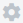

Налаштування панелі адміністратора WhiteDoc
###################################################################

.. есть картинки с главной инструкции сервиса

.. |envelope| image:: pics_WD_admin_panel/WD_admin_panel_010.png

.. |trash| image:: pics_Work_with_WD/Work_with_WD_066.png

.. role:: red

.. role:: underline

.. contents:: Зміст:
   :depth: 7

---------

Вхід
================================================

WEB сервісом підтримуються **Google Chrome** та **Safari** браузери тому для роботи з документами рекомендовано використовувати саме їх. Для входу до сервісу платформи необхідно перейти за посиланням https://wd.edin.ua/login .

При переході за вказаним посиланням відкриється вікно авторизації. Необхідно ввести Вашу електронну пошту, пароль користувача і натиснути **"Увійти"**:

.. image:: pics_Work_with_WD/Work_with_WD_002.png
   :align: center

За проставленої відмітки **"Запам'ятати мене"** вводити дані наступного разу самостійно вже не буде потреби (браузер це зробить автоматично).  

.. hint::
   Нові користувачі можуть самостійно пройти "Реєстрацію" і долучитись до сервісу (детальніше в нашій `інструкції <https://wiki.edin.ua/uk/latest/WhiteDoc/WD_registration.html>`__).

----------------------------------------------------

Для проведення адміністративних налаштувань на рівні акаунта потрібно клікнути лівою кнопкою мишки на іконку користувача та обрати **"Панель адміністратора"** (`налаштування профілю користувача <https://wiki.edin.ua/uk/latest/WhiteDoc/WD_Instructions/WD_admin_panel.html>`__ описані в окремій інструкції):

.. image:: pics_WD_admin_panel/WD_admin_panel_001.png
   :align: center

Панель адміністратора має своє окреме меню для зручного переходу між його розділами:

Для виходу з **"Панелі адміністратора"** передбачена кнопка в правому верхньому куті:

Всі налаштування проводяться на рівні акаунта і вибір обмежується лише основними мейлбоксами (до яких прив'язані акаунти), якщо у даного користувача є доступ до інших акаунтів та відповідні дозволи (права): 

.. _settings:

**1 Налаштування акаунта**
================================================

В цьому розділі проводяться налаштування облікового запису. В **"Налаштуваннях акаунта"** є три функціональні вкладки: **"Налаштування"** / **"Домени"** / **"Корисні посилання"** (за замовчуванням відкриваються **"Налаштування"**). 

**1.1 Налаштування**
------------------------------------------------------

В сервісі WhiteDoc є два типи акаунтів (тип вибирається при його створенні): **особистий акаунт** і **акаунт компанії**, що в налаштуваннях відрізняються наявністю у останнього поля для "Інформація про компанію":

.. image:: pics_WD_admin_panel/WD_admin_panel_038.png
   :align: center

.. image:: pics_WD_admin_panel/WD_admin_panel_039.png
   :align: center

* **Персональні налаштування** - блок, що містить назву (доступно до редагування) та uuid акаунта.
* **Інформація про компанію** (лише для акаунта компанії) - блок, що містить код ІПН (доступно до редагування).

Після того, як в поля, що доступні до редагуваня були внесені зміни їх можливо **"Зберегти"** чи **"Відмінити"** за допомогою кнопок. За допомогою одноіменної кнопки можливо **"Видалити"** акаунт (дія видалення потребує підтвердження): 

.. _domain:

**1.2 Домени**
-----------------------------------------------

Конфігурація доменів дозволяє керувати власними доменанами, активувати та деактивувати домени всередині сервісу. Домени необхідні для додавання, перевірки чи створення користувачів на платформі з доменом, яким Ви володієте. Тобто всі користувачі сервісу WhiteDoc, що мають сказаний на цій сторінці поштовий домен автоматично підв'язуються під цей акаунт.

Для початку потрібно **"Додати домен"** в popo-up вікні вказати його назву та **"Додати"**:

Після чого потрібно верифікувати право власності вказаним доменом (Ви повинні бути власником цього домена):

.. image:: pics_WD_admin_panel/WD_admin_panel_043.png
   :align: center

Можливо обрати зручний спосіб верифікації: за допомогою CNAME чи TXT запису. Після того, як формат буде обрано, потрібно підтвердити право власності, користуючись інструкцієїю та натиснувши **"Верифікувати"**:

Зміни додані до DNS налаштувань можуть зайняти деякий час. Як тільки сервіс WhiteDocEdin знайде текстовий запис в DNS налаштуваннях домену, він стане верифікованим у системі (змінить свій статус).

Всі записи завжди можливо **видалити** за допомогою кнопки |trash| (дія видалення потребує підтвердження):

.. image:: pics_WD_admin_panel/WD_admin_panel_047.png
   :align: center

.. attention::
   Якщо Ви хочете, щоб домен залишався верифікованим у системі, не видаляйте запис з налаштувань DNS, навіть після успішної верифікації. Якщо ви видалите перевірений домен, ви втратите можливість керувати користувачем у своєму домені.

Як тільки домен буде підтверджено, ви можете активувати його, щоб скористатися функціями, пов’язаними з доменом, такими як створення користувачів із відповідним доменом.

Натисніть кнопку **"Активувати"**, яка з’являється після успішної перевірки домена:

.. image:: pics_WD_admin_panel/WD_admin_panel_046.png
   :align: center

В правому нижньому куті розташований функціонал переходу між сторінками, на вказану сторінку журналу, вибір кількості користувачів на сторінці журналу, кількість елементів в журналі, пейджинг:

.. image:: pics_WD_admin_panel/WD_admin_panel_045.png
   :align: center

**1.2 Корисні посилання**
-----------------------------------------------

**Корисні посилання** - це зовнішні посилання, що можуть бути корисними для користувачів на рівні акаунта (всіх його мейлбоксів) чи окремого мейлбоска.

За допомого одноіменної кнопки можливо **"Додати посилання"** і в pop-up вікні потрібно вказати назву, адресу (url) посилання та рівень доступу (акаунт (всі його мейлбокси) чи окремий мейлбокс), де буде виводитись посилання:

.. image:: pics_WD_admin_panel/WD_admin_panel_048.png
   :align: center

Посилання в сформованому таким чином списку можливо редагувати |pencil| чи видаляти |trash| (дія видалення потребує підтвердження):

А порядок посилань змінювати:

Саме в такому порядку виводяться ці посилання в назначених мейлбоксах. Результат:

.. image:: pics_WD_admin_panel/WD_admin_panel_052.png
   :align: center

.. _users:

**2 Користувачі**
================================================

Розділ керування користувачами (створення / редагування / запрошення / видалення). У розіді відображаються список всіх користувачів, що були запрошені до акаунта чи його мейлбоксу/-ів.

На сторінці присутній рядок **"Пошуку за іменем"** користувача (1), а також фільтри, що дозволяють відсортувати список запрошених користувачів за доменом, одним з мейбоксів чи наданою роллю (ПОСИЛАННЯ НА РОЛІ І ПЕРМІШЕНИ). В правому нижньому куті (3) розташований функціонал переходу між сторінками, на вказану сторінку журналу, вибір кількості користувачів на сторінці журналу, кількість елементів в журналі, пейджинг. В журналі відображаються персональні дані користувачів (email, ім'я, прізвище), доступ до мейлбоків, що додатково візуалізується (2) іконками (|account| - користувач має права доступу до акаунта; |envelope| - користувач має права доступу до мейлбокса). Для детального перегляду налаштувань користувача потрібно натиснути на кнопку |settings| (детально описані в підрозділі нижче).

.. для того, щоб **"Створити"** користувача потрібно натиснути на одноіменну кнопку:

.. для видалення користувача/-ів потрібно відмітити їх в журналі та натиснути на кнопку **"Видалити користувача/-ів"**:

Увага, якщо у акаунта немає верифікованого домена, то дії **"Створення"** та **"Видалення"** користувачів неактивні і сервіс видає повідомлення над деактивованими кнопками: "У вас немає активованих верифікованих доменів. Додайте, верифікуйте та активуйте домен для того, щоб користуватися функціоналом."

.. image:: pics_WD_admin_panel/WD_admin_panel_012.png
   :align: center

2.1 Запрошення користувача
-----------------------------------

Для того, щоб **"Запросити"** користувача потрібно натиснути на одноіменну кнопку та в pop-up вікні ввести його email, назву та підтвердити дію, ще раз натиснувши **"Запросити"**:

.. image:: pics_WD_admin_panel/WD_admin_panel_013.png
   :align: center

Після чого одразу відкриваються налаштування для майбутнього запрошеного користувача, що мають три основні вкладки: **"Акаунт"** / **"Мейлбокс"** / **"Небезпечна зона"** (за замовчуванням відкритий **"Акаунт"**):

**2.1.1 Акаунт**
''''''''''''''''''''''''''''''''''''''''''''''''''''''''''''''''''''''''''''''

**Акаунт** - налаштування доступу до акаунта (якщо доступ надавати НЕ потрібно, то налаштування не проводяться).

.. image:: pics_WD_admin_panel/WD_admin_panel_014.png
   :align: center

Можливо **"Додати роль"** (обрати зі списку), що вже була створена в "Панелі адміністратора" Ролі акаунтів ПОСИЛАННЯ:

.. image:: pics_WD_admin_panel/WD_admin_panel_017.png
   :align: center

(при цьому можливо переназначити роль, додати нову чи видалити обрану, однак окремі дозволи при цьому не редагуються):

.. image:: pics_WD_admin_panel/WD_admin_panel_018.png
   :align: center

Також можливо обрати **"Розширені налаштування"** (обрати зі списку окремі дозволи на рівні акаунта ПОСИЛАННЯ) і застосувати їх:

(при цьому можливо "закривати" і "відкривати" ці дозволи присутністю/відсутністю відмітки в чекбоксі конкретного дозволу):

.. image:: pics_WD_admin_panel/WD_admin_panel_016.png
   :align: center

**2.1.2 Мейлбокс**
''''''''''''''''''''''''''''''''''''''''''''''''''''''''''''''''''''''''''''''

**Мейлбокс** - налаштування доступу до мейлбокса/-ів (якщо доступ надавати НЕ потрібно, то налаштування не проводяться).

Для початку налаштування доступу потрібно обрати зі списку "Мейлбоксів без доступу", той, до якого потрібно налаштовувати доступ за роллю чи окремими дозволами.

Можливо **"Додати роль"** (обрати зі списку), що вже була створена в "Панелі адміністратора" Ролі мейлбоксів ПОСИЛАННЯ:

.. image:: pics_WD_admin_panel/WD_admin_panel_020.png
   :align: center

(при цьому можливо переназначити роль, додати нову чи видалити обрану, однак окремі дозволи при цьому не редагуються):

Також можливо обрати **"Розширені налаштування"** (обрати зі списку окремі дозволи на рівні мейлбокса ПОСИЛАННЯ) і застосувати їх:

(при цьому можливо "закривати" і "відкривати" ці дозволи присутністю/відсутністю відмітки в чекбоксі конкретного дозволу чи **"Видалити всі дозволи"** одразу):

.. image:: pics_WD_admin_panel/WD_admin_panel_024.png
   :align: center

**2.1.3 Небезпечна зона**
''''''''''''''''''''''''''''''''''''''''''''''''''''''''''''''''''''''''''''''

**Небезпечна зона** - налаштування, що стосуються радикальних змін і в даному випадку ведуть до видалення всіх доступів конкретного користувача (**"Видалити всі дозволи до акаунта"**) та видалення цього користувача (**"Видалити користувача з акаунта"**).

Дії видалення потребують підтвердження, наприклад:

.. image:: pics_WD_admin_panel/WD_admin_panel_026.png
   :align: center

--------------------------------------------------

Після того, як всі налаштування доступу будуть виконані потрібно **"Запросити"** цього користувача:

.. image:: pics_WD_admin_panel/WD_admin_panel_028.png
   :align: center

Сервіс проінформує повідомленням про успішність:

Якщо користувач, якого запросили уже користується сервісом, то йому згідно його налаштувань (ПОСИЛАННЯ) в сервіс WhiteDoc надійде повідомлення та email, а саме запрошення буде відображатись в Інформації профілю (вкладка `Запрошення <https://wiki.edin.ua/uk/latest/WhiteDoc/WD_Instructions/WD_admin_panel.html#invite>`__):

Навпроти користувачів, що ще не відповіли на запрошення є можливість **"Відкликати"** (відміна зі сторони відправника запрошення) та **"Перевислати"** запрошення. При "перевисиланні" отримувач запрошення ще раз буде проінформований про запрошення згідно його налаштувань (ПОСИЛАННЯ):

.. image:: pics_WD_admin_panel/WD_admin_panel_032.png
   :align: center

Ці кнопки також доступні при перегляді налаштувань |settings| цього користувача:

.. image:: pics_WD_admin_panel/WD_admin_panel_033.png
   :align: center

TO BE CONTINUED...

------------------------------

.. include:: /_constant/kontakti.rst
