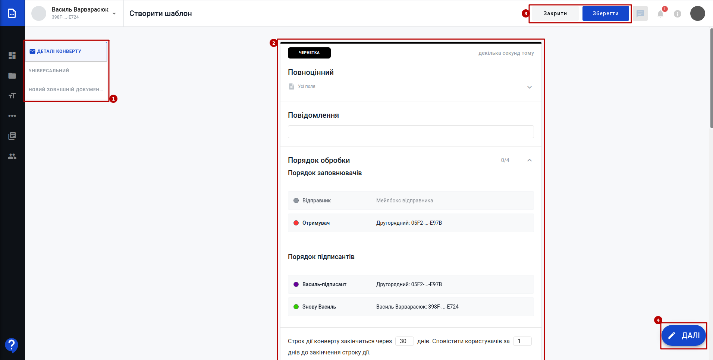
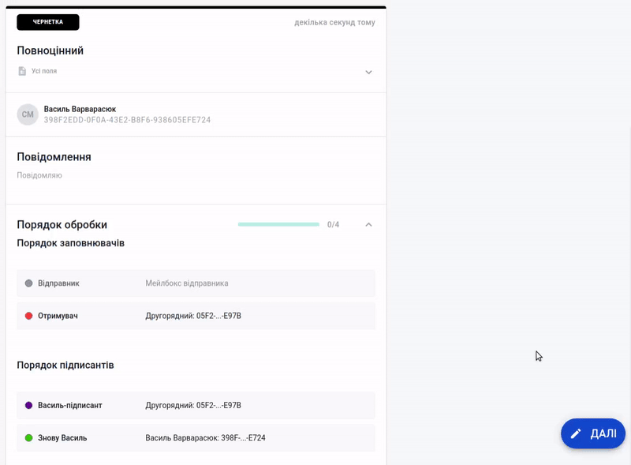
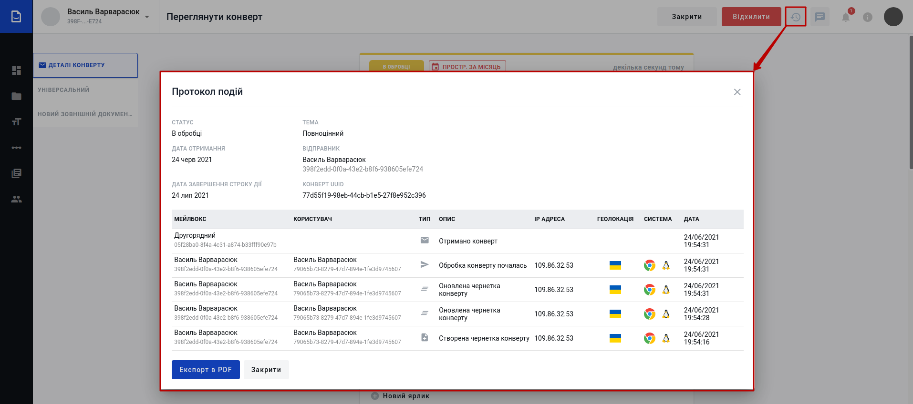
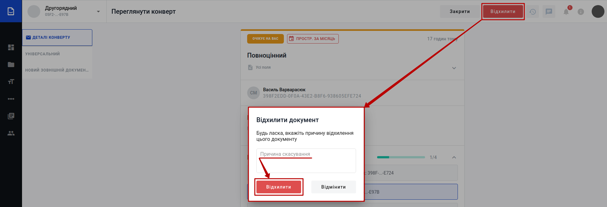
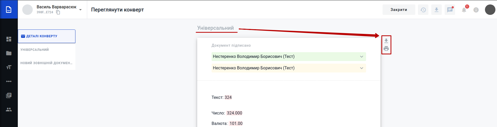
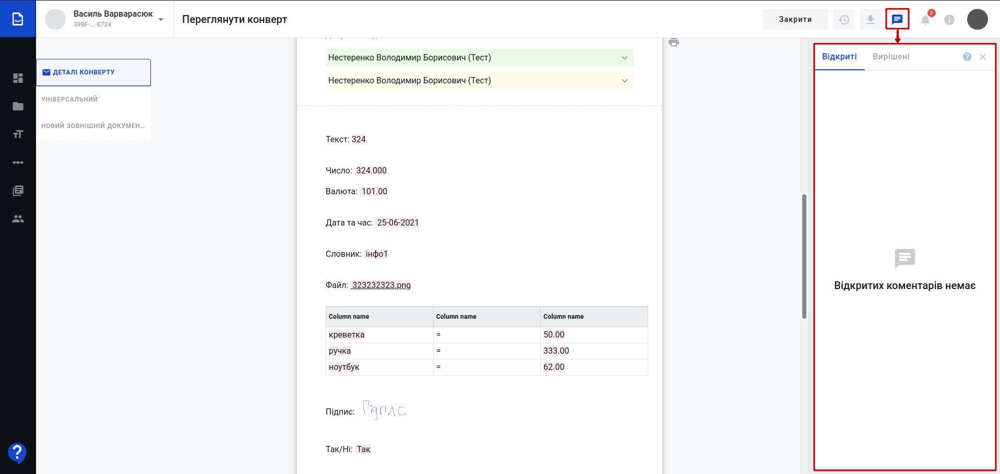
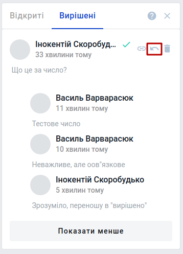

Налаштування панелі адміністратора WhiteDoc
###################################################################

.. есть картинки с главной инструкции сервиса

.. |account| image:: pics_WD_user_profile/WD_user_profile_009.png

.. |envelope| image:: pics_WD_user_profile/WD_user_profile_010.png

.. |settings| image:: pics_WD_user_profile/WD_user_profile_011.png

.. role:: red

.. role:: underline

.. contents:: Зміст:
   :depth: 7

---------

Вхід
================================================

WEB сервісом підтримуються **Google Chrome** та **Safari** браузери тому для роботи з документами рекомендовано використовувати саме їх. Для входу до сервісу платформи необхідно перейти за посиланням https://wd.edin.ua/login .

При переході за вказаним посиланням відкриється вікно авторизації. Необхідно ввести Вашу електронну пошту, пароль користувача і натиснути **"Увійти"**:

За проставленої відмітки **"Запам'ятати мене"** вводити дані наступного разу самостійно вже не буде потреби (браузер це зробить автоматично).  

.. hint::
   Нові користувачі можуть самостійно пройти "Реєстрацію" і долучитись до сервісу (детальніше в нашій `інструкції <https://wiki.edin.ua/uk/latest/WhiteDoc/WD_registration.html>`__).

**1 Панель адміністратора**
================================================

Для налаштування користувацького профілю потрібно клікнути лівою кнопкою мишки на іконку користувача та обрати **"Профіль користувача"** (`налаштування панелі адміністратора <https://wiki.edin.ua/uk/latest/Personal_Cabinet/PCInstruction.html>`__ описані в окремій інструкції):

.. image:: pics_WD_user_profile/WD_user_profile_0000.png
   :align: center

.. image:: pics_WD_user_profile/WD_user_profile_0000.png
   :align: center

Після чого відкривається **"Інформація профілю"**, поділена на 4 вкладки: **"Налаштування"** / **"Запрошення"** / **"Сповіщення"** / **"Небезпечна зона"** (за замовчуванням відображається вкладка "Налаштування").

.. _settings:

**1.1 Налаштування**
-----------------------------------------------

.. image:: pics_WD_user_profile/WD_user_profile_0000.png
   :align: center

В **"Налаштуваннях"** відображаються:

* **Персональні налаштування** - блок, що містить персональні дані користувача (ім'я, прізвище), налаштування мови інтерфейсу сервісу WhiteDoc, часовий пояс, uuid користувача (не доступно до редагування), email користувача (не доступно до редагування) і налаштування мейлбокса, що буде відкриватись при вході в сервіс.
* **Налаштування паролю** - блок, що дозволяє **"Змінити пароль"** даного користувача, проставивши відповідну відмітку та вказавши поточний та новий пароль (з підтвердженням).
* **Реєстрація** - блок, що дозволяє користувачу **"Зареєструвати особистий акаунт"** чи **"Зареєструвати акаунт компанії"** (детальніше про особливості `реєстрації в сервісі WhiteDoc <https://wiki.edin.ua/uk/latest/WhiteDoc/WD_Instructions/WD_registration.html>`__). Натиснувши відповідні кнопки можливо зареєструвати акаунт, погодившись в pop-up вікні з правилами та умовами користування сервісом та політикою конфіденційності (для акаунта компанії потрібно додатково ввести ІПН та назву мейлбокса):

.. image:: pics_WD_user_profile/WD_user_profile_0000.png
   :align: center

.. image:: pics_WD_user_profile/WD_user_profile_0000.png
   :align: center

Всі зміни внесені у вкладці можливо **"Зберегти"** чи **"Відмінити"**:

.. image:: pics_WD_user_profile/WD_user_profile_0000.png
   :align: center

.. _invite:

**1.2 Запрошення**
-----------------------------------------------

У вкладці відображаються активні запрошення до мейлбокса чи аккаунта інших користувачів сервісу (запрошення відправляються з "Панелі адміністратора" Користувачі ПОСИЛАННЯ), що потребують рішення:

.. image:: pics_WD_user_profile/WD_user_profile_0000.png
   :align: center

Користувач може **Прийняти** |accept| чи **Відхилити** |denied| запрошення з указаного акаунта. Після того, як користувач прийме запрошення у нього відкриється доступ до стороннього акаунта чи мейлбокса з визначеними налаштуваннями:

.. image:: pics_WD_user_profile/WD_user_profile_0000.png
   :align: center

.. _notifications:

**1.3 Сповіщення**
-----------------------------------------------

.. _users:

Користувачі

Розділ керування користувачами (створення / редагування / запрошення / видалення). У розіді відображаються список всіх користувачів, що були запрошені до акаунта чи його мейлбоксу/-ів.

.. image:: pics_WD_user_profile/WD_user_profile_008.png
   :align: center

На сторінці присутній рядок **"Пошуку за іменем"** користувача (1), а також фільтри, що дозволяють відсортувати список запрошених користувачів за доменом, одним з мейбоксів чи наданою роллю (ПОСИЛАННЯ НА РОЛІ І ПЕРМІШЕНИ). В правому нижньому куті (3) розташований функціонал переходу між сторінками, на вказану сторінку журналу, вибір кількості користувачів на сторінці журналу, кількість елементів в журналі, пейджинг. В журналі відображаються персональні дані користувачів (email, ім'я, прізвище), доступ до мейлбоків, що додатково візуалізується (2) іконками (|account| - користувач має права доступу до акаунта; |envelope| - користувач має права доступу до мейлбокса). Для детального перегляду налаштувань ПОЧИЛАННЯ НА ПІДРОЗДІЛ НИЖЧЕ користувача потрібно натиснути на кнопку |settings|.

.. для того, щоб **"Створити"** користувача потрібно натиснути на одноіменну кнопку:

.. для видалення користувача/-ів потрібно відмітити їх в журналі та натиснути на кнопку **"Видалити користувача/-ів"**:

Увага, якщо у акаунта немає верифікованого домена, то дії **"Створення"** та **"Видалення"** користувачів неактивні і сервіс видає повідомлення над деактивованими кнопками: "У вас немає активованих верифікованих доменів. Додайте, верифікуйте та активуйте домен для того, щоб користуватися функціоналом."

.. image:: pics_WD_user_profile/WD_user_profile_012.png
   :align: center

Налаштування користувача
------------------------------------

тут описуємо шестерню

Запрошення користувача
-----------------------------------

Для того, щоб **"Запросити"** користувача потрібно натиснути на одноіменну кнопку та в pop-up вікні ввести його email, назву та підтвердити дію, ще раз натиснувши **"Запросити"**:

.. image:: pics_WD_user_profile/WD_user_profile_013.png
   :align: center

Після чого одразу відкриваються налаштування для майбутнього запрошеного користувача, що мають три основні вкладки: **"Акаунт"** / **"Мейлбокс"** / **"Небезпечна зона"** (за замовчуванням відкритий **"Акаунт"**):

.. image:: pics_WD_user_profile/WD_user_profile_019.png
   :align: center

/// Акаунт
-----------------------------------

**Акаунт** - налаштування доступу до акаунта (якщо доступ надавати НЕ потрібно, то налаштування не проводяться).

.. image:: pics_WD_user_profile/WD_user_profile_014.png
   :align: center

Можливо **"Додати роль"** (обрати зі списку), що вже була створена в "Панелі адміністратора" Ролі акаунтів ПОСИЛАННЯ:

.. image:: pics_WD_user_profile/WD_user_profile_017.png
   :align: center

(при цьому можливо переназначити роль, додати нову чи видалити обрану, однак окремі дозволи при цьому не редагуються):

.. image:: pics_WD_user_profile/WD_user_profile_018.png
   :align: center

Також можливо обрати **"Розширені налаштування"** (обрати зі списку окремі дозволи на рівні акаунта ПОСИЛАННЯ) і застосувати їх:

.. image:: pics_WD_user_profile/WD_user_profile_015.png
   :align: center

(при цьому можливо "закривати" і "відкривати" ці дозволи присутністю/відсутністю відмітки в чекбоксі конкретного дозволу):

.. image:: pics_WD_user_profile/WD_user_profile_016.png
   :align: center

/// Мейлбокс
-----------------------------------

**Мейлбокс** - налаштування доступу до мейлбокса/-ів (якщо доступ надавати НЕ потрібно, то налаштування не проводяться).

.. image:: pics_WD_user_profile/WD_user_profile_019.png
   :align: center

Для початку налаштування доступу потрібно обрати зі списку "Мейлбоксів без доступу", той, до якого потрібно налаштовувати доступ за роллю чи окремими дозволами.

Можливо **"Додати роль"** (обрати зі списку), що вже була створена в "Панелі адміністратора" Ролі мейлбоксів ПОСИЛАННЯ:

.. image:: pics_WD_user_profile/WD_user_profile_020.png
   :align: center

.. image:: pics_WD_user_profile/WD_user_profile_021.png
   :align: center

(при цьому можливо переназначити роль, додати нову чи видалити обрану, однак окремі дозволи при цьому не редагуються):

.. image:: pics_WD_user_profile/WD_user_profile_022.png
   :align: center

Також можливо обрати **"Розширені налаштування"** (обрати зі списку окремі дозволи на рівні мейлбокса ПОСИЛАННЯ) і застосувати їх:

.. image:: pics_WD_user_profile/WD_user_profile_023.png
   :align: center

(при цьому можливо "закривати" і "відкривати" ці дозволи присутністю/відсутністю відмітки в чекбоксі конкретного дозволу чи **"Видалити всі дозволи"** одразу):

.. image:: pics_WD_user_profile/WD_user_profile_024.png
   :align: center

/// Небезпечна зона
-----------------------------------

**Небезпечна зона** - налаштування, що стосуються радикальних змін і в даному випадку ведуть до видалення всіх доступів конкретного користувача (**"Видалити всі дозволи до акаунта"**) та видалення цього користувача (**"Видалити користувача з акаунта"**).

.. image:: pics_WD_user_profile/WD_user_profile_025.png
   :align: center

Дії видалення потребують підтвердження, наприклад:

.. image:: pics_WD_user_profile/WD_user_profile_026.png
   :align: center

--------------------------------------------------

Після того, як всі налаштування доступу будуть виконані потрібно **"Запросити"** цього користувача:

.. image:: pics_WD_user_profile/WD_user_profile_028.png
   :align: center

Сервіс проінформує повідомленням про успішність:

.. image:: pics_WD_user_profile/WD_user_profile_027.png
   :align: center

Якщо користувач, якого запросили уже користується сервісом, то йому згідно його налаштувань (ПОСИЛАННЯ) в сервіс WhiteDoc надійде повідомлення та email, а саме запрошення буде відображатись в Інформації профілю (вкладка `Запрошення <https://wiki.edin.ua/uk/latest/WhiteDoc/WD_Instructions/WD_user_profile.html#invite>`__):

.. image:: pics_WD_user_profile/WD_user_profile_029.png
   :align: center

Навпроти користувачів, що ще не відповіли на запрошення є можливість **"Відкликати"** (відміна зі сторони відправника запрошення) та **"Перевислати"** запрошення. При "перевисиланні" отримувач запрошення ще раз буде проінформований про запрошення згідно його налаштувань (ПОСИЛАННЯ):

.. image:: pics_WD_user_profile/WD_user_profile_032.png
   :align: center

Ці кнопки також доступні при перегляді налаштувань |settings| цього користувача:

.. image:: pics_WD_user_profile/WD_user_profile_033.png
   :align: center

В сервісі WhiteDoc для конвертів передбачені наступні статуси:

* **Чернетка** - створений, але ще не відправлений конверт (доступний до редагування);
* **В обробці** - відправлений конверт, що ще чекає на дії заповнення/підписання зі сторони контрагентів-учасників;
* **Очікує на вас** - відправлений конверт, очікує на дії заповнення/підписання з Вашої сторони;
* **Завершено** - кінцевий статус конверта; усі дії з документами (заповнення/підписання) виконано;
* **Скасовано** - кінцевий статус конверта; один з контрагентів-учасників відхилив конверт;
* **Прострочено** - кінцевий статус конверта; сплинув строк чинності конверта (налаштування шаблону).

.. _create-envelope:

**2 Формування та відправка конверта**
================================================

Для створення конверта потрібно мати підготовлений шаблон згідно якого і буде створено конверт.

.. tip::
    Перед початком роботи з конвертами рекомендовано ознайомитись з інструкцією по роботі з `шаблонами <https://wiki.edin.ua/uk/latest/WhiteDoc/WD_Instructions/Work_with_WD.html#template>`__.

Створюється конверт за допомогою кнопки **"Новий конверт"** (відображається в правому верхньому куті у всіх основних розділах сервісу):

.. image:: pics_Work_with_Envelope/Work_with_Envelope_001.png
   :align: center

Після чого в попап вікні потрібно обрати шаблон в зручний для Вас спосіб:

* з нещодавно використаних;

.. image:: pics_Work_with_Envelope/Work_with_Envelope_002.png
   :align: center

* за номером UUID:

.. image:: pics_Work_with_Envelope/Work_with_Envelope_003.gif
   :align: center

* з бібліотеки шаблонів:

.. image:: pics_Work_with_Envelope/Work_with_Envelope_004.png
   :align: center

Після чого згідно шаблону автоматично створюється конверт (чернетка) разом з документами і відкривається форма для його заповнення (можуть бути випадки, коли створений конверт не потребує заповнення зі сторони відправника):

Форма конверта складається з деталей конверта та самих документів (2), що створюються згідно шаблону. В лівій частині екрану є зручний показчик перебування (1). Конверт-чернетку можливо **"Закрити"** в будь-який момент чи **"Зберегти"** (3), якщо в нього заповнені поля "Тема" та "Повідомлення". Після збереження чернетки з'являється кнопка для її видалення (**"Видалити"**).

.. hint::
    В збереженій чернетці можливо обмінюватись коментарями |comment| (`детальніше про функціонал Коментарів <https://wiki.edin.ua/uk/latest/WhiteDoc/WD_Instructions/Work_with_Envelope.html#comments>`__)

В правому нижньому куті відображається кнопка (4) (**"Далі"** чи **"Відправити"**), що одночасно інформує про заповненість конверта (готовність до відправки) та є підказкою, що вказує на необхідність заповнення конкретних полів в документах конверта:

В сервісі є два типи документів: структуровані |structed| та зовнішні |external|.

.. note::
   |external| **Зовнішній документ** призначений для внесення файлу одним з учасників документообігу. Допускається додавання файлу-вкладення в форматі pdf, doc, docx, xls, xlsx, xml, dbf, txt, rtf, png, jpg, jpeg, zip не більше 5МБ (загальний розмір конверта при цьому не повинен перевищувати 25 МБ). В зовнішній документ можливо додати поля "ЕЦП" (інші поля не підтримуються).

   |structed| **Структурований документ** може включати в себе текст та `стандартні поля WhiteDoc <https://wiki.edin.ua/uk/latest/WhiteDoc/WD_Instructions/Work_with_WD.html#fields>`__ (детальніше за посиланням).

Після того, як всі обов'язкові поля будуть заповнені і конверт буде готовий до відправки кнопка **"Далі"** міняється на **"Відправити"**:

.. image:: pics_Work_with_Envelope/Work_with_Envelope_007.png
   :align: center

При натисканні на **"Відправити"** потрібно підтвердити дію відправки:

.. image:: pics_Work_with_Envelope/Work_with_Envelope_008.png
   :align: center

Відправлений конверт змінює свій статус на "В обробці", показується наступний порядок обробки конверта, а також є можливість одразу начіпити на конверт **"Новий ярлик"**:

.. image:: pics_Work_with_Envelope/Work_with_Envelope_009.png
   :align: center

Також у формі відправленого конверта можливо ознайомитись і експортувати в PDF **"Протокол подій"** (|clock|) - усіх дій, виконаних контрагентами з цим конвертом:

Після того, як документообіг **"Завершено"** (статус конверта) в формі перегляду конверта відображається кнопка |arrow| **"Завантажити конверт"**.

**3 Відхилення конверта**
================================================

Відправлений конверт в статусі "В обробці" чи "Очікує на вас" (на стороні поточного заповнювача/підписанта) можливо **"Відхилити"**:

.. image:: pics_Work_with_Envelope/Work_with_Envelope_013.png
   :align: center

Для відхилення конверта обов'язково потрібно вказати причину відхилення і підтвердити відхилення:

Після чого документ змінює свій статус на "Скасовано", а причина відхилення відображається учасникам в детялях конверта:

.. image:: pics_Work_with_Envelope/Work_with_Envelope_026.png
   :align: center

Документообіг завершено.

.. _envelope-download:

**4 Завантаження конвертів**
================================================

.. attention::
   **"Завантажити конверти чи окремі документи"** можливо лише після завершення документообігу!

Завантажити чи розрукувати окремі документи можливо при перегляді конверта (кнопки |arrow| та |print|):

доступне масове завантаження конвертів з журналу документів. Для цього потрібно відмітити потрібні документи і натиснути кнопку **"Завантажити"**:

.. image:: pics_Work_with_WD/Work_with_WD_141.png
   :align: center

Конверти завантажуються у вигляді zip-архівів (найменування архіву = Темі конверта). Кожен з архівів містить каталоги (найменування=назві документа) для кожного документа, а також протокол подій конверта (AuditTrail.pdf).

* Кожен каталог стуктурованого документа |structed| містить:

   * Якщо документ не потребував підпису:
      
      * оригінал документа в xml форматі ({назва документа}.xml);
      * оригінал документа в pdf форматі ({назва документа}.pdf).

   * Якщо документ підписувався (ЕЦП чи електронно-чорнильним підписом):
      
      * оригінал документа в xml форматі ({назва документа}.xml);
      * оригінал документа в pdf форматі ({назва документа}.pdf);
      * сертифікат підписання документа ({назва документа}.підписи.pdf). Сертифікат містить детальну інформацію по електронному документу (ідентифікатори шаблону, конверта, документа, назви, кількість підписантів, дату, посилання на електронну версію документа) та дані про всі підписи і всіх підписантів;
      * форма для друку, що включає в себе оригінал документа + сертифікат підписання цього документа ({назва документа}.форма для друку.pdf). Якщо документ підписувався ЕЦП, то друкований макет додатково містить візуалізацію до всіх підписів в вигляді печаток на документі: |stamp|;
      * підписаний xml-документ ({назва документа}.xml.{номер підпису}.p7s). Кількість p7s-файлів відповідає кількості підписів;
      * підписаний pdf-документ ({назва документа}.pdf.{номер підпису}.p7s). Кількість p7s-файлів відповідає кількості підписів.

* Кожен каталог зовнішнього документа |external| містить:

   * Якщо документ не потребував підпису:

      * оригінал документа-вкладення.

   * Якщо документ підписувався ЕЦП:

      * оригінал документа-вкладення;
      * сертифікат підписання документа ({назва документа}.підписи.pdf). Сертифікат містить детальну інформацію по електронному документу (ідентифікатори шаблону, конверта, документа, назви, кількість підписантів, дату, посилання на електронну версію документа) та дані про всі підписи і всіх підписантів;
      * підписаний документ-вкладення ({назва документа}.{формат вкладення}.{номер підпису}.p7s). Кількість p7s-файлів відповідає кількості підписів.

.. _comments:

**5 Коментарі**
================================================

Функціонал дозволяє обмінюватись контрагентам повідомленнями, відповідати на уточнюючі питання, прикріпляючи коментарі до конкретної частини документа. Відкрити/закрити панель коментарів можливо за допомогою кнопки |comment| при перегляді конверта:

Для того аби додати коментар потрібно виділити частину відкритого документа і правою кнопкою миші натиснути **"Коментувати"**:

.. image:: pics_Work_with_Envelope/Work_with_Envelope_022.gif
   :align: center

Коментар потрапляє у вкладку "Відкриті", де лише у його створювача є можливість його відредагувати / видалити / вирішити (коментар потрапляє у вкладку "Вирішених" питань):

.. image:: pics_Work_with_Envelope/Work_with_Envelope_018.png
   :align: center

У кожного коментаря є прив'язка - посилання на абзац (кнопка |link|), за допомогою якого легко знайти частину потрібного документа, до якого був зроблений коментар:

.. image:: pics_Work_with_Envelope/Work_with_Envelope_023.gif
   :align: center

Учасники контрагенти можуть відповідати на коментарі за допомогою кнопки **"Відповісти"** та **"Зберегти"**. При цьому всі "відповіді" зберігаються під коментарем, до якого вони були сформовані в хронологічному порядку:

.. image:: pics_Work_with_Envelope/Work_with_Envelope_024.png
   :align: center

Для того аби була можливість переглянути всю переписку до конкретного коментаря чи згорнути її можливо скористатись відповідними кнопками **"Показати більше"** / **"Показати менше"**. Коментар потрапляє у "Вирішені" разом з усіма "відповідями" до нього. У створювача початкового вирішеного коментаря є можливість перенести коментар з відповідями з "Вирішених" у "Відкриті" кнопкою |roll_back| **"Відкрити знову"**:

------------------------------

.. include:: /_constant/kontakti.rst
