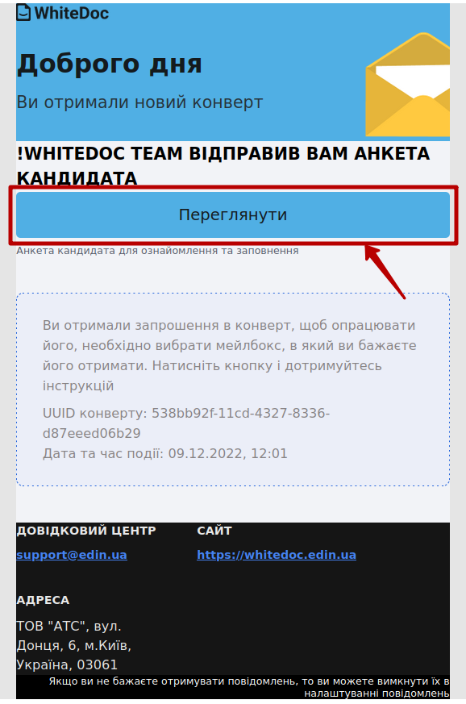
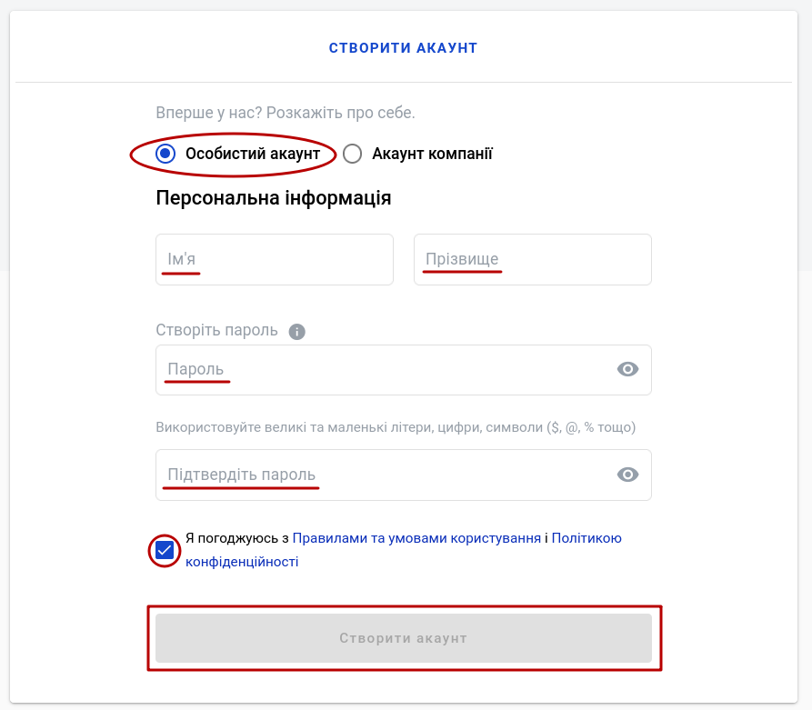
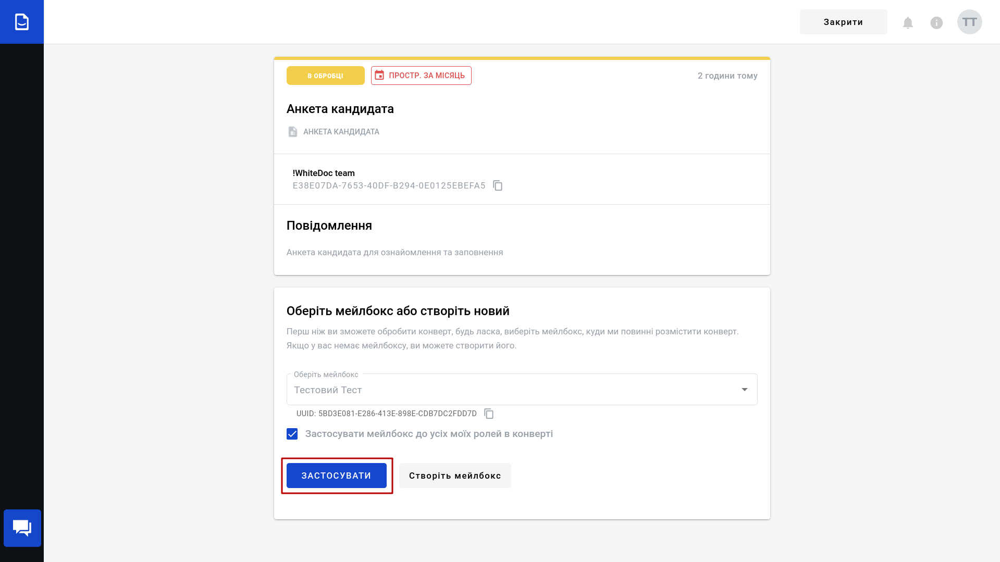
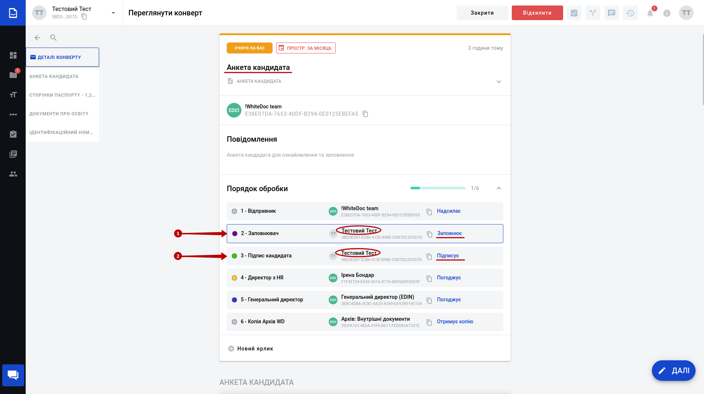
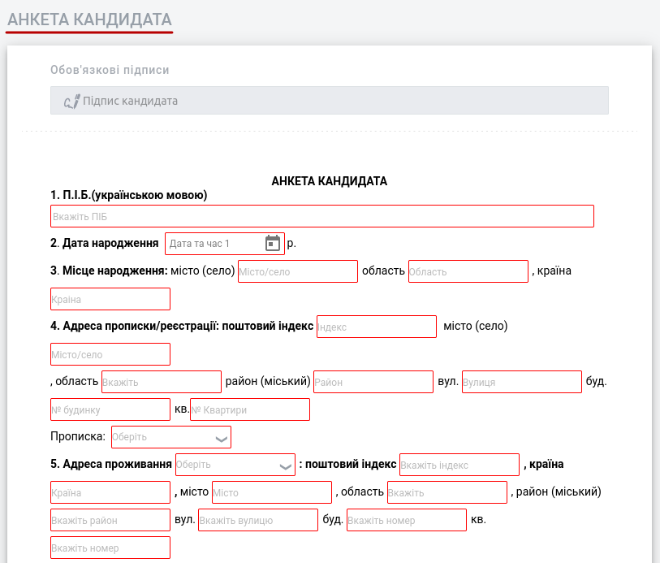
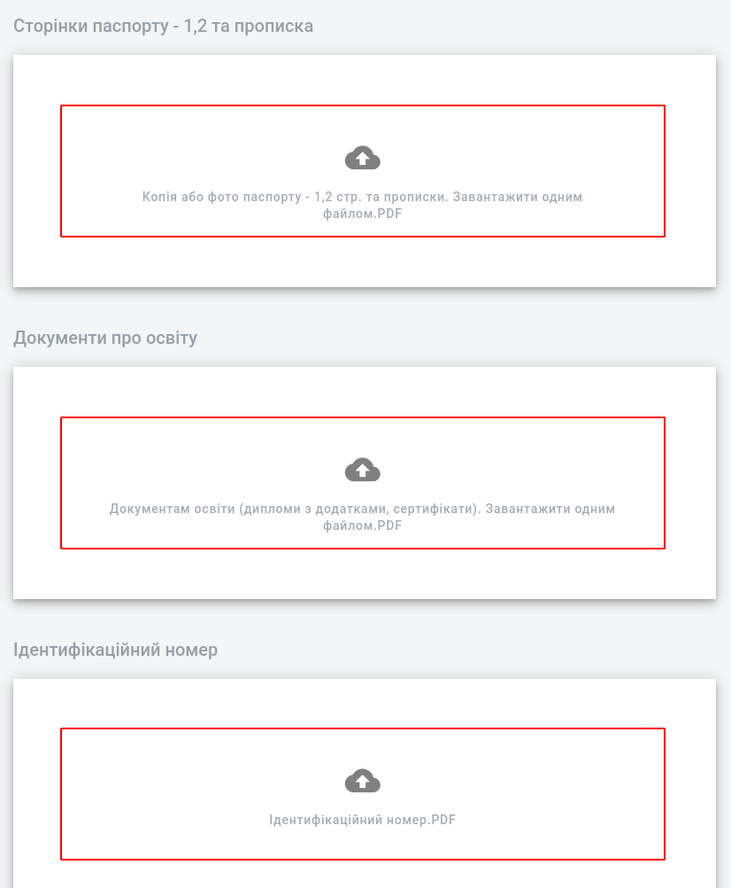
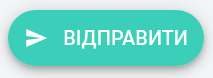
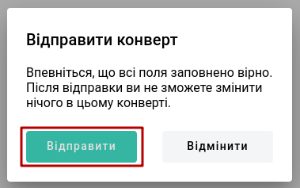
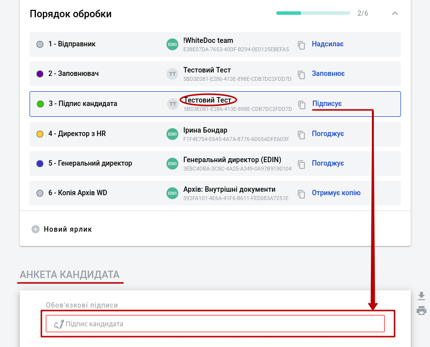

Анкета кандидата
#############################################################

.. картинки:

.. |мінус| image:: pics_WD_registration/WD_registration_008.png

.. role:: red

.. role:: underline

.. contents:: Зміст:
   :depth: 3

---------

Онлайн-анкета кандидата на посаду в EDIN (ТОВ "АТС") є не лише ефективним способом визначення найбільш підходящих кандидатів на вакансію, але й водночас першим знайомством з одним із продуктів компанії. Вам не обов'язково їхати на офіс, відповідати на стандартні питання, заповнювати анкету та надавати документи в папері для попередньої перевірки, що заощадить Ваш час і позбавить від паперової волокити (ми дбаємо про екологію). Дана інструкція допоможе швидко та в зручний для Вас час надати Ваші особисті дані для внутрішньої перевірки Вас, як кандидата.

.. _registration:

**1 Реєстрація**
================================================

На Вашу пошту має прийти лист з запрошенням до нашого сервісу `"WhiteDoc" <https://wiki.edin.ua/uk/latest/WhiteDoc/WD_Instructions/Work_with_WD.html>`__, в якому й потрібно заповнити анкету. Відкривши листа, потрібно **"Переглянути"** анкету:

Ви будете переадресовані на сторінку сервісу **WhiteDoc** https://edo.whitedoc.ua.

.. hint::
   Для зручності можливо одразу обрати мову інтерфейсу:

   .. image:: pics_WD_candidate_questionnaire/WD_candidate_questionnaire_002.png
      :align: center

Вам потрібно зареєструватись в сервісі або пройти авторизацію (якщо Ви вже зареєстровані). На формі реєстрації потрібно обрати "Особистий акаунт", заповнити "Ім'я", "Прізвище", вигадати Пароль (загалом не менше 6 символів: великі та маленькі літери, мінімум одна цифра та спецсимвол), обов'язково ознайомитись і погодитись з Правилами та умовами користування сервісом і Політикою конфіденційності. Після чого можливо **"Створити акаунт"** [1]_ :

Ви автоматично проходите авторизацію і при переході до Анкети кандидата потрібно обрати **Мейлбокс** [2]_ від імені якого Ви будете виконувати дії в сервісі (у щойно зареєстрованих осіб вибір 1/1) та **"Застосувати"**: 

.. hint::
   Після реєстрації Вам буде надіслано листа з посиланням на анкету (вже, як зареєстованому користувачу) - Ви можете продовжити, перейшовши за посиланням (кнопка **"Переглянути"**):

   .. image:: pics_WD_candidate_questionnaire/WD_candidate_questionnaire_005.png
      :align: center

Відкривається форма **Конверта** [3]_ , в шапці якого вказаний порядок обробки даної анкети всередині компанії. Ваші подальші дії поділяються на два етапи:

1. Заповнення анкети;
2. Підписання анкети.

.. _questionnaire-filling:

**2 Заповнення анкети**
================================================

Під шапкою Конверта розташована форма "Анкети кандидата" до заповнення, а також блоки для вивантаження скан-копій документів:

.. image:: pics_WD_candidate_questionnaire/WD_candidate_questionnaire_007.gif
   :align: center

В блоці "Анкети кандидата" потрібно заповнити всі поля, виділені червоною рамочкою: 

.. note::
   1) Комірки, що мають іконку |calendar| заповнюються по кліку на іконку шляхом вибору дати з календаря:

   .. image:: pics_WD_candidate_questionnaire/WD_candidate_questionnaire_011.gif
      :align: center

   2) Комірки, що мають символ |галочка| заповнюються по кліку на поле шляхом вибору значення зі списку:

   .. image:: pics_WD_candidate_questionnaire/WD_candidate_questionnaire_012.gif
      :align: center

   3) При заповненні таблиць, кнопками "+" / "-" можливо додавати/видаляти рядки відповідно:

   .. image:: pics_WD_candidate_questionnaire/WD_candidate_questionnaire_013.png
      :align: center

   4) Деякі питання потребують короткої відповіді "Так" чи "Ні" (потрібно обрати):

   .. image:: pics_WD_candidate_questionnaire/WD_candidate_questionnaire_014.gif
      :align: center

Під "Анкетою кандидата" розташовані блоки для додавання Ваших документів у вигляді файлів-вкладень:

.. attention::
   Кожен блок дозволяє Вам вивантажити документи виключно в pdf-форматі з максимальним розміром файлу не більше 10 Мб. Тобто від Вас очікуються три файли:

   * **Паспортні дані** (перша, друга сторінки та актуальна прописка) - 1 pdf-файл;
   * **Документи про освіту** (ВНЗ, сертифікати, ін.) - 1 pdf-файл;
   * **Ідентифікаційний номер** - 1 pdf-файл.

Після того, як всі обов'язкові поля будуть заповнені, сервіс автоматично запропонує **"Відправити"** дані анкети до сервісу (або за допомогою кнопки в правому нижньому куті):

.. _questionnaire-signing:

**3 Підписання анкети**
================================================

Після того, як Ви відправили дані анкети потрібно підтвердити документ Вашим особистим кваліфікованим електронним підписом (КЕП):

.. hint::
   КЕП слугує підтвердженням особи підписанта і надає документу юридичної значимості.

.. include:: /WhiteDoc/WD_Instructions/WD_signing/WD_signing.rst
   :start-after: .. початок блоку для WD_candidate_questionnaire
   :end-before: .. кінець блоку для WD_candidate_questionnaire

Після того, як Ви відправите підписану анкету будуть запущені внутрішні процеси перевірок та погодження. Про результати проходження Ви обов'язково будете проінформовані.

------------------------------

.. [#] Акаунт — обліковий запис, у якому зберігається різна інформація, що відноситься до користувача (налаштування та інша інформація). 

.. [#] Мейлбокс (mailbox) — сутність, що є вхідною/вихідною точкою документообігу в сервісі. Може бути особистим або спільним для кількох користувачів на рівні одного акаунта. 

.. [#] Конверт — основна одиниця документобігу в сервісі, що вміщує один чи кілька документів та формується згідно визначеного шаблону.

.. [#] Шаблон — сукупність визначених користувачем правил формування документів, їх структури та порядку обробки, згідно яких формується конверт.

------------------------------

.. include:: /_constant/kontakti.rst