Налаштування профілю користувача WhiteDoc
###################################################################

.. есть картинки с главной инструкции сервиса

.. |denied| image:: pics_WD_user_profile/WD_user_profile_035.png

.. role:: red

.. role:: underline

.. contents:: Зміст:
   :depth: 7

---------

Вхід
================================================

WEB сервісом підтримуються **Google Chrome** та **Safari** браузери тому для роботи з документами рекомендовано використовувати саме їх. Для входу до сервісу платформи необхідно перейти за посиланням https://edo.whitedoc.ua/login .

При переході за вказаним посиланням відкриється вікно авторизації. Необхідно ввести Вашу електронну пошту, пароль користувача і натиснути **"Увійти"**:

.. image:: pics_Work_with_WD/Work_with_WD_002.png
   :align: center

За проставленої відмітки **"Запам'ятати мене"** вводити дані наступного разу самостійно вже не буде потреби (браузер це зробить автоматично).  

.. hint::
   Нові користувачі можуть самостійно пройти "Реєстрацію" і долучитись до сервісу (детальніше в нашій `інструкції <https://wiki.edin.ua/uk/latest/WhiteDoc/WD_registration.html>`__).

**1 Профіль користувача**
================================================

Для налаштування користувацького профілю потрібно клікнути лівою кнопкою мишки на іконку користувача та обрати **"Профіль користувача"** (`налаштування панелі адміністратора <https://wiki.edin.ua/uk/latest/WhiteDoc/WD_Instructions/WD_admin_panel.html>`__ описані в окремій інструкції):

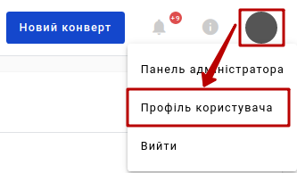

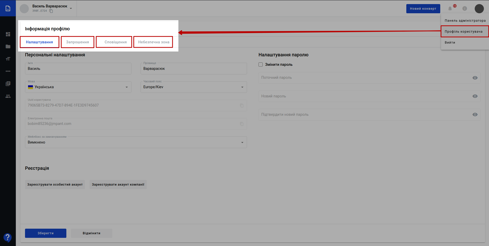

Після чого відкривається **"Інформація профілю"**, поділена на 4 вкладки: **"Налаштування"** / **"Запрошення"** / **"Сповіщення"** / **"Небезпечна зона"** (за замовчуванням відображається вкладка "Налаштування").

.. _settings:

**1.1 Налаштування**
-----------------------------------------------

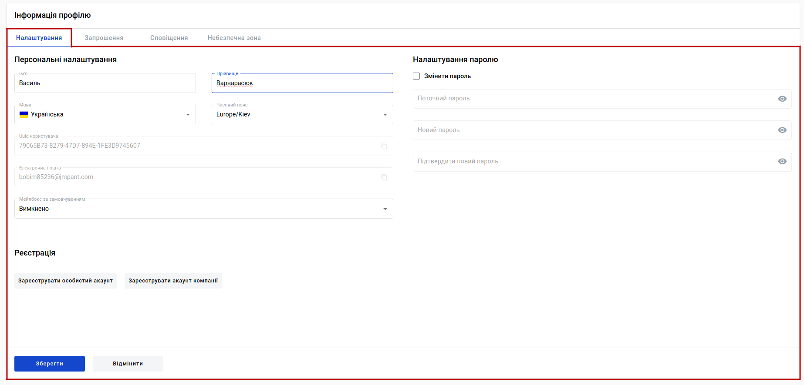

В **"Налаштуваннях"** відображаються:

* **Персональні налаштування** - блок, що містить персональні дані користувача (ім'я, прізвище), налаштування мови інтерфейсу сервісу WhiteDoc, часовий пояс, uuid користувача (не доступно до редагування), email користувача (не доступно до редагування) і налаштування мейлбокса, що буде відкриватись при вході в сервіс.
* **Налаштування паролю** - блок, що дозволяє **"Змінити пароль"** даного користувача, проставивши відповідну відмітку та вказавши поточний та новий пароль (з підтвердженням).
* **Реєстрація** - блок, що дозволяє користувачу **"Зареєструвати особистий акаунт"** чи **"Зареєструвати акаунт компанії"** (детальніше про особливості `реєстрації в сервісі WhiteDoc <https://wiki.edin.ua/uk/latest/WhiteDoc/WD_Instructions/WD_registration.html>`__). Натиснувши відповідні кнопки можливо зареєструвати акаунт, погодившись в pop-up вікні з правилами та умовами користування сервісом та політикою конфіденційності (для акаунта компанії потрібно додатково ввести ІПН та назву мейлбокса):

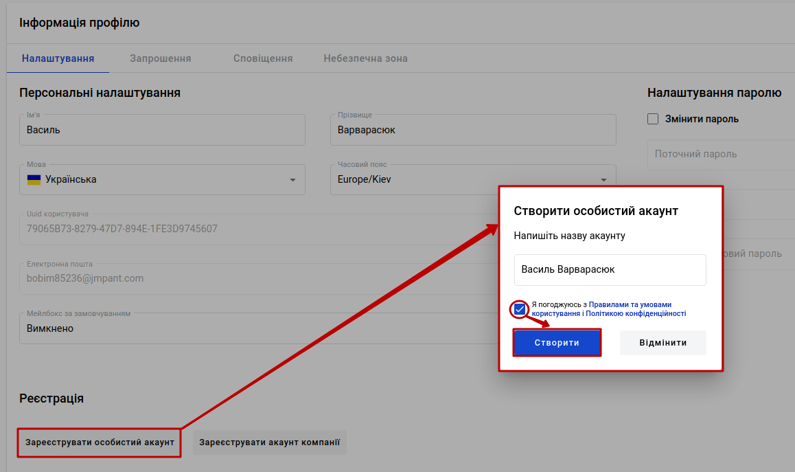

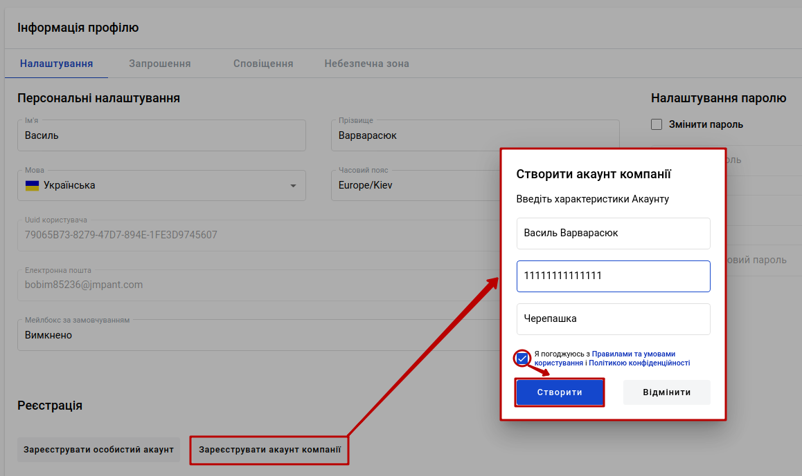

Всі зміни внесені у вкладці можливо **"Зберегти"** чи **"Відмінити"**:

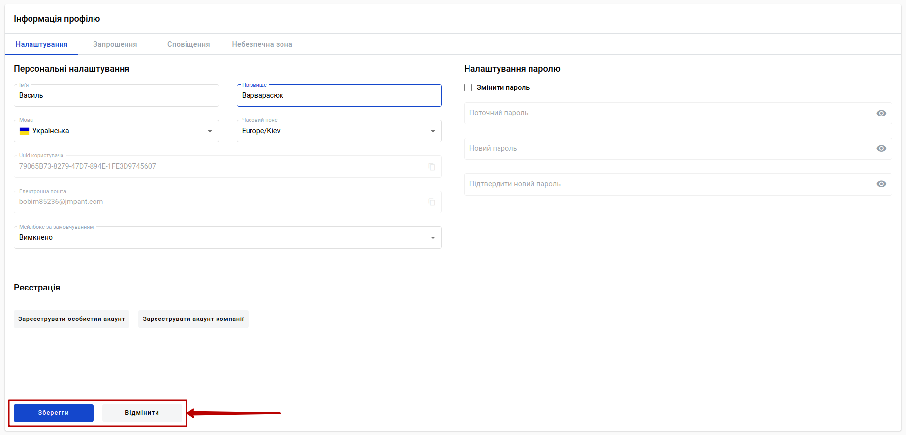

.. _invite:

**1.2 Запрошення**
-----------------------------------------------

У вкладці відображаються активні запрошення до мейлбокса чи аккаунта інших користувачів сервісу (запрошення відправляються з `"Панелі адміністратора" - Користувачі <https://wiki.edin.ua/uk/latest/WhiteDoc/WD_Instructions/WD_admin_panel.html#users>`__), що потребують рішення:

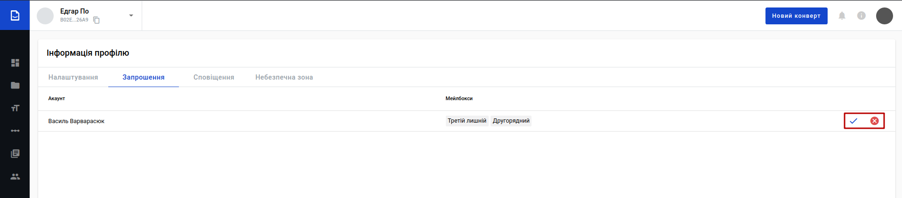

Користувач може **Прийняти** |accept| чи **Відхилити** |denied| запрошення з указаного акаунта. Після того, як користувач прийме запрошення у нього відкриється доступ до стороннього акаунта чи мейлбокса з визначеними налаштуваннями:

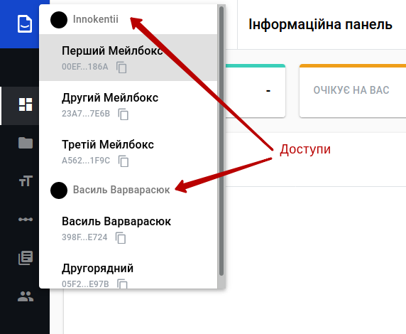

.. _notifications:

**1.3 Сповіщення**
-----------------------------------------------

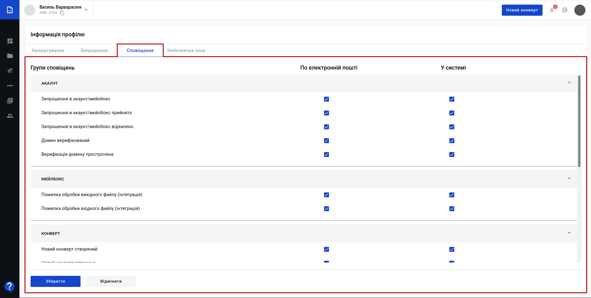

У вкладці відображаються налаштування сповіщень **по електронній пошті** та **у системі**, що розбиті на наступні групи:

+----------------------------------------+
|               **Акаунт**               |
+========================================+
| Запрошення в акаунт/мейлбокс           |
+----------------------------------------+
| Запрошення в акаунт/мейлбокс прийнято  |
+----------------------------------------+
| Запрошення в акаунт/мейлбокс відхилено |
+----------------------------------------+
| Домен верифікований                    |
+----------------------------------------+
| Верифікація домену прострочена         |
+----------------------------------------+

+----------------------------------------------+
|                 **Мейлбокс**                 |
+==============================================+
| Помилка обробки вихідного файлу (інтеграція) |
+----------------------------------------------+
| Помилка обробки вхідного файлу (інтеграція)  |
+----------------------------------------------+

+-----------------------------------------------------------+
|                        **Конверт**                        |
+===========================================================+
| Новий конверт створений                                   |
+-----------------------------------------------------------+
| Новий конверт отримано                                    |
+-----------------------------------------------------------+
| Роль закінчила обов'язкові дії на своєму кроці в конверті |
+-----------------------------------------------------------+
| Конверт завершений                                        |
+-----------------------------------------------------------+
| Конверт відхилений                                        |
+-----------------------------------------------------------+
| Конверт прострочений                                      |
+-----------------------------------------------------------+
| Конверт буде прострочений                                 |
+-----------------------------------------------------------+
| Новий коментар у конверті                                 |
+-----------------------------------------------------------+
| Нова відповідь на ваш коментар у конверті                 |
+-----------------------------------------------------------+
| Конверт доданий в ланцюжок                                |
+-----------------------------------------------------------+
| Конверт видалений з ланцюжка                              |
+-----------------------------------------------------------+

+------------------------------------+
|            **Довідник**            |
+====================================+
| Довідник завантажений на платформу |
+------------------------------------+
| Помилка з завантаженням довідника  |
+------------------------------------+

Більшість з цих сповіщень активовані за замовчуванням і за потреби користувач може сам обрати, про які події в сервісі і яким чином він буде проінформований.  

**1.4 Небезпечна зона**
-----------------------------------------------

**Небезпечна зона** - налаштування, що стосуються радикальних змін і в даному випадку ведуть до видалення конкретного користувача з сервісу WhiteDoc.

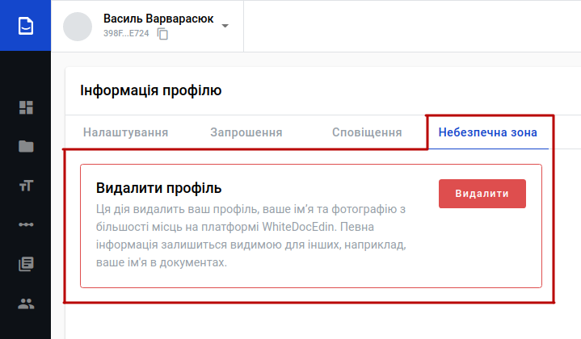

Дія видалення потребує підтвердження:

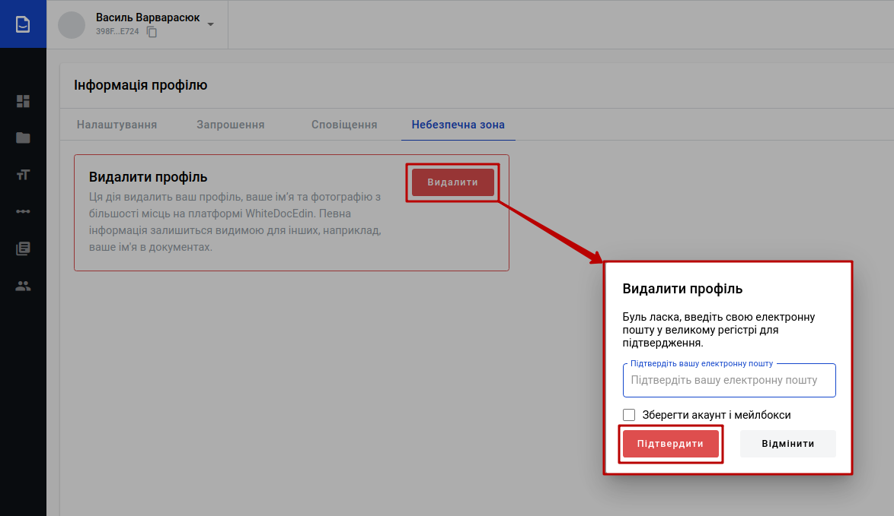

Можливо зберегти акаунт та всі мейлбокси, поставивши відмітку у цьому вікні.

------------------------------

.. include:: /_constant/kontakti.rst
