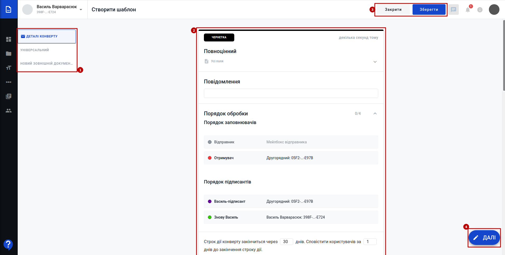
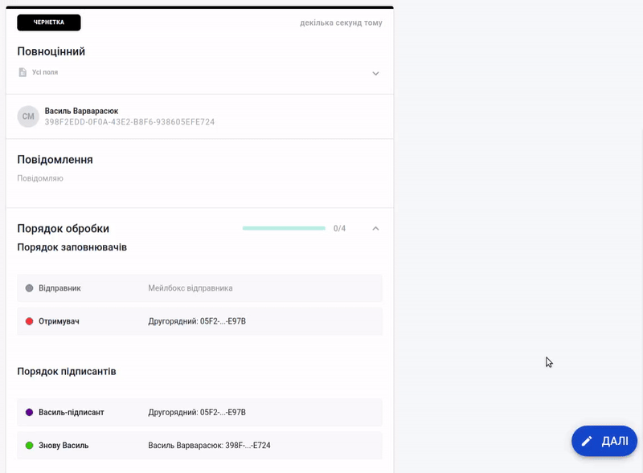

Робота з конвертами сервісу WhiteDoc
###################################################################

.. есть картинки с главной инструкции сервиса

.. |structed| image:: pics_Work_with_WD/Work_with_WD_039.png

.. |external| image:: pics_Work_with_WD/Work_with_WD_038.png

.. |clock| image:: pics_Work_with_Envelope/Work_with_Envelope_010.png

.. |comment| image:: pics_Work_with_Envelope/Work_with_Envelope_011.png

.. role:: red

.. role:: underline

.. contents:: Зміст:
   :depth: 7

---------

Вхід
================================================

WEB сервісом підтримуються **Google Chrome** та **Safari** браузери тому для роботи з документами рекомендовано використовувати саме їх. Для входу до сервісу платформи необхідно перейти за посиланням https://wd.edin.ua/login .

При переході за вказаним посиланням відкриється вікно авторизації. Необхідно ввести Вашу електронну пошту, пароль користувача і натиснути **"Увійти"**:

.. image:: pics_Work_with_WD/Work_with_WD_002.png
   :align: center

За проставленої відмітки **"Запам'ятати мене"** вводити дані наступного разу самостійно вже не буде потреби (браузер це зробить автоматично).  

.. hint::
   Нові користувачі можуть самостійно пройти "Реєстрацію" і долучитись до сервісу (детальніше в нашій `інструкції <https://wiki.edin.ua/uk/latest/WhiteDoc/WD_registration.html>`__).

**1 Формування та відправка конверта**
================================================

Для створення конверта потрібно мати підготовлений шаблон згідно якого і буде створено конверт.

.. tip::
    Перед початком роботи з конвертами рекомендовано ознайомитись з інструкцією по роботі з `шаблонами <https://wiki.edin.ua/uk/latest/WhiteDoc/WD_Instructions/Work_with_WD.html#template>`__.

Створюється конверт за допомогою кнопки **"Новий конверт"** (відображається в правому верхньому куті у всіх основних розділах сервісу):

.. image:: pics_Work_with_Envelope/Work_with_Envelope_001.png
   :align: center

Після чого в попап вікні потрібно обрати шаблон в зручний для Вас спосіб:

* з нещодавно використаних;

.. image:: pics_Work_with_Envelope/Work_with_Envelope_002.png
   :align: center

* за номером UUID:

.. image:: pics_Work_with_Envelope/Work_with_Envelope_003.gif
   :align: center

* з бібліотеки шаблонів:

.. image:: pics_Work_with_Envelope/Work_with_Envelope_004.png
   :align: center

Після чого згідно шаблону автоматично створюється конверт (чернетка) разом з документами і відкривається форма для його заповнення (можуть бути випадки, коли створений конверт не потребує заповнення зі сторони відправника):

Форма конверта складається з деталей конверта та самих документів (2), що створюються згідно шаблону. В лівій частині екрану є зручний показчик перебування (1). Конверт-чернетку можливо **"Закрити"** в будь-який момент чи **"Зберегти"** (3), якщо в нього заповнені поля "Тема" та "Повідомлення". Після збереження чернетки з'являється кнопка для її видалення (**"Видалити"**).

.. hint::
    В збереженій чернетці можливо обмінюватись коментарями |comment| (`детальніше про функціонал Коментарів <https://wiki.edin.ua/uk/latest/WhiteDoc/WD_Instructions/Work_with_Envelope.html#comments>`__)

В правому нижньому куті відображається кнопка (4) (**"Далі"** чи **"Відправити"**), що одночасно інформує про заповненість конверта (готовність до відправки) та є підказкою, що вказує на необхідність заповнення конкретних полів в документах конверта:

В сервісі є два типи документів: структуровані |structed| та зовнішні |external|.

.. note::
   |external| **Зовнішній документ** призначений для внесення файлу одним з учасників документообігу. Допускається додавання файлу-вкладення в форматі pdf, doc, docx, xls, xlsx, xml, dbf, txt, rtf, png, jpg, jpeg, zip не більше 5МБ (загальний розмір конверта при цьому не повинен перевищувати 25 МБ). В зовнішній документ можливо додати поля "ЕЦП" (інші поля не підтримуються).

   |structed| **Структурований документ** може включати в себе текст та `стандартні поля WhiteDoc <https://wiki.edin.ua/uk/latest/WhiteDoc/WD_Instructions/Work_with_WD.html#fields>`__ (детальніше за посиланням).

Після того, як всі обов'язкові поля будуть заповнені і конверт буде готовий до відправки кнопка **"Далі"** міняється на **"Відправити"**:

.. image:: pics_Work_with_Envelope/Work_with_Envelope_007.png
   :align: center

При натисканні на **"Відправити"** потрібно підтвердити дію відправки:

.. image:: pics_Work_with_Envelope/Work_with_Envelope_008.png
   :align: center

Відправлений конверт змінює свій статус на "В обробці", показується наступний порядок обробки конверта, а також є можливість одразу начіпити на конверт **"Новий ярлик"**:

.. image:: pics_Work_with_Envelope/Work_with_Envelope_009.png
   :align: center

Також у формі відправленого конверта можливо ознайомитись і експортувати в PDF **"Протокол подій"** (|clock|) - усіх дій, виконаних контрагентами з цим конвертом:

.. image:: pics_Work_with_Envelope/Work_with_Envelope_012.png
   :align: center

**2 Відхилення конверта**
================================================

Відправлений конверт в статусі "В обробці" чи "Очікує на вас" (на стороні поточного заповнювача/підписанта) можливо **"Відхилити"**:

.. image:: pics_Work_with_Envelope/Work_with_Envelope_013.png
   :align: center

Для відхилення конверта обов'язково потрібно вказати причину відхилення і підтвердити відхилення:

.. image:: pics_Work_with_Envelope/Work_with_Envelope_014.png
   :align: center

Після чого документ змінює свій статус на "Скасовано", а причина відхилення відображається учасникам в детялях конверта:

.. image:: pics_Work_with_Envelope/Work_with_Envelope_026.png
   :align: center

Документообіг завершено.

.. _comments:

**3 Коментарі**
================================================

------------------------------

.. include:: /_constant/kontakti.rst
