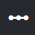
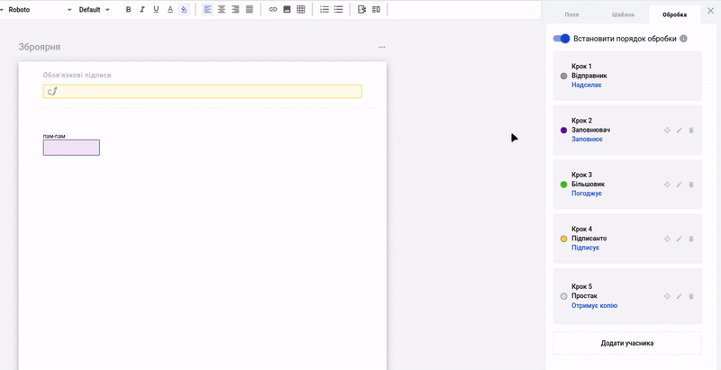
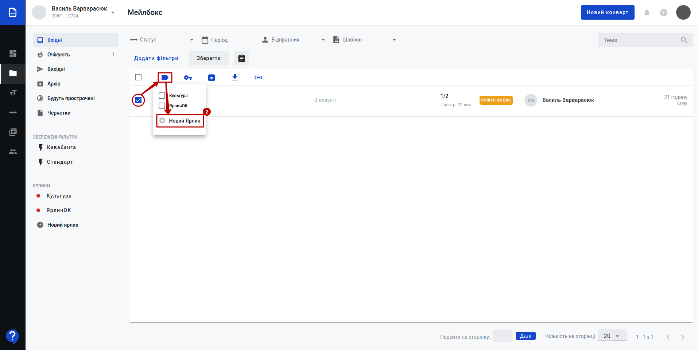
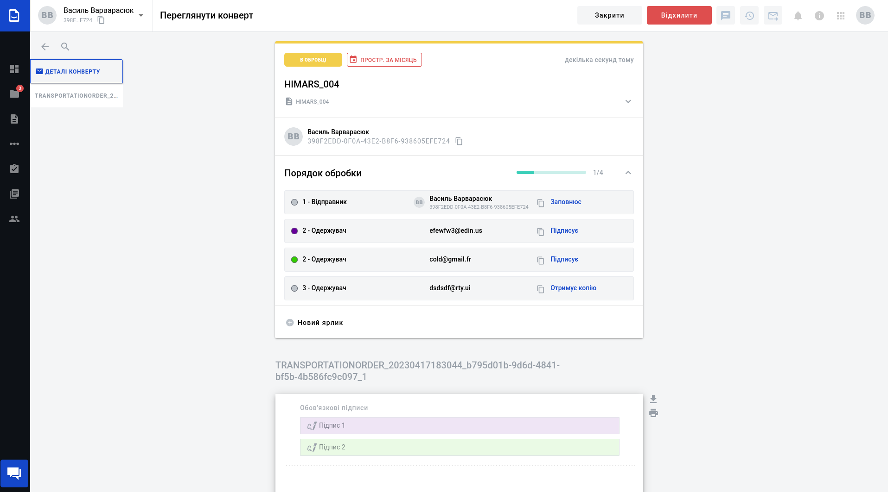

Робота з сервісом WhiteDoc. Загальні положення
###################################################################

.. сюда закину немного картинок для текста

.. |dashboard| image:: pics_Work_with_WD/Work_with_WD_009.png

.. |mailbox| image:: pics_Work_with_WD/Work_with_WD_008.png

.. |dictionary| image:: pics_Work_with_WD/Work_with_WD_005.png

.. |мусорка| image:: pics_Work_with_WD/Work_with_WD_022.png

.. |трикрапка| image:: pics_Work_with_WD/Work_with_WD_032.png

.. |structed| image:: pics_Work_with_WD/Work_with_WD_039.png

.. |external| image:: pics_Work_with_WD/Work_with_WD_038.png

.. |трикрапкаВ| image:: pics_Work_with_WD/Work_with_WD_041.png

.. |хрестик| image:: pics_Work_with_WD/Work_with_WD_054.png

.. |toggleON| image:: pics_Work_with_WD/Work_with_WD_057.png

.. |toggleOFF| image:: pics_Work_with_WD/Work_with_WD_056.png

.. |pencil| image:: pics_Work_with_WD/Work_with_WD_064.png

.. |download| image:: pics_Work_with_WD/Work_with_WD_065.png

.. |trash| image:: pics_Work_with_WD/Work_with_WD_066.png

.. |copy| image:: pics_Work_with_WD/Work_with_WD_087.png

.. |filter| image:: pics_Work_with_WD/Work_with_WD_092.png

.. |Inbox| image:: pics_Work_with_WD/Work_with_WD_122.png

.. |Outbox| image:: pics_Work_with_WD/Work_with_WD_124.png

.. |Drafts| image:: pics_Work_with_WD/Work_with_WD_127.png

.. |Flash| image:: pics_Work_with_WD/Work_with_WD_128.png

.. |дискета| image:: pics_Work_with_WD/Work_with_WD_180.png

.. role:: red

.. role:: underline

.. contents:: Зміст:
   :depth: 7

---------

Вступ
================================================

Cервіс WhiteDoc налічує кілька основних сутностей, доступ учасників до котрих на рівні акаунта регулюється адміністратором:

* **Акаунт** [1]_
* **Мейлбокс** [2]_
* **Конверт** [3]_
* **Шаблон** [4]_

Вхід
================================================

WEB сервісом підтримуються **Google Chrome** та **Safari** браузери тому для роботи з документами рекомендовано використовувати саме їх. Для входу до сервісу платформи необхідно перейти за посиланням https://edo.whitedoc.ua/login .

При переході за вказаним посиланням відкриється вікно авторизації. Необхідно ввести Вашу електронну пошту, пароль користувача і натиснути **"Увійти"**:

.. image:: pics_Work_with_WD/Work_with_WD_002.png
   :align: center

За проставленої відмітки **"Запам'ятати мене"** вводити дані наступного разу самостійно вже не буде потреби (браузер це зробить автоматично).  

.. hint::
   Нові користувачі можуть самостійно пройти "Реєстрацію" і долучитись до сервісу (детальніше в нашій `інструкції <https://wiki.edin.ua/uk/latest/WhiteDoc/WD_registration.html>`__).

**1 Загальний вигляд сервісу WhiteDoc**
================================================

Після успішної авторизації відкриється інтерфейс сервісу WhiteDoc:

1. Поточний мейлбокс, відносно якого виконується документообіг. Ви маєте можливість створити будь-яку кількість мейлбоксів та налаштувати доступ до них необхідним користувачам;
2. Вказівник поточного місцеперебування в сервісі (допомагає орієнтуватись в меню та між розділами сервісу);
3. Бокова панель сервісу, що складається з:
   
   * |dashboard| **Інформаційна панель** - дошка для перегляду активності, швидкого отримання інформації по поточному мейлбоксу (переходи та швидкі дії з останніми конвертами, шаблонами). Детальніше в розділі Інформаційна панель.
   * |mailbox| **Скринька** - основний розділ документообігу; містить всі вхідні/вихідні конверти, журнал для пошуку, підготовки чернеток, роботи з уже відправленими власними документами чи документами контрагентів. Детальніше в розділі `Скринька <https://wiki.edin.ua/uk/latest/WhiteDoc/WD_Instructions/Work_with_WD.html#mailbox>`__.
   * |template| **Шаблони** - розділ для створення/редагування/видалення шаблонів, без яких неможливе формування і відправка документів в сервісі WhiteDoc. Детальніше в розділі `Шаблони <https://wiki.edin.ua/uk/latest/WhiteDoc/WD_Instructions/Work_with_WD.html#template>`__.
   * |scenario| **Сценарії** - керування алгоритмами документообігу. Детальніше в розділі Сценарії.
   * |approval| **Погодження** - керування `Погодженнями <https://wiki.edin.ua/uk/latest/WhiteDoc/WD_Instructions/Work_with_WD.html#reconciliation>`__.
   * |dictionary| **Управління довідниками** - керування довідниками для спрощення роботи з шаблонами та часткової автоматизації введення даних в документ. Детальніше в розділі Управління довідниками.
   * |contacts| **Контакти** - керування контактами учасників документообігу. Детальніше в розділі Контакти.
4. Кнопка для швидкого створення конверта;
5. Сповіщення в системі на рівні користувача;
6. Корисна інформація;
7. Корисні посилання на зовнішні ресурси (кнопка відобарається після `відповідних налаштувань <https://wiki.edin.ua/uk/latest/WhiteDoc/WD_Instructions/WD_admin_panel.html#useful-links>`__);
8. Обліковий запис, його адміністрування та вихід;

.. _template:

**2 Шаблони**
================================================

В журналі шаблонів (2) відображаються список шаблонів (в алфавітному порядку), в залежності від обраної категорії (мають різні рівні доступу) (1):

* |template_my| **"Мої шаблони"** відображає всі шаблони (у всіх підлеглих папках), до яких є доступ тільки у користувачів мейлбокса;
* |template_acc| **"Шаблони акаунта"** відображає всі шаблони (у всіх підлеглих папках), до яких є доступ тільки у користувачів акаунта;
* |template_of| **"Офіційні шаблони"** відображає всі шаблони (у всіх підлеглих папках), до яких є доступ у всіх користувачів сервісу WhiteDoc;
* |template_sh| **"Поділились з вами"** відображає всі шаблони (у всіх підлеглих папках), якими з Вами поділились (Ваш мейлбокс обрали в `налаштуваннях доступу шаблону <https://wiki.edin.ua/uk/latest/WhiteDoc/WD_Instructions/Work_with_WD.html#template-details>`__).

Клік лівою кнопкою мишки на шаблон в журналі автоматично створює по ньому конверт (детальніше в розділі `Формування конверта <https://wiki.edin.ua/uk/latest/WhiteDoc/WD_Instructions/Work_with_Envelope.html#create-envelope>`__).

В журналі відображаються обкладинки шаблонів (за замовчуванням прев'ю першої сторінки документа). Під кожним шаблоном відображається іконка доступу та відносна дата/час створення шаблону. При наведенні курсора на шаблон відображається опис шаблона:

.. image:: pics_Work_with_WD/Work_with_WD_204.png
   :align: center

Під кнопкою |трикрапка| знаходиться випадаючий список дій, які можливо виконати з готовим шаблоном:

* **Редагувати** - відкриває форму для редагування шаблону (детальніше в розділі `Редагування шаблону <https://wiki.edin.ua/uk/latest/WhiteDoc/WD_Instructions/Work_with_WD.html#template-edit>`__); 
* **Копіювати uuid** - копіює унікальний ідентифікатор для зручної співпраці з колегами над одним шаблоном;
* **Клонувати** - створює копію обраного шаблону з приставкою "Копія" в назву оригінального шаблону;
* **Перенести** - встановлює місцерозташування шаблону в каталогах на рівні доступу, що вказаний в шаблоні (серед папок **"Мої шаблони"** чи **"Шаблони акаунта"**). В попап вікні можливо :underline:`створити` та :underline:`обрати` папку для зберігання шаблону:

.. image:: pics_Work_with_WD/Work_with_WD_036.gif
   :align: center
   
* **Перейменувати** - переіменування шаблону:

* **Видалити** - видаляє шаблон (дію **"Видалити"** потрібно додатково підтверджувати):

За допомогою кнопки **"Новий шаблон"** створюється новий шаблон в каталозі **"Мої шаблони"** (може також відображатись в **"Шаблони акаунта"** за встановленого рівня доступу). За допомогою функціоналу по створенню внутрішніх папок (кнопка **"Нова папка"**) можливо розробити структуру для зручної класифікації і пошуку потрібних шаблонів:  

Пошук здійснюється серед усіх доступних шаблонів і виконується за "Назвою" чи "Описом" шаблону (обов'язкові поля).

.. _work-with-folders:

**2.1 Робота з папками**
-----------------------------------------------

Для створення нової папки потрібно натиснути на кнопку **"Нова папка"**, після чого відкриється попап-вікно для введення назви папки:

Папку з вказаною назвою можливо **"Зберегти"** чи **"Відмінити"** її створення. Після зберігання папка відображається на рівні категорій. Таким чином можливо формувати структуру вкладених папок (при цьому в журналі відображаються шаблони, що знаходяться безпосередньо в обраній папці):

Перебуваючи в папці, можливо натиснути на назву папки в шаблоні лівою кнопкою миші для виконання дій з папкою:

* **Перенести** папку в структурі папок на рівні категорії. В попап вікні можливо :underline:`створити` та :underline:`обрати` папку для зберігання шаблону:

.. image:: pics_Work_with_WD/Work_with_WD_036.gif
   :align: center

* **Перейменувати** папку:

* **Видалити** папку (дію **"Видалення"** порожньої папки потрібно додатково підтверджувати):

Якщо ж папка містить шаблони чи інші папки з шаблонами, то система запитає куди **Перенести** вміст папки перед її видаленням:

.. _template-create:

**2.2 Створення нового шаблону**
-----------------------------------------------

Для створення нового шаблону потрібно натиснути на кнопку **"Новий шаблон"**, яка відкриває форму для створення нового шаблону:

.. note::
   Шаблони завжди створюється "в ногах" категорії, тобто для того, щоб він зберігався в папці, його потрібно **Перенести**!

Форму створення/редагування шаблону умовно можливо поділити на "Вміст" (наповнення документів) (1) та "Налаштування шаблону" (2):

Немає значення з чого починати заповнювати майбутній шаблон.

.. note::
   **"Зберегти"** шаблон можливо лише після заповнення обов'язкових полів `Налаштувань <https://wiki.edin.ua/uk/latest/WhiteDoc/WD_Instructions/Work_with_WD.html#template-settings>`__ (при цьому форма документа не повинна бути порожньою).

.. _template-edit:

**2.2.1 Формування / редагування документів шаблону**
''''''''''''''''''''''''''''''''''''''''''''''''''''''''''''''''''''''''''''''

Форму для редагування документів (вона є спільною для всіх документів на рівні шаблону) в свою чергу можливо поділити на кілька структурних блоків:

1. Кнопка додавання нового **структурованого** [6]_ (додається при створенні шаблону за замовчуванням) чи **зовнішнього документа** [5]_ до шаблону (**"+Новий документ"**):

.. image:: pics_Work_with_WD/Work_with_WD_044.png
   :align: center

Зовнішній вигляд **структурованого документа** [6]_ на відміну від **зовнішнього** [5]_ не регламентовано, а також **структурований документ** [6]_ має ряд функціональних переваг (далі в інструкції). 

2. Список документів в шаблоні - допомагає швидко переходити між документами/параграфами, переміщати документи між собою по списку, потягнувши за |new_post|:

.. hint::
   За потреби бокову панель можливо згорнути / розгорнути:

   .. image:: pics_Work_with_WD/Work_with_WD_220.gif
      :align: center

3. Панель візуального редактора (`WYSIWYG <https://uk.wikipedia.org/wiki/%D0%92%D1%96%D0%B7%D1%83%D0%B0%D0%BB%D1%8C%D0%BD%D0%B8%D0%B9_%D1%80%D0%B5%D0%B4%D0%B0%D0%BA%D1%82%D0%BE%D1%80>`__), за допомогою якої зручно в онлайн режимі працювати з оформленням документа (додавати параграфи, змінювати шрифти, форматувати текст, працювати з зображеннями, таблицями та посиланнями);
4. Безпосередня форма самого документа;
5. Вкладка для роботи з наповненням документів `Полями <https://wiki.edin.ua/uk/latest/WhiteDoc/WD_Instructions/Work_with_WD.html#fields>`__.

Кожен документ має назву, що доступна до редагування через подвійний клік (після редагування потрібно підтвердити |галочка| чи відхилити |хрестик| зміни):

За допомогою кнопки |трикрапка| можливо обрати дію:

.. image:: pics_Work_with_WD/Work_with_WD_222.png
   :align: center

* **Клонувати** обраний документ (копіюються всі поля і переносяться в новий документ);
* **Видалити** документ (дія **"Видалення"** потребує додаткового підтвердження):

* Обрати **Розмір сторінки** (з доступних варіантів) для зручності друку / перегляду (дія доступна лише для **структурованого документа** [6]_):

* Змінити **Орієнтацію сторінки** на книжкову / альбомну (дія доступна лише для **структурованого документа** [6]_).

Робота з наповненням **структурованого документа** [6]_ базується на:

1) роботі з текстом / таблицями / зображеннями за допомогою панелі візуального редактора - незмінна частина;
2) додаванні `Полів <https://wiki.edin.ua/uk/latest/WhiteDoc/WD_Instructions/Work_with_WD.html#fields>`__, що повинні чи можуть бути заповнені учасниками документообігу.

.. important::
   До **зовнішнього документа** [5]_, що вже містить область для додавання файлу можливо додати лише такі `Поля <https://wiki.edin.ua/uk/latest/WhiteDoc/WD_Instructions/Work_with_WD.html#fields>`__, як **Підпис** та **ЕЦП**. Сильна сторона **зовнішнього документа** [5]_ - це простота!

   .. image:: pics_Work_with_WD/Work_with_WD_226.png
      :align: center

.. attention::
   Не додавайте табличні елементи із зовнішніх джерел чи буфера пам'яті. Рекомендується створення таблиць і інших елементів, використовуючи функціонал конструктора документа.

`Поля <https://wiki.edin.ua/uk/latest/WhiteDoc/WD_Instructions/Work_with_WD.html#fields>`__ можливо додавати в документ проставивши курсор в місце, де потрібно обрати **Поле**:

Або виконати перетягування поля в потрібну область форми документа (так званий "Drag-and-drop" спосіб):

Після додавання поля з'являється попап вікно з властивостями нового поля, в яких обов'язково потрібно вказати його налаштування (детальніше про особливості кожного типу `Поля <https://wiki.edin.ua/uk/latest/WhiteDoc/WD_Instructions/Work_with_WD.html#fields>`__) та **"Зберегти"** вказані параметри:

.. hint::
   Для зручності поля виділяються кольором учасника, який їх заповнює.

.. _properties:

Властивості поля доступні до редагування - для цього потрібно обрати поле лівою кнопкою миші:

.. image:: pics_Work_with_WD/Work_with_WD_228.png
   :align: center

Властивості різних типів **Полів** відрізняються і детальніше описані в наступному підрозділі, однак можливо виділити кілька спільних:

   * **"Назва"** - назва поля, що є обов'язковою та унікальною на рівні шаблону (за замовчуванням заповнюється назвою типу поля + номер такого типу поля);
   * **"Назва ролі"** - прив'язка до Назви `Ролі Учасника документообігу <https://wiki.edin.ua/uk/latest/WhiteDoc/WD_Instructions/Work_with_WD.html#roles>`__ (обов'язково вказується). До цієї назви ролі вказується конкретний Учасник документообігу, що має вводити значення в поле майбутнього документа (роль з типом **Заповнює**) чи накладати підпис (роль з типом **Підписує**);
   * **"Підказка"** - текст, що виводиться в коміці поля учасникам документообігу для спрощення заповнення;
   * **"Опціональне"** - налаштування опціональності заповнення поля:
   
      * |toggleON| - поле опціональне до заповнення;
      * |toggleOFF| - поле обов'язкове до заповнення (за замовчуванням);
   * **"Пошук"** - властивість здійснювати фільтрування конверта та вивід інформації з поля в журналі `"Скриньки" <https://wiki.edin.ua/uk/latest/WhiteDoc/WD_Instructions/Work_with_WD.html#mailbox>`__:
   
      * |toggleON| - поле можливо знайти за назвою за допомогою кнопок **"Налаштувати перегляд"** та **"Додати фільтри"** в розділі `"Скринька" <https://wiki.edin.ua/uk/latest/WhiteDoc/WD_Instructions/Work_with_WD.html#mailbox>`__;
      * |toggleOFF| - пошук вимкнено (за замовчуванням).

Для додавання нової `Ролі Учасника документообігу <https://wiki.edin.ua/uk/latest/WhiteDoc/WD_Instructions/Work_with_WD.html#roles>`__ в "Назві ролі" потрібно обрати та натиснути **"+Створити нову роль"** та ввести свою назву:

Після чого у вкладку **"Обробка"** додається нова роль, з типом **Заповнює** (виключення: для поля **ЕЦП** задається тип ролі **Підписує**). Детальніше про `Ролі Учасника документообігу <https://wiki.edin.ua/uk/latest/WhiteDoc/WD_Instructions/Work_with_WD.html#roles>`__ за посиланням.

При додаванні поля майже усі властивості заповнюються автоматично за замовчуванням. При зберіганні нового поля чи редагуванні вже доданого обов'язкові поля виділяються червоним кольором, наприклад:

.. _fields:

**2.2.1.1 Поля**
..............................................................................

В **структурований документ** [6]_ можливо додавати необмежену кількість наступних полів:

* `Текст <https://wiki.edin.ua/uk/latest/WhiteDoc/WD_Instructions/Work_with_WD.html#text>`__
* `Число <https://wiki.edin.ua/uk/latest/WhiteDoc/WD_Instructions/Work_with_WD.html#number>`__
* `Валюта <https://wiki.edin.ua/uk/latest/WhiteDoc/WD_Instructions/Work_with_WD.html#currency>`__
* `Дата та час <https://wiki.edin.ua/uk/latest/WhiteDoc/WD_Instructions/Work_with_WD.html#date-and-time>`__
* `Довідник <https://wiki.edin.ua/uk/latest/WhiteDoc/WD_Instructions/Work_with_WD.html#dictionary-f>`__
* `Файл <https://wiki.edin.ua/uk/latest/WhiteDoc/WD_Instructions/Work_with_WD.html#file>`__
* `Таблиця <https://wiki.edin.ua/uk/latest/WhiteDoc/WD_Instructions/Work_with_WD.html#table>`__
* `Підпис <https://wiki.edin.ua/uk/latest/WhiteDoc/WD_Instructions/Work_with_WD.html#signature>`__
* `Так/Ні <https://wiki.edin.ua/uk/latest/WhiteDoc/WD_Instructions/Work_with_WD.html#yes-no>`__
* `Лукап <https://wiki.edin.ua/uk/latest/WhiteDoc/WD_Instructions/Work_with_WD.html#lookup>`__
* `ЕЦП <https://wiki.edin.ua/uk/latest/WhiteDoc/WD_Instructions/Work_with_WD.html#QES>`__
* `Дублікат <https://wiki.edin.ua/uk/latest/WhiteDoc/WD_Instructions/Work_with_WD.html#duplicate>`__
* `Формула <https://wiki.edin.ua/uk/latest/WhiteDoc/WD_Instructions/Work_with_WD.html#formula>`__
* `Нумератор <https://wiki.edin.ua/uk/latest/WhiteDoc/WD_Instructions/Work_with_WD.html#numerator>`__

.. important::
   До **зовнішнього документа** [5]_, що вже містить область для додавання файлу можливо додати лише такі `Поля <https://wiki.edin.ua/uk/latest/WhiteDoc/WD_Instructions/Work_with_WD.html#fields>`__, як **Підпис** та **ЕЦП**. Сильна сторона **зовнішнього документа** [5]_ - це простота!

.. _text:

**Текст**
******************************************************************************

**Текст** - текстове поле з "Підказкою":

**"Багатострочне"** - налаштування вигляду форми для заповнення:

   * |toggleON| - поле може бути багастоковим;
   * |toggleOFF| - поле однострокове (за замовчуванням).

В поле можливо внести від 0 до 1000 символів (за замовчуванням), але ці властивості можливо обмежити (Мін. / Макс.) під час додавання чи редагування поля шаблону:

Під час **заповнення** поля ці властивості вказуються при наведенні курсора:

.. image:: pics_Work_with_WD/Work_with_WD_234.png
   :align: center

.. _number:

**Число**
******************************************************************************

**Число** - числове поле з текстовою "Підказкою":

.. image:: pics_Work_with_WD/Work_with_WD_235.png
   :align: center

В поле можливо внести від -9007199254740991 до 9007199254740991 (за замовчуванням), але ці властивості можливо обмежити (Мін. / Макс.) під час додавання чи редагування поля шаблону. Додатково є властивість **"Точність"**, що дозволяє роширити кількість (до 7) допустимих до введення чисел після крапки (за замовчуванням доступно внести число з десятими (одне число після крапки)):

Під час **заповнення** поля ці властивості вказуються при наведенні курсора:

.. image:: pics_Work_with_WD/Work_with_WD_161.png
   :align: center

.. _currency:

**Валюта**
******************************************************************************

**Валюта** - числове поле з текстовою "Підказкою", в яке вводиться числове значення з двома числами після крапки (на відміну від поля **Число**):

В поле можливо внести від -9007199254740991 до 9007199254740991 (за замовчуванням), але ці властивості можливо обмежити (Мін. / Макс.) під час додавання чи редагування поля шаблону:

Під час його **заповнення** вказуються властивості цього поля:

.. image:: pics_Work_with_WD/Work_with_WD_162.png
   :align: center

.. _date-and-time:

**Дата та час**
******************************************************************************

**Дата та час** - "picker" (підхоплювач) для дати та часу з текстовою "Підказкою":

**"Час"** - опціональні налаштування додатково вносити учаснику ще й час:

* |toggleON| - поле підхоплює дату та час;
* |toggleOFF| - поле підхоплює лише дату (за замовчуванням).

Також додатково можливо обмежити внесення дат від -9999 до 9999 (Мін. / Макс.) під час додавання чи редагування поля шаблону:

Під час його **заповнення** вказуються властивості цього поля:

Під час **заповнення** поля потрібно натиснути на іконку календаря, обрати і підтвердити дату та час в зручному віконці:

.. image:: pics_Work_with_WD/Work_with_WD_168.png
   :align: center

.. _dictionary-f:

**Довідник**
******************************************************************************

**Довідник** - поле, що потребує підключення налаштованого довідника (детальніше в розділі `Управління довідниками <https://wiki.edin.ua/uk/latest/WhiteDoc/WD_Instructions/Work_with_WD.html#dictionary>`__). 

При додаванні поля необхідно вказувати "Довідник" (здійснюється пошук за назвою та описом довідника) та одна з його колонок (селектор):

Окрім "стандартних властивостей" полів при додаванні поля чи його редагуванні можливо увімкнути **"Довільне значення"** при заповненні:

* |toggleON| - значення може бути довільним (значення відсутнє в довіднику);
* |toggleOFF| - значення обирається з довідника (за замовчуванням).

**Заповнення** цього поля виглядає, як поле-селектор. В запропонованому списку відображається лише 20 результатів і для пошуку потрібно почати вводити частину значення в поле. Вибір значення може впливати на інші поля, тому приклад заповнення повною мірою показано в описі `Лукап <https://wiki.edin.ua/uk/latest/WhiteDoc/WD_Instructions/Work_with_WD.html#lookup>`__ чи `Дублікат <https://wiki.edin.ua/uk/latest/WhiteDoc/WD_Instructions/Work_with_WD.html#duplicate>`__.

.. _file:

**Файл**
******************************************************************************

**Файл** - поле, що дозволяє на етапі заповнення долучити до документа вкладення розміром до 10 МБ (максимальний розмір всіх файлів у вкладенні не має перевищувати 30 МБ):

Обов'язково потрібно обрати з випадаючого списку "Розширення файлу":

   * "Усі" (допустимі формати: .pdf, .doc, .docx, .xls, .xlsx, .xlsm, .xml, .dbf, .txt, .rtf, .cvs, .xps, .png, .jpg, .jpeg, .zip, .7z, .rar);
   * "Файл" (допустимі формати: .pdf, .doc, .docx, .xls, .xlsx, .xlsm, .xml, .dbf, .txt, .rtf, .cvs, .xps);
   * "Документ" (допустимі формати: .pdf);
   * "Зображення" (допустимі формати: .png, .jpg, .jpeg);
   * "Архів" (допустимі формати: .zip, .7z, .rar).

Під час його **заповнення** при наведенні курсора на комірку вказуються властивості цього поля:

Отримувач документа для того, щоб переглянути файл повинен попередньо зберегти його локально.

.. _table:

**Таблиця**
******************************************************************************

**Таблиця** - додає в документ :underline:`динамічну` таблицю. Динамічна таблиця дозволяє користувачу, на якого назначена роль "Відправника" чи "Заповнювача" створювати / заповнювати рядки (min=1, max=необмежено) відповідно до налаштувань шаблону:

При додаванні :underline:`динамічної` таблиці обов'язково вказується кількість "Колонок". Після додавання поля кількість "Колонок" редагується в самій таблиці кліком правою кнопки миші біля колонки, що потребує редагування:

За допомогою правої кнопки миші таож можливо змінити вирівнювання тексту в комірці:

**"Нумерація рядків"** - налаштування автоматичного нумерування рядків:

.. image:: pics_Work_with_WD/Work_with_WD_250.png
   :align: center

.. note:: 
   До першого рядка потрібно додати інші поля, а весь введений при створенні таблиці текст виступає в якості константи!
   
   .. image:: pics_Work_with_WD/Work_with_WD_252.png
      :align: center

Розмір таблиці по горизонталі також доступний до редагування за допомогою перетягування розділювачів комірок мишкою:

.. image:: pics_Work_with_WD/Work_with_WD_254.gif
   :align: center

Під час **заповнення** таблиці, кнопками "+"/"-" можливо додавати рядки, у визначеному шаблоном форматі, наприклад:

.. _signature:

**Підпис**
******************************************************************************

**Підпис** - поле, що дозволяє користувачу поставити власний підпис на зразок класичного підпису "ручкою на папері".

Під час **заповнення** поля викликається вікно для введення електронно-чорнильного підпису, де можливо обрати спосіб:

* **Рукописний підпис**:

* **Текст**:

При **Підписанні** цей підпис зберігається в `Профілі користувача <https://wiki.edin.ua/uk/latest/WhiteDoc/WD_Instructions/WD_user_profile.html>`__ і наступного разу підпис накладається в один клік автоматично!

.. _yes-no:

**Так/Ні**
******************************************************************************

**Так/Ні** - поле вибору між двох опцій з текстом до 50 символів (за замовчуванням "так" чи "ні"):  

.. image:: pics_Work_with_WD/Work_with_WD_258.png
   :align: center

Під час **заповнення** поля учасник (обрана роль) обирає одну з опцій лівою кнопкою миші (опцію можливо переобрати):

.. _lookup:

**Лукап**
******************************************************************************

**Лукап** - поле потребує попереднього додавання в документ шаблону хоча б одного поля **Довідник** (1):

При додаванні поля **Лукап** (2) у властивостях потрібно обрати: 

   * "Документ" шаблону, в якому вже присутнє хоча б одне поле **Довідник**;
   * "Пов'язано з" - потрібно обрати за назвою один з використаних довідників в обраному документі;
   * "Назва колонки" обраного довідника.

.. note::
   Використання **Довідника** передбачає доступ до відповідного довідника.

.. attention::
   Можливий кейс, коли користувач може заповнити всі поля пошуку в конверті, зберегти цей конверт, як чернетку та надіслати пізніше. Якщо хтось змінить довідник (оновить записи, видалить стовпець або видалить довідник) перед тим, як користувач надішле чорновий конверт із полями пошуку, користувач побачить повідомлення про помилку з інформацією про зміни довідника. Якщо довідник було видалено, усі пошукові поля, які стосуються цього поля довідника, будуть виділені червоним кольором. 

Поле **Лукап** не потребує **заповнення**, оскільки воно залежне від поля **Довідника** і значення обирається автоматично згідно налаштувань в шаблоні під час **заповнення** документа Учасником, що заповнює поле **Довідник**:

.. image:: pics_Work_with_WD/Work_with_WD_169.gif
   :align: center

.. _QES:

**ЕЦП**
******************************************************************************

**ЕЦП** - поле електронного цифрового підпису, що обумовлює підписання документа (юридична значущість):

У WhiteDoc для `Підписання <https://wiki.edin.ua/uk/latest/WhiteDoc/WD_Instructions/Work_with_WD.html#sign>`__ можливо обрати один із кількох доступних способів. Поле **ЕЦП** за замовчуванням дозволяє Учаснику-Підписанту використовувати Електронний Цифровий Ключ (AES) з локального сховища, однак за допомогою активації (|toggleON|) властивості **Кваліфікований** при створенні / редагуванні поля можливо накласти обмеження на Учасника-Підписанта: підписувати лише за допомогою Кваліфікованого Електронного Підпису (КЕП) [7]_.

За активної (|toggleON|) властивості **Печатка обов'язкова** Учаснику-Підписанту окрім підпису потрібно буде додавати цифрову печатку!

 .. important::
   Якщо ж Ви поставите відмітку **ЄДРПОУ або ІНН**, то у властивостях поля потрібно буде обрати поле **Текст** або **Довідник** одного з документів шаблону:

   .. image:: pics_Work_with_WD/Work_with_WD_262.png
      :align: center

   Під час **підписання** документа конверта буде здійснюватись перевірка на відповідність введеного значення в обране поле з ЄДРПОУ / ІНН підпису: якщо значення не співпадатимуть, то підписання не відбуватиметься!

Поле **ЕЦП** завжди відобраєаться у верхній частині документа. Ви можете додати одне поле електронного підпису до одного документа для однієї ролі підписанта, інакше система сповістить про те, що:

.. image:: pics_Work_with_WD/Work_with_WD_108.png
   :align: center

.. note::
   При видаленні ролі із призначеними на неї полями електронного підпису, потрібно повторно призначити поле іншій ролі, якщо така є. Якщо ні, роль буде видалена разом з полями.

   .. image:: pics_Work_with_WD/Work_with_WD_110.png
      :align: center

.. important::
   Підписанти в процесі `Обробки <https://wiki.edin.ua/uk/latest/WhiteDoc/WD_Instructions/Work_with_WD.html#doc-order-rules>`__ зможуть встановити підпис на конверті лише тоді, коли всі правонаступники заповнять дані документа. 

Процес `Підписання <https://wiki.edin.ua/uk/latest/WhiteDoc/WD_Instructions/Work_with_WD.html#sign>`__ документа відправленого конверта описаний за посиланням.

.. _duplicate:

**Дублікат**
******************************************************************************

**Дублікат** - поле, що копіює значення будь-якого іншого поля обраного документа (вибір поля за назвою). **Дублікат** (2) дозволяє копіювати наступні типи полів: **Текст**, **Число**, **Валюта**, **Дата та час**, **Довідник**, **Так / Ні**, **Нумератор** (1):

Щоб заповнити **Дублікат**, потрібно, щоб Учасник-Заповнювач надав значення "батьківському" полю - **Дублікат** заповнюється автоматично, копіюючи це значення:

.. _formula:

**Формула**
******************************************************************************

**Формула** дозволяє виконувати числові операції з Аргументами з вказаною точністю: 

В якості Аргументів можуть виступати значення інших полів даного шаблону:  **Число**, **Валюта**, **Довідник** (числові значення!), **Лукап**, **Дублікат**, інша **Формула**. Математичні операції умовно можливо поділити на ті, що виконуються зі:

1) значеннями обраних за назвою полів (**Число**, **Валюта**, **Довідник** (числові значення!), **Лукап**, **Дублікат**, інша **Формула**):

   * **SUM**: (=А1+А2+ ...) - сумує всі вказані числові поля (min два Аргументи). Аргументи додаютья кнопкою **"+додати аргумент"**;
   * **PRUDUCT**: (=А1*А2* ...) - перемножає всі вказані числові поля (min два Аргументи). Аргументи додаютья кнопкою **"+додати аргумент"**;
   * **SUBTRACT**: (=А1-А2- ...) - віднімає всі вказані числові поля (min два Аргументи). Аргументи додаютья кнопкою **"+додати аргумент"**;
   * **DIVIDE**: (=А1/А2) - повертає результат ділення двох Аргументів.

   .. image:: pics_Work_with_WD/Work_with_WD_265.png
      :align: center

2) значеннями одного обраного стовпця динамічної **Таблиці**, в який було додано числове поле (**Число**, **Валюта**, **Довідник** (числові значення!), **Лукап**, **Дублікат**, інша **Формула**):

   * **SUM стовпця таблиці**: (=А1+А2+ ...) - сумує всі значення стовпця;
   * **MIN стовпця таблиці**: (=А, А<Аn) - повертає найменше число в стовпці;
   * **MAX стовпця таблиці**: (=А, А>Аn) - повертає найбільше число в стовпці;
   * **COUNTA стовпця таблиці**: (=n, Аn) - повертає кількість комірок в стовпці; ця операція не має параметра точності, оскільки її результатом завжди буде ціле число.

Значення поля **Формула** вираховується автоматично за вказаними Аргументами. 

.. _numerator:

**Нумератор**
******************************************************************************

Поле **Нумератор** дозволяє автоматично присвоювати порядковий номер кожному новому створеному конверту:

В нумератор можливо додати **Префікс** на 15 символів (одразу відображається приклад вигляду в документі):

.. _template-settings:

**2.2.2 Налаштування та обробка шаблону**
''''''''''''''''''''''''''''''''''''''''''''''''''''''''''''''''''''''''''''''

Налаштування шаблону доступні одразу при його створенні і знаходяться у вкладках **"Шаблон"** та **"Обробка"**:

.. _template-details:

**2.2.2.1 Налаштування шаблону**
..............................................................................

На початку створення шаблону чи після заповнення / додавання нових документів потрібно перейти у вкладку **"Шаблон"**, де містяться основні деталі та налаштування:

Обов'язкові до заповнення поля позначені червоною зірочкою :red:`*` ("Назва" і "Опис" шаблону). За замовчуванням шаблон буде створено в кореневому каталозі **"Мої шаблони"** з доступом до шаблону на рівні мейлбокса. За допомогою іконки |олівець| можливо змінити розташування шаблону, рівень доступу до шаблону.

**1) Задати розташування шаблону:**

В попап вікні можливо :underline:`створити` та :underline:`обрати` папку для зберігання шаблону:

.. image:: pics_Work_with_WD/Work_with_WD_017.gif
   :align: center

**2) Задати рівень доступу до шаблону:**

.. note::
   Всі створювані шаблони завжди доступні на рівні мейлбокса, під яким створюється шаблон.

Для редагування налаштувань потрібно натиснути |олівець|:

Для тонкого налаштування доступу редагуйте список **"Обраних мейлбоксів"** (пошук за назвою та UUID):

В мейлбоксах, що були додані до списку "Обраних" даний шаблон буде відображатись в **"Шаблони"->"Поділились з вами"**. Доступ до шаблону також може бути розширено до рівня всього **Акаунта**, його каталогу чи до **Публічного** доступу.

Вибір **Публічного** доступу обумовлює доступ до шаблону усіх користувачів сервісу WhiteDoc. Доступ до шаблону на рівні **Акаунта** є спільним для всіх мейлбоксів (можливо :underline:`створити` та :underline:`обрати` папку для зберігання шаблону на рівні акаунта):

В блоці **Властивостей конверта** можливо одразу вказати "Тему" і "Повідомлення" конверта з документами (в цьому випадку всі конверти будуть створюватись з вказаною темою і повідомленням). Конверт обов'язково має строк чинності, який можливо змінити за бажанням (за замовчуванням 30 днів):

Опціонально також можливо:

* |toggleON| **"Заборонити делегування"** - за включеного налаштування функціонал `"Делегування" <https://wiki.edin.ua/uk/latest/WhiteDoc/WD_Instructions/Work_with_Envelope.html#work-with-inbox>`__ ;
* |toggleON| **"Не відправляти файли по email"** - за включеного налаштування функціонал `"Поділитися конвертом" <https://wiki.edin.ua/uk/latest/WhiteDoc/WD_Instructions/Work_with_WD.html#share_envelope>`__ буде недоступний:

Блок **"Обкладинка шаблону"** дозволяє змінити обкладинку шаблону (за замовчуванням: прев'ю зміста першої сторінки документа) на Ваше зображення. Ви можете завантажити .png / .jpeg / .jpg файл розміром не більше 5 MB та розширенням від 768х768px до 1024х1024px за допомогою кнопки **"Завантажити"**: 

.. image:: pics_Work_with_WD/Work_with_WD_275.png
   :align: center

Для того, щоб видалити Ваше зображення потрібно при редагуванні шаблону **"Встановити за замовчуванням"** стандартне прев'ю зміста першої сторінки документа:

.. _doc-order-rules:

**2.2.2.2 Обробка шаблону**
..............................................................................

У вкладці **"Обробка"** відображаються всі ролі учасників, що будуть приймати участь в опрацюванні майбутнього конверта:

Якщо в документ не додавались поля, то за замовчуванням в опрацюванні документів приймають участь "Відправник" (**Надсилає**) та "Заповнювач"(**Отримує копію**), як приклад самої простої взаємодії контаргентів. За замовчуванням конкретні адресати не вказані і такий шаблон має місце, якщо при створенні конверта кожного разу потрібно вписувати різних адресатів-Учасників.

.. _roles:

В сервісі WhiteDoc визначені типи ролей Учасника документообігу, що обумовлюють їх можливості та дії:

* **Надсилає** (Відправник) - ініціатор документообігу (створює конверт за шаблоном, заповнює всіх Отримувачів конверта і відправляє його); даний тип ролі перезатирається, якщо "Відправник" вказується у властивостях хоча б одного `Поля <https://wiki.edin.ua/uk/latest/WhiteDoc/WD_Instructions/Work_with_WD.html#fields>`__ шаблону;
* **Заповнює** - заповнює визначені поля документа/-ів конверта (на цей тип ролі можливо назначити на заповнення всіх типів `Полів <https://wiki.edin.ua/uk/latest/WhiteDoc/WD_Instructions/Work_with_WD.html#fields>`__ крім **ЕЦП**);
* **Підписує** - підписує документ/-и конверта (даний тип ролі вказується лише при додаванні `Поля <https://wiki.edin.ua/uk/latest/WhiteDoc/WD_Instructions/Work_with_WD.html#fields>`__ **ЕЦП**);
* **Погоджує** - Учасник обробки документа **Погоджує** конверт і той переходить на наступний етап / обробка завершується або **Відхиляє** конверт (статус конверта "Скасовано"); 
* **Отримує копію** - роль адресата, що отримує копію конверта документів (дана роль не впливає на документообіг).

Додати нову роль можливо при додаванні / редагуванні **"Поля"** (кнопкою **"+Створити нову роль"**) або за допомогою кнопки **"Додати учасника"** у вкладці **"Обробка"**:

Для того, щоб **"Додати"** нову роль обов'язково потрібно вказати її "Назву" та обрати "Тип":

.. image:: pics_Work_with_WD/Work_with_WD_281.png
   :align: center

.. hint::
   При додаванні нової ролі можливо не заповнювати "Мейлбокс". В цьому випадку: при створенні конверта за цим шаблоном Відправнику щоразу потрібно буде вводити його самостійно. Такий підхід зручний для динамічної заміни учасників від одного конверта до іншого, створених на підставі одного шаблону.

За даною роллю можливо жорстко закріпити адресата вказавши повний UUID "Мейлбокса" контрагента або назву записаного контакта (детальніше про `"Контакти" <https://wiki.edin.ua/uk/latest/WhiteDoc/WD_Instructions/Work_with_WD.html#contacts>`__):

За допомогою кнопок з підказками можливо |олівець| **редагувати** та |мусорка| **видаляти** раніше додані ролі. Дію **"Видалити"** завжди потрібно додатково підтверджувати:

При видаленні останнього **Підписанта** система повідомляє про те, що:

.. image:: pics_Work_with_WD/Work_with_WD_028.png
   :align: center

Якщо ж назви ролей, що мають тип **Заповнює** чи **Підписує** вже були назначені у властивостях Полів документа, то при редагуванні "Типу ролі" чи видаленні система попросить обрати іншу доступну роль, щоб автоматично переназначити її в Полях:

.. hint::
   При додаванні Поля його комірка в документі має забарвлення назначеної на неї ролі:

   .. image:: pics_Work_with_WD/Work_with_WD_284.png
      :align: center

.. note::
   За замовчуванням Отримувачі можуть паралельно опрацьовувати конверт, однак **підписання** документа відбувається лише після того, як документ повністю **заповнений**!

Можливо встановити порядок, в якому контрагенти будуть взаємодіяти з конвертом. Для цього потрібно встановити відмітку **"Встановити порядок обробки"**: контрагенти будуть отримувати вхідні конверти по черзі (у вказаному порядку). Контрагенти автоматично пронумеруються в порядку їх додавання і з'явиться кнопка для їх перетягування для зміни порядку:

.. image:: pics_Work_with_WD/Work_with_WD_286.png
   :align: center

Також крок опрацювання можливо змінити у формі редагування ролі:

При спробі порушити правило "**підписання** документа відбувається лише після того, як документ повністю **заповнений**" система повідомляє про відмову зміни кроку опрацювання, наприклад:

.. _template-save:

**2.2.3 Завершення ствоення редагування шаблону**
''''''''''''''''''''''''''''''''''''''''''''''''''''''''''''''''''''''''''''''

Після того, як були додані документи, поля, визначені ролі, рівні доступу, встановлені налаштування документообігу шаблон можливо **"Зберегти"**:

Після чого шаблон отримує ідентифікатори шаблону, версії, власника (також стає доступна функція **"Видалити"** шаблон): 

Система автоматично зберігає шаблон при надсиланні конверта з форми редагування незбереженого шаблону (за умови, що заповнені обов'язкові поля `Налаштувань <https://wiki.edin.ua/uk/latest/WhiteDoc/WD_Instructions/Work_with_WD.html#template-settings>`__ і форма документа не порожня).

.. _dictionary:

**3 Управління довідниками**
================================================

**Довідник** - перелік записів у систематизованій формі (таблиця з даними), наприклад, список працівників (ім'я, прізвище, вік, адреса). Довідник використовуються для подальших напівавтоматизованих операцій заповнення полів **Лукап** та **Дублікат**.

В журналі довідників (2) відображаються список довідників, в залежності від налаштованого рівня доступу та перебування користувача (1):

В Провіднику (1) є три основні каталоги:

* **"Мої довідники"** відображає всі довідники, до яких є доступ тільки у користувачів мейлбокса;
* **"Довідники акаунта"** відображає всі довідники, до яких є доступ тільки у користувачів акаунта;
* **"Офіційні довідники"** відображає всі довідники, до яких є доступ у всіх користувачів сервісу WhiteDoc.

В журналі довідників у вигляді таблиці відображаються всі довідники обраного каталогу. По кожному довіднику відображається його "Назва", "Опис", "Кількість записів". Для роботи з довідниками передбачений наступний функціонал:

.. image:: pics_Work_with_WD/Work_with_WD_067.png
   :align: center

* Створення нового довідника за допомогою одноіменної кнопки (**"Новий довідник"**); детальніше про `формування / редагування довідників <https://wiki.edin.ua/uk/latest/WhiteDoc/WD_Instructions/Work_with_WD.html#dictionary-edit>`__;
* |pencil| - **редагувати довідник**; детальніше про `формування / редагування довідників <https://wiki.edin.ua/uk/latest/WhiteDoc/WD_Instructions/Work_with_WD.html#dictionary-edit>`__;
* |download| - **експотувати довідник**;

Експортувати можливо в CSV та XML форматах (вибір формату обирається після натискання на кнопку експорту). Після експортування авторизований користувач отримує на електронну пошту листа з посиланням на завантаження довідника:

.. image:: pics_Work_with_WD/Work_with_WD_070.png
   :align: center

.. image:: pics_Work_with_WD/Work_with_WD_071.png
   :align: center

* |trash| - видалити довідник (дію **"Видалити"** потрібно додатково підтверджувати):

.. image:: pics_Work_with_WD/Work_with_WD_072.png
   :align: center

Пошук здійснюється серед усіх доступних довідників і виконується за "Назвою" чи "Описом" довідника:

В правому нижньому куті розташований функціонал переходу між сторінками, на вказану сторінку журналу, вибір кількості шаблонів на сторінці журналу, кількість елементів в журналі, пейджинг: 

.. image:: pics_Work_with_WD/Work_with_WD_069.png
   :align: center

.. _dictionary-edit:

**3.1 Формування / редагування довідників**
-----------------------------------------------

Для переходу в форму :underline:`створення / редагування` довідника потрібно натиснути лівою кнопкою миші на кнопку **"Новий довідник"** або обрати дію **"Редагувати"** документ:

.. image:: pics_Work_with_WD/Work_with_WD_073.png
   :align: center

Відкривається форма редагування довідника:

.. image:: pics_Work_with_WD/Work_with_WD_080.png
   :align: center

В верхньому правому куті розташований функціонал для імпорту/експорту даних в/з довідника та кнопка виходу з режиму редагування (кнопка **"Закрити"**).

**"Імпорт"** - імпортування зовнішнього CSV-файлу для внесення чи заміни даних в комірки відкритого довідника:
   
.. image:: pics_Work_with_WD/Work_with_WD_081.gif
   :align: center

З'явиться системне повідомлення про виконання операції, а процес оновлення довідника відображається в журналі замість кнопок по роботі з цим довідником:

.. image:: pics_Work_with_WD/Work_with_WD_076.png
   :align: center

.. image:: pics_Work_with_WD/Work_with_WD_075.png
   :align: center

Після виконання операції оновлення користувачу відправляється сповіщення:

.. image:: pics_Work_with_WD/Work_with_WD_077.png
   :align: center

**"Експорт"** - експортування довідника в CSV або XML файл (вибір формату обирається після натискання на кнопку експорту). Після експортування авторизований користувач отримує на електронну пошту листа з посиланням на завантаження довідника:

   
.. image:: pics_Work_with_WD/Work_with_WD_071.png
   :align: center

.. note::
   Всі створювані довідники завжди доступні на рівні мейлбокса, під яким створюється довідник.

Доступ до довідника може бути розширено до рівня акаунта чи публічного доступу:

.. image:: pics_Work_with_WD/Work_with_WD_079.png
   :align: center

Вибір **Публічного** доступу обумовлює доступ до довідника усіх користувачів сервісу WhiteDoc. Доступ до довідника на рівні **Акаунта** є спільним для всіх мейлбоксів.

Для редагування "Назви" та "Опису" довідника використовується кнопка з іконкою |олівець|:

Для внесення змін в довідник в "ручному" режимі передбачені кнопки додавання колонок і рядків (**"Додати колонку"** і **"Додати рядок"**):

.. image:: pics_Work_with_WD/Work_with_WD_083.png
   :align: center

Можливо змінювати межі колонок за допомогою миші:

Для внесення даних в комірку потрібно помістити на неї курсор. Всі дані зберігаються автоматично, однак припинити введення можливо і за допомогою кнопок підтвердження |галочка2| чи відміни |хрестик2| внесення змін в комірку:

.. image:: pics_Work_with_WD/Work_with_WD_084.png
   :align: center

При наведенні курсора на заголовок колонки табличної частини довідника (наприклад, колонка з назвою "Тип") з'являється функціонал:

1. Зміни розташування колонок за допомогою "перетягування" мишкою за іконку |крапки|: 

2. Фільтрування даних в колонці (|filter|) за відсутністю чи наявністю значення в комірці (**Порожній** / **Не порожній**) чи за додатково введеним значенням, яке: 
   
   * **Містить** комірка
   * **Не містить** комірка
   * **Дорівнює** значенню з комірки
   * **Не дорівнює** значенню з комірки

.. image:: pics_Work_with_WD/Work_with_WD_093.png
   :align: center

Якщо **"Додати"** такий параметр фільтрування, то відображаються лише ті рядки, що відповідають заданому правилу фільтрування, а така колонка позначається іншим кольором, відображається правило фільтрування:

.. image:: pics_Work_with_WD/Work_with_WD_094.png
   :align: center

3. Редагування назви колонки (|олівець|):

.. image:: pics_Work_with_WD/Work_with_WD_095.png
   :align: center

4. Видалити колонку (|мусорка|). Дію **"Видалити"** потрібно додатково підтверджувати:

.. image:: pics_Work_with_WD/Work_with_WD_096.png
   :align: center

Для видалення рядків потрібно відмітити кілька чи всі рядки чекером і натиснути виникаючу кнопку **"Видалити рядки"**:

.. image:: pics_Work_with_WD/Work_with_WD_097.png
   :align: center

Кожен довідник має свій UUID, скопіювати який зручно за допомогою спеціальної кнопки |copy|:

.. _contacts:

**4 Контакти**
================================================

В списку контактів (1) представлені всі контакти поточного мейлбокса (вікно для перегляду/редагування/видалення (2) відкривається, якщо клікнути мишкою на одному з контактів):

.. image:: pics_Work_with_WD/Work_with_WD_114.png
   :align: center

Реалізований "Пошук" вже введених контактів: в полі пошуку достатньо почати вводити ім'я контакту для того аби відфільтрувати список:

.. _add-contact:

**4.1 Додавання нового контакта**
-----------------------------------------------

Для того аби додати "Новий контакт" потрібно натиснути на кнопку **"+"**:

.. image:: pics_Work_with_WD/Work_with_WD_115.png
   :align: center

В контакті зазначаються наступні поля:

* "Ім'я" - вводиться користувачем довільно (за цим ім'ям в подальшому буде відбуватись Пошук котакта);
* "UUID мейлбокса" - унікальний ідентифікатор мейлбокса. По введеному/вставленому ідентифікатору відбувається автоматичний пошук -> знайдений мейлбокс разом з його нативною назвою (надається власником при створенні мейлбокса і не редагується в "Контактах") з'являється в підказках -> його потрібно обрати. Після цього можливо **"Зберегти контакт"**:

.. image:: pics_Work_with_WD/Work_with_WD_116.gif
   :align: center

.. _contact-edit:

**4.2 Редагування / видалення контактів**
-----------------------------------------------

Для редагування видалення контакту потрібно обрати (1) зі списку бажаний контакт та натиснути на кнопку **"Редагувати контакт"** чи **"Видалити контакт"**:

В формі редагування контакта можливо його переіменувати чи замінити його UUID мейлбокса (назва мейлбокса не редагується, а підтягується платформою):

.. image:: pics_Work_with_WD/Work_with_WD_119.png
   :align: center

**"Видалити контакт"** можливо і під час його редагування. Також будь які зміни з контактами можливо **"Відмінити"**.

.. _mailbox:

**5 Скринька**
================================================

В журналі Скриньки відображаються всі конверти Вашого мейлбокса, якими обмінюються користувачі (червоним кружечком з цифрою відображається кількість конвертів, за якими очікується дія):

**Каталоги конвертів:**

.. image:: pics_Work_with_WD/Work_with_WD_121.png
   :align: center

* |Inbox| **Вхідні** - каталог всіх вхідних конвертів (від контрагентів).
* |Waiting| **Очікують** - каталог вхідних конвертів, документи якого чекають на дію (заповнення поля чи підписання) зі сторони користувачів з доступом до поточного мейлбокса.
* |Outbox| **Вихідні** - каталог всіх відправлених контрагентам конвертів.
* |Archive| **Архів** - каталог архівних оброблених конвертів (всі перенесені в архів конверти).
* |Overdue| **Будуть прострочені** - каталог всіх ковертів, строк дії яких вже завершується (детальніше про властивості конверта в `налаштуваннях шаблону <https://wiki.edin.ua/uk/latest/WhiteDoc/WD_Instructions/Work_with_WD.html#template-details>`__). 
* |Drafts| **Чернетки** - каталог створених, але не відправлених конвертів (конверти на етапі редагування). 

Журнал документів відображає конверти з обраного каталога:

Можливо зручно **"Налаштувати перегляд"** журналу, приховуючи колонки, переміщувати колонки між собою:

.. tip::
   Якщо у шаблоні, за яким створювався конверт, у `властивостях Поля <https://wiki.edin.ua/uk/latest/WhiteDoc/WD_Instructions/Work_with_WD.html#properties>`__ активне налаштування **"Пошук"**, то це поле можливо додати в список колонок, виконавши пошук за назвою поля (інформація з цього поля буде виводитись в журналі):

   .. image:: pics_Work_with_WD/Work_with_WD_306.gif
      :align: center

За Замовчуванням конверти можливо сортувати за допомогою колонок чи відібрати конверти за вказаними параметрами у фільтрах:

* **Статусом** конверта ("Очікує на вас", "В обробці", "Завершено", "Скасовано", "Прострочено");
* **Періодом** отримання відправки конверта;
* **Відправником** (мейлбоксом відправника);
* **Шаблоном**, що був використаний для формування конверта.

Усі ці обрані параметри, що відбирають з усього каталогу шукані конверти можливо об'єднати в Ваш фільтр (|Flash|), що зберігається на рівні мейлбокса:

В подальшому збережений фільтр дозволяє відібрати конверти за цими критеріями в один клік:

Окрім цього можливо додатково кнопкою **"Додати фільтри"**, що будуть відбирати архівні конверти, конверти з вказаною датою прострочення, ярликами, призначенням (вхідні/вихідні конверти), типом ролі, одержувачем:

Додані фільтри видаляються з панелі за допомогою |хрестик|.

.. tip::
   Якщо у шаблоні, за яким створювався конверт, у `властивостях Поля <https://wiki.edin.ua/uk/latest/WhiteDoc/WD_Instructions/Work_with_WD.html#properties>`__ активне налаштування **"Пошук"**, то це поле можливо додати, як фільтр (пошук за його назвою):

   .. image:: pics_Work_with_WD/Work_with_WD_305.gif
      :align: center

Окрім гнучких фільтрів можливо здійснити пошук за темою чи UUID конверта (задається при створенні):

В якості додаткових міток можливо використовувати ярлики. Ярлики можливо створювати окремо (1) чи вже безпосередньо при додаванні до конверта (2):

Усі збережені ярлики відбирають всі конверти, що мають цей ярлик в один клік:

.. image:: pics_Work_with_WD/Work_with_WD_146.png
   :align: center

Ярлики можливо **"Редагувати"** чи **"Видалити"** - при цьому вони автоматично видаляються / змінюються в конвертах:

При встановленні відмітки біля конвертів окрім чіпляння ярликів відкриваються можливості:

* **Масове підписання конвертів за допомогою ЕЦП**:

.. note::
   Процес підписання конвертів детально описаний в розділі `Підписання <https://wiki.edin.ua/uk/latest/WhiteDoc/WD_Instructions/Work_with_WD.html#sign>`__.

* **Масове архівування**:

.. image:: pics_Work_with_WD/Work_with_WD_140.png
   :align: center

.. attention::
   **"Заархівувати конверти"** можливо лише після завершення документообігу!

Архівні конверти (з каталога **Архів**) можливо розархівувати (обернена операція):

* **Масове завантаження**:

.. image:: pics_Work_with_WD/Work_with_WD_141.png
   :align: center

.. attention::
   **"Завантажити конверти"** можливо лише після завершення документообігу! Детальніше про `Завантаження конвертів <https://wiki.edin.ua/uk/latest/WhiteDoc/WD_Instructions/Work_with_Envelope.html#envelope-download>`__ за посиланням.

.. _share_envelope:

* **Поділитися конвертом** - функція, що передбачає відправку документів на email, тож для її використання в шаблоні, за яким створювався конверт, мають бути вимкнені налаштування |toggleOFF| **"Не відправляти файли по email"** (детальніше про `налаштування шаблонів <https://wiki.edin.ua/uk/latest/WhiteDoc/WD_Instructions/Work_with_WD.html#template-details>`__).

.. note::
   Поділитися можливо лише повністю заповненим конвертом (в статусі "Завершено")!

Можливо поділитися конвертами на електронну пошту (список email через пробіл), обравши при цьому один з "Типів архіву":

* **Повний архів** буде містити каталоги з назвами Тем обраних конвертів. Кожний каталог конверта буде містити каталог з назвою документа та файл АудитПодій.pdf для цього документа. Каталог документа буде містити файли:

   * Документ.xml
   * Документ.pdf
   * СертифікатОбробки.pdf або СертифікатПідписання.pdf (якщо на документ накладались підписи)
   * ФормаДляДруку.pdf (Документ+СертифікатОбробки або Документ+СертифікатПідписання)
   * ПідписанийДокумент.xml.p7s (якщо на документ накладались підписи)
   * ПідписанийДокумент.pdf.p7s (якщо на документ накладались підписи)
* **Документи та версію для друку** - архів буде містити каталоги з назвами Тем обраних конвертів. Кожний каталог конверта буде містити каталог з назвою документа. Каталог документа буде містити файли:

   * Документ.xml
   * Документ.pdf
   * ФормаДляДруку.pdf (Документ+СертифікатОбробки або Документ+СертифікатПідписання)
   * ПідписанийДокумент.xml.p7s (якщо на документ накладались підписи)
   * ПідписанийДокумент.pdf.p7s (якщо на документ накладались підписи)
* **Тільки документи** - архів буде містити каталоги з назвами Тем обраних конвертів. Кожний каталог конверта буде містити каталог з назвою документа. Каталог документа буде містити файли:

   * Документ.xml
   * Документ.pdf
   * ПідписанийДокумент.xml.p7s (якщо на документ накладались підписи)
   * ПідписанийДокумент.pdf.p7s (якщо на документ накладались підписи)

Після натискання на кнопку **"Поділитися"** на вказаний email відправляється лист, до якого прикладається аріхів-вкладення (Тема.zip або Конверти.zip, якщо конвертів кілька):

Якщо ж по якомусь конверту в його шаблоні було налаштувано **"Не відправляти файли по email"**, то по ньому конверту файли не відправляться:

* **Масове додавання конвертів до ланцюжка** (вказує на зв'язок між конвертами):

.. image:: pics_Work_with_WD/Work_with_WD_142.png
   :align: center

.. image:: pics_Work_with_WD/Work_with_WD_144.gif
   :align: center

Детальніше про те, які конверти знаходяться в ланцюжку можливо дізнатись при перегляді конверта (блок **"Ланцюжок"**):

.. image:: pics_Work_with_WD/Work_with_WD_150.png
   :align: center

Додані до ланцюжка конверти можливо видалити за допомогою кнопки, що відображається в якості оберненої операції перекресленою іконкою:

.. image:: pics_Work_with_WD/Work_with_WD_145.png
   :align: center

.. attention::
   В ланцюжок можуть бути об'єднані два або більше конвертів (один конверт не може знаходитись в ланцюжку).

* **Додати конверти на погодження** - дозволяє масово відправити конверти на **додаткове** `"Погодження" <https://wiki.edin.ua/uk/latest/WhiteDoc/WD_Instructions/Work_with_WD.html#reconciliation>`__ для допомоги в прийнятті рішення:

.. note::
   **Додаткове Погодження** перериває обробку документа на час відповіді всіх Погоджувачів, однак не впливає на обробку конверта!

* **Масове відхилення** можливе лише для незавершених документів (в статусі "В обробці" та "Очікує на вас") і потребує указання причини відхилення в текстовому вигляді:

* **"Сформувати звіт"** формує і відправляє на головну пошту xls-звіт: 

* **"Повторно відправити сповіщення"** про незавершені конверти (в статусі "В обробці" та "Очікує на вас"):

В правому нижньому куті розташований функціонал переходу між сторінками, на вказану сторінку журналу, вибір кількості шаблонів на сторінці журналу, кількість елементів в журналі, пейджинг:

.. image:: pics_Work_with_WD/Work_with_WD_069.png
   :align: center

.. _dashboard:

**6 Інформаційна панель**
================================================

Інформаційна панель призначена для інформування користувача, своєчасної реакції і складається з 4 основних блоків:

1) Лічильники конвертів в наступних статусах (клік на плитку відкриває вікно з усіма відібраними за статусом конвертами):
   
   * "Завершено"
   * "Очікує на вас"
   * "Прострочено"
   * "Очікує погодження"

2) Блоки швидкого:

   * Створення та відправки **зовнішнього документа** [5]_ (без шаблону) через кнопку **"Завантажити документ"**;
   * `Створення нового шаблону <https://wiki.edin.ua/uk/latest/WhiteDoc/WD_Instructions/Work_with_WD.html#template-create>`__ за допомогою кнопки **"+Створити шаблон"** (перенаправлення в розділ **Шаблони**);
3) Список щойно використаних шаблонів. Блок дозволяє одразу перейти в шаблон, створити новий чи переглянути весь список шаблонів;
4) Блок останньої активності користувачів на рівні мейлбокса - дозволяє переглядати дії і результати цих дій, що пов'язані з конвертами і шаблонами.

Для швидкої відправки **зовнішнього документа** [5]_ прямо з **Інформаційної панелі** потрібно натиснути **"Завантажити документ"** та обрати зі сховища документи до відправки; завантажені документи будуть відображатись в модальному вікні:

За потреби можливо ще **"Завантажити файли"** і продовжити формування конверта кнопкою **"Далі"**. В наступному модальному вікні потрібно додати Тему конверта (опціонально можливо ще **"Додати повідомлення"**):

Для того, щоб вказати себе, як **Підписанта** свій email додавати не потрібно - варто поставити відмітку "Хочу підписати конверт" та обрати підпис (Кваліфікований підпис (КЕП) / Електронний підпис (останній доступний лише для pdf-файлів)):

В якості ідентифікаторів інших **Підписантів** вказуються унікальні email адреси через "пробіл" (додатково можливо вказати email адреси звичайних отримувачів конверта) після чого конверт можливо **"Відправити"**:

Після **"Відправки"** конверта він автоматично відкривається до перегляду:

* якщо Ви відмітили, що "хочете підписати конверт" та не вказали іншого підписанта, то за замовчуванням створюється та відправляється конверт, де Ви є єдиним учасником документообігу (Відправником та Підписантом):

* якщо Ви вказали лише інших **Підписантів**, то за замовчуванням створюється та відправляється конверт, де Ви є лише Відправником:

.. _reconciliation:

**7 Погодження**
================================================

to do

.. _scenario:

**8 Сценарії**
================================================

Функціонал розділу сценаріїв дозволяє створювати ланцюжки конвертів і передавати дані з одного конверта в інший, якщо це необхідно.

**Сценарій** - спеціалізований алгоритм створення нового конверта документів на підставі конверта, що вже завершив документообіг і підпадає під правило, визначене в сценарії. Новий конверт, як і всі конверти сервісу формується згідно шаблону (шаблон вказується в сценарії). Саме в сценарії налаштовуються "тригери" (параметри), за якими він може бути активований, а сам зв'язок між конвертами при активованому шаблоні можливо зобразити в наступному простому прикладі:

"Конверт №1" був створений на підставі "Шаблону №1" і вже завершив свій документообіг. **У користувача, у якого є доступ до "Шаблону №2" та сценарію з "Шаблоном №1" в якості джерела є можливість (кнопка при перегляді "Конверта №1") активувати сценарій** формування "Конверта №2" згідно "Шаблону №2" та перетворень в сценарії, що задані у вигляді XSLT правил конвертації.

.. attention::
   "Конверт №2" формується у відповідності до "Шаблону №2", а всі XSLT-перетворення використовуються лише для передачі даних з конверта-підстави та для автоматичного заповнення полів документів "Конверта №2" в тому числі назначення конкретних **Заповнювачів** та **Підписантів** (за умови, що вони не були жостко визначені в "Шаблоні №2").

В розділі **"Сценарії"** створюються та зберігаються всі доступні сценарії (публічні сценарії чи з доступом на рівні Акаунта / Мейлбокса):

.. image:: pics_Work_with_WD/Work_with_WD_173.png
   :align: center

**Запустити сценарій** можливо двома шляхами:

* Клік лівою кнопкою мишки на сценарій автоматично запускає створення конверта згідно ПЕРШОГО КРОКУ сценарію (детальніше про налаштування кроків в розділі `Створення / редагування сценаріїв <https://wiki.edin.ua/uk/latest/WhiteDoc/WD_Instructions/Work_with_WD.html#create-edit-scenario>`__).
* Також запустити БУДЬ-ЯКИЙ ПІДХОДЯЩИЙ З КРОКІВ сценарію ЗАВЖДИ можливо при перегляді конверта, що завершив документообіг та його шаблон вказаний в налаштуваннях кроку сценарію (+ відповідність умовам сценарію, якщо такі вказані):

.. image:: pics_Work_with_WD/Work_with_WD_186.png
   :align: center

.. hint::
   Якщо хтось із учасників відхиляє конверт (що стосується сценарію), ви можете повторно виконати крок із заповненого конверта з попереднього кроку.

.. image:: pics_Work_with_WD/Work_with_WD_174.png
   :align: center

За допомогою кнопки **"Новий сценарій"** створюється новий сценарій серед "Моїх шаблонів" (детальніше в розділі `Створення / редагування сценаріїв <https://wiki.edin.ua/uk/latest/WhiteDoc/WD_Instructions/Work_with_WD.html#create-edit-scenario>`__). Пошук здійснюється серед усіх доступних сценаріїв мейлбокса і виконується за "Назвою", "Описом" (обов’язкові поля) чи "uuid" сценарію. В правому нижньому куті розташований функціонал переходу між сторінками, на вказану сторінку журналу, вибір кількості сценаріїв на сторінці журналу, кількість елементів в журналі, пейджинг.

В створених сценаріях під кнопкою |трикрапка| знаходиться випадаючий список дій, які можливо виконати зі сценарієм:

.. image:: pics_Work_with_WD/Work_with_WD_175.png
   :align: center

* **Редагувати** - відкриває форму для редагування сценарію (детальніше в розділі `Створення / редагування сценаріїв <https://wiki.edin.ua/uk/latest/WhiteDoc/WD_Instructions/Work_with_WD.html#create-edit-scenario>`__); 
* **Копіювати uuid** - копіює унікальний ідентифікатор для зручної співпраці з колегами над одним сценарієм;
* **Клонувати** - створює копію обраного сценарію з приставкою "Копія" в назву оригінального сценарію;
* **Видалити** - видаляє сценарій (дію **"Видалити"** потрібно додатково підтверджувати):

.. _create-edit-scenario:

**8.1 Створення / редагування сценаріїв**
-----------------------------------------------

Для створення нового сценарію потрібно натиснути на кнопку **"Новий сценарій"**, яка відкриває форму для створення нового сценарію:

Форма створення/редагування сценаріїв складається з блоків "Деталі сценарію" (1) та "Кроків сценарію" (2):

.. image:: pics_Work_with_WD/Work_with_WD_178.png
   :align: center

В "Деталях сценарію" вказується рівень доступу до сценарію: "Мейлбокс" / "Акаунт" / "Публічний" (за замовчуванням "Мейлбокс"), а також "Назва" та "Опис", як обов’язкові поля (uuid генерується автоматично). 

Один сценарій може містити безліч кроків, але мінімум один (перший неможливо видалити). Перший крок дозволяє користувачу створити конверт на підставі шаблону (і його версії), використовуючи при цьому правила конвертації (XSLT). Усі наступні кроки можуть бути використані для створення конвертів на підставі конвертів, шаблони яких вказані в налаштуваннях кроку, також використовуючи при цьому правила конвертації (XSLT).

В "Призначеннях" вказуються повний "uuid шаблону", а його остання "Версія шаблону" вказується автоматично з можливістю обрати зі списку інші версії:

.. image:: pics_Work_with_WD/Work_with_WD_181.png
   :align: center

.. important::
   За допомогою проставленої відмітки в нижній частині будь-якого кроку можливо **"Відправити конверт відразу після запуску кроку"** і не створювати чернетки конверта при запуску цього кроку сценарію. Однак для такої автоматичної відправки конверта необхідно передбачити заповнення всіх обов'язкових полів в конверті для ролі Відправника, а також встановлення всіх мейлбоксів Заповнювачів та Підписантів в XSLT карті конвертації цього кроку. Якщо будь-які необхідні дані пропущені на кроці (за правилом конвертації), ви отримаєте помилку під час збереження сценарію. 

.. note::
   **"Зберегти"** сценарій можливо лише за умови, що всі його кроки збережені (кнопка |дискета|), всі поля кроків сценарію заповнені:
   
   .. image:: pics_Work_with_WD/Work_with_WD_182.png
      :align: center

Після успішного створення сценарію генерується його uuid, в формі редагування з'являються можливості **"Видалити"** та **"Клонувати"** сценарій:

Один сценарій може містити безліч кроків - кожен налаштований крок може запускати новий конверт. На етапі створення чи редагування збільшити кількість кроків в сценарії можливо за допомогою кнопки **"Додати новий крок"**:

В другому та подальших кроках потрібно заповнити блок "Джерело" - це два поля з шаблоном uuid та версією шаблону uuid попереднього кроку сценарію (допускається використання непов'язаних шаблонів). 

Кожен наступний крок містить "Назву" (за замовчуванням "Новий крок"), в ньому вказуються дані шаблону-Джерела ("uuid шаблону" + "Версія шаблону"), дані конвертів якого будуть використовуватись для формування конверту на підставі шаблону-Призначення ("uuid шаблону" + "Версія шаблону"). "uuid шаблону" вказується повністю, а його остання "Версія шаблону" вказується автоматично з можливістю обрати зі списку інші версії:

Після внесення змін в крок його потрібно зберегти (кнопка |дискета|); всі кроки можливо редагувати (кнопка |олівець|), також всі кроки окрім першого можливо видалити (кнопка |trash|).

.. note::
   **"Зберегти"** сценарій можливо лише за умови, що всі його кроки збережені (кнопка |дискета|), всі поля кроків сценарію заповнені:
   
   .. image:: pics_Work_with_WD/Work_with_WD_182.png
      :align: center

**8.1.1 Умови**
''''''''''''''''''''''''''''''''''''''''''''''''''''''''''''''''''''''''''''''

Додатково можливо використовувати **"Умову"** - це карта XSLT, яка буде застосована до Джерела кроку. За проставленої відмітки **"Умова"** в спеціальній зоні можливо задати умови, за якими можливе виконання даного кроку сценарію:

.. image:: pics_Work_with_WD/Work_with_WD_185.png
   :align: center

Кроки сценарію, що мають умови відмічаються значком |condition|:

На платформі представлені два типи Умов:

1) Умова, заснована на деяких полях, для створення різних гілок сценарію, наприклад, якщо в акті завершеної роботи обсяг послуги більше 1000, то запускається одна гілка скрипта, якщо більше, то інша;
2) Умова, яка створює кілька конвертів на основі значень у джерелі. Але в той же час, в залежності від значення "Так" створюється Конверт №1, а якщо значення "Ні", то Конверт №2.

**"Умова"** є необов'язковою, а її значення може бути нульовим.

.. important::
   Якщо кілька кроків відповідають умовам, тоді у користувача в конверті відображається кілька кнопок для початку різних кроків! Створити сценарій можливо лише за умови, що правила конвертації (XSLT) не порушують правила формування конверта, що визначені шаблоном в "Призначеннях"

1) Проста умова повертає "true" або "false" у форматі xml, наприклад: 

.. code:: xml

   <result>
      true
   </result>

Приклад умови (XSLT):

.. code:: xml

   <?xml version="1.0" encoding="UTF-8"?>
   <xsl:stylesheet version="1.0" xmlns:xsl="http://www.w3.org/1999/XSL/Transform">
       <xsl:template match="/">
           <result>
               <xsl:choose>
                   <xsl:when test="envelope/documents/document[@id='document_id']/field[@name='field_name'] &gt; 0">
                       true
                   </xsl:when>
                   <xsl:otherwise>
                       false
                   </xsl:otherwise>
               </xsl:choose>
           </result>
       </xsl:template>
   </xsl:stylesheet>

2) Умова "Один до багатьох" може застосовуватись ЛИШЕ до поля `динамічної таблиці <https://wiki.edin.ua/uk/latest/WhiteDoc/WD_Instructions/Work_with_WD.html#table>`__ всередині документа. Умова повинна повертати "true" або "false" для кожного рядка в таблиці у такому форматі:

.. code:: xml

   <result>
   <rows>
      <row index='0'>true<row>
      <row index='1'>false<row>
      <row index='2'>false<row>
      <row index='3'>true<row>
   </rows>
   </result>

Атрибут index має відповідати атрибуту index у вузлі “fieldset”. Приклад умови (XSLT):

.. code:: xml

   <?xml version="1.0" encoding="UTF-8"?>
   <xsl:stylesheet version="1.0" xmlns:xsl="http://www.w3.org/1999/XSL/Transform">
      <xsl:template match="/">
         <result>
               <rows>
                  <xsl:for-each select="envelope/documents/document[@id='document_id']/fieldgroup[@name="table_name"]/fieldset">
                     <row index="{@index}">
                           <xsl:choose>
                              <xsl:when test="field[@name='field_name']='Yes'">
                                 true
                              </xsl:when>
                              <xsl:otherwise>
                                 false
                              </xsl:otherwise>
                           </xsl:choose>
                     </row>
                  </xsl:for-each>
               </rows>
         </result>
      </xsl:template>
   </xsl:stylesheet>

Для кожного рядка, де result = “true”, буде створено новий конверт. Щоб надати XSLT карті належний індекс рядка, цю карту необхідно відповідно змінити. Необхідно додати такий параметр: 

.. code:: xml

   <xsl:param name="row_index"/>

І його можливо використовувати таким чином: 

.. code:: xml

   <field name="field_name">
      <xsl:value-of select="envelope/documents/document[@id='document_id']/fieldgroup[@name='table_name']/
         fieldset[@index=$row_index]/field[@name='field_name']/@value"/>
   </field>

ToDo

.. налаштування користувача

.. _sign:

**Підписання в сервісі WhiteDoc**
=========================================================================================================================

.. include:: /WhiteDoc/WD_Instructions/WD_signing/WD_signing.rst
   :start-after: .. початок блоку для WD_Signing
   :end-before: .. кінець блоку для WD_Signing

ToDo

.. камент

   .. _pers-settings:

   **Налаштування користувача**
   ================================================

   Клік на іконку користувача відкриває меню з налаштуваннями (налаштування акаунта/компаній описані в `інструкції "Особистого кабінету" <https://wiki.edin.ua/uk/latest/Personal_Cabinet/PCInstruction.html>`__):

   .. image:: pics_Work_with_WD/Work_with_WD_08n.png
      :align: center

   .. image:: pics_Work_with_WD/Work_with_WD_09n.png
      :align: center

   В налаштуваннях користувача можуть відображатись підказки, відображаються дані сесії користувача. Користувач може доповнити/змінити інформацію про себе, змінити пароль (не менше 8 символів) чи додати/змінити фото профілю, що буде відображатись замість стандартної іконки.

   

------------------------------

.. [#] Акаунт — обліковий запис, у якому зберігається різна інформація, що відноситься до користувача (налаштування та інша інформація). 

.. [#] Мейлбокс (mailbox) — сутність, що є вхідною/вихідною точкою документообігу в сервісі. Може бути особистим або спільним для кількох користувачів на рівні одного акаунта. 

.. [#] Конверт — основна одиниця документобігу в сервісі, що вміщує один чи кілька документів та формується згідно визначеного шаблону.

.. [#] Шаблон — сукупність визначених користувачем правил формування документів, їх структури та порядку обробки, згідно яких формується конверт.

.. [#] Зовнішній документ призначений для внесення файлу одним з учасників документообігу. Допускається додавання файлу-вкладення в форматі pdf, doc, docx, xls, xlsx, xml, dbf, txt, rtf, png, jpg, jpeg, zip не більше 5МБ (загальний розмір конверта при цьому не повинен перевищувати 25 МБ). В зовнішній документ можливо додати поля "ЕЦП" (інші поля не підтримуються).

.. [#] Структурований документ може включати в себе текст та `стандартні поля WhiteDoc <https://wiki.edin.ua/uk/latest/WhiteDoc/WD_Instructions/Work_with_WD.html#fields>`__ (детальніше за посиланням).

.. [#] Кваліфікований Електронний Підпис (КЕП) - це вдосконалений електронний підпис, який відповідає додатковим вимогам.

   З КЕП необхідний кваліфікований сертифікат, який засвідчує справжність електронного підпису та служить підтвердженням особи підписанта. Сам підпис також повинен бути створений за допомогою спеціального обладнання та програмного забезпечення, відомого як Пристрій для створення кваліфікованого підпису. Це гарантує, що:

      * Підписант - єдиний, хто контролює ключ, який використовується для створення електронного підпису;
      * Даними підпису керує довірений постачальник послуг;
      * Дані підпису унікальні та захищені від підробки.

------------------------------

.. include:: /_constant/kontakti.rst
