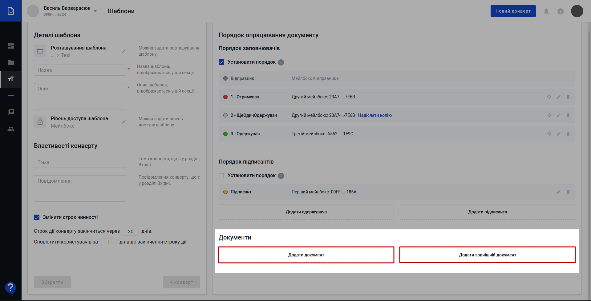

Робота з сервісом WhiteDoc. Загальні положення
###################################################################

.. сюда закину немного картинок для текста

.. |олівець| image:: pics_Work_with_WD/Work_with_WD_014.png

.. |mailbox| image:: pics_Work_with_WD/Work_with_WD_008.png

.. |template| image:: pics_Work_with_WD/Work_with_WD_007.png

.. |scenario| image:: pics_Work_with_WD/Work_with_WD_006.png

.. |contacts| image:: pics_Work_with_WD/Work_with_WD_004.png

.. |мусорка| image:: pics_Work_with_WD/Work_with_WD_022.png

.. |structed| image:: pics_Work_with_WD/Work_with_WD_039.png

.. |трикрапкаВ| image:: pics_Work_with_WD/Work_with_WD_041.png

.. |hide| image:: pics_Work_with_WD/Work_with_WD_045.png

.. |галочка| image:: pics_Work_with_WD/Work_with_WD_053.png

.. |хрестик| image:: pics_Work_with_WD/Work_with_WD_054.png

.. |toggleON| image:: pics_Work_with_WD/Work_with_WD_057.png

.. |toggleOFF| image:: pics_Work_with_WD/Work_with_WD_056.png

.. |pencil| image:: pics_Work_with_WD/Work_with_WD_064.png

.. |галочка2| image:: pics_Work_with_WD/Work_with_WD_085.png

.. |хрестик2| image:: pics_Work_with_WD/Work_with_WD_086.png

.. |крапки| image:: pics_Work_with_WD/Work_with_WD_090.png

.. |filter| image:: pics_Work_with_WD/Work_with_WD_092.png

.. |plus| image:: pics_Work_with_WD/Work_with_WD_103.png

.. |minus| image:: pics_Work_with_WD/Work_with_WD_102.png

.. |Waiting| image:: pics_Work_with_WD/Work_with_WD_123.png

.. |Archive| image:: pics_Work_with_WD/Work_with_WD_125.png

.. |Overdue| image:: pics_Work_with_WD/Work_with_WD_126.png

.. |планшет| image:: pics_Work_with_WD/Work_with_WD_135.png

.. |condition| image:: pics_Work_with_WD/Work_with_WD_187.png 

.. role:: red

.. role:: underline

.. contents:: Зміст:
   :depth: 7

---------

Вступ
================================================

Cервіс WhiteDoc налічує кілька основних сутностей, доступ учасників до котрих на рівні акаунта регулюється адміністратором:

.. image:: pics_Work_with_WD/Work_with_WD_001.png
   :align: center

* **Акаунт** [1]_
* **Мейлбокс** [2]_
* **Конверт** [3]_
* **Шаблон** [4]_

Вхід
================================================

WEB сервісом підтримуються **Google Chrome** та **Safari** браузери тому для роботи з документами рекомендовано використовувати саме їх. Для входу до сервісу платформи необхідно перейти за посиланням https://wd.edin.ua/login .

При переході за вказаним посиланням відкриється вікно авторизації. Необхідно ввести Вашу електронну пошту, пароль користувача і натиснути **"Увійти"**:

.. image:: pics_Work_with_WD/Work_with_WD_002.png
   :align: center

За проставленої відмітки **"Запам'ятати мене"** вводити дані наступного разу самостійно вже не буде потреби (браузер це зробить автоматично).  

.. hint::
   Нові користувачі можуть самостійно пройти "Реєстрацію" і долучитись до сервісу (детальніше в нашій `інструкції <https://wiki.edin.ua/uk/latest/WhiteDoc/WD_registration.html>`__).

**1 Загальний вигляд сервісу WhiteDoc**
================================================

Після успішної авторизації відкриється інтерфейс сервісу WhiteDoc:

1. Поточний мейлбокс, відносно якого виконується документообіг. Ви маєте можливість створити будь-яку кількість мейлбоксів та налаштувати доступ до них необхідним користувачам;
2. Вказівник поточного місцеперебування в сервісі (допомагає орієнтуватись в меню та між розділами сервісу);
3. Бокова панель сервісу, що складається з:
   
   * |dashboard| **Інформаційна панель** - дошка для перегляду активності, швидкого отримання інформації по поточному мейлбоксу (переходи та швидкі дії з останніми конвертами, шаблонами). Детальніше в розділі Інформаційна панель.
   * |mailbox| **Мейлбокс** - основний розділ документообігу; містить всі вхідні/вихідні конверти, журнал для пошуку, підготовки чернеток, роботи з уже відправленими власними документами чи документами контрагентів. Детальніше в розділі Мейлбокс.
   * |template| **Шаблони** - розділ для створення/редагування/видалення шаблонів, без яких неможливе формування і відправка документів в сервісі WhiteDoc. Детальніше в розділі Шаблони.
   * |scenario| **Сценарії** - керування алгоритмами документообігу. Детальніше в розділі Сценарії.
   * |dictionary| **Управління довідниками** - керування довідниками для спрощення роботи з шаблонами та часткової автоматизації введення даних в документ. Детальніше в розділі Управління довідниками.
   * |contacts| **Контакти** - керування контактами учасників документообігу. Детальніше в розділі Контакти.
4. Кнопка для швидкого створення конверта;
5. Сповіщення на рівні користувача;
6. Корисна інформація;
7. Обліковий запис, його адміністрування та вихід;
8. Чат сервісної підтримки

.. _template:

**2 Шаблони**
================================================

В журналі шаблонів (2) відображаються список шаблонів, в залежності від налаштованого рівня доступу та перебування користувача (1):

* **"Мої шаблони"** відображає всі шаблони, до яких є доступ тільки у користувачів мейлбокса;
* **"Шаблони акаунта"** відображає всі шаблони, до яких є доступ тільки у користувачів акаунта;
* **"Офіційні шаблони"** відображає всі шаблони, до яких є доступ у всіх користувачів сервісу WhiteDoc. 

Клік лівою кнопкою мишки на шаблон в журналі автоматично створює по ньому конверт (детальніше в розділі `Формування конверта <https://wiki.edin.ua/uk/latest/WhiteDoc/WD_Instructions/Work_with_Envelope.html#create-envelope>`__).

В створених шаблонах під кнопкою |трикрапка| знаходиться випадаючий список дій, які можливо виконати з готовим шаблоном:

.. image:: pics_Work_with_WD/Work_with_WD_033.png
   :align: center

* **Редагувати** - відкриває форму для редагування шаблону (детальніше в розділі `Редагування шаблону <https://wiki.edin.ua/uk/latest/WhiteDoc/WD_Instructions/Work_with_WD.html#template-edit>`__); 
* **Копіювати uuid** - копіює унікальний ідентифікатор для зручної співпраці з колегами над одним шаблоном;
* **Клонувати** - створює копію обраного шаблону з приставкою "Копія" в назву оригінального шаблону;
* **Перенести** - встановлює місцерозташування шаблону в каталогах на рівні доступу, що вказаний в шаблоні (серед папок **"Мої шаблони"** чи **"Шаблони акаунту"**). В попап вікні можливо :underline:`створити` та :underline:`обрати` папку для зберігання шаблону:

.. image:: pics_Work_with_WD/Work_with_WD_036.gif
   :align: center
   
* **Перейменувати** - переіменування шаблону:

* **Видалити** - видаляє шаблон (дію **"Видалити"** потрібно додатково підтверджувати):

За допомогою кнопки **"Новий шаблон"** створюється новий шаблон в каталозі **"Мої шаблони"** (може також відображатись в **"Шаблони акаунта"** за встановленого рівня доступу). За допомогою функціоналу по створенню внутрішніх папок (кнопка **"Нова папка"**) можливо розробити структуру для зручної класифікації і пошуку потрібних шаблонів:  

Пошук здійснюється серед усіх доступних шаблонів і виконується за "Назвою" чи "Описом" в шаблоні (обов'язкові поля). В правому нижньому куті розташований функціонал переходу між сторінками, на вказану сторінку журналу, вибір кількості шаблонів на сторінці журналу, кількість елементів в журналі, пейджинг.

**2.1 Створення нової папки**
-----------------------------------------------

Для створення нової папки потрібно натиснути на кнопку **"Нова папка"**, після чого відкриється попап-вікно для введення назви папки:

Папку з вказаною назвою можливо **"Зберегти"** чи **"Відмінити"** її створення.

.. _template-create:

**2.2 Створення нового шаблону**
-----------------------------------------------

Для створення нового шаблону потрібно натиснути на кнопку **"Новий шаблон"**, яка відкриває форму для створення нового шаблону:

Форма створення/редагування шаблону складається з блоків "Деталі шаблону і Властивості конверта" (1) та "Порядок опрацювання документа" (2):

.. _template-details:

**2.2.1 Деталі шаблону**
''''''''''''''''''''''''''''''''''''''''''''''''''''''''''''''''''''''''''''''

Обов'язкові до заповнення поля позначені червоною зірочкою :red:`*` ("Назва" і "Опис" шаблону). За замовчуванням шаблон буде створено в кореневому каталозі **"Мої шаблони"** з доступом до шаблону на рівні мейлбокса. За допомогою іконки |олівець| можливо змінити розташування шаблону, рівень доступу до шаблону.

**1) Задати розташування шаблону:**

В попап вікні можливо :underline:`створити` та :underline:`обрати` папку для зберігання шаблону:

.. image:: pics_Work_with_WD/Work_with_WD_017.gif
   :align: center

**2) Задати рівень доступу до шаблону:**

.. note::
   Всі створювані шаблони завжди доступні на рівні мейлбокса, під яким створюється шаблон.

Доступ до шаблону може бути розширено до рівня акаунта чи публічного доступу:

Вибір **Публічного** доступу обумовлює доступ до шаблону усіх користувачів сервісу WhiteDoc. Доступ до шаблону на рівні **Акаунту** є спільним для всіх мейлбоксів (можливо :underline:`створити` та :underline:`обрати` папку для зберігання шаблону на рівні акаунту):

.. note::
   **"Зберегти"** шаблон та додати конверти (**"+Конверт"**) можливо після того, як будуть визначені отримувачі та їх дії з полями документів, що додані до конверта. Всі **Заповнювачі** повинні бути назначені на заповнення полів. Всі **Підписанти** повинні бути назначені на поля ЕЦП.

   .. image:: pics_Work_with_WD/Work_with_WD_030.png
      :align: center

.. _envelope-properties:

**2.2.2 Властивості конверта**
''''''''''''''''''''''''''''''''''''''''''''''''''''''''''''''''''''''''''''''

В шаблоні можливо одразу вказати "Тему" і "Повідомлення" конверта з документами (в цьому випадку всі конверти будуть створюватись з вказаною темою і повідомленням). Конверт обов'язково має строк чинності, який можливо змінити за бажанням (за замовчуванням 30 днів):

.. note::
   **"Зберегти"** шаблон та додати конверти (**"+Конверт"**) можливо після того, як будуть визначені отримувачі та їх дії з полями документів, що додані до конверта.

.. _doc-order-rules:

**2.2.3 Порядок опрацювання документа**
''''''''''''''''''''''''''''''''''''''''''''''''''''''''''''''''''''''''''''''

В опрацюванні документів приймають участь **Заповнювачі**, а також можуть приймати участь **Підписанти**.

.. note::
   Підписання документа відбувається лише після того, як документ повністю заповнений!

"Відправником" завжди виступає мейлбокс, в якому створюється конверт. За допомогою іконки |олівець| потрібно вказати "Отримувача" (назва ролі **Заповнювача** за замовчуванням). Для пошуку мейлбокса одержувача потрібно ввести повний UUID мейлбокса контрагента або назву записаного контакта (детальніше про `"Контакти" <https://wiki.edin.ua/uk/latest/WhiteDoc/WD_Instructions/Work_with_WD.html#contacts>`__):

.. hint::
   При додаванні учасника (одержувача чи підписанта) можливо не вказувати мейлбокс. Щоразу при створенні конверта за цим шаблоном потрібно буде вводити UUID мейлбокса контрагента. Такий підхід зручний для динамічної заміни учасників від одного конверта до іншого, створених на підставі одного шаблону.

За потреби можливо додавати підписантів та інших одержувачів конверта (кнопки **"Додати одержувача"** та **"Додати підписанта"**):

.. image:: pics_Work_with_WD/Work_with_WD_023.png
   :align: center

При додаванні одержувача додатково можливо проставити відмітку для того, щоб **"Надіслати копію"** конверта цьому контрагенту (навпроти цього учасника проставляється відмітка). Для відправки "копії" не потрібно назначати роль на будь-яке з полей документа. Отримувач копії зможе відслідковувати зміну статуса отриманої копії конверта. При додаванні підписанта формується окремий блок з підписантами:

За допомогою кнопки |мусорка| можливо видаляти контрагентів (**Заповнювачів** та **Підписантів**). Дію **"Видалити"** потрібно додатково підтверджувати:

.. image:: pics_Work_with_WD/Work_with_WD_027.png
   :align: center

При видаленні останнього **Підписанта** система видає повідомлення:

.. image:: pics_Work_with_WD/Work_with_WD_028.png
   :align: center

Окремо для кожної групи **Заповнювачів** та **Підписантів** можливо встановити порядок, в якому ці контрагенти зможуть взаємодіяти з конвертом. Для цього потрібно встановити відмітку **"Установити порядок"**: контрагенти будуть отримувати вхідні конверти по черзі (у вказаному порядку). Контрагенти автоматично пронумеруються в порядку їх додавання і з'явиться кнопка для їх перетягування для зміни порядку:

.. image:: pics_Work_with_WD/Work_with_WD_025.png
   :align: center

.. image:: pics_Work_with_WD/Work_with_WD_026.gif
   :align: center

**2.2.4 Документи**
''''''''''''''''''''''''''''''''''''''''''''''''''''''''''''''''''''''''''''''

Створення шаблону обов'язково включає в себе додавання документа (кнопки **"Додати документ"** та **"Додати зовнішній документ"**):

В сервісі є два типи документів: структуровані |structed| та зовнішні |external|.

.. note::
   |external| **Зовнішній документ** призначений для внесення файлу одним з учасників документообігу. Допускається додавання файлу-вкладення в форматі pdf, doc, docx, xls, xlsx, xml, dbf, txt, rtf, png, jpg, jpeg, zip не більше 5МБ (загальний розмір конверта при цьому не повинен перевищувати 25 МБ). В зовнішній документ можливо додати поля "ЕЦП" (інші поля не підтримуються).

   |structed| **Структурований документ** може включати в себе текст та `стандартні поля WhiteDoc <https://wiki.edin.ua/uk/latest/WhiteDoc/WD_Instructions/Work_with_WD.html#fields>`__ (детальніше за посиланням).

В формі створення/редагування шаблону з документами через кнопку |трикрапкаВ| можливо виконати наступні дії:

* **Редагувати** - перехід в форму редагування всіх документів шаблону (детальніше за `посиланням <https://wiki.edin.ua/uk/latest/WhiteDoc/WD_Instructions/Work_with_WD.html#doc-edit>`__);
* **Клонувати** - створює копію обраного документа з приставкою "Копія" в назву оригінального документа;
* **Видалити** - видаляє документ (дію **"Видалити"** потрібно додатково підтверджувати):

.. _doc-edit:

**2.2.4.1 Формування / редагування документів**
..............................................................................

Для переходу в форму створення / редагування документів потрібно натиснути лівою кнопкою миші на документ або обрати дію **"Редагувати"** документ:

Форму для редагування документів (вона є спільною для всіх документів на рівні шаблону) умовно можливо поділити на кілька структурних блоків:

.. image:: pics_Work_with_WD/Work_with_WD_043.png
   :align: center

1. Кнопка додавання нового структурованого чи зовнішнього документа до шаблону (**"+Новий документ"**):

.. image:: pics_Work_with_WD/Work_with_WD_044.png
   :align: center

1. Список документів в шаблоні (допомагає швидко переходити між документами/параграфами). За потреби панель можливо згорнути (|hide|) / розгорнути (|show|);
2. Панель візуального редактора (`WYSIWYG <https://uk.wikipedia.org/wiki/%D0%92%D1%96%D0%B7%D1%83%D0%B0%D0%BB%D1%8C%D0%BD%D0%B8%D0%B9_%D1%80%D0%B5%D0%B4%D0%B0%D0%BA%D1%82%D0%BE%D1%80>`__), за допомогою якої зручно в онлайн режимі працювати з оформленням документа (додавати параграфи, змінювати шрифти, форматувати текст, працювати з зображеннями, таблицями та посиланнями);
3. Безпосередня форма самого документа;
4. Вкладки для роботи з наповненням документа (`Полями <https://wiki.edin.ua/uk/latest/WhiteDoc/WD_Instructions/Work_with_WD.html#fields>`__), `Шаблоном/конвертом <https://wiki.edin.ua/uk/latest/WhiteDoc/WD_Instructions/Work_with_WD.html#template-details>`__ та `Правилами обрробки <https://wiki.edin.ua/uk/latest/WhiteDoc/WD_Instructions/Work_with_WD.html#doc-order-rules>`__;
5. Кнопки для **"Відміни"** чи **"Збереження"** проведених всіх змін в документах.

.. hint::
   За потреби можливо переглянути чи відредагувати раніше введені дані на етапі формування шаблону у відповідних вкладках (Шаблон та Обробка), не повертаючись в головну форму редагування шаблону:

   .. image:: pics_Work_with_WD/Work_with_WD_047.png
      :align: center

   .. image:: pics_Work_with_WD/Work_with_WD_048.png
      :align: center

Кожен документ має назву, що редагується за допомогою кнопки |олівець| (після редагування потрібно підтвердити |галочка| чи відхилити |хрестик| зміни):

Робота з наповненням документа базується на:

1) роботі з текстом / таблицями / зображеннями за допомогою панелі візуального редактора - незмінна частина;
2) додаванні `Полів <https://wiki.edin.ua/uk/latest/WhiteDoc/WD_Instructions/Work_with_WD.html#fields>`__, що повинні чи можуть бути заповнені учасниками документообігу.

.. note::
   |external| **Зовнішній документ** призначений для внесення файлу одним з учасників документообігу. Допускається додавання файлу-вкладення в форматі pdf, doc, docx, xls, xlsx, xml, dbf, txt, rtf, png, jpg, jpeg, zip не більше 5МБ (загальний розмір конверта при цьому не повинен перевищувати 25 МБ). В зовнішній документ можливо додати поля "ЕЦП" (інші поля не підтримуються).

   |structed| **Структурований документ** може включати в себе текст та `стандартні поля WhiteDoc <https://wiki.edin.ua/uk/latest/WhiteDoc/WD_Instructions/Work_with_WD.html#fields>`__ (детальніше за посиланням).

Зовнішній вигляд **Структурованого документа** не регламентовано. Не додавайте табличні елементи із зовнішніх джерел чи буфера пам'яті. Рекомендується створення таблиць і інших елементів, використовуючи функціонал конструктора документа.

`Поля <https://wiki.edin.ua/uk/latest/WhiteDoc/WD_Instructions/Work_with_WD.html#fields>`__ можливо додавати в документ проставивши курсор в місце, де потрібно додати Поле:

Або виконати перетягування поля в потрібну область форми документа (так званий "Drag-and-drop" спосіб):

.. image:: pics_Work_with_WD/Work_with_WD_051.gif
   :align: center

Після додавання поля з'являється попап вікно з властивостями нового поля, в яких обов'язково потрібно вказати назву, особу (детальніше в розділі `Поля <https://wiki.edin.ua/uk/latest/WhiteDoc/WD_Instructions/Work_with_WD.html#fields>`__) та **"Зберегти"** вказані параметри:

.. image:: pics_Work_with_WD/Work_with_WD_058.png
   :align: center

.. hint::
   Для зручності поля виділяються кольором учасника, який їх заповнює.

Властивості поля доступні до редагування - для цього потрібно обрати поле лівою кнопкою миші:

.. image:: pics_Work_with_WD/Work_with_WD_052.png
   :align: center

Властивості різних типів Полів відрізняються і детальніше описані в наступному підрозділі.

.. _fields:

**2.2.4.1.1 Поля**
~~~~~~~~~~~~~~~~~~~~~~~~~~~~~~~~~~~~~~~~~~~~~~~~~~~~~~~~~~~~~~~~~~~~~~~~~~~~~~

В документ можливо додавати необмежену кількість наступних полів:

* Текст
* Число
* Валюта
* Дата та час
* Довідник
* Файл
* Таблиця
* Підпис
* Так/Ні
* Лукап
* ЕЦП
* Дублікат

**Текст**
******************************************************************************

**Текст** - текстове поле, що містить "Назву", "Роль" (учасник документообігу, що вводить значення), "Підказку" (текст, що виводиться користувачам), перемикачі властивостей:

   * "Опціональне" - |toggleON| - поле опціональне до заповнення; |toggleOFF| - поле обов'язкове до заповнення (за замовчуванням);
   * "Багатострочне" - |toggleON| - поле може бути багастоковим; |toggleOFF| - поле однострокове (за замовчуванням).

.. image:: pics_Work_with_WD/Work_with_WD_059.png
   :align: center

Під час його **заповнення** вказуються можливості цього поля:

**Число**
******************************************************************************

**Число** - числове поле, що містить "Назву", "Роль" (учасник документообігу, що вводить значення), "Підказку" (текст, що виводиться користувачам), перемикач властивостей "Опціональне" (|toggleON| - поле опціональне до заповнення; |toggleOFF| - поле обов'язкове до заповнення (за замовчуванням)), "Точність" (кількість допустимих значень, що не будуть округлені автоматично при введенні), "Мінімальне" і "Максимальне" значення для введення

.. image:: pics_Work_with_WD/Work_with_WD_060.png
:align: center

Під час його **заповнення** вказуються властивості цього поля:

**Валюта**
******************************************************************************

**Валюта** - числове поле, що містить "Назву", "Роль" (учасник документообігу, що вводить значення), "Підказку" (текст, що виводиться користувачам), перемикач властивостей "Опціональне" (|toggleON| - поле опціональне до заповнення; |toggleOFF| - поле обов'язкове до заповнення (за замовчуванням)), "Мінімальне" і "Максимальне" значення для введення.

.. note:: 
   В поле **"Валюта"** вводиться числове значення з двома числами після крапки.  

Під час його **заповнення** вказуються властивості цього поля:

**Дата та час**
******************************************************************************

**Дата та час** - "picker" (підхоплювач) для дати та часу, що містить "Назву", "Роль" (учасник документообігу, що вводить значення), "Підказку" (текст, що виводиться користувачам), перемикачі властивостей:

   * "Опціональне" - |toggleON| - поле опціональне до заповнення; |toggleOFF| - поле обов'язкове до заповнення (за замовчуванням);
   * "Час" - |toggleON| - поле підхоплює лише час; |toggleOFF| - поле підхоплює дату та час (за замовчуванням).

Під час **заповнення** поля потрібно натиснути на іконку календаря, обрати і підтвердити дату та час в зручному віконці:

**Довідник**
******************************************************************************

**Довідник** - поле, що потребує підключення налаштованого довідника (детальніше в розділі `Управління довідниками <https://wiki.edin.ua/uk/latest/WhiteDoc/WD_Instructions/Work_with_WD.html#dictionary>`__). Поле містить "Назву", "Роль" (учасник документообігу, що вводить значення), "Підказку" (текст, що виводиться користувачам), перемикачі властивостей:

* "Опціональне" - |toggleON| - поле опціональне до заповнення; |toggleOFF| - поле обов'язкове до заповнення (за замовчуванням);
* "Довільне значення" - |toggleON| - значення може бути довільним; |toggleOFF| - обране значення з довідника (за замовчуванням).

.. image:: pics_Work_with_WD/Work_with_WD_098.png
   :align: center

Також у властивостях цього поля вказується "Довідник" (здійснюється пошук за назвою та описом довідника) та одна з його колонок (селектор):

.. image:: pics_Work_with_WD/Work_with_WD_099.gif
   :align: center

**Заповнення** цього поля виглядає, як поле-селектор. В запропонованому списку відображається лише 20 результатів і для пошуку потрібно почати вводити частину значення в поле. Вибір значення може впливати на інші поля, тому приклад заповнення повною мірою показано в описі `Лукап <https://wiki.edin.ua/uk/latest/WhiteDoc/WD_Instructions/Work_with_WD.html#lookup>`__ чи `Дублікат <https://wiki.edin.ua/uk/latest/WhiteDoc/WD_Instructions/Work_with_WD.html#duplicate>`__.

**Файл**
******************************************************************************

**Файл** - поле, що дозволяє долучити до документа вкладення розміром до 5 МБ (максимальний розмір всіх файлів у вкладенні має бути меншим за 25 МБ). Поле містить "Назву", "Роль" (учасник документообігу, що додає вкладення), "Підказку" (текст, що виводиться користувачам), перемикач властивостей "Опціональне" (|toggleON| - поле опціональне до заповнення; |toggleOFF| - поле обов'язкове до заповнення (за замовчуванням)), "Розширення файлу":

   * "Все" (допустимі формати: pdf, doc, docx, xls, xlsx, xml, dbf, txt, rtf, png, jpg, jpeg, zip);
   * "Документ" (допустимі формати: pdf, doc, docx, xls, xlsx, xml, dbf, txt, rtf);
   * "Зображення" (допустимі формати: png, jpg, jpeg);
   * "Архів" (допустимі формати: zip).

.. image:: pics_Work_with_WD/Work_with_WD_100.png
   :align: center

Під час його **заповнення** вказуються можливості цього поля:

   
Отримувач документа для того, щоб переглянути файл повинен попередньо зберегти його локально.

.. _table-field:

**Таблиця**
******************************************************************************

**Таблиця** - додає в документ :underline:`динамічну` таблицю. Динамічна таблиця дозволяє користувачу, на якого назначена роль "Відправника" чи "Заповнювача" створювати / заповнювати рядки (min=1, max=необмежено) відповідно до налаштувань шаблону. Таблиця містить "Назву", "Роль" (учасник документообігу, що вводить значення), "Колонки" (кількість колонок після додавання поля редагується в самій таблиці кнопками |plus| / |minus|).

.. note:: 
   Перший рядок потребує внесення інших полів (введений текст виступає в якості константи). У внесених в таблицю полях повинна бути вказана роль, що відповідає ролі, що була вказана при додаванні таблиці:
   
   .. image:: pics_Work_with_WD/Work_with_WD_113.png
      :align: center

Під час **заповнення** таблиці, кнопками "+"/"-" можливо додавати рядки, визначеного шаблоном формату:

**Підпис**
******************************************************************************

**Підпис** - поле, що дозволяє користувачу поставити власний підпис. Поле містить "Назву", "Роль" (учасник документообігу, що вводить значення) і "Підказку" (текст, що виводиться користувачам).  

.. image:: pics_Work_with_WD/Work_with_WD_104.png
   :align: center

**Заповнення** поля викликає вікно для введення електронно-чорнильного підпису:

**Так/Ні**
******************************************************************************

**Так/Ні** - поле вибору між двох опцій (за замовчуванням "так" чи "ні"). Поле містить "Назву", "Роль" (учасник документообігу, що обирає значення) і дві опції з текстом (мінімум 1 символ, максимум 50 символів), між якими обирає вказана роль ("Опція 1" та "Опція 2").  

.. image:: pics_Work_with_WD/Work_with_WD_105.png
   :align: center

Під час **заповнення** поля потрібно обрати одну з опцій:

.. _lookup:

**Лукап**
******************************************************************************

**Лукап** - поле потребує попереднього створення в документі конверта хоча б одного поля **Довідник**. Поле містить "Назву", "Роль" (учасник документообігу, що вводить значення), "Підказку" (текст, що виводиться користувачам). **Лукап** автоматично бере значення з довідника, для цього задаються наступні параметри: 
 
   * "Документ" шаблону, в якому вже присутнє хоча б одне поле **Довідник**;
   * "Пов'язано з" - потрібно обрати один з використаних довідників в обраному документі;
   * "Назва колонки" обраного довідника.

.. important::
   Без поля **Довідника** поле **Лукап** неактивне. Користувач не може заповнити пошукові поля, якщо у нього немає доступу до довідника, який використовується в полі довідника. Користувач може заповнити всі поля пошуку в конверті, зберегти цей конверт, як чернетку та надіслати пізніше. Якщо хтось змінить довідник (оновить записи, видалить стовпець або видалить довідник) перед тим, як користувач надішле чорновий конверт із полями пошуку, користувач побачить повідомлення про помилку з інформацією про зміни довідника. Якщо довідник було видалено, усі пошукові поля, які стосуються цього поля довідника, будуть виділені червоним кольором. 

.. image:: pics_Work_with_WD/Work_with_WD_106.png
   :align: center

Поле не потребує **заповнення**, оскільки воно залежне від поля **Довідника** і значення обирається автоматично згідно налаштувань в шаблоні:

**ЕЦП**
******************************************************************************

**ЕЦП** - поле електронного цифрового підпису, що має специфічне рольове відношення (в якості ролі обираються заповнювачі-підписанти: детальніше в розділі `Порядок опрацювання документа <https://wiki.edin.ua/uk/latest/WhiteDoc/WD_Instructions/Work_with_WD.html#doc-order-rules>`__). Ви можете додати одне поле електронного підпису до одного документа для однієї ролі підписанта, інакше система сповістить про те, що:

.. image:: pics_Work_with_WD/Work_with_WD_108.png
   :align: center

.. hint::
   Сервіс WhiteDoc підтримує 3 типи електронного підпису:

      * Електронно-чорнильний підпис (поле Підпис);
      * Вдосконалений електронний підпис (AES);
      * Кваліфікований електронний підпис (КЕП) - це вдосконалений електронний підпис, який відповідає додатковим вимогам.

   З КЕП необхідний кваліфікований сертифікат, який засвідчує справжність електронного підпису та служить підтвердженням особи підписанта. Сам підпис також повинен бути створений за допомогою спеціального обладнання та програмного забезпечення, відомого як Пристрій для створення кваліфікованого підпису. Це гарантує, що:

      * Підписант - єдиний, хто контролює ключ, який використовується для створення електронного підпису;
      * Даними підпису керує довірений постачальник послуг;
      * Дані підпису унікальні та захищені від підробки.

   Хоча як прості електронні підписи, так і вдосконалені електронні підписи мають своє місце, КЕП надає найсуворіші юридичні докази, наприклад, коли йдеться про суперечки щодо цифрових транзакцій і може допомогти захистити від шахрайства, як споживача так і бізнес.

Властивості поля містять "Назву", "Роль" (учасник-підписант), перемикач властивостей "Кваліфікований" (|toggleON| - допускається лише кваліфікований електронний підпис; |toggleOFF| - допускається будь-який підпис, що допускається сервісом (за замовчуванням)), додатково можливо вказати ЄДРПОУ, поставивши відповідну помітку:

.. image:: pics_Work_with_WD/Work_with_WD_109.png
   :align: center

.. note::
   При видаленні ролі із призначеними на неї полями електронного підпису, потрібно повторно призначити поле іншій ролі, якщо така є. Якщо ні, роль буде видалена разом з полями.

   .. image:: pics_Work_with_WD/Work_with_WD_110.png
      :align: center

.. important::
   Підписанти в процесі обробки зможуть встановити підпис на конверті лише тоді, коли всі правонаступники заповнять дані документа. 

.. _duplicate:

**Дублікат**
******************************************************************************

**Дублікат** - поле, що копіює значення іншого поля. Дублікат поля доступний лише тоді, коли шаблон містить принаймні одне поле, якому можна призначити дублікат. Дозволені поля для копіювання: текст, номер, валюта, дата та час, довідник, так / ні. Властивості поля містять "Назву"; "Документ" шаблону, в якому вже присутнє хоча б одне поле **Довідник**; "Дублікат поля" - вибір доступних полів в документі для дублювання (вибір за назвою):

Щоб заповнити дублікат поля, потрібно заповнити значення в батьківському полі. Усі дублікати полів, які стосуються цього батьківського поля, заповнюються автоматично.

Якщо батьківське поле дубліката необов’язкове, ви не можете заповнити батьківське поле, і в цьому випадку поле дубліката також буде порожнім. 

Поле не потребує **заповнення**, оскільки воно залежне від іншого поля і повністю копіює його значення:

.. image:: pics_Work_with_WD/Work_with_WD_170.gif
   :align: center

.. _template-edit:

**2.3 Редагування шаблону**
-----------------------------------------------

Після того, як шаблон було збережено, його дані все ще можливо редагувати, сам шаблон можливо **"Видалити"**, **"Клонувати"**, **"Зберегти"** чи одразу створити за цим шаблоном конверт (**"+Конверт"**):

.. image:: pics_Work_with_WD/Work_with_WD_031.png
   :align: center

.. _dictionary:

**3 Управління довідниками**
================================================

**Довідник** - перелік записів у систематизованій формі (таблиця з даними), наприклад, список працівників (ім'я, прізвище, вік, адреса). Довідник використовуються для подальших напівавтоматизованих операцій заповнення полів **Лукап** та **Дублікат**.

В журналі довідників (2) відображаються список довідників, в залежності від налаштованого рівня доступу та перебування користувача (1):

.. image:: pics_Work_with_WD/Work_with_WD_063.png
   :align: center

В Провіднику (1) є три основні каталоги:

* **"Мої довідники"** відображає всі довідники, до яких є доступ тільки у користувачів мейлбокса;
* **"Довідники акаунта"** відображає всі довідники, до яких є доступ тільки у користувачів акаунта;
* **"Офіційні довідники"** відображає всі довідники, до яких є доступ у всіх користувачів сервісу WhiteDoc.

В журналі довідників у вигляді таблиці відображаються всі довідники обраного каталогу. По кожному довіднику відображається його "Назва", "Опис", "Кількість записів". Для роботи з довідниками передбачений наступний функціонал:

* Створення нового довідника за допомогою одноіменної кнопки (**"Новий довідник"**); детальніше про `формування / редагування довідників <https://wiki.edin.ua/uk/latest/WhiteDoc/WD_Instructions/Work_with_WD.html#dictionary-edit>`__;
* |pencil| - **редагувати довідник**; детальніше про `формування / редагування довідників <https://wiki.edin.ua/uk/latest/WhiteDoc/WD_Instructions/Work_with_WD.html#dictionary-edit>`__;
* |download| - **експотувати довідник**;

Експортувати можливо в CSV та XML форматах (вибір формату обирається після натискання на кнопку експорту). Після експортування авторизований користувач отримує на електронну пошту листа з посиланням на завантаження довідника:

.. image:: pics_Work_with_WD/Work_with_WD_070.png
   :align: center

* |trash| - видалити довідник (дію **"Видалити"** потрібно додатково підтверджувати):

Пошук здійснюється серед усіх доступних довідників і виконується за "Назвою" чи "Описом" довідника:

.. image:: pics_Work_with_WD/Work_with_WD_068.gif
   :align: center

В правому нижньому куті розташований функціонал переходу між сторінками, на вказану сторінку журналу, вибір кількості шаблонів на сторінці журналу, кількість елементів в журналі, пейджинг: 

.. _dictionary-edit:

**3.1 Формування / редагування довідників**
-----------------------------------------------

Для переходу в форму :underline:`створення / редагування` довідника потрібно натиснути лівою кнопкою миші на кнопку **"Новий довідник"** або обрати дію **"Редагувати"** документ:

.. image:: pics_Work_with_WD/Work_with_WD_073.png
   :align: center

Відкривається форма редагування довідника:

.. image:: pics_Work_with_WD/Work_with_WD_080.png
   :align: center

В верхньому правому куті розташований функціонал для імпорту/експорту даних в/з довідника та кнопка виходу з режиму редагування (кнопка **"Закрити"**).

**"Імпорт"** - імпортування зовнішнього CSV-файлу для внесення чи заміни даних в комірки відкритого довідника:
   
.. image:: pics_Work_with_WD/Work_with_WD_081.gif
   :align: center

З'явиться системне повідомлення про виконання операції, а процес оновлення довідника відображається в журналі замість кнопок по роботі з цим довідником:

.. image:: pics_Work_with_WD/Work_with_WD_076.png
   :align: center

.. image:: pics_Work_with_WD/Work_with_WD_075.png
   :align: center

Після виконання операції оновлення користувачу відправляється сповіщення:

.. image:: pics_Work_with_WD/Work_with_WD_077.png
   :align: center

**"Експорт"** - експортування довідника в CSV або XML файл (вибір формату обирається після натискання на кнопку експорту). Після експортування авторизований користувач отримує на електронну пошту листа з посиланням на завантаження довідника:

.. image:: pics_Work_with_WD/Work_with_WD_078.png
   :align: center
   

.. note::
   Всі створювані довідники завжди доступні на рівні мейлбокса, під яким створюється довідник.

Доступ до довідника може бути розширено до рівня акаунта чи публічного доступу:

.. image:: pics_Work_with_WD/Work_with_WD_079.png
   :align: center

Вибір **Публічного** доступу обумовлює доступ до довідника усіх користувачів сервісу WhiteDoc. Доступ до довідника на рівні **Акаунту** є спільним для всіх мейлбоксів.

Для редагування "Назви" та "Опису" довідника використовується кнопка з іконкою |олівець|:

.. image:: pics_Work_with_WD/Work_with_WD_082.gif
   :align: center

Для внесення змін в довідник в "ручному" режимі передбачені кнопки додавання колонок і рядків (**"Додати колонку"** і **"Додати рядок"**):

.. image:: pics_Work_with_WD/Work_with_WD_083.png
   :align: center

Для внесення даних в комірку потрібно помістити на неї курсор. Всі дані зберігаються автоматично, однак припинити введення можливо і за допомогою кнопок підтвердження |галочка2| чи відміни |хрестик2| внесення змін в комірку:

.. image:: pics_Work_with_WD/Work_with_WD_084.png
   :align: center

При наведенні курсора на заголовок колонки табличної частини довідника (наприклад, колонка з назвою "Тип") з'являється функціонал:

.. image:: pics_Work_with_WD/Work_with_WD_089.png
   :align: center

1. Зміни розташування колонок за допомогою "перетягування" мишкою за іконку |крапки|: 

.. image:: pics_Work_with_WD/Work_with_WD_091.gif
   :align: center

2. Фільтрування даних в колонці (|filter|) за відсутністю чи наявністю значення в комірці (**Порожній** / **Не порожній**) чи за додатково введеним значенням, яке: 
   
   * **Містить** комірка
   * **Не містить** комірка
   * **Дорівнює** значенню з комірки
   * **Не дорівнює** значенню з комірки

.. image:: pics_Work_with_WD/Work_with_WD_093.png
   :align: center

Якщо **"Додати"** такий параметр фільтрування, то відображаються лише ті рядки, що відповідають заданому правилу фільтрування, а така колонка позначається іншим кольором, відображається правило фільтрування:

3. Редагування назви колонки (|олівець|):

.. image:: pics_Work_with_WD/Work_with_WD_095.png
   :align: center

4. Видалити колонку (|мусорка|). Дію **"Видалити"** потрібно додатково підтверджувати:

.. image:: pics_Work_with_WD/Work_with_WD_096.png
   :align: center

Для видалення рядків потрібно відмітити кілька чи всі рядки чекером і натиснути виникаючу кнопку **"Видалити рядки"**:

.. image:: pics_Work_with_WD/Work_with_WD_097.png
   :align: center

Кожен довідник має свій UUID, скопіювати який зручно за допомогою спеціальної кнопки |copy|:

.. image:: pics_Work_with_WD/Work_with_WD_088.png
   :align: center

.. _contacts:

**4 Контакти**
================================================

В списку контактів (1) представлені всі контакти поточного мейлбокса (вікно для перегляду/редагування/видалення (2) відкривається, якщо клікнути мишкою на одному з контактів):

Реалізований "Пошук" вже введених контактів: в полі пошуку достатньо почати вводити ім'я контакту для того аби відфільтрувати список:

.. image:: pics_Work_with_WD/Work_with_WD_117.png
   :align: center

.. _add-contact:

**4.1 Додавання нового контакта**
-----------------------------------------------

Для того аби додати "Новий контакт" потрібно натиснути на кнопку **"+"**:

В контакті зазначаються наступні поля:

* "Ім'я" - вводиться користувачем довільно (за цим ім'ям в подальшому буде відбуватись Пошук котакта);
* "UUID мейлбокса" - унікальний ідентифікатор мейлбокса. По введеному/вставленому ідентифікатору відбувається автоматичний пошук -> знайдений мейлбокс разом з його нативною назвою (надається власником при створенні мейлбокса і не редагується в "Контактах") з'являється в підказках -> його потрібно обрати. Після цього можливо **"Зберегти контакт"**:

.. _contact-edit:

**4.2 Редагування / видалення контактів**
-----------------------------------------------

Для редагування видалення контакту потрібно обрати (1) зі списку бажаний контакт та натиснути на кнопку **"Редагувати контакт"** чи **"Видалити контакт"**:

.. image:: pics_Work_with_WD/Work_with_WD_118.png
   :align: center

В формі редагування контакта можливо його переіменувати чи замінити його UUID мейлбокса (назва мейлбокса не редагується, а підтягується платформою):

**"Видалити контакт"** можливо і під час його редагування. Також будь які зміни з контактами можливо **"Відмінити"**.

.. _mailbox:

**5 Мейлбокс**
================================================

В журналі мейлбокса відображаються всі конверти, якими обмінюються користувачі на рівні цього мейлбокса:

**Каталоги конвертів:**

* |Inbox| **Вхідні** - каталог всіх вхідних конвертів (від контрагентів).
* |Waiting| **Очікують** - каталог вхідних конвертів, документи якого чекають на дію (заповнення поля чи підписання) зі сторони користувачів з доступом до поточного мейлбокса.
* |Outbox| **Вихідні** - каталог всіх відправлених контрагентам конвертів.
* |Archive| **Архів** - каталог архівних оброблених конвертів (всі перенесені в архів конверти).
* |Overdue| **Будуть прострочені** - каталог всіх ковертів, строк дії яких вже завершується (детальніше про `властивості конверта <https://wiki.edin.ua/uk/latest/WhiteDoc/WD_Instructions/Work_with_WD.html#envelope-properties>`__ при формуванні шаблону). 
* |Drafts| **Чернетки** - каталог створених, але не відправлених конвертів (конверти на етапі редагування). 

Журнал документів відображає конверти з обраного каталога і має фільтри, що дозволяють гнучко відібрати конверти за вказаними параметрами:

Конверти в журналі можливо відфільтрувати за:

* Статусом конверта ("Очікує на вас", "В обробці", "Завершено", "Скасовано", "Прострочено");
* Періодом отримання відправки конверта
* Відправником (мейлбоксом відправника)
* Шаблоном, що був використаний для формування конверта

Усі ці обрані параметри, що відбирають з усього каталогу шукані конверти можливо об'єднати в Ваш фільтр (|Flash|), що зберігається на рівні мейлбокса:

.. image:: pics_Work_with_WD/Work_with_WD_130.png
   :align: center

В подальшому збережений фільтр дозволяє відібрати конверти за цими критеріями в один клік:

.. image:: pics_Work_with_WD/Work_with_WD_148.png
   :align: center

Окрім цього можливо додатково кнопкою **"Додати фільтри"**, що будуть відбирати архівні конверти, конверти з вказаною датою прострочення, ярликами і вказаним напрямком (вхідні/вихідні конверти):

Такі фільтри видаляються кнопкою |хрестик| чи забравши відмітку активації цього фільтра:

Окрім гнучких фільтрів можливо здійснити пошук за темою вказаною в конверті (задається при створенні шаблону):

Можливо **"Зформувати звіт по конвертам"**, що знаходяться в журналі (всі відфітровані конверти): 

Після натискання на кнопку |планшет| по цих конвертах формується і відправляється на пошту звіт.

В якості додаткових міток можливо використовувати ярлики. Ярлики можливо створювати окремо (1) чи вже безпосередньо при додаванні до конверта (2):

.. image:: pics_Work_with_WD/Work_with_WD_136.png
   :align: center

.. image:: pics_Work_with_WD/Work_with_WD_137.png
   :align: center

.. image:: pics_Work_with_WD/Work_with_WD_171.png
   :align: center

Усі збережені ярлики відбирають всі конверти, що мають цей ярлик в один клік:

Ярлики можливо **"Редагувати"** чи **"Видалити"** - при цьому вони автоматично видаляються / змінюються в конвертах:

.. image:: pics_Work_with_WD/Work_with_WD_147.png
   :align: center

При встановленні відмітки біля конвертів окрім чіпляння ярликів відкриваються можливості:

* **Масове підписання конвертів за допомогою ЕЦП**:

.. image:: pics_Work_with_WD/Work_with_WD_138.png
   :align: center

.. note::
   Процес підписання конвертів детально описаний в розділі `Підписання <https://wiki.edin.ua/uk/latest/WhiteDoc/WD_Instructions/Work_with_WD.html#sign>`__.

* **Масове архівування**:

.. attention::
   **"Заархівувати конверти"** можливо лише після завершення документообігу!

Архівні конверти (з каталога **Архів**) можливо розархівувати (обернена операція):

.. image:: pics_Work_with_WD/Work_with_WD_149.png
   :align: center

* **Масове завантаження**:

.. image:: pics_Work_with_WD/Work_with_WD_141.png
   :align: center

.. attention::
   **"Завантажити конверти"** можливо лише після завершення документообігу! Детальніше про `Завантаження конвертів <https://wiki.edin.ua/uk/latest/WhiteDoc/WD_Instructions/Work_with_Envelope.html#envelope-download>`__ за посиланням.

* **Масове додавання конвертів до ланцюжка** (вказує на зв'язок між конвертами):

Детальніше про те, які конверти знаходяться в ланцюжку можливо дізнатись при перегляді конверта (блок **"Ланцюжок"**):

Додані до ланцюжка конверти можливо видалити за допомогою кнопки, що відображається в якості оберненої операції перекресленою іконкою:

.. attention::
   В ланцюжок можуть бути об'єднані два або більше конвертів (один конверт не може знаходитись в ланцюжку).

В журналі конвертів відображається їх "Тема", "Шаблон", "Етап", "Статус", "Відправник" і "Дата отримання", що одночасно є фільтром сортування "від нових до старих" чи навпаки. 

В правому нижньому куті розташований функціонал переходу між сторінками, на вказану сторінку журналу, вибір кількості шаблонів на сторінці журналу, кількість елементів в журналі, пейджинг:

.. _dashboard:

**6 Інформаційна панель**
================================================

Інформаційна панель призначена для інформування користувача, своєчасної реакції і складається з 4 основних блоків:

1) Лічильники конвертів в наступних статусах (клік на плитку відкриває вікно з усіма відібраними за статусом конвертами):
   
   * "Завершено"
   * "Очікує на вас"
   * "Прострочено"
   * "Скасовано"

2) Список останніх конвертів, що очікують дій. Блок дозволяє одразу перейти в конверт чи переглянути весь список конвертів в цьому статусі;
3) Список щойно використаних шаблонів. Блок дозволяє одразу перейти в шаблон, створити новий чи переглянути весь список шаблонів;
4) Блок останньої активності користувачів на рівні мейлбокса - дозволяє переглядати дії і результати цих дій, що пов'язані з конвертами і шаблонами.

.. _scenario:

**7 Сценарії**
================================================

Функціонал розділу сценаріїв дозволяє створювати ланцюжки конвертів і передавати дані з одного конверта в інший, якщо це необхідно.

**Сценарій** - спеціалізований алгоритм створення нового конверта документів на підставі конверта, що вже завершив документообіг і підпадає під правило, визначене в сценарії. Новий конверт, як і всі конверти сервісу формується згідно шаблону (шаблон вказується в сценарії). Саме в сценарії налаштовуються "тригери" (параметри), за якими він може бути активований, а сам зв'язок між конвертами при активованому шаблоні можливо зобразити в наступному простому прикладі:

.. image:: pics_Work_with_WD/Work_with_WD_172.png
   :align: center

"Конверт №1" був створений на підставі "Шаблону №1" і вже завершив свій документообіг. **У користувача, у якого є доступ до "Шаблону №2" та сценарію з "Шаблоном №1" в якості джерела є можливість (кнопка при перегляді "Конверта №1") активувати сценарій** формування "Конверта №2" згідно "Шаблону №2" та перетворень в сценарії, що задані у вигляді XSLT правил конвертації.

.. attention::
   "Конверт №2" формується у відповідності до "Шаблону №2", а всі XSLT-перетворення використовуються лише для передачі даних з конверта-підстави та для автоматичного заповнення полів документів "Конверта №2" в тому числі назначення конкретних **Заповнювачів** та **Підписантів** (за умови, що вони не були жостко визначені в "Шаблоні №2").

В розділі **"Сценарії"** створюються та зберігаються всі доступні сценарії (публічні сценарії чи з доступом на рівні Акаунта / Мейлбокса):

.. image:: pics_Work_with_WD/Work_with_WD_173.png
   :align: center

**Запустити сценарій** можливо двома шляхами:

* Клік лівою кнопкою мишки на сценарій автоматично запускає створення конверта згідно ПЕРШОГО КРОКУ сценарію (детальніше про налаштування кроків в розділі `Створення / редагування сценаріїв <https://wiki.edin.ua/uk/latest/WhiteDoc/WD_Instructions/Work_with_WD.html#create-edit-scenario>`__).
* Також запустити БУДЬ-ЯКИЙ ПІДХОДЯЩИЙ З КРОКІВ сценарію ЗАВЖДИ можливо при перегляді конверта, що завершив документообіг та його шаблон вказаний в налаштуваннях кроку сценарію (+ відповідність умовам сценарію, якщо такі вказані):

.. hint::
   Якщо хтось із учасників відхиляє конверт (що стосується сценарію), ви можете повторно виконати крок із заповненого конверта з попереднього кроку.

За допомогою кнопки **"Новий сценарій"** створюється новий сценарій серед "Моїх шаблонів" (детальніше в розділі `Створення / редагування сценаріїв <https://wiki.edin.ua/uk/latest/WhiteDoc/WD_Instructions/Work_with_WD.html#create-edit-scenario>`__). Пошук здійснюється серед усіх доступних сценаріїв мейлбокса і виконується за "Назвою", "Описом" (обов’язкові поля) чи "uuid" сценарію. В правому нижньому куті розташований функціонал переходу між сторінками, на вказану сторінку журналу, вибір кількості сценаріїв на сторінці журналу, кількість елементів в журналі, пейджинг.

В створених сценаріях під кнопкою |трикрапка| знаходиться випадаючий список дій, які можливо виконати зі сценарієм:

* **Редагувати** - відкриває форму для редагування сценарію (детальніше в розділі `Створення / редагування сценаріїв <https://wiki.edin.ua/uk/latest/WhiteDoc/WD_Instructions/Work_with_WD.html#create-edit-scenario>`__); 
* **Копіювати uuid** - копіює унікальний ідентифікатор для зручної співпраці з колегами над одним сценарієм;
* **Клонувати** - створює копію обраного сценарію з приставкою "Копія" в назву оригінального сценарію;
* **Видалити** - видаляє сценарій (дію **"Видалити"** потрібно додатково підтверджувати):

.. image:: pics_Work_with_WD/Work_with_WD_176.png
   :align: center

.. _create-edit-scenario:

**7.1 Створення / редагування сценаріїв**
-----------------------------------------------

Для створення нового сценарію потрібно натиснути на кнопку **"Новий сценарій"**, яка відкриває форму для створення нового сценарію:

.. image:: pics_Work_with_WD/Work_with_WD_177.png
   :align: center

Форма створення/редагування сценаріїв складається з блоків "Деталі сценарію" (1) та "Кроків сценарію" (2):

В "Деталях сценарію" вказується рівень доступу до сценарію: "Мейлбокс" / "Акаунт" / "Публічний" (за замовчуванням "Мейлбокс"), а також "Назва" та "Опис", як обов’язкові поля (uuid генерується автоматично). 

Один сценарій може містити безліч кроків, але мінімум один (перший неможливо видалити). Перший крок дозволяє користувачу створити конверт на підставі шаблону (і його версії), використовуючи при цьому правила конвертації (XSLT). Усі наступні кроки можуть бути використані для створення конвертів на підставі конвертів, шаблони яких вказані в налаштуваннях кроку, також використовуючи при цьому правила конвертації (XSLT).

В "Призначеннях" вказуються повний "uuid шаблону", а його остання "Версія шаблону" вказується автоматично з можливістю обрати зі списку інші версії:

.. important::
   За допомогою проставленої відмітки в нижній частині будь-якого кроку можливо **"Відправити конверт відразу після запуску кроку"** і не створювати чернетки конверта при запуску цього кроку сценарію. Однак для такої автоматичної відправки конверта необхідно передбачити заповнення всіх обов'язкових полів в конверті для ролі Відправника, а також встановлення всіх мейлбоксів Заповнювачів та Підписантів в XSLT карті конвертації цього кроку. Якщо будь-які необхідні дані пропущені на кроці (за правилом конвертації), ви отримаєте помилку під час збереження сценарію. 

.. note::
   **"Зберегти"** сценарій можливо лише за умови, що всі його кроки збережені (кнопка |дискета|), всі поля кроків сценарію заповнені:
   
   .. image:: pics_Work_with_WD/Work_with_WD_182.png
      :align: center

Після успішного створення сценарію генерується його uuid, в формі редагування з'являються можливості **"Видалити"** та **"Клонувати"** сценарій:

.. image:: pics_Work_with_WD/Work_with_WD_183.png
   :align: center

Один сценарій може містити безліч кроків - кожен налаштований крок може запускати новий конверт. На етапі створення чи редагування збільшити кількість кроків в сценарії можливо за допомогою кнопки **"Додати новий крок"**:

.. image:: pics_Work_with_WD/Work_with_WD_179.png
   :align: center

В другому та подальших кроках потрібно заповнити блок "Джерело" - це два поля з шаблоном uuid та версією шаблону uuid попереднього кроку сценарію (допускається використання непов'язаних шаблонів). 

Кожен наступний крок містить "Назву" (за замовчуванням "Новий крок"), в ньому вказуються дані шаблону-Джерела ("uuid шаблону" + "Версія шаблону"), дані конвертів якого будуть використовуватись для формування конверту на підставі шаблону-Призначення ("uuid шаблону" + "Версія шаблону"). "uuid шаблону" вказується повністю, а його остання "Версія шаблону" вказується автоматично з можливістю обрати зі списку інші версії:

.. image:: pics_Work_with_WD/Work_with_WD_184.png
   :align: center

Після внесення змін в крок його потрібно зберегти (кнопка |дискета|); всі кроки можливо редагувати (кнопка |олівець|), також всі кроки окрім першого можливо видалити (кнопка |trash|).

.. note::
   **"Зберегти"** сценарій можливо лише за умови, що всі його кроки збережені (кнопка |дискета|), всі поля кроків сценарію заповнені:
   
   .. image:: pics_Work_with_WD/Work_with_WD_182.png
      :align: center

**7.1.1 Умови**
''''''''''''''''''''''''''''''''''''''''''''''''''''''''''''''''''''''''''''''

Додатково можливо використовувати **"Умову"** - це карта XSLT, яка буде застосована до Джерела кроку. За проставленої відмітки **"Умова"** в спеціальній зоні можливо задати умови, за якими можливе виконання даного кроку сценарію:

Кроки сценарію, що мають умови відмічаються значком |condition|:

.. image:: pics_Work_with_WD/Work_with_WD_188.png
   :align: center

На платформі представлені два типи Умов:

1) Умова, заснована на деяких полях, для створення різних гілок сценарію, наприклад, якщо в акті завершеної роботи обсяг послуги більше 1000, то запускається одна гілка скрипта, якщо більше, то інша;
2) Умова, яка створює кілька конвертів на основі значень у джерелі. Але в той же час, в залежності від значення "Так" створюється Конверт №1, а якщо значення "Ні", то Конверт №2.

**"Умова"** є необов'язковою, а її значення може бути нульовим.

.. important::
   Якщо кілька кроків відповідають умовам, тоді у користувача в конверті відображається кілька кнопок для початку різних кроків! Створити сценарій можливо лише за умови, що правила конвертації (XSLT) не порушують правила формування конверта, що визначені шаблоном в "Призначеннях"

1) Проста умова повертає "true" або "false" у форматі xml, наприклад: 

.. code:: xml

   <result>
      true
   </result>

Приклад умови (XSLT):

.. code:: xml

   <?xml version="1.0" encoding="UTF-8"?>
   <xsl:stylesheet version="1.0" xmlns:xsl="http://www.w3.org/1999/XSL/Transform">
       <xsl:template match="/">
           <result>
               <xsl:choose>
                   <xsl:when test="envelope/documents/document[@id='document_id']/field[@name='field_name'] &gt; 0">
                       true
                   </xsl:when>
                   <xsl:otherwise>
                       false
                   </xsl:otherwise>
               </xsl:choose>
           </result>
       </xsl:template>
   </xsl:stylesheet>

2) Умова "Один до багатьох" може застосовуватись ЛИШЕ до поля `динамічної таблиці <https://wiki.edin.ua/uk/latest/WhiteDoc/WD_Instructions/Work_with_WD.html#table-field>`__ всередині документа. Умова повинна повертати "true" або "false" для кожного рядка в таблиці у такому форматі:

.. code:: xml

   <result>
   <rows>
      <row index='0'>true<row>
      <row index='1'>false<row>
      <row index='2'>false<row>
      <row index='3'>true<row>
   </rows>
   </result>

Атрибут index має відповідати атрибуту index у вузлі “fieldset”. Приклад умови (XSLT):

.. code:: xml

   <?xml version="1.0" encoding="UTF-8"?>
   <xsl:stylesheet version="1.0" xmlns:xsl="http://www.w3.org/1999/XSL/Transform">
      <xsl:template match="/">
         <result>
               <rows>
                  <xsl:for-each select="envelope/documents/document[@id='document_id']/fieldgroup[@name="table_name"]/fieldset">
                     <row index="{@index}">
                           <xsl:choose>
                              <xsl:when test="field[@name='field_name']='Yes'">
                                 true
                              </xsl:when>
                              <xsl:otherwise>
                                 false
                              </xsl:otherwise>
                           </xsl:choose>
                     </row>
                  </xsl:for-each>
               </rows>
         </result>
      </xsl:template>
   </xsl:stylesheet>

Для кожного рядка, де result = “true”, буде створено новий конверт. Щоб надати XSLT карті належний індекс рядка, цю карту необхідно відповідно змінити. Необхідно додати такий параметр: 

.. code:: xml

   <xsl:param name="row_index"/>

І його можливо використовувати таким чином: 

.. code:: xml

   <field name="field_name">
      <xsl:value-of select="envelope/documents/document[@id='document_id']/fieldgroup[@name='table_name']/
         fieldset[@index=$row_index]/field[@name='field_name']/@value"/>
   </field>

ToDo

.. налаштування користувача

.. _sign:

**Підписання в сервісі WhiteDoc**
=========================================================================================================================

.. include:: /WhiteDoc/WD_Instructions/WD_signing/WD_signing.rst
   :start-after: .. початок блоку для WD_Signing
   :end-before: .. кінець блоку для WD_Signing

ToDo

.. камент

   .. _pers-settings:

   **Налаштування користувача**
   ================================================

   Клік на іконку користувача відкриває меню з налаштуваннями (налаштування акаунта/компаній описані в `інструкції "Особистого кабінету" <https://wiki.edin.ua/uk/latest/Personal_Cabinet/PCInstruction.html>`__):

   .. image:: pics_Work_with_WD/Work_with_WD_08n.png
      :align: center

   .. image:: pics_Work_with_WD/Work_with_WD_09n.png
      :align: center

   В налаштуваннях користувача можуть відображатись підказки, відображаються дані сесії користувача. Користувач може доповнити/змінити інформацію про себе, змінити пароль (не менше 8 символів) чи додати/змінити фото профілю, що буде відображатись замість стандартної іконки.

   

------------------------------

.. [#] Акаунт — обліковий запис, у якому зберігається різна інформація, що відноситься до користувача (налаштування та інша інформація). 

.. [#] Мейлбокс (mailbox) — сутність, що є вхідною/вихідною точкою документообігу в сервісі. Може бути особистим або спільним для кількох користувачів на рівні одного акаунта. 

.. [#] Конверт — основна одиниця документобігу в сервісі, що вміщує один чи кілька документів та формується згідно визначеного шаблону.

.. [#] Шаблон — сукупність визначених користувачем правил формування документів, їх структури та порядку обробки, згідно яких формується конверт.

------------------------------

.. include:: /_constant/kontakti.rst
