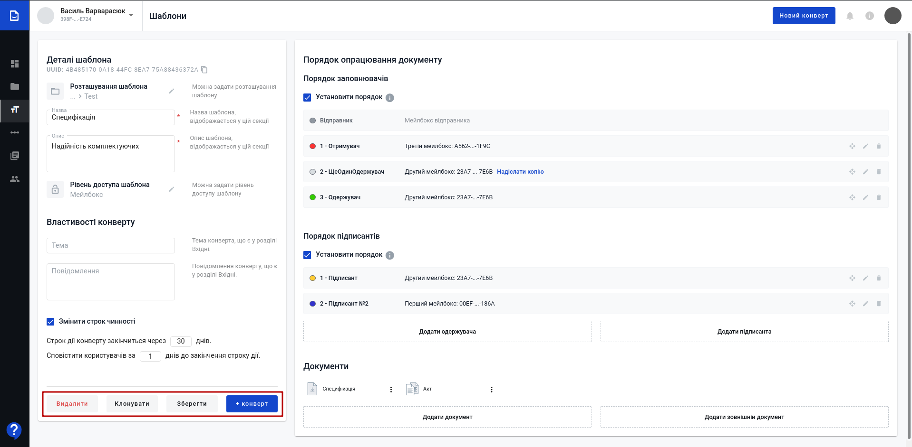

Робота з сервісом WhiteDoc. Загальні положення
###################################################################

.. сюда закину немного картинок для текста

.. |олівець| image:: pics_Work_with_WD/Work_with_WD_014.png

.. |dashboard| image:: pics_Work_with_WD/Work_with_WD_009.png

.. |scenario| image:: pics_Work_with_WD/Work_with_WD_006.png

.. |dictionary| image:: pics_Work_with_WD/Work_with_WD_005.png

.. |contacts| image:: pics_Work_with_WD/Work_with_WD_004.png

.. |мусорка| image:: pics_Work_with_WD/Work_with_WD_022.png

.. |трикрапка| image:: pics_Work_with_WD/Work_with_WD_032.png

.. |structed| image:: pics_Work_with_WD/Work_with_WD_039.png

.. |external| image:: pics_Work_with_WD/Work_with_WD_038.png

.. |show| image:: pics_Work_with_WD/Work_with_WD_046.png

.. |галочка| image:: pics_Work_with_WD/Work_with_WD_053.png

.. |pencil| image:: pics_Work_with_WD/Work_with_WD_064.png

.. |download| image:: pics_Work_with_WD/Work_with_WD_065.png

.. |trash| image:: pics_Work_with_WD/Work_with_WD_066.png

.. |галочка2| image:: pics_Work_with_WD/Work_with_WD_085.png

.. |хрестик2| image:: pics_Work_with_WD/Work_with_WD_086.png

.. |copy| image:: pics_Work_with_WD/Work_with_WD_087.png

.. |крапки| image:: pics_Work_with_WD/Work_with_WD_090.png

.. role:: red

.. role:: underline

.. contents:: Зміст:
   :depth: 7

---------

**Вступ**
================================================

Cервіс WhiteDoc налічує кілька основних сутностей, доступ учасників до котрих на рівні акаунта регулюється адміністратором:

.. image:: pics_Work_with_WD/Work_with_WD_001.png
   :align: center

* **Акаунт** [1]_
* **Мейлбокс** [2]_
* **Конверт** [3]_
* **Шаблон** [4]_

**Вхід**
================================================

WEB сервісом підтримуються **Google Chrome** та **Safari** браузери тому для роботи з документами рекомендовано використовувати саме їх. Для входу до сервісу платформи необхідно перейти за посиланням https://wd.edin.ua/login .

При переході за вказаним посиланням відкриється вікно авторизації. Необхідно ввести Вашу електронну пошту, пароль користувача і натиснути **"Увійти"**:

.. image:: pics_Work_with_WD/Work_with_WD_002.png
   :align: center

За проставленої відмітки **"Запам'ятати мене"** вводити дані наступного разу самостійно вже не буде потреби (браузер це зробить автоматично).  

.. hint::
   Нові користувачі можуть самостійно пройти "Реєстрацію" і долучитись до сервісу (детальніше в нашій `інструкції <https://wiki.edin.ua/uk/latest/WhiteDoc/WD_registration.html>`__).

**1 Загальний вигляд сервісу WhiteDoc**
================================================

Після успішної авторизації відкриється інтерфейс сервісу WhiteDoc:

.. image:: pics_Work_with_WD/Work_with_WD_003.png
   :align: center

1. Поточний мейлбокс, відносно якого виконується документообіг. Ви маєте можливість створити будь-яку кількість мейлбоксів та налаштувати доступ до них необхідним користувачам;
2. Вказівник поточного місцеперебування в сервісі (допомагає орієнтуватись в меню та між розділами сервісу);
3. Бокова панель сервісу, що складається з:
   
   * |dashboard| **Інформаційна панель** - дошка для перегляду активності, швидкого отримання інформації по поточному мейлбоксу (переходи та швидкі дії з останніми конвертами, шаблонами). Детальніше в розділі Інформаційна панель.
   * |mailbox| **Мейлбокс** - основний розділ документообігу; містить всі вхідні/вихідні конверти, журнал для пошуку, підготовки чернеток, роботи з уже відправленими власними документами чи документами контрагентів. Детальніше в розділі Мейлбокс.
   * |template| **Шаблони** - розділ для створення/редагування/видалення шаблонів, без яких неможливе формування і відправка документів в сервісі WhiteDoc. Детальніше в розділі Шаблони.
   * |scenario| **Сценарії** - керування алгоритмами документообігу. Детальніше в розділі Сценарії.
   * |dictionary| **Управління довідниками** - керування довідниками для спрощення роботи з шаблонами та часткової автоматизації введення даних в документ. Детальніше в розділі Управління довідниками.
   * |contacts| **Контакти** - керування контактами учасників документообігу. Детальніше в розділі Контакти.
4. Кнопка для швидкого створення конверта;
5. Сповіщення на рівні користувача;
6. Корисна інформація;
7. Обліковий запис, його адміністрування та вихід;
8. Чат сервісної підтримки

.. _template:

**2 Шаблони**
================================================

В журналі шаблонів (2) відображаються список шаблонів, в залежності від налаштованого рівня доступу та перебування користувача (1):

.. image:: pics_Work_with_WD/Work_with_WD_011.png
   :align: center

* **"Мої шаблони"** відображає всі шаблони, до яких є доступ тільки у користувачів мейлбокса;
* **"Шаблони акаунта"** відображає всі шаблони, до яких є доступ тільки у користувачів акаунта;
* **"Офіційні шаблони"** відображає всі шаблони, до яких є доступ у всіх користувачів сервісу WhiteDoc. 

Клік лівою кнопкою мишки на шаблон в журналі автоматично створює по ньому конверт (детальніше в розділі `Формування конверта <https://wiki.edin.ua/uk/latest/WhiteDoc/WD_Instructions/Work_with_WD.html#envelope>`__).

В створених шаблонах під кнопкою |трикрапка| знаходиться випадаючий список дій, які можливо виконати з готовим шаблоном:

* **Редагувати** - відкриває форму для редагування шаблону (детальніше в розділі `Редагування шаблону <https://wiki.edin.ua/uk/latest/WhiteDoc/WD_Instructions/Work_with_WD.html#template-edit>`__); 
* **Копіювати uuid** - копіює унікальний ідентифікатор для зручної співпраці з колегами над одним шаблоном;
* **Клонувати** - створює копію обраного шаблону з приставкою "Копія" в назву оригінального шаблону;
* **Перенести** - встановлює місцерозташування шаблону в каталогах на рівні доступу, що вказаний в шаблоні (серед папок **"Мої шаблони"** чи **"Шаблони акаунту"**). В попап вікні можливо :underline:`створити` та :underline:`обрати` папку для зберігання шаблону:

   
* **Перейменувати** - переіменування шаблону:

.. image:: pics_Work_with_WD/Work_with_WD_034.gif
   :align: center

* **Видалити** - видаляє шаблон (дію **"Видалити"** потрібно додатково підтверджувати):

.. image:: pics_Work_with_WD/Work_with_WD_035.png
   :align: center

За допомогою кнопки **"Новий шаблон"** створюється новий шаблон в каталозі **"Мої шаблони"** (може також відображатись в **"Шаблони акаунта"** за встановленого рівня доступу). За допомогою функціоналу по створенню внутрішніх папок (кнопка **"Нова папка"**) можливо розробити структуру для зручної класифікації і пошуку потрібних шаблонів:  

.. image:: pics_Work_with_WD/Work_with_WD_010.png
   :align: center

Пошук здійснюється серед усіх доступних шаблонів і виконується за "Назвою" чи "Описом" в шаблоні (обов'язкові поля). В правому нижньому куті розташований функціонал переходу між сторінками, на вказану сторінку журналу, вибір кількості шаблонів на сторінці журналу, кількість елементів в журналі, пейджинг.

**2.1 Створення нової папки**
-----------------------------------------------

Для створення нової папки потрібно натиснути на кнопку **"Нова папка"**, після чого відкриється попап-вікно для введення назви папки:

.. image:: pics_Work_with_WD/Work_with_WD_012.png
   :align: center

Папку з вказаною назвою можливо **"Зберегти"** чи **"Відмінити"** її створення.

.. _template-create:

**2.2 Створення нового шаблону**
-----------------------------------------------

Для створення нового шаблону потрібно натиснути на кнопку **"Новий шаблон"**, яка відкриває форму для створення нового шаблону:

.. image:: pics_Work_with_WD/Work_with_WD_013.png
   :align: center

Форма створення/редагування шаблону складається з блоків "Деталі шаблону і Властивості конверта" (1) та "Порядок опрацювання документа" (2):

.. image:: pics_Work_with_WD/Work_with_WD_015.png
   :align: center

.. _template-details:

**2.2.1 Деталі шаблону**
''''''''''''''''''''''''''''''''''''''''''''''''''''''''''''''''''''''''''''''

Обов'язкові до заповнення поля позначені червоною зірочкою :red:`*` ("Назва" і "Опис" шаблону). За замовчуванням шаблон буде створено в кореневому каталозі **"Мої шаблони"** з доступом до шаблону на рівні мейлбокса. За допомогою іконки |олівець| можливо змінити розташування шаблону, рівень доступу до шаблону.

**1) Задати розташування шаблону:**

.. image:: pics_Work_with_WD/Work_with_WD_016.png
   :align: center

В попап вікні можливо :underline:`створити` та :underline:`обрати` папку для зберігання шаблону:

**2) Задати рівень доступу до шаблону:**

.. note::
   Всі створювані шаблони завжди доступні на рівні мейлбокса, під яким створюється шаблон.

Доступ до шаблону може бути розширено до рівня акаунта чи публічного доступу:

.. image:: pics_Work_with_WD/Work_with_WD_018.png
   :align: center

Вибір **Публічного** доступу обумовлює доступ до шаблону усіх користувачів сервісу WhiteDoc. Доступ до шаблону на рівні **Акаунту** є спільним для всіх мейлбоксів (можливо :underline:`створити` та :underline:`обрати` папку для зберігання шаблону на рівні акаунту):

.. image:: pics_Work_with_WD/Work_with_WD_019.gif
   :align: center

.. note::
   **"Зберегти"** шаблон та додати конверти (**"+Конверт"**) можливо після того, як будуть визначені отримувачі та їх дії з полями документів, що додані до конверта. Всі **Заповнювачі** повинні бути назначені на заповнення полів. Всі **Підписанти** повинні бути назначені на поля ЕЦП.

   .. image:: pics_Work_with_WD/Work_with_WD_030.png
      :align: center

**2.2.2 Властивості конверта**
''''''''''''''''''''''''''''''''''''''''''''''''''''''''''''''''''''''''''''''

В шаблоні можливо одразу вказати "Тему" і "Повідомлення" конверта з документами (в цьому випадку всі конверти будуть створюватись з вказаною темою і повідомленням). Конверт обов'язково має строк чинності, який можливо змінити за бажанням (за замовчуванням 30 днів):

.. image:: pics_Work_with_WD/Work_with_WD_020.png
   :align: center

.. note::
   **"Зберегти"** шаблон та додати конверти (**"+Конверт"**) можливо після того, як будуть визначені отримувачі та їх дії з полями документів, що додані до конверта.

.. _doc-order-rules:

**2.2.3 Порядок опрацювання документа**
''''''''''''''''''''''''''''''''''''''''''''''''''''''''''''''''''''''''''''''

В опрацюванні документів приймають участь **Заповнювачі**, а також можуть приймати участь **Підписанти**. "Відправником" завжди виступає мейлбокс, в якому створюється конверт. За допомогою іконки |олівець| потрібно вказати "Отримувача" (назва ролі **Заповнювача** за замовчуванням). Для пошуку мейлбокса одержувача потрібно ввести повний UUID мейлбокса контрагента або назву записаного контакта (детальніше про `"Контакти" <https://wiki.edin.ua/uk/latest/WhiteDoc/WD_Instructions/Work_with_WD.html#contacts>`__):

.. image:: pics_Work_with_WD/Work_with_WD_021.gif
   :align: center

За потреби можливо додавати підписантів та інших одержувачів конверта (кнопки **"Додати одержувача"** та **"Додати підписанта"**):

При додаванні одержувача додатково можливо проставити відмітку для того, щоб **"Надіслати копію"** конверта цьому контрагенту (навпроти цього учасника проставляється відмітка). Для відправки "копії" не потрібно назначати роль на будь-яке з полей документа. Отримувач копії зможе відслідковувати зміну статуса отриманої копії конверта. При додаванні підписанта формується окремий блок з підписантами:

.. image:: pics_Work_with_WD/Work_with_WD_024.png
   :align: center

За допомогою кнопки |мусорка| можливо видаляти контрагентів (**Заповнювачів** та **Підписантів**). Дію **"Видалити"** потрібно додатково підтверджувати:

При видаленні останнього **Підписанта** система видає повідомлення:

Окремо для кожної групи **Заповнювачів** та **Підписантів** можливо встановити порядок, в якому ці контрагенти зможуть взаємодіяти з конвертом. Для цього потрібно встановити відмітку **"Установити порядок"**: контрагенти автоматично пронумеруються в порядку їх додавання і з'явиться кнопка для їх перетягування для зміни порядку:

**2.2.4 Документи**
''''''''''''''''''''''''''''''''''''''''''''''''''''''''''''''''''''''''''''''

Створення шаблону обов'язково включає в себе додавання документа (кнопки **"Додати документ"** та **"Додати зовнішній документ"**):

.. image:: pics_Work_with_WD/Work_with_WD_029.png
   :align: center

В сервісі є два типи документів: структуровані |structed| та зовнішні |external|.

.. note::
   |external| **Зовнішній документ** призначений для внесення файлу одним з учасників документообігу. Допускається додавання файлу-вкладення в форматі pdf, doc, docx, xls, xlsx, xml, dbf, txt, rtf, png, jpg, jpeg, zip не більше 5МБ (загальний розмір конверта при цьому не повинен перевищувати 25 МБ). В зовнішній документ можливо додати поля "ЕЦП" (інші поля не підтримуються).

   |structed| **Структурований документ** може включати в себе текст та `стандартні поля WhiteDoc <https://wiki.edin.ua/uk/latest/WhiteDoc/WD_Instructions/Work_with_WD.html#fields>`__ (детальніше за посиланням).

В формі створення/редагування шаблону з документами через кнопку |трикрапкаВ| можливо виконати наступні дії:

* **Редагувати** - перехід в форму редагування всіх документів шаблону (детальніше за `посиланням <https://wiki.edin.ua/uk/latest/WhiteDoc/WD_Instructions/Work_with_WD.html#doc-edit>`__);
* **Клонувати** - створює копію обраного документа з приставкою "Копія" в назву оригінального документа;
* **Видалити** - видаляє документ (дію **"Видалити"** потрібно додатково підтверджувати):

.. image:: pics_Work_with_WD/Work_with_WD_037.png
   :align: center

.. _doc-edit:

**2.2.4.1 Формування / редагування документів**
..............................................................................

Для переходу в форму створення / редагування документів потрібно натиснути лівою кнопкою миші на документ або обрати дію **"Редагувати"** документ:

.. image:: pics_Work_with_WD/Work_with_WD_040.png
   :align: center

Форму для редагування документів (вона є спільною для всіх документів на рівні шаблону) умовно можливо поділити на кілька структурних блоків:

1. Кнопка додавання нового структурованого чи зовнішнього документа до шаблону (**"+Новий документ"**):

1. Список документів в шаблоні (допомагає швидко переходити між документами/параграфами). За потреби панель можливо згорнути (|hide|) / розгорнути (|show|);
2. Панель візуального редактора (`WYSIWYG <https://uk.wikipedia.org/wiki/%D0%92%D1%96%D0%B7%D1%83%D0%B0%D0%BB%D1%8C%D0%BD%D0%B8%D0%B9_%D1%80%D0%B5%D0%B4%D0%B0%D0%BA%D1%82%D0%BE%D1%80>`__), за допомогою якої зручно в онлайн режимі працювати з оформленням документа (додавати параграфи, змінювати шрифти, форматувати текст, працювати з зображеннями, таблицями та посиланнями);
3. Безпосередня форма самого документа;
4. Вкладки для роботи з наповненням документа (`Полями <https://wiki.edin.ua/uk/latest/WhiteDoc/WD_Instructions/Work_with_WD.html#fields>`__), `Шаблоном/конвертом <https://wiki.edin.ua/uk/latest/WhiteDoc/WD_Instructions/Work_with_WD.html#template-details>`__ та `Правилами обрробки <https://wiki.edin.ua/uk/latest/WhiteDoc/WD_Instructions/Work_with_WD.html#doc-order-rules>`__;
5. Кнопки для **"Відміни"** чи **"Збереження"** проведених всіх змін в документах.

.. hint::
   За потреби можливо переглянути чи відредагувати раніше введені дані на етапі формування шаблону у відповідних вкладках (Шаблон та Обробка), не повертаючись в головну форму редагування шаблону:

   .. image:: pics_Work_with_WD/Work_with_WD_047.png
      :align: center

   .. image:: pics_Work_with_WD/Work_with_WD_048.png
      :align: center

Кожен документ має назву, що редагується за допомогою кнопки |олівець| (після редагування потрібно підтвердити |галочка| чи відхилити |хрестик| зміни):

.. image:: pics_Work_with_WD/Work_with_WD_055.gif
   :align: center

Робота з наповненням документа базується на:

.. image:: pics_Work_with_WD/Work_with_WD_049.png
   :align: center

1) роботі з текстом / таблицями / зображеннями за допомогою панелі візуального редактора - незмінна частина;
2) додаванні `Полів <https://wiki.edin.ua/uk/latest/WhiteDoc/WD_Instructions/Work_with_WD.html#fields>`__, що повинні чи можуть бути заповнені учасниками документообігу.

.. note::
   |external| **Зовнішній документ** призначений для внесення файлу одним з учасників документообігу. Допускається додавання файлу-вкладення в форматі pdf, doc, docx, xls, xlsx, xml, dbf, txt, rtf, png, jpg, jpeg, zip не більше 5МБ (загальний розмір конверта при цьому не повинен перевищувати 25 МБ). В зовнішній документ можливо додати поля "ЕЦП" (інші поля не підтримуються).

   |structed| **Структурований документ** може включати в себе текст та `стандартні поля WhiteDoc <https://wiki.edin.ua/uk/latest/WhiteDoc/WD_Instructions/Work_with_WD.html#fields>`__ (детальніше за посиланням).

Зовнішній вигляд **Структурованого документа** не регламентовано. Не додавайте табличні елементи із зовнішніх джерел чи буфера пам'яті. Рекомендується створення таблиць і інших елементів, використовуючи функціонал конструктора документа.

`Поля <https://wiki.edin.ua/uk/latest/WhiteDoc/WD_Instructions/Work_with_WD.html#fields>`__ можливо додавати в документ проставивши курсор в місце, де потрібно додати Поле:

.. image:: pics_Work_with_WD/Work_with_WD_050.png
   :align: center

Або виконати перетягування поля в потрібну область форми документа (так званий "Drag-and-drop" спосіб):

.. image:: pics_Work_with_WD/Work_with_WD_051.gif
   :align: center

Після додавання поля з'являється попап вікно з властивостями нового поля, в яких обов'язково потрібно вказати назву, особу (детальніше в розділі `Поля <https://wiki.edin.ua/uk/latest/WhiteDoc/WD_Instructions/Work_with_WD.html#fields>`__) та **"Зберегти"** вказані параметри:

.. image:: pics_Work_with_WD/Work_with_WD_058.png
   :align: center

.. hint::
   Для зручності поля виділяються кольором учасника, який їх заповнює.

Властивості поля доступні до редагування - для цього потрібно обрати поле лівою кнопкою миші:

Властивості різних типів Полів відрізняються і детальніше описані в наступному підрозділі.

.. _fields:

**2.2.4.1.1 Поля**
~~~~~~~~~~~~~~~~~~~~~~~~~~~~~~~~~~~~~~~~~~~~~~~~~~~~~~~~~~~~~~~~~~~~~~~~~~~~~~

В документ можливо додавати необмежену кількість наступних полів:

* Текст
* Число
* Валюта
* Дата та час
* Довідник
* Файл
* Таблиця
* Підпис
* Так/Ні
* Лукап
* ЕЦП
* Дублікат

**Текст**
******************************************************************************

**Текст** - текстове поле, що містить "Назву", "Роль" (учасник документообігу, що вводить значення), "Підказку" (текст, що виводиться користувачам), перемикачі властивостей:

   * "Опціональне" - |toggleON| - поле опціональне до заповнення; |toggleOFF| - поле обов'язкове до заповнення (за замовчуванням);
   * "Багатострочне" - |toggleON| - поле може бути багастоковим; |toggleOFF| - поле однострокове (за замовчуванням).

**Число**
******************************************************************************

**Число** - числове поле, що містить "Назву", "Роль" (учасник документообігу, що вводить значення), "Підказку" (текст, що виводиться користувачам), перемикач властивостей "Опціональне" (|toggleON| - поле опціональне до заповнення; |toggleOFF| - поле обов'язкове до заповнення (за замовчуванням)), "Точність" (кількість допустимих значень, що не будуть округлені автоматично при введенні), "Мінімальне" і "Максимальне" значення для введення

.. image:: pics_Work_with_WD/Work_with_WD_060.png
:align: center

**Валюта**
******************************************************************************

**Валюта** - числове поле, що містить "Назву", "Роль" (учасник документообігу, що вводить значення), "Підказку" (текст, що виводиться користувачам), перемикач властивостей "Опціональне" (|toggleON| - поле опціональне до заповнення; |toggleOFF| - поле обов'язкове до заповнення (за замовчуванням)), "Мінімальне" і "Максимальне" значення для введення.

.. note:: 
   В поле **"Валюта"** вводиться числове значення з двома числами після крапки.  

.. image:: pics_Work_with_WD/Work_with_WD_061.png
   :align: center

**Дата та час**
******************************************************************************

**Дата та час** - "picker" (підхоплювач) для дати та часу, що містить "Назву", "Роль" (учасник документообігу, що вводить значення), "Підказку" (текст, що виводиться користувачам), перемикачі властивостей:

   * "Опціональне" - |toggleON| - поле опціональне до заповнення; |toggleOFF| - поле обов'язкове до заповнення (за замовчуванням);
   * "Час" - |toggleON| - поле підхоплює лише час; |toggleOFF| - поле підхоплює дату та час (за замовчуванням).

.. image:: pics_Work_with_WD/Work_with_WD_062.png
   :align: center

**Довідник**
******************************************************************************

**Довідник** - поле, що потребує підключення налаштованого довідника (детальніше в розділі `Управління довідниками <https://wiki.edin.ua/uk/latest/WhiteDoc/WD_Instructions/Work_with_WD.html#dictionary>`__). Поле містить "Назву", "Роль" (учасник документообігу, що вводить значення), "Підказку" (текст, що виводиться користувачам), перемикачі властивостей:

* "Опціональне" - |toggleON| - поле опціональне до заповнення; |toggleOFF| - поле обов'язкове до заповнення (за замовчуванням);
* "Довільне значення" - |toggleON| - значення може бути довільним; |toggleOFF| - обране значення з довідника (за замовчуванням).

Також у властивостях цього поля вказується "Довідник" (здійснюється пошук за назвою та описом довідника) та одна з його колонок (селектор):

**Файл**
******************************************************************************

**Файл** - поле, що дозволяє долучити до документа вкладення розміром до 5 МБ (максимальний розмір всіх файлів у вкладенні має бути меншим за 25 МБ). Поле містить "Назву", "Роль" (учасник документообігу, що додає вкладення), "Підказку" (текст, що виводиться користувачам), перемикач властивостей "Опціональне" (|toggleON| - поле опціональне до заповнення; |toggleOFF| - поле обов'язкове до заповнення (за замовчуванням)), "Розширення файлу":

   * "Все" (допустимі формати: pdf, doc, docx, xls, xlsx, xml, dbf, txt, rtf, png, jpg, jpeg, zip);
   * "Документ" (допустимі формати: pdf, doc, docx, xls, xlsx, xml, dbf, txt, rtf);
   * "Зображення" (допустимі формати: png, jpg, jpeg);
   * "Архів" (допустимі формати: zip).

???????????????????????????????????????????????????????
Отримувач документа для того, щоб переглянути файл повинен попередньо зберегти його локально

**Таблиця**
******************************************************************************

**Таблиця** - додає в документ :underline:`динамічну` таблицю. Динамічна таблиця дозволяє користувачу, на якого назначена роль "Відправника" чи "Заповнювача" створювати / заповнювати рядки (min=1, max=необмежено) відповідно до налаштувань шаблону. Таблиця містить "Назву", "Роль" (учасник документообігу, що вводить значення), "Колонки" (кількість колонок після додавання поля редагується в самій таблиці кнопками |plus| / |minus|).

.. image:: pics_Work_with_WD/Work_with_WD_101.png
   :align: center

.. note:: 
   Перший рядок потребує внесення інших полів (введений текст виступає в якості константи). У внесених в таблицю полях повинна бути вказана роль, що відповідає ролі, що була вказана при додаванні таблиці:
   
   .. image:: pics_Work_with_WD/Work_with_WD_113.png
      :align: center

**Підпис**
******************************************************************************

**Підпис** - поле, що дозволяє користувачу поставити власний підпис. Поле містить "Назву", "Роль" (учасник документообігу, що вводить значення) і "Підказку" (текст, що виводиться користувачам).  

.. image:: pics_Work_with_WD/Work_with_WD_104.png
   :align: center

**Так/Ні**
******************************************************************************

**Так/Ні** - поле вибору між двох опцій (за замовчуванням "так" чи "ні"). Поле містить "Назву", "Роль" (учасник документообігу, що обирає значення) і дві опції з текстом (мінімум 1 символ, максимум 50 символів), між якими обирає вказана роль ("Опція 1" та "Опція 2").  

**Лукап**
******************************************************************************

**Лукап** - поле потребує попереднього створення в документі конверта хоча б одного поля **Довідник**. Поле містить "Назву", "Роль" (учасник документообігу, що вводить значення), "Підказку" (текст, що виводиться користувачам). **Лукап** автоматично бере значення з довідника, для цього задаються наступні параметри: 
 
   * "Документ" шаблону, в якому вже присутнє хоча б одне поле **Довідник**;
   * "Пов'язано з" - потрібно обрати один з використаних довідників в обраному документі;
   * "Назва колонки" обраного довідника.

.. important::
   Без поля **Довідника** поле **Лукап** неактивне. Користувач не може заповнити пошукові поля, якщо у нього немає доступу до довідника, який використовується в полі довідника. Користувач може заповнити всі поля пошуку в конверті, зберегти цей конверт, як чернетку та надіслати пізніше. Якщо хтось змінить довідник (оновить записи, видалить стовпець або видалить довідник) перед тим, як користувач надішле чорновий конверт із полями пошуку, користувач побачить повідомлення про помилку з інформацією про зміни довідника. Якщо довідник було видалено, усі пошукові поля, які стосуються цього поля довідника, будуть виділені червоним кольором. 

**ЕЦП**
******************************************************************************

**ЕЦП** - поле електронного цифрового підпису, що має специфічне рольове відношення (в якості ролі обираються заповнювачі-підписанти: детальніше в розділі `Порядок опрацювання документа <https://wiki.edin.ua/uk/latest/WhiteDoc/WD_Instructions/Work_with_WD.html#doc-order-rules>`__). Ви можете додати одне поле електронного підпису до одного документа для однієї ролі підписанта, інакше система сповістить про те, що:

.. image:: pics_Work_with_WD/Work_with_WD_108.png
   :align: center

.. hint::
   Сервіс WhiteDoc підтримує 3 типи електронного підпису:

      * Електронно-чорнильний підпис (поле Підпис);
      * Вдосконалений електронний підпис (AES);
      * Кваліфікований електронний підпис (КЕП) - це вдосконалений електронний підпис, який відповідає додатковим вимогам.

   З КЕП необхідний кваліфікований сертифікат, який засвідчує справжність електронного підпису та служить підтвердженням особи підписанта. Сам підпис також повинен бути створений за допомогою спеціального обладнання та програмного забезпечення, відомого як Пристрій для створення кваліфікованого підпису. Це гарантує, що:

      * Підписант - єдиний, хто контролює ключ, який використовується для створення електронного підпису;
      * Даними підпису керує довірений постачальник послуг;
      * Дані підпису унікальні та захищені від підробки.

   Хоча як прості електронні підписи, так і вдосконалені електронні підписи мають своє місце, КЕП надає найсуворіші юридичні докази, наприклад, коли йдеться про суперечки щодо цифрових транзакцій і може допомогти захистити від шахрайства, як споживача так і бізнес.

Властивості поля містять "Назву", "Роль" (учасник-підписант), перемикач властивостей "Кваліфікований" (|toggleON| - допускається лише кваліфікований електронний підпис; |toggleOFF| - допускається будь-який підпис, що допускається сервісом (за замовчуванням)), додатково можливо вказати ЄДРПОУ, поставивши відповідну помітку:

.. note::
   При видаленні ролі із призначеними на неї полями електронного підпису, потрібно повторно призначити поле іншій ролі, якщо така є. Якщо ні, роль буде видалена разом з полями.

   .. image:: pics_Work_with_WD/Work_with_WD_110.png
      :align: center

.. important::
   Підписанти в процесі обробки зможуть встановити підпис на конверті лише тоді, коли всі правонаступники заповнять дані документа. 

**Дублікат**
******************************************************************************

**Дублікат** - поле, що копіює значення іншого поля. Дублікат поля доступний лише тоді, коли шаблон містить принаймні одне поле, якому можна призначити дублікат. Дозволені поля для копіювання: текст, номер, валюта, дата та час, довідник, так / ні. Властивості поля містять "Назву"; "Документ" шаблону, в якому вже присутнє хоча б одне поле **Довідник**; "Дублікат поля" - вибір доступних полів в документі для дублювання (вибір за назвою):

.. image:: pics_Work_with_WD/Work_with_WD_112.png
   :align: center

Щоб заповнити дублікат поля, потрібно заповнити значення в батьківському полі. Усі дублікати полів, які стосуються цього батьківського поля, заповнюються автоматично.

Якщо батьківське поле дубліката необов’язкове, ви не можете заповнити батьківське поле, і в цьому випадку поле дубліката також буде порожнім. 

.. _template-edit:

**2.3 Редагування шаблону**
-----------------------------------------------

Після того, як шаблон було збережено, його дані все ще можливо редагувати, сам шаблон можливо **"Видалити"**, **"Клонувати"**, **"Зберегти"** чи одразу створити за цим шаблоном конверт (**"+Конверт"**):

.. _dictionary:

**3 Управління довідниками**
================================================

**Довідник** - перелік записів у систематизованій формі (таблиця з даними), наприклад, список працівників (ім'я, прізвище, вік, адреса). Довідник використовуються для подальших напівавтоматизованих операцій заповнення полів **Лукап** та **Дублікат**.

В журналі довідників (2) відображаються список довідників, в залежності від налаштованого рівня доступу та перебування користувача (1):

.. image:: pics_Work_with_WD/Work_with_WD_063.png
   :align: center

В Провіднику (1) є три основні каталоги:

* **"Мої довідники"** відображає всі довідники, до яких є доступ тільки у користувачів мейлбокса;
* **"Довідники акаунта"** відображає всі довідники, до яких є доступ тільки у користувачів акаунта;
* **"Офіційні довідники"** відображає всі довідники, до яких є доступ у всіх користувачів сервісу WhiteDoc.

В журналі довідників у вигляді таблиці відображаються всі довідники обраного каталогу. По кожному довіднику відображається його "Назва", "Опис", "Кількість записів". Для роботи з довідниками передбачений наступний функціонал:

.. image:: pics_Work_with_WD/Work_with_WD_067.png
   :align: center

* Створення нового довідника за допомогою одноіменної кнопки (**"Новий довідник"**); детальніше про `формування / редагування довідників <https://wiki.edin.ua/uk/latest/WhiteDoc/WD_Instructions/Work_with_WD.html#dictionary-edit>`__;
* |pencil| - **редагувати довідник**; детальніше про `формування / редагування довідників <https://wiki.edin.ua/uk/latest/WhiteDoc/WD_Instructions/Work_with_WD.html#dictionary-edit>`__;
* |download| - **експотувати довідник**;

Експортувати можливо в CSV та XML форматах (вибір формату обирається після натискання на кнопку експорту). Експортування відбувається за посиланням на електронну пошту:

.. image:: pics_Work_with_WD/Work_with_WD_071.png
   :align: center

* |trash| - видалити довідник (дію **"Видалити"** потрібно додатково підтверджувати):

.. image:: pics_Work_with_WD/Work_with_WD_072.png
   :align: center

Пошук здійснюється серед усіх доступних довідників і виконується за "Назвою" чи "Описом" довідника:

.. image:: pics_Work_with_WD/Work_with_WD_068.gif
   :align: center

В правому нижньому куті розташований функціонал переходу між сторінками, на вказану сторінку журналу, вибір кількості шаблонів на сторінці журналу, кількість елементів в журналі, пейджинг: 

.. image:: pics_Work_with_WD/Work_with_WD_069.png
   :align: center

.. _dictionary-edit:

**2.3 Формування / редагування довідників**
-----------------------------------------------

Для переходу в форму :underline:`створення / редагування` довідника потрібно натиснути лівою кнопкою миші на кнопку **"Новий довідник"** або обрати дію **"Редагувати"** документ:

Відкривається форма редагування довідника:

В верхньому правому куті розташований функціонал для імпорту/експорту даних в/з довідника та кнопка виходу з режиму редагування (кнопка **"Закрити"**).

**"Імпорт"** - імпортування зовнішнього CSV-файлу для внесення чи заміни даних в комірки відкритого довідника:
   

З'явиться системне повідомлення про виконання операції, а процес оновлення довідника відображається в журналі замість кнопок по роботі з цим довідником:

.. image:: pics_Work_with_WD/Work_with_WD_076.png
   :align: center

.. image:: pics_Work_with_WD/Work_with_WD_075.png
   :align: center

Після виконання операції оновлення користувачу відправляється сповіщення:

**"Експорт"** - експортування довідника в CSV або XML файл (вибір формату обирається після натискання на кнопку експорту). Експортування відбувається за посиланням на електронну пошту:

.. image:: pics_Work_with_WD/Work_with_WD_078.png
   :align: center
   
.. image:: pics_Work_with_WD/Work_with_WD_071.png
   :align: center

.. note::
   Всі створювані довідники завжди доступні на рівні мейлбокса, під яким створюється довідник.

Доступ до довідника може бути розширено до рівня акаунта чи публічного доступу:

Вибір **Публічного** доступу обумовлює доступ до довідника усіх користувачів сервісу WhiteDoc. Доступ до довідника на рівні **Акаунту** є спільним для всіх мейлбоксів.

Для редагування "Назви" та "Опису" довідника використовується кнопка з іконкою |олівець|:

.. image:: pics_Work_with_WD/Work_with_WD_082.gif
   :align: center

Для внесення змін в довідник в "ручному" режимі передбачені кнопки додавання колонок і рядків (**"Додати колонку"** і **"Додати рядок"**):

Для внесення даних в комірку потрібно помістити на неї курсор. Всі дані зберігаються автоматично, однак припинити введення можливо і за допомогою кнопок підтвердження |галочка2| чи відміни |хрестик2| внесення змін в комірку:

При наведенні курсора на заголовок колонки табличної частини довідника (наприклад, колонка з назвою "Тип") з'являється функціонал:

.. image:: pics_Work_with_WD/Work_with_WD_089.png
   :align: center

1. Зміни розташування колонок за допомогою "перетягування" мишкою за іконку |крапки|: 

.. image:: pics_Work_with_WD/Work_with_WD_091.gif
   :align: center

2. Фільтрування даних в колонці (|filter|) за відсутністю чи наявністю значення в комірці (**Порожній** / **Не порожній**) чи за додатково введеним значенням, яке: 
   
   * **Містить** комірка
   * **Не містить** комірка
   * **Дорівнює** значенню з комірки
   * **Не дорівнює** значенню з комірки

Якщо **"Додати"** такий параметр фільтрування, то відображаються лише ті рядки, що відповідають заданому правилу фільтрування, а така колонка позначається іншим кольором, відображається правило фільтрування:

.. image:: pics_Work_with_WD/Work_with_WD_094.png
   :align: center

3. Редагування назви колонки (|олівець|):

4. Видалити колонку (|мусорка|). Дію **"Видалити"** потрібно додатково підтверджувати:

Для видалення рядків потрібно відмітити кілька чи всі рядки чекером і натиснути виникаючу кнопку **"Видалити рядки"**:

.. image:: pics_Work_with_WD/Work_with_WD_097.png
   :align: center

Кожен довідник має свій UUID, скопіювати який зручно за допомогою спеціальної кнопки |copy|:

.. image:: pics_Work_with_WD/Work_with_WD_088.png
   :align: center

.. _envelope:

Формування конверта
================================================

створити кількома способами: редагувати шаблон, кнопка **"Новий конверт"** (після чого обрати шаблон за яким буде створено конверт)

.. _contacts:

4 Контакти
================================================

В списку контактів (1) представлені всі контакти поточного мейлбокса (вікно для перегляду/редагування/видалення (2) відкривається, якщо клікнути мишкою на одному зконтактів):

.. image:: pics_Work_with_WD/Work_with_WD_114.png
   :align: center

Реалізований "Пошук" вже введених контактів: в полі пошуку достатньо почати вводити ім'я контакту для того аби відфільтрувати список:

.. image:: pics_Work_with_WD/Work_with_WD_117.png
   :align: center

.. _add-contact:

**4.1 Додавання нового контакта**
-----------------------------------------------

Для того аби додати "Новий контакт" потрібно натиснути на кнопку **"+"**:

.. image:: pics_Work_with_WD/Work_with_WD_115.png
   :align: center

В контакті зазначаються наступні поля:

* "Ім'я" - вводиться користувачем довільно (за цим ім'ям в подальшому буде відбуватись Пошук котакта);
* "UUID мейлбокса" - унікальний ідентифікатор мейлбокса. По введеному/вставленому ідентифікатору відбувається автоматичний пошук -> знайдений мейлбокс разом з його нативною назвою (надається власником при створенні мейлбокса і не редагується в "Контактах") з'являється в підказках -> його потрібно обрати. Після цього можливо **"Зберегти контакт"**:

.. image:: pics_Work_with_WD/Work_with_WD_116.gif
   :align: center

.. _contact-edit:

**4.2 Редагування / видалення контактів**
-----------------------------------------------

Для редагування видалення контакту потрібно обрати (1) зі списку бажаний контакт та натиснути на кнопку **"Редагувати контакт"** чи **"Видалити контакт"**:

.. image:: pics_Work_with_WD/Work_with_WD_118.png
   :align: center

В формі редагування контакта можливо його переіменувати чи замінити його UUID мейлбокса (назва мейлбокса не редагується, а підтягується платформою):

.. image:: pics_Work_with_WD/Work_with_WD_119.png
   :align: center

**"Видалити контакт"** можливо і під час його редагування. Також будь які зміни з контактами можливо **"Відмінити"**.

ToDo

.. камент

   .. _pers-settings:

   **Налаштування користувача**
   ================================================

   Клік на іконку користувача відкриває меню з налаштуваннями (налаштування акаунта/компаній описані в `інструкції "Особистого кабінету" <https://wiki.edin.ua/uk/latest/Personal_Cabinet/PCInstruction.html>`__):

   .. image:: pics_Work_with_WD/Work_with_WD_08n.png
      :align: center

   .. image:: pics_Work_with_WD/Work_with_WD_09n.png
      :align: center

   В налаштуваннях користувача можуть відображатись підказки, відображаються дані сесії користувача. Користувач може доповнити/змінити інформацію про себе, змінити пароль (не менше 8 символів) чи додати/змінити фото профілю, що буде відображатись замість стандартної іконки.

   **Вибір номера GLN організації**
   ================================================

   Якщо користувачеві доступні номери GLN декількох організацій: для відкриття інформації потрібної Вам компанії необхідно вибрати відповідний номер GLN зі списку - "**Компанія**":

   .. image:: pics_Work_with_WD/106.png
      :align: center

   У рядку пошуку є можливість внести назву, або частину номера **GLN**. Система автоматично виконає пошук даного номера за назвою або частиною GLN-номера.

   **Перегляд каталогів платформи**
   ================================================

   При первинному вході на платформу буде виконаний вхід в каталог документів - "**Вхідні**".

   .. image:: pics_Work_with_WD/107.png
      :align: center

   Для переходу в потрібний Вам каталог необхідно його вибрати:

   #. Каталог "Вхідні". В даному каталозі будуть розміщені всі вхідні документи для організації від контрагентів.
   #. Каталог "Вихідні". В даному каталозі будуть розміщені всі відправлені документи для організації до контрагентів.
   #. Каталог "Важливі". В даному каталозі будуть розміщені всі зазначені документи як важливі.
   #. Каталог "Чернетки". В даному каталозі будуть розміщені всі документи які були створені, але не відправлені. 
   #. Каталог "Архів". В даному каталозі будуть розміщені всі оброблені і архівні документи, які перенесені в архів.
   #. Каталог "Пошук". В даному полі можна задати критерії пошуку документів. Результат пошуку буде відображатися в збереженому каталозі, який буде розміщений в полі - "Історія пошуку".

   **Створення документа**
   ================================================

   Для створення документа на платформі необхідно натиснути кнопку - "**Створити**"

   .. image:: pics_Work_with_WD/108.png
      :align: center

   Після цього потрібно вибрати тип створюваного документа:

   .. image:: pics_Work_with_WD/10.png
      :align: center

   **Перегляд документів на платформі**
   ================================================

   Для перегляду документів необхідно перейти в потрібний каталог платформи.
   У Вас є можливість вибрати **вид відображення документів**:

   1. Компактний. Даний вид буде встановлений за замовчуванням.

   .. image:: pics_Work_with_WD/109.png
      :align: center

   1. Детальний. При цьому виборі, на платформі буде відображатися вся додаткова інформація з документа.

   .. image:: pics_Work_with_WD/110.png
      :align: center

   1. Дерево. Додатково будуть відображатися всі документи в ланцюжку.

   .. image:: pics_Work_with_WD/111.png
      :align: center

   1. Таблиця. На платформі у вигляді таблиці буде відображатися наступна інформація по документу: Компанія, Тип, Номер документу, Інформація, Дата документу.

   .. image:: pics_Work_with_WD/112.png
      :align: center

   У наступному рядку вибору є можливість використати фільтр в залежності від типу документів.

   .. image:: pics_Work_with_WD/113.png
      :align: center

   Також додані фільтри по **Роздрібним мережам**, і **статусу прочитання** документа: всі, прочитані або не прочитані.

   .. image:: pics_Work_with_WD/114.png
      :align: center

   .. image:: pics_Work_with_WD/115.png
      :align: center

   Також можливо вибрати кількість документів, що будуть відображатись в журналі на сторінці (20, 40, 60, 100).

   **Дії з документом**
   ================================================

   Для відкриття документа необхідно його вибрати (після чого документ відкриється).

   .. image:: pics_Work_with_WD/117.png
      :align: center

   1. Тип документа.
   2. Вказується інформація в якому каталозі відкрито цей документ.
   3. Вибираються типи документів, які можна створити на підставі відкритого. Для формування потрібного документа досить натиснути на тип документа, що формується.
   4. При натисканні на документ сформується новий документ на підставі відкритого. У разі якщо можна сформувати кілька документів, буде декілька доступних для вибору.
   5. Дані Відправника / Отримувача.
   6. Основна інформація по документу.
   7. Таблична частина документа з товарами.
   8. При натисканні на кнопку "Залишити коментар" можна ввести коментар по документу і зберегти його.
   9. Можливість приховати панель з даними про документ, ланцюжок документів та кнопку "Архівувати" (п. 10-12)
   10. Сірим виділені типи документів в ланцюжку. При натисканні на документ виконується його відкриття.
   11. При натисканні на кнопку "Архівувати" документ і ланцюжок до нього переноситься в "Архів".
   12. Інформація про час отримання документа на платформі і часу прочитання.
   13. При натисканні на кнопку "Друк" документ можна роздрукувати.

   **Пошук документів**
   ================================================

   Для того щоб виконати пошук документів на платформі необхідно перейти в підменю каталогів під назвою **"Пошук"**.

   .. image:: pics_Work_with_WD/29.png
      :align: center

   Потім потрібно ввести назву та вибрати параметри. За потребою можна користуватись випадаючим списком. Після цього натисніть - **"Пошук"** (1).
   Усі елементи пошуку повині бути розділені комами, також є елементи із конкретним значенням та без: "Номер: 123, #Відправлені," (2).

   .. image:: pics_Work_with_WD/030.png
      :align: center

   Окремо винесені фільтри документів по даті (**"Сьогодні"**, **"Вчора"**), а останній введений пошук зберігається платформою автоматично і при натисканні кнопки **"Останній фільтр"** він виконується повторно в тій папці ("Вхідні" / "Надіслані" / "Важливі" / "Чернетки" / "Архів"), в якій він був виконаний останнього разу (Вас буде переадресовано):

   .. image:: pics_Work_with_WD/Work_with_WD_05n.png
      :align: center

   Також можливо перманентно **Зберегти** данні власного рядку пошуку, натиснувши на іконку дискети (1). Переглянути збережений пошук можна в блоці "**Збережений пошук**" (2). Збережений пошук відноситься тільки до певного статусу документа: "Вхідні", "Вихідні".
   У блоці "Збережений пошук" за замовчуванням доступні фільтри по документам за сьогодні та вчора (3).
   Вилучити збережений пошук можна за допомогою хрестика (4).

   .. image:: pics_Work_with_WD/031.png
      :align: center

   Очистити рядок "Пошук" можна за допомогою кнопки **"Скинути фільтри"** |non| . При переході між папками "Вхідні", "Вихідні" пошуковий рядок очищається.
   Якщо користувач відфільтрував список документів, після чого перейшов до перегляду цього документа та повернувся назад, — пошук зберігається.

   .. image:: pics_Work_with_WD/032.png
      :align: center

   **Детально про рядок пошуку та його можливості**
   ---------------------------------------------------------

   1.  Номер — пошук документа за номером.

      a) "Номер: 123" - знайти документ за конкретним номером
      b) "Номер: 123+" - знайти документ, номер якого починається на 123
      c) "Номер: 123 + 22" - знайти документ, номер якого починається на 123 та закінчується на 22, де між 123 і 22 може бути будь-який набір символів
      d) "-Номер: 123" - знайти всі документи, крім документа з номером 123
      e) "-Номер: 123+" - знайти всі документи, крім документа, номер якого починається на 123
      f) "Номер: (123 & 234)" - знайти документи з номерами 123 і 234

   .. image:: pics_Work_with_WD/033.png
      :align: center

   2. Дата — пошук документа за датою.

   .. hint:: Мається на увазі дата створення документа. Не плутати з датою поновлення документа, яка відображається у списку документів в ланцюжку.

      a) "Дата документа: 2019.09.01" - знайти всі документи за конкретною датою
      b) "Дата документа: 2019.09.01-2019.09.04" - знайти всі документи за період
      c) "Дата документа: 2019.09.01-" - знайти всі документи, починаючи з конкретної дати і закінчуючи сьогоднішнім днем
      d) "Дата документа: -2019.09.01" - знайти всі документи до зазначеної дати

   .. image:: pics_Work_with_WD/034.png
      :align: center

   3. GLN — пошук документа за GLN.

      a) "Вантажовідправник: 9864067481452" — знайти всі документи контрагента за допомогою пошукових елементів "Відправник", "Вантажовідправник", "Постачальник", "Одержувач", "Вантажоодержувач", "Замовник", "Покупець", "Виконавець", "Місце доставки" та GLN
      b) "-Місце доставки: 9864067481452," - знайти всі документи контрагента, крім тих, що містять зазначений GLN

   .. image:: pics_Work_with_WD/035.png
      :align: center

   4. Мережа — пошук документа за назвою мережі.

   "Мережа: АТБ,"

   У рядку пошуку є можливість додавати додаткові критерії пошуку. Для цього в рядку вводимо символ "#". Після цього система видасть можливі критерії пошуку:

      a) #{Назва типу документа} - пошук за типом документа
         Приклад: "#Замовлення,".
      b) #{Назва статусу документа} - пошук за статусом документа
         Приклад: "#Відправлені,".
      c) #{Назва періоду документа} - пошук за періодом створення документа
         Приклад: #Сьогодні - пошук всіх документів, в яких дата створення - поточна дата, #За місяць - пошук всіх документів за поточний місяць

   .. image:: pics_Work_with_WD/17.png
      :align: center

   Необхідно вибрати потрібний Вам критерій. Якщо Вам вже відомий потрібний критерій, то можна вводити його назву, що скоротить коло пошуку.

   3. У журналі документів є можливість відзначити документи як "**Важливі**". Подивитися коментарі в документі, а також поставити мітки.

   .. image:: pics_Work_with_WD/20.png
      :align: center

   .. _product-directory:

   **Робота з товарним довідником**
   ================================================

   Для додавання товару в довідник необхідно натиснути кнопку - **Додати товар**.

   .. image:: pics_Work_with_WD/25.png
      :align: center

   Потім потрібно заповнити обов'язкові поля в документі:

   - Найменування.
   - Штрих-код.
   - Ціна без ПДВ.
   - Одиниця виміру товару.
   - Ставка ПДВ.
   - Після заповнення натиснути кнопку - "**Додати товар**".

   .. image:: pics_Work_with_WD/26.png
      :align: center

   Після додавання товару він буде доступним в загальному списку довідника.

   .. image:: pics_Work_with_WD/27.png
      :align: center

   Щоб знайти потрібний товар у рядку пошуку потрібно ввести назву або штрих-код, або артикул товару.

   Для редагування товару потрібно натиснути на його штрих-код.

   Після внесення змін потрібно **зберегти зміни**.

   .. image:: pics_Work_with_WD/28.png
      :align: center

   Щоб знайти потрібний товар певної мережі необхідно обрати необхідну мережу:

   .. image:: pics_Work_with_WD/36.png
      :align: center

   Результат:

   .. image:: pics_Work_with_WD/37.png
      :align: center

   **Масове завантаження**

   Для масового завантаження товарних позицій необхідно натиснути на кнопку "Масове завантаження" (1), після цього — "Завантажити позиції з Excel" (2).

   .. hint:: Необхідний формат для завантаження товарного довідника — **.xls**

   .. hint:: Для коректного завантаження товарних позицій необхідно натиснути на кнопку "Зберегти шаблон Excel" (3) та дотримуватись зазначених інструкцій (4).

   .. image:: pics_Work_with_WD/38.png
      :align: center

   Результат після завантаження:

   .. image:: pics_Work_with_WD/40.png
      :align: center

   Далі необхідно вибрати позиції для додавання у товарний довідник (є можливість вибрати всі або декілька позицій):

   .. image:: pics_Work_with_WD/41.png
      :align: center

   .. image:: pics_Work_with_WD/42.png
      :align: center

   Далі необхідно вибрати певну мережу для додавання та натиснути кнопку "Створити":

   .. image:: pics_Work_with_WD/43.png
      :align: center
      
   .. image:: pics_Work_with_WD/44.png
      :align: center
      
   Товари успішно додано у мережу:

   .. image:: pics_Work_with_WD/45.png
      :align: center

   Якщо в шапці завантаженого шаблону буде виявлена розбіжність, система надасть повідомлення про помилку:

   .. image:: pics_Work_with_WD/39.png
      :align: center
   
------------------------------

.. [#] Акаунт — обліковий запис, у якому зберігається різна інформація, що відноситься до користувача (налаштування та інша інформація). 

.. [#] Мейлбокс (mailbox) — сутність, що є вхідною/вихідною точкою документообігу в сервісі. Може бути особистим або спільним для кількох користувачів на рівні одного акаунта. 

.. [#] Конверт — основна одиниця документобігу в сервісі, що вміщує один чи кілька документів та формується згідно визначеного шаблону.

.. [#] Шаблон — сукупність визначених користувачем правил формування документів, їх структури та порядку обробки, згідно яких формується конверт.

------------------------------

.. include:: /_constant/kontakti.rst
