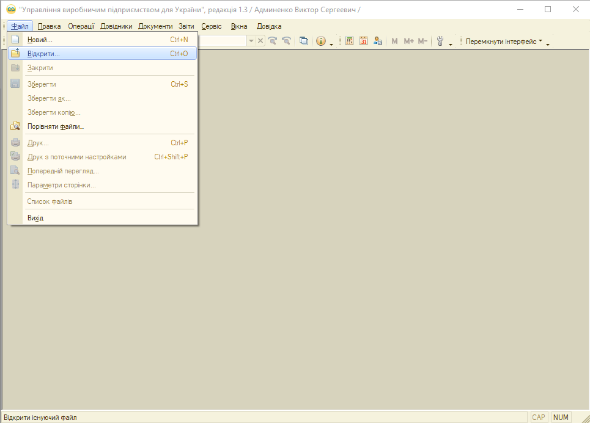
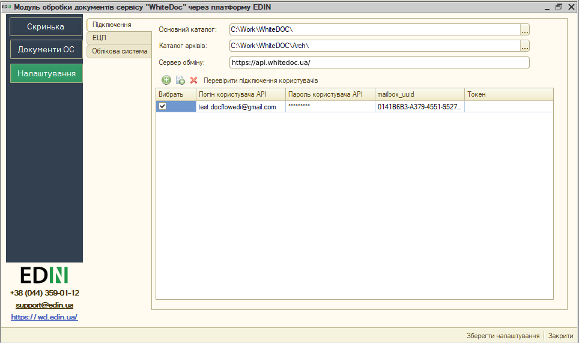
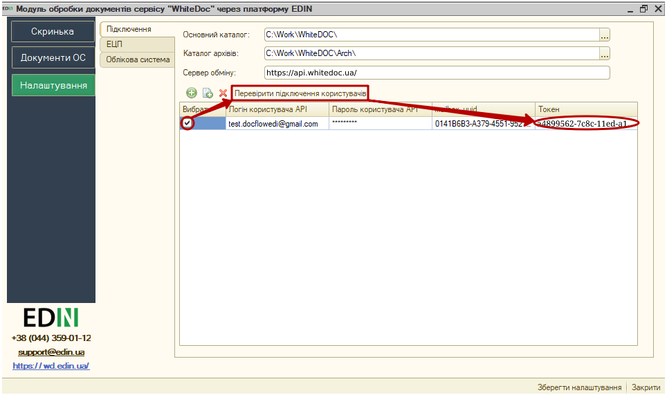
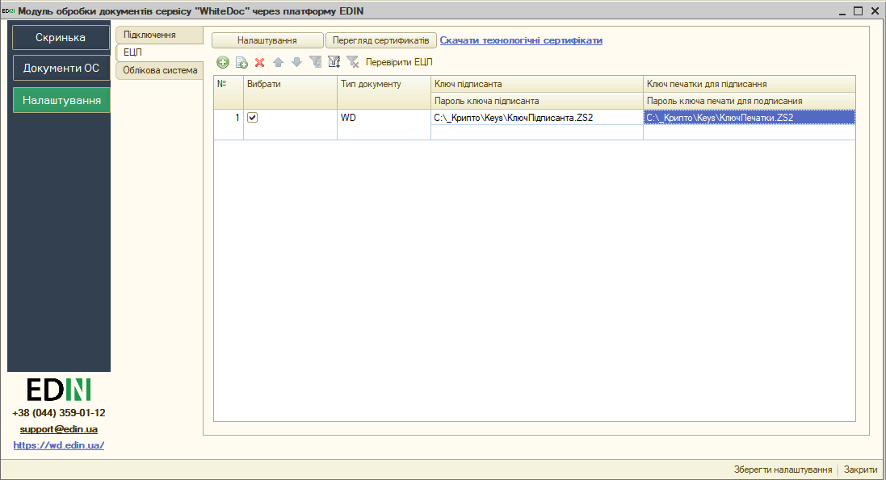
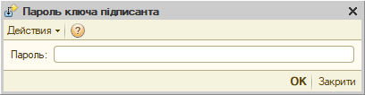
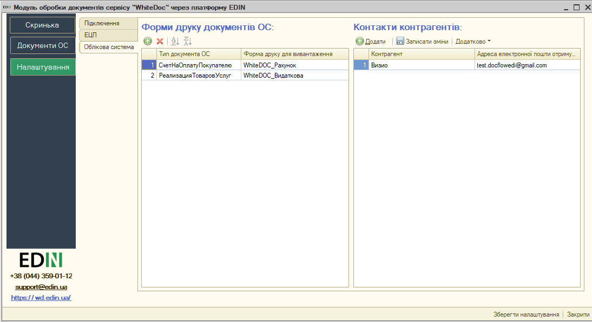
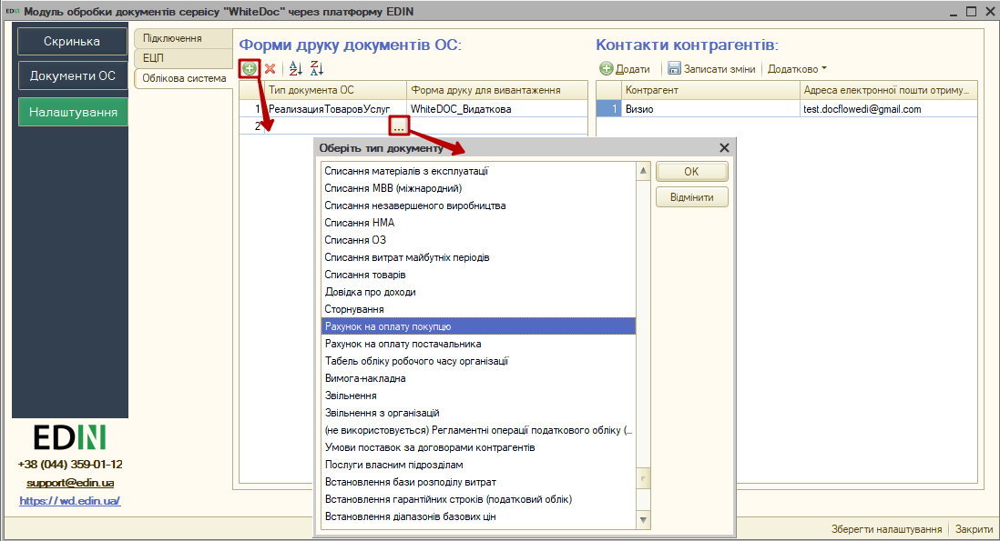
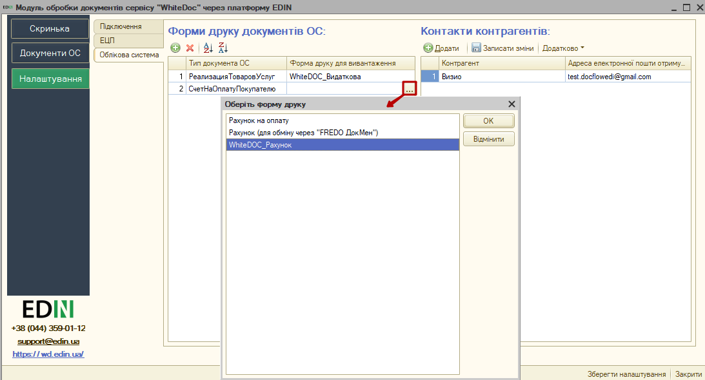
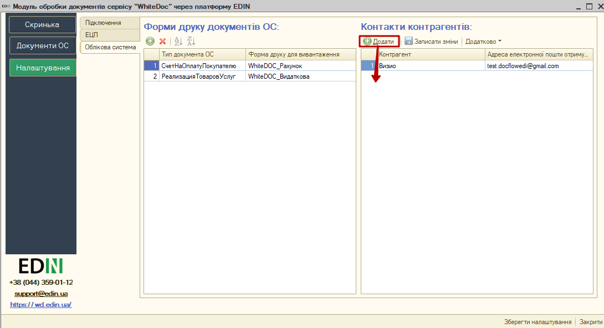

###############################################################################################################
Короткий посібник з інтеграції сервісу EDIN "WhiteDoc" з обліковими системи 1C | BAS
###############################################################################################################

.. role:: underline

.. role:: red

.. contents:: Зміст:
   :depth: 4

---------

Скорочення:

ОС - облікова система

ЕЦП - електронно-цифровий підпис/печатка

API (application programming interface) - набір визначених методів для взаємодії прогамного модуля з сервісом EDIN 

---------

*********************************************************
**1 Перший запуск і налаштування модуля**
*********************************************************

Розроблений компанією EDIN інтеграційний модуль сервісу EDIN "WhiteDoc" (в подальшому просто модуль) дозволяє працювати з обліковими системами 1С | BAS: Підприємство 8.Х на звичайних формах (надалі 1С | BAS) на базі операційної системи Windows.

Для роботи з модулем (за умови активної підписки на сервіс "WhiteDoc") користувачеві потрібні логін, пароль та ідентифікатор мейлбокса:

- **email** - логін користувача;
- **password** - пароль користувача в сервісі EDIN "WhiteDoc";
- **ідентифікатор мейлбокса** - унікальний на рівні сервісу ідентифікатор **Мейлбокса** [2]_ .

.. hint::
   Обрати та скопіювати потрібний Вам ідентифікатор можливо після авторизації на сторінці сервісу (https://edo.whitedoc.ua/login) :

   .. image:: pics_integration_WD_guide/integration_WD_guide_001.png
      :align: center

   ⠀⠀⠀⠀⠀⠀⠀⠀⠀

   .. image:: pics_integration_WD_guide/integration_WD_guide_002.png
      :align: center

Для запуску модуля необхідно в обліковій системі 1С | BAS відкрити файл запуску модуля (передається користувачеві співробітниками EDIN):

.. important:: У користувача повинні бути повні права на каталог, в якому знаходиться файл модуля

При першому запуску (відсутній **config.txt**) автоматично відкривається розділ **"Налаштування"** для введення всіх необхідних даних (надалі при запуску буде відкриватись розділ **"Скринька"**). 

.. У каталозі, в якому розташований файл модуля, автоматично створюються файл основних налаштувань **Config.txt**.

*************************************
**2 Налаштування**
*************************************

При першому запуску інтеграційного модуля сервісу EDIN "WhiteDoc" автоматично відкривається розділ **"Налаштування"**:

Розділ містить 3 вкладки:

- **Підключення**
- **ЕЦП**
- **Облікова система**

**2.1 Підключення**
================================================================

**Основний каталог** - шлях до місця розташування файлу модуля та його конфігурації (вказується шлях за замовчуванням).

**Каталог архівів** - шлях до місця розташування, виділеного під архіви, що можуть бути сформовані користувачем під час роботи з модулем (якщо шлях не буде заповнений, то модуль при зберіганні архіву попросить його вказати).

**Сервер обміну** - адреса платформи електронного документообігу (на цю адресу надсилаються запити модуля): https://api.whitedoc.ua/.

За допомогою зеленої круглої кнопки **"+"** потрібно додати користувача - при цьому вказуються **Логін користувача API (email)**, **Пароль користувача API** та **mailbox_uuid** (ідентифікатор мейлбокса). Токен  сесії генерується при успішній авторизації автоматично.

.. У цій вкладці також здійснюється вибір користувачів, від імені яких будуть здійснюватися подальші дії, наприклад, запити на відображення Вхідних / Вихідних документів.

.. note::
   Налаштування підключення зберігаються в файлі **config.txt**, який розміщується в основному каталозі модуля.

Після того, як дані користувача були введені можливо здійснити перевірку введених даних кнопкою **"Перевірити підключення користувачів"**, попередньо встановивши відмітку в колонці "Вибрати". 

В результаті перевірки отриманий **Токен** свідчить про коректно заповнені дані, пройдену авторизацію на платформі електронного документообігу. Також модуль відображає статусні повідомлення про успішність чи помилки, що можуть виникнути у користувача при роботі з модулем.

.. important::
   Після внесення всіх змін потрібно обов'язково **"Зберегти налаштування"** (кнопка в правій нижній частині вікна).

**2.2 ЕЦП**
=====================

Розділ налаштувань електронно-цифрового підпису і печатки (ЕЦП). Кнопка **"Скачати технологічні сертифікати"** дозволяє завантажити сертифікати ДФС (налаштування криптографії). За допомогою зеленої круглої кнопки **"+"** потрібно вказати шлях до "Ключа підписанта", що буде використовуватись для підписання документів. Опціонально: за потреби та наявності можливо також додати Ваш ключ печатки аналогічним способом:  

При вивантаженні юридично значимих документів паролі можна вносити або до таблиці, або обробка відобразить вікно для їх внесення перед початком підписання. Кнопка **"Перевірити ЕЦП"** дозволяє перевірити коректність введених даних ключів і паролів перед початком підписання. 

.. Модуль дозволяє зберігати будь-яку кількість наборів ключів, але на момент підписання по одній організації і типу документу необхідно вибрати (встановити прапорець в колонці "Вибрати") тільки одну пару ключів.

.. hint::
   Пароль вказується один раз за сесію, наприклад, при підписанні першого документа (підписання інших документів на протязі поточної сесії не потребує введення пароля).

При виявленні помилки при перевірці модуль попросить повторно ввести пароль:

При кожній перевірці ключа у вікні повідомлень відображається опис результату виконаної перевірки.

.. important::
   Після внесення всіх змін потрібно обов'язково **"Зберегти налаштування"** (кнопка в правій нижній частині вікна).

**2.3 Облікова система**
=====================================================================

Для подальшої роботи з електронним документообігом необхідно провести синхронізацію модуля і облікової системи (ОС).

Вікно вкладки налаштувань **"Облікової системи"** складається з наступних блоків:

* **Форми друку документів ОС**
* **Контакти контрагентів**

**2.3.1 Форми друку документів ОС**
---------------------------------------------------------------------

Потрібно додати та обрати типи документів з Вашої облікової системи, які будуть підтягуватись для подальшого електронного документообігу (колонка "Тип документа ОС"):

.. note::
   В сервісі "WhiteDoc" можливо обмінюватись двома типами документів (зовнішні та структуровані) однак інтеграційний модуль на даний момент підтримує роботу лише з зовнішніми документами! Зовнішній документ допускає додавання файлу-вкладення в форматі pdf, doc, docx, xls, xlsx, xml, dbf, txt, rtf, png, jpg, jpeg, zip не більше 5МБ (загальний розмір конверта [3]_ при цьому не повинен перевищувати 25 МБ).

Далі потрібно для кожного обраного типу документа ОС обрати "Форму друку для вивантаження" (зовнішні друковані форми), що буде використовуватись для формування документа сервісу EDIN "WhiteDoc":

.. important::
   В якості форм друку для вивантаження модуля EDIN "WhiteDoc" використовуються зовнішні друковані форми, для вибору яких потрібно попередньо їх долучити до Вашої системи 1С | BAS (рекомендоване залучення спецаліста 1С):

   .. image:: pics_integration_WD_guide/integration_WD_guide_011.png
      :align: center

   ⠀⠀⠀⠀⠀⠀⠀⠀⠀

   .. image:: pics_integration_WD_guide/integration_WD_guide_012.png
      :align: center

.. important::
   Після внесення всіх змін потрібно обов'язково **"Зберегти налаштування"** (кнопка в правій нижній частині вікна).

**2.3.2 Контакти контрагентів**
---------------------------------------------------------------------

В інтеграційному модулі "WhiteDoc" на відміну від web-версії основним ідентифікатором контрагента в системі є адреса електронної пошти, а не мейлбокс.

.. note::
   Надіслані конверти через інтеграційний модуль "WhiteDoc" автоматично потрапляють до основного мейлбокса отримувача, а сповіщення про вхідні конверти відправляються всім, хто має доступ до основного мейлбокса отримувача (згідно налаштувань).

В блоці "Контактів контрагентів" через кнопку **"+Додати"** можливо вказати електронні адреси (email) Ваших контрагентів:

.. important::
   Після внесення всіх змін потрібно обов'язково **"Зберегти налаштування"** (кнопка в правій нижній частині вікна).

------------------------------

.. [#] Акаунт — обліковий запис, у якому зберігається різна інформація, що відноситься до користувача (налаштування та інша інформація). 

.. [#] Мейлбокс (mailbox) — сутність, що є вхідною/вихідною точкою документообігу в сервісі. Може бути особистим або спільним для кількох користувачів на рівні одного акаунта. 

.. [#] Конверт — основна одиниця документобігу в сервісі, що вміщує один чи кілька документів та формується згідно визначеного шаблону.

.. [#] Шаблон — сукупність визначених користувачем правил формування документів, їх структури та порядку обробки, згідно яких формується конверт.

------------------------------

.. include:: /_constant/kontakti.rst

