#################################################################################
Інструкція користувача
#################################################################################

.. картинки:

.. |refresh| image:: pics_user_instruction_Vilnyi/user_instruction_Vilnyi_04.png

.. contents:: Зміст:
   :depth: 4

---------

Скорочення:

ОС - облікова система

ЕЦП - електронно-цифровий підпис/печатка

---------

****************************************
**Робота з модулем**
****************************************

Вступ
==========================

Дана інструкція описує роботу з інтеграційним модулем сервісу EDIN "WhiteDoc" для облікової системи 1С | BAS (далі ОС). Інтеграційний модуль являє собою зовнішню обробку для інтеграції електронного документообігу між обліковою системою користувача та сервісом платформи EDIN 2.0. Модуль інтеграції створено для звичайних форм конфігурацій ОС. Для роботи з документами меню інтеграційного модуля розділено на:

* **"Скринька"** - розділ для роботи з усіма документами (вхідним/відправленими/чернетками) сервісу EDIN "WhiteDoc";
* **"Документи ОС"** - розділ для роботи з документами ОС та їх швидкої відправки через модуль.

.. hint::
   Розділ **"Налаштування"** описано в `Інструкції по налаштуванню <https://wiki.edin.ua/uk/latest/WhiteDoc/WD_Instructions/integration_WD_guide.html>`__

-------------------------------------

.. _env-statuses:

В сервісі **"WhiteDoc"** для Конвертів [3]_ передбачені наступні статуси:

* **Чернетка** - створений, але ще не відправлений конверт (доступний до редагування);
* **В обробці** - відправлений конверт, що ще чекає на дії заповнення/підписання зі сторони контрагентів-учасників;
* **Очікує на вас** - відправлений конверт, очікує на дії заповнення/підписання з Вашої сторони;
* **Завершено** - кінцевий статус конверта; усі дії з документами (заповнення/підписання) виконано;
* **Скасовано** - кінцевий статус конверта; один з контрагентів-учасників відхилив конверт;
* **Прострочено** - кінцевий статус конверта; сплинув строк чинності конверта (налаштування шаблону).

.. _mailbox:

1 Скринька
=======================

**"Скринька"** - це розділ, в журналі якого відображаються Конверти [3]_, якими з Вами обмінюються обрані Контрагенти на рівні обраного Мейлбокса [2]_ (`Інструкції по налаштуванню <https://wiki.edin.ua/uk/latest/WhiteDoc/WD_Instructions/integration_WD_guide.html>`__). В розділі відображаються Конверти відповідно до обраного журналу: 

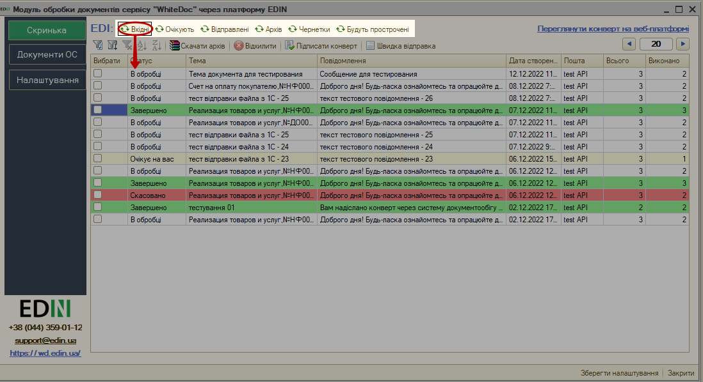

* **Вхідні** - журнал всіх вхідних Конвертів (від Контрагентів).
* **Очікують** - журнал вхідних Конвертів, документи якого чекають на дію (заповнення поля чи підписання) зі сторони користувачів з доступом до поточного Мейлбокса.
* **Відправлені** - журнал всіх відправлених Контрагентам Конвертів.
* **Архів** - журнал архівних оброблених Конвертів (всі перенесені в архів конверти).
* **Чернетки** - журнал створених, але не відправлених конвертів (конверти на етапі редагування).
* **Будуть прострочені** - журнал всіх конвертів, строк дії яких вже завершується (детальніше про властивості конверта в `налаштуваннях шаблону <https://wiki.edin.ua/uk/latest/WhiteDoc/WD_Instructions/Work_with_WD.html#template-details>`__). 

Будь-який конверт журналу (на якому стоїть курсор) можливо переглянути в браузері за допомогою кнопки **"Переглянути конверт на веб-платформі"**:

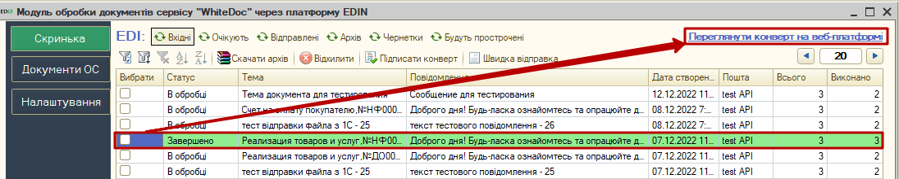

Розділ дозволяє налаштувати кількість Конвертів, що будуть виводитись на одній сторінці журналу (пагінація), а також зручно відфільтрувати та відсортувати Конверти в журналі: 

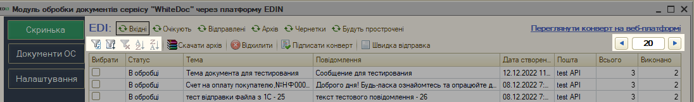

Функціональні кнопки для роботи з Конвертами (`"Скачати архів" <https://wiki.edin.ua/uk/latest/WhiteDoc/WD_Instructions/user_instruction_WD.html#arch-download>`__, `"Відхилити" <https://wiki.edin.ua/uk/latest/WhiteDoc/WD_Instructions/user_instruction_WD.html#env-decline>`__, `"Підписати конверт" <https://wiki.edin.ua/uk/latest/WhiteDoc/WD_Instructions/user_instruction_WD.html#create-and-send>`__,) відображаються для всіх каталогів розділу, однак ці дії мають логічні обмеження (сповіщення про успішне виконання чи помилку з описом відображаються в "Службових повідомленнях"):

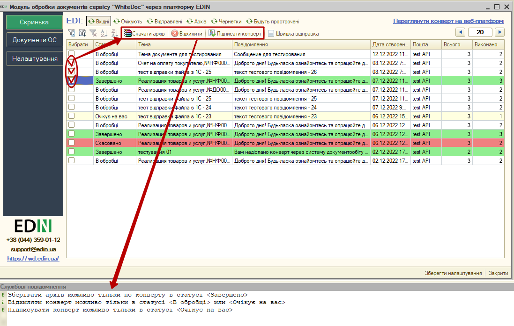

За допомогою кнопки **"Швидка відправка"** можливо швидко створити та відправити конверт Вашим контрагентам (детальніше в розділі `Формування та відправки конверта <https://wiki.edin.ua/uk/latest/WhiteDoc/WD_Instructions/user_instruction_WD.html#create-and-send>`__)

.. _OS-doc:

2 Документи ОС
=======================

**"Документи ОС"** - це розділ, в журналі якого відображаються документи Вашої облікової системи згідно Налаштувань документів і Контрагентів (`Інструкції по налаштуванню <https://wiki.edin.ua/uk/latest/WhiteDoc/WD_Instructions/integration_WD_guide.html>`__). Розділ містить фільтри за датою документа (поля "Дата з" / "по"):

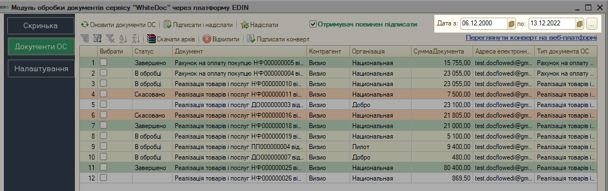

Документи, за якими вже було сформовано та відправлено Конверти відображаються зі `статусами <https://wiki.edin.ua/uk/latest/WhiteDoc/WD_Instructions/user_instruction_WD.html#env-statuses>`__ цих Конвертів.

Будь-який конверт журналу (на якому стоїть курсор) можливо переглянути в браузері за допомогою кнопки **"Переглянути конверт на веб-платформі"**:

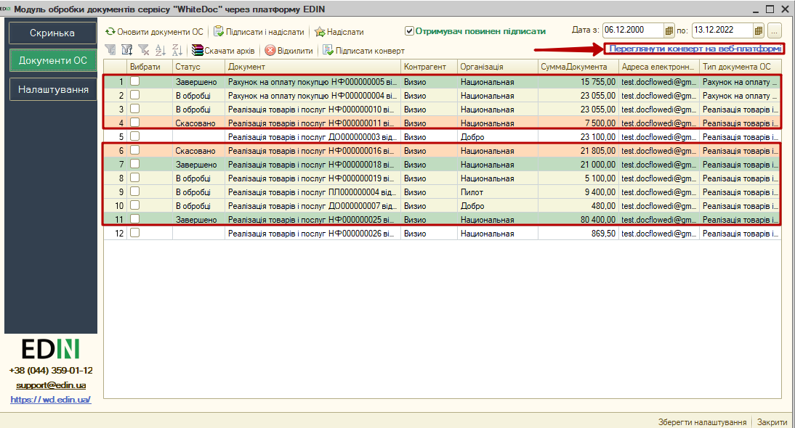

Про підписання та відправку Конвертів з розділу "Документів ОС" детально описано `за посиланням <https://wiki.edin.ua/uk/latest/WhiteDoc/WD_Instructions/user_instruction_WD.html#OS-create-and-send>`__.

.. _create-and-send:

3 Формування та відправка Конверта
=====================================================================

Створити та відправити Конверт в інтеграційному модулі обробки EDIN "WhiteDoc" можливо в розділі **"Скринька"** та в розділі **"Документи ОС"**.

.. _mailbox-create-and-send:

3.1 Формування та відправка Конверта зі "Скриньки"
------------------------------------------------------------------------------------------

В розділі **"Скринька"** конверт можливо відправити за допомогою кнопки **"Швидка відправка"**:

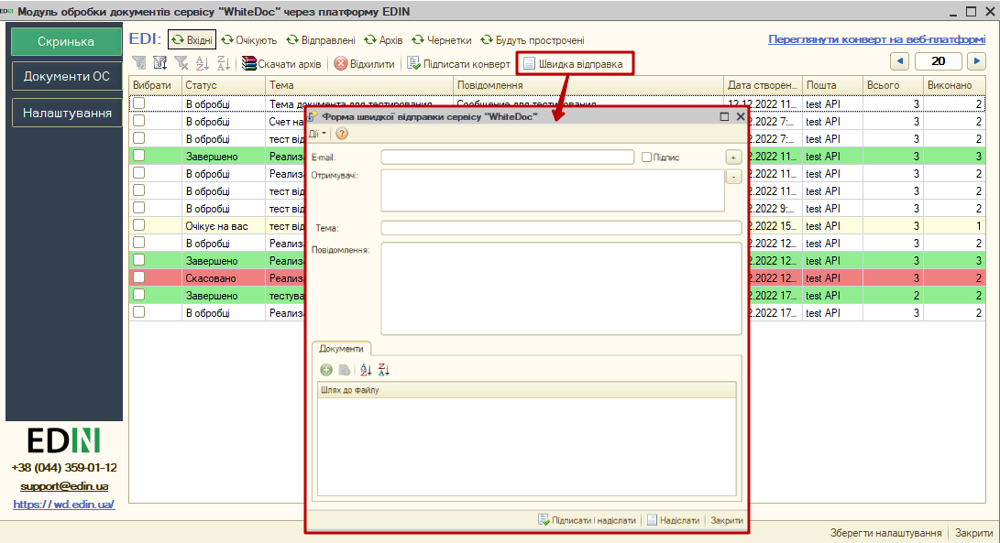

Далі у формі швидкої відправки потрібно вказати "E-mail" Контрагента та додати його в Отримувачі за допомогою кнопки **"+"**:

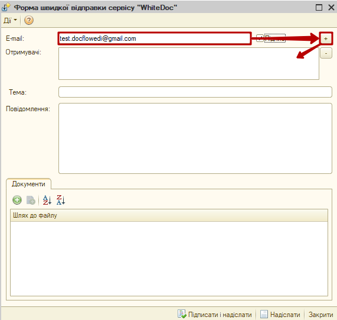

.. attention::
   Поставивши галочку в чекбоксі "Підпис" Ви зобов'язуєте введеного Контрагента підписати даний Конверт! Додані таким чином Отримувачі відображаються у списку з галочками та підсказкою в дужках (Потребує підписання):

   .. image:: pics_user_instruction_WD/user_instruction_WD_008.png
      :align: center

Обраних Отримувачів за потреби можливо видалити за допомогою кнопки **"-"**. Потрібно заповнити "Тему" конверта, можливо написати "Повідомлення". За допомогою зеленої кнопки **"+"** до Конверта можливо додати файли-вкладення в форматі pdf, doc, docx, xls, xlsx, xml, dbf, txt, rtf, png, jpg, jpeg, zip не більше 5МБ (загальний розмір Конверта [3]_ при цьому не повинен перевищувати 25 МБ):

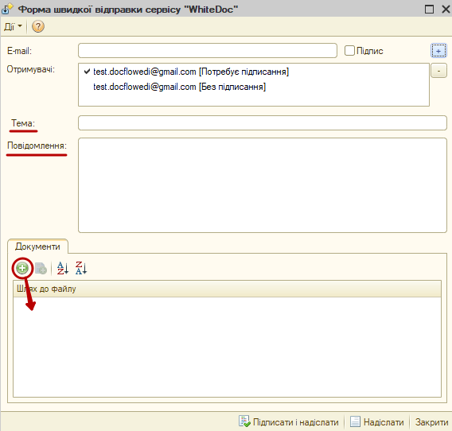

Після того, як обов'язкові поля будуть заповнені та вказано шлях до файлів-вкладень Конверт можливо **"Підписати і надіслати"** чи **"Надіслати"** не підписуючи:

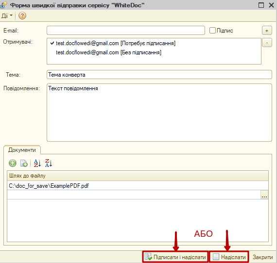

При першому підписанні за поточну сесію потрібно ввести пароль ключа підписанта:

.. image:: pics_integration_WD_guide/integration_WD_guide_007.png
   :align: center

Всі відправлені документи будуть відображатись в журналі **"Відправлених"** розділу **"Скриньки"**. Відправлені документи недоступні до редагування (редагувати можливо лише документ-чернетку).

.. _OS-create-and-send:

3.2 Формування та відправка Конверта з "Документів ОС"
------------------------------------------------------------------------------------------

В розділі **"Документи ОС"** конверт можливо відправити за допомогою кнопки **"Підписати і надіслати"**, а також можливо **"Надіслати"** непідписаний Конверт чи попередньо **"Підписати"** Конверт окремою дією. Для виконання цих дій спочатку потрібно обрати (відмітити галочкою) документи та за потреби поставити галочку в чекбоксі "Отримувач повинен підписати":

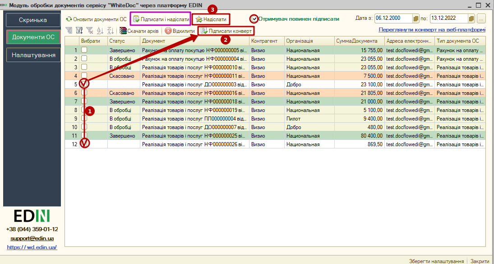

.. attention::
   Поставивши галочку в чекбоксі "Отримувач повинен підписати" Ви зобов'язуєте обраних Контрагентів підписати майбутній Конверт!

При відправці Конверта автоматично :

* заповнюється "Тема" Конверта згідно шаблону: "Назва_документа_з_ОС,номер_документа,дата_документа, для коротка_назва_Контрагента,ЄДРПОУ,ІПН";
* заповнюється "Повідомлення" Конверта згідно шаблону:

   "Відправник: Назва
   Отримувач: Повна назва
   Сума документа (якщо поле заповнене в документі ОС)";
* формується pdf документа згідно налаштувань форм друку для вивантаження даного докумемнта ОС (`Інструкції по налаштуванню <https://wiki.edin.ua/uk/latest/WhiteDoc/WD_Instructions/integration_WD_guide.html>`__) та вкладається до Конверта;
* Конверт підписується (за потреби) та відправляється. 

При першому підписанні за поточну сесію потрібно ввести пароль ключа підписанта:

.. image:: pics_integration_WD_guide/integration_WD_guide_007.png
   :align: center

Всі відправлені документи будуть відображатись в розділі **"Відправлені"**. Відправлені документи недоступні до редагування (редагувати можливо лише документ-чернетку).

.. _arch-download:

4 Скачати архів (завантаження конвертів)
=====================================================================

.. attention::
   Завантажувати Конверти можливо лише після успішного завершення документообігу (в статусі "Завершено")!

Завантаження обраних конвертів журналу доступне за допомогою кнопки **Скачати архів** (для цього потрібно попередньо відмітити конверти галочкою):

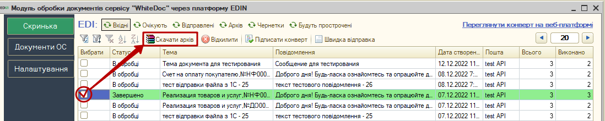

Завантажуються конверти у вигляді zip-архівів (найменування архіву згідно шаблону: "arch_ПоточнаДата_UUIDКонверта.zip"). Кожен з архівів містить каталоги (найменування=назві документа) для кожного документа, а також протокол подій конверта (AuditTrail.pdf). Кожен каталог зовнішнього документа містить:

   * Якщо документ не потребував підпису:

      * оригінал документа-вкладення.

   * Якщо документ підписувався ЕЦП:

      * оригінал документа-вкладення;
      * сертифікат підписання документа ({назва документа}.підписи.pdf). Сертифікат містить детальну інформацію по електронному документу (ідентифікатори шаблону, конверта, документа, назви, кількість підписантів, дату, посилання на електронну версію документа) та дані про всі підписи і всіх підписантів;
      * підписаний документ-вкладення ({назва документа}.{формат вкладення}.{номер підпису}.p7s). Кількість p7s-файлів відповідає кількості підписів.

.. _env-decline:

5 Відхилення конверта
================================================

Відправлений Конверт в статусі "В обробці" чи "Очікує на вас" (вхідний документ) можливо **"Відхилити"**. Для цього обов'язково потрібно відмітити конверт, вказати причину відхилення і підтвердити відхилення (**"ОК"**):

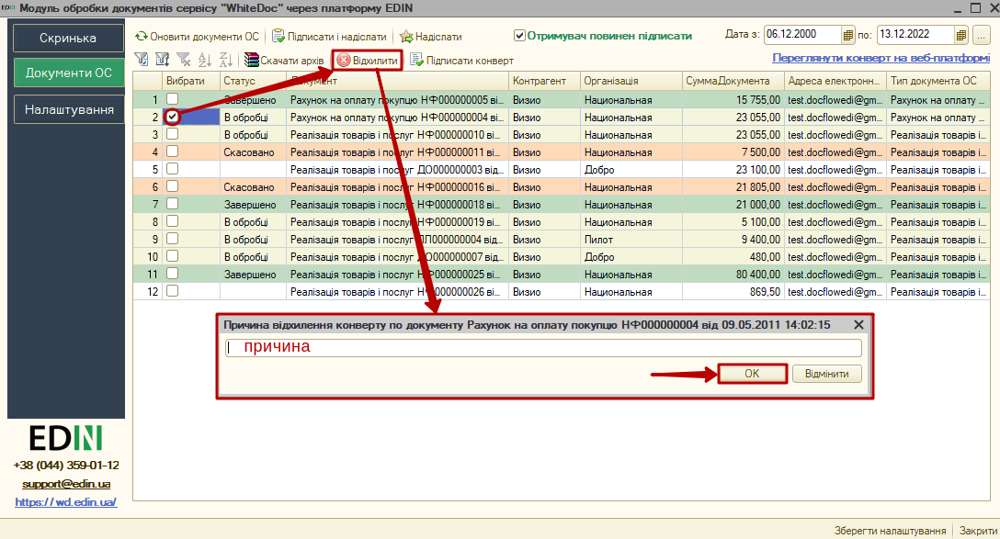

Після чого Конверт змінює свій статус на "Скасовано", а причина відхилення відображається учасникам в детялях Конверта. Документообіг завершено.

------------------------------

.. [#] Акаунт — обліковий запис, у якому зберігається різна інформація, що відноситься до користувача (налаштування та інша інформація). 

.. [#] Мейлбокс (mailbox) — сутність, що є вхідною/вихідною точкою документообігу в сервісі. Може бути особистим або спільним для кількох користувачів на рівні одного акаунта. 

.. [#] Конверт — основна одиниця документобігу в сервісі, що вміщує один чи кілька документів та формується згідно визначеного шаблону.

.. [#] Шаблон — сукупність визначених користувачем правил формування документів, їх структури та порядку обробки, згідно яких формується конверт.

------------------------------

.. include:: /_constant/kontakti.rst

