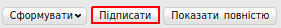
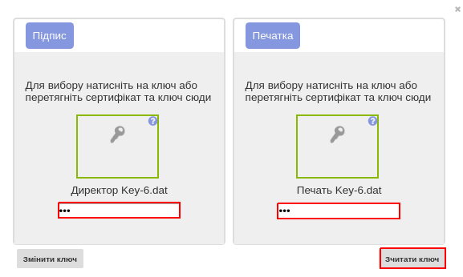

####################################################
Підписання документів ЕЦП на web-платформі
####################################################

.. contents:: Зміст:

---------

Підписання документа на web-платформі
==========================================

Для підписання документів на Web-платформі, необхідно відкрити потрібний юридично значущий документ і натиснути кнопку **«Підписати»**.

Для первинного налаштування ЕЦП, дочекайтеся завантаження сторінки, а потім натисніть кнопку **"Зчитати ключі"**.

.. image:: pics_Podpisanie_dokumentov_ECP_na_web-platofrme_EDIN/02.png
   :align: center

Потім, в блоці налаштування ЕЦП, натисніть на зображення ключа і виберіть з каталогу, в якому зберігаються ваші секретні ключі, відповідний файл.

.. image:: pics_Podpisanie_dokumentov_ECP_na_web-platofrme_EDIN/03.png
   :align: center

Види файлів електронно-цифрового підпису
================================================

Якщо Ви використовуєте ключі від **АЦСК "Україна"**, файли підписів секретних ключів мають розширення **.ZS2**, і наступні значення в іменах файлів:

* Директор «DS»
* Бухгалтер «BS»
* Співробітник «SS»
* Печатка «S»
* Шифрування «C»
* Універсальний ключ печатки і шифрування «U»

.. image:: pics_Podpisanie_dokumentov_ECP_na_web-platofrme_EDIN/04.png
   :align: center

Якщо Ви використовуєте ключі від будь-яких інших АЦСК, файли підписів секрентних ключів мають найменування **Key-6.dat**.

.. image:: pics_Podpisanie_dokumentov_ECP_na_web-platofrme_EDIN/06.png
   :align: center

Після вибору секретних ключів, введіть паролі під кожним з них, а потім натисніть кнопку **"Зчитати ключі"**.

При коректному зчитуванні ключів, в блоці **"ЕЦП"** з'явиться інформація про власників ключів. Після перевірки інформації натисніть кнопку **"Підписати"**.

.. image:: pics_Podpisanie_dokumentov_ECP_na_web-platofrme_EDIN/08.png
   :align: center

Після підписання натисніть на кнопку **"Відправити"**.

.. image:: pics_Podpisanie_dokumentov_ECP_na_web-platofrme_EDIN/09.png
   :align: center
   
.. include:: kontakti.rst
