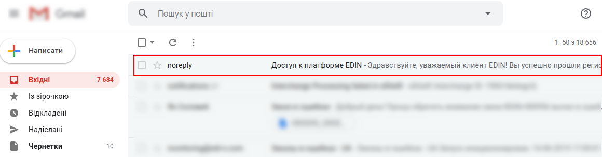
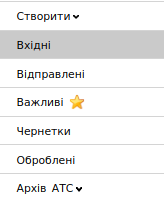
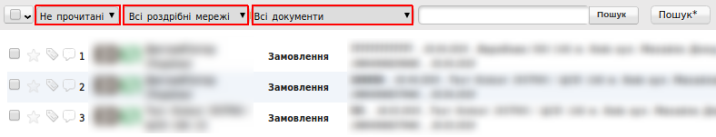
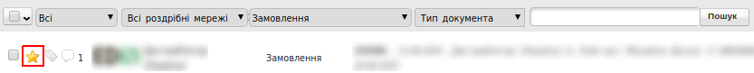
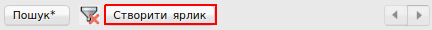
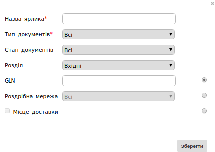
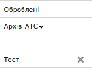
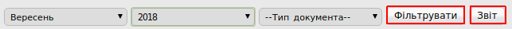
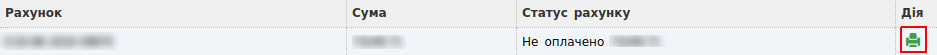
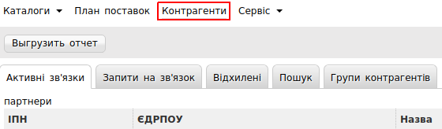

####################################################
Робота з платформою EDIN
####################################################

Дана інструкція описує загальні принципи роботи на web-платформі.

.. contents:: Зміст:
   :depth: 6

---------

.. important:: **Увага!** Перед початком роботи на web-платформі Вам на пошту надійде лист з даними для доступу.

Генерація пароля
================

Для доступу на портал, необхідно створити пароль, для генерації пароля, відкрийте лист і перейдіть за посиланням для створення пароля з пункту 3:

.. image:: pics_rabota_s_platformoj_EDIN/Instrukcija_po_rabote_s_platformoj_EDIN_02.png

У формі введіть новий пароль, а потім повторіть його і натисніть кнопку **«Зберегти»**.
Пароль повинен складатися мінімум з **6 символів** і містити **цифри і букви**.

.. image:: pics_rabota_s_platformoj_EDIN/Instrukcija_po_rabote_s_platformoj_EDIN_03.png
   :align: center

Після збереження пароля, система перенаправить Вас на головну сторінку для входу. Для доступу на web-платформу введіть логін з листа (пункт 2) і придуманий пароль.

.. image:: pics_rabota_s_platformoj_EDIN/Instrukcija_po_rabote_s_platformoj_EDIN_04.png
   :align: center

Відновлення паролю
=====================

Якщо Ви забули пароль, скористайтеся формою для відновлення, натиснувши кнопку **«Нагадати пароль»**.

Основні папки
==============

Після введення логіна і пароля в лівому блоці web-порталу відображаються основні папки для документів, за замовчуванням відображається папка **«Вхідні»**. Тут знаходяться всі документи, які були відправлені з боку контрагентів.

Фільтри
=======

У цій папці є можливість використовувати ** фільтри ** для швидкого відображення потрібних типів документів від певної мережі. Для цього потрібно скористатися полями, які відображені вище над документами.

Якщо у Вас кілька GLN, переключитися можливо натиснувши на 13-ти значний номер / назва компанії в правому верхньому куті екрану і ввести перші символи номера / назви компанії. Щоб при наступному вході на платформу відображався певний GLN, його потрібно відзначити **«зірочкою»**.

.. image:: pics_rabota_s_platformoj_EDIN/Instrukcija_po_rabote_s_platformoj_EDIN_07.png
   :align: center

Спочатку всі документи, що надійшли на платформу, виділені жирним шрифтом і є в статусі ** «Не прочитані» **. Після перегляду (відкриття) документ стає прочитаним. Повернути його в колишній статус неможливо.

Якщо в рядку документа біля найменування мережі стоїть якась цифра, вона відображає кількість документів, що знаходяться в ланцюжку. Наприклад, відкривши **«Замовлення»**, є можливість перейти в документ **«Підтвердження замовлення»**.

.. image:: pics_rabota_s_platformoj_EDIN/Instrukcija_po_rabote_s_platformoj_EDIN_08.png
   :align: center

При позначці галочкою документа (без переходу в документ), є можливість зробити наступні дії:

#. Створити ярлик
#. Перенести в ** «Оброблені» ** (повернути документ назад можливо, зазначивши галочкою)
#. Надрукувати
#. Зберегти в форматі Excel
#. Підписати (в разі, якщо це юридично значимий документ)
#. Відзначити як прочитаний
#. Роздрукувати в форматі .PDF

При позначці зірочкою документ автоматично копіюється в папку **«Важливі»**.

Після відкриття документа (вхідного / відправленого) є можливість:

#. Надрукувати документ
#. Зберегти в форматі Excel
#. Зберегти в форматі XML
#. Сформувати відповідні документи
#. Підписати (в разі, якщо це юридично значимий документ)
#. Відкрити повний вид документа
#. Перенести документ в папку **«Оброблені»**

При натисканні кнопки **«Зберегти»**, документ зберігається в папці **«Чернетки»**. Надалі з Чернеток можна відправити кілька документів одночасно, зазначивши галочкою і натиснувши кнопку **«Надіслати»**. Така можливість є і при підписанні кількох ЮЗД. Після натискання кнопки **«Надіслати»**, документ переноситься в папку **«Відправлені»**.

Для роботи з архівом досить натиснути на кнопку **«Архів»** і вибрати рік. Далі потрібно вибрати місяць, за який потрібно знайти документ.

За замовчуванням відображається 40 останніх документів. Для переходу на наступні 40 досить натиснути на кнопку **«вправо»**, яка знаходиться в правій верхній частині екрану.

.. image:: pics_rabota_s_platformoj_EDIN/Instrukcija_po_rabote_s_platformoj_EDIN_11.png
   :align: center

Завершує список, папка **«Документи АТС»**. Яка містить в собі первинну документацію та податкові накладні від ТОВ «АТС». Документ **«Акт наданих послуг»**, вимагає підписання ЕЦП з вашого боку. Процедура підписання вказана у відповідній інструкції.

Ярлики
======

Крім основних папок на Web-платформі, є можливість створити **«Ярлик»** для певних типів документів і мереж. Для цього необхідно натиснути на кнопку **«Створити ярлик»**.

Дана функція дозволяє створити окремий ярлик, під певні типи документів, стану документів (прочитані та непрочитані), вибрати розділ **«Вхідні»**, **«Відправлені»**, **«Важливі»**, **«Чернетки»** або **«Оброблені»**. Так само можна додати GLN номер, певну роздрібну мережу або місце доставки.

Після внесення необхідних даних, під стандартними папками на web-платформі з'явиться створений Ярлик з документами за вказаними параметрами.

Пошук
======

.. sidebar:: Розширений **«Пошук»***

    .. image:: pics_rabota_s_platformoj_EDIN/Instrukcija_po_rabote_s_platformoj_EDIN_17.png
   

Пошук документів на платформі здійснюється двома способами:

Звичайний **«Пошук»**, і **"Розширений пошук"***

.. image:: pics_rabota_s_platformoj_EDIN/Instrukcija_po_rabote_s_platformoj_EDIN_15.png
   :align: center

Для пошуку достатньо ввести коректний номер документа в поле **«Пошук»**. При цьому потрібно виставити фільтр на **«все»**. Так як, наприклад, при обраному фільтрі **«Прочитані»**, пошук буде здійснюватися тільки по прочитаним. Для скидання фільтра натисніть кнопку: | кубик-рубика | після цього всі фільтри будуть скинуті.

.. |кубик-рубика| image:: pics_rabota_s_platformoj_EDIN/Instrukcija_po_rabote_s_platformoj_EDIN_16.png 

Кнопка ** «Пошук *» ** має розширений функціонал пошуку документів, натиснувши на відповідну кнопку, з'явитися вікно для введення даних.
Після введення потрібного критерію для пошуку документа, натисніть кнопку **«Знайти»**. Пошук буде здійснюватися за заданими параметрами.

Для того що б скасувати пошук по даним критеріям, перейдіть повторно в розділ **«Пошук»** і натисніть **«Скидання»**. Після цього всі фільтри будуть скинуті.

Налаштування
====================

Кнопка налаштувань знаходиться в правому верхньому кутку:

В налаштуваннях знаходяться наступні вкладки:

.. image:: pics_rabota_s_platformoj_EDIN/Instrukcija_po_rabote_s_platformoj_EDIN_19.png
   :align: center

У вкладці **«Мої налаштування»** є можливість змінити свій пароль для входу на платформу, e-mail для відправки повідомлень, мову інтерфейсу, а також додати сервісні повідомлення.
У вкладці **«Мої компанії»** відображається список ваших компаній з окремими GLN. При виборі однієї з компаній є можливість внести дані, які можуть використовуватися автоматично при формуванні деяких типів документів. Наприклад, дані підписанта в Комерційному документі. Далі обов'язково потрібно натиснути кнопку **«Зберегти»**.

.. image:: pics_rabota_s_platformoj_EDIN/Instrukcija_po_rabote_s_platformoj_EDIN_20.png
   :align: center

У вкладці **«Біллінг»** можна скачати звіт по зроблених транзакціях. Для цього потрібно вибрати період (при необхідності тип документа) і натиснути кнопку **«Фільтрувати»**, а потім **«Звіт»**. Далі файл завантажується в форматі .xls.

Функціонал у вкладці «Біллінг», знаходиться на стадії розробки.

У вкладці **«Рахунки»** знаходяться документи, виставлені від контрагента. Їх можна надрукувати натиснувши на іконку в колонці **«Дії»**.

Перейти у вкладку рахунки також можна натиснувши на повідомлення вгорі платформи:

.. image:: pics_rabota_s_platformoj_EDIN/Instrukcija_po_rabote_s_platformoj_EDIN_23.png
   :align: center

У вкладці **«Реквізити»** відображаються реквізити вашої компанії.
Після заповнення полів потрібно натиснути кнопку **«Надіслати»**.

У вкладці **«Користувачі»** відображаються всі логіни, через які здійснюється доступ до платформи. В даній вкладці є можливість створити нового користувача, натиснувши на відповідну кнопку або редагувати існуючий.

.. image:: pics_rabota_s_platformoj_EDIN/Instrukcija_po_rabote_s_platformoj_EDIN_24.png
   :align: center

Функціонал у вкладці **«Мої покупці»**, знаходиться в на стадії розробки.

Меню
==========

На верхній панелі Web-платформи міститься наступне меню:

.. image:: pics_rabota_s_platformoj_EDIN/Instrukcija_po_rabote_s_platformoj_EDIN_25.png
   :align: center

Розділ **«Каталоги»** містить в собі:

* **Товарний довідник**
* **Каталог транспортних засобів**
* **Довідник водіїв**
* **Довідник тегів**

.. image:: pics_rabota_s_platformoj_EDIN/Instrukcija_po_rabote_s_platformoj_EDIN_26.png
   :align: center

**Товарний довідник** - необхідний для внесення цін і номенклатури для коректної роботи з відповідними документами по деяких торговельних мереж.

**Каталог транспортних засобів** - містить в собі довідник автомобілів. Спрощує роботу з деякими сервісами електронного документообігу.

**Довідник водіїв** - містить в собі довідник водіїв. Спрощує роботу з деякими сервісами електронного документообігу.

**Довідник тегів** - містить в собі довідник тегів.

Розділ **«План поставок»** являє собою календар:

.. image:: pics_rabota_s_platformoj_EDIN/Instrukcija_po_rabote_s_platformoj_EDIN_27.png
   :align: center

В даному календарі можливо перевірити всі ваші минулі і майбутні поставки по всім торговим мережам. Дата поставки вказується відповідно до дати доставки, зазначеної в замовленні від мережі. При наведенні курсором миші на певний номер замовлення, у спливаючому вікні буде відображена точка доставки по даному замовленню. Клікнувши по номеру замовлення, буде виконаний перехід до відповідного замовлення. Для зручності відображення, план поставок можна відфільтрувати по місяцю, року і необхідній торговельній мережі. Для цього скористайтесь відповідними кнопками:

.. image:: pics_rabota_s_platformoj_EDIN/Instrukcija_po_rabote_s_platformoj_EDIN_28.png
   :align: center

Функціонал у вкладці **«Контрагенти»** знаходиться на стадії розробки.

Сервіси
==========

Розділ **«Сервіс»** містить в собі функціонал, який підключається додатково:

.. image:: pics_rabota_s_platformoj_EDIN/Instrukcija_po_rabote_s_platformoj_EDIN_30.png
   :align: center

* **EDIN-Certificate**
* **Завдання**
* **EDIN-Price**
* **Статистичні звіти за документами**

**EDIN-Certificate** - Сервіс обміну електронними сертифікатами, дозволяє прикріплювати і обмінюватися сертифікатами якості, експертними висновками, деклараціями виробника та ін.

**Завдання** - Сервіс, дозволяє масово вивантажувати документи в .PDF форматі;

**EDIN-Price** - Сервіс узгодження цін в електронному вигляді;

**Статистичні звіти за документами** - Сервіс знаходиться на стадії розробки.

Для підключення або відключення сервісів зверніться до ведучого менеджеру нашої компанії.

.. include:: kontakti.rst
