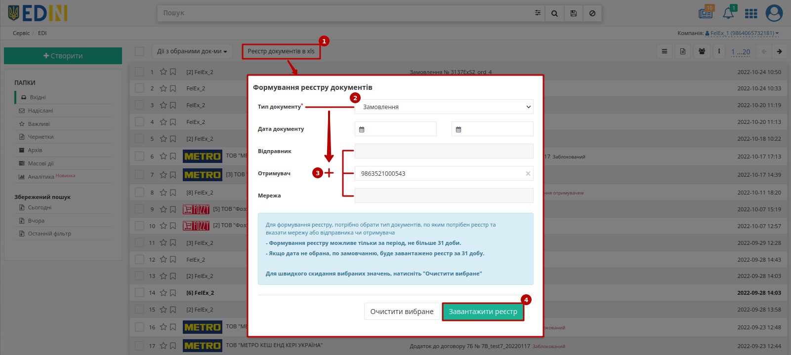

Інструкція по завантаженню реєстру документів
###################################################################################################

.. role:: red

.. role:: underline

Користувач може завантажити собі **"Реєстр документів в xls"** (у вигляді Excel-файлу) за типом документа:

* "Замовлення" (ORDERS)
* "Повідомлення про відвантаження" (DESADV)
* "Підтвердження замовлення" (ORDRSP)
* "Повідомлення про прийом" (RECADV)
* "Рахунок" (INVOICE)
* "Накладні" (DOCUMENTIVOICE) загалом чи за вказаним `підтипом <https://wiki.edin.ua/uk/latest/integration_2_0/APIv2/Methods/EveryBody/ExtraQueryParameters_fieldName_sub_doc_type_id.html>`__ : "Товарна накладна"/"Цінова накладна"/"Видаткова накладна"/"Накладна за кількістю" (DOCUMENTINVOICE з DocumentFunctionCode=DRN/PRN/TN)
* "Комерційні документи" (COMDOC) загалом чи за вказаним `підтипом <https://wiki.edin.ua/uk/latest/integration_2_0/APIv2/Methods/EveryBody/ExtraQueryParameters_fieldName_sub_doc_type_id.html>`__ "Комерційного документа"

.. note::
   В реєстр завантажуються **всі документи** ("Вхідні"/"Надіслані"/"Архівні"), що потрапляють у зазначений інтервал для вказаного контрагента (немає значення, в якій папці перебуває користувач на момент формування реєстру).

Після натискання на кнопку **"Реєстр документів в xls"** (1) відкривається модальне вікно, де обов'язково потрібно обрати:

* Тип документа (2)
* Відправника або Отримувача або Мережу (3) - пошук за назвою/ІПН/КПП/GLN організації

Додатково можливо обрати діапазон дат (не більше 31 діб) в межах якого буде робитись вибірка документів. Якщо діапазон дат не обрано, за замовчанням буде створено та завантажено реєстр за останні 31 добу. Кнопка **"Очистити вибране"** очищає вибрані значення параметрів.

Після того, як обов'язкові параметри були обрані можливо **"Завантажити реєстр"** (4) за допомогою одноіменної кнопки.

------------------------------------------------

.. include:: /_constant/kontakti.rst
