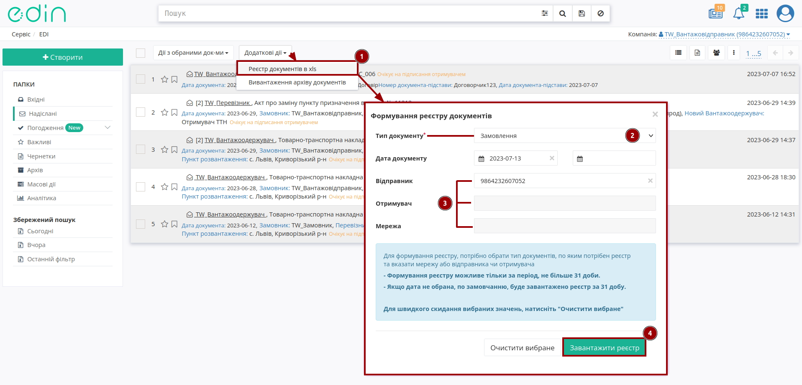
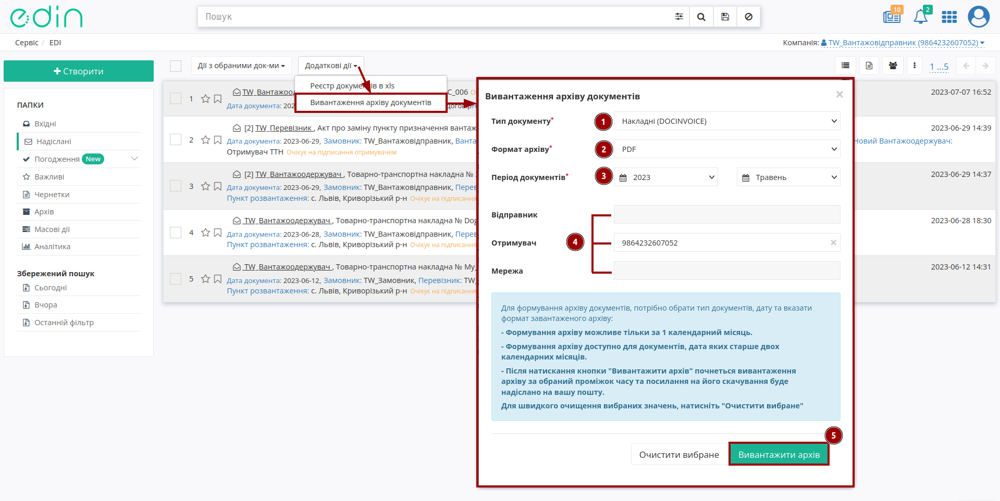

Функціонал "Додаткові дії"
###################################################################################################

.. role:: red

.. contents:: Зміст:
   :depth: 4

---------

**Вступ**
================================================

Дана інструкція описує функціонал **"Додаткових дій"**, що можливо виконати з Вашими документами.

.. _xls-register:

**1 Реєстр документів в xls**
================================================

Користувач може завантажити собі **"Реєстр документів в xls"** (у вигляді Excel-файлу) за типом документа:

* "Замовлення" (ORDERS)
* "Повідомлення про відвантаження" (DESADV)
* "Підтвердження замовлення" (ORDRSP)
* "Повідомлення про прийом" (RECADV)
* "Рахунок" (INVOICE)
* "Накладні" (DOCUMENTIVOICE) загалом чи за вказаним `підтипом <https://wiki.edin.ua/uk/latest/integration_2_0/APIv2/Methods/EveryBody/ExtraQueryParameters_fieldName_sub_doc_type_id.html>`__ : "Товарна накладна"/"Цінова накладна"/"Видаткова накладна"/"Накладна за кількістю" (DOCUMENTINVOICE з DocumentFunctionCode=DRN/PRN/TN)
* "Комерційні документи" (COMDOC) загалом чи за вказаним `підтипом <https://wiki.edin.ua/uk/latest/integration_2_0/APIv2/Methods/EveryBody/ExtraQueryParameters_fieldName_sub_doc_type_id.html>`__ "Комерційного документа"

.. note::
   В реєстр завантажуються **всі документи** ("Вхідні"/"Надіслані"/"Архівні"), що потрапляють у зазначений інтервал для вказаного контрагента (немає значення, в якій папці перебуває користувач на момент формування реєстру).

Потрібно натиснути на кнопку **"Додаткові дії"** та обрати з випадаючого списку **"Реєстр документів в xls"** (1). Після чого відкривається модальне вікно, де обов'язково потрібно обрати:

* Тип документа (2)
* Відправника або Отримувача або Мережу (3) - пошук за назвою/ІПН/КПП/GLN організації

Додатково можливо обрати діапазон дат (не більше 31 діб) в межах якого буде робитись вибірка документів. Якщо діапазон дат не обрано, за замовчанням буде створено та завантажено реєстр за останні 31 добу. Кнопка **"Очистити вибране"** очищає вибрані значення параметрів.

Після того, як обов'язкові параметри були обрані можливо **"Завантажити реєстр"** (4) за допомогою одноіменної кнопки.

.. _doc-arch:

**2 Вивантаження архіву документів**
================================================

Ви можете вивантажити архів з документами за вказаний місяць в зручному для Вас форматі.

.. note::
   Ви можете вивантажити лише ті документи, які старше двох календарних місяців!

Типи документів, що можливо вивантажити архівом:

* "Замовлення" (ORDERS)
* "Повідомлення про відвантаження" (DESADV)
* "Підтвердження замовлення" (ORDRSP)
* "Повідомлення про прийом" (RECADV)
* "Рахунок" (INVOICE)
* "Накладні" (DOCUMENTIVOICE) загалом чи за вказаним `підтипом <https://wiki.edin.ua/uk/latest/integration_2_0/APIv2/Methods/EveryBody/ExtraQueryParameters_fieldName_sub_doc_type_id.html>`__ : "Товарна накладна"/"Цінова накладна"/"Видаткова накладна"/"Накладна за кількістю" (DOCUMENTINVOICE з DocumentFunctionCode=DRN/PRN/TN)
* "Комерційні документи" (COMDOC) загалом чи за вказаним `підтипом <https://wiki.edin.ua/uk/latest/integration_2_0/APIv2/Methods/EveryBody/ExtraQueryParameters_fieldName_sub_doc_type_id.html>`__ "Комерційного документа"

.. note::
   Архів буде містити **всі документи** ("Вхідні"/"Надіслані"/"Архівні"), що потрапляють у зазначений інтервал для вказаного контрагента (немає значення, в якій папці перебуває користувач на момент формування архіву).

Потрібно натиснути на кнопку **"Додаткові дії"** та обрати з випадаючого списку **"Вивантаження архіву документів"** (1). Після чого відкривається модальне вікно, де обов'язково потрібно обрати:

* Тип документа (2)
* Формат архіву (3): PDF / XML / P7S (останній формат доступний лише для DOCUMENTIVOICE/COMDOC типів документів, що передбачають підписання КЕП)
* Відправника або Отримувача або Мережу (4) - пошук за назвою/ІПН/КПП/GLN організації

Після того, як обов'язкові параметри були обрані можливо **"Вивантажити архів"** (5) за допомогою одноіменної кнопки. Після закінчення вивантаження архів буде надіслано на вашу пошту (на пошту користувача, з якої робився запит на вивантаження архіву):

.. important::
   Якщо в майбутній архів має потрапити більше 1000 документів, то процес формування архіву може зайняти деякий час. Архів доступний за посиланням протягом 5 днів з моменту формування після чого видаляється. Архів захищається паролем, для більшої безпеки клієнтських даних (пароль до архіву зазначається в повідомленні).

У випадку, коли за обраними параметрами формування архіву документів НЕ знайдено, то Ви отримаєте email з відповідним повідомленням:

------------------------------------------------

.. include:: /_constant/kontakti.rst
