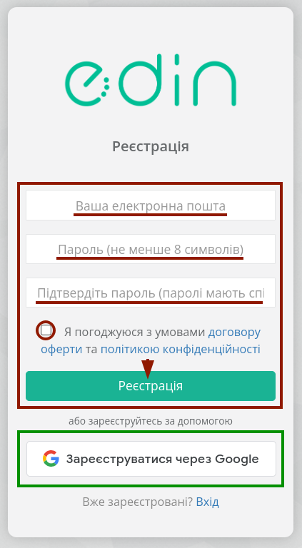
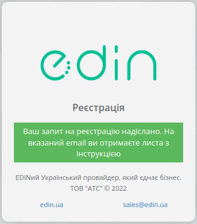
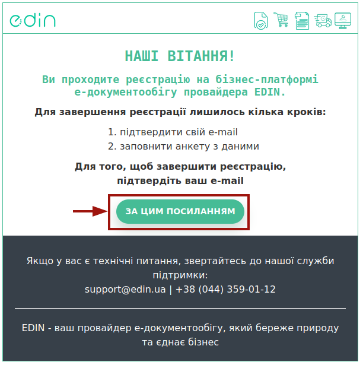
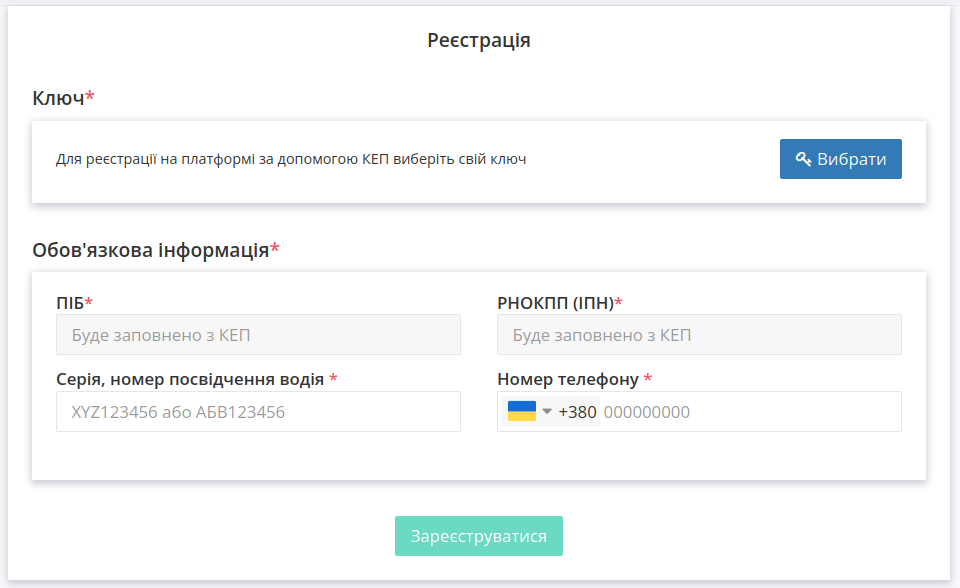
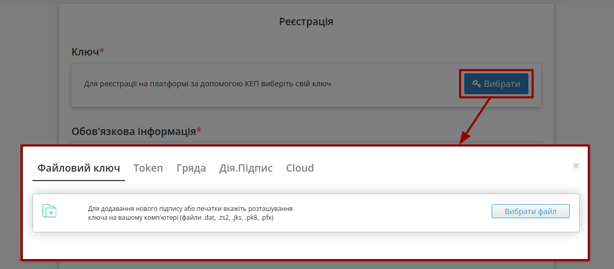
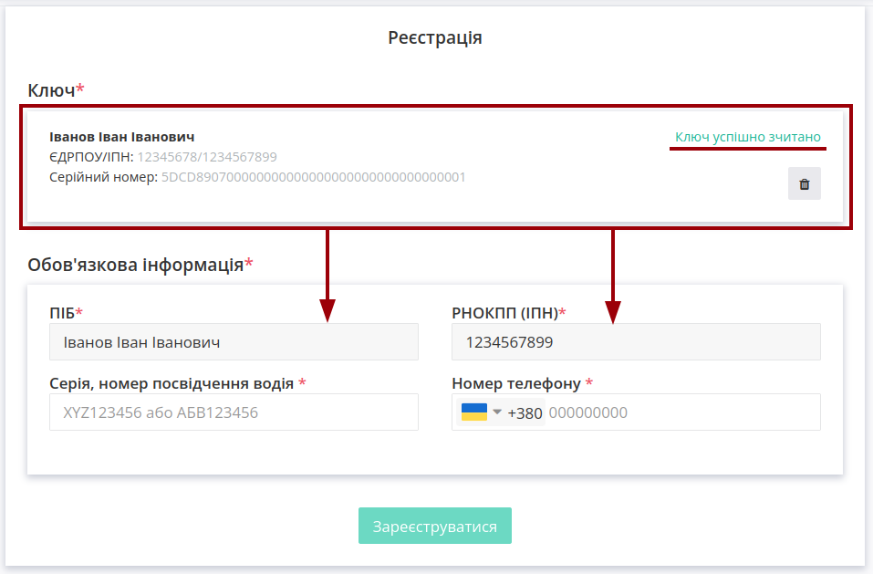
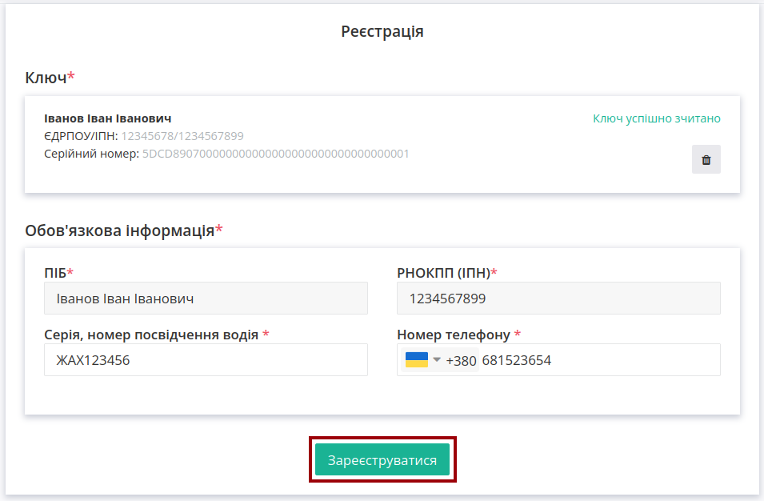
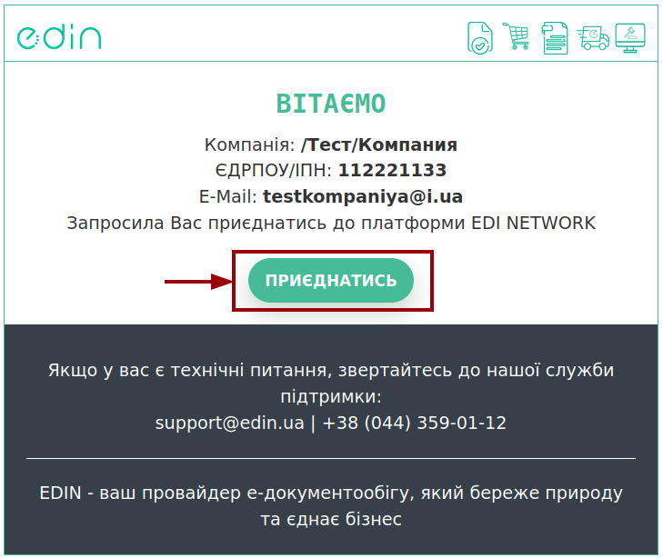
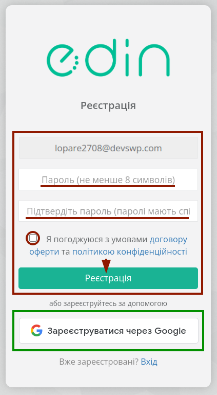

Реєстрація Водія на платформі EDI Network
##################################################################

.. сюда закину немного картинок для текста

.. |del_key| image:: /_constant/signing/del_key.png

.. role:: red

.. role:: underline

.. contents:: Зміст:
   :depth: 3

---------

**Вступ**
================================================

Дана інструкція пояснює процес реєстрації **Водіїв** - користувачів платформи EDI Network, що будуть мати справу насамперед з транспортними документами. Оскільки потреби **Водіїв** зосереджені саме на обробці транспотних документів, то і функціонал, що виводиться для таких користувачів сфокусований на їх потребах. 

.. hint::
   Для реєстрації звичайних користувачів чи компанії для зручної роботи з усіма продуктами та сервісами EDIN перейдіть за посиланням на іншу `інструкцію з реєстрації <https://wiki.edin.ua/uk/latest/general_2_0/User_registration.html#register>`__.

**Водій** може зареєструватись самостійно або може бути запрошений Перевізником. 

.. _self-register:

**1 Самостійна реєстрація Водія**
================================================

Для самостійної реєстрації на платформі EDI Network **Водію** необхідно перейти за `посиланням <https://driver.edin.ua/register?source=driver_wiki>`__:

У відкритій формі потрібно:

* Вказати Email (надалі він буде використовуватися в якості логіну при авторизації на платформі);
* Придумати Пароль (має бути не менше ніж 8 символів) - потребує повторного введення (підтвердження);
* Погодитись з офертою та політикою конфіденційності – встановіть позначку про підтвердження;
* Натиснути кнопку **"Реєстрація"**.

.. hint::
   Також, в якості альтернативи, можливо **"Зареєстуватися через Google"** за допомогою відповідної кнопки:

   .. image:: pics_User_registration/User_registration_049.png
      :align: center

.. hint::
   Також, в якості альтернативи, можливо **"Зареєстуватися через Google"** за допомогою відповідної кнопки.

Після чого система проінформує, що відправила листа на зазначену адресу:

Очікуйте на лист - він потрібен для підтвердження email!

.. attention::
   Лист міг потрапити до спаму. Тому перевірте не тільки "Вхідні", але й "Спам". В разі попадання до спаму налаштуйте правила, щоб наступні листи від EDIN не потрапляли до спаму.

Після отримання листа, перейдіть за посиланням (дійсне 72 години) в ньому щоб підтвердити email:

При переході за Вашим посиланням потрібно заповнити форму реєстрації:

.. початок блоку для RegisterThroughCarrier

Для продовження потрібно **"Вибрати"** один із способів для ідентифікації за Вашим КЕП:

.. tabs::

   .. tab:: Файловий ключ

      .. include:: /_constant/signing/signing.rst
         :start-after: .. початок блоку для Signing
         :end-before: .. кінець блоку для Signing

   .. tab:: Token

      .. include:: /_constant/token_signing/token_signing.rst
         :start-after: .. початок блоку для TokenSign
         :end-before: .. кінець блоку для TokenSign

   .. tab:: Гряда

      .. include:: /_constant/gryada_signing/gryada_signing.rst
         :start-after: .. початок блоку для GryadaSign
         :end-before: .. кінець блоку для GryadaSign

   .. tab:: Дія.Підпис

      .. include:: /_constant/diya_signing/diya_signing.rst
         :start-after: .. початок блоку для DiyaPidps
         :end-before: .. кінець блоку для DiyaPidps

   .. tab:: Cloud

      .. include:: /_constant/cloud_signing/cloud_signing.rst
         :start-after: .. початок блоку для CloudSign
         :end-before: .. кінець блоку для CloudSign

Після того, як ключ успішно зчитано на формі реєстрації поля "ПІБ" та "РНОКПП (ІПН)" заповнюються автоматично даними з ключа без можливості їх редагування:

Для завершення реєстрації потрібно вказати **Серію, номер посвідчення водія**, **Номер телефону** та натиснути **"Зареєструватися"** :

По закінченню реєстрації автоматично відкривається сторінка сервісу **"EDI Network"** (детальніше про функціонал сервісу ви можете дізнатись з нашої `інструкції <https://wiki.edin.ua/uk/latest/general_2_0/rabota_s_platformoj_EDIN_2.0.html#gln>`__). 

.. кінець блоку для RegisterThroughCarrier

.. _register-through-carrier:

**1 Реєстрація Водія за запрошенням**
==========================================================

.. note::
   Користувачі платформи EDI Network (зазвичай **компанії-Перевізники**) в розділі **"Особистий кабінет" -> "Налаштування" -> "Водії"** можуть додавати зареєстрованих/незареєстрованих  на платформі водіїв (детальніше в `інструкції <https://wiki.edin.ua/uk/latest/Personal_Cabinet/PCInstruction.html#drivers>`__). 

Запрошеному **Водію** на вказаний в запрошенні email приходить лист:

При переході за посиланням відкриється вікно початку реєстрації з уже заповненим email:

У відкритій формі потрібно:

* Придумати Пароль (має бути не менше ніж 8 символів) - потребує повторного введення (підтвердження);
* Ознайомитись і погодитись з офертою та політикою конфіденційності – встановіть позначку про підтвердження;
* Натиснути на кнопку **"Реєстрація"**.

.. include:: /general_2_0/Driver_registration.rst
   :start-after: .. початок блоку для RegisterThroughCarrier
   :end-before: .. кінець блоку для RegisterThroughCarrier

------------------------------

.. include:: /_constant/kontakti.rst
