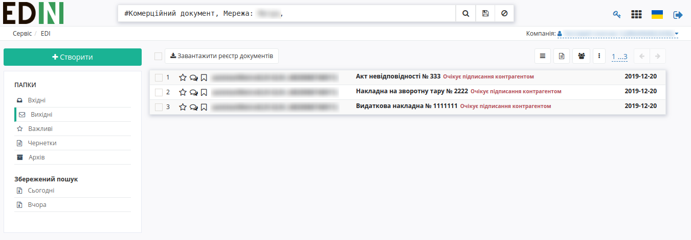
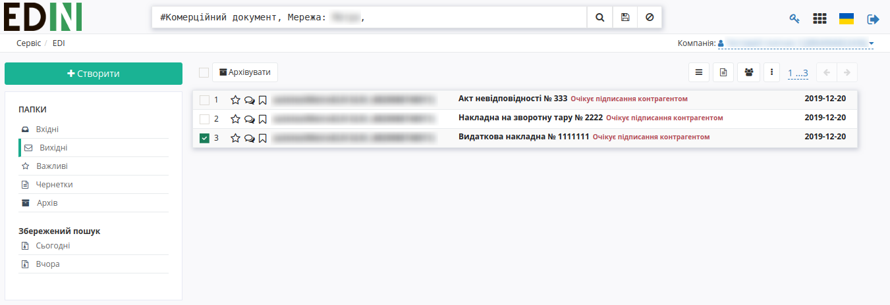
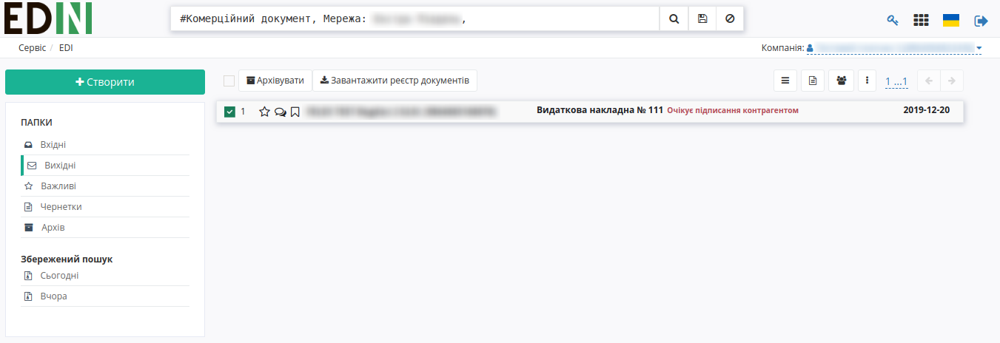
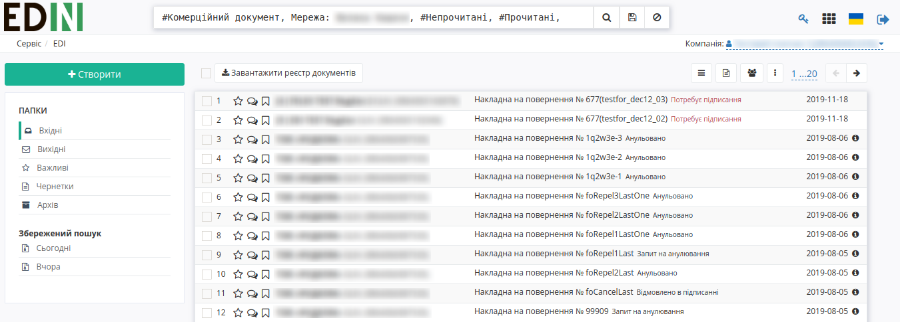
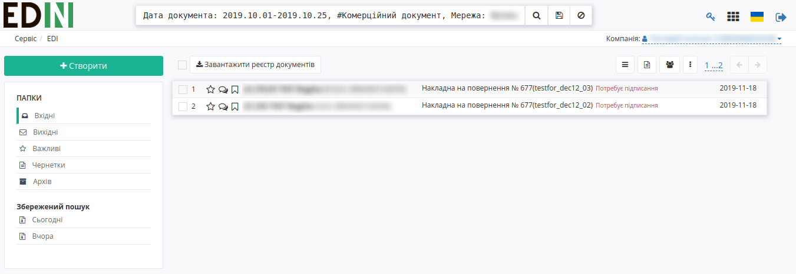

Інструкція по завантаженню реєстру комерційних документів
###################################################################################################

.. role:: red

.. role:: underline

У користувача є можливість завантажити реєстр комерційних документів у вигляді Excel-файлу з папок "Вхідні" або "Вихідні".

Кнопка "Завантажити реєстр документів" з’являється, якщо в журналі документів існують наявні документи, котрі відфільтровані за наступними ключами (послідовність ключів може бути будь-якою):

- за типом документу "Комерційний документ" (:underline:`#Комерційний документ,`)
- за мережею (:underline:`#Мережа: Назва мережі,`)

У скачуваний реєстр зберігаються дані по всіх типах наявних комерційних документів у відповідному розділі ("Вхідні" або "Вихідні") за останній 31 день.

Якщо після фільтрування в журналі документів відображається більше одного документу та користувач відмітив тільки один документ, то кнопка "Завантажити реєстр документів" зникне.

Якщо після фільтрування в журналі документів відображається тільки один документ та користувач відмітив його, то кнопка "Завантажити реєстр документів" залишається.

За замовчуванням у результаті пошуку за типом документу та мережею в розділі "Вхідні" відображаються документи зі статусами ":underline:`#Прочитані,`", ":underline:`#Непрочитані,`", в розділі "Вихідні" – зі статусами ":underline:`#Відправлені,`", ":underline:`#Доставлені,`", ":underline:`#Помилка,`".

Також користувач може ввести всі ці статуси в рядок пошуку – в цьому випадку кнопка "Завантажити реєстр документів" відображається.

Але якщо користувач введе в рядок пошуку не всі можливі статуси для кожного розділу – кнопка "Завантажити реєстр документів" зникне.

Дані в Excel-файлі:

* Название компании-отправителя
* Код ЕГРПОУ компании-отправителя
* Название компании-получателя
* Код ЕГРПОУ компании-получателя
* Номер документа
* Название подтипа коммерческого документа
* Дата документа
* Номер документа-основани
* Дата документа-основания
* Сумма без НДС
* Сумма НДС
* Сумма с НДС	
* Статус подписания

Додатково в рядку пошуку можна вказати дати, за які необхідно отримати реєстр, наприклад, ":underline:`Дата документа: 2019.12.01-2019.12.31,`" (вказаний період не повинен перевищувати 31 день, інакше кнопка не відображається).

Так само є можливість вказату точну дату документу, наприклад, ":underline:`Дата документа: 2019.12.24,`",  в такому випадку в реєстр потрапляють комерційні документи з датами за один вказаний день. Замість дати документа можна використовувати ключи для пошуку – ":underline:`#Вчора,`" або ":underline:`#Сьогодні,`", в такому випадку до реєстру потрапляють комерційні документи з вчорашньою або сьогоднішньою датою документа.

.. include:: kontakti.rst
