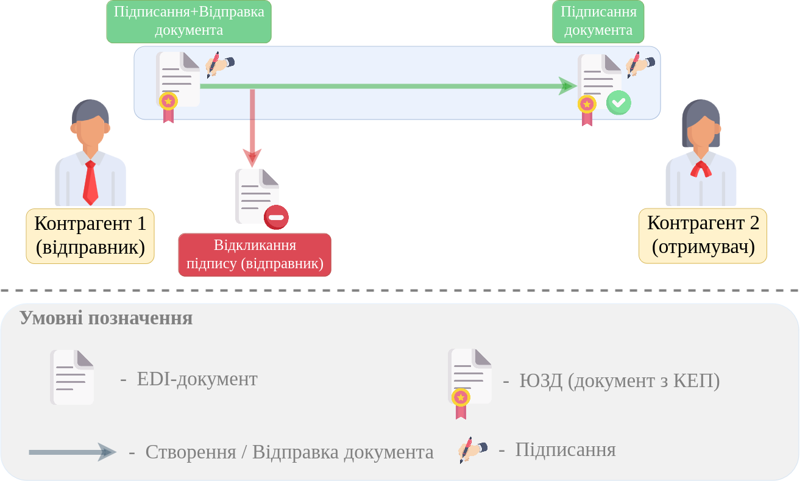
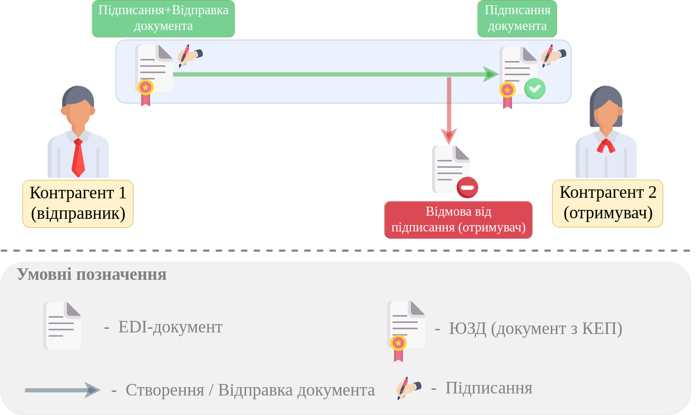
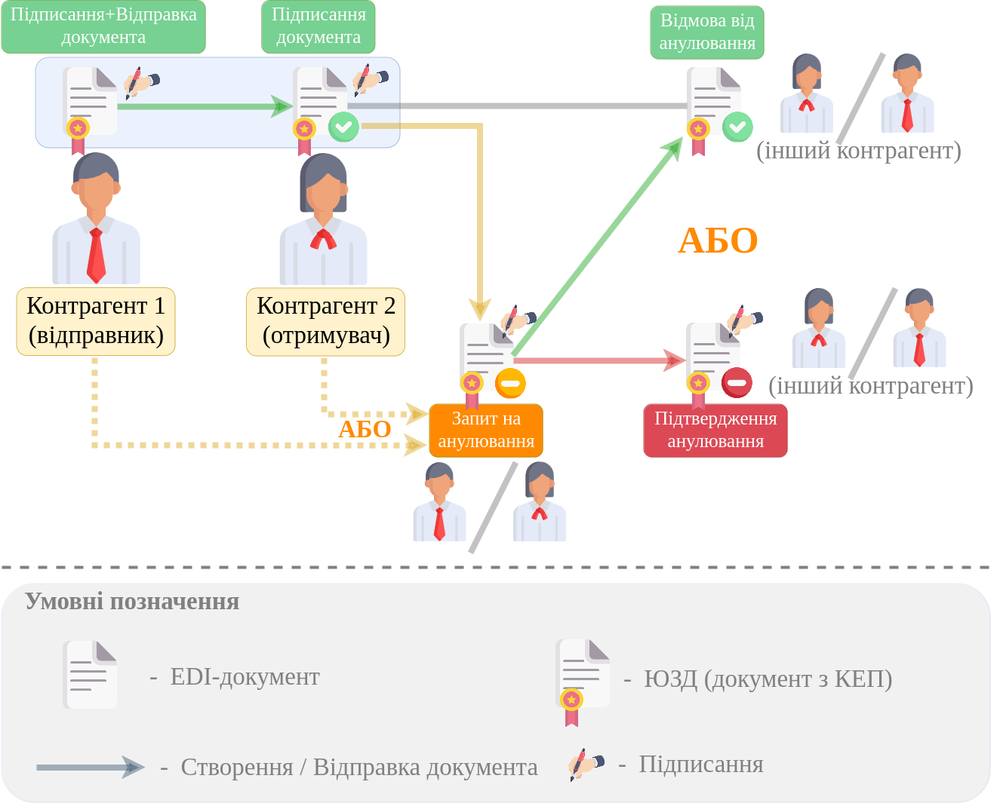

Додаткові дії з ЮЗД
#########################################################

.. role:: red

.. role:: green

.. role:: orange

.. сюди закину трохи картинок для тексту

.. |info| image:: /_constant/comdoc_repeal/comdoc_repeal_004.png

.. |info2| image:: /_constant/icons/info2.png

.. contents:: Зміст:
   :depth: 3

---------

.. _revoke:

1 Відкликання підпису
====================================

Відправлені юридично значущі документи (ЮЗД) можуть бути відкликані Відправником документа, однак у випадку, якщо Отримувач ще не підписав документ. Відкликання використовується при помилковій відправці документа. **"Відкликання підпису"** на web-платформі активується відповідною кнопкою з випадаючого списку **"Додаткові дії"** -> **"Відкликання підпису"** :

.. image:: /_constant/comdoc_revoke/comdoc_revoke_005.png
   :align: center

**"Відкликання підпису"** здійснюється за допомогою КЕП, але спочатку потрібно обрати дату відкликання, ввести текст причини відкликання і **"Перейти до зчитування КЕП"**:

.. image:: /_constant/comdoc_revoke/comdoc_revoke_004.png
   :align: center

Після чого відкриється форма для вибору КЕП для `підписання <https://wiki.edin.ua/uk/latest/general_2_0/LSD_additional_actions.html#sign>`__:

.. image:: /_constant/comdoc_sign.png
   :align: center

Після підписання документ змінює свій статус на :red:`"Підпис відкликано"`, відображається вказана причина, а дія Відкликання підпису також відображається, якщо натиснути кнопку **"Переглянути підписи"**: 

.. image:: /_constant/comdoc_revoke/comdoc_revoke_006.png
   :align: center

Документообіг завершено.

.. _reject:

2 Відмова від підписання
====================================

"Відмова від підписання" юридично значущих документів (ЮЗД) формується у відповідь на **підписаний з однієї сторони** документ в тому випадку, коли документ неправильно оформлений, наприклад, невірно вказані дані в полях документа. 

Для відмови від підписання потрібно натиснути на кнопку **"Відмова від підписання"** з випадаючого списку **"Додаткові дії"**:

.. image:: /_constant/comdoc_reject/comdoc_reject_005.png
   :align: center

Відмова від підписання підтверджується за допомогою КЕП, але спочатку потрібно обрати дату відмови, ввести текст причини відмови і **"Перейти до зчитування КЕП"**:

.. image:: /_constant/comdoc_reject/comdoc_reject_004.png
   :align: center

Після чого відкриється форма для вибору КЕП для `підписання <https://wiki.edin.ua/uk/latest/general_2_0/LSD_additional_actions.html#sign>`__:

.. image:: /_constant/comdoc_sign.png
   :align: center

Після підписання змінюється статус документа на :red:`"Відмовлено в підписанні"`, відображається вказана причина відмови, а дія про відмові від підписання також відображається, якщо натиснути кнопку **"Переглянути підписи"**:

.. image:: /_constant/comdoc_reject/comdoc_reject_006.png
   :align: center

Документообіг завершено.

.. _repeal:

3 Анулювання
====================================

Анулювання здійснюється над **підписаним з обох сторін** документом. Сторона ініціатор анулювання відкриває "Вхідний" або "Вихідний" документ та формує через кнопку **"Запит на анулювання"** з випадаючого списку **"Додаткові дії"**:

.. image:: /_constant/comdoc_repeal/comdoc_repeal_011.png
   :align: center

Запит на анулювання підтверджується КЕП, але спочатку потрібно обрати дати документа та анулювання, обов'язково ввести текст причини анулювання і **"Перейти до зчитування КЕП"**:

.. image:: /_constant/comdoc_repeal/comdoc_repeal_010.png
   :align: center

Після чого відкриється форма для вибору КЕП для `підписання <https://wiki.edin.ua/uk/latest/general_2_0/LSD_additional_actions.html#sign>`__:

.. image:: /_constant/comdoc_sign.png
   :align: center

Після підписання змінюється статус документа на :orange:`"Надіслано запит на анулювання"`, відображається вказана причина анулювання, а дія про надсилання запиту на анулювання також відображається, якщо натиснути кнопку **"Переглянути підписи"**:

.. image:: /_constant/comdoc_repeal/comdoc_repeal_012.png
   :align: center

.. _repeal-accept:

3.1 Підтвердження запиту на анулювання
------------------------------------------------------------------------------------------------------------

Після того, як компанія-ініціатор створила "Запит на анулювання" документ змінює свій статус на :orange:`"Надіслано запит на анулювання"` і в журналі такий документ відмічений інформаційною іконкою |info2|:

.. image:: /_constant/comdoc_repeal/comdoc_repeal_013.png
   :align: center

Для того, щоб "прийняти анулювання" **отримувачу** "запиту на анулювання" потрібно відкрити документ і натиснути **"Підтвердити запит на анулювання"**:

.. image:: /_constant/comdoc_repeal_accept/comdoc_repeal_accept_009.png
   :align: center

Після чого відкриється форма для вибору КЕП для `підписання <https://wiki.edin.ua/uk/latest/general_2_0/LSD_additional_actions.html#sign>`__:

.. image:: /_constant/comdoc_sign.png
   :align: center

Після підписання змінюється статус документа на :red:`"Анульовано"`, якщо натиснути кнопку **"Переглянути підписи"**, то там відображається весь список дій, що потребували підписання:

.. image:: /_constant/comdoc_repeal_accept/comdoc_repeal_accept_010.png
   :align: center

Документообіг завершено.

.. _repeal-reject:

3.2 Відмова від анулювання
------------------------------------------------------------------------------------------------------------

Після того, як компанія-ініціатор створила "Запит на анулювання" документ змінює свій статус на :orange:`"Надіслано запит на анулювання"` і в журналі такий документ відмічений інформаційною іконкою |info2|:

.. image:: /_constant/comdoc_repeal/comdoc_repeal_013.png
   :align: center

Для того, щоб "відхилити анулювання" **отримувачу** "запиту на анулювання" потрібно відкрити документ і в **"Додаткові дії"** натиснути **"Відхилити запит на анулювання"**:

.. image:: /_constant/comdoc_repeal_reject/comdoc_repeal_reject_005.png
   :align: center

Для здійснення "Відмови від анулювання" обов'язково потрібно вказати причину відмови (процес не потребує підписання) та **"Відправити"**:

.. image:: /_constant/comdoc_repeal_reject/comdoc_repeal_reject_002.png
   :align: center

Після чого документ змінює свій статус на :green:`"Підписано двома сторонами"`, відображається останній актуальний коментар: 

.. image:: /_constant/comdoc_repeal_reject/comdoc_repeal_reject_006.png
   :align: center

Кількість "запитів на анулювання" та "відмов від анулювання" не обмежується.

------------------------------------------------------

.. _sign:

Підписання на платформі EDIN 2.0
=========================================================================================================================

.. tabs::

   .. tab:: Файловий ключ

      .. include:: /_constant/signing/signing.rst
         :start-after: .. початок блоку для Signing
         :end-before: .. кінець блоку для Signing

   .. tab:: Token

      .. include:: /_constant/token_signing/token_signing.rst
         :start-after: .. початок блоку для TokenSign
         :end-before: .. кінець блоку для TokenSign

   .. tab:: Гряда

      .. include:: /_constant/gryada_signing/gryada_signing.rst
         :start-after: .. початок блоку для GryadaSign
         :end-before: .. кінець блоку для GryadaSign

   .. tab:: Cloud

      .. include:: /_constant/cloud_signing/cloud_signing.rst
         :start-after: .. початок блоку для CloudSign
         :end-before: .. кінець блоку для CloudSign

------------------------------------------------------

.. include:: /_constant/kontakti.rst

