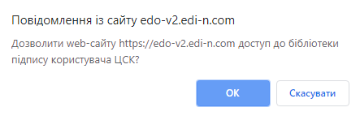
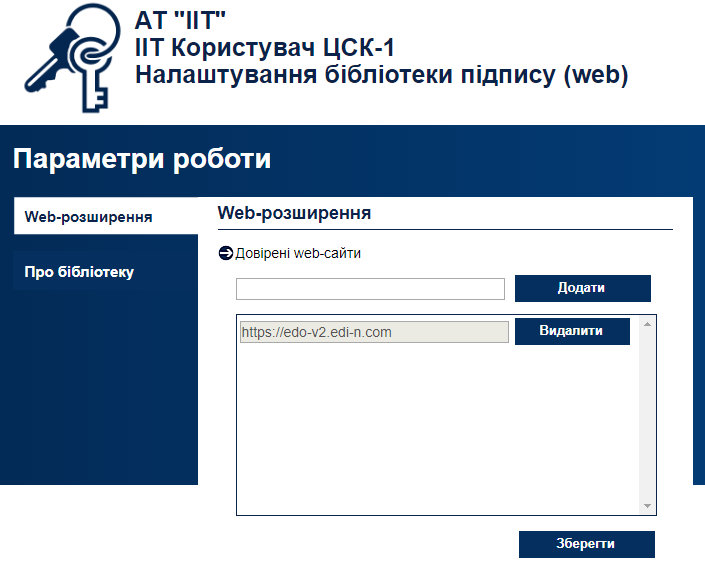
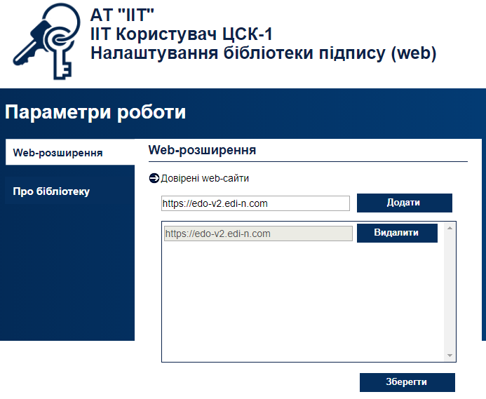
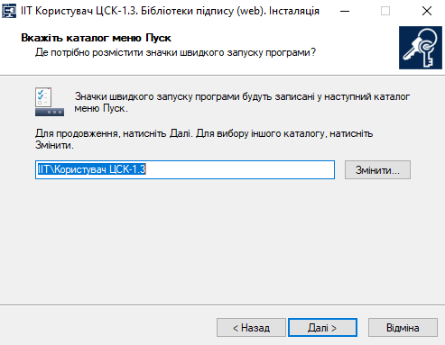
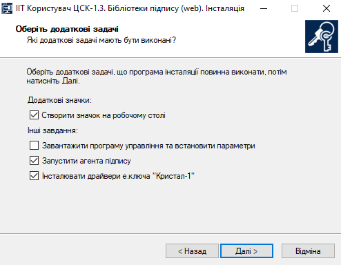
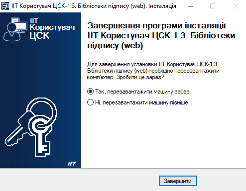
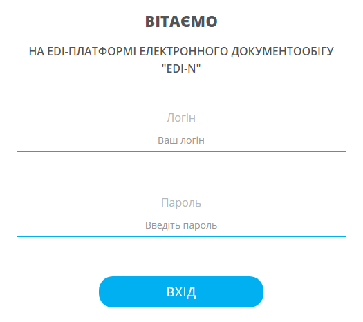
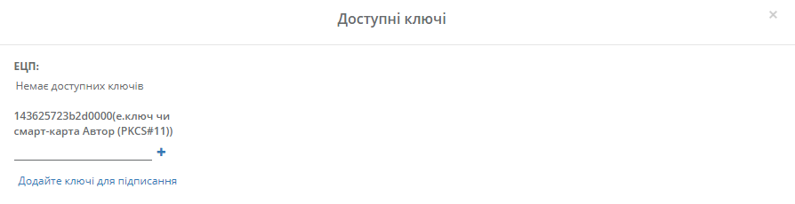
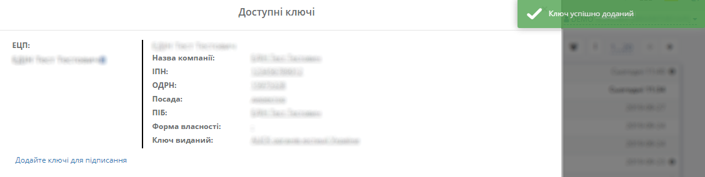

Робота з токеном
###################################################################################################

.. contents:: Зміст:
   :depth: 3

---------

Для успішної роботи з токеном Вам потрібно встановити додаткове програме забезпечення: розширення "ІІТ Користувач ЦСК-1. Бібліотека підпису (web-р.)" для браузера та web-бібліотеку підпису користувача ЦСК.

**1 Встановлення розширення "ІІТ Користувач ЦСК-1. Бібліотека підпису (web-р.)**
==========================================================================================

Оберіть встановлений браузер:

Для браузера Google Chrome — https://chrome.google.com/webstore/detail/%D1%96%D1%96%D1%82-%D0%BA%D0%BE%D1%80%D0%B8%D1%81%D1%82%D1%83%D0%B2%D0%B0%D1%87-%D1%86%D1%81%D0%BA-1-%D0%B1%D1%96%D0%B1%D0%BB/jffafkigfgmjafhpkoibhfefeaebmccg?hl=uk 

Для браузера Opera — https://addons.opera.com/uk/extensions/details/iit-end-user-ca-1-sign-webextension/?display=uk 

Для браузера Mozilla Firefox — https://eu.iit.com.ua/download/productfiles/eusw@iit.com.ua.xp 

Розглянемо процес встановлення розширення для браузера Google Chrome:

a) Відкрийте браузер Google Chrome та пошукову систему Google

b) `Перейдіть за посиланням <https://chrome.google.com/webstore/detail/%D1%96%D1%96%D1%82-%D0%BA%D0%BE%D1%80%D0%B8%D1%81%D1%82%D1%83%D0%B2%D0%B0%D1%87-%D1%86%D1%81%D0%BA-1-%D0%B1%D1%96%D0%B1%D0%BB/jffafkigfgmjafhpkoibhfefeaebmccg?hl=uk>`__

Відкриється посилання:

.. image:: pics_Robota_z_tokenom/Robota_z_tokenom_01.png
   :align: center

c) Натисніть кнопку **"Додати в Chrome"**, а потім — **"Додати розширення"**

.. image:: pics_Robota_z_tokenom/Robota_z_tokenom_02.png
   :align: center

Розширення додане:

.. image:: pics_Robota_z_tokenom/Robota_z_tokenom_03.png
   :align: center

**2 Робота з розширенням "ІІТ Користувач ЦСК-1. Бібліотека підпису (web-р.)**
==========================================================================================

Є два способи додавання довіреного сайту до web-розширення:

**2.1 Додавання довіреного сайту через платформу EDI-N**
-----------------------------------------------------------

a) Зайдіть на платформу EDI-N

.. image:: pics_Robota_z_tokenom/Robota_z_tokenom_04.png
   :align: center

b) Зчитайте ключі у вкладці **"Ключі"** :

.. image:: pics_Robota_z_tokenom/Robota_z_tokenom_005.png
   :align: center

c) При першій ініціалізації бібліотеки підписання підтвердіть дозвіл web-сайту до бібліотеки підпису користувача ЦСК, натисніть — "OK"

.. image:: pics_Robota_z_tokenom/Robota_z_tokenom_006.png
   :align: center

d) Зайдіть у web-розширення для перевірки додавання довіреного сайту

**2.2 Додавання довіреного сайту через web-розширення**
-----------------------------------------------------------

a) Зайдіть у web-розширення, додайте довірений сайт та натисніть кнопку **"Додати"**

.. image:: pics_Robota_z_tokenom/Robota_z_tokenom_09.png
   :align: center

Сайт додано:

**3 Встановлення web-бібліотеки підпису користувача ЦСК**
==========================================================================================

a) Перейдіть за посиланням для скачування інсталяційного файлу:

* для операційної системи Microsoft Windows — https://iit.com.ua/download/productfiles/EUSignWebInstall.exe 
* для операційної системи Apple MAC OS X — https://iit.com.ua/download/productfiles/EUSignWebInstall.pkg
* для операційної системи Linux Debian/Ubuntu (32-bit) — https://iit.com.ua/download/productfiles/euswi.deb
* для операційної системи Linux Debian/Ubuntu (64-bit) — https://iit.com.ua/download/productfiles/euswi.64.deb

Розглянемо процес інсталювання на прикладі ОС Microsoft Windows:

b) Для інсталяції програми запустіть програму інсталяції (майстер інсталяції) **EUSignWebInstall.exe** з інсталяційного носія (оптичного диску чи ін.)

c) Після запуску програми інсталяції на першій сторінці виводиться інформація про початок інсталяції. Для продовження інсталяції необхідно натиснути кнопку "Далі", а для завершення — "Відміна". Натисніть — "Далі"

.. image:: pics_Robota_z_tokenom/Robota_z_tokenom_11.png
   :align: center

d) На наступній сторінці майстра необхідно ознайомитись з ліцензійною угодою щодо використання програми та погодитись. Для продовження інсталяції встановіть позначку "Я приймаю цю угоду" та натисніть — "Далі"

.. image:: pics_Robota_z_tokenom/Robota_z_tokenom_12.png
   :align: center

e) На наступній сторінці майстра за необхідністю можна вказати каталог на диску до якого буде встановлено програму. Для продовження інсталяції натисніть — "Далі"

.. image:: pics_Robota_z_tokenom/Robota_z_tokenom_13.png
   :align: center

f) На наступній сторінці майстра за необхідністю можна вказати розділ меню "Пуск" до якого
буде встановлено значки запуску та деінсталяції програми. Для продовження інсталяції  натисніть — "Далі"

g) На наступній сторінці майстра потрібно встановити признаки необхідності виконання майстром додаткових завдань — створення значку запуску програми на робочому столі. Для продовження інсталяції натисніть — "Далі"

Йде інсталяція:

.. image:: pics_Robota_z_tokenom/Robota_z_tokenom_16.png
   :align: center

i) Для завершення програми інсталяції натисніть "Завершити"

**4 Робота з токеном на web-платформі EDI-N**
===========================================================

a) Вставте токен у USB порт для роботи з необхідним ключом електроного підпису (далі —  КЕП)

b) Зайдіть на платформу EDI-N

c) Зчитайте ключі у вкладці **"Ключі"** :

.. image:: pics_Robota_z_tokenom/Robota_z_tokenom_019.png
   :align: center

d) При першій ініціалізації бібліотеки підписання підтвердіть дозвіл web-сайту до бібліотеки підпису користувача ЦСК, натисніть — "OK"

.. image:: pics_Robota_z_tokenom/Robota_z_tokenom_020.png
   :align: center

.. image:: pics_Robota_z_tokenom/Robota_z_tokenom_21.png
   :align: center

e) Введіть пароль для ініціалізації КЕП

КЕП успішно доданий:

---------------------

.. include:: kontakti.rst

