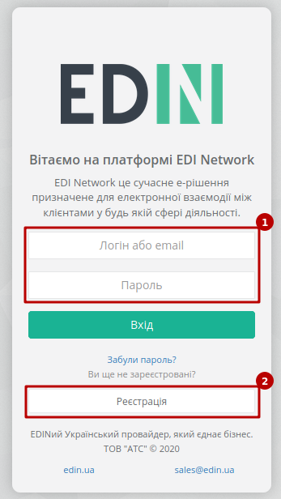
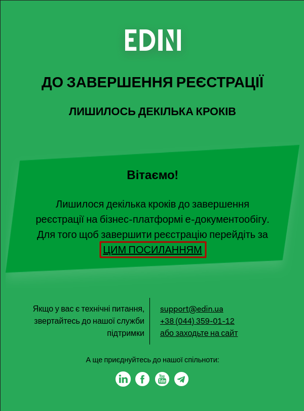
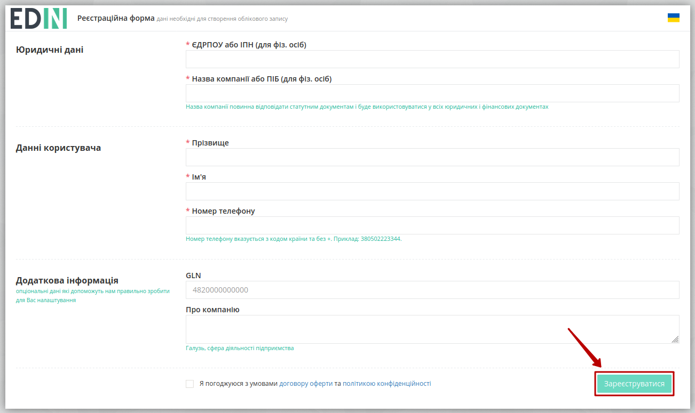
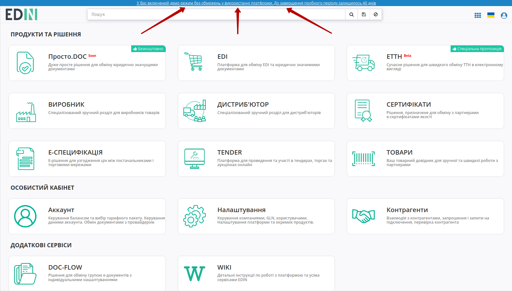

Реєстрація на платформі EDIN 2.0
#############################################################

.. role:: red

.. role:: underline

.. contents:: Зміст:
   :depth: 1

---------

Для початку роботи з платформою **EDIN 2.0** потрібно здійснити авторизований вхід (https://edo-v2.edin.ua/auth). Зареєстровані користувачі для **"Входу"** (1) на платформу використовують логін(email) / пароль, а для нових користувачів, що планують почати використовувати електронний документообіг передбачений функціонал **"Реєстрації"** (2):

**Реєстрація**
================================================

Після натискання кнопки **"Реєстрація"** користувачу потрібно ввести свою електронну пошту та продовжити **"Реєстрацію"**:

.. image:: pics_User_registration/User_registration_09.png
   :align: center

Після чого система проінформує, що відправила листа з унікальним посиланням на раніше вказану адресу:

.. image:: pics_User_registration/User_registration_10.png
   :align: center

При переході за посиланням на пошті відкривається форма введення пароля

.. image:: pics_User_registration/User_registration_12.png
   :align: center

Для завершення реєстрації потрібно заповнити дані компанії, користувача (поля відмічені червоною зірочкою :red:`* - обов'язкові до заповнення`) та натиснути кнопку **"Зареєструватися"**.

.. note::
    Реєстрація можлива лише зі згодою з умовами договору оферти та політикою конфіденційності.

.. hint::
    За потреби дані вже зареєстрованого користувача завжди можливо відредагувати в `"Особистому кабінеті" <https://wiki.edi-n.com/uk/latest/Personal_Cabinet/PCInstruction.html#id4>`__

Вітаємо, Ви успішно пройшли реєстрацію і тепер можете ознайомитись з сервісами та можливостями платформи. Після реєстрації доступний демо режим у використанні платформи на протязі 40 днів, про що інформує підказка в верхній частині екрану (текст підказки є посиланням в `"Особистий кабінет" <https://wiki.edi-n.com/uk/latest/Personal_Cabinet/PCInstruction.html#id5>`__ користувача):

Краще та швидше ознайомитись з основним функціоналом всіх представлених сервісів Вам завжди допоможуть наші `інструкції <https://wiki.edi-n.com>`__

------------------------------

.. include:: kontakti.rst
