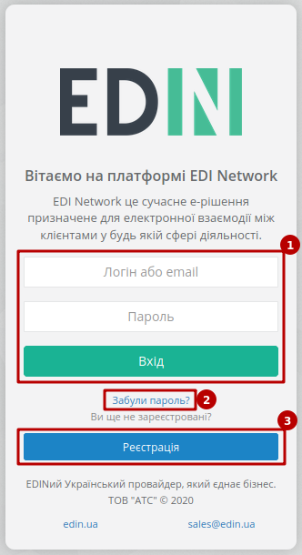
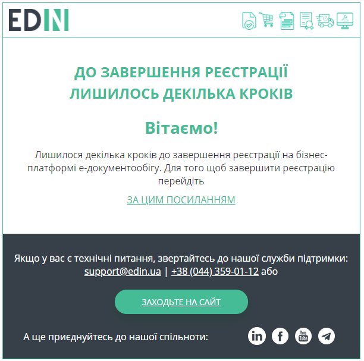
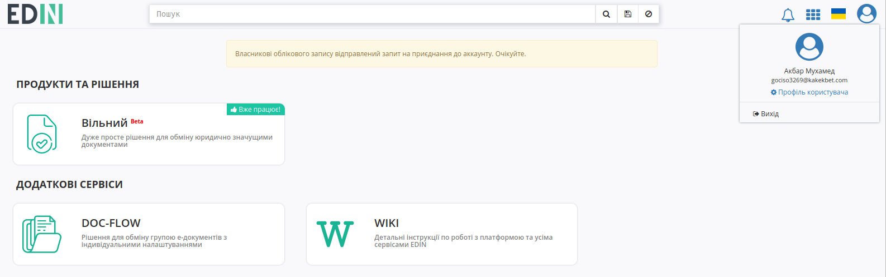
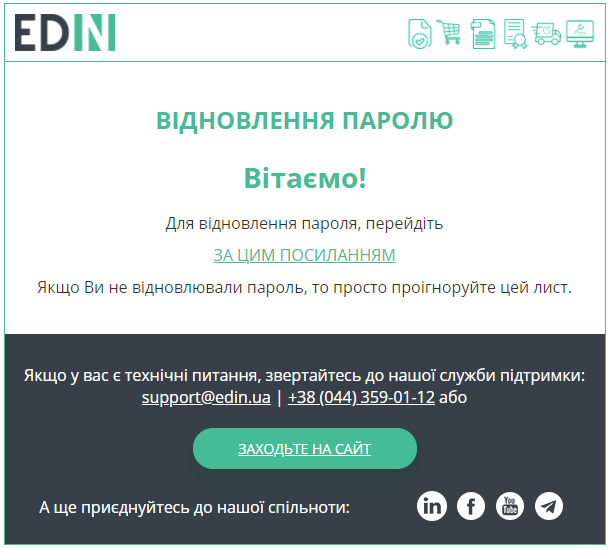

Реєстрація та відновлення пароля на платформі EDIN 2.0
#############################################################

.. role:: red

.. role:: underline

.. contents:: Зміст:
   :depth: 3

---------

Для початку роботи з платформою **EDIN 2.0** потрібно здійснити авторизований вхід (https://edo-v2.edin.ua/auth). Зареєстровані користувачі для **"Входу"** (1) на платформу використовують логін(email) / пароль, а для нових користувачів, що планують почати використовувати електронний документообіг передбачений функціонал **"Реєстрації"** (3):

.. hint::
   Предбачена можливість самостійного відновлення втраченого пароля (кнопка **"Забули пароль?"** (2)).

**1 Реєстрація**
================================================

Після натискання кнопки **"Реєстрація"** користувачу потрібно ввести свою електронну пошту та продовжити **"Реєстрацію"**:

.. image:: pics_User_registration/User_registration_09.png
   :align: center

Після чого система проінформує, що відправила листа з унікальним посиланням на раніше вказану адресу:

.. image:: pics_User_registration/User_registration_10.png
   :align: center

При переході за посиланням на пошті відкривається форма введення пароля

.. image:: pics_User_registration/User_registration_12.png
   :align: center

Для завершення реєстрації потрібно заповнити дані компанії, користувача (поля відмічені червоною зірочкою :red:`* - обов'язкові до заповнення`) та натиснути кнопку **"Зареєструватися"**.

.. image:: pics_User_registration/User_registration_13.png
   :align: center

.. note::
   Реєстрація можлива лише зі згодою з умовами договору оферти та політикою конфіденційності. "Код ознаки джерела податкового номера" визначається автоматично під час реєстрації нового користувача на платформі, орієнтуючись на код ЕДРПОУ та ІПН компанії. Перевірити коректність автоматично заповненого значення можливо в меню `Налаштування – GLN <https://wiki.edin.ua/uk/latest/Personal_Cabinet/PCInstruction.html#gln>`__.

.. _join-request:

**1.1 Формування запиту на приєднання до компанії**
-----------------------------------------------------------------

.. attention::
   Якщо вказаний на етапі реєстрації код ЄДРПОУ чи ІПН вже зареєстрований на платформі, то система повідомляє про формування запиту на приєднання до компанії:

.. image:: pics_User_registration/User_registration_21.png
   :align: center

Після відправки запиту (поки чекаєте рішення від власника аккаунта) можете ознайомитись з доступними сервісами: "DOC-FLOW", "Вільний", "WIKI".

Адміністраторам компанії (`ролі <https://wiki.edin.ua/uk/latest/Personal_Cabinet/PCInstruction.html#user-roles>`__ "Адміністратор" та "Супер адміністратор") відправляється лист на узгодження з посиланням на `форму додавання нового користувача <https://wiki.edin.ua/uk/latest/Personal_Cabinet/PCInstruction.html#join-request-pc>`__:

.. image:: pics_User_registration/User_registration_24.png
   :align: center   

Після **"Додавання"/"Відхилення"** користувачу, що реєструвався на пошту відправляється лист-повідомлення про рішення адміністратора компанії.

--------------------------------------------

.. hint::
   За потреби дані вже зареєстрованого користувача завжди можливо відредагувати в `"Особистому кабінеті" <https://wiki.edin.ua/uk/latest/Personal_Cabinet/PCInstruction.html#id4>`__

Вітаємо, Ви успішно пройшли реєстрацію і тепер можете ознайомитись з сервісами та можливостями платформи. Після реєстрації доступний демо режим у використанні платформи на протязі 30 днів, про що інформує підказка в верхній частині екрану (текст підказки є посиланням в `"Особистий кабінет" <https://wiki.edin.ua/uk/latest/Personal_Cabinet/PCInstruction.html#id5>`__ користувача):

.. image:: pics_User_registration/User_registration_26.png
   :align: center

Краще та швидше ознайомитись з основним функціоналом всіх представлених сервісів Вам завжди допоможуть наші `інструкції <https://wiki.edin.ua>`__

.. _pass-recovery:

**2 Відновлення пароля**
======================================

Для відновлення пароля потрібно натиснути на кнопку **"Забули пароль?"**:

.. image:: pics_User_registration/User_registration_28.png
   :align: center

Далі в вікні ввести свою пошту, скориставшись кнопкою **"Відновити"** (пошта повинна бути зареєстрована на платформі):

.. image:: pics_User_registration/User_registration_19.png
   :align: center

Після чого система проінформує, що відправила листа з унікальним посиланням на раніше вказану адресу:

.. image:: pics_User_registration/User_registration_20.png
   :align: center

На пошту прийде лист з посиланням для переходу на форму введення нового пароля:

Після корректного введення нового пароля одразу можливо здійснювати авторизацію до платформи EDIN 2.0.

------------------------------

.. include:: kontakti.rst
