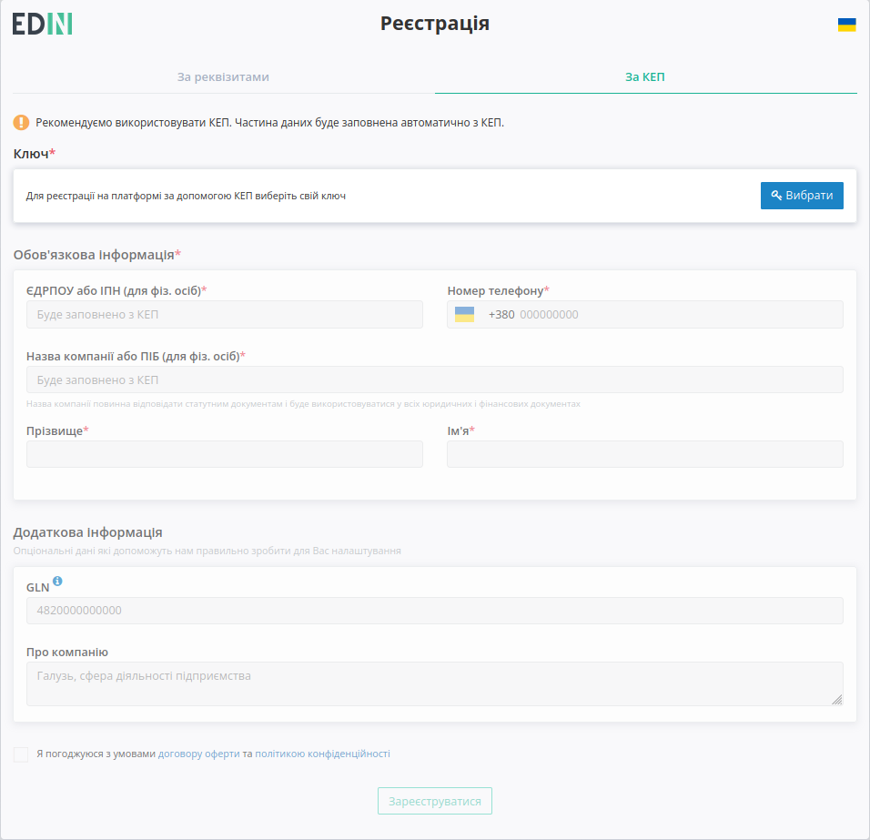
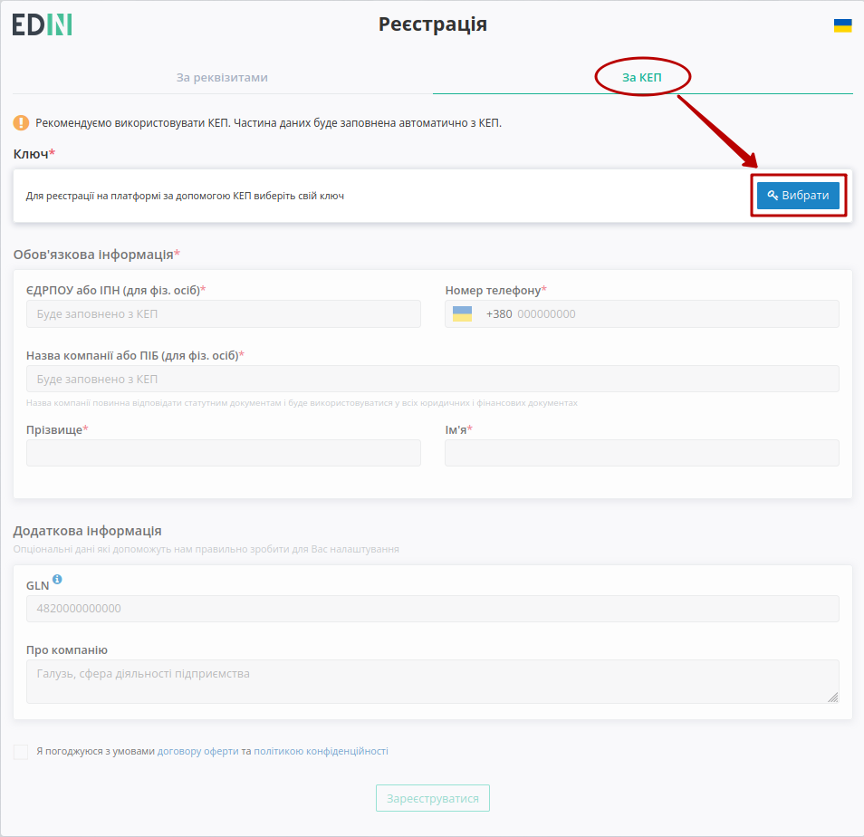

Реєстрація та відновлення пароля на платформі EDIN 2.0
#############################################################

.. сюда закину немного картинок для текста

.. |del_key| image:: /_constant/signing/del_key.png

.. role:: red

.. role:: underline

.. contents:: Зміст:
   :depth: 3

---------

.. raw:: html

   

       <iframe src="https://www.youtube.com/embed/VXlC2CKPJwE" frameborder="0" allowfullscreen style="position: absolute; top: 0; left: 0; width: 100%; height: 100%;"></iframe>
   

---------

Для початку роботи з платформою **EDIN 2.0** потрібно здійснити авторизований вхід (https://edo-v2.edin.ua/auth). Зареєстровані користувачі для **"Входу"** (1) на платформу використовують логін(email) / пароль, а для нових користувачів, що планують почати використовувати електронний документообіг передбачений функціонал **"Реєстрації"** (3):

.. hint::
   Предбачена можливість самостійного відновлення втраченого пароля (кнопка **"Забули пароль?"** (2)).

**1 Реєстрація**
================================================

Після натискання кнопки **"Реєстрація"** користувачу потрібно ввести свою електронну пошту та продовжити **"Реєстрацію"**:

.. image:: pics_User_registration/User_registration_09.png
   :align: center

Після чого система проінформує, що відправила листа з унікальним посиланням на раніше вказану адресу:

.. image:: pics_User_registration/User_registration_10.png
   :align: center

При переході за посиланням на пошті відкривається форма введення пароля

.. image:: pics_User_registration/User_registration_12.png
   :align: center

Після чого відкриється вікно для введення особистих даних, які можливо внести за допомогою кваліфікованого електронного підпису - вкладка **"За КЕП"** (рекомендовано) та вручну - вкладка **"За реквізитами"**.

.. _kep:

**1.1 Реєстрація за КЕП**
-----------------------------------------------------------------

Для того, щоб внести дані за допомогою КЕП потрібно **"Вибрати"** ключ:

Після чого система надасть можливість додати файловий чи апаратний ключ (Token): у модальному вікні потрібно обрати файл чи токен (1), ввести пароль (2) та натиснути **"Зчитати"** (3) ключ для реєстрації:

.. image:: /_constant/signing/file1.png
   :align: center

.. hint::
   **Види файлів електронно-цифрового підпису:**

   Якщо Ви використовуєте ключі від **АЦСК "Україна"**, файли підписів секретних ключів мають розширення **.ZS2** і наступні значення в іменах файлів:

   * Директор «DS»
   * Бухгалтер «BS»
   * Співробітник «SS»
   * Печатка «S»
   * Шифрування «C»
   * Універсальний ключ печатки і шифрування «U»

   Якщо Ви використовуєте ключі від **АЦСК “ПриватБанк”**, файли підписів секрентних ключів мають розширення **.jks**. Якщо Ви використовуєте ключі від будь-яких інших **АЦСК**, файли підписів секрентних ключів мають найменування **Key-6.dat**.

.. image:: /_constant/signing/file2.png
   :align: center

При успішному додаванні ключа автоматично відобразиться особа. У користувача може бути додано кілька ключів - для вибору потрібного для здійснення операції підписання потрібно проставити відмітку лівою кнопкою миші і натиснути **"Підписати"**:

.. image:: /_constant/signing/file3.gif
   :align: center

.. important::
   Якщо підписання цим ключем вже було здійснено або знайдена невідповідність даних ЄДРПОУ/ІПН (перевірка), то підписання блокується, а користувачу виводиться відповідне повідомлення:

.. image:: /_constant/signing/file6.png
   :align: center

Додатково в вікні підписання можливо натиснути **"Детальніше"** для того, щоб переглянути інформацію про підписанта. За допомогою кнопки з іконкою смітничка (|del_key|) можливо видалити помилкові ключі.

Після того, як ключ успішно зчитано на формі реєстрації поля "ЄДРПОУ / ІПН" та "Назва компанії / ПІБ" заповнюються автоматично даними з ключа без можливості їх редагування:

Для завершення реєстрації потрібно заповнити всі обов'язкові поля, що відмічені червоною зірочкою :red:`*` (Прізвище, Ім'я та Номер тедефону) та натиснути кнопку **"Зареєструватися"**:

.. note:: Якщо поле GLN не буде заповнено, то його значення буде створено автоматично.

.. note::
   Реєстрація можлива лише зі згодою з умовами договору оферти та політикою конфіденційності. "Код ознаки джерела податкового номера" визначається автоматично під час реєстрації нового користувача на платформі, орієнтуючись на код ЕДРПОУ та ІПН компанії. Перевірити коректність автоматично заповненого значення можливо в меню `Налаштування – GLN <https://wiki.edin.ua/uk/latest/Personal_Cabinet/PCInstruction.html#gln>`__.

.. _manual:

**1.2 Реєстрація за реквізитами**
-----------------------------------------------------------------

При реєстрації за реквізитами потрібно заповнити всі обов'язкові поля, що відмічені червоною зірочкою :red:`*` (блок "Обов'язкова інформація") та натиснути кнопку **"Зареєструватися"**:

.. note:: Якщо поле GLN не буде заповнено, то його значення буде створено автоматично.

.. note::
   Реєстрація можлива лише зі згодою з умовами договору оферти та політикою конфіденційності. "Код ознаки джерела податкового номера" визначається автоматично під час реєстрації нового користувача на платформі, орієнтуючись на код ЕДРПОУ та ІПН компанії. Перевірити коректність автоматично заповненого значення можливо в меню `Налаштування – GLN <https://wiki.edin.ua/uk/latest/Personal_Cabinet/PCInstruction.html#gln>`__.

.. _join-request:

**1.3 Формування запиту на приєднання до компанії**
-----------------------------------------------------------------

.. attention::
   Якщо вказаний на етапі реєстрації код ЄДРПОУ чи ІПН вже зареєстрований на платформі, то система повідомляє про формування запиту на приєднання до компанії:

.. image:: pics_User_registration/User_registration_21.png
   :align: center

Після відправки запиту (поки чекаєте рішення від власника аккаунта) можете ознайомитись з доступними сервісами: "DOC-FLOW", "Вільний", "WIKI".

.. image:: pics_User_registration/User_registration_22.png
   :align: center   

Адміністраторам компанії (`ролі <https://wiki.edin.ua/uk/latest/Personal_Cabinet/PCInstruction.html#user-roles>`__ "Адміністратор" та "Супер адміністратор") відправляється лист на узгодження з посиланням на `форму додавання нового користувача <https://wiki.edin.ua/uk/latest/Personal_Cabinet/PCInstruction.html#join-request-pc>`__:

.. image:: pics_User_registration/User_registration_24.png
   :align: center   

Після **"Додавання"/"Відхилення"** користувачу, що реєструвався на пошту відправляється лист-повідомлення про рішення адміністратора компанії.

--------------------------------------------

.. hint::
   За потреби дані вже зареєстрованого користувача завжди можливо відредагувати в `"Особистому кабінеті" <https://wiki.edin.ua/uk/latest/Personal_Cabinet/PCInstruction.html#id4>`__

Вітаємо, Ви успішно пройшли реєстрацію і тепер можете ознайомитись з сервісами та можливостями платформи. Після реєстрації доступний демо режим у використанні платформи на протязі 30 днів, про що інформує підказка в верхній частині екрану (текст підказки є посиланням в `"Особистий кабінет" <https://wiki.edin.ua/uk/latest/Personal_Cabinet/PCInstruction.html#id5>`__ користувача):

.. image:: pics_User_registration/User_registration_26.png
   :align: center

Краще та швидше ознайомитись з основним функціоналом всіх представлених сервісів Вам завжди допоможуть наші `інструкції <https://wiki.edin.ua>`__

.. _pass-recovery:

**2 Відновлення пароля**
======================================

Для відновлення пароля потрібно натиснути на кнопку **"Забули пароль?"**:

Далі в вікні ввести свою пошту, скориставшись кнопкою **"Відновити"** (пошта повинна бути зареєстрована на платформі):

.. image:: pics_User_registration/User_registration_19.png
   :align: center

Після чого система проінформує, що відправила листа з унікальним посиланням на раніше вказану адресу:

.. image:: pics_User_registration/User_registration_20.png
   :align: center

На пошту прийде лист з посиланням для переходу на форму введення нового пароля:

.. image:: pics_User_registration/User_registration_16.png
   :align: center

Після корректного введення нового пароля одразу можливо здійснювати авторизацію до платформи EDIN 2.0.

------------------------------

.. include:: kontakti.rst
