Реєстрація та відновлення пароля на платформі EDI Network
##################################################################

.. сюда закину немного картинок для текста

.. |del_key| image:: /_constant/signing/del_key.png

.. role:: red

.. role:: underline

.. contents:: Зміст:
   :depth: 3

---------

.. raw:: html

   

       <iframe src="https://www.youtube.com/embed/VXlC2CKPJwE" frameborder="0" allowfullscreen style="position: absolute; top: 0; left: 0; width: 100%; height: 100%;"></iframe>
   

---------

.. _auth:

**1 Авторизація**
================================================

Для початку роботи з платформою **EDI Network** потрібно здійснити авторизований вхід (https://edo-v2.edin.ua/auth). Вже зареєстрованим користувачам потрібно ввести логін (email) та пароль (встановлюється при `Реєстрації <https://wiki.edin.ua/uk/latest/general_2_0/User_registration.html#register>`__ чи `Відновленні/зміні пароля <https://wiki.edin.ua/uk/latest/general_2_0/User_registration.html#pass-recovery>`__) і натиснути **"Вхід"**:

.. image:: pics_User_registration/User_registration_031.png
   :align: center

.. hint::
   Також, в якості альтернативи, можливо виконати **"Вхід через Google"** за допомогою відповідної кнопки.

.. _register:

**2 Реєстрація**
================================================

Реєстрація користувача - це перший крок до отримання доступу до платформи EDI Network. Для реєстрації на платформі натисніть кнопку "Реєстрація" або перейдіть за посиланням https://edo-v2.edin.ua/register :

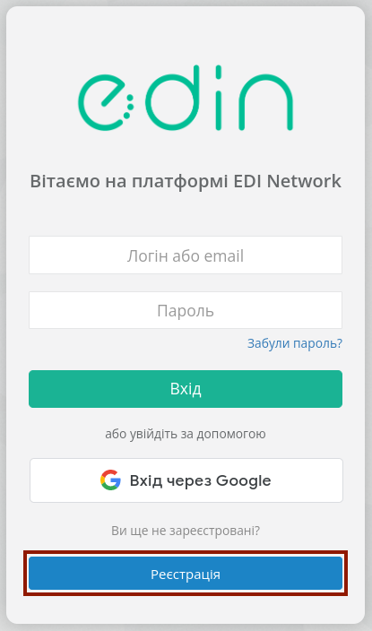

Після натискання кнопки **"Реєстрація"** користувачу потрібно:

* Вказати Email (надалі він буде використовуватися в якості логіну при авторизації на платформі);
* Придумати Пароль (має бути не менше ніж 8 символів) - потребує повторного введення (підтвердження);
* Погодитись з офертою та політикою конфіденційності – встановіть позначку про підтвердження;
* Натиснути кнопку **"Реєстрація"**.

.. image:: pics_User_registration/User_registration_033.png
   :align: center

.. hint::
   Також, в якості альтернативи, можливо **"Зареєстуватися через Google"** за допомогою відповідної кнопки.

Після чого система проінформує, що відправила листа на зазначену адресу:

.. image:: pics_User_registration/User_registration_024.png
   :align: center

Очікуйте на лист - він потрібен для підтвердження email!

.. attention::
   Лист міг потрапити до спаму. Тому перевірте не тільки "Вхідні", але й "Спам". В разі попадання до спаму налаштуйте правила, щоб наступні листи від EDIN не потрапляли до спаму.

Після отримання листа, перейдіть за посиланням (дійсне 72 години) в ньому щоб підтвердити email:

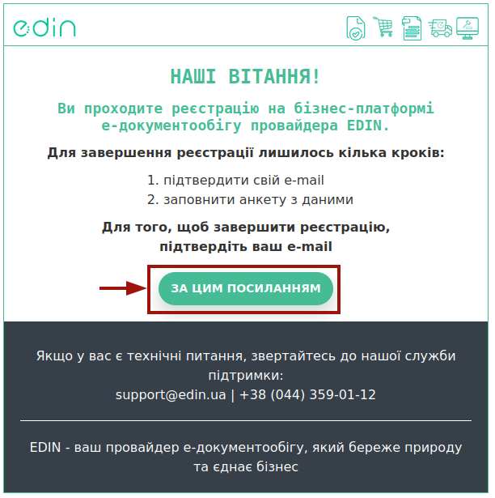

.. note::
   Сервіс з електронного обміну документами **"WhiteDoc"** потребує окремої `реєстрації <https://wiki.edin.ua/uk/latest/WhiteDoc/WD_Instructions/WD_registration.html>`__.

Для доступу до сервісів та `особистого кабінету <https://wiki.edin.ua/uk/latest/Personal_Cabinet/PCInstruction.html>`__ (приватної області) потрібно створити обліковий запис (акаунт). При переході до цих сервісів потрібно ввести особисті дані, покроково заповнивши поля на формі реєстрації:

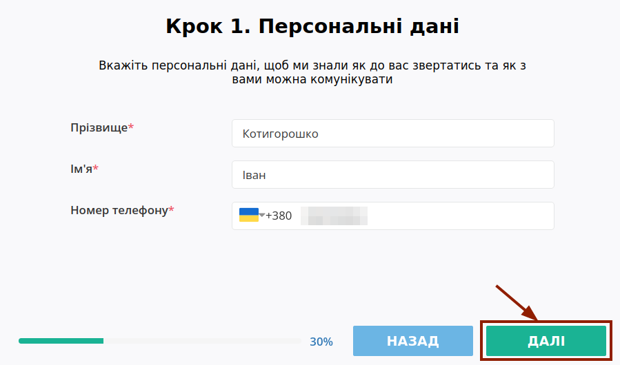

.. note::
   При переході до сервісу **"Вільний"** теж відкривається вище вказане модальне вікно, і зазначеної інформації достатньо для завершення реєстрації в даному сервісі:

   .. image:: pics_User_registration/User_registration_045.png
      :align: center
   
   При переході в інші сервіси для створення облікового запису потрібно пройки ще кілька кроків. Доповнити цією інформацією після реєстрації у "Вільному" можливо натиснувши на кнопку **"Створити обліковий запис"**.

На другому кроці створення облікового запису потрібно обрати країну з випадаючого списку (можливо скористатись зручним пошуком за назвою):

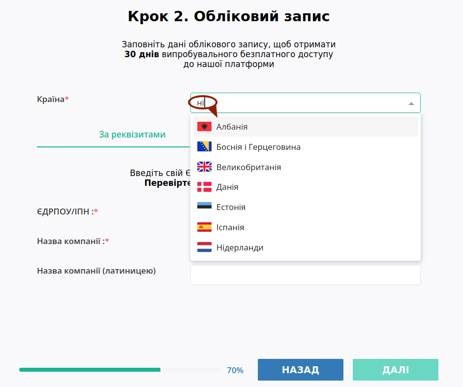

**Країна компанії** – використовується для перевірки коректності введених даних.

Для України Ваші дані можливо внести за допомогою Кваліфікованого Електронного Підпису - вкладка **"За КЕП"** (не доступно для інших країн) та вручну - вкладка **"За реквізитами"**:

.. image:: pics_User_registration/User_registration_012.png
   :align: center

.. _manual:

**2.1 Реєстрація за реквізитами**
-----------------------------------------------------------------

При реєстрації за реквізитами потрібно вказати ЄДРПОУ/ІПН та Назву компанії (обов'язкові поля відмічені червоною зірочкою :red:`*`). При введенні ЄДРПОУ/ІПН відбувається пошук і якщо Ваша компанія є у відкритих джерелах, то Назва компанії заповнюється автоматично:

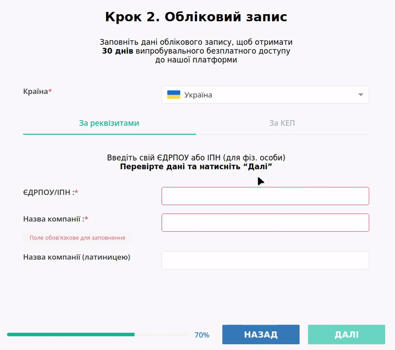

.. початок блоку для QES

.. note::
   Якщо вказаний на етапі реєстрації код ЄДРПОУ чи ІПН вже зареєстрований на платформі **EDI Network**, то Ви можете створити запит на приєднання за допомогою кнопки **"Приєднатися"** (після чого реєстрація завершується) або повернутися **"Назад"**, якщо допустили помилку при заповненні ЄДРПОУ/ІПН:

   .. image:: pics_User_registration/User_registration_038.png
      :align: center

   Поки власник акаунта не підтвердить приєднання, користувач, який проходив реєстрацію не має доступу до сервісів:

   .. image:: pics_User_registration/User_registration_039.png
      :align: center

   Адміністраторам компанії (`ролі <https://wiki.edin.ua/uk/latest/Personal_Cabinet/PCInstruction.html#user-roles>`__ "Адміністратор" та "Супер адміністратор") відправляється лист на узгодження з посиланням на `форму додавання нового користувача <https://wiki.edin.ua/uk/latest/Personal_Cabinet/PCInstruction.html#join-request-pc>`__. Очікуйте на Вашу пошту лист-повідомлення про рішення адміністратора компанії:

   .. image:: pics_User_registration/User_registration_040.png
      :align: center

   .. hint::
      Для зменшення терміну очікування зв‘яжіться з вашим адміністратором або зверніться до технічної підтримки EDIN.

   Після реєстрації доступний демо режим у використанні платформи протягом 30 днів.

Якщо Ваша компанія ще не була зареєстрована, то відкривається третій крок, де потрібно заповнити Індекс/Область/Населений пункт/Адресу (поля теж автоматично заповнюються з відкритих джерел):

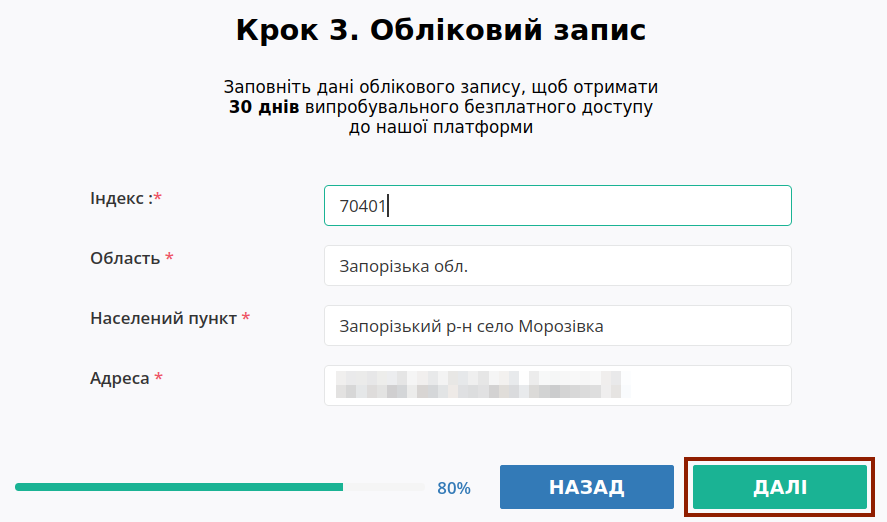

Далі Ви можете заповнити опціональні, однак важливі поля КАТОТТГ (присутній пошук за назвою) та GLN (якщо маєте): 

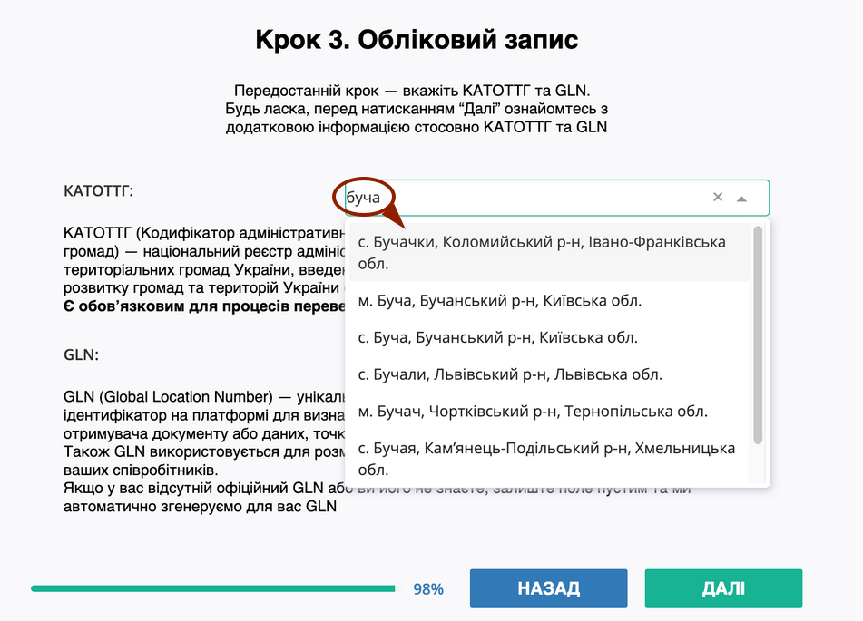

.. note::
   В разі відсутності GLN – поле не заповнюється, GLN буде створено автоматично (переглянути всі GLN можливо у відповідному розділі особистого кабінету: `Налаштування – GLN <https://wiki.edin.ua/uk/latest/Personal_Cabinet/PCInstruction.html#gln-main>`__.

В наступному вікні можете додати кілька слів про Вашу компанію:

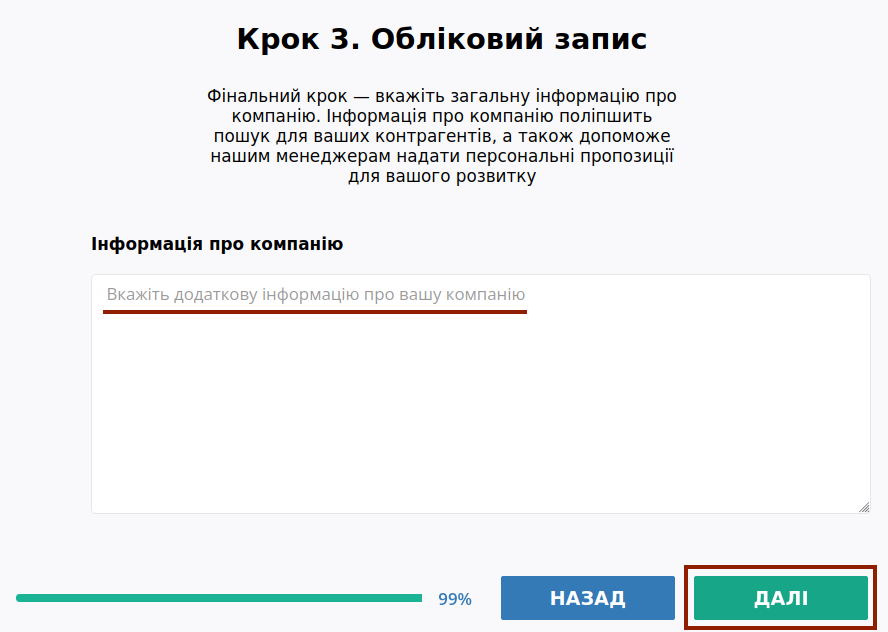

Ознаймившись з вступною інформацією, можете **"Завершити"** реєстрацію:

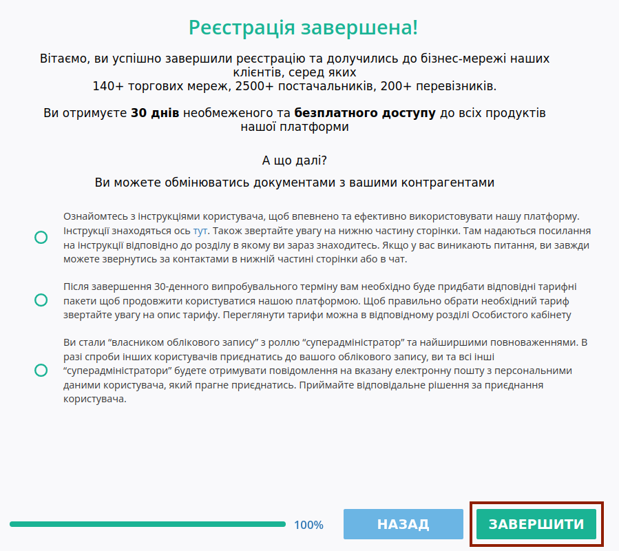

.. note::
   "Код ознаки джерела податкового номера" визначається автоматично під час реєстрації нового користувача на платформі, орієнтуючись на код ЕДРПОУ та ІПН компанії. Перевірити коректність автоматично заповненого значення можливо в налаштуваннях **основного** GLN акаунта (`Налаштування – GLN <https://wiki.edin.ua/uk/latest/Personal_Cabinet/PCInstruction.html#gln-main>`__).

По завершенню реєстрації створюється обліковий запис (акаунт) та надається доступ до платформи **EDI Network** відповідно до `договору оферти <https://wiki.edin.ua/uk/latest/Legal_info/Oferta.html>`__ та `політикою конфіденційності <https://wiki.edin.ua/uk/latest/Legal_info/Politic.html>`__. Користувач, який пройшов реєстрацію, стає власником облікового запису (акаунту) та наділяється максимальними повноваженнями щодо керування обліковим записом (акаунтом).

Після реєстрації доступний демо режим у використанні платформи протягом 30 днів.

.. кінець блоку для QES

.. _kep:

**2.2 Реєстрація за КЕП**
-----------------------------------------------------------------

Для того, щоб внести дані за допомогою КЕП потрібно **"Вибрати"** ключ:

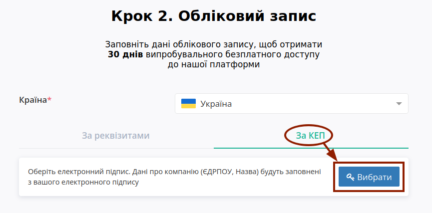

.. tabs::

   .. tab:: Файловий ключ

      .. include:: /_constant/signing/signing.rst
         :start-after: .. початок блоку для Signing
         :end-before: .. кінець блоку для Signing

   .. tab:: Token

      .. include:: /_constant/token_signing/token_signing.rst
         :start-after: .. початок блоку для TokenSign
         :end-before: .. кінець блоку для TokenSign

   .. tab:: Гряда

      .. include:: /_constant/gryada_signing/gryada_signing.rst
         :start-after: .. початок блоку для GryadaSign
         :end-before: .. кінець блоку для GryadaSign

   .. tab:: Cloud

      .. include:: /_constant/cloud_signing/cloud_signing.rst
         :start-after: .. початок блоку для CloudSign
         :end-before: .. кінець блоку для CloudSign

Після того, як ключ успішно зчитано на формі реєстрації поля "ЄДРПОУ / ІПН" та "Назва компанії / ПІБ" заповнюються автоматично даними з ключа без можливості їх редагування:

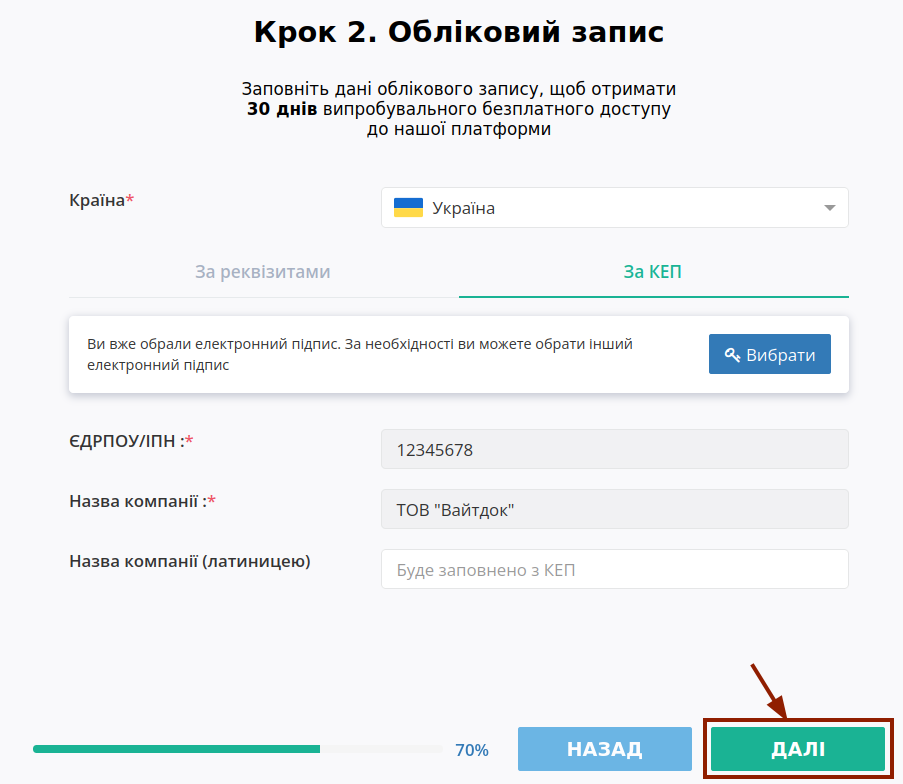

.. include:: /general_2_0/User_registration.rst
   :start-after: .. початок блоку для TokenSign
   :end-before: .. кінець блоку для TokenSign

Для завершення реєстрації потрібно заповнити всі обов'язкові поля, що відмічені червоною зірочкою :red:`*`:

* **Країна компанії** – використовується для перевірки коректності введених даних;
* **Реєстраційний номер компанії або фізичної особи-підприємця** – використовується для подальших розрахунків, створення та перевірки документів;
* **Назва компанії або ФОП** – використовується для відображення в документах;
* **Телефон** – вкажіть контактний телефон компанії, за яким з Вами можливо зв‘язатися для інформування чи вирішення фінансових, комерційних, технічних питань;
* **Прізвище та Ім’я** – вкажіть, як до Вас звертатися.

Додатково на формі можливо вказати свій GLN, якщо він у вас є.

.. note::
   В разі відсутності GLN – поле не заповнюється, GLN буде створено автоматично (переглянути всі GLN можливо у відповідному розділі особистого кабінету: `Налаштування – GLN <https://wiki.edin.ua/uk/latest/Personal_Cabinet/PCInstruction.html#gln-main>`__.

Також на формі можливо вказати додаткову інформацію про компанію (використовується для пошуку вашої компанії іншими клієнтами платформи). Для країн Європи передбачена можливість вказати **Номер EORI** та **Номер платника ПДВ**:

Для завершення реєстрації потрібно натиснути кнопку **"Зареєструватися"**:

.. image:: pics_User_registration/User_registration_015.png
   :align: center

.. note::
   "Код ознаки джерела податкового номера" визначається автоматично під час реєстрації нового користувача на платформі, орієнтуючись на код ЕДРПОУ та ІПН компанії. Перевірити коректність автоматично заповненого значення можливо в налаштуваннях **основного** GLN акаунта (`Налаштування – GLN <https://wiki.edin.ua/uk/latest/Personal_Cabinet/PCInstruction.html#gln-main>`__).

По завершенню реєстрації створюється обліковий запис (акаунт) та надається доступ до платформи **EDI Network** відповідно до `договору оферти <https://wiki.edin.ua/uk/latest/Legal_info/Oferta.html>`__ та `політикою конфіденційності <https://wiki.edin.ua/uk/latest/Legal_info/Politic.html>`__. Користувач, який пройшов реєстрацію, стає власником облікового запису (акаунту) та наділяється максимальними повноваженнями щодо керування обліковим записом (акаунтом).

Після реєстрації доступний демо режим у використанні платформи протягом 30 днів, про що інформує підказка в верхній частині екрану (текст підказки є посиланням в `"Особистий кабінет" <https://wiki.edin.ua/uk/latest/Personal_Cabinet/PCInstruction.html#balans-tariff>`__ користувача):

.. image:: pics_User_registration/User_registration_26.png
   :align: center

.. _pass-recovery:

**3 Відновлення/зміна пароля**
======================================

В разі якщо ви забули свій пароль є можливість його відновити. Для відновлення пароля потрібно натиснути на кнопку **"Забули пароль?"**:

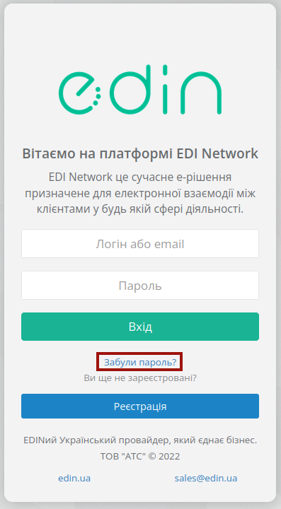

Далі в вікні ввести свою пошту, скориставшись кнопкою **"Відновити"**:

.. important::
   Відновлення пароля можливе тільки для користувачів в яких в якості логіну використовується email. В разі якщо логін відрізняється від email для відновлення пароля прохання звернутися до технічної підтримки!

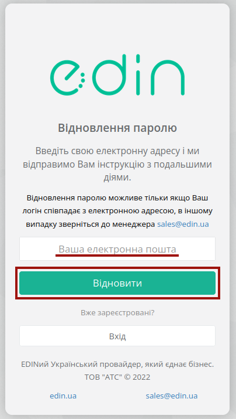

Після чого система проінформує про відправку листа для відновлення пароля на раніше вказану адресу:

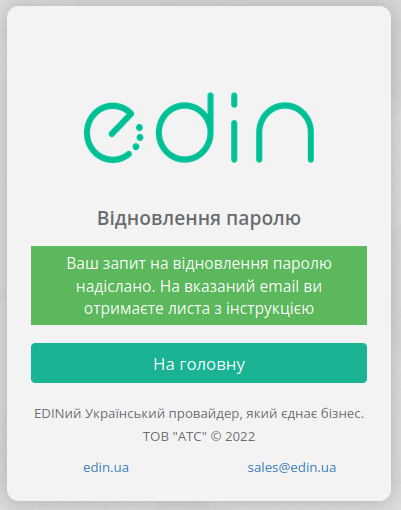

На пошту прийде лист з посиланням для переходу на форму введення нового пароля:

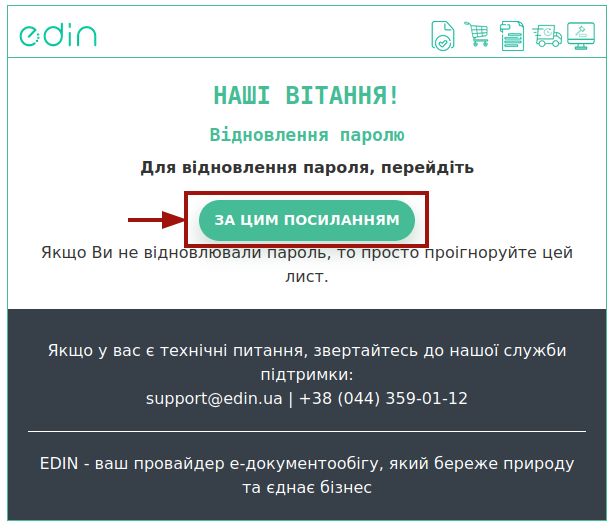

При переході за посиланням вкажіть новий пароль та підтвердіть його:

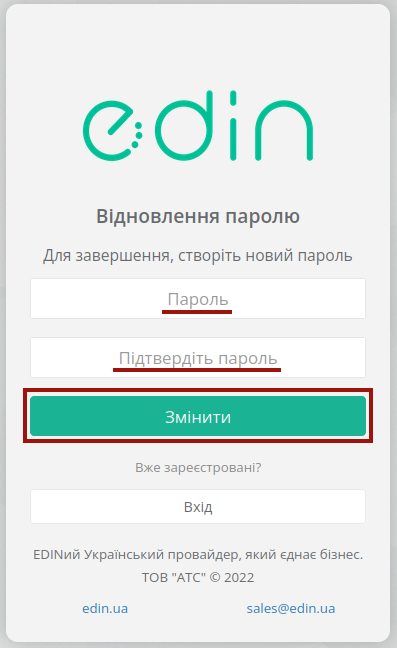

Після введення нового пароля одразу можливо здійснювати авторизацію до платформи **EDI Network**.

------------------------------

.. include:: /_constant/kontakti.rst
