Інструкція по роботі з комерційними документами (додаванню ключів, підписання)
###################################################################################################

.. role:: red

.. contents:: Зміст:
   :depth: 3

---------

**1 Налаштування підпису**
================================================

Для додавання підпису необхідно:

1) Зчитати ключі у вкладці **"Ключі"** :

.. image:: pics_instruktsiyi_po_dodavannyu_klyuchiv/dodavannyu_klyuchiv01.png
   :align: center

.. hint:: Після ініціалізації бібліотеки підписання, система надасть можливість додати ключ для підписання

.. image:: pics_instruktsiyi_po_dodavannyu_klyuchiv/dodavannyu_klyuchiv02.png
   :align: center

.. _`Додати ключ для підписання`:

2) Додати ключ для підписання

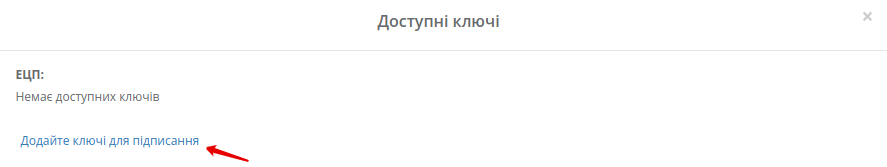

3) Ввести пароль та натиснути — **"Встановити ключ"**

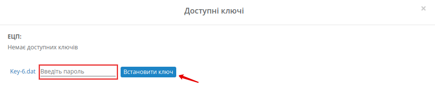

4) Закрити вкладку **"Доступні ключі"**

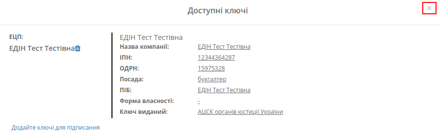

.. hint:: Аналогічно можна додати печатку (за необхідністю)

**2 Створення та відправка комерційного документа**
=========================================================

Створити комерційний документ на web-платформі можливо "з нуля" або на підставі іншого документу:

* Для створення комерційного документу "з нуля" потрібно натиснути кнопку "Створити" та вибрати зі списку комерційний документ, наприклад "Видаткову накладну"

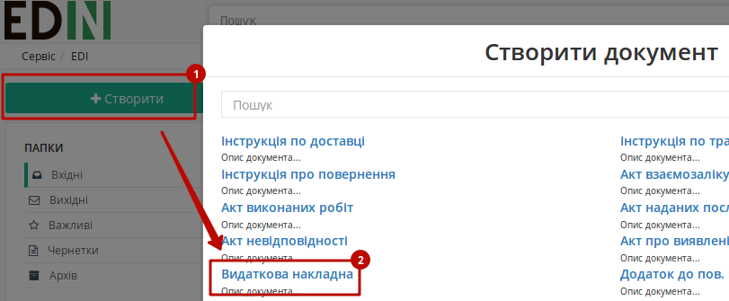

* Для створення комерційного документу на підставі іншого документу потрібно перейти в документ-підставу, при перегляді якого в верхній частині єкрану буде представлений запропонований перелік документів, які можливо створити на основі розглядаємого документу 

.. image:: pics_instruktsiyi_po_dodavannyu_klyuchiv/dodavannyu_klyuchiv025.png
   :align: center

Розглянемо приклад на основі "Видаткової накладної"

1) Для відправки комерційного документа необхідно створити комерційний документ: відкрийте необхідний документ та в доступному списку документів для створення натисніть “Видаткова накладна”:

2) Заповнити всі обовʼязкові поля комерційного документа, які позначені червоною зірочкою :red:`*`, наприклад "Номер документа" є обов'язковим полем:

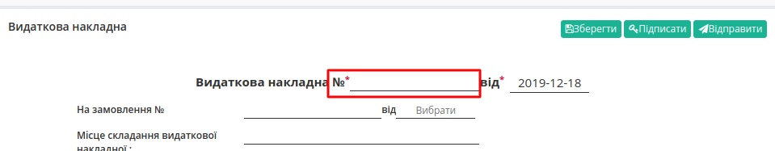
    
3) Обовʼязково **"Зберегти"** необхідний документ (1)
    
4) Натиснути кнопку **"Підписати"** (2)

.. image:: pics_instruktsiyi_po_dodavannyu_klyuchiv/dodavannyu_klyuchiv7.png
   :align: center

    5) Вибрати ключ для підписання та натиснути кнопку **"Підписати"** комерційний документ

.. image:: pics_instruktsiyi_po_dodavannyu_klyuchiv/dodavannyu_klyuchiv08.png
   :align: center

Зʼявиться повідомлення, що документ успішно підписаний

.. image:: pics_instruktsiyi_po_dodavannyu_klyuchiv/dodavannyu_klyuchiv09.png
   :align: center

.. important:: Після підписання комерційного документа, але до відправки, є можливість редагувати сам документ. У разі редагування потрібно будет знов підписати документ

Якщо доступних для зчитування ключів немає, є можливість іх додати після натискання кнопки **"Підписати"** (див. `Додати ключ для підписання`_ )

Для відправки комерційного документа необхідно натиснути кнопку **"Відправити"** в самому документі:

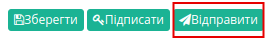

Комерційний документ додається в папку **"Вихідні"**:

.. image:: pics_instruktsiyi_po_dodavannyu_klyuchiv/dodavannyu_klyuchiv023.png
   :align: center

**3 Робота з вхідним комерційним документом**
=========================================================

Підписання
---------------

Одержувачу необхідно:

1) Відкрити папку "Вхідні"

2) Вибрати необхідний документ

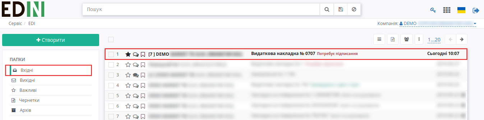

Як ми бачимо, документ потребує підписання (тікет під номером 2 на схемі — "не активний")

3) Натиснути кнопку **"Підписати та відправити у відповідь"**

4) `Додати ключ для підписання`_ (за необхідністю)

5) Вибрати ключ для підписання та натиснути кнопку **"Підписати"** комерційний документ

.. important:: Після натискання кнопки **"Підписати та відправити у відповідь"** комерційний документ відразу відправляється одержувачу без можливості редагування документа

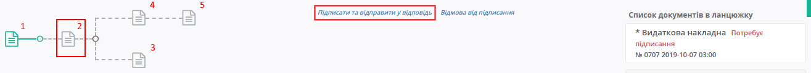

Після відправки тікет під номером 2 на схемі стане "активним"

.. image:: pics_instruktsiyi_po_dodavannyu_klyuchiv/dodavannyu_klyuchiv013.png
   :align: center

Також платформа має спеціальні можливості при роботі з комерційними документами: відмова від підписання, запит на аналювання підписаного комерційного документа, підтвердження запиту на анулювання підписаного комерційного документа.

Відмова
---------------

Для відмови від підписання комерційного документа необхідно:

1) Відкрити папку "Вхідні"

2) Вибрати необхідний документ

3) Натиснути — **"Відмова від підписання"**

.. image:: pics_instruktsiyi_po_dodavannyu_klyuchiv/dodavannyu_klyuchiv014.png
   :align: center

4) `Додати ключ для підписання`_ (за необхідністю)

    5) Ввести текст відмови, вибрати необхідний ключ та натиснути — **"Підписати"**

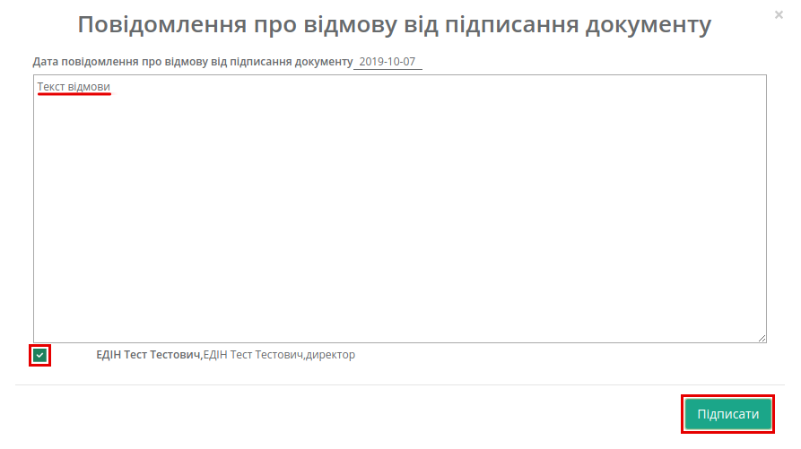

Після підписання тікет під номером 3 на схемі стане "активним"

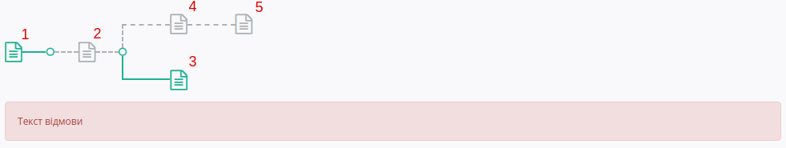

.. important:: Після відмови від підписання комерційний документ відразу відправляється одержувачу без можливості редагування підпису

Анулювання
---------------

.. important:: Для подачі запиту на анулювання комерційний документ повинен бути підписаний (тікет під номером 2 на схемі — "активний")

.. image:: pics_instruktsiyi_po_dodavannyu_klyuchiv/dodavannyu_klyuchiv017.png
   :align: center

Для подачі запиту на анулювання підписаного комерційного документа необхідно:

1) Відкрити папку **"Вхідні"** або **"Вихідні"**

2) Вибрати необхідний документ

3) Натиснути — **"Запит на анулювання"**

4) `Додати ключ для підписання`_ (за необхідністю)

    5) Ввести текст анулювання, вибрати необхідний ключ та натиснути — **"Підписати"**

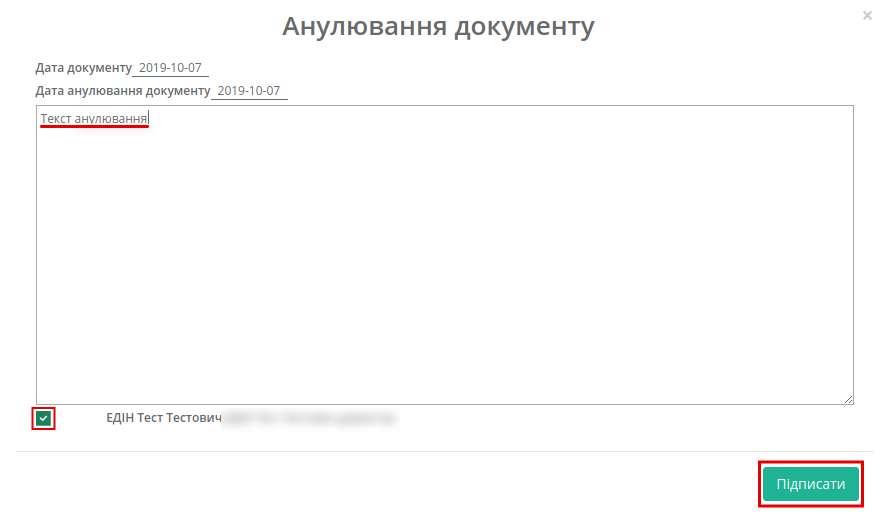

Після підписання тікет під номером 4 на схемі стане "активним"

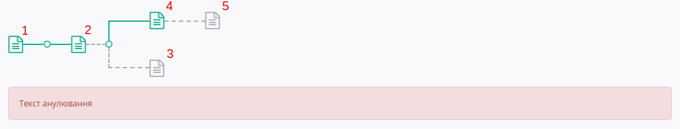

Підтвердження
---------------

.. important:: Для підтвердження запиту на анулювання комерційного документа тікет під номером 4 на схемі повинен бути "активний"

Для підтвердження запиту на анулювання підписаного комерційного документа необхідно:

1) Натиснути — **"Підтвердження запита на анулювання"**

.. image:: pics_instruktsiyi_po_dodavannyu_klyuchiv/dodavannyu_klyuchiv020.png
   :align: center

2) `Додати ключ для підписання`_ (за необхідністю)

3) Вибрати необхідний ключ та натиснути — **"Підписати"**

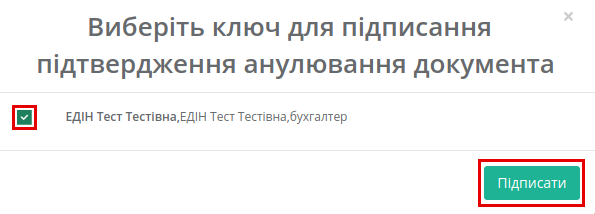

Зʼявиться підтвердження запиту на анулювання та тікет під номером 5 на схемі стане "активним":

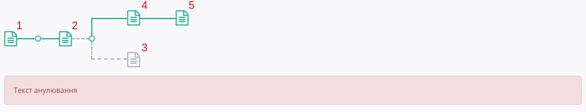

.. include:: kontakti.rst
