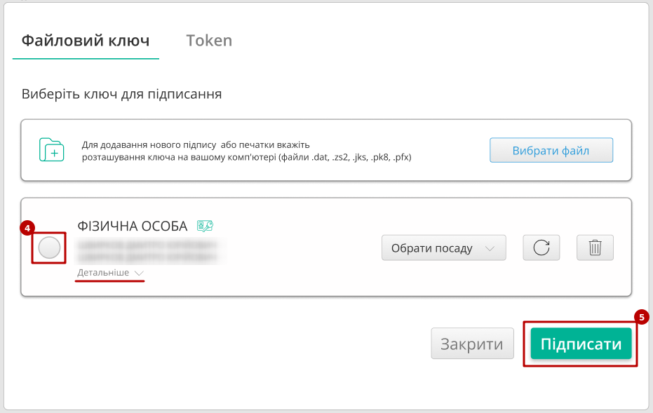
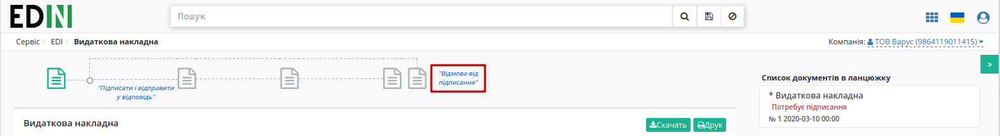
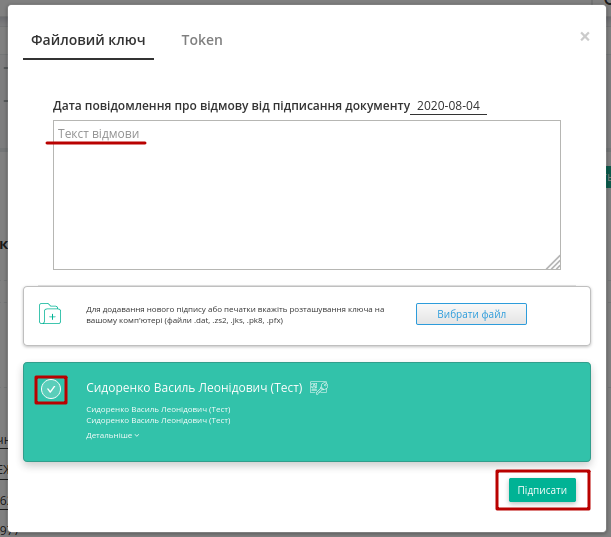
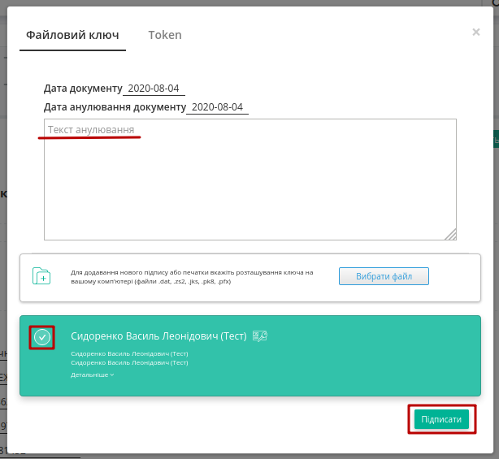
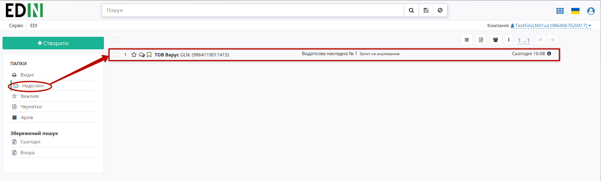
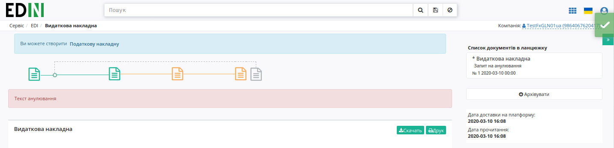

Інструкція по роботі з комерційними документами (налаштування підписання)
###################################################################################################

.. сюда закину немного картинок для текста

.. |drop_pass| image:: pics_instruktsiyi_po_dodavannyu_klyuchiv/drop_pass.png

.. |del_key| image:: pics_instruktsiyi_po_dodavannyu_klyuchiv/del_key.png

.. role:: red

.. role:: underline

.. contents:: Зміст:
   :depth: 3

---------

Для налаштування підпису окремої процедури проводити не потрібно. Усі налаштування та додавання файлового ключа здійснюються при :underline:`першому` підписанні.

**1 Створення та відправка комерційного документа**
=========================================================

Розглянемо приклад створення комерційного документу на web-платформі (його можливо створити "з нуля" або на підставі іншого документу):

* Для створення комерційного документу "з нуля" потрібно натиснути кнопку "Створити" та вибрати зі списку комерційний документ, наприклад "Видаткову накладну"

.. image:: pics_instruktsiyi_po_dodavannyu_klyuchiv/dodavannyu_klyuchiv024.png
   :align: center

* Для створення комерційного документу на підставі іншого документу потрібно перейти в документ-підставу, при перегляді якого в верхній частині єкрану буде представлений запропонований перелік документів, які можливо створити на основі розглядаємого документу 

.. image:: pics_instruktsiyi_po_dodavannyu_klyuchiv/dodavannyu_klyuchiv025.png
   :align: center

Розглянемо приклад на основі "Видаткової накладної"

1) Для відправки комерційного документа необхідно створити комерційний документ: відкрийте необхідний документ та в доступному списку документів для створення натисніть “Видаткова накладна”:

.. image:: pics_instruktsiyi_po_dodavannyu_klyuchiv/dodavannyu_klyuchiv6.png
   :align: center

2) Заповнити всі обовʼязкові поля комерційного документа, які позначені червоною зірочкою :red:`*`, наприклад "Номер документа" є обов'язковим полем:

.. image:: pics_instruktsiyi_po_dodavannyu_klyuchiv/dodavannyu_klyuchiv026.png
   :align: center
    
3) Обовʼязково **"Зберегти"** необхідний документ
    
4) Натиснути кнопку **"Підписати"**

.. image:: pics_instruktsiyi_po_dodavannyu_klyuchiv/dodavannyu_klyuchiv_07n.png
   :align: center

.. _`Додати ключ для підписання`:

Далі у модальному вікні потрібно обрати файл (1), ввести пароль (2) та натиснути **"Считати"** (3) ключ для підписання:

.. image:: pics_instruktsiyi_po_dodavannyu_klyuchiv/file1.png
   :align: center

.. image:: pics_instruktsiyi_po_dodavannyu_klyuchiv/file2.png
   :align: center

При успішному додаванні ключа автоматично відобразиться особа, від імені якої буде здійснено підписання. У користувача може бути додано кілька ключів - для вибору потрібного для здійснення операції підписання потрібно проставити відмітку (4) лівою кнопкою миші і натиснути "Підписати" (5):

.. important::
   Якщо підписання цим ключем вже було здійснено або ЄДРПОУ/ІПН ключа та документа не співпадають, то такий ключ блокується для вибору для підписання, а користувачу виводиться відповідне повідомлення:

.. image:: pics_instruktsiyi_po_dodavannyu_klyuchiv/wrong_key.png
   :align: center

Додатково в вікні підписання можливо натиснути **"Детальніше"** для того, щоб переглянути інформацію про підписанта, обрати за необхідності посаду, скинути пароль активного ключа (|drop_pass|) чи видалити помилкові (|del_key|).

При подальшій роботі з раніше доданим ключем/-ами потрібно вводити лише пароль для обраного ключа:

.. image:: pics_instruktsiyi_po_dodavannyu_klyuchiv/file4.png
   :align: center

Після підписання документу інформація щодо підписанта відображається в блоці "Дані про підписантів". Для відправки документу необхідно натинути на кнопку "Відправити".

.. image:: pics_instruktsiyi_po_dodavannyu_klyuchiv/dodavannyu_klyuchiv_05n.png
   :align: center

.. image:: pics_instruktsiyi_po_dodavannyu_klyuchiv/dodavannyu_klyuchiv_06n.png
   :align: center

Комерційний документ додається в папку **"Вихідні"**:

.. image:: pics_instruktsiyi_po_dodavannyu_klyuchiv/dodavannyu_klyuchiv023.png
   :align: center

**2 Робота з вхідним комерційним документом**
=========================================================

2.1 Підписання
---------------------

Одержувачу необхідно:

1) Відкрити папку "Вхідні"

2) Вибрати необхідний документ

.. image:: pics_instruktsiyi_po_dodavannyu_klyuchiv/dodavannyu_klyuchiv_11n.png
   :align: center

Вхідний документ потребує підписання (при перегляді документу тікети на схемі — "не активні")

.. image:: pics_instruktsiyi_po_dodavannyu_klyuchiv/dodavannyu_klyuchiv_12n.png
   :align: center

3) Натиснути кнопку **"Підписати і відправити у відповідь"**

4) `Додати ключ для підписання`_ (за необхідністю)

5) Вибрати ключ для підписання та натиснути кнопку **"Підписати"** комерційний документ

.. important:: Після натискання кнопки **"Підписати та відправити у відповідь"** комерційний документ відразу відправляється одержувачу без можливості редагування документа

Після відправки наступний тікет в схемі документообігу стане "активним", користувачу стає доступна функція створення **"Запиту на анулювання"**.  

.. image:: pics_instruktsiyi_po_dodavannyu_klyuchiv/dodavannyu_klyuchiv_13n.png
   :align: center

2.2 Відмова від підписання
---------------------------------

Для відмови від підписання комерційного документа необхідно:

1) Відкрити папку "Вхідні"

2) Вибрати необхідний документ

3) Натиснути — **"Відмова від підписання"**

4) `Додати ключ для підписання`_ (за необхідністю)

5) Ввести текст відмови, вибрати необхідний ключ та натиснути — **"Підписати"**

Після підписання документообіг завершено, про що свідчить червоний колір тікета:

.. image:: pics_instruktsiyi_po_dodavannyu_klyuchiv/dodavannyu_klyuchiv_10n.png
   :align: center

.. important:: Після відмови від підписання комерційний документ відразу відправляється одержувачу без можливості редагування підпису

.. _`Запиту на анулювання`:

2.3 Анулювання
---------------------

Для подачі запиту на анулювання підписаного комерційного документа необхідно:

1) Відкрити папку **"Вхідні"** або **"Вихідні"**

2) Вибрати необхідний документ

.. important:: Для подачі запиту на анулювання комерційний документ повинен бути підписаний (другий тікет в схемі документообігу — "активний")

.. image:: pics_instruktsiyi_po_dodavannyu_klyuchiv/dodavannyu_klyuchiv_13n.png
   :align: center

3) Натиснути — **"Запит на анулювання"**

4) `Додати ключ для підписання`_ (за необхідністю)

5) Ввести текст анулювання, вибрати необхідний ключ та натиснути — **"Підписати"**

Запит на анулювання відправлено, про що свідчить жовтий колір наступного тікета в ланцюжку.

.. image:: pics_instruktsiyi_po_dodavannyu_klyuchiv/dodavannyu_klyuchiv_15n.png
   :align: center

2.4 Підтвердження
---------------------------

.. important::
    Підтвердження запиту на анулювання комерційного документа формується на основі `Запиту на анулювання`_

Для підтвердження запиту на анулювання підписаного комерційного документа необхідно:

1) Відкрити документ у "Надісланих"

2) Натиснути — **"Підтвердження запиту на анулювання"**

.. image:: pics_instruktsiyi_po_dodavannyu_klyuchiv/dodavannyu_klyuchiv_17n.png
   :align: center

3) `Додати ключ для підписання`_ (за необхідністю)

4) Вибрати необхідний ключ та натиснути — **"Підписати"**

Запиту на анулювання підтверджено, документообіг завершено (останній тікет на схемі стане жовтого кольору):

.. include:: kontakti.rst
