Інструкція по додаванню ключів для підписання комерційного документа
###################################################################################################

.. contents:: Зміст:
   :depth: 3

---------

**1 Налаштування підпису**
================================================

Для додавання підпису необхідно:

    1) Зчитати ключі у вкладці **"Ключи"** на боковій панелі

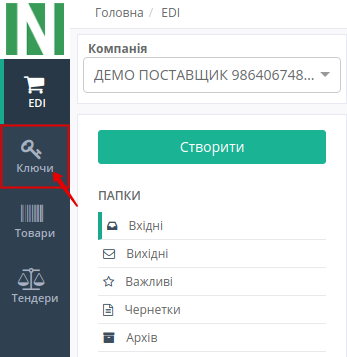

.. hint:: Після ініціалізації бібліотеки підписання, система надасть можливість додати ключ для підписання

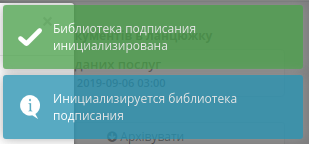

.. _`Додати ключ для підписання`:

    2) Додати ключ для підписання

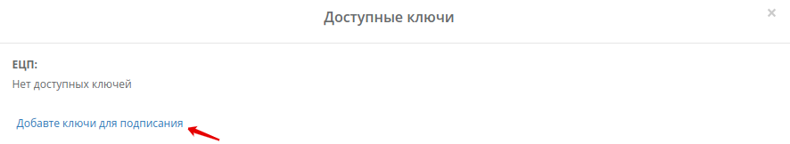

    3) Ввести пароль та натиснути — **"Встановити ключ"**

.. image:: pics_instruktsiyi_po_dodavannyu_klyuchiv/dodavannyu_klyuchiv4.png
   :align: center

    4) Закрити вкладку **"Доступні ключі"**

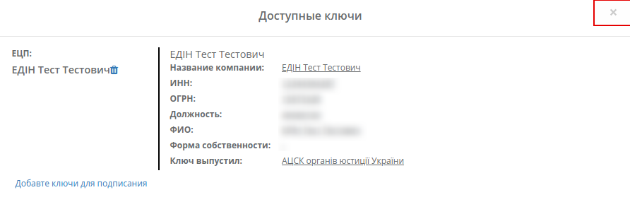

.. hint:: Аналогічно можна додати печатку (за необхідністю)

**2 Створення та відправка комерційного документа**
=========================================================

Для відправки комерційного документа необхідно:

    1) Створити комерційний документ на підставі іншого документа (наприклад, видаткова накладна)

.. image:: pics_instruktsiyi_po_dodavannyu_klyuchiv/dodavannyu_klyuchiv6.png
   :align: center

    2) Заповнити всі обовʼязкові поля комерційного документа, які позначені червоною зірочкою
    
    3) Обовʼязково **"Зберегти"** необхідний документ (1)
    
    4) Натиснути кнопку **"Підписати"** (2)

.. image:: pics_instruktsiyi_po_dodavannyu_klyuchiv/dodavannyu_klyuchiv7.png
   :align: center

    5) Вибрати ключ для підписання та натиснути кнопку **"Підписати"** комерційний документ

.. image:: pics_instruktsiyi_po_dodavannyu_klyuchiv/dodavannyu_klyuchiv8.png
   :align: center

Зʼявиться повідомлення, що документ успішно підписаний

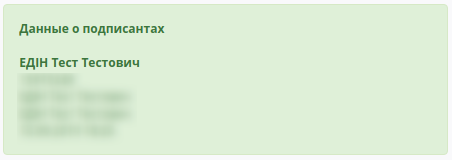

.. important:: Після підписання комерційного документа, але до відправки, є можливість редагувати сам документ. У разі редагування потрібно будет знов підписати документ

Якщо доступних для зчитування ключів немає, є можливість іх додати після натискання кнопки **"Підписати"** (див. `Додати ключ для підписання`_ )

Для відправки комерційного документа необхідно натиснути кнопку **"Відправити"** в самому документі:

.. image:: pics_instruktsiyi_po_dodavannyu_klyuchiv/dodavannyu_klyuchiv10.png
   :align: center

Комерційний документ додається в папку **"Вихідні"**.

**3 Робота з вхідним комерційним документом**
=========================================================

Підписання
---------------

Одержувачу необхідно:

    1) Відкрити папку "Вхідні" (1)

    2) Вибрати необхідний документ (2)

.. image:: pics_instruktsiyi_po_dodavannyu_klyuchiv/dodavannyu_klyuchiv11.png
   :align: center

Як ми бачимо, документ потребує підписання (тікет під номером 2 на схемі — "не активний")

    3) Натиснути кнопку **"Підписати та відправити у відповідь"**

    4) `Додати ключ для підписання`_ (за необхідністю)

    5) Вибрати ключ для підписання та натиснути кнопку **"Підписати"** комерційний документ

.. important:: Після натискання кнопки **"Підписати та відправити у відповідь"** комерційний документ відразу відправляється одержувачу без можливості редагування документа

.. image:: pics_instruktsiyi_po_dodavannyu_klyuchiv/dodavannyu_klyuchiv12.png
   :align: center

Після відправки тікет під номером 2 на схемі стане "активним"

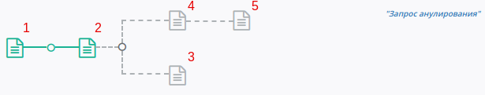

Також платформа має спеціальні можливості при роботі з комерційними документами: відмова від підписання, запит на аналювання підписаного комерційного документа, підтвердження запиту на анулювання підписаного комерційного документа.

Відмова
---------------

Для відмови від підписання комерційного документа необхідно:

    1) Відкрити папку "Вхідні"

    2) Вибрати необхідний документ

    3) Натиснути — **"Відмова від підписання"**

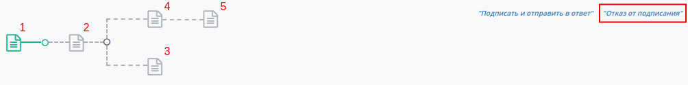

    4) `Додати ключ для підписання`_ (за необхідністю)

    5) Ввести текст відмови, вибрати необхідний ключ та натиснути — **"Підписати"**

.. image:: pics_instruktsiyi_po_dodavannyu_klyuchiv/dodavannyu_klyuchiv15.png
   :align: center

Після підписання тікет під номером 3 на схемі стане "активним"

.. image:: pics_instruktsiyi_po_dodavannyu_klyuchiv/dodavannyu_klyuchiv16.png
   :align: center

.. important:: Після відмови від підписання комерційний документ відразу відправляється одержувачу без можливості редагування підпису

Анулювання
---------------

.. important:: Для подачі запиту на анулювання комерційний документ повинен бути підписаний (тікет під номером 2 на схемі — "активний")

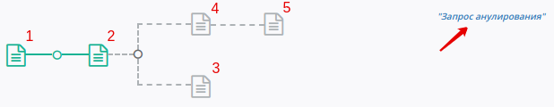

Для подачі запиту на анулювання підписаного комерційного документа необхідно:

    1) Відкрити папку **"Вхідні"** або **"Вихідні"**

    2) Вибрати необхідний документ

    3) Натиснути — **"Запит на анулювання"**

    4) `Додати ключ для підписання`_ (за необхідністю)

    5) Ввести текст анулювання, вибрати необхідний ключ та натиснути — **"Підписати"**

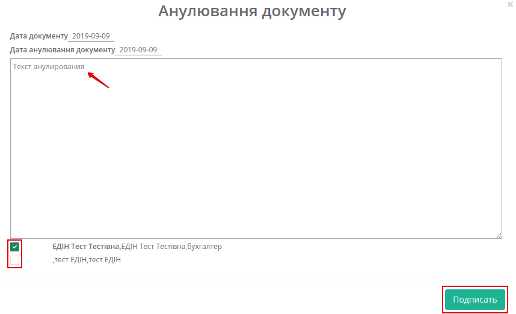

Після підписання тікет під номером 4 на схемі стане "активним"

.. image:: pics_instruktsiyi_po_dodavannyu_klyuchiv/dodavannyu_klyuchiv22.png
   :align: center

Підтвердження
---------------

.. important:: Для підтвердження запиту на анулювання комерційного документа тікет під номером 4 на схемі повинен бути "активний"

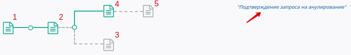

Для підтвердження запиту на анулювання підписаного комерційного документа необхідно:

    1) Натиснути — **"Підтвердження запита на анулювання"**

    2) `Додати ключ для підписання`_ (за необхідністю)

    3) Вибрати необхідний ключ та натиснути — **"Підписати"**

.. image:: pics_instruktsiyi_po_dodavannyu_klyuchiv/dodavannyu_klyuchiv19.png
   :align: center

Зʼявиться підтвердження запиту на анулювання та тікет під номером 5 на схемі стане "активним":

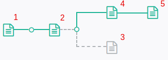

.. include:: kontakti.rst
