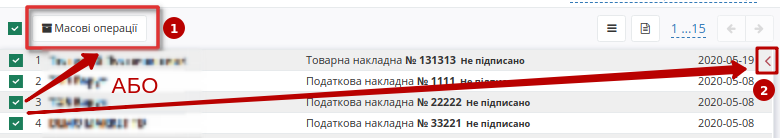
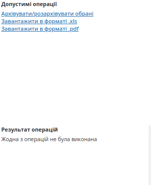
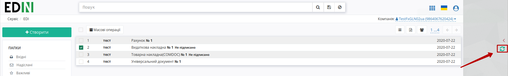
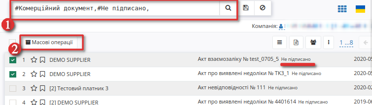
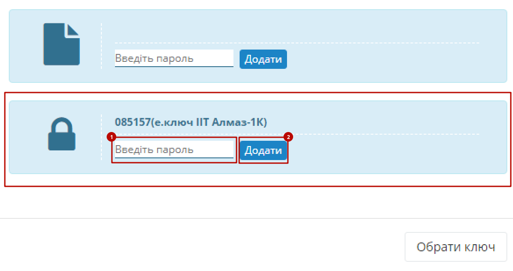
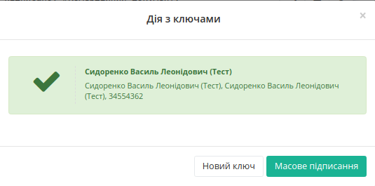
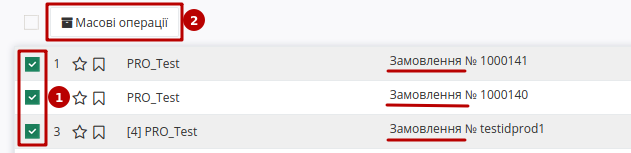
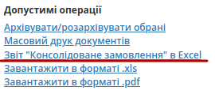

Масові операції з документами
#################################
.. contents:: Зміст:
   :depth: 6

---------

Масові операції
====================================

Для зручної та швидкої роботи з документами на платформі доступне проведення масових операцій з документами. 
Масові операції полегшують та пришвидшують роботу з масивами документів, так як дозволять оброблювати більшу кількість документів відразу, а також працювати з іншими документами паралельно.

.. image:: pics_massovi_operacii/massovi_operacii_z_documentamy_01.png
   :align: center

.. note::
   Масові операції доступні у всіх каталогах (Вхідні, Надіслані, Важливі, Чернетки, Архів) однак список можливостей у цих каталогах відрізняється (детальніше у наступних розділах статті).

**Масові операції:**

* Масове підписання
* Масовий друк документів
* Архівувати/розархівувати обрані
* Завантажити в форматі .xls / .pdf / .p7s (доступність форматів залежить від типу документа)
* Звіт "Консолідоване замовлення" в Excel (для документів "Замовлення" (`ORDER <https://wiki.edi-n.com/uk/latest/XML/XML-structure.html#order>`__))
* Видалити документи

Доступ до Масових операцій можливо отримати двома способами:

**Перший спосіб**: відмітити чекером декілька документів - з'явиться кнопка "Масові операції". Після натискання на кнопку відкриється блок, у якому можливо переглянути можливі операції, та їх виконання.

**Другий спосіб**: відмітити чекером декілька документів та натиснути на кнопку **"<"**, що відкриваэ блок, у якому можливо переглянути можливі операції, та їх виконання.

Блок Масових операцій поділяється на:

- **Допустимі операції** - операції які пропонуються до виконання
- **Результат операцій** - виконані операції над документами

Після вибору та запуску операції, відобразиться інформаційне вікно з повідомленням, що завдання запущенно:

Після завершення завдання у блоці про результат операцій буде вказано назву операцій та список документів, з якими здійснювалися операції. Інформація про завершені операції зберігається одну сессію, тобто після закриття сторінки буде видалена. 

.. attention::
   По завершенню масової операції необхідно обов'язково оновити сторінку вбудованим функціоналом вашого браузера чи через передбачену кнопку оновлення:

Масове підписання
====================================

Функціонал **Масового підписання** доступний у "Вхідних" / "Чернетках".

У "Вхідних" доступне **Масове підписання**:

* Комерційного (універсального) документа (`COMDOC <https://wiki.edi-n.com/uk/latest/XML/XML-structure.html#comdoc>`__)
* Податкової накладної (`DECLAR <https://wiki.edi-n.com/uk/latest/XML/XML-structure.html#declar>`__)
* Коригування до податкової накладної (`DECLARj12 <https://wiki.edi-n.com/uk/latest/XML/XML-structure.html#declarj12>`__)
* Товарної накладної (Метро) (`DOCUMENTINVOICE <https://wiki.edi-n.com/uk/latest/XML/XML-structure.html#documentinvoice>`__)
* Коригування до товарної накладної (Метро) (`DOCCORINVOICE <https://wiki.edi-n.com/uk/latest/XML/XML-structure.html#doccorinvoice>`__)
* Акт наданих послуг (Метро) (`DOCINVOICEACT <https://wiki.edi-n.com/uk/latest/XML/XML-structure.html#docinvoiceact>`__)
* Повідомлення про штрафні санкції (Метро) (`ORDRPT <https://wiki.edi-n.com/uk/latest/XML/XML-structure.html#ordrpt>`__)).

У "Чернетках" доступне **Масове підписання**:

* Видаткової накладної (`COMDOC_006 <https://wiki.edi-n.com/uk/latest/XML/XML-structure.html#comdoc-006>`__)
* Податкової накладної (`DECLAR <https://wiki.edi-n.com/uk/latest/XML/XML-structure.html#declar>`__)
* Коригування до податкової накладної (`DECLARj12 <https://wiki.edi-n.com/uk/latest/XML/XML-structure.html#declarj12>`__)
* Товарної накладної (Метро) (`DOCUMENTINVOICE <https://wiki.edi-n.com/uk/latest/XML/XML-structure.html#documentinvoice>`__)
* Коригування до товарної накладної (Метро) (`DOCCORINVOICE <https://wiki.edi-n.com/uk/latest/XML/XML-structure.html#doccorinvoice>`__)
* Акт наданих послуг (Метро) (`DOCINVOICEACT <https://wiki.edi-n.com/uk/latest/XML/XML-structure.html#docinvoiceact>`__)
* Повідомлення про штрафні санкції (Метро) (`ORDRPT <https://wiki.edi-n.com/uk/latest/XML/XML-structure.html#ordrpt>`__)

Для доступу до операції, відсортуйте документи за Типом документу, а також за статусом - "Не підписано" (1). Виберіть потрібні документи, або відмітьте усі, а потім натисніть на кнопку "Масові операції" (2), щоб перейти до допустимих операції.

Після вибору операції "Масове підписання" ініціалізується бібліотека підписання.

Після ініціалізації бібліотеки підписання, система надасть можливість додати або вибрати збережений ключ ЕЦП для підписання. При першому підписанні необхідно додати файловий ключ. Для цього у модальному вікні потрібно обрати файл (1) і ввести пароль (2):

Виберіть ключ, ведіть пароль для ініціалізації ЕЦП та натисніть **"Додати"**: 

.. image:: pics_Robota_z_tokenom/Robota_z_tokenom_27.png
   :align: center

При успішному додаванні ключа автоматично відобразиться вибрана особа, від імені якої буде здійснено підписання, та стане доступною кнопка **"Масове підписання"**. Натисніть на кнопку для початку операції:

По завершенню підписання, ви зможете переглянути інформацію про перелік документів що були підписані та час їх підписання. 

.. image:: pics_massovi_operacii/massovi_operacii_z_documentamy_07.png
   :align: center

.. important::
   Після **перезавантаження** сторінки вам будуть доступні операціїї для інших документів.

Масовий друк документів
====================================

Функціонал **Масового друку** реалізований у всіх папках окрім "Чернеток".

При виборі одного або декількох документів і натисканні на кнопку "Масові операції", з'являється панель де можна запустити друк.
Після формування друкованих макетів відкривається нове вікно з друкованими макетами. Всі вибрані документи об'єднані в один файл для друку.

.. image:: pics_massovi_operacii/massovi_operacii_z_documentamy_09.png
   :align: center

Звіт "Консолідоване замовлення"
====================================

Створення звіту "Консолідоване замовлення" можливо виконати в папках "Вхідні" та "Надіслані": для цього потрібно обрати кілька "Замовлень" (`ORDER <https://wiki.edi-n.com/uk/latest/XML/XML-structure.html#order>`__) (1) та в **"Масових операціях"** (2) обрати **"Звіт "Консолідоване замовлення" в Excel"**:

В результаті завантажується xls-файл з усіма товарними позиціями в обраних "Замовленнях" (однакові позиції об'єднуються по штрих-коду, а їх кількість сумується).

.. include:: kontakti.rst

