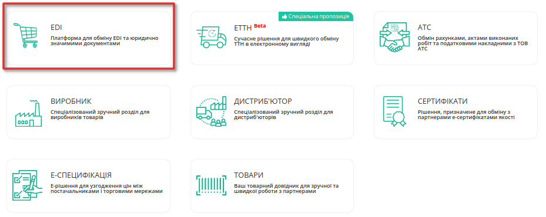
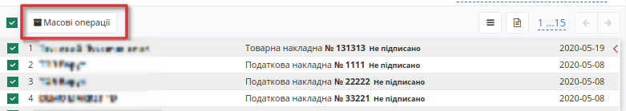
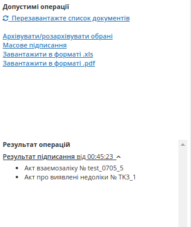

Масові операції з документами
#################################
.. contents:: Зміст:
   :depth: 6

---------

Загальні операції
====================================
На платформі для обміну EDI та юридично значимими документами доступні масові операції з документами. 
Масові операції полегшують та пришвидшують роботу з масивами документів, так як дозволять оброблювати більшу кількість документів відразу, а також працювати з іншими документами паралельно.

Операції доступні у різних папках (Вхідні, Надіслані, Важливі, Чернетки, Архів) та відрізняються у різних розділах.

У розділах Вхідні/Надіслані/Важливі можливо:
  - Архівувати/розархівувати обрані
  - Завантажити в форматі .xls
  - Завантажити в форматі .pdf
  - Завантажити в форматі .p7s 

У розділах Вхідні/Надіслані додатково можливе Масове підписання деяких документів.

У розділі Чернетки можливо:
  - Видалити документи

У розділі Архів можливо:
  - Розархівувати обрані
  - Завантажити в форматі .xls
  - Завантажити в форматі .pdf
  - Завантажити в форматі .p7s

Для доступу до операцій потрібно відмітити чекером декілька документів - з'явиться кнопка Масові операції.

Після натискання на кнопку відкриється блок, у якому можливо переглянути можливі операції, та виконані операції

 - Допустимі операції - операції які пропонуються до виконання
 - Результат операцій - виконані операції над документами

.. image:: pics_massovi_operacii/massovi_operacii_z_documentamy_3.png
   :align: center

Після вибору та запуску операції, відобразиться інформаційне вікно з повідомленням, що завдання запущенно:

.. image:: pics_massovi_operacii/massovi_operacii_z_documentamy_4.png
   :align: center

Після завершення завдання у блоці про результат операцій буде вказано назву операцій та список документів, з якими здійснювалися операції. Інформація про завершені операції зберігається одну сессію, тобто після закриття сторінки буде видалена. 

Також, по завершенню операції, необхідно оновити сторінку, для того щоб продовжувати працювати з документами та виконувати нові операції.

Масове підписання
====================================
Масове підписання документів Товарна накладна, Податкова накладна та Комерційний документ доступно у розділах Вхідні та Надіслані. 

Для доступу до операції, відсортуйте документи за Типом документу, а також за статусом - "Не підписано" (1). Виберіть потрібні документи, або відмітьте усі, а потім натисніть на кнопку "Масові операції" (2), щоб перейти до допустимих операції.

.. image:: pics_massovi_operacii/massovi_operacii_z_documentamy_podpisanie.png
   :align: center

Після вібору операціїі "Масове підписання" ініціалізується бібліотека підписання.

Після ініціалізації бібліотеки підписання, система надасть можливість додати або вибрати збережений ключ ЕЦП для підписання. При першому підписанні необхідно додати файловий ключ. Для цього у модальному вікні потрібно обрати файл (1) і ввести пароль (2):

.. image:: pics_Robota_z_tokenom/Robota_z_tokenom_26.png
   :align: center

Виберіть ключ, ведіть пароль для ініціалізації ЕЦП та натисніть **"Додати"**: 

.. image:: pics_Robota_z_tokenom/Robota_z_tokenom_27.png
   :align: center

При успішному додаванні ключа автоматично відобразиться вибрана особа, від імені якої буде здійснено підписання, та стане доступною кнопка **"Масове підписання"**. Натисніть на кнопку для початку операції:

.. image:: pics_massovi_operacii/massovi_operacii_z_documentamy_6.png
   :align: center

По завершенню підписання, ви зможете переглянути інформацію про перелік документів що були підписані та час їх підписання. 

Після перезавантаження сторінки вам будуть доступні операціїї для інших документів.

Масовий друк документів
====================================
Реалізована можливість роздрукувати вибрані документи з журналу документів.

При виборі одного або декількох документів і натисканні на кнопку "Масові операції", з'являється панель де можна запустити друк.
Після формування друкованих макетів відкривається нове вікно з друкованими макетами. Всі вибрані документи об'єднані в один файл для друку.

.. image:: pics_massovi_operacii/massovi_operacii_z_documentamy_9.png
   :align: center

.. include:: kontakti.rst

