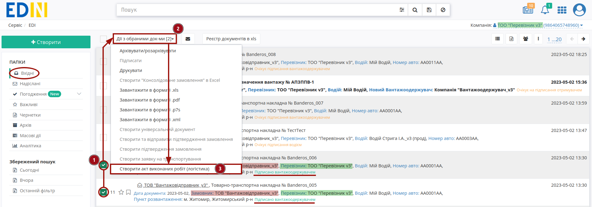

Дії з обраними документами (масові операції)
#########################################################

.. role:: red

.. role:: green

.. role:: orange

.. сюда закину немного картинок для текста

.. |trash| image:: /_constant/icons/trash.png

.. |download| image:: /_constant/icons/download.png

.. contents:: Зміст:
   :depth: 3

---------

Вступ
====================================

Для зручної та швидкої роботи з документами на платформі доступне проведення масових операцій з документами. Масові операції полегшують та пришвидшують роботу з масивами документів, так як дозволять оброблювати більшу кількість документів відразу, а також працювати з іншими документами паралельно.

.. note::
   Масові операції доступні у сервісі "EDI+ЮЗД" у всіх каталогах (Вхідні, Надіслані, Важливі, Чернетки, Архів) однак список можливостей у цих каталогах відрізняється (детальніше у наступних розділах статті).

**Дії з обраними документами (масові операції):**

* **Архівувати/розархівувати**
* **Підписати**
* **Друкувати**
* **Створити "Консолідоване замовлення" в Excel** (для документів "Замовлення" (`ORDER <https://wiki.edin.ua/uk/latest/XML/XML-structure.html#order>`__))
* **Завантажити в форматі .xls / .pdf / .p7s** (доступність форматів залежить від типу документа)
* **Створити універсальний документ**
* **Надіслати**
* **Видалити документи**
* **Підписання ПН/РКПН**

Для виконання масових операцій потрібно відмітити чекером декілька документів та натиснути **"Дії з обраними документами"** - в випадаючому списку активними будуть лише ті дії, що можливо виконати для всіх обраних документів:

Після вибору та запуску операції, відобразиться інформаційне вікно обробки запиту та завершення виконання операції, наприклад:

.. image:: pics_massovi_operacii/massovi_operacii_004.png
   :align: center

.. image:: pics_massovi_operacii/massovi_operacii_005.png
   :align: center

Після завершення завдання у каталозі **"Масові дії"** зберігаються всі результати виконання операцій за останні 7 днів. Вказується Назва дії з документами, Статус, Кількість оброблених/необроблених документів, Дата виконання операції:

Статуси:

* :green:`Успішно` - всі документи оброблені без помилок;
* :orange:`Зауваження` - є хоча б один документ, що був пропущений (кількість пропущених документів позначається жовтим кольором);
* :red:`Помилка` - є хоча б один документ, що був оброблений з помилкою (кількість необроблених документів позначається червоним кольором).

Якщо при виконанні операції виникне помилка, то система повідомить сповіщенням та відобразить про це статусом.

1 Масове підписання та відправка
====================================

Функціонал **Масового підписання та відправки** доступний у "Вхідних" та "Чернетках" (для "Чернеток" це два процеси: **"Підписати"** та **"Надіслати"**).

У "Вхідних" доступне **Масове підписання / відправка**:

* Всіх комерційних (універсальних) документів (`COMDOC <https://wiki.edin.ua/uk/latest/XML/XML-structure.html#comdoc>`__)
* Податкової накладної (`DECLAR <https://wiki.edin.ua/uk/latest/XML/XML-structure.html#declar>`__)
* Коригування до податкової накладної (`DECLARj12 <https://wiki.edin.ua/uk/latest/XML/XML-structure.html#declarj12>`__)
* Товарної накладної (Метро) (`DOCUMENTINVOICE <https://wiki.edin.ua/uk/latest/XML/XML-structure.html#documentinvoice>`__)
* Коригування до товарної накладної (Метро) (`DOCCORINVOICE <https://wiki.edin.ua/uk/latest/XML/XML-structure.html#doccorinvoice>`__)
* Акт приймання наданих послуг (Метро) (`DOCINVOICEACT <https://wiki.edin.ua/uk/latest/XML/XML-structure.html#docinvoiceact>`__)
* Повідомлення про штрафні санкції (Метро) (`ORDRPT <https://wiki.edin.ua/uk/latest/XML/XML-structure.html#ordrpt>`__)).

У "Чернетках" доступне **Масове підписання / відправка**:

* Видаткової накладної (`COMDOC_006 <https://wiki.edin.ua/uk/latest/XML/XML-structure.html#comdoc-006>`__)
* Податкової накладної (`DECLAR <https://wiki.edin.ua/uk/latest/XML/XML-structure.html#declar>`__)
* Коригування до податкової накладної (`DECLARj12 <https://wiki.edin.ua/uk/latest/XML/XML-structure.html#declarj12>`__)
* Товарної накладної (Метро) (`DOCUMENTINVOICE <https://wiki.edin.ua/uk/latest/XML/XML-structure.html#documentinvoice>`__)
* Коригування до товарної накладної (Метро) (`DOCCORINVOICE <https://wiki.edin.ua/uk/latest/XML/XML-structure.html#doccorinvoice>`__)
* Акт приймання наданих послуг (Метро) (`DOCINVOICEACT <https://wiki.edin.ua/uk/latest/XML/XML-structure.html#docinvoiceact>`__)
* Повідомлення про штрафні санкції (Метро) (`ORDRPT <https://wiki.edin.ua/uk/latest/XML/XML-structure.html#ordrpt>`__)

.. note::
   Універсальні документи (`CONDRA <https://wiki.edin.ua/uk/latest/XML/XML-structure.html#condra>`__), до яких додано вкладення також можуть бути масово відправлені з "Чернеток" (з підписом чи без в залежності від клієнтських налаштувань).

Для зручності можливо відсортувати документи за Типом та Статусом. Виберіть потрібні документи, або відмітьте усі, а потім натисніть на кнопку **"Дії з обраними документами"**, щоб перейти до допустимих операцій:

.. image:: pics_massovi_operacii/massovi_operacii_006.png
   :align: center

Після вибору операції **"Підписати"** ініціалізується бібліотека підписання.

.. _sign:

.. include:: /_constant/atb_check/atb_check.rst
   :start-after: .. початок блоку для ATB_check
   :end-before: .. кінець блоку для ATB_check

.. tabs::

   .. tab:: Файловий ключ

      .. include:: /_constant/signing/signing.rst
         :start-after: .. початок блоку для Signing
         :end-before: .. кінець блоку для Signing

   .. tab:: Token

      .. include:: /_constant/token_signing/token_signing.rst
         :start-after: .. початок блоку для TokenSign
         :end-before: .. кінець блоку для TokenSign

   .. tab:: Гряда

      .. include:: /_constant/gryada_signing/gryada_signing.rst
         :start-after: .. початок блоку для GryadaSign
         :end-before: .. кінець блоку для GryadaSign

   .. tab:: Cloud

      .. include:: /_constant/cloud_signing/cloud_signing.rst
         :start-after: .. початок блоку для CloudSign
         :end-before: .. кінець блоку для CloudSign

По завершенню підписання, потрібно **"Закрити"** інформаційне вікно, а інформацію про перелік документів, що були підписані можливо переглянути у каталозі **"Масові дії"**: 

.. image:: pics_massovi_operacii/massovi_operacii_008.png
   :align: center

.. note::
   Після підписання документів в "Чернетках" їх можливо **"Надіслати"** контрагенту (за умови, що у Відправника не налаштована автоматична відправка підписаних документів).

   .. image:: pics_massovi_operacii/massovi_operacii_012.png
      :align: center

.. _condra-create-send:

2 Створення та відправка "Універсального документа" (CONDRA) для Фактора
============================================================================================================

Масове створення "Універсальних документів" (`CONDRA <https://wiki.edin.ua/uk/latest/XML/XML-structure.html#condra>`__) використовується для `роботи з факторингом <https://wiki.edin.ua/uk/latest/retail_2.0/Factoring_instruction_EDIN_2_0.html>`__. Документи CONDRA створюються на підставі підписаних з обох сторін (в статусі :green:`"Підтверджено з двох сторін"`) "Видаткової накладної" (`COMDOC_006 <https://wiki.edin.ua/uk/latest/XML/XML-structure.html#comdoc-006>`__), "Прибуткової накладної" (`COMDOC_007 <https://wiki.edin.ua/uk/latest/XML/XML-structure.html#comdoc-007>`__), "Товарної накладної" (`DOCUMENTINVOICE <https://wiki.edin.ua/uk/latest/XML/XML-structure.html#documentinvoice>`__):

.. image:: pics_massovi_operacii/massovi_operacii_009.png
   :align: center

Далі в вікні "Пошуку контрагента" знайти та **"Вибрати"** сторону, що виступає в ролі Фактора: 

.. image:: pics_massovi_operacii/massovi_operacii_019.png
   :align: center

Платформа повідомить про успішне створення документів повідомленням, а самі документи з'являться в папці **"Чернетки"**:

.. image:: pics_massovi_operacii/massovi_operacii_010.png
   :align: center

Далі потрібно вибрати документи і в **"Дії з обраними документами"** натиснути **"Надіслати"**:

Платформа повідомить про успішну відправку документів повідомленням, а самі документи відображаються в **"Надісланих"**:

.. image:: pics_massovi_operacii/massovi_operacii_014.png
   :align: center

3 Масовий друк документів
========================================================================

Функціонал **Масового друку** реалізований у всіх папках окрім "Чернеток".

При виборі одного або декількох документів в **"Дії з обраними документами"** потрібно натиснути **"Друкувати"**:

.. image:: pics_massovi_operacii/massovi_operacii_018.png
   :align: center

Після виконання операції відкривається нове вікно з створеними друкованими макетами. Всі вибрані документи об'єднані в один файл для друку.

4 Звіт "Консолідоване замовлення"
========================================================================

Створення звіту "Консолідоване замовлення" можливо виконати в папках "Вхідні" та "Надіслані": для цього потрібно обрати кілька "Замовлень" (`ORDER <https://wiki.edin.ua/uk/latest/XML/XML-structure.html#order>`__) та в **"Дії з обраними документами"** обрати **"Створити "Консолідоване замовлення" в Excel"**:

.. image:: pics_massovi_operacii/massovi_operacii_015.png
   :align: center

.. image:: pics_massovi_operacii/massovi_operacii_016.png
   :align: center

В результаті завантажується xls-файл з усіма товарними позиціями в обраних "Замовленнях" (однакові позиції об'єднуються по штрих-коду, а їх кількість сумується).

5 Відмітка документів "прочитані" / "непрочитані"
========================================================================

Вхідні документи, що жодного разу не були відкриті позначаються в журналі документів жирним шрифтом, що символізує "непрочитаний" документ. В момент, коли користувач переходить в документ останній стає "прочитаним". Ці відмітки відіграють не лише візуальне значення, а й інформують контрагентів. Відмітити документи, як "прочитані" можливо також масово, не переходячи/відкриваючи самі документи. Також можливо зробити обернену масову операцію і зробити обрані документи "непрочитаними":

.. _mass-download:

6 Завантажити в форматі .xls / .pdf / .p7s / .xml
========================================================================

Для масового завантаження документів у вибраному форматі потрібно у вибраній папці документів відмітити чекером бажані документи та в **"Дії з обраними документами"** обрати **"Завантажити в форматі ..."**:

.. note::
   Функціонал **"Завантажити в форматі .xml"** доступний лише при наявності активного тарифу "API | FTP | SOAP | AS2" або купленого Інтеграційного модуля EDIN, що включає цей тариф!  

Всі відмічені документи в обраному форматі завантажуються одним архівом (zip) - потрібно обрати місце на локальному носії для його збереження.

.. _create-ordrsp:

7 Створення "Підтвердження замовлення" (ORDRSP)
============================================================================================================

Масове створення "Підтверджень замовлень" (`ORDRSP <https://wiki.edin.ua/uk/latest/XML/XML-structure.html#ordrsp>`__) можливо виконати на підставі вхідних "Замовлень" (`ORDER <https://wiki.edin.ua/uk/latest/XML/XML-structure.html#order>`__): потрібно обрати бажані документи (для зручності можливо скористатись фільтром за типом документа чи `пошуком <https://wiki.edin.ua/uk/latest/general_2_0/rabota_s_platformoj_EDIN_2.0.html#doc-search>`__) у папці **"Вхідні"** та в **"Дії з обраними документами"** обрати **"Створити підтвердження замовлення"**:

Платформа повідомить про успішне створення документів повідомленням (у папці **"Масові дії"** відображається результат виконання операції), а самі документи з’являться в папці **"Чернетки"**:

.. _create-and-send-ordrsp:

8 Створення та відправка "Підтвердження замовлення" (ORDRSP)
============================================================================================================

Масове створення та відправку "Підтверджень замовлень" (`ORDRSP <https://wiki.edin.ua/uk/latest/XML/XML-structure.html#ordrsp>`__) можливо виконати на підставі вхідних "Замовлень" (`ORDER <https://wiki.edin.ua/uk/latest/XML/XML-structure.html#order>`__): потрібно обрати бажані документи (для зручності можливо скористатись фільтром за типом документа чи `пошуком <https://wiki.edin.ua/uk/latest/general_2_0/rabota_s_platformoj_EDIN_2.0.html#doc-search>`__) у папці **"Вхідні"** та в **"Дії з обраними документами"** обрати **"Відправити підтвердження замовлення"**:

Після чого потрібно підтвердити (кнопка **"Так"**) автоматичне створення та відправку документів контрагенту/-ам:

Після підтвердження операції платформа повідомить про успішне створення та відправку документів (у папці **"Масові дії"** результат виконання операції також відображається), а самі документи з’являться в папці **"Надіслані"**:

.. _create-comdoc-037:

9 Створення "Акта виконаних робіт (Логістика)" (COMDOC_037)
============================================================================================================

Масове створення "Актів виконаних робіт (Логістика)" (`COMDOC_037 <https://wiki.edin.ua/uk/latest/XML/XML-structure.html#comdoc-037>`__) можливо виконати на підставі:

   * :underline:`підписаних контрагентами (з обох сторін)`, "Заявки на транспортування" (TRANSPORTATIONORDER з SUBDOCTYPE = 1) або "Підтвердження заявки на транспортування" (TRANSPORTATIONORDER з SUBDOCTYPE = 2);
   * :underline:`підписаної контрагентами (з трьох сторін)` "е-ТТН" (документ перебуває в статусі :green:`"Підписано вантажоодержувачем"`).

Ініціатором "Акта виконаних робіт (Логістика)" виступає користувач з роллю **"Перевізник"** (при роботі з транспортними документами передбачені 4 основні ролі учасників документообігу: **"Замовник"**, **"Вантажовідправник"**, **"Перевізник"**, **"Вантажоотримувач"**). Обмін документами здійснюється між **"Перевізником"** та **"Замовником"**:

:green:`"Перевізник" -> "Замовник"`

**Перевізнику** для ствоення в сервісі "EDI+ЮЗД" **"Акта виконаних робіт (Логістика)"** :

* :underline:`на підставі "Заявок на транспортування"` потрібно перейти у **"Вхідні"** та вибрати "Заявки на транспортування" з однаковим контрагентом (**"Замовником"**) в статусі :green:`"Підписано перевізником"` (для зручності можливо скористатись рядком пошуку) та в **"Дії з обраними документами"** обрати **"Створити акт виконаних робіт (Логістика)"**;
* :underline:`на підставі "Підтвердження заявки на транспортування"` потрібно перейти у **"Надіслані"** та вибрати "Підтвердження заявки на транспортування" з однаковим контрагентом (**"Замовником"**) в статусі :green:`"Підписано замовником"` (для зручності можливо скористатись рядком пошуку) та в **"Дії з обраними документами"** обрати **"Створити акт виконаних робіт (Логістика)"**;
* :underline:`на підставі "е-ТТН"` потрібно перейти у **"Вхідні"** та вибрати "е-ТТН" (з однаковим **"Замовником"**) в статусі :green:`"Підписано вантажоодержувачем"` (для зручності можливо скористатись рядком пошуку) та в **"Дії з обраними документами"** обрати **"Створити акт виконаних робіт (Логістика)"**:

.. include:: /ETTN_3_0/Create_COMDOC_037_from.rst
   :start-after: .. початок блоку для ManyToOneDoc
   :end-before: .. кінець блоку для ManyToOneDoc

Процес `Підписання <https://wiki.edin.ua/uk/latest/general_2_0/massovi_operacii_EDIN_2.0.html#sign>`__ є стандартним для всіх документів на платформі та описаний вище. Після підписання "Акта виконаних робіт (Логістика)" окремим блоком відображається інформація про підписантів. Підписаний документ можливо **"Відправити"**:

Після відправки документа контрагенту він відображається в журналі вихідних документів. Відправленому **"Перевізником"** "Акту виконаних робіт (Логістика)" присвоюється статус :orange:`"Потребує підписання отримувачем"`.

-----------------------------------

.. include:: /_constant/kontakti.rst

