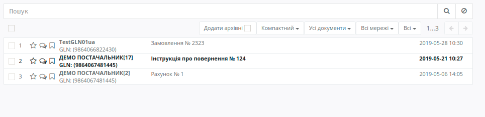
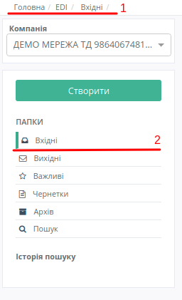
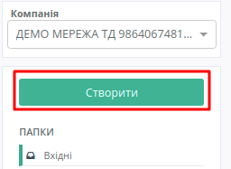
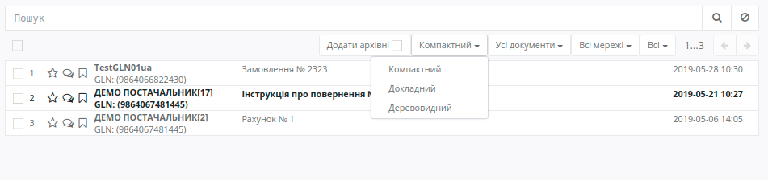
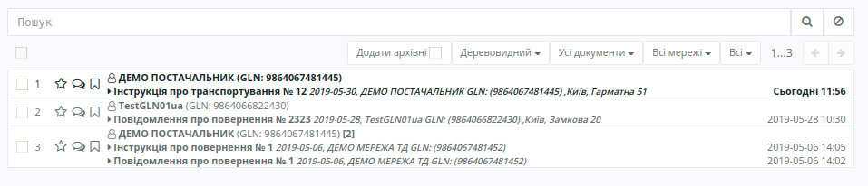

Робота з Платформою EDIN 2.0
#################################

.. contents:: Зміст:
   :depth: 6

---------

**Вхід на платформу**
================================================
Для входу на платформу необхідно перейти за посиланням https://edo-v2.edi-n.com/auth

При переході по вказаному посиланню відкриється вікно авторизації. Необхідно ввести Ваш логін і пароль користувача і натиснути «**Вхід**», як це зазначено на скріншоті нижче:

.. image:: pics_rabota_s_platformoj_EDIN_2.0/1.png
   :align: center

У разі успішної авторизації відкриється вікно платформи:

.. image:: pics_rabota_s_platformoj_EDIN_2.0/2.png
   :align: center

**Загальний вигляд платформи**.
================================================

Платформа складається з двох частин:

1. Функціонал переходу по каталогам папок:

.. image:: pics_rabota_s_platformoj_EDIN_2.0/3.png
   :align: center

2. Функціонал перегляду і пошуку документів:

**Сервіси платформи**
================================================

EDI та Товари. На платформі окремо відображаються товарний довідник і каталог обробки документів.

За замовчуванням, при вході у Вас буде відображатися каталог **EDI-документів**. Він буде виділений, як на скріншоті нижче:

.. image:: pics_rabota_s_platformoj_EDIN_2.0/5.png
   :align: center

Щоб перейти в Товарний довідник необхідно натиснути на "**Товари**". Після натискання на кнопку виконається перехід на сторінку редагування довідника.

**Вибір номера GLN організації**
================================================

Якщо користувачеві доступні номери GLN декількох організацій: для відкриття інформації потрібної Вам компанії необхідно вибрати відповідний номер GLN зі списку - "**Компанія**":

.. image:: pics_rabota_s_platformoj_EDIN_2.0/6.png
   :align: center

У рядку пошуку є можливість внести назву, або частину номера **GLN**. Система автоматично виконає пошук даного номера за назвою або частиною GLN-номера:

.. image:: pics_rabota_s_platformoj_EDIN_2.0/7.png
   :align: center

**Перегляд каталогів платформи**
================================================

При первинному вході на платформу буде виконаний вхід в каталог документів - "**Вхідні**".

Інформація про каталог буде відображатися в двох місцях:

- У верхній частині web-сторінки
- У загальному списку каталогів буде виділено відкритий в даний момент каталог

Для переходу в потрібний Вам каталог необхідно його вибрати:

#. Каталог "Вхідні". В даному каталозі будуть розміщені всі вхідні документи для організації від контрагентів.
#. Каталог "Вихідні". В даному каталозі будуть розміщені всі відправлені документи для організації до контрагентів.
#. Каталог "Важливі". В даному каталозі будуть розміщені всі зазначені документи як важливі.
#. Каталог "Чернетки". В даному каталозі будуть розміщені всі документи які були створені, але не відправлені. 
#. Каталог "Архів". В даному каталозі будуть розміщені всі оброблені і архівні документи, які перенесені в архів.
#. Каталог "Пошук". В даному полі можна задати критерії пошуку документів. Результат пошуку буде відображатися в збереженому каталозі, який буде розміщений в полі - "Історія пошуку".

**Створення документа**
================================================

Для створення документа на платформі необхідно натиснути кнопку - "**Створити**"

Після цього потрібно вибрати тип створюваного документа:

.. image:: pics_rabota_s_platformoj_EDIN_2.0/10.png
   :align: center

**Перегляд документів на платформі**
================================================

Для перегляду документів необхідно перейти в потрібний каталог платформи.
У Вас є можливість вибрати **вид документів**:

1. Компактний. Даний вид буде встановлений за замовчуванням.

2. Детальний. При цьому виборі, на платформі буде відображатися вся додаткова інформація з документа.

.. image:: pics_rabota_s_platformoj_EDIN_2.0/12.png
   :align: center

3. Дерево. Додатково будуть відображатися всі документи в ланцюжку.

У наступному рядку вибору є можливість виконати фільтр в залежності від типу документів.

.. image:: pics_rabota_s_platformoj_EDIN_2.0/14.png
   :align: center

Також додані фільтри по **Роздрібним мережам**, і **статусу прочитання** документа: всі, прочитані або не прочитані.

.. image:: pics_rabota_s_platformoj_EDIN_2.0/15.png
   :align: center

.. image:: pics_rabota_s_platformoj_EDIN_2.0/16.png
   :align: center

У рядку пошуку є можливість додавати додаткові критерії пошуку.
Для цього в рядку вводимо символ "**#**". Після цього система видасть можливі критерії пошуку:

.. image:: pics_rabota_s_platformoj_EDIN_2.0/17.png
   :align: center

Необхідно вибрати потрібний Вам критерій. Якщо Вам вже відомий потрібний критерій, то можна вводити його назву, що скоротить коло пошуку.

Якщо критерій пошуку вимагає додаткової інформації, то значення, що вводиться потрібно ввести після двокрапки.
Наприклад, при пошуку за номером документа вводимо наступне:

.. image:: pics_rabota_s_platformoj_EDIN_2.0/18.png
   :align: center

Замість "**Номер Документа**" вказуємо потрібний Вам номер.

Також в рядку пошуку можна внести кілька критеріїв, наприклад **Тип документа** і **GLN** місця доставки:

.. image:: pics_rabota_s_platformoj_EDIN_2.0/19.png
   :align: center

3. У журналі документів є можливість відзначити документи як "**Важливі**". Подивитися коментарі в документі, а також поставити мітки.

.. image:: pics_rabota_s_platformoj_EDIN_2.0/20.png
   :align: center

**Дії з документом**
================================================

Для відкриття документа необхідно його вибрати (після чого документ відкриється).

.. image:: pics_rabota_s_platformoj_EDIN_2.0/22.png
   :align: center

#. Тип документа.
#. Вказується інформація в якому каталозі відкрито цей документ.
#. Вибираються типи документів, які можна створити на підставі відкритого. Для формування потрібного документа досить натиснути на тип документа, що формується.
#. Сірим виділені типи документів в ланцюжку. При натисканні на документ виконується його відкриття.
#. При натисканні на кнопку "Архівувати" документ і ланцюжок до нього переноситься в "Архів".
#. При натисканні на кнопку "Друк" документ можна роздрукувати.
#. В полі "номер 7" можна подивитися дані по відправнику / одержувачу.
#. Таблична частина документа з товарами.
#. Додаткова інформація по документу.
#. При натисканні на кнопку "Залишити коментар" можна ввести коментар по документу і зберегти його.
#. Інформація про час отримання документа на платформі і часу прочитання.
#. При натисканні на документ сформується новий документ на підставі відкритого. У разі якщо можна сформувати кілька документів, буде декілька доступних для вибору.

**Розширений пошук документів**
================================================

Для того щоб виконати розширений пошук документів на платформі необхідно перейти в підменю каталогів під назвою "**Пошук**".

Потім введіть назву і виберіть параметри.
Після цього натисніть - "**Пошук**"

.. image:: pics_rabota_s_platformoj_EDIN_2.0/23.png
   :align: center

В історії пошуку з'явиться новий каталог, при виборі якого буде відображатися список знайдених документів:

.. image:: pics_rabota_s_platformoj_EDIN_2.0/24.png
   :align: center

Для зміни параметрів пошуку потрібно натиснути на іконку-олівець. Для видалення на іконку-хрестик.

**Робота з товарним довідником**
================================================

Для додавання товару в довідник необхідно натиснути кнопку - **Додати товар**.

.. image:: pics_rabota_s_platformoj_EDIN_2.0/25.png
   :align: center

Потім потрібно заповнити обов'язкові поля в документі:

- Найменування.
- Штрих-код.
- Ціна без ПДВ.
- Одиниця виміру товару.
- Ставка ПДВ.
- Після заповнення натиснути кнопку - "**Додати товар**".

.. image:: pics_rabota_s_platformoj_EDIN_2.0/26.png
   :align: center

Після додавання товару він буде доступним в загальному списку довідника.

.. image:: pics_rabota_s_platformoj_EDIN_2.0/27.png
   :align: center

Щоб знайти потрібний товар у рядку пошуку потрібно ввести назву або штрих-код, або артикул товару.

Для редагування товару потрібно натиснути на його штрих-код.

Після внесення змін потрібно **зберегти зміни**.

.. image:: pics_rabota_s_platformoj_EDIN_2.0/28.png
   :align: center
