Робота з Платформою EDIN 2.0
#################################

.. contents:: Зміст:
   :depth: 6

---------

**Вхід на платформу**
================================================
Для входу на платформу необхідно перейти за посиланням https://edo-v2.edi-n.com/auth

При переході по вказаному посиланню відкриється вікно авторизації. Необхідно ввести Ваш логін і пароль користувача і натиснути «**Вхід**», як це зазначено на зображенні нижче:

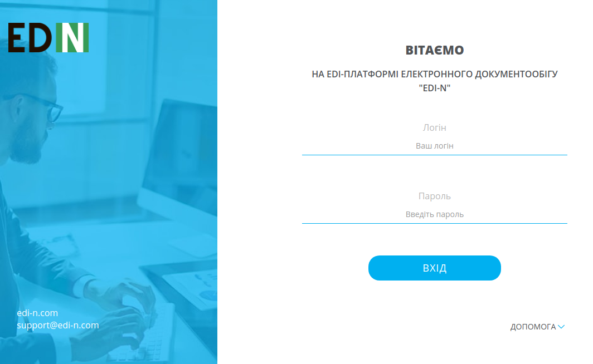

У разі успішної авторизації відкриється вікно платформи:

.. image:: pics_rabota_s_platformoj_EDIN_2.0/102.png
   :align: center

**Загальний вигляд платформи**
================================================

Платформа складається з трьох основних частин: функціонал переходу по каталогам папок (1), функціонал перегляду (2) і пошуку документів (3):

.. image:: pics_rabota_s_platformoj_EDIN_2.0/103.png
   :align: center

**Сервіси платформи**
================================================

Всі сервіси та Товарний довідник знаходяться в випадаючому списку в правій верній частині сторінки.

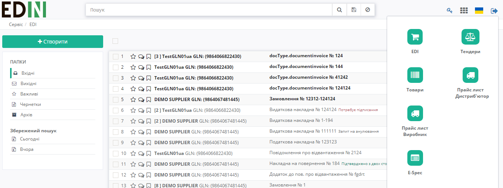

За замовчуванням, при вході у Вас буде відображатися каталог **EDI**.

Щоб перейти в Товарний довідник необхідно натиснути на "**Товари**". Після натискання на кнопку виконається перехід на сторінку редагування довідника.

**Вибір номера GLN організації**
================================================

Якщо користувачеві доступні номери GLN декількох організацій: для відкриття інформації потрібної Вам компанії необхідно вибрати відповідний номер GLN зі списку - "**Компанія**":

.. image:: pics_rabota_s_platformoj_EDIN_2.0/106.png
   :align: center

У рядку пошуку є можливість внести назву, або частину номера **GLN**. Система автоматично виконає пошук даного номера за назвою або частиною GLN-номера.

**Перегляд каталогів платформи**
================================================

При первинному вході на платформу буде виконаний вхід в каталог документів - "**Вхідні**".

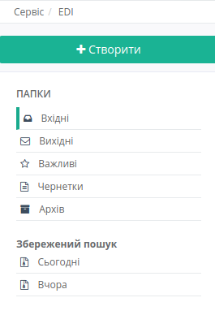

Для переходу в потрібний Вам каталог необхідно його вибрати:

#. Каталог "Вхідні". В даному каталозі будуть розміщені всі вхідні документи для організації від контрагентів.
#. Каталог "Вихідні". В даному каталозі будуть розміщені всі відправлені документи для організації до контрагентів.
#. Каталог "Важливі". В даному каталозі будуть розміщені всі зазначені документи як важливі.
#. Каталог "Чернетки". В даному каталозі будуть розміщені всі документи які були створені, але не відправлені. 
#. Каталог "Архів". В даному каталозі будуть розміщені всі оброблені і архівні документи, які перенесені в архів.
#. Каталог "Пошук". В даному полі можна задати критерії пошуку документів. Результат пошуку буде відображатися в збереженому каталозі, який буде розміщений в полі - "Історія пошуку".

**Створення документа**
================================================

Для створення документа на платформі необхідно натиснути кнопку - "**Створити**"

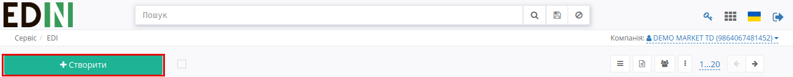

Після цього потрібно вибрати тип створюваного документа:

.. image:: pics_rabota_s_platformoj_EDIN_2.0/10.png
   :align: center

**Перегляд документів на платформі**
================================================

Для перегляду документів необхідно перейти в потрібний каталог платформи.
У Вас є можливість вибрати **вид відображення документів**:

1. Компактний. Даний вид буде встановлений за замовчуванням.

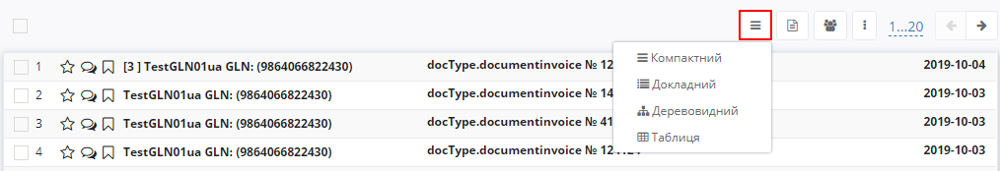

2. Детальний. При цьому виборі, на платформі буде відображатися вся додаткова інформація з документа.

.. image:: pics_rabota_s_platformoj_EDIN_2.0/110.png
   :align: center

3. Дерево. Додатково будуть відображатися всі документи в ланцюжку.

.. image:: pics_rabota_s_platformoj_EDIN_2.0/111.png
   :align: center

4. Таблиця. На платформі у вигляді таблиці буде відображатися наступна інформація по документу: Компанія, Тип, Номер документу, Інформація, Дата документу.

.. image:: pics_rabota_s_platformoj_EDIN_2.0/112.png
   :align: center

У наступному рядку вибору є можливість використати фільтр в залежності від типу документів.

.. image:: pics_rabota_s_platformoj_EDIN_2.0/113.png
   :align: center

Також додані фільтри по **Роздрібним мережам**, і **статусу прочитання** документа: всі, прочитані або не прочитані.

.. image:: pics_rabota_s_platformoj_EDIN_2.0/114.png
   :align: center

.. image:: pics_rabota_s_platformoj_EDIN_2.0/115.png
   :align: center

Також можливо вибрати кількість документів, що будуть відображатись в журналі на сторінці (20, 40, 60, 100).

**Дії з документом**
================================================

Для відкриття документа необхідно його вибрати (після чого документ відкриється).

.. image:: pics_rabota_s_platformoj_EDIN_2.0/117.png
   :align: center

1. Тип документа.
2. Вказується інформація в якому каталозі відкрито цей документ.
3. Вибираються типи документів, які можна створити на підставі відкритого. Для формування потрібного документа досить натиснути на тип документа, що формується.
4. При натисканні на документ сформується новий документ на підставі відкритого. У разі якщо можна сформувати кілька документів, буде декілька доступних для вибору.
5. Дані Відправника / Отримувача.
6. Основна інформація по документу.
7. Таблична частина документа з товарами.
8. При натисканні на кнопку "Залишити коментар" можна ввести коментар по документу і зберегти його.
9. Можливість приховати панель з даними про документ, ланцюжок документів та кнопку "Архівувати" (п. 10-12)
10. Сірим виділені типи документів в ланцюжку. При натисканні на документ виконується його відкриття.
11. При натисканні на кнопку "Архівувати" документ і ланцюжок до нього переноситься в "Архів".
12. Інформація про час отримання документа на платформі і часу прочитання.
13. При натисканні на кнопку "Друк" документ можна роздрукувати.

**Пошук документів**
================================================

Для того щоб виконати пошук документів на платформі необхідно перейти в підменю каталогів під назвою **"Пошук"**.

.. image:: pics_rabota_s_platformoj_EDIN_2.0/29.png
   :align: center

Потім потрібно ввести назву та вибрати параметри. За потребою можна користуватись випадаючим списком. Після цього натисніть - **"Пошук"** (1).
Усі елементи пошуку повині бути розділені комами, також є елементи із конкретним значенням та без: "Номер: 123, #Відправлені," (2).

.. image:: pics_rabota_s_platformoj_EDIN_2.0/030.png
   :align: center

Натиснувши на дискету та ввівши назву можна **зберегти** данні рядку пошуку (1). Переглянути збережений пошук можна в блоці "**Збережений пошук**" (2).
Збережений пошук відноситься тільки до певного статусу документа: "Вхідні", "Вихідні".
У блоці "Збережений пошук" за замовчуванням доступні фільтри по документам за сьогодні та вчора (3).
Вилучити збережений пошук можна за допомогою хрестика (4).

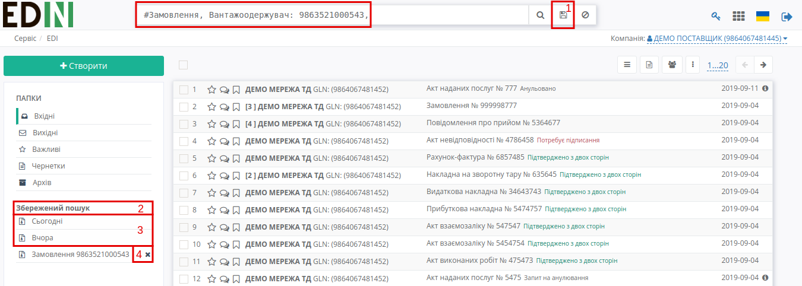

Очистити рядок "Пошук" можна за допомогою кнопки «**Скинути фільтри**» (1).
При переході між папками "Вхідні", "Вихідні" пошуковий рядок очищається.
Якщо користувач відфільтрував список документів, після чого перейшов до перегляду цього документа та повернувся назад, — пошук зберігається.

.. image:: pics_rabota_s_platformoj_EDIN_2.0/032.png
   :align: center

Детальніше про рядок пошуку та його можливості:

1.  Номер — пошук документа за номером.

    a) "Номер: 123" - знайти документ за конкретним номером
    b) "Номер: 123+" - знайти документ, номер якого починається на 123
    c) "Номер: 123 + 22" - знайти документ, номер якого починається на 123 та закінчується на 22, де між 123 і 22 може бути будь-який набір символів
    d) "-Номер: 123" - знайти всі документи, крім документа з номером 123
    e) "-Номер: 123+" - знайти всі документи, крім документа, номер якого починається на 123
    f) "Номер: (123 & 234)" - знайти документи з номерами 123 і 234

.. image:: pics_rabota_s_platformoj_EDIN_2.0/033.png
   :align: center

2. Дата — пошук документа за датою.

.. hint:: Мається на увазі дата створення документа. Не плутати з датою поновлення документа, яка відображається у списку документів в ланцюжку.

    a) "Дата документа: 2019.09.01" - знайти всі документи за конкретною датою
    b) "Дата документа: 2019.09.01-2019.09.04" - знайти всі документи за період
    c) "Дата документа: 2019.09.01-" - знайти всі документи, починаючи з конкретної дати і закінчуючи сьогоднішнім днем
    d) "Дата документа: -2019.09.01" - знайти всі документи до зазначеної дати

.. image:: pics_rabota_s_platformoj_EDIN_2.0/034.png
   :align: center

3. GLN — пошук документа за GLN.

    a) "Вантажовідправник: 9864067481452" — знайти всі документи контрагента за допомогою пошукових елементів "Відправник", "Вантажовідправник", "Постачальник", "Одержувач", "Вантажоодержувач", "Замовник", "Покупець", "Виконавець", "Місце доставки" та GLN
    b) "-Місце доставки: 9864067481452," - знайти всі документи контрагента, крім тих, що містять зазначений GLN

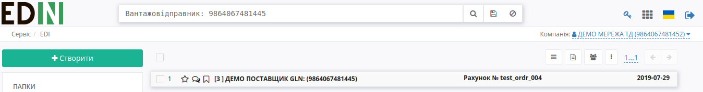

4. Мережа — пошук документа за назвою мережі.

"Мережа: АТБ,"

У рядку пошуку є можливість додавати додаткові критерії пошуку. Для цього в рядку вводимо символ "#". Після цього система видасть можливі критерії пошуку:

    a) #{Назва типу документа} - пошук за типом документа
       Приклад: "#Замовлення,".
    b) #{Назва статусу документа} - пошук за статусом документа
       Приклад: "#Відправлені,".
    c) #{Назва періоду документа} - пошук за періодом створення документа
       Приклад: #Сьогодні - пошук всіх документів, в яких дата створення - поточна дата, #За місяць - пошук всіх документів за поточний місяць

.. image:: pics_rabota_s_platformoj_EDIN_2.0/17.png
   :align: center

Необхідно вибрати потрібний Вам критерій. Якщо Вам вже відомий потрібний критерій, то можна вводити його назву, що скоротить коло пошуку.

3. У журналі документів є можливість відзначити документи як "**Важливі**". Подивитися коментарі в документі, а також поставити мітки.

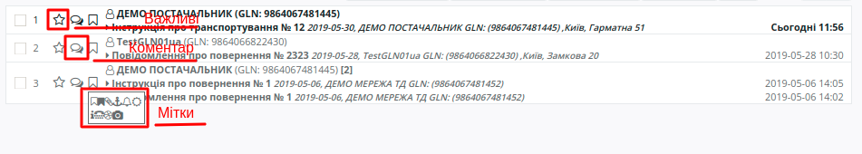

**Робота з товарним довідником**
================================================

Для додавання товару в довідник необхідно натиснути кнопку - **Додати товар**.

.. image:: pics_rabota_s_platformoj_EDIN_2.0/25.png
   :align: center

Потім потрібно заповнити обов'язкові поля в документі:

- Найменування.
- Штрих-код.
- Ціна без ПДВ.
- Одиниця виміру товару.
- Ставка ПДВ.
- Після заповнення натиснути кнопку - "**Додати товар**".

.. image:: pics_rabota_s_platformoj_EDIN_2.0/26.png
   :align: center

Після додавання товару він буде доступним в загальному списку довідника.

.. image:: pics_rabota_s_platformoj_EDIN_2.0/27.png
   :align: center

Щоб знайти потрібний товар у рядку пошуку потрібно ввести назву або штрих-код, або артикул товару.

Для редагування товару потрібно натиснути на його штрих-код.

Після внесення змін потрібно **зберегти зміни**.

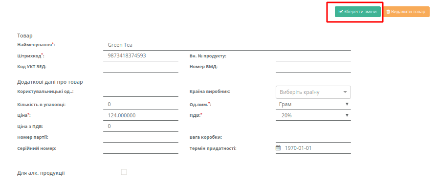

Щоб знайти потрібний товар певної мережі необхідно обрати необхідну мережу:

.. image:: pics_rabota_s_platformoj_EDIN_2.0/36.png
   :align: center

Результат:

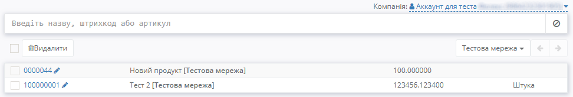

**Масове завантаження**

Для масового завантаження товарних позицій необхідно натиснути на кнопку "Масове завантаження" (1), після цього — "Завантажити позиції з Excel" (2).

.. hint:: Необхідний формат для завантаження товарного довідника — **.xls**

.. hint:: Для коректного завантаження товарних позицій необхідно натиснути на кнопку "Зберегти шаблон Excel" (3) та дотримуватись зазначених інструкцій (4).

.. image:: pics_rabota_s_platformoj_EDIN_2.0/38.png
   :align: center

Результат після завантаження:

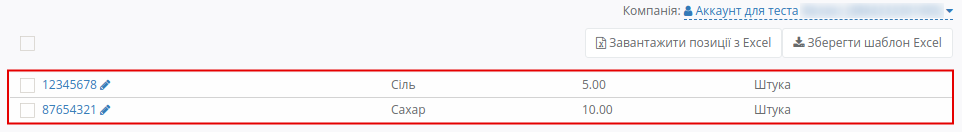

Далі необхідно вибрати позиції для додавання у товарний довідник (є можливість вибрати всі або декілька позицій):

.. image:: pics_rabota_s_platformoj_EDIN_2.0/41.png
   :align: center

.. image:: pics_rabota_s_platformoj_EDIN_2.0/42.png
   :align: center

Далі необхідно вибрати певну мережу для додавання та натиснути кнопку "Створити":

.. image:: pics_rabota_s_platformoj_EDIN_2.0/43.png
   :align: center
   
.. image:: pics_rabota_s_platformoj_EDIN_2.0/44.png
   :align: center
   
Товари успішно додано у мережу:

.. image:: pics_rabota_s_platformoj_EDIN_2.0/45.png
   :align: center

Якщо в шапці завантаженого шаблону буде виявлена розбіжність, система надасть повідомлення про помилку:

   
.. include:: kontakti.rst
