Робота з Платформою EDI Network
#################################

.. сюда закину немного картинок для текста

.. |пресуха| image:: pics_rabota_s_platformoj_EDIN_2.0/rabota_s_platformoj_03n.png

.. |advserch| image:: pics_rabota_s_platformoj_EDIN_2.0/rabota_s_platformoj_009.png

.. |non| image:: pics_rabota_s_platformoj_EDIN_2.0/rabota_s_platformoj_011.png

.. |лупа| image:: pics_rabota_s_platformoj_EDIN_2.0/rabota_s_platformoj_010.png

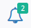

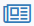

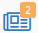

.. |star| image:: pics_rabota_s_platformoj_EDIN_2.0/rabota_s_platformoj_028.png

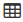

.. |approval| image:: /general_2_0/pics_rabota_s_platformoj_EDIN_2.0/rabota_s_platformoj_065.png

.. |bad_doc| image:: /general_2_0/pics_rabota_s_platformoj_EDIN_2.0/rabota_s_platformoj_066.png

.. |delegation| image:: /_constant/icons/delegation.png

.. role:: red

.. role:: green

.. role:: blue

.. role:: orange

.. role:: underline

.. contents:: Зміст:
   :depth: 6

---------

**1 Вхід на платформу**
================================================

.. початок блоку для Enter

Для роботи з WEB сервісом Ви можете використовувати будь-який браузер (рекомендованим є **Google Chrome** останньої версії). Для входу до сервісу платформи необхідно `Авторизуватись <https://wiki.edin.ua/uk/latest/general_2_0/User_registration.html#auth>`__ : перейти за посиланням https://edo-v2.edin.ua/auth, ввести Ваш логін і пароль користувача, натиснути **"Вхід"**, як це зазначено на зображенні нижче:

.. image:: /general_2_0/pics_rabota_s_platformoj_EDIN_2.0/rabota_s_platformoj_072.png 
   :align: center

.. hint::
   Нові користувачі можуть самостійно пройти `Реєстрацію <https://wiki.edin.ua/uk/latest/general_2_0/User_registration.html#register>`__ на платформі.

.. кінець блоку для Enter

Після успішної авторизації відкриється основне меню продуктів та рішень для вибору сервісу платформи EDIN: **"Вільний", "EDI Network", "Е-ТТН", "Маркет", "Комерційна пропозиція", "Е-Специфікація", "Підключення до мережі", "Товари", "Tender", "Е-Сертифікати", "White Doc", "Інтеграція"**:

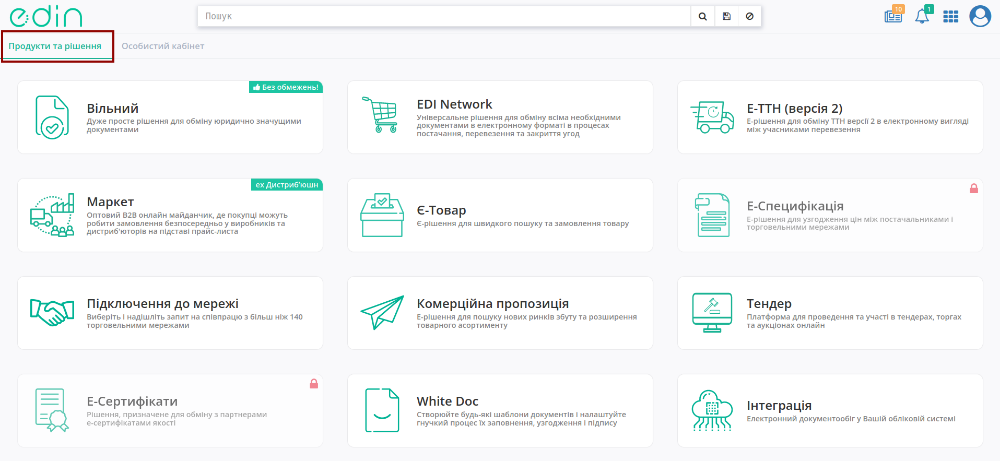

Розділ "Особистого кабінету" складається з розділів: **"Акаунт"**, **"Налаштування"** і **"Довідники"** : 

.. image:: pics_rabota_s_platformoj_EDIN_2.0/rabota_s_platformoj_089.png
   :align: center

При переході до відповідного сервісу (продукту) відкривається інтерфейс відповідного сервісу для роботи.

.. hint::
    Для повернення до меню сервісів, товарного довідника потрібно натиснути кнопку |пресуха| або натиснувши на логотип EDIN

.. warning::
   При переході до деяких сервісів, коли авторизований користувач перевищує доступну кількість одночасних сесій (з різних пристроїв чи браузерів) платформа повідомляє про обмеження даного користувача:
   
   .. image:: pics_rabota_s_platformoj_EDIN_2.0/rabota_s_platformoj_002.png
      :align: center

   Детальніше про `Правила користування Платформою «EDI Network» <https://wiki.edin.ua/uk/latest/Legal_info/Rules.html#id5>`__. В особистому кабінеті в розділі `Баланс та вибір тарифу <https://wiki.edin.ua/uk/latest/Personal_Cabinet/PCInstruction.html#id5>`__ можливо розшири можливості взаємодії с сервісами, докупивши "Додаткові сесії".

.. _header:

**2 Загальний вигляд платформи**
================================================

Незалежно від сервісу, верхня панель складається з:

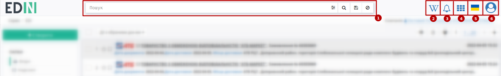

#. `Пошуковий рядок <https://wiki.edin.ua/uk/latest/general_2_0/rabota_s_platformoj_EDIN_2.0.html#doc-search>`__;
#. `Новини <https://wiki.edin.ua/uk/latest/general_2_0/rabota_s_platformoj_EDIN_2.0.html#news>`__;
#. `Повідомлення <https://wiki.edin.ua/uk/latest/general_2_0/rabota_s_platformoj_EDIN_2.0.html#messages>`__;
#. Меню сервісів - відкриває меню для переходу в сервіси платформи;
#. `Меню користувача <https://wiki.edin.ua/uk/latest/general_2_0/rabota_s_platformoj_EDIN_2.0.html#pers-settings>`__.

.. _pers-settings:

**3 Профіль користувача**
================================================

Клік на іконку користувача відкриває меню з налаштуваннями (налаштування акаунта/компаній описані в `інструкції "Особистого кабінету" <https://wiki.edin.ua/uk/latest/Personal_Cabinet/PCInstruction.html>`__):

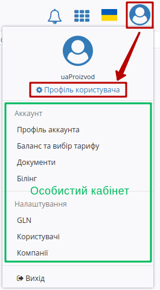

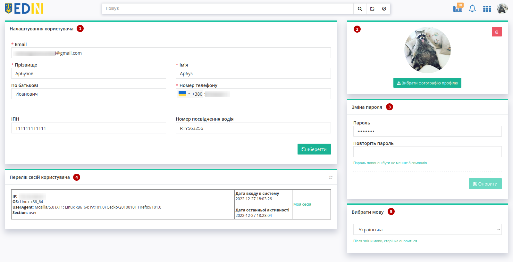

В профілі користувача відображаються блоки:

1. "Налаштування користувача" - особисті дані користувача (Email, Прізвище, Ім'я, По батькові, Номер телефону, ІПН, Номер посвідчення водія). Обов'язкові до заповнення поля позначні червоною зірочкою :red:`*`. Користувач може доповнити/змінити інформацію про себе.
2. Вибрати фотографію профілю, що буде відображатись замість стандартної іконки.
3. За потреби завжди можливо змінити пароль (не менше 8 символів).
4. "Перелік сесій користувача" дозволяє відслідковувати всі сесії користувача.
5. До вибору мови інтерфейсу, що буде відображатись даному користувачу, доступні Українська, Англійська та Німецька мови.

Також в профілі користувача в блоці Налаштувань користувача можуть відображатись підказки:

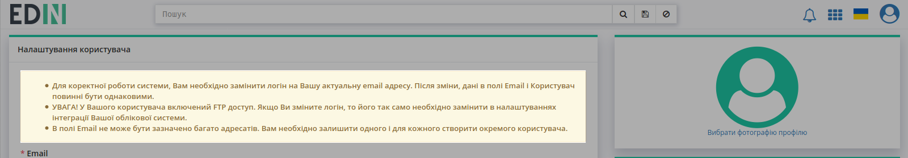

.. hint::
   Для коректної роботи системи логін для входу на платформу повинен збігатись з Вашим актуальним email. Для користувачів, у яких логін відмінний передбачений функціонал для заміни:

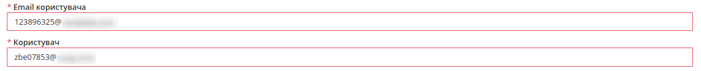

При зміні Email користувача на вказаний (новий) Email потрібно ввести пароль поточного користувача (підтвердження дії) - на новий email відправляється лист для підтвердження поштової адреси.

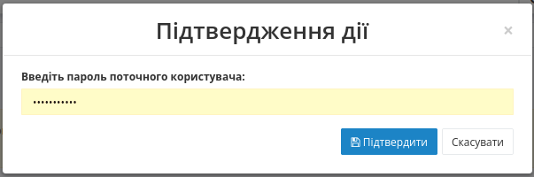

**4 Вибір номера GLN організації**
================================================

Якщо користувачеві доступні номери GLN декількох організацій: для відкриття інформації потрібної Вам компанії необхідно вибрати відповідний номер GLN зі списку - "**Компанія**":

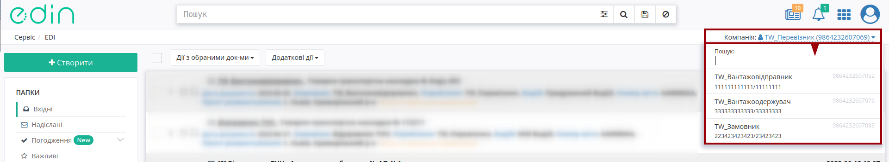

У рядку пошуку є можливість внести назву, або частину номера **GLN**. Система автоматично виконає пошук даного номера за назвою або частиною GLN-номера.

.. _catalogs:

**5 Меню (папки) платформи**
================================================

При первинному вході на платформу буде виконаний вхід до каталогу з "Вхідними" документами.

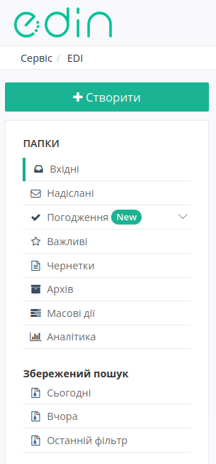

Для переходу в потрібний Вам розділ необхідно його вибрати (обраний розділ має помітку):

#. "Вхідні" - розділ всіх вхідних документів від контрагентів.
#. "Надіслані" - розділ всіх відправлених документів від Вашої організації до контрагентів.
#. "Погодження" - розділ вхідних документів, що були запущені на `погодження <https://wiki.edin.ua/uk/latest/general_2_0/rabota_s_platformoj_EDIN_2.0.html#doc-approval>`__ (на рівні Вашої організації).
#. "Важливі" - розділ документів, що були зазначені як важливі.
#. "Чернетки" - розділ всіх збережених на етапі створення, але поки не відправлених документів. 
#. "Архів" - розділ оброблених і перенесених в архів документів.
#. "Масові дії" - розділ результатів виконання `масових операцій (дії з обраними документами) <https://wiki.edin.ua/uk/latest/general_2_0/massovi_operacii_EDIN_2.0.html>`__ за останні 7 днів.
#. "Аналітика" - розділ інфографіки по документообігу організації.

.. _doc-create:

**6 Створення документа**
================================================

Документи в сервісі можливо створювати "з нуля" за допомогою кнопки - **"Створити"**:

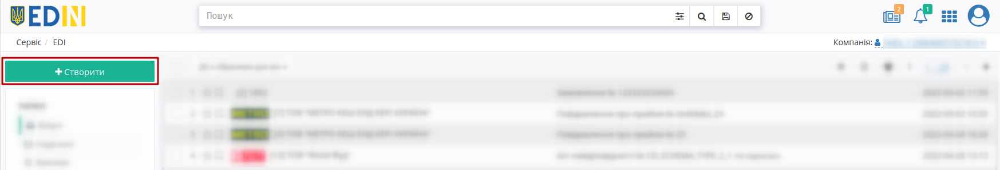

Після чого потрібно обрати тип створюваного документа (доступний пошук за назвою документа):

.. image:: pics_rabota_s_platformoj_EDIN_2.0/10.png
   :align: center

Також можливо створити документ на підставі "Вхідного" чи "Надісланого" документа прямо з форми перегляду документа. Для цього потрібно відкрити бажаний документ, натиснувши на нього в журналі документів (знайти потрібний документ зручно за допомогою `"Пошуку" <https://wiki.edin.ua/uk/latest/general_2_0/rabota_s_platformoj_EDIN_2.0.html#doc-search>`__).

.. include:: /_constant/chain/chain.rst
   :start-after: .. початок блоку для Chain
   :end-before: .. кінець блоку для Chain

.. _doc-approval:

**7 Погодження**
================================================

.. початок блоку для Block_to_ATS_001

В сервісі **"EDI Network"** та в **"Особистому кабінеті" ("Документи АТС")** можливо налаштувати ланцюжок послідовного погодження вхідних документів (**сценарії**) перед підписанням. **"Погодження"** містить 3 підтеки, в яких документи згруповані по статусу:

.. image:: /general_2_0/pics_rabota_s_platformoj_EDIN_2.0/rabota_s_platformoj_075.png
   :align: center

* "Очікують погодження" - документи, які Вам потрібно погодити/відхилити (мають статус :red:`Очікує мого погодження`);
* "На погодженні" - документи, відправлені на погодження (мають статус :orange:`На погодженні`);
* "Погоджені" - документи, за якими погодження завершено (мають статус :green:`Погодження завершено`).

На даний момент доступні до погодження наступні типи документів (список буде розширюватись):

* `Акт наданих послуг (COMDOC_018) <https://wiki.edin.ua/uk/latest/XML/XML-structure.html#comdoc-018>`__
* `Акт виконаних робіт (COMDOC_013) <https://wiki.edin.ua/uk/latest/XML/XML-structure.html#comdoc-013>`__
* `Акт взаємозаліку (COMDOC_015) <https://wiki.edin.ua/uk/latest/XML/XML-structure.html#comdoc-015>`__
* `Рахунок-фактура (COMDOC_016) <https://wiki.edin.ua/uk/latest/XML/XML-structure.html#comdoc-016>`__
* `Акт звірки зведений (COMDOC_029) <https://wiki.edin.ua/uk/latest/XML/XML-structure.html#comdoc-029>`__
* `Претензія (COMDOC_030) <https://wiki.edin.ua/uk/latest/XML/XML-structure.html#comdoc-030>`__
* `Акт виконаних робіт (Логістика) (COMDOC_037) <https://wiki.edin.ua/uk/latest/XML/XML-structure.html#comdoc-037>`__
* `Акт приймання наданих послуг (DOCINVOICEACT) <https://wiki.edin.ua/uk/latest/XML/XML-structure.html#docinvoiceact>`__
* `Повідомлення про штрафні санкції (ORDRPT) <https://wiki.edin.ua/uk/latest/XML/XML-structure.html#ordrpt>`__
* `Додаток до договору 7А (METRO_7A) <https://wiki.edin.ua/uk/latest/XML/XML-structure.html#metro-7a>`__
* `Додаток до договору 7Б (METRO_7B) <https://wiki.edin.ua/uk/latest/XML/XML-structure.html#metro-7b>`__
* `Додаток до договору 7Ц (METRO_7C) <https://wiki.edin.ua/uk/latest/XML/XML-structure.html#metro-7c>`__

.. hint::
   Налаштувати сценарії погодження та їх автоматичний запуск можливо в розділі **Особистий кабінет->Налаштування->GLN->Форма редагування GLN->** `Сценарії погодження <https://wiki.edin.ua/uk/latest/Personal_Cabinet/PCInstruction.html#doc-approval-set>`__)

Ви можете побудувати послідовний "сценарій погодження" між будь-якими користувачами компанії, в яких є доступ до документа на рівні GLN. Процес погодження запускає **Ініціатор погодження** (перший користувач в послідовності). Тобто схематично послідовність виглядає так: ``"Ініціатор погодження"->"Користувач 1"->"Користувач 2"->"Користувач N"``. Про всі етапи проходження погодження учасники будуть проінформовані, якщо в них налаштовані сповіщення на "Погодження документів" для EDI+ЮЗД сервісу (детальніше про `Керування сповіщеннями <https://wiki.edin.ua/uk/latest/Personal_Cabinet/PCInstruction.html#user-notifications>`__).

.. hint::
   Для зручності фільтрування документів рекомендуємо користуватись ключем пошуку ``#На погодженні`` чи відповідним полем розширеного `пошуку <https://wiki.edin.ua/uk/latest/general_2_0/rabota_s_platformoj_EDIN_2.0.html#doc-search>`__. Документи, що були відправлені на погодження мають помітку |approval| за `універсального відображення документів у журналі <https://wiki.edin.ua/uk/latest/general_2_0/rabota_s_platformoj_EDIN_2.0.html#doc-journal>`__.

.. кінець блоку для Block_to_ATS_001

.. _approval-start:

**7.1 Запуск документа на погодження**
---------------------------------------------------------

.. початок блоку для Block_to_ATS_002

.. important::
   Направити на погодження можливо документи, що не були підписані обома контрагентами та за якими не розпочаті процедури `Відкликання <https://wiki.edin.ua/uk/latest/_constant/comdoc_revoke/comdoc_revoke.html>`__ / `Анулювання <https://wiki.edin.ua/uk/latest/_constant/comdoc_repeal/comdoc_repeal.html>`__!

Для запуску погодження **Ініціатору** потрібно перейти у вхідний документ (один з вище зазначеного переліку) та в блоці **Погодження документа** натиснути **"Направити на погодження"**:

.. image:: /general_2_0/pics_rabota_s_platformoj_EDIN_2.0/rabota_s_platformoj_076.png
   :align: center

і далі можливо:

* **Запустити раніше створений сценарій**
* **Створити та одразу запустити створений сценарій погодження**

Для того, щоб **Запустити раніше створений сценарій** потрібно в модальному вікні обрати сценарій (Ви можете переглянути всі кроки обраного сценарію) та **"Запустити погодження"**:

.. image:: /general_2_0/pics_rabota_s_platformoj_EDIN_2.0/rabota_s_platformoj_078.png
   :align: center

Для того, щоб **Створити та одразу запустити створений сценарій погодження** потрібно в модальному вікні натиснути на **"Налаштувати новий сценарій"**:

.. image:: /general_2_0/pics_rabota_s_platformoj_EDIN_2.0/rabota_s_platformoj_077.png
   :align: center

Далі в модальному вікні налаштувань нового сценарію вказати його назву, обрати зі списку відповідальних за крок погодження користувачів (`Пов'язані користувачі <https://wiki.edin.ua/uk/latest/Personal_Cabinet/PCInstruction.html#gln-user>`__ з GLN), обрати роль (**Погодити** - проміжний крок погодження; **Підписати** - кінцевий крок погодження):

.. image:: /general_2_0/pics_rabota_s_platformoj_EDIN_2.0/rabota_s_platformoj_054.gif
   :align: center

.. note::
   Після запуску нового сценарію він автоматично зберігається до сценаріїв GLN з вхідним документом (**Особистий кабінет->Налаштування->GLN->Форма редагування GLN->** `Сценарії погодження <https://wiki.edin.ua/uk/latest/Personal_Cabinet/PCInstruction.html#doc-approval-set>`__), де сценарії погодження можливо переглядати, редагути, видаляти.

Після запуску документа на погодження він відображається для ініціатора :underline:`в журналі теки "На погодженні"` в розділі **"Погодження"** зі статусом :orange:`На погодженні`:  

.. image:: /general_2_0/pics_rabota_s_platformoj_EDIN_2.0/rabota_s_platformoj_079.png
   :align: center

В документі при цьому в блоці **Погодження документа** можливо розгорнути **Протокол погодження**, де будуть відображатись всі кроки, їх статуси, логіни користувачів, що беруть участь в погодженні:

.. image:: /general_2_0/pics_rabota_s_platformoj_EDIN_2.0/rabota_s_platformoj_085.png
   :align: center

.. important::
   :underline:`Статуси кроків погодження` (відображаються в на формі перегляду документа):

   * :blue:`Очікує погодження` - за даним кроком рішення погодження ще не прийняте;
   * :green:`Погоджено` - відповідальний учасник погодження на даному кроці погодив документ;
   * :red:`Відхилено` - відповідальний учасник погодження на даному кроці відхилив документ (деталі в причині відхилення).

-----------------------------------------------

За кожен наступний крок погодження відповідає прив'язаний до цього кроку сценарію користувач. Для перегляду всіх документів, що очікують саме Вашої дії (статус сценарію документа :red:`Очікує мого погодження`) перейдіть в підрозділ **"Очікують погодження"**:

.. image:: /general_2_0/pics_rabota_s_platformoj_EDIN_2.0/rabota_s_platformoj_080.png
   :align: center

Лише відповідальному учаснику на його кроці погодження на формі перегляду документа відображаються кнопки прийняття рішення (**"Погодити"** чи **"Відхилити"**):

.. image:: /general_2_0/pics_rabota_s_platformoj_EDIN_2.0/rabota_s_platformoj_081.png
   :align: center

Також лише відповідальному учаснику на його кроці погодження доступне делегування (|delegation|). При натисканні на кнопку відкривається модальне вікно зі списком усіх користувачів (без поточного), що мають прив'язку до одного GLN (**Особистий кабінет->Налаштування->GLN->Форма редагування GLN->** `Пов'язані користувачі <https://wiki.edin.ua/uk/latest/Personal_Cabinet/PCInstruction.html#gln-user>`__), на яких можливо перекласти прийняття рішення Погодження:

.. image:: /general_2_0/pics_rabota_s_platformoj_EDIN_2.0/rabota_s_platformoj_093.png
   :align: center

.. image:: /general_2_0/pics_rabota_s_platformoj_EDIN_2.0/rabota_s_platformoj_094.png
   :align: center

Після делегування змінюється відповідальний учасник (лише йому відобраються кнопки прийняття рішення **"Погодити"** / **"Відхилити"**), відображається "Список попередніх делегатів":

.. image:: /general_2_0/pics_rabota_s_platformoj_EDIN_2.0/rabota_s_platformoj_095.png
   :align: center

.. кінець блоку для Block_to_ATS_002

.. _approval-ok:

**7.2 Погодити документ**
---------------------------------------------------------

.. початок блоку для Block_to_ATS_003

Для погодження документа відповідальному учаснику (сценарій в статусі :red:`Очікує мого погодження`) потрібно перейти в документ та натиснути **"Погодити"**:

.. image:: /general_2_0/pics_rabota_s_platformoj_EDIN_2.0/rabota_s_platformoj_082.png
   :align: center

.. image:: /general_2_0/pics_rabota_s_platformoj_EDIN_2.0/rabota_s_platformoj_084.png
   :align: center

Після чого крок погодження змінює свій статус на :green:`Погоджено`:

.. image:: /general_2_0/pics_rabota_s_platformoj_EDIN_2.0/rabota_s_platformoj_083.png
   :align: center

Для учасника, що виконав свою роль в процесі погодження сценарій змінює свій статус на :orange:`На погодженні`.

.. note::
   Останній крок погодження (при натисканні на кнопку **"Погодити"**) потребує `підписання <https://wiki.edin.ua/uk/latest/general_2_0/rabota_s_platformoj_EDIN_2.0.html#sign>`__! Після чого сценарій змінює свій статус на :green:`Погодження завершено`.

.. кінець блоку для Block_to_ATS_003

.. _approval-no:

**7.3 Відхилити документ**
---------------------------------------------------------

.. початок блоку для Block_to_ATS_004

Для відхилення документа відповідальному учаснику (сценарій в статусі :red:`Очікує мого погодження`) потрібно перейти в документ та натиснути **"Відхилити"**:

.. image:: /general_2_0/pics_rabota_s_platformoj_EDIN_2.0/rabota_s_platformoj_090.png
   :align: center

Перед тим як **"Відхилити погодження"** потрібно вказати причину відхилення (текст):

.. image:: /general_2_0/pics_rabota_s_platformoj_EDIN_2.0/rabota_s_platformoj_050.png
   :align: center

Після чого крок погодження змінює свій статус на :red:`Відхилено` та містить текст причини:

.. image:: /general_2_0/pics_rabota_s_platformoj_EDIN_2.0/rabota_s_platformoj_091.png
   :align: center

Для учасника, що виконав свою роль в процесі погодження сценарій змінює свій статус на :orange:`На погодженні`.

.. note::
   На останньому кроці погодження (при натисканні на кнопку **"Відхилити"**) сценарій змінює свій статус на :green:`Погодження завершено`.

Після того, як один з учасників відхиляє документ процес погодження припиняється, однак його учасникам можливо цей документ **"Направити на повторне погодження"** - обрати та запустити **новий** сценарій погодження (результати відхиленого погодження при цьому не враховуються та не відображаються):
   
.. image:: /general_2_0/pics_rabota_s_platformoj_EDIN_2.0/rabota_s_platformoj_092.png
   :align: center

.. кінець блоку для Block_to_ATS_004

.. _doc-journal:

**8 Відображення документів в журналі**
================================================

Інформація, що відображається за документами у журналі документів залежить від сервісу, розділу. Для зручності можливо обрати **вид відображення документів** за допомогою кнопки (відображається іконка обраного виду):

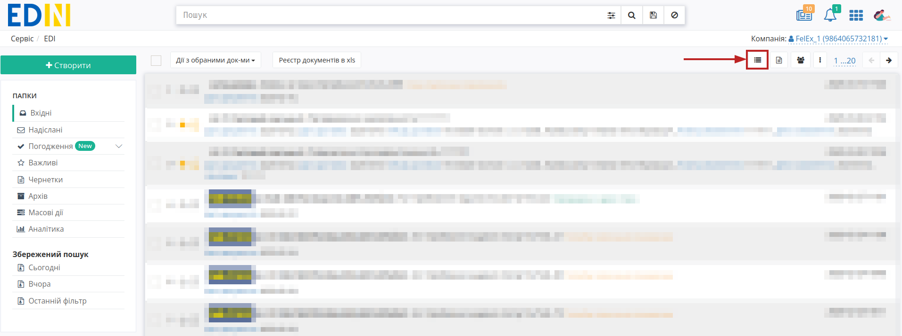

1. |compact| Компактний. За даного вигляду документи розміщені максимально щільно - список містять лише основну інфомацію (даний вид буде встановлений за замовчуванням):

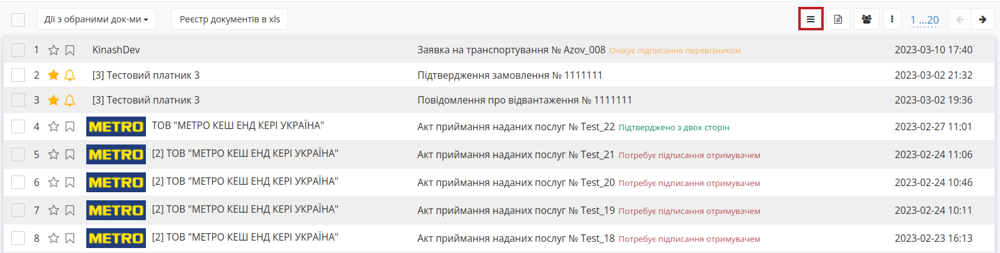

2. |detail| Докладний. При цьому виборі, на платформі буде відображатися вся додаткова інформація з документа.

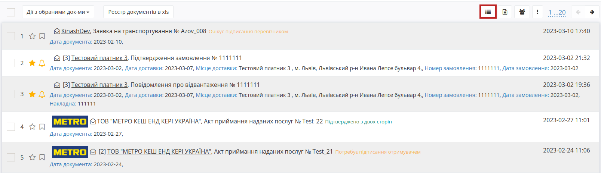

3. |tree| Деревовидний. Додатково будуть відображатися всі документи в ланцюжку.

.. image:: pics_rabota_s_platformoj_EDIN_2.0/111.png
   :align: center

4. |table| Таблиця. За табличного вигляду журнал документів займає більшу частину екрану, дані за документами поділені на колонки (Компанія, Тип, Номер документу, Інформація, Дата документу):

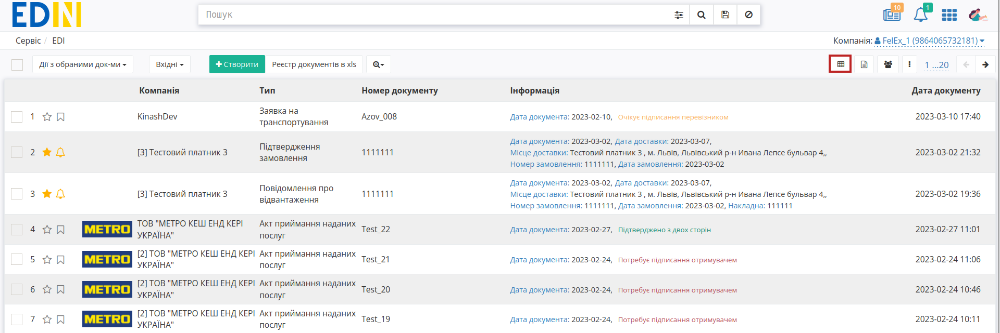

При цьому кнопка **"Створити"** та вибір розділу відображаються над табличною частиною журналу:

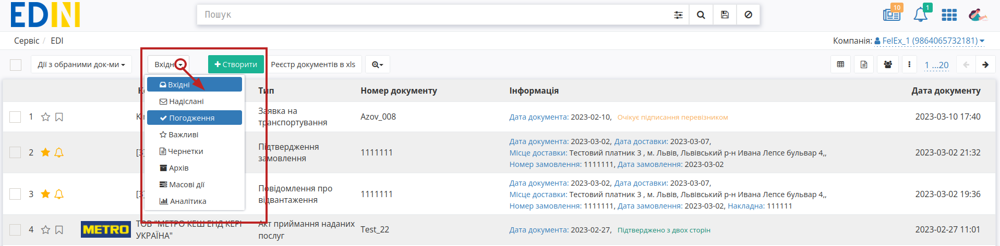

5. |universal| Універсальний. Універсальний вигляд має основні переваги всіх раніше перерахованих виглядів:

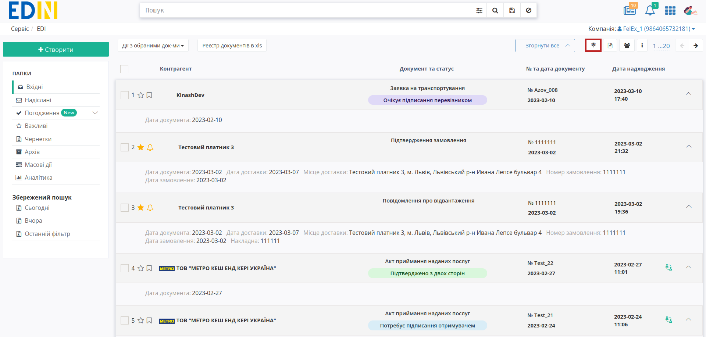

Деталі за кожним документом в журналі можливо приховати/відкрити кнопкою в кінці рядка документа окремо чи за всіма документами за допомогою кнопки **"Згорнути все"** / **"Розгорнути все"**:

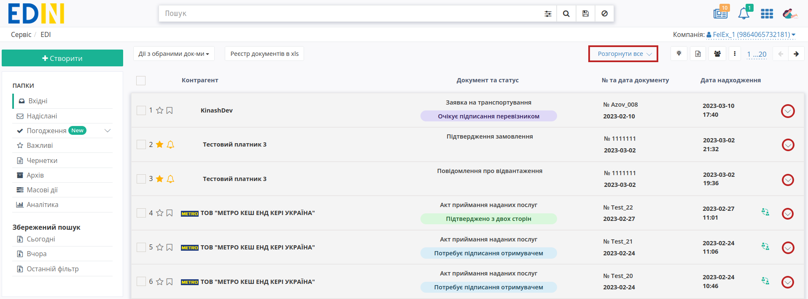

------------------------------------------------

Є кнопка-фільтр, що дозволяє відобразити в списку документи лише обраного типу:

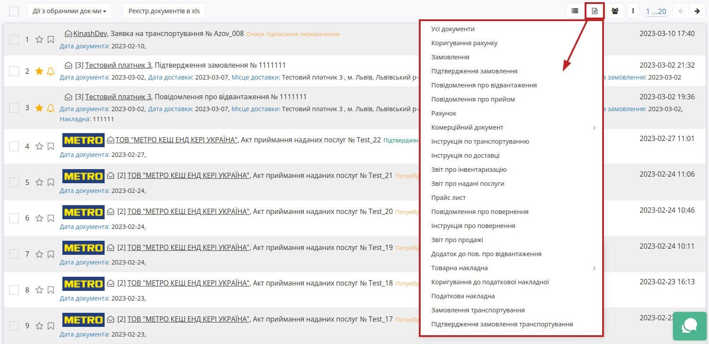

Також наявний фільтр, що дозволяє відібрати документи за **Роздрібною мережею** (присутній пошук за назвою чи GLN):

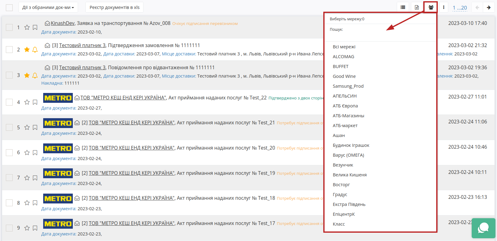

чи відфільтрувати документи за **статусом прочитання** (всі, прочитані або не прочитані):

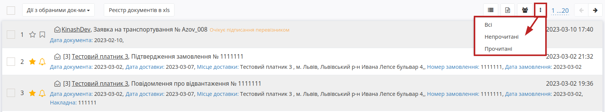

Також можливо вибрати кількість документів, що будуть відображатись в журналі на сторінці (20, 40, 60, 100), переходити на наступну/попередню сторінку журналу (ці кнопки також відобраються і в нижній частині екрану під сторінкою журналу).

.. _approval-no:

**8.1 Мітки, коментарі, інфо**
---------------------------------------------------------

У журналі документів є можливість відзначити документи, як **"Важливі"** (відмічені заповненою зірочкою |star|), подивитися коментарі в документі (|comment|), а також поставити мітки:

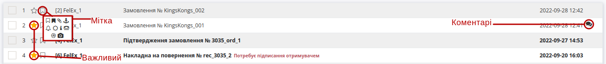

.. hint::
   При наведенні курсора на значок коментарів (|comment|) відображається їх кількість, а ознайомитись з коментарями можливо клікнувши на значок |comment|:

   .. image:: pics_rabota_s_platformoj_EDIN_2.0/rabota_s_platformoj_030.png
      :align: center

   ⠀⠀⠀⠀⠀⠀⠀⠀⠀

   .. image:: pics_rabota_s_platformoj_EDIN_2.0/rabota_s_platformoj_031.png
      :align: center

Для деяких документів можливо виконати відмову від підписання, анулювання, відкликання підпису. Такі документи мають помітку |bad_doc| , при натисканні на яку відображається вікно з інформаційними повідомленнями, наприклад, з текстом причини одного з контрагентів:

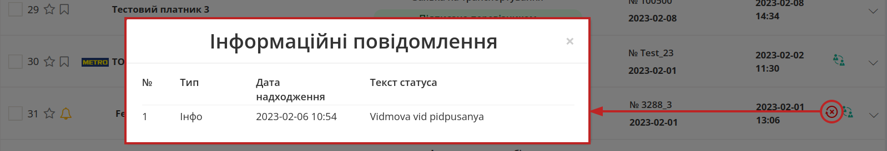

.. _doc-actions:

**9 Дії з документом**
================================================

При перегляді документа в залежності від його типу та статусу можливо:

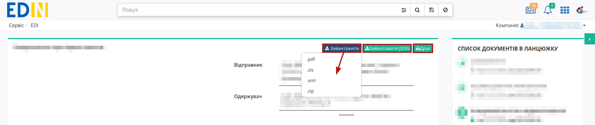

* **"Завантажити"** - завантажити документ в доступних для цього документа форматах:

   * .pdf;
   * .xls;
   * .xml;
   * .p7s;
   * .zip (архів містить всі доступні вище перераховані формати).
* **"Завантажити JSON"** - завантажити json тіла документа;
* **"Друк"** - роздрукувати документ.

.. _transport-search:

**9.1 Пошук транспорту (інтеграція з Lardi Trans)**
-------------------------------------------------------------------

.. include:: /Openprice/Instructions/Transport_Search.rst
   :start-after: .. початок блоку для TransportSearch
   :end-before: .. кінець блоку для TransportSearch

.. _doc-search:

**10 Пошук**
================================================

Пошук (за різними критеріями) на платформі **EDI Network** загалом виконується через рядок **"Пошуку"**:

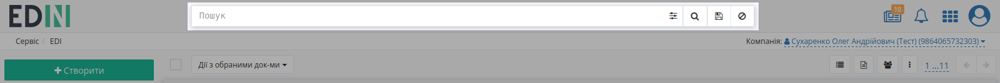

----------------------------------------------------------------------------------------------------

1) Рядок пошуку можливо заповнити, обираючи **"Доступні для пошуку ключі"**:

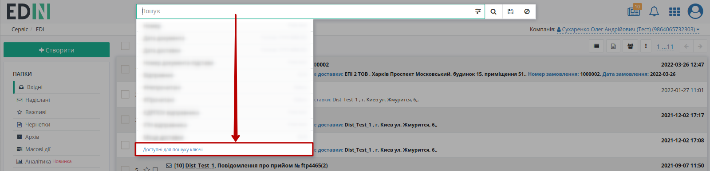

⠀⠀⠀⠀⠀⠀⠀⠀⠀

.. image:: pics_rabota_s_platformoj_EDIN_2.0/rabota_s_platformoj_013.gif
   :align: center

Після введення значення/-нь потрібно натиснути кнопку **"Пошук"** / |лупа| для пошуку. При поверненні "назад" при перегляді документа пошуковий запит зберігається - очистка рядка **"Пошуку"** відбувається за допомогою кнопки **"Скинути фільтри"** / |non|.

При ручному введенні значення система автоматично підказує ключі, що можуть бути застосовані до введеного значення (min 3 символи). При складному пошуку з багатьма ключами усі параметри повині бути розділені комами, наприклад, ``Номер: ftp545, #Замовлення,``:

.. image:: pics_rabota_s_platformoj_EDIN_2.0/rabota_s_platformoj_014.gif
   :align: center

2) Також заповнити рядок пошуку можливо за допомогою набору фільтрів **"Розширеного пошуку"** (|advserch|):

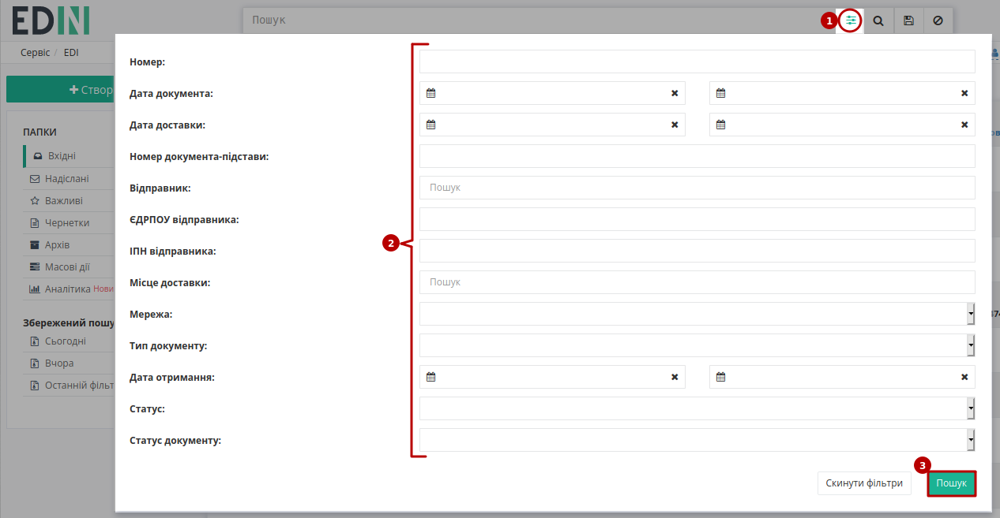

Деякі поля містять підказки, що показуються при наведенні курсора на назву параметра:

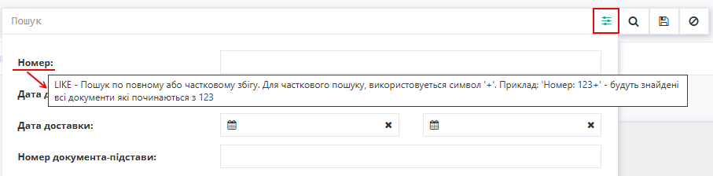

.. important::
   В залежності від папки, яку переглядає користувач, список ключів для пошуку, а також меню **"Розширеного пошуку"** будуть відрізнятись!

Пошук працює тільки за повним збігом.

.. _saved-search:

**10.1 Збережений пошук**
---------------------------------------------------------

Окремо винесені фільтри документів по даті (**"Сьогодні"**, **"Вчора"**), а останній введений пошук зберігається платформою автоматично і при натисканні кнопки **"Останній фільтр"** він виконується повторно в тій папці ("Вхідні" / "Надіслані" / "Важливі" / "Чернетки" / "Архів"), в якій він був виконаний останнього разу (Вас буде переадресовано):

.. image:: pics_rabota_s_platformoj_EDIN_2.0/rabota_s_platformoj_05n.png
   :align: center

Також можливо перманентно **Зберегти** данні власного рядку пошуку, натиснувши на іконку дискети:

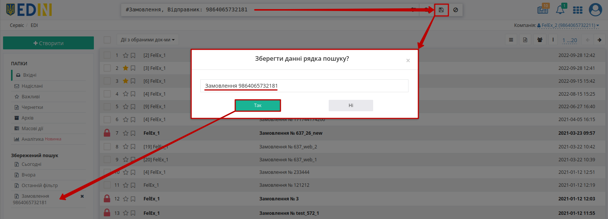

Також у блоці **"Збережений пошук"** за замовчуванням доступні фільтри по документам за "Сьогодні" та "Вчора". Вилучити раніше збережений пошук можливо за допомогою хрестика.

.. _advanced-search:

**10.2 Розширені можливості параметрів пошуку**
---------------------------------------------------------

У рядку пошуку є можливість обирати унікальні теговані параметри пошуку. Для цього в рядку вводимо символ ``#``. Після цього система видасть можливі критерії пошуку:

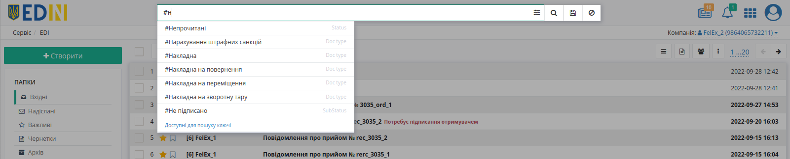

Типовими для платформи EDIN 2.0 є групи:

a) **#{Назва типу документа}** - пошук *за типом документа*. Наприклад: ``#Замовлення,``, ``#Акт звірки зведений,``...
b) **#{Назва статусу документа}** - пошук *за унікальним статусом документа*. Наприклад: ``#Прочитані,``, ``#ЗамовленняНаПеревезення,``...
c) **#{Назва періоду документа}** - пошук *за періодом створення документа*. Наприклад: ``#Сьогодні,`` - пошук всіх документів, в яких дата створення - поточна дата, ``#За місяць,`` - пошук всіх документів за поточний місяць...

---------------------------------------------------------

**10.2.1** **Номер** — пошук документа за номером:

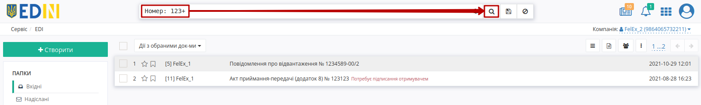

a) ``Номер: 123`` - знайти документ за конкретним номером;
b) ``Номер: 123+`` - знайти документ, номер якого починається на 123;
c) ``Номер: 123 + 22`` - знайти документ, номер якого починається на 123 та закінчується на 22, де між 123 і 22 може бути будь-який набір символів;
d) ``-Номер: 123`` - знайти всі документи, крім документа з номером 123;
e) ``-Номер: 123+`` - знайти всі документи, крім документа, номер якого починається на 123;
f) ``Номер: (123 & 234)`` - знайти документи з номерами 123 і 234.

---------------------------------------------------------

**10.2.2** **Дата** — пошук документа за датою документа (створення) / доставки / отримання:

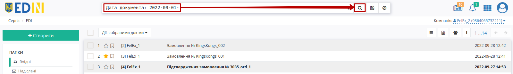

a) ``Дата документа: 2019-09-01`` - знайти всі документи за конкретною датою;
b) ``Дата документа: 2019-09-01-2019-09-04`` - знайти всі документи за період;
c) ``Дата документа: 2019-09-01-`` - знайти всі документи, починаючи з конкретної дати і закінчуючи сьогоднішнім днем;
d) ``Дата документа: -2019-09-01`` - знайти всі документи до зазначеної дати.

---------------------------------------------------------

**10.2.3** **GLN** — пошук документа за GLN:

a) ``Вантажовідправник: 9864067481452`` — знайти всі документи контрагента за допомогою пошукових елементів "Відправник", "Вантажовідправник", "Постачальник", "Одержувач", "Вантажоодержувач", "Замовник", "Покупець", "Виконавець", "Місце доставки" та GLN;
b) ``-Місце доставки: 9864067481452,`` - знайти всі документи контрагента, крім тих, що містять зазначений GLN.

---------------------------------------------------------

**10.2.4** **Мережа** — пошук документа за назвою мережі:

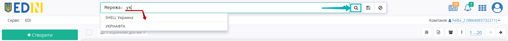

a) ``Мережа: АТБ,`` - пошук в обраному каталозі всіх документів з мережею АТБ;
b) ``Мережа: (Метро&Фозі&Фокстрот),`` - пошук в обраному каталозі всіх документів з мережами Метро, Фозі та Фокстрот.

.. _news:

**11 Новини**
================================================

Центр новин |news| - це загальне рішення для всієї платформи, що дозволяє в реальному часі отримувати новини для бізнесу (такі як відміна обовʼязкової реєстрації податкових, особливості використання КЕП та ін.). В новинах можуть бути посилання на презентації, інструкції чи відео. Цифрою в правому верхньому куті іконки відображається кількість непрочитаних новин, наприклад: |news_c|, що відображаються списком при натисканні на іконку новин: 

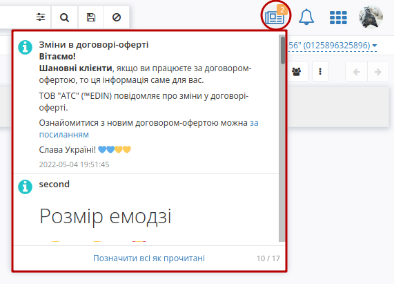

При перегляді новин відображається список з 10-ти останніх (попередні новини можливо переглянути за допомогою кнопки **"Показати ще"**).

.. _messages:

**12 Повідомлення**
================================================

Центр повідомлень |bell| - це загальне рішення для всієї платформи, що дозволяє в реальному часі отримувати повідомлення про надходження нового документа, відповіді на документ, зміну статусу документа чи важливі системні повідомлення. Детальніше про `"Керування сповіщеннями" <https://wiki.edin.ua/uk/latest/Personal_Cabinet/PCInstruction.html#user-notifications>`__ за подіями в сервісах за посиланням. Цифрою в правому верхньому куті іконки відображається кількість непрочитаних повідомлень, наприклад: |bell2|, що відображаються списком при натисканні на іконку дзвіночка: 

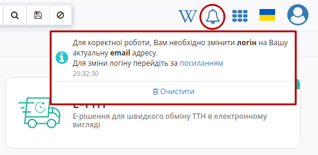

Всі прочитані повідомлення зберігаються лише на час Вашої сесії, однак при бажанні цей список можливо **"Очистити"** достроково відповідною кнопкою.

.. important::
   Повідомлення можуть приходити з різних сервісів та для різних GLN! Якщо Ви переходите за посиланням в повідомленні, то перехід до документа сервісу/GLN акаунта виконується автоматично!

.. _product-directory:

**13 Робота з товарним довідником**
================================================

Для додавання товару в довідник необхідно натиснути кнопку - **Додати товар**.

.. image:: pics_rabota_s_platformoj_EDIN_2.0/25.png
   :align: center

Потім потрібно заповнити обов'язкові поля в документі:

- Найменування.
- Штрих-код.
- Ціна без ПДВ.
- Одиниця виміру товару.
- Ставка ПДВ.
- Після заповнення натиснути кнопку - "**Додати товар**".

.. image:: pics_rabota_s_platformoj_EDIN_2.0/26.png
   :align: center

Після додавання товару він буде доступним в загальному списку довідника.

.. image:: pics_rabota_s_platformoj_EDIN_2.0/27.png
   :align: center

Щоб знайти потрібний товар у рядку пошуку потрібно ввести назву або штрих-код, або артикул товару.

Для редагування товару потрібно натиснути на його штрих-код.

Після внесення змін потрібно **зберегти зміни**.

.. image:: pics_rabota_s_platformoj_EDIN_2.0/28.png
   :align: center

Щоб знайти потрібний товар певної мережі необхідно обрати необхідну мережу:

.. image:: pics_rabota_s_platformoj_EDIN_2.0/36.png
   :align: center

Результат:

.. image:: pics_rabota_s_platformoj_EDIN_2.0/37.png
   :align: center

**Масове завантаження**

Для масового завантаження товарних позицій необхідно натиснути на кнопку "Масове завантаження" (1), після цього — "Завантажити позиції з Excel" (2).

.. hint:: Необхідний формат для завантаження товарного довідника — **.xls**

.. hint:: Для коректного завантаження товарних позицій необхідно натиснути на кнопку "Зберегти шаблон Excel" (3) та дотримуватись зазначених інструкцій (4).

.. image:: pics_rabota_s_platformoj_EDIN_2.0/38.png
   :align: center

Результат після завантаження:

.. image:: pics_rabota_s_platformoj_EDIN_2.0/40.png
   :align: center

Далі необхідно вибрати позиції для додавання у товарний довідник (є можливість вибрати всі або декілька позицій):

.. image:: pics_rabota_s_platformoj_EDIN_2.0/41.png
   :align: center

.. image:: pics_rabota_s_platformoj_EDIN_2.0/42.png
   :align: center

Далі необхідно вибрати певну мережу для додавання та натиснути кнопку "Створити":

.. image:: pics_rabota_s_platformoj_EDIN_2.0/43.png
   :align: center
   
.. image:: pics_rabota_s_platformoj_EDIN_2.0/44.png
   :align: center
   
Товари успішно додано у мережу:

.. image:: pics_rabota_s_platformoj_EDIN_2.0/45.png
   :align: center

Якщо в шапці завантаженого шаблону буде виявлена розбіжність, система надасть повідомлення про помилку:

.. image:: pics_rabota_s_platformoj_EDIN_2.0/39.png
   :align: center

.. _sign:

**Підписання на платформі "EDI Network"**
================================================

.. tabs::

   .. tab:: Файловий ключ

      .. include:: /_constant/signing/signing.rst
         :start-after: .. початок блоку для Signing
         :end-before: .. кінець блоку для Signing

   .. tab:: Token

      .. include:: /_constant/token_signing/token_signing.rst
         :start-after: .. початок блоку для TokenSign
         :end-before: .. кінець блоку для TokenSign

   .. tab:: Гряда

      .. include:: /_constant/gryada_signing/gryada_signing.rst
         :start-after: .. початок блоку для GryadaSign
         :end-before: .. кінець блоку для GryadaSign

   .. tab:: Cloud

      .. include:: /_constant/cloud_signing/cloud_signing.rst
         :start-after: .. початок блоку для CloudSign
         :end-before: .. кінець блоку для CloudSign

----------------------------
   
.. include:: /_constant/kontakti.rst
