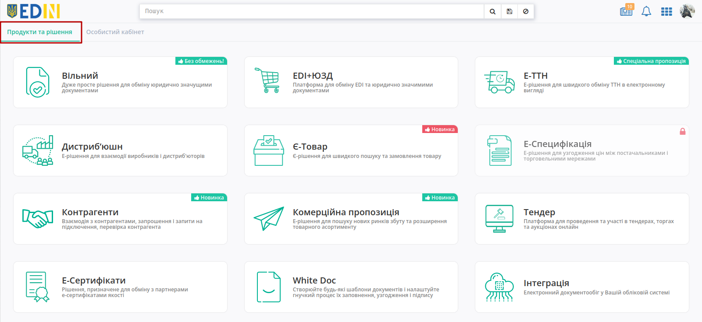
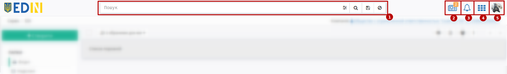
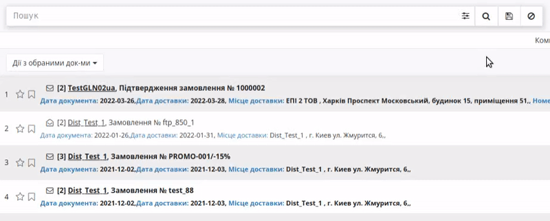

Робота з Платформою EDI Network
#################################

.. сюда закину немного картинок для текста

.. |пресуха| image:: pics_rabota_s_platformoj_EDIN_2.0/rabota_s_platformoj_03n.png

.. |advserch| image:: pics_rabota_s_platformoj_EDIN_2.0/rabota_s_platformoj_009.png

.. |non| image:: pics_rabota_s_platformoj_EDIN_2.0/rabota_s_platformoj_011.png

.. |лупа| image:: pics_rabota_s_platformoj_EDIN_2.0/rabota_s_platformoj_010.png

.. |bell| image:: pics_rabota_s_platformoj_EDIN_2.0/rabota_s_platformoj_021.png

.. |news| image:: pics_rabota_s_platformoj_EDIN_2.0/rabota_s_platformoj_023.png

.. |news_c| image:: pics_rabota_s_platformoj_EDIN_2.0/rabota_s_platformoj_022.png

.. role:: red

.. role:: underline

.. contents:: Зміст:
   :depth: 6

---------

**1 Вхід на платформу**
================================================

.. початок блоку для Enter

Для роботи з WEB сервісом Ви можете використовувати будь-який браузер (рекомендованим є **Google Chrome** останньої версії). Для входу до сервісу платформи необхідно перейти за посиланням https://edo-v2.edin.ua/auth .

При переході за вказаним посиланням відкриється вікно авторизації. Необхідно ввести Ваш логін і пароль користувача і натиснути **"Вхід"**, як це зазначено на зображенні нижче:

.. image:: /general_2_0/pics_rabota_s_platformoj_EDIN_2.0/rabota_s_platformoj_06n.png
   :align: center

.. hint::
   Нові користувачі можуть самостійно пройти "Реєстрацію" на платформі (детальніше в `інструкції <https://wiki.edin.ua/uk/latest/general_2_0/User_registration.html>`__)

.. кінець блоку для Enter

Після успішної авторизації відкриється основне меню продуктів та рішень для вибору сервісу платформи EDIN: **"Вільний", "EDI+ЮЗД", "Е-ТТН", "Дистриб'юшн", "Комерційна пропозиція", "Е-Специфікація", "Контрагенти", "Товари", "Tender", "Е-Сертифікати", "White Doc", "Інтеграція"**:

Розділ "Особистого кабінету" складається з розділів: **"Акаунт"** і **"Налаштування"**: 

.. image:: pics_rabota_s_platformoj_EDIN_2.0/rabota_s_platformoj_008.png
   :align: center

При переході до відповідного сервісу (продукту) відкривається інтерфейс відповідного сервісу для роботи.

.. hint::
    Для повернення до меню сервісів, товарного довідника потрібно натиснути кнопку |пресуха| або натиснувши на логотип EDIN

.. warning::
   При переході до деяких сервісів, коли авторизований користувач перевищує доступну кількість одночасних сесій (з різних пристроїв чи браузерів) платформа повідомляє про обмеження даного користувача:
   
   .. image:: pics_rabota_s_platformoj_EDIN_2.0/rabota_s_platformoj_002.png
      :align: center

   Детальніше про `Правила користування Платформою «EDI Network» <https://wiki.edin.ua/uk/latest/Legal_info/Rules.html#id5>`__. В особистому кабінеті в розділі `Баланс та вибір тарифу <https://wiki.edin.ua/uk/latest/Personal_Cabinet/PCInstruction.html#id5>`__ можливо розшири можливості взаємодії с сервісами, докупивши "Додаткові сесії".

.. _header:

**2 Загальний вигляд платформи**
================================================

Незалежно від сервісу, верхня панель складається з:

#. `Пошуковий рядок <https://wiki.edin.ua/uk/latest/general_2_0/rabota_s_platformoj_EDIN_2.0.html#doc-search>`__;
#. `Новини <https://wiki.edin.ua/uk/latest/general_2_0/rabota_s_platformoj_EDIN_2.0.html#news>`__;
#. `Повідомлення <https://wiki.edin.ua/uk/latest/general_2_0/rabota_s_platformoj_EDIN_2.0.html#messages>`__;
#. Меню сервісів - відкриває меню для переходу в сервіси платформи;
#. `Меню користувача <https://wiki.edin.ua/uk/latest/general_2_0/rabota_s_platformoj_EDIN_2.0.html#pers-settings>`__.

.. _pers-settings:

**3 Профіль користувача**
================================================

Клік на іконку користувача відкриває меню з налаштуваннями (налаштування акаунта/компаній описані в `інструкції "Особистого кабінету" <https://wiki.edin.ua/uk/latest/Personal_Cabinet/PCInstruction.html>`__):

.. image:: pics_rabota_s_platformoj_EDIN_2.0/rabota_s_platformoj_003.png
   :align: center

В профілі користувача відображаються:

1. "Налаштування користувача" - особисті дані користувача (Email, Прізвище, Ім'я, По батькові, Номер телефону, ІПН, Номер посвідчення водія). Обов'язкові до заповнення поля позначні червоною зірочкою :red:`*`. Користувач може доповнити/змінити інформацію про себе, а в "Додаткових налаштуваннях" можливо налаштувати відправку повідомлень на email.
2. Вибрати фотографію профілю, що буде відображатись замість стандартної іконки.
3. За потреби завжди можливо змінити пароль (не менше 8 символів).
4. "Перелік сесій користувача" дозволяє відслідковувати всі сесії користувача.

Також в профілі користувача в блоці Налаштувань користувача можуть відображатись підказки:

.. image:: pics_rabota_s_platformoj_EDIN_2.0/rabota_s_platformoj_005.png
   :align: center

.. hint::
   Для коректної роботи системи логін для входу на платформу повинен збігатись з Вашим актуальним email. Для користувачів, у яких логін відмінний передбачений функціонал для заміни:

При зміні Email користувача на вказаний (новий) Email потрібно ввести пароль поточного користувача (підтвердження дії) - на новий email відправляється лист для підтвердження поштової адреси.

**4 Вибір номера GLN організації**
================================================

Якщо користувачеві доступні номери GLN декількох організацій: для відкриття інформації потрібної Вам компанії необхідно вибрати відповідний номер GLN зі списку - "**Компанія**":

.. image:: pics_rabota_s_platformoj_EDIN_2.0/106.png
   :align: center

У рядку пошуку є можливість внести назву, або частину номера **GLN**. Система автоматично виконає пошук даного номера за назвою або частиною GLN-номера.

**5 Перегляд каталогів платформи**
================================================

При первинному вході на платформу буде виконаний вхід в каталог документів - "**Вхідні**".

.. image:: pics_rabota_s_platformoj_EDIN_2.0/107.png
   :align: center

Для переходу в потрібний Вам каталог необхідно його вибрати:

#. Каталог "Вхідні". В даному каталозі будуть розміщені всі вхідні документи для організації від контрагентів.
#. Каталог "Вихідні". В даному каталозі будуть розміщені всі відправлені документи для організації до контрагентів.
#. Каталог "Важливі". В даному каталозі будуть розміщені всі зазначені документи як важливі.
#. Каталог "Чернетки". В даному каталозі будуть розміщені всі документи які були створені, але не відправлені. 
#. Каталог "Архів". В даному каталозі будуть розміщені всі оброблені і архівні документи, які перенесені в архів.
#. Каталог "Пошук". В даному полі можна задати критерії пошуку документів. Результат пошуку буде відображатися в збереженому каталозі, який буде розміщений в полі - "Історія пошуку".

.. _doc-create:

**6 Створення документа**
================================================

Документи в сервісі можливо створювати "з нуля" за допомогою кнопки - **"Створити"**:

Після чого потрібно обрати тип створюваного документа (доступний пошук за назвою документа):

.. image:: pics_rabota_s_platformoj_EDIN_2.0/10.png
   :align: center

Також можливо створити документ на підставі "Вхідного" чи "Надісланого" документа прямо з форми перегляду документа. Для цього потрібно відкрити бажаний документ, натиснувши на нього в журналі документів (знайти потрібний документ зручно за допомогою `"Пошуку" <https://wiki.edin.ua/uk/latest/general_2_0/rabota_s_platformoj_EDIN_2.0.html#doc-search>`__).

.. include:: /_constant/chain/chain.rst
   :start-after: .. початок блоку для Chain
   :end-before: .. кінець блоку для Chain

**7 Перегляд документів на платформі**
================================================

Для перегляду документів необхідно перейти в потрібний каталог платформи.
У Вас є можливість вибрати **вид відображення документів**:

1. Компактний. Даний вид буде встановлений за замовчуванням.

.. image:: pics_rabota_s_platformoj_EDIN_2.0/109.png
   :align: center

2. Детальний. При цьому виборі, на платформі буде відображатися вся додаткова інформація з документа.

.. image:: pics_rabota_s_platformoj_EDIN_2.0/110.png
   :align: center

3. Дерево. Додатково будуть відображатися всі документи в ланцюжку.

.. image:: pics_rabota_s_platformoj_EDIN_2.0/111.png
   :align: center

4. Таблиця. На платформі у вигляді таблиці буде відображатися наступна інформація по документу: Компанія, Тип, Номер документу, Інформація, Дата документу.

.. image:: pics_rabota_s_platformoj_EDIN_2.0/112.png
   :align: center

У наступному рядку вибору є можливість використати фільтр в залежності від типу документів.

.. image:: pics_rabota_s_platformoj_EDIN_2.0/113.png
   :align: center

Також додані фільтри по **Роздрібним мережам**, і **статусу прочитання** документа: всі, прочитані або не прочитані.

.. image:: pics_rabota_s_platformoj_EDIN_2.0/114.png
   :align: center

.. image:: pics_rabota_s_platformoj_EDIN_2.0/115.png
   :align: center

Також можливо вибрати кількість документів, що будуть відображатись в журналі на сторінці (20, 40, 60, 100).

.. _doc-actions:

**8 Дії з документом**
================================================

При перегляді документа в залежності від його типу та статусу можливо:

* **"Скачати"** - завантажити документ в .pdf / .xls / .xml / .zip / .p7s форматах;
* **"Завантажити JSON"** - завантажити json тіла документа;
* **"Друк"** - розрукувати документ.

.. _transport-search:

8.1 Пошук транспорту (інтеграція з Lardi Trans)
-------------------------------------------------------------------

.. include:: /Openprice/Instructions/Transport_Search.rst
   :start-after: .. початок блоку для TransportSearch
   :end-before: .. кінець блоку для TransportSearch

.. _doc-search:

**9 Пошук документів**
================================================

Пошук документів на платформі **EDI Network** виконується через рядок **"Пошуку"**:

----------------------------------------------------------------------------------------------------

1) Рядок пошуку можливо заповнити, обираючи **"Доступні для пошуку ключі"**:

⠀⠀⠀⠀⠀⠀⠀⠀⠀

.. image:: pics_rabota_s_platformoj_EDIN_2.0/rabota_s_platformoj_013.gif
   :align: center

Після введення значення/-нь потрібно натиснути кнопку **"Пошук"** / |лупа| для пошуку. При поверненні "назад" при перегляді документа пошуковий запит зберігається - очистка рядка **"Пошуку"** відбувається за допомогою кнопки **"Скинути фільтри"** / |non|.

При ручному введенні значення система автоматично підказує ключі, що можуть бути застосовані до введеного значення (min 3 символи). При складному пошуку з багатьма ключами усі параметри повині бути розділені комами, наприклад, ``Номер: ftp545, #Замовлення,``:

2) Також заповнити рядок пошуку можливо за допомогою набору фільтрів **"Розширеного пошуку"** (|advserch|):

Деякі поля містять підказки, що показуються при наведенні курсора на назву параметра:

.. image:: pics_rabota_s_platformoj_EDIN_2.0/rabota_s_platformoj_016.png
   :align: center

.. important::
   В залежності від папки, яку переглядає користувач, список ключів для пошуку, а також меню **"Розширеного пошуку"** будуть відрізнятись!

Пошук працює тільки за повним збігом.

Окремо винесені фільтри документів по даті (**"Сьогодні"**, **"Вчора"**), а останній введений пошук зберігається платформою автоматично і при натисканні кнопки **"Останній фільтр"** він виконується повторно в тій папці ("Вхідні" / "Надіслані" / "Важливі" / "Чернетки" / "Архів"), в якій він був виконаний останнього разу (Вас буде переадресовано):

.. image:: pics_rabota_s_platformoj_EDIN_2.0/rabota_s_platformoj_05n.png
   :align: center

Також можливо перманентно **Зберегти** данні власного рядку пошуку, натиснувши на іконку дискети (1). Переглянути збережений пошук можливо в блоці "**Збережений пошук**" (2). Збережений пошук відноситься тільки до певного статусу документа: "Вхідні", "Вихідні". У блоці "Збережений пошук" за замовчуванням доступні фільтри по документам за сьогодні та вчора (3). Вилучити збережений пошук можна за допомогою хрестика (4).

.. image:: pics_rabota_s_platformoj_EDIN_2.0/031.png
   :align: center

**9.1 Детально про рядок пошуку та його можливості**
---------------------------------------------------------

1.  Номер — пошук документа за номером.

    a) "Номер: 123" - знайти документ за конкретним номером
    b) "Номер: 123+" - знайти документ, номер якого починається на 123
    c) "Номер: 123 + 22" - знайти документ, номер якого починається на 123 та закінчується на 22, де між 123 і 22 може бути будь-який набір символів
    d) "-Номер: 123" - знайти всі документи, крім документа з номером 123
    e) "-Номер: 123+" - знайти всі документи, крім документа, номер якого починається на 123
    f) "Номер: (123 & 234)" - знайти документи з номерами 123 і 234

.. image:: pics_rabota_s_platformoj_EDIN_2.0/033.png
   :align: center

2. Дата — пошук документа за датою.

.. hint:: Мається на увазі дата створення документа. Не плутати з датою поновлення документа, яка відображається у списку документів в ланцюжку.

    a) "Дата документа: 2019-09-01" - знайти всі документи за конкретною датою
    b) "Дата документа: 2019-09-01-2019-09-04" - знайти всі документи за період
    c) "Дата документа: 2019-09-01-" - знайти всі документи, починаючи з конкретної дати і закінчуючи сьогоднішнім днем
    d) "Дата документа: -2019-09-01" - знайти всі документи до зазначеної дати

.. image:: pics_rabota_s_platformoj_EDIN_2.0/034.png
   :align: center

3. GLN — пошук документа за GLN.

    a) "Вантажовідправник: 9864067481452" — знайти всі документи контрагента за допомогою пошукових елементів "Відправник", "Вантажовідправник", "Постачальник", "Одержувач", "Вантажоодержувач", "Замовник", "Покупець", "Виконавець", "Місце доставки" та GLN
    b) "-Місце доставки: 9864067481452," - знайти всі документи контрагента, крім тих, що містять зазначений GLN

.. image:: pics_rabota_s_platformoj_EDIN_2.0/035.png
   :align: center

4. Мережа — пошук документа за назвою мережі.

   a) "Мережа: АТБ," - пошук в обраному каталозі всіх документів з мережею АТБ;
   b) "Мережа: (Метро&Фозі&Фокстрот)," - пошук в обраному каталозі всіх документів з мережами Метро, Фозі та Фокстрот.

У рядку пошуку є можливість додавати додаткові критерії пошуку. Для цього в рядку вводимо символ "#". Після цього система видасть можливі критерії пошуку:

    a) #{Назва типу документа} - пошук за типом документа
       Приклад: "#Замовлення,".
    b) #{Назва статусу документа} - пошук за статусом документа
       Приклад: "#Відправлені,".
    c) #{Назва періоду документа} - пошук за періодом створення документа
       Приклад: #Сьогодні - пошук всіх документів, в яких дата створення - поточна дата, #За місяць - пошук всіх документів за поточний місяць

.. image:: pics_rabota_s_platformoj_EDIN_2.0/17.png
   :align: center

Необхідно вибрати потрібний Вам критерій. Якщо Вам вже відомий потрібний критерій, то можна вводити його назву, що скоротить коло пошуку.

5. У журналі документів є можливість відзначити документи, як **"Важливі"**. Подивитися коментарі в документі, а також поставити мітки.

.. image:: pics_rabota_s_platformoj_EDIN_2.0/20.png
   :align: center

.. _news:

**10 Новини**
================================================

Центр новин |news| - це загальне рішення для всієї платформи, що дозволяє в реальному часі отримувати новини для бізнесу (такі як відміна обовʼязкової реєстрації податкових, особливості використання КЕП та ін.). В новинах можуть бути посилання на презентації, інструкції чи відео. Цифрою в правому верхньому куті іконки відображається кількість непрочитаних новин, наприклад: |news_c|, що відображаються списком при натисканні на іконку новин: 

При перегляді новин відображається список з 10-ти останніх (попередні новини можливо переглянути за допомогою кнопки **"Показати ще"**).

.. _messages:

**11 Повідомлення**
================================================

Центр повідомлень |bell| - це загальне рішення для всієї платформи, що дозволяє в реальному часі отримувати повідомлення про надходження нового документа, відповіді на документ, зміну статусу документа чи важливі системні повідомлення. Цифрою в правому верхньому куті іконки відображається кількість непрочитаних повідомлень, наприклад: |bell2|, що відображаються списком при натисканні на іконку дзвіночка: 

.. image:: pics_rabota_s_platformoj_EDIN_2.0/rabota_s_platformoj_020.png
   :align: center

Всі прочитані повідомлення зберігаються лише на час Вашої сесії, однак при бажанні цей список можливо **"Очистити"** достроково відповідною кнопкою.

.. important::
   Повідомлення можуть приходити з різних сервісів та для різних GLN! Якщо Ви переходите за посиланням в повідомленні, то перехід до документа сервісу/GLN акаунта виконується автоматично!

.. _product-directory:

**12 Робота з товарним довідником**
================================================

Для додавання товару в довідник необхідно натиснути кнопку - **Додати товар**.

.. image:: pics_rabota_s_platformoj_EDIN_2.0/25.png
   :align: center

Потім потрібно заповнити обов'язкові поля в документі:

- Найменування.
- Штрих-код.
- Ціна без ПДВ.
- Одиниця виміру товару.
- Ставка ПДВ.
- Після заповнення натиснути кнопку - "**Додати товар**".

.. image:: pics_rabota_s_platformoj_EDIN_2.0/26.png
   :align: center

Після додавання товару він буде доступним в загальному списку довідника.

.. image:: pics_rabota_s_platformoj_EDIN_2.0/27.png
   :align: center

Щоб знайти потрібний товар у рядку пошуку потрібно ввести назву або штрих-код, або артикул товару.

Для редагування товару потрібно натиснути на його штрих-код.

Після внесення змін потрібно **зберегти зміни**.

.. image:: pics_rabota_s_platformoj_EDIN_2.0/28.png
   :align: center

Щоб знайти потрібний товар певної мережі необхідно обрати необхідну мережу:

.. image:: pics_rabota_s_platformoj_EDIN_2.0/36.png
   :align: center

Результат:

.. image:: pics_rabota_s_platformoj_EDIN_2.0/37.png
   :align: center

**Масове завантаження**

Для масового завантаження товарних позицій необхідно натиснути на кнопку "Масове завантаження" (1), після цього — "Завантажити позиції з Excel" (2).

.. hint:: Необхідний формат для завантаження товарного довідника — **.xls**

.. hint:: Для коректного завантаження товарних позицій необхідно натиснути на кнопку "Зберегти шаблон Excel" (3) та дотримуватись зазначених інструкцій (4).

.. image:: pics_rabota_s_platformoj_EDIN_2.0/38.png
   :align: center

Результат після завантаження:

.. image:: pics_rabota_s_platformoj_EDIN_2.0/40.png
   :align: center

Далі необхідно вибрати позиції для додавання у товарний довідник (є можливість вибрати всі або декілька позицій):

.. image:: pics_rabota_s_platformoj_EDIN_2.0/41.png
   :align: center

.. image:: pics_rabota_s_platformoj_EDIN_2.0/42.png
   :align: center

Далі необхідно вибрати певну мережу для додавання та натиснути кнопку "Створити":

.. image:: pics_rabota_s_platformoj_EDIN_2.0/43.png
   :align: center
   
.. image:: pics_rabota_s_platformoj_EDIN_2.0/44.png
   :align: center
   
Товари успішно додано у мережу:

.. image:: pics_rabota_s_platformoj_EDIN_2.0/45.png
   :align: center

Якщо в шапці завантаженого шаблону буде виявлена розбіжність, система надасть повідомлення про помилку:

.. image:: pics_rabota_s_platformoj_EDIN_2.0/39.png
   :align: center
   
----------------------------
   
.. include:: /_constant/kontakti.rst
