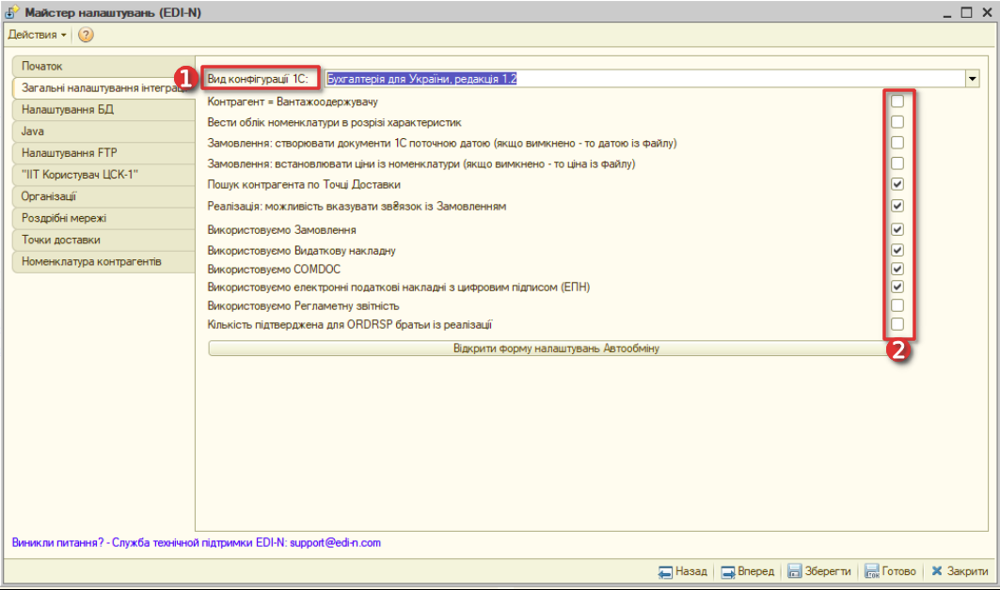
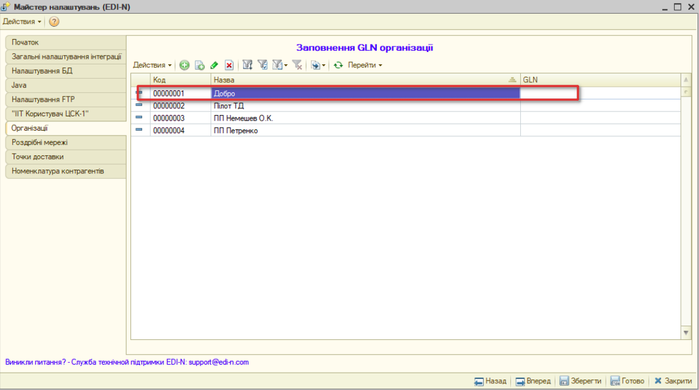

1C FTP Інструкція розробника
################################

Перший запуск і настройка модуля
================================================

1.1. Скопіюйте файл модуля інтеграції Integration_ (версія_модуля).epf і папку з інсталяціями необхідних програм / install / в загальний каталог.

З 1С-Підприємства запускаємо файл зовнішньої обробки **Integration_ (версія_модуля).epf** (Файл-> Відкрити)

.. image:: pics_prog_1C_FTP_integration/prog_1C_FTP_integration_001.png
   :align: center

Перший запуск і установку модуля рекомендується проводити користувачем з правами адміністратора.

1.2. З головного меню що з'явилося - «**Інтеграція EDI**» викликати «**Налаштування**»

.. image:: pics_prog_1C_FTP_integration/prog_1C_FTP_integration_002.png
   :align: center

1.3. В викликаному меню «**Інтеграція: Налаштування**» перейти в **Майстер налаштувань**:

.. image:: pics_prog_1C_FTP_integration/prog_1C_FTP_integration_003.png
   :align: center

1.4. У вікні Майстра налаштувань послідовно виконати налаштуваня у вкладках розташованих зліва:

.. image:: pics_prog_1C_FTP_integration/prog_1C_FTP_integration_004.png
   :align: center

1.5. У вкладці «**Загальні настройки інтеграції**» в випадаючому списку вибрати Вид конфігурації (1) в якій працює Ваша 1С.

Модуль також може підключатися і до нетипових конфігурацій. Для такого підключення, виберіть зі списку найбільш близьку конфігурацію. Кожен випадок вимагає індивідуальної перевірки на працездатність.

1.6. Представлені нижче налаштування (2) вибираються опціонально, в залежності від індивідуальних особливостей роботи постачальника.

Трохи докладніше про деякі з них:

**Контрагент = вантажоодержувачу** - встановлюється в залежності від вимог постачальника за вказівкою вантажоодержувача в замовленнях.

Вантажоодержувач - це елемент довідника контрагентів. У базі може створюватися:

- один контрагент і кілька точок доставки, які часто і є вантажоодержувачами (в такому випадку поле *Вантажоодержувач*, в довіднику *Точки доставки* заповнюється при необхідності);
- окремий контрагент на кожну точку доставки: вантажоодержувач підміняє контрагента;

Для вказівки вантажоодержувача як контрагента відзначте прапорець **Контрагент = Вантажоодержувач**. Таким чином, при імпорті замовлення контрагент підміняється на вантажоодержувача (якщо заповнене поле Вантажоодержувач).

**Вести облік в розрізі характеристик** - для постачальників, які використовують в обліку характеристики номенклатурних позицій.

**Пошук контрагента по Точці доставки** - під час завантаження замовлень ігнорується пошук контрагентів по GLN, відбувається пошук по точці доставки і встановлюється контрагент вказаний в довіднику Точки доставки. Під час вивантаження файлів пошук кодів по номенклатурі відбувається по контрагенту вказаною в документі.

1.7. Перейшовши у вкладку «**Налаштування БД**» майстра налаштувань, необхідно встановити ODBC драйвер для *SQLlite* натиснувши на відповідну кнопку.
 
.. image:: pics_prog_1C_FTP_integration/prog_1C_FTP_integration_007.png
   :align: center

Запуститься інсталятор ODBC драйвера, під час установки якого не міняйте параметри за замовчуванням (нічого додатково не вказуючи).

.. important :: В разі необхідності повторної установки драйвера необхідно видалити же встановлений драйвер за допомогою стандартних засобів видалення програм операційної системи.

Після успішної установки драйвера встановіть рядок підключення.

Після натискання кнопки вибору з'явиться системне вікно властивостей каналу передачі даних.

На закладці **З'єднання** в пункті **1. Джерело даних** встановіть перемикач на **Використовувати рядок з'єднання** і натисніть кнопку **Збірка ...**
 
.. image:: pics_prog_1C_FTP_integration/prog_1C_FTP_integration_009.png
   :align: center

У вікні вибору джерела даних на закладці **Джерело даних комп'ютера** виберіть **SQLite3 Datasource** і натисніть **ОК**.

.. image:: pics_prog_1C_FTP_integration/prog_1C_FTP_integration_010.png
   :align: center

У вікні налаштувань з'єднання ODBC-драйвера в поле **Database Name:** прописуємо шлях, де буде знаходитися файл з даними для інтеграції.

.. image:: pics_prog_1C_FTP_integration/prog_1C_FTP_integration_011.png
   :align: center

В поле **Database Name**: можна вписати неіснуюче ім'я файлу, який буде створений для бази даних SQLite.

Для повернення в вікно властивостей каналу передачі даних натисніть кнопку **ОК**.

Рядок з'єднання буде заповнено. Для тестування з'єднання з базою даних натисніть кнопку **Перевірити з'єднання**. Для повернення в вікно властивостей каналу передачі даних натисніть кнопку **ОК**.

.. image:: pics_prog_1C_FTP_integration/prog_1C_FTP_integration_012.png
   :align: center

На вкладці **Налаштування БД** рядок підключення і файл із зовнішнього базою даних будуть заповнені. Після цього створіть структуру бази даних, натиснувши на кнопку **Створити структуру БД**:

.. image:: pics_prog_1C_FTP_integration/prog_1C_FTP_integration_013.png
   :align: center

1.8. У вкладці **Java** майстра налаштувань необхідно вказати шлях до Java на Вашому ПК, якщо вона встановлена. В іншому випадку, необхідно спочатку її встановити.

.. image:: pics_prog_1C_FTP_integration/prog_1C_FTP_integration_014.png
   :align: center

1.9. У вкладці **Налаштування FTP** прописуємо шляхи до локальних каталогів для вхідних, вихідних і архівних документів, натиснувши «**Заповнити за замовчуванням**» або вказуємо їх вручну.

Вказуємо налаштування для сервера обміну і встановлюємо галочку навпроти «**Пасивний режим**»:

.. image:: pics_prog_1C_FTP_integration/prog_1C_FTP_integration_015.png
   :align: center

.. note :: Якщо планується працювати з великою кількістю документів, то при синхронізації на закачування нових документів може знадобитися більше часу (1С спочатку закачує, а потім обробляє Додані файли). Для прискорення процесу синхронізації можливо використовувати **FTP-клієнт**, який у фоновому режимі закачує файли і також автоматично відсилає файли, підготовлені до відправки. В цьому випадку FTP клієнт завантажує файли з сервера в локальний каталог, а 1С працює вже з локальними каталогами. Для активації цієї функції встановіть галочку навпроти «**Завантажувати файли з використанням локального каталогу**».

1.10. Налаштування на вкладці «**ІТТ Користувач ЦСК-1**» необхідно виконати в разі роботи з юридично значущими документами.
Їх опис можна знайти в розділі «**Налаштування та робота з юридично значущими документами**»

1.11. У вкладці **Організації** з переліку організацій виберіть необхідну.
 

По подвійному кліку по назві організації відкриється форма елемента Організації.

У формі натискаємо «**+**» і заповнюємо GLN організації, логін і пароль для підключення до FTP.
 
.. image:: pics_prog_1C_FTP_integration/prog_1C_FTP_integration_017.png
   :align: center

.. note :: **GLN** (англ. Global Location Number 'глобальний номер розташування') являє собою номер структури EAN / UCC-13 (з 13 цифр, остання - контрольна). GLN не містить в собі ніякої конкретної інформації, він забезпечує тільки унікальне посилання на суб'єкт господарювання або його виробничий або функціональний об'єкт.

Ваш GLN доступний Вам на веб-порталі в правому верхньому куті. Також ви можете дізнатися його в службі технічної підтримки або у свого менеджера.

Для роботи з електронним документообігом обов'язковою умовою є також заповнення GLN контрагентів з якими планується обмін документів.

Для цього з меню налаштувань інтеграції EDI необхідно перейти в довідник контрагентів натиснувши на кнопку «**Контрагенти**».

.. image:: pics_prog_1C_FTP_integration/prog_1C_FTP_integration_018.png
   :align: center

У формі списку Контрагенти виберіть контрагента з яким планується електронний документообіг.

По подвійному кліку на назву, викличте вікно форми елемента Контрагенти.

.. image:: pics_prog_1C_FTP_integration/prog_1C_FTP_integration_019.png
   :align: center

Заповніть GLN контрагента і активуйте типи документів, якими будете обмінюватися з даними контрагентом.

1.12. У довідник **Роздрібні мережі** вноситься інформація про роздрібні мережі, з якими планується проводити EDI-обмін. Цю інформацію можна отримати автоматично, натиснувши на кнопку **Завантажити роздрібні мережі з сервера**.

.. image:: pics_prog_1C_FTP_integration/prog_1C_FTP_integration_020.png
   :align: center

У завантаженому списку роздрібних мереж вибираємо найменування необхідної мережі, встановлюємо галочку в стовпці Стан, і в стовпці Контрагент вибираємо відповідного контрагента в формі списку контрагентів.

.. image:: pics_prog_1C_FTP_integration/prog_1C_FTP_integration_021.png
   :align: center

Після проставлення відповідності довідників натиснути на кнопку **Завантажити точки доставки з сервера** (автоматично заповниться довідник **Точки доставки**).

1.13. У розділі **Точки доставки** доступний список точок доставки завантажених раніше з сервера. Точки доставки також можна вносити в довідник вручну. Для цього натисніть «**+**» (Додати), відкриється форма елемента «**Контрагенти точки доставки**».

Далі слід вибрати необхідного контрагента в рядку «Контрагент» і заповнити інформацію по даній точці доставки.

.. image:: pics_prog_1C_FTP_integration/prog_1C_FTP_integration_022.png
   :align: center

1.14. У довідник **Номенклатура контрагентів** вноситься перелік номенклатури, яка братиме участь в документообігу із зазначеним контрагентом. Для коректної синхронізації товарних довідників в зазначеному регістрі **обов'язково (!)** повинні бути заповнені поля **Контрагент**, **Номенклатура**, **Одиниці виміру**, **Штрихкод номенклатури контрагента**. Список номенклатури, штрихкодів і одиниць вимірювання можна отримати безпосередньо у роздрібній мережі, з якої буде проводитися EDI-обмін.

.. image:: pics_prog_1C_FTP_integration/prog_1C_FTP_integration_023.png
   :align: center

.. note :: Для пошуку номенклатури також використовується поле Артикул номенклатури, а якщо встановлено прапорець **Вести облік номенклатури в розрізі характеристик** (див. Пункт Майстер настройки), то і за характеристиками.

Всі вищеописані довідники та настройки доступні з головного меню налаштувань.

.. image:: pics_prog_1C_FTP_integration/prog_1C_FTP_integration_024.png
   :align: center
