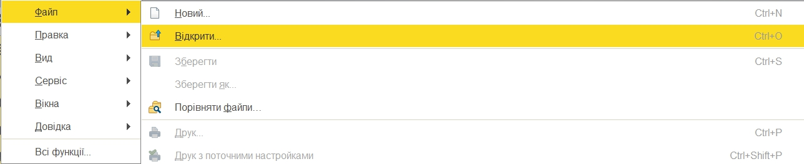
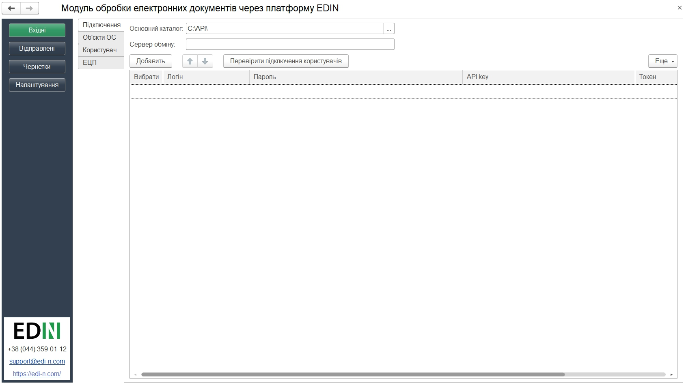
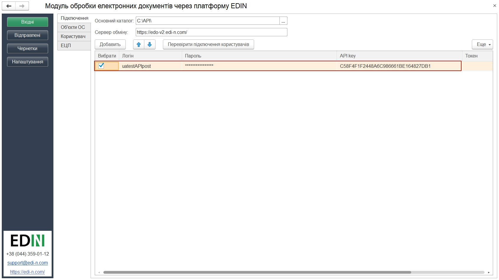
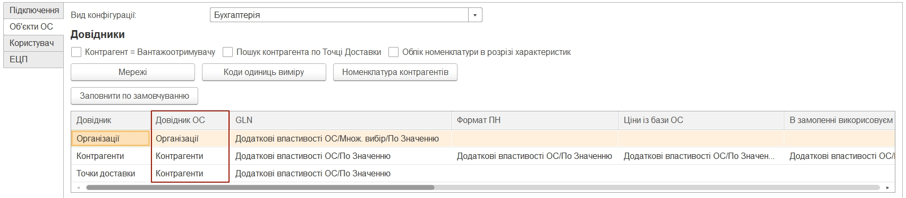
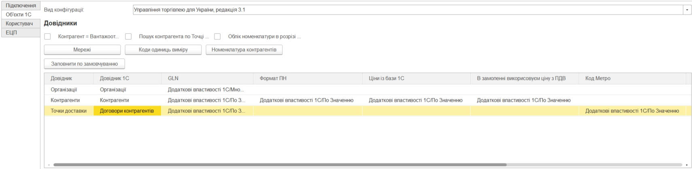
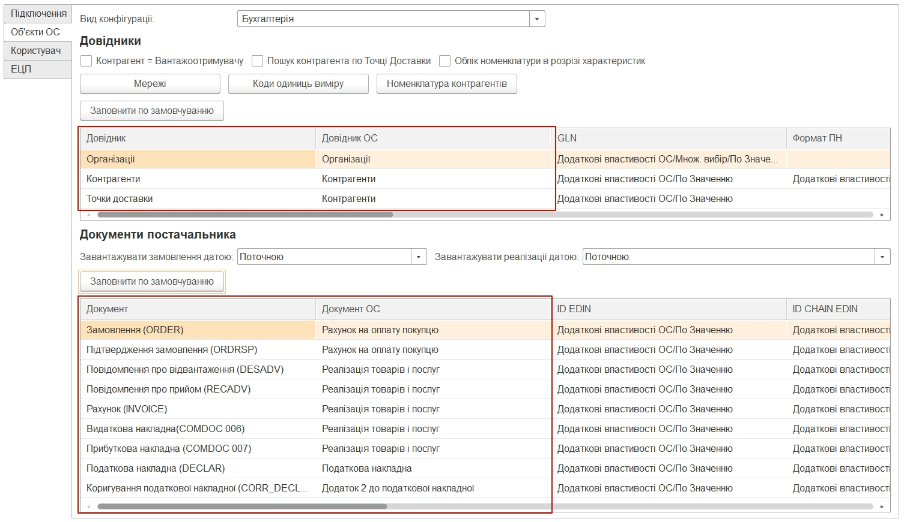
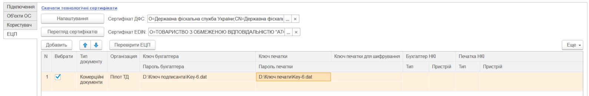

#################################################################################
Інструкція розробника. Первинні налаштування
#################################################################################

.. role:: underline

.. contents:: Зміст:
   :depth: 6

---------

Скорочення:

ОС - облікова система

ЕЦП - електронно-цифровий підпис/печатка

GLN - (Global Location Number) глобальний номер місцезнаходження

НКІ - носій конфіденційної інформації

---------

****************************************
**Перший запуск і налаштування модуля**
****************************************

Розроблений компанією EDIN інтеграційний модуль EDIN.API (в подальшому просто модуль) дозволяє працювати з обліковими системами 1С: Підприємство 8.Х :underline:`на звичайних та керованих формах` (надалі 1С) на базі операційної системи Windows.

Для роботи з модулем у користувача повинна бути підключена послуга для роботи з API. Для роботи з модулем користувачеві надаються логін, пароль і api_key:

- email - логін користувача;
- password - пароль користувача на платформі EDIN 2.0
- api_key - пароль доступу до API

Для запуску модуля необхідно в обліковій системі 1С відкрити файл запуску модуля (передається користувачеві співробітниками EDIN):

.. important:: У користувача повинні бути повні права на каталог, в якому знаходиться файл модуля

.. note:: Для 1С на керованих формах не потрібні права на каталог, в якому знаходиться обробка

При підключенні модуля облікова система 1С може вимагати від користувача дозвіл на виконання операцій з боку модуля (захист від небезпечних дій).

.. image:: pics_operator_instruction/operator_instruction_02.jpg
   :align: center

При першому запуску (відсутній **config.txt**) автоматично відкривається розділ "Налаштування" для введення всіх необхідних даних (надалі при запуску відкривається розділ "Вхідні"). У каталозі, в якому розташований файл модуля, автоматично створюються:
1) файл основних налаштувань **Config.txt**;
2) каталог з назвою поточного користувача 1С, в якому створюється файл налаштувань користувача **UserSettings.txt** 

.. note:: 
    Налаштування для 1С на керованих формах зберігаються у типовому довіднику 1С "Файли". Загальні налаштування зберігаються у елементі довіднику з назвою "EDIN_config", налаштування користувача зберігаються у елементі довідника із назвою "EDIN_UserSettings_" + Назва користувача інформаційної бази. При першому запуску (відсутній елемент довіднику "Файли"  з назвою "EDIN_config" ) автоматично відкривається розділ "Налаштування" для введення всіх необхідних даних (надалі при запуску відкривається розділ "Вхідні").  

********************
**"Налаштування"**
********************

Розділ містить 4 вкладки:

- **Підключення**
- **Об'єкти 1С**
- **Користувач**
- **ЕЦП**

**Підключення**
================

Основний каталог - місце розташування файлу модуля.

Сервер обміну - адреса платформи електронного документообігу (на цю адресу надсилаються запити модуля)

У цій вкладці додаються (кнопка «Додати») користувачі, для кожного вказуються свої **Логін (email) / Пароль / api_key**. У цій вкладці також здійснюється вибір користувачів, від імені яких будуть здійснюватися подальші дії, наприклад, запити на відображення Вхідних / Вихідних документів.  

Налаштування користувачів зберігаються в файлі **UserSettings**, який розміщується в підкаталозі (найменування = <користувач 1С>) на одному рівні з файлом запуску модуля.

.. note:: 
    Налаштування користувачів для 1С на керованих формах зберігаються у типовому довіднику 1С "Файли" у елементі довідника із назвою "EDIN_UserSettings_" + Назва користувача інформаційної бази. 

Після того, як дані користувачів були введені можливо здійснити перевірку (кнопка "Перевірити підключення користувачів") введених даних (по користувачам, у рядках яких встановлено відмітки в колонці "Вибрати"). В результаті перевірки отриманий токен свідчить про коректно заповнені дані, пройдену авторизацію на платформі електронного документообігу.

**Об'єкти 1С**
=====================

Для подальшої роботи з електронним документообігом необхідно провести синхронізацію модуля і 1С, а також здійснити налаштування збереження даних довідників і документів.

.. image:: pics_operator_instruction/operator_instruction_05n.jpg
   :align: center

Вид конфігурації - поле заповнюється автоматично (модуль підставляє поточну версію конфігурації ОС 1С).

.. important:: Подивитися версію своєї 1С: Меню -> Довідка -> Про програму. У разі якщо облікова система 1С самописна або модифікована, то необхідно вибрати типову версію 1С, на підставі якої вона була написана/змінена. Неправильно обраний вид конфігурації може привести до проблем створення документів з 1С.

.. image:: pics_operator_instruction/operator_instruction_06.jpg
   :align: center

Кнопки:
Мережі - відкриває вікно переліку всіх мереж, підключених до провайдера електронного документообігу. З цього переліку необхідно вибрати мережі (контрагентів) з якими користувач буде обмінюватися документами (вибір впливає на заповнення довідника **Контрагенти**).

Коди одиниць виміру - одиниці виміру, які повинні бути внесені в 1С (вказувати коди одиниць виміру необхідно в формі, яка відкривається при натисканні кнопки "Коди одиниць виміру").

.. image:: pics_operator_instruction/operator_instruction_20n.jpg
   :align: center

.. image:: pics_operator_instruction/operator_instruction_21n.jpg
   :align: center

Номенклатура контрагентів – кнопка відкриття об’єкту 1C, в якому зберігаються артикули і штрихкоди номенклатури контрагентів. В залежності від виду конфігурації назва колонки і відповідно об’єкт 1С можуть змінюватися. Для всіх конфігурацій на звичайних формах і для конфігурації "Бухгаглерія" на керованих формах використовується регістр відомостей «Номенклатура контрагентів». Для інших конфігурацій на керованих використовується довідник «Номенклатура постачальників».

**Налаштування довідників**
---------------------------

.. important:: Налаштування цього розділу рекомендовано виконувати володіючи знаннями досвідченного користувача або спільно з розробником 1С.

Для постачальників доступні 3 основні типи довідників (**Організації**, **Контрагенти**, **Точки доставки**), в які в ОС 1С будуть зберігатися власні дані користувача, дані контрагентів і їх точки доставки відповідно.

У цьому розділі для кожного довідника проводиться налаштування "місця розташування" зберігання даних (**GLN** (обов'язково), **Формат НН**, **Ціни з бази 1С**...) всередині облікової системи 1С. Можливо заповнити всі табличні налаштування розділу **"Довідники"** за замовчуванням (кнопка **"Заповнити за замовчуванням"**) або зробити всі налаштування **вручну**.

Принципи заповнення:  "По замовчуванню" і  "Ручний"
^^^^^^^^^^^^^^^^^^^^^^^^^^^^^^^^^^^^^^^^^^^^^^^^^^^^^^^^^^^^^^^^^

При заповненні перевагу необхідно надавати принципу **По замовчуванню**. Виконується при натисканні кнопки «Заповнити по замовчуванню». При заповненні автоматично обираються типові довідники конфігурації і тільки необхідні налаштування. Вибір розташування обмежений двома варіантами: «Додаткові відомості» і «Реквізити довідника». В залежності від конфігурації, в якій використовується інтеграція, визначаються доступні варіанти. При доступності обох варіантів збереження перевага надається «Додатковим відомостям», оскільки вони не вносять зміни до вже існуючих довідників ОС користувача, а дозволяють зберігати дані окремо (незалежно від інших компонентів програми).

При **ручному** налаштуванні в колонці «Довідник 1С» відображаються списки доступних довідників, а в полях налаштувань (через double-click по необхідному полю) відкривається окрема форма заповнення налаштувань.

.. important:: У табличній частині налаштування **"Довідник 1С"** і **"GLN"** є обов'язковими до заповнення. 

Приклад заповнення табличної частини налаштувань розділу **"Довідники"**:

При синхронізації з платформою електронного документообігу EDIN в ці довідники (**Організації**, **Контрагенти**, **Точки доставки**) автоматично підтягуються дані (перегляд/редагування через double-click). **Організації** наповнюються по користувацькому логіну (після успішної авторизації):

.. image:: pics_operator_instruction/operator_instruction_10n.jpg
   :align: center

В довіднику **Контрагенти** відображаються юридичні особи і точки доставки контрагентів, для яких можливо проставити додаткові налаштування:

.. image:: pics_operator_instruction/operator_instruction_11n.jpg
   :align: center

Довідник **Точки доставки** відрізняється від останнього наповненням колонок, відповідно до вимог EDI документообігу.

**Налаштування документів**
---------------------------

.. important:: Налаштування цього розділу рекомендовано виконувати володіючи знаннями досвідченного користувача або спільно з розробником 1С.

У цьому розділі для кожного типу документа проводиться налаштування "місця розташування" зберігання даних документів в УС 1С. Налаштування також можливо проводити **По замовчуванню** (кнопка **"Заповнити за замовчуванням"**) та **вручну** через double-click. `Принципи заповнення:  "По замовчуванню" і  "Ручний"`_ табличної частини аналогічні налаштуванням довідників. 

Створення документів в 1С залежить від виду конфігурації. **1С Бухгалтерія** на звичайних і керованих формах дозволяє створювати **"Рахунок на оплату покупця"**, **"Реалізація товарів і послуг"**. Інші 1С (НЕ БУХГАЛТЕРІЯ) на звичайних формах дозволяють створити "Замовлення покупця", "Реалізація товарів і послуг". В **1С Управління** невеликою фірмою і **Управління середнім бізнесом** на керованих формах можливо створити "Замовлення клієнта", "Видаткову накладну". Для **1С Управління торгівлею**,  **Управління підприємством**, **Управління виробничим підприємством** можливо створити **"Замовлення клієнта"** и **"Реалізація товарів і послуг"**:

.. container:: user

**Користувач**
=====================

Розділ в якому користувач може вибрати шлях локального сховища, в якому будуть зберігатися вхідні / вихідні ЮЗД документи, а також логи роботи модуля (аналіз документообігу). Поля **Склад** і **Підрозділ** також заповнюються для зручності користувача. 

Проставлена відмітка в налаштуваннях "Тестовий режим" - додатково при відправці документу направляє його в "Чернетки" (розділ, що містить створені, але ще не відправлені документи).

Такі налаштування дозволяють співробітнику (наприклад недосвідченому чи без ЕЦП) створювати документи, а безпосередньою перевіркою/відправкою вже займається бухгалтер/керівник чи інший відповідальний співробітник.

.. image:: pics_operator_instruction/operator_instruction_13.jpg
   :align: center

.. container:: etsp

**ЕЦП**
=====================

Розділ настройки електронно-цифрового підпису і печатки (ЕЦП), в якому зазначаються сертифікати ДФС (знаходяться у вільному доступі) і EDIN (надається співробітником компанії).

У таблицю через кнопку **"Додати"** можливо вности або шляхи до ключів бухгалтера і печатки для організацій, по яким планується вивантаження юридично значимих документів або вказати токен (НКІ). Якщо вказано шлях до файлу (ключа) і токену, то пріоритет надається файлу. Налаштування для токену ("Тип пристрою" та "Пристрій" (серійний номер часто вказується на фізичному носії)) можливо вибрати зі списку або скористатись автоматичним підбором налаштувань.

.. important:: Деякі оператори АЦСК розділяють розділяють ЕЦП на "ключ печатки" та "ключ печатки для шифрування". В такому випадку потрібно вносити в налаштування три ключа. "Ключ печатки для шифрування" використовується лише при відправці "Податкової накладної". 

При вивантаженні юридично значимих документів паролі можна вносити або до таблиці, або обробка відобразить вікно для їх внесення перед початком підписання. Кнопка **"Перевірити ЕЦП"** дозволяє перевірити коректність введених даних ключів і паролів перед початком підписання. 

Модуль дозволяє зберігати будь-яку кількість наборів ключів, але на момент підписання по одній організації і типу документу необхідно вибрати (встановити прапорець в колонці "Вибрати") тільки одну пару ключів.

При виявленні помилки при перевірці модуль попросить повторно ввести пароль:

.. image:: pics_operator_instruction/operator_instruction_15.jpg
   :align: center

При кожній перевірці ключа у вікні повідомлень відображається опис результату виконаної перевірки.

********************
**Додатково**
********************

`Опис конфігураційного файлу Config.txt модуля для інтеграції з платформою EDIN 2.0 <https://wiki.edi-n.com/uk/latest/integration_2_0/1C_integration_2_0/1C_API_integration_2_0/config_description.html>`__ .

`Опис файлу користувацьких налаштувань UserSettinsg.txt модуля для інтеграції з платформою EDIN 2.0 <https://wiki.edi-n.com/uk/latest/integration_2_0/1C_integration_2_0/1C_API_integration_2_0/UserSettings_description.html>`__ .

.. include:: kontakti.rst
