#################################################################################
Інструкція оператора (користувача). Первинні налаштування
#################################################################################

.. contents:: Зміст:
   :depth: 6

---------

Скорочення:

ОС - облікова система

ЕЦП - електронно-цифровий підпис/печатка

GLN - (Global Location Number) глобальний номер місцезнаходження

---------

****************************************
**Перший запуск і налаштування модуля**
****************************************

Розроблений компанією EDIN інтеграційний модуль EDIN.API (в подальшому просто модуль) дозволяє працювати з обліковими системами 1С: Підприємство 8.Х (надалі 1С) на базі операційної системи Windows.
Для роботи з модулем у користувача повинна бути підключена послуга для роботи з API. Для роботи з модулем користувачеві надаються логін, пароль і api_key:

- email - логін користувача;
- password - пароль користувача на платформі EDIN 2.0
- api_key - пароль доступу до API

Для запуску модуля необхідно в обліковій системі 1С відкрити файл запуску модуля (передається користувачеві співробітниками EDIN):

.. image:: pics_operator_instruction/operator_instruction_01.jpg
   :align: center

.. important:: У користувача повинні бути повні права на каталог, в якому знаходиться файл модуля 

При підключенні модуля облікова система 1С може вимагати від користувача дозвіл на виконання операцій з боку модуля (захист від небезпечних дій).

.. image:: pics_operator_instruction/operator_instruction_02.jpg
   :align: center

При першому запуску (відсутній **config.txt**) автоматично відкривається розділ "Налаштування" для введення всіх необхідних даних (надалі при запуску відкривається розділ "Вхідні"). У каталозі, в якому розташований файл модуля автоматично створюється файл, в який зберігаються введені дані. 

********************
**"Налаштування"**
********************

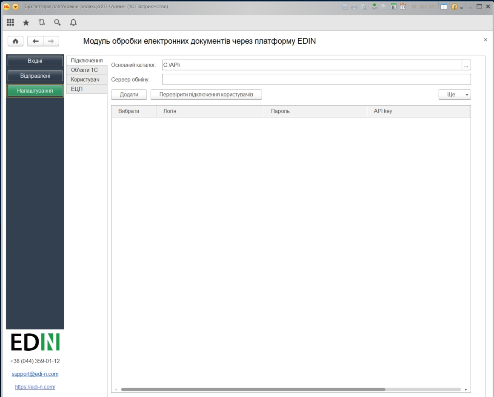

Розділ містить 4 вкладки:

- **Підключення**
- **Об'єкти 1С**
- **Користувач**
- **ЕЦП**

**Підключення**
================

Основний каталог - місце розташування файлу модуля.

Сервер обміну - адреса платформи електронного документообігу (на цю адресу надсилаються запити модуля)

У цій вкладці додаються (кнопка "Додати") користувачі, для кожного вказуються свої email / password / api_key. У цій вкладці також здійснюється вибір користувачів, від імені яких будуть здійснюватися подальші дії, наприклад, запити на відображення Вхідних / Вихідних документів.  

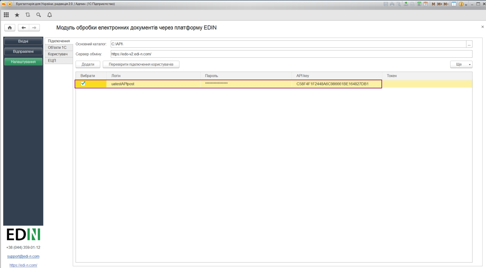

Налаштування користувачів зберігаються в файлі **UserSettings**, який розміщується в підкаталозі (найменування = <користувач 1С>) на одному рівні з файлом запуску модуля.

Після того, як дані користувачів були введені можливо здійснити перевірку (кнопка "Перевірити підключення користувачів") введених даних. В результаті перевірки отриманий токен свідчить про коректно заповнені дані, пройдену авторизацію на платформі електронного документообігу.

**Об'єкти 1С**
=====================

Для подальшої роботи з електронним документообігом необхідно провести синхронізацію модуля і 1С, а також здійснити налаштування збереження даних довідників і документів.

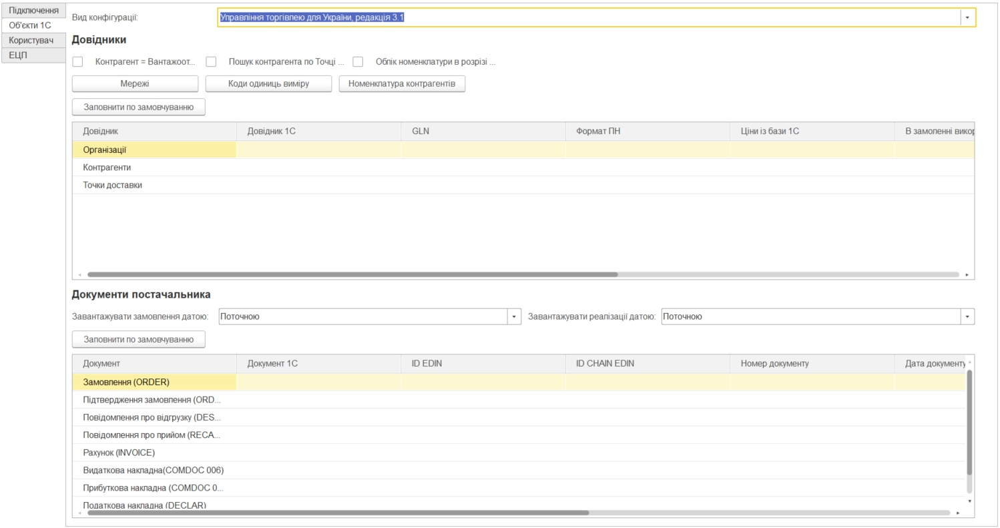

Вид конфігурації - поле заповнюється автоматично (модуль підставляє поточну версію конфігурації ОС 1С).

.. important:: Подивитися версію своєї 1С: Меню -> Довідка -> Про програму. У разі якщо облікова система 1С самописна або модифікована, то необхідно вибрати типову версію 1С, на підставі якої вона була написана/змінена. Неправильно обраний вид конфігурації може привести до проблем створення документів з 1С.

.. image:: pics_operator_instruction/operator_instruction_06.jpg
   :align: center

Кнопки:
Мережі - відкриває вікно переліку всіх мереж, підключених до провайдера електронного документообігу. З цього переліку необхідно вибрати мережі (контрагентів) з якими користувач буде обмінюватися документами (вибір впливає на заповнення довідника **Контрагенти**).

Коди одиниць виміру - одиниці виміру, які повинні бути внесені в 1С (вказувати коди одиниць виміру необхідно в формі, яка відкривається при натисканні кнопки "Коди одиниць виміру").

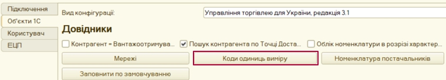

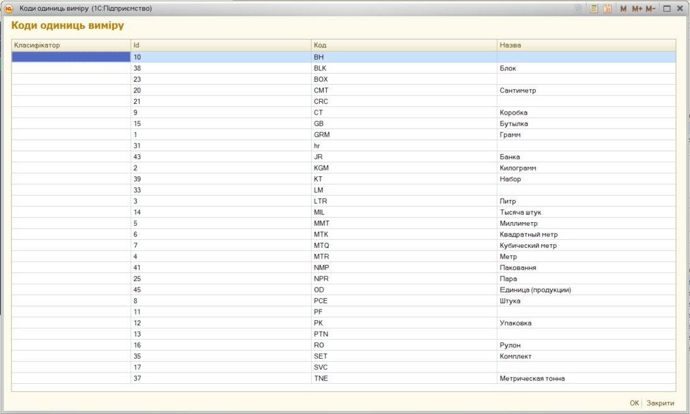

Номенклатура контрагентів - регістр відомостей товарів контрагентів на довідник Номенклатура постачальників.

**Налаштування довідників**
---------------------------

.. important:: Налаштування цього розділу рекомендовано виконувати володіючи знаннями просунутого користувача або спільно з розробником 1С.

Для постачальників доступні 3 основні типи довідників (**Організації**, **Контрагенти**, **Точки доставки**), в які в ОС 1С будуть зберігатися власні дані користувача, дані контрагентів і їх точки доставки відповідно.

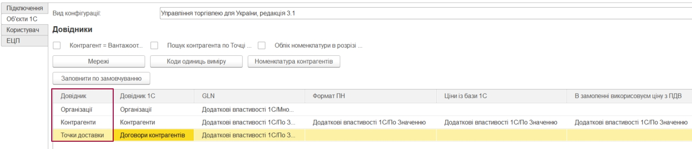

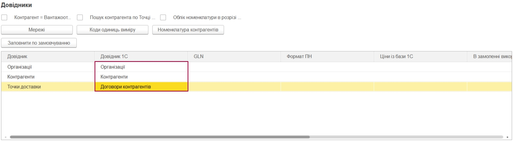

У цьому розділі для кожного довідника проводиться настройка "місця розташування" зберігання даних (**GLN** (обов'язково), **Формат НН**, **Ціни з бази 1С**...) всередині облікової системи 1С. Можливо заповнити всі табличні настройки розділу **"Довідники"** за замовчуванням (кнопка **"Заповнити за замовчуванням"**) або зробити всі налаштування **вручну**.

_`Принцип **ручного** і **автоматичного** заповнення`

При **ручному** налаштуванню (через double-click по необхідному полю) відкривається список довідників для вибору.

При **автоматичному** налаштуванні вибір розташування збереження даних довідників умовно зводиться до вибору **"реквізитів довідника"** 1С чи **"додаткових відомостей"**. При цьому більш пріоритетним (якщо дозволяє ОС) є **"додаткові відомості"**, так як вони не вносять зміни до вже існуючих довідників ОС користувача, а дозволяють зберігати дані окремо (незалежно від інших компонентів програми).

.. important:: У табличній частині налаштування **"Довідник 1С"** і **"GLN"** є обов'язковими до заповнення. 

Приклад заповнення табличної частини налаштувань розділу **"Довідники"**:

.. image:: pics_operator_instruction/operator_instruction_08.jpg
   :align: center

При синхронізації з платформою електронного документообігу EDIN в ці довідники (**Організації**, **Контрагенти**, **Точки доставки**) автоматично підтягуються дані (перегляд/редагування через double-click). **Організації** наповнюються по користувацькому логіну (після успішної авторизації):

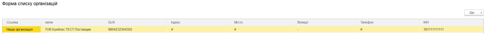

В довіднику **Контрагенти** відображаються юридичні особи і точки доставки контрагентів, для яких можливо проставити додаткові налаштування:

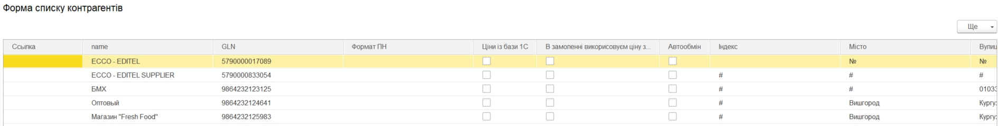

Довідник **Точки доставки** відрізняється від останнього наповненням колонок, відповідно до вимог EDI документообігу.

**Налаштування документів**
---------------------------

.. important:: Налаштування цього розділу рекомендовано виконувати володіючи знаннями просунутого користувача або спільно з розробником 1С.

У цьому розділі для кожного типу документа проводиться налаштування "місця розташування" зберігання даних документів в УС 1С. Налаштування також можливо проводити **автоматично** (кнопка **"Заповнити за замовчуванням"**) та **вручну** через double-click. `Принцип **ручного** і **автоматичного** заповнення`_ табличної частини аналогічний налаштуванню довідників. 

Створення документів в 1С залежить від виду конфігурації. **1С Бухгалтерія** на звичайних і керованих формах дозволяє створювати **"Рахунок на оплату покупця"**, **"Реалізація товарів і послуг"**. Інші 1С (НЕ БУХГАЛТЕРІЯ) на звичайних формах дозволяють створити "Замовлення покупця", "Реалізація товарів і послуг". В **1С Управління** невеликою фірмою і **Управління середнім бізнесом** на керованих формах можливо створити "Замовлення клієнта", "Видаткову накладну". Для **1С Управління торгівлею**,  **Управління підприємством**, **Управління виробничим підприємством** можливо створити **"Замовлення клієнта"** и **"Реалізація товарів і послуг"**:

.. image:: pics_operator_instruction/operator_instruction_12.jpg
   :align: center

**Користувач**
=====================

Розділ в якому користувач може вибрати шлях локального сховища, в якому будуть зберігатися вхідні / вихідні ЮЗД документи, а також логи роботи модуля (аналіз документообігу). Поля **Склад** і **Підрозділ** також заповнюються для зручності користувача.

.. image:: pics_operator_instruction/operator_instruction_13.jpg
   :align: center

**ЕЦП**
=====================

Розділ настройки електронно-цифрового підпису і печатки (ЕЦП), в якому зазначаються сертифікати ДФС (знаходяться у вільному доступі) і EDIN (надається співробітником компанії).

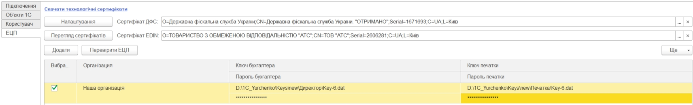

У таблицю вносяться (кнопка **"Додати"**) шляхи до ключів бухгалтера і печатки для кожного користувача (повинна бути підключена послуга для роботи з API). Під кожним ключем необхідно ввести пароль. Кнопка **"Перевірити ЕЦП"** дозволяє перевірити коректність введених даних. 

Модуль дозволяє зберігати будь-яку кількість наборів ключів, але на момент підписання по одній організації необхідно вибрати (встановити прапорець в колонці "Вибрати") тільки одну пару ключів.

При виявленні помилки при перевірці модуль попросить повторно ввести пароль:

.. image:: pics_operator_instruction/operator_instruction_15.jpg
   :align: center

При кожній перевірці ключа у вікні повідомлень відображається опис результату виконаної перевірки.

********************
**"Вхідні"**
********************

Розділ вхідних документів (від контрагентів). Список документів можливо відфільтрувати за повним номером документа (поле номер). Для зручності у **Вхідних** (тільки для документа Замовлення) проставлялись позначки про відправлені у відповідь документи:

.. image:: pics_operator_instruction/operator_instruction_16.jpg
   :align: center

У розділі присутні кнопки оновлення списку документів (оновлення вхідних документів з платформи електронного документообігу та довантаження створених документів з 1С).

.. important:: Попередньо перед створенням документів необхідно обов'язково переконатися, що вказані відповідні GLN з довідниками 1С.

Для створення відповідного документа 1С необхідно **Вибрати** вхідний документ і вибрати тип відповідного документа під кнопкою **Створити**:

.. image:: pics_operator_instruction/operator_instruction_17.jpg
   :align: center

При створенні документа модуль автоматично підтягує всі необхідні дані, проте якщо номенклатура була знайдена не вся - модуль відкриває вікно **"Незнайдена номенклатура"** для додавання і збереження номенклатури в довіднику:

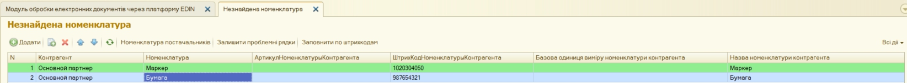

Для відправки документа у відповідь необхідно вибрати документ в колонці **"Документ 1С"**, зробити позначку навпроти вхідного документа (колонка **"Вибрати"**) і натиснути **"Відправити"**:

.. image:: pics_operator_instruction/operator_instruction_19.jpg
   :align: center

 
