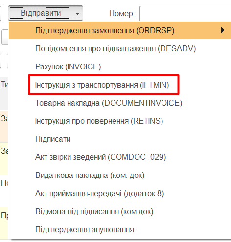

#################################################################################
Інструкція користувача
#################################################################################

.. картинки:

.. |refresh| image:: pics_user_instruction/user_instruction_04.jpg

.. contents:: Зміст:
   :depth: 6

---------

Скорочення:

ОС - облікова система

ЕЦП - електронно-цифровий підпис/печатка

GLN - (Global Location Number) глобальний номер місцезнаходження

EDI - (Electronic Data Interchange) електронний обмін данними; тут мається на увазі не ЮЗ документообіг.

ЮЗД - юридично значимий документ/документообіг

---------

****************************************
**Робота з модулем**
****************************************

1. Вступ
==========================

Дана інструкція описує роботу з інтеграційним модулем EDIN для облікової системи (далі ОС). Інтеграційний модуль являє собою зовнішню обробку для інтеграції електронного документообігу між обліковою системою користувача та платформою EDIN. Модуль інтеграції створено для типових конфігурацій ОС, але також є можливість налаштування під нестандартні конфігурації. Для роботи з документами меню інтеграційного модуля розділено на:

* **"Вхідні"** - розділ для роботи з вхідними документами;
* **"Відправлені"** - розділ для роботи з вихідними документами;
* **"Чернетки"** - розділ для роботи зі створеними / підписаними, але ще не відправленими документами;
* **"Архів"** - розділ для архівних документів.

.. hint::
    Розділ **"Налаштування"** описано в `Інструкції оператора. Первинні налаштування <https://wiki.edin.ua/uk/latest/integration_2_0/1C_integration_2_0/1C_API_integration_2_0/operator_instruction.html#id4>`__

.. image:: pics_user_instruction/user_instruction_01.jpg
   :align: center

2. "Вхідні"
================

Розділ вхідних документів (від контрагентів) при запуску модуля відкривається за замовчуванням. В журналі документів відображаються всі вхідні документи за датою їх отримання. Список документів можливо відфільтрувати за датою документа (поля "Дата з" / "по"), повним номером документа (поле номер). Також можливо налаштувати кількість документів, що будуть виводитись на одній сторінці журналу (пагінація) - це дозволяє пришвидшити завантаження сторінки та роботу з новими документами.

.. image:: pics_user_instruction/user_instruction_02.jpg
   :align: center

.. important::
    У **"Вхідних"/"Відправлених"** в списку журналу відображається документ, що є **останнім** в "ланцюжку документів" (документи, що логічно об'єднані між собою). В журналі документів для зручності проставляються позначки про наявність відповідних типів документів в ланцюжку.

.. image:: pics_user_instruction/user_instruction_03.jpg
   :align: center

Через подвійний клік лівою кнопкою мишки по номеру/даті документу можливо відкрити друковану форму документу із коротким описом пов'язаних документів у ланцюжку. В цій формі можливо переглянути кожен пов'язаний документ.

.. image:: pics_user_instruction/user_instruction_07.jpg
   :align: center

Документи в ланцюжку розташовані в хронологічному порядку; в цій формі можливо перейти на кожен документ в ланцюжку через подвійний клік. Через "Файл"->"Друк" можливо роздрукувати документ, а через "Файл"->"Зберегти як" зберегти документ на локальний носій в *.xml, *.odt, *.html, *.docx, *.txt та ін. форматах (типовий функціонал ОС).

У розділі присутні кнопки оновлення списку документів |refresh| (оновлення вхідних документів з платформи електронного документообігу та довантаження створених документів з ОС).

.. important::
    Попередньо перед створенням документів необхідно обов'язково переконатися, що вказані відповідні GLN з `довідниками ОС <https://wiki.edin.ua/uk/latest/integration_2_0/1C_integration_2_0/1C_API_integration_2_0/operator_instruction.html#id6>`__ .

.. _створення та відправки документів:

3. "Відправлені"
=======================

Розділ відправлених документів (до контрагентів) відображає в журналі документів всі відправлені документи за датою їх відправки. Аналогічно до розділу "Вхідних" документів "Відправлені" містить фільтри за датою документа (поля "Дата з" / "по"), повним номером документа (поле номер) і також дозволяє налаштувати кількість документів, що будуть виводитись на одній сторінці журналу (пагінація).

.. important::
    У **"Вхідних"/"Відправлених"** в списку журналу відображається документ, що є **останнім** в "ланцюжку документів" (документи, що логічно об'єднані між собою). В журналі документів для зручності проставляються позначки про наявність відповідних типів документів в ланцюжку.

.. image:: pics_user_instruction/user_instruction_03.jpg
   :align: center

Через подвійний клік лівою кнопкою мишки по номеру/даті документу можливо відкрити друковану форму документу із коротким описом пов'язаних документів у ланцюжку. В цій формі можливо переглянути кожен пов'язаний документ.

.. image:: pics_user_instruction/user_instruction_07.jpg
   :align: center

Документи в ланцюжку розташовані в хронологічному порядку; в цій формі можливо перейти на кожен документ в ланцюжку через подвійний клік. Через "Файл"->"Друк" можливо роздрукувати документ, а через "Файл"->"Зберегти як" зберегти документ на локальний носій в *.xml, *.odt, *.html, *.docx, *.txt та ін. форматах (типовий функціонал ОС).

У розділі присутні кнопки оновлення списку документів |refresh| (оновлення вхідних документів з платформи електронного документообігу та довантаження створених документів з ОС).

.. important::
    Попередньо перед створенням документів необхідно обов'язково переконатися, що вказані відповідні GLN з `довідниками ОС <https://wiki.edin.ua/uk/latest/integration_2_0/1C_integration_2_0/1C_API_integration_2_0/operator_instruction.html#id6>`__ .

4. "Чернетки"
=======================

"Чернетки" - це розділ, журнал якого містить створені, але ще не відправлені документи. Юридично значимі документи потрапляють до цього розділу вже підписаними. Документи потрапляють до цього розділу, якщо в `налаштуваннях користувача <https://wiki.edin.ua/uk/latest/integration_2_0/1C_integration_2_0/1C_API_integration_2_0/operator_instruction.html#user>`__ проставлена відмітка "Тестовий режим".

Такі налаштування дозволяють співробітнику (наприклад недосвідченому чи без ЕЦП) створювати документи, а безпосередньою перевіркою/відправкою вже займається бухгалтер/керівник чи інший відповідальний співробітник.

5. "Архів"
=======================

«Архів» - це розділ, журнал якого містить архівні документи (аналог такого ж розділу, як і у веб інтерфейсі).

.. image:: pics_user_instruction/user_instruction_16n.jpg
   :align: center

Основні можливості даного розділу - це перегляд і завантаження та розархівування документів, які були опрацьовані і відправлені в архів за допомогою веб платформи або ж через обробку ОС.


Для того щоб додати документ до архіву безпосередньо в обробці ОС потрібно скористатись кнопкою «Архівувати», яка доступна на панелі інструментів вкладки «Вхідні» та «Вихідні». Для перенесення документу в архів потрібно його відмітити і натиснути відповідну кнопку:


Всі відмічені документи потраплять в «Архів».

6 Створення та відправка документів
==============================================

6.1 EDI
---------

Створювати EDI документи в ОС можна тільки на основі вхідного Замовлення. Для створення відповідного документа ОС необхідно **Вибрати** вхідний документ і вибрати тип відповідного документа під кнопкою **Створити**:

.. image:: pics_user_instruction/user_instruction_05.jpg
   :align: center

Якщо модуль автоматично не розпізнав Контрагента/Організацію/Точку доставки - можливо через подвійний клік мишкою по об'єкту вручну вибрати з довідника ОС (`налаштування <https://wiki.edin.ua/uk/latest/integration_2_0/1C_integration_2_0/1C_API_integration_2_0/operator_instruction.html#id9>`__). 

При створенні документа в ОС модуль автоматично підтягує всі необхідні дані, проте якщо номенклатура була знайдена не вся - модуль відкриває вікно **"Незнайдена номенклатура"** для додавання і збереження артикула і штрих-кода контрагента у відповідному довіднику/регістрі відомостей ОС:

.. image:: pics_user_instruction/user_instruction_06.jpg
   :align: center

Для відправки документа у відповідь необхідно вибрати документ в колонці **"Документ ОС"**, зробити позначку навпроти вхідного документа (колонка **"Вибрати"**) і натиснути **"Відправити"**:

.. image:: pics_user_instruction/user_instruction_08.jpg
   :align: center

.. image:: pics_user_instruction/user_instruction_09.png
   :align: center

.. important:: Якщо одразу відправити "Замовлення" без створення документу в ОС, то "Замовлення" підтвердиться в повному обсязі.

.. important::
    Якщо документ відправити повторно тойже документ, то система повідомить про це та запитає про необхідність повторної відправки документу чи документів. 

.. image:: pics_user_instruction/user_instruction_10.jpg
   :align: center

Всі EDI документи відправляються тільки на основі вхідних замовлень. В залежності від виду вивантаженого документу автоматично визначаються необхідні джерела заповнення даних:

1. **Підтвердження замовлення (ORDRSP)** – можливо підтвердити поставку, або відмовитись від поставки повністю. Для того щоб підтвердити поставку частково потрібно створити замовлення покупця і базі ОС і внести необхідні зміни в документі, а потім підтверджувати поставку. Якщо при підтвердженні поставки не створено жодного документу в ОС, тоді буде відправлено підтвердження у повному об'ємі вказаному в замовленні. Якщо при підтвердженні поставки відповідні документи ОС створені, тоді кількість заповнюється з них;


2. **Повідомлення про відвантаження (DESADV)** – створюється тільки при наявності відповідного документу в ОС;
3. **Рахунок (INVOICE)** – створюється тільки при наявності відповідного документу в ОС.

6.2 ЮЗД
------------

.. important::
   Для роботи з юридично значимими документами в модулі повинні бути `налаштовані ЕЦП <https://wiki.edin.ua/uk/latest/integration_2_0/1C_integration_2_0/1C_API_integration_2_0/operator_instruction.html#etsp>`__ для кожної організації.

Комерційні документи (COMDOC) надходять в розділ "Вхідні" вже підписаними зі сторони відправника. У відповідь користувачу доступно підтвердити документ (кнопка "Підписати") чи відмовити (кнопка "Відмова від підписання"). В випадку "Відмова від підписання", в Комерційному документі необхідно заповнити поле коментар, мотивуючий відмову від підписання.

.. image:: pics_user_instruction/user_instruction_13.jpg
   :align: center

1. **Підписати** – призначено для підписання вхідного комерційного документу;
2. **Видаткова накладна** (ком. док) – призначено для вивантаження комерційного документу «Видаткова накладна», який використовується в схемах обміну деяких торгівельних мереж (створюється на основі "Реалізації товарів та послуг");
3. **Відмова від підписання** (ком.док) – призначено для відмови від підписання вхідного комерційного документу.

При будь-якій роботі з ключами (в тому числі і підписанні) системний модуль запитує пароль ключа для бухгалтера та печатки. Модуль запитує пароль 1 раз в сесію для кожної організації, вказаної в `налаштуваннях ЕЦП <https://wiki.edin.ua/uk/latest/integration_2_0/1C_integration_2_0/1C_API_integration_2_0/operator_instruction.html#etsp>`__.

.. image:: pics_user_instruction/user_instruction_12.jpg
   :align: center

Документ "Податкова накладна" автоматично підтягується з ОС користувача. Для відправки "Податкової накладної" необхідно перейти в **"Відправлені"**, вибрати документ (відмітка галочкою) та натиснути кнопку "Відправити" -> "Податкова накладна". Аналогічно відправляється і "Коригування на податкову накладну" (Додаток 2 до податкової накладної).

.. image:: pics_user_instruction/user_instruction_11.jpg
   :align: center

Документи "Податкова накладна" і "Коригування податкових накладних", по яким не були відправлені електронні документи виділяються сірим кольором і відображаються у кінці списку відправлених документів. Не відправлені податкові документи відбираються по контрагентам, в яких вказано в налаштуваннях формат вивантаження податкових документів і організації, для яких вказано GLN.

.. image:: pics_user_instruction/user_instruction_14.jpg
   :align: center

Кількість документів, яка вказується на закладці відправлених документів

.. image:: pics_user_instruction/user_instruction_15.jpg
   :align: center

не впливає на відображення невідправлених податкових. 

.. _comdoc-settings:

6.2.1 Комерційні документи (COMDOC). Налаштування схеми документообігу
````````````````````````````````````````````````````````````````````````````````````````

Для налаштувань різних схем роботи з документами (різні контрагенти) потрібно заповнити формат вивантаження. Для цього відмічаємо потрібні мережі:

.. image:: pics_user_instruction/user_instruction_21n.jpg
   :align: center

Далі відкриваємо форму прив’язки контрагентів бази ОС до GLN контрагентів мережі:

.. image:: pics_user_instruction/user_instruction_22n.jpg
   :align: center

Відкриється форма налаштувань, де для початку ми знаходимо потрібний GLN і підв’язуємо його контрагенту з бази ОС:

.. image:: pics_user_instruction/user_instruction_23n.jpg
   :align: center

Далі заповнюємо формат вивантаження відповідно до обраної мережі (в нашому випадку це АТБ):

.. image:: pics_user_instruction/user_instruction_24n.jpg
   :align: center

Після цих маніпуляцій, система буде знати що даний контрагент бази ОС відноситься до мережі (в нашому випадку АТБ) і працює по схемі процесів цієї мережі.

6.3 Індивідуальні ЮЗД схеми клієнтів
------------------------------------------------------------------------

6.3.1 Схема Fozzy
````````````````````````````````````````````````````````````````````````````````````````

Для активації схеми документообігу мережі "Fozzy" потрібно для початку зробити налаштування формату вивантаження для контрагентів цієї мережі. Налаштування описані в пункті `Комерційні документи (COMDOC). Налаштування схеми документообігу <https://wiki.edin.ua/uk/latest/integration_2_0/1C_integration_2_0/1C_API_integration_2_0/user_instruction.html#comdoc-settings>`__. Після підтвердження замовлення у нас є можливість відправити документ "Інструкція з транспортування":



Але перед відправкою користувачеві буде запропоновано заповнити дані з транспортування:

.. image:: pics_user_instruction/user_instruction_26n.jpg
   :align: center

Відкриється форма заповнення:

.. image:: pics_user_instruction/user_instruction_27n.jpg
   :align: center

після заповнення форми натискаємо «ОК» і документ буде відправлено.

При відправці "Товарної накладної" за схемою "Fozzy" маємо розділення окремо на цінову накладну і кількісну:

.. image:: pics_user_instruction/user_instruction_28n.jpg
   :align: center

При відправці користувачу буде запропоновано вибрати, яку саме накладну відправляти, або відправити обидві відразу:


Після відмітки необхідних документів натискаємо «ОК» для відправки документа/-ів.

6.3.2 Схема АТБ
````````````````````````````````````````````````````````````````````````````````````````

Для активації схеми документообігу мережі "АТБ" потрібно для початку зробити налаштування формату вивантаження для контрагентів цієї мережі. Налаштування описані в пункті `Комерційні документи (COMDOC). Налаштування схеми документообігу <https://wiki.edin.ua/uk/latest/integration_2_0/1C_integration_2_0/1C_API_integration_2_0/user_instruction.html#comdoc-settings>`__. При відправці "Повідомлення про відвантаження" (DESADV):


користувачу буде запропоновано вибрати варіант поставки (в залезності від вибору "АТБ" буде знати чи це буде пряма поставка чи зі складу "Логістик Юніон"):

.. image:: pics_user_instruction/user_instruction_31n.jpg
   :align: center

Якщо це пряма поставка то далі потрібно відправити "Видаткову накладну" (COMDOC_006):

.. image:: pics_user_instruction/user_instruction_32n.jpg
   :align: center

Якщо це поставка зі складу "Логістик Юніон", то потрібно окрім "Видаткової накладної" (COMDOC_006) відправити "Акт приймання-передачі (додаток 8)" (COMDOC_032):

.. image:: pics_user_instruction/user_instruction_33n.jpg
   :align: center

6.3.3 Схема Леруа Мерлен
````````````````````````````````````````````````````````````````````````````````````````
Для активації схеми документообігу мережі "Леруа Мерлен" потрібно для початку зробити налаштування формату вивантаження для контрагентів цієї мережі. Налаштування описані в пункті `Комерційні документи (COMDOC). Налаштування схеми документообігу <https://wiki.edin.ua/uk/latest/integration_2_0/1C_integration_2_0/1C_API_integration_2_0/user_instruction.html#comdoc-settings>`__ та вказати, в якому полі документа платформи знаходиться GLN контрагента.

Якщо таблиця мереж буде пуста, то потрібно натиснути «Заповнити таблицю доступних мереж»:

.. image:: pics_user_instruction/user_instruction_34n.jpg
   :align: center

Далі відмічаємо потрібну нам мережу і вказуємо, в якому полі знаходиться GLN контрагента:

.. image:: pics_user_instruction/user_instruction_35n.jpg
   :align: center

Після цих налаштувань система буде розуміти де знаходиться потрібний GLN для пошуку контрагента для подальшого використання його в створені документів облікової системи.

-------------------------------------

.. include:: /_constant/kontakti.rst
