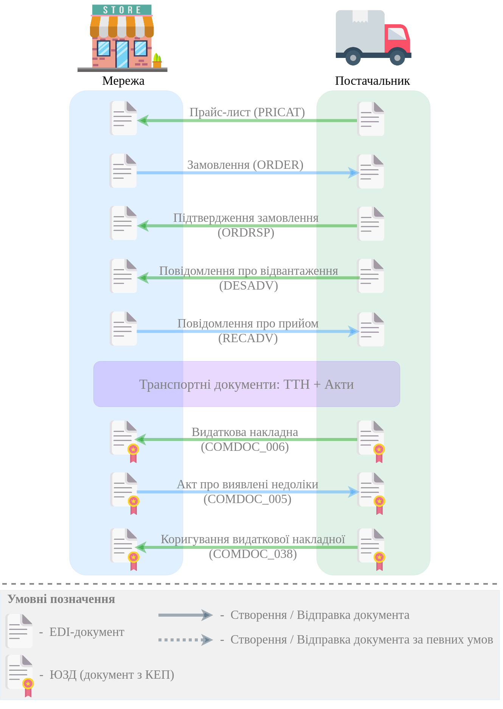

API v2
###########

Алгоритми обміну документами (API)
====================================

.. toctree::
   :maxdepth: 1
   
   Work_with_API/PRICAT_API_work
   Work_with_API/ORDER_API_work
   Work_with_API/ORDRSP_API_work
   Work_with_API/DESADV_API_work
   Work_with_API/RECADV_API_work
   Work_with_API/COMDOC_006_API_work
   Work_with_API/COMDOC_005_API_work
   Work_with_API/COMDOC_038_API_work

-------------------------------

.. hint::
    Всі запити нижче перерахованих API методів платформи EDIN 2.0 направляються на адресу: https://edo-v2.edin.ua

Авторизація
==============

+-----------+-----------------------------+---------------------------------------------------------------------------------------------------+
| **Метод** |       **URL запиту**        |                                             **Опис**                                              |
+===========+=============================+===================================================================================================+
| POST      | ``/api/authorization/hash`` | `Авторизація <https://wiki.edin.ua/uk/latest/integration_2_0/APIv2/Methods/Authorization.html>`__ |
+-----------+-----------------------------+---------------------------------------------------------------------------------------------------+

.. beauty list

.. toctree::
   :hidden:
   :glob:

   Methods/Authorization
   Methods/AuthCheck

Робота з довідниками
============================

+-----------+--------------------------------------+---------------------------------------------------------------------------------------------------------------------------------------------------------------------------------------------+
| **Метод** |            **URL запиту**            |                                                                                          **Опис**                                                                                           |
+===========+======================================+=============================================================================================================================================================================================+
| GET       | ``/api/oas/user``                    | `Отримання інформації по авторизованому користувачу <https://wiki.edin.ua/uk/latest/integration_2_0/APIv2/Methods/OasUser.html>`__                                                          |
+-----------+--------------------------------------+---------------------------------------------------------------------------------------------------------------------------------------------------------------------------------------------+
| GET       | ``/api/oas/account/users``           | `Отримання інформації про всіх користувачів компанії (на рівні акаунта) <https://wiki.edin.ua/uk/latest/integration_2_0/APIv2/Methods/GetCompanyUsers.html>`__                              |
+-----------+--------------------------------------+---------------------------------------------------------------------------------------------------------------------------------------------------------------------------------------------+
| GET       | ``/api/oas/account/identifiers``     | `Отримання інформації по GLN номерами, пов'язаним з авторизованим користувачем (на рівні акаунта) <https://wiki.edin.ua/uk/latest/integration_2_0/APIv2/Methods/AccountIdentifiers.html>`__ |
+-----------+--------------------------------------+---------------------------------------------------------------------------------------------------------------------------------------------------------------------------------------------+
| GET       | ``/api/oas/retailers``               | `Отримання переліку роздрібних мереж, які пов'язані із заданим GLN <https://wiki.edin.ua/uk/latest/integration_2_0/APIv2/Methods/OasRetailers.html>`__                                      |
+-----------+--------------------------------------+---------------------------------------------------------------------------------------------------------------------------------------------------------------------------------------------+
| GET       | ``/api/oas/retailer/identificators`` | `Отримання переліку GLN номерів, які пов'язані із заданою роздрібною мережею <https://wiki.edin.ua/uk/latest/integration_2_0/APIv2/Methods/RetailerIdentificators.html>`__                  |
+-----------+--------------------------------------+---------------------------------------------------------------------------------------------------------------------------------------------------------------------------------------------+
| GET       | ``/api/oas/allretailers``            | `Отримання переліку всіх мереж <https://wiki.edin.ua/uk/latest/integration_2_0/APIv2/Methods/Allretailers.html>`__                                                                          |
+-----------+--------------------------------------+---------------------------------------------------------------------------------------------------------------------------------------------------------------------------------------------+
| GET       | ``/api/oas/units``                   | `Отримання переліку доступних одиниць виміру <https://wiki.edin.ua/uk/latest/integration_2_0/APIv2/Methods/OasUnits.html>`__                                                                |
+-----------+--------------------------------------+---------------------------------------------------------------------------------------------------------------------------------------------------------------------------------------------+
| GET       | ``/api/oas/identifiers``             | `Отримання інформації про організацію по Назві/ІПН/КПП/GLN <https://wiki.edin.ua/uk/latest/integration_2_0/APIv2/Methods/OasIdentifiers.html>`__                                            |
+-----------+--------------------------------------+---------------------------------------------------------------------------------------------------------------------------------------------------------------------------------------------+

.. beauty list

.. toctree::
   :hidden:
   :glob:

   Methods/OasUser
   Methods/GetCompanyUsers
   Methods/AccountIdentifiers
   Methods/OasRetailers
   Methods/RetailerIdentificators
   Methods/Allretailers
   Methods/OasUnits
   Methods/OasIdentifiers

.. _virtual-dictionary:

Робота з об'єднаним віртуальним довідником (всі сервіси в рамках акаунта/користувача)
================================================================================================

+-----------+--------------------------------+-----------------------------------------------------------------------------------------------------------------------------------------+
| **Метод** |         **URL запиту**         |                                                                **Опис**                                                                 |
+===========+================================+=========================================================================================================================================+
| GET       | ``/api/uds/dictionary``        | `Отримати значення з віртуального довідника <https://wiki.edin.ua/uk/latest/integration_2_0/APIv2/Methods/GetVirtualDictionary.html>`__ |
+-----------+--------------------------------+-----------------------------------------------------------------------------------------------------------------------------------------+
| POST      | ``/api/uds/dictionary``        | `Створити новий довідник <https://wiki.edin.ua/uk/latest/integration_2_0/APIv2/Methods/PostVirtualDictionary.html>`__                   |
+-----------+--------------------------------+-----------------------------------------------------------------------------------------------------------------------------------------+
| PUT       | ``/api/uds/dictionary``        | `Оновити довідник <https://wiki.edin.ua/uk/latest/integration_2_0/APIv2/Methods/PutVirtualDictionary.html>`__                           |
+-----------+--------------------------------+-----------------------------------------------------------------------------------------------------------------------------------------+
| DELETE    | ``/api/uds/dictionary``        | `Видалити довідник <https://wiki.edin.ua/uk/latest/integration_2_0/APIv2/Methods/DelVirtualDictionary.html>`__                          |
+-----------+--------------------------------+-----------------------------------------------------------------------------------------------------------------------------------------+
| POST      | ``/api/uds/dictionary/values`` | `Додати значення в довідник <https://wiki.edin.ua/uk/latest/integration_2_0/APIv2/Methods/PostVirtualDictionaryValues.html>`__          |
+-----------+--------------------------------+-----------------------------------------------------------------------------------------------------------------------------------------+
| DELETE    | ``/api/uds/dictionary/values`` | `Видалити значення з довідника <https://wiki.edin.ua/uk/latest/integration_2_0/APIv2/Methods/DelVirtualDictionaryValues.html>`__        |
+-----------+--------------------------------+-----------------------------------------------------------------------------------------------------------------------------------------+

.. beauty list

.. toctree::
   :hidden:
   :glob:

   Methods/GetVirtualDictionary
   Methods/PostVirtualDictionary
   Methods/PutVirtualDictionary
   Methods/DelVirtualDictionary
   Methods/PostVirtualDictionaryValues
   Methods/DelVirtualDictionaryValues

Робота з документами
============================

+-----------+--------------------------------------------+------------------------------------------------------------------------------------------------------------------------------------------------------------------------------------------------+
| **Метод** |               **URL запиту**               |                                                                                            **Опис**                                                                                            |
+===========+============================================+================================================================================================================================================================================================+
| POST      | ``/api/v2/eds/doc``                        | `Створення чернетки документа / Клонування відправленого документа (COMDOC) <https://wiki.edin.ua/uk/latest/integration_2_0/APIv2/Methods/CreateDocumentV2.html>`__                            |
+-----------+--------------------------------------------+------------------------------------------------------------------------------------------------------------------------------------------------------------------------------------------------+
| PATCH     | ``/api/eds/doc/send``                      | `Відправка чернетки <https://wiki.edin.ua/uk/latest/integration_2_0/APIv2/Methods/SendDocument.html>`__                                                                                        |
+-----------+--------------------------------------------+------------------------------------------------------------------------------------------------------------------------------------------------------------------------------------------------+
| POST      | ``/api/eds/doc/create_and_send``           | `Відправка документа (без створення чернетки) <https://wiki.edin.ua/uk/latest/integration_2_0/APIv2/Methods/SendDocumentWithoutDraft.html>`__                                                  |
+-----------+--------------------------------------------+------------------------------------------------------------------------------------------------------------------------------------------------------------------------------------------------+
| POST      | ``/api/eds/docs/search``                   | `Пошук документів (з фільтрацією), вибір списку документів <https://wiki.edin.ua/uk/latest/integration_2_0/APIv2/Methods/DocsSearch.html>`__                                                   |
+-----------+--------------------------------------------+------------------------------------------------------------------------------------------------------------------------------------------------------------------------------------------------+
| GET       | ``/api/eds/doc``                           | `Отримання інформації (мета-даних) про документ <https://wiki.edin.ua/uk/latest/integration_2_0/APIv2/Methods/GetDocument.html>`__                                                             |
+-----------+--------------------------------------------+------------------------------------------------------------------------------------------------------------------------------------------------------------------------------------------------+
| GET       | ``/api/eds/chain``                         | `Отримання конкретного ланцюжка документів <https://wiki.edin.ua/uk/latest/integration_2_0/APIv2/Methods/EdsChain.html>`__                                                                     |
+-----------+--------------------------------------------+------------------------------------------------------------------------------------------------------------------------------------------------------------------------------------------------+
| GET       | ``/api/eds/doc/body``                      | `Отримання контента документа <https://wiki.edin.ua/uk/latest/integration_2_0/APIv2/Methods/DocBody.html>`__                                                                                   |
+-----------+--------------------------------------------+------------------------------------------------------------------------------------------------------------------------------------------------------------------------------------------------+
| GET       | ``/api/eds/doc/xml``                       | `Отримання XML контента документа <https://wiki.edin.ua/uk/latest/integration_2_0/APIv2/Methods/GetXML.html>`__                                                                                |
+-----------+--------------------------------------------+------------------------------------------------------------------------------------------------------------------------------------------------------------------------------------------------+
| GET       | ``/api/eds/doc/download``                  | `Завантажити тіло документа/підпису <https://wiki.edin.ua/uk/latest/integration_2_0/APIv2/Methods/DownloadDocument.html>`__                                                                    |
+-----------+--------------------------------------------+------------------------------------------------------------------------------------------------------------------------------------------------------------------------------------------------+
| GET       | ``/api/eds/doc/condra/body``               | `Завантажити «Неструктурований (універсальний) документ» (CONDRA) в вигляді архіву <https://wiki.edin.ua/uk/latest/integration_2_0/APIv2/Methods/GetCondraFile.html>`__                        |
+-----------+--------------------------------------------+------------------------------------------------------------------------------------------------------------------------------------------------------------------------------------------------+
| PATCH     | ``/api/eds/doc/condra/send``               | `Відправка «Неструктурованого (універсального) документа» (CONDRA) <https://wiki.edin.ua/uk/latest/integration_2_0/APIv2/Methods/SendCondraDocument.html>`__                                   |
+-----------+--------------------------------------------+------------------------------------------------------------------------------------------------------------------------------------------------------------------------------------------------+
| POST      | ``/api/v2/eds/doc/condra/create``          | `Створення чернетки "Універсального/неструктурованого документа" (CONDRA) <https://wiki.edin.ua/uk/latest/integration_2_0/APIv2/Methods/CondraCreate.html>`__                                  |
+-----------+--------------------------------------------+------------------------------------------------------------------------------------------------------------------------------------------------------------------------------------------------+
| POST      | ``/api/v2/eds/doc/condra/create_and_send`` | `Створення й відправка "Універсального/неструктурованого документа" (CONDRA) без створення чернетки <https://wiki.edin.ua/uk/latest/integration_2_0/APIv2/Methods/CondraCreateAndSend.html>`__ |
+-----------+--------------------------------------------+------------------------------------------------------------------------------------------------------------------------------------------------------------------------------------------------+
| POST      | ``/api/eds/doc/statuses``                  | `Відправка статусу документа <https://wiki.edin.ua/uk/latest/integration_2_0/APIv2/Methods/PostDocStatuses.html>`__                                                                            |
+-----------+--------------------------------------------+------------------------------------------------------------------------------------------------------------------------------------------------------------------------------------------------+
| GET       | ``/api/eds/doc/statuses``                  | `Отримання статусу документа <https://wiki.edin.ua/uk/latest/integration_2_0/APIv2/Methods/GetDocStatuses.html>`__                                                                             |
+-----------+--------------------------------------------+------------------------------------------------------------------------------------------------------------------------------------------------------------------------------------------------+
| POST      | ``/api/eds/doc/body``                      | `Додавання файла-вкладення (для CONDRA) <https://wiki.edin.ua/uk/latest/integration_2_0/APIv2/Methods/AddDocumentBody.html>`__                                                                 |
+-----------+--------------------------------------------+------------------------------------------------------------------------------------------------------------------------------------------------------------------------------------------------+
| POST      | ``/api/eds/doc``                           | :doc:`/integration_2_0/APIv2/Methods/CreateDocument`                                                                                                                                           |
+-----------+--------------------------------------------+------------------------------------------------------------------------------------------------------------------------------------------------------------------------------------------------+
| PUT       | ``/api/eds/doc``                           | `Редагування чернетки документа <https://wiki.edin.ua/uk/latest/integration_2_0/APIv2/Methods/EditDocument.html>`__                                                                            |
+-----------+--------------------------------------------+------------------------------------------------------------------------------------------------------------------------------------------------------------------------------------------------+
| GET       | ``/api/office/uuid``                       | `Отримання UUID (для CONDRA) <https://wiki.edin.ua/uk/latest/integration_2_0/APIv2/Methods/GetOfficeUuid.html>`__                                                                              |
+-----------+--------------------------------------------+------------------------------------------------------------------------------------------------------------------------------------------------------------------------------------------------+
| POST      | ``/api/eds/doc/body``                      | `Підписання файла (для CONDRA) <https://wiki.edin.ua/uk/latest/integration_2_0/APIv2/Methods/SignCondraBody.html>`__                                                                           |
+-----------+--------------------------------------------+------------------------------------------------------------------------------------------------------------------------------------------------------------------------------------------------+
| PUT       | ``/api/eds/doc/extra_fields``              | `Заповнення індексів (додавання / оновлення полей екстрапараметрів) <https://wiki.edin.ua/uk/latest/integration_2_0/APIv2/Methods/UpdateExtraFields.html>`__                                   |
+-----------+--------------------------------------------+------------------------------------------------------------------------------------------------------------------------------------------------------------------------------------------------+
| PATCH     | ``/api/eds/chain/archive``                 | `Архівування / Розархівування ланцюжка документів <https://wiki.edin.ua/uk/latest/integration_2_0/APIv2/Methods/ArchiveChain.html>`__                                                          |
+-----------+--------------------------------------------+------------------------------------------------------------------------------------------------------------------------------------------------------------------------------------------------+
| GET       | ``/api/eds/doc/reports/doctype``           | `Отримати реєстр документів в xls форматі <https://wiki.edin.ua/uk/latest/integration_2_0/APIv2/Methods/GetDocTypeReport.html>`__                                                              |
+-----------+--------------------------------------------+------------------------------------------------------------------------------------------------------------------------------------------------------------------------------------------------+
| GET       | ``/api/eds/doc/print``                     | `Роздрукувати вкладення документа <https://wiki.edin.ua/uk/latest/integration_2_0/APIv2/Methods/PrintDocument.html>`__                                                                         |
+-----------+--------------------------------------------+------------------------------------------------------------------------------------------------------------------------------------------------------------------------------------------------+
| POST      | ``/api/eds/doc/attachment/sign``           | `Додавання підпису до вкладень документа-чернетки <https://wiki.edin.ua/uk/latest/integration_2_0/APIv2/Methods/AttachmentSign.html>`__                                                        |
+-----------+--------------------------------------------+------------------------------------------------------------------------------------------------------------------------------------------------------------------------------------------------+
| GET       | ``/api/eds/doc/attachment/sign/hash``      | `Отримати хеш вкладення (контейнера) документа для підписання <https://wiki.edin.ua/uk/latest/integration_2_0/APIv2/Methods/AttachmentSignHash.html>`__                                        |
+-----------+--------------------------------------------+------------------------------------------------------------------------------------------------------------------------------------------------------------------------------------------------+
| GET       | ``/api/eds/doc/attachment/sign/info``      | `Отримання інформації про підпис/підписантів <https://wiki.edin.ua/uk/latest/integration_2_0/APIv2/Methods/AttachmentSignInfo.html>`__                                                         |
+-----------+--------------------------------------------+------------------------------------------------------------------------------------------------------------------------------------------------------------------------------------------------+
| PATCH     | ``/api/v2/eds/condra/reject``              | `Відхилити "Універсальний/неструктурований документ" (CONDRA). Створення квитанції №13 <https://wiki.edin.ua/uk/latest/integration_2_0/APIv2/Methods/CondraReject.html>`__                     |
+-----------+--------------------------------------------+------------------------------------------------------------------------------------------------------------------------------------------------------------------------------------------------+
| PATCH     | ``/api/v2/eds/condra/withdraw``            | `Відкликати "Універсальний/неструктурований документ" (CONDRA). Створення квитанції №14 <https://wiki.edin.ua/uk/latest/integration_2_0/APIv2/Methods/CondraWithdraw.html>`__                  |
+-----------+--------------------------------------------+------------------------------------------------------------------------------------------------------------------------------------------------------------------------------------------------+
| PATCH     | ``/api/v2/eds/condra/confirm/send``        | `Прийняти "Універсальний/неструктурований документ" (CONDRA) <https://wiki.edin.ua/uk/latest/integration_2_0/APIv2/Methods/SendCondraConfirm.html>`__                                          |
+-----------+--------------------------------------------+------------------------------------------------------------------------------------------------------------------------------------------------------------------------------------------------+
| DELETE    | ``/api/eds/doc/attachment``                | `Видалити файл-вкладення (чернетка) <https://wiki.edin.ua/uk/latest/integration_2_0/APIv2/Methods/DelAttachment.html>`__                                                                       |
+-----------+--------------------------------------------+------------------------------------------------------------------------------------------------------------------------------------------------------------------------------------------------+
| GET       | ``/api/eds/doc/attachment``                | `Отримати файл-вкладення <https://wiki.edin.ua/uk/latest/integration_2_0/APIv2/Methods/GetAttachment.html>`__                                                                                  |
+-----------+--------------------------------------------+------------------------------------------------------------------------------------------------------------------------------------------------------------------------------------------------+
| POST      | ``/api/eds/doc/attachment``                | `Додати файл до документа-чернетки <https://wiki.edin.ua/uk/latest/integration_2_0/APIv2/Methods/PostAttachment.html>`__                                                                       |
+-----------+--------------------------------------------+------------------------------------------------------------------------------------------------------------------------------------------------------------------------------------------------+
| PATCH     | ``/api/eds/docs``                          | `Видалити документи-чернетки <https://wiki.edin.ua/uk/latest/integration_2_0/APIv2/Methods/DeleteDocuments.html>`__                                                                            |
+-----------+--------------------------------------------+------------------------------------------------------------------------------------------------------------------------------------------------------------------------------------------------+
| POST      | ``/api/v2/eds/doc/content``                | `Отримати тіла документів (json) за вказаними UUID <https://wiki.edin.ua/uk/latest/integration_2_0/APIv2/Methods/GetDocumentsContent.html>`__                                                  |
+-----------+--------------------------------------------+------------------------------------------------------------------------------------------------------------------------------------------------------------------------------------------------+
| POST      | ``/api/eds/doc/prdrsrvn/transaction``      | :doc:`/integration_2_0/APIv2/Methods/SendPrdrsrvnTransaction`                                                                                                                                  |
+-----------+--------------------------------------------+------------------------------------------------------------------------------------------------------------------------------------------------------------------------------------------------+
| POST      | ``/api/eds/docs_and_tickets``              | :doc:`/integration_2_0/APIv2/Methods/CreateAndSendDocumentsTickets`                                                                                                                            |
+-----------+--------------------------------------------+------------------------------------------------------------------------------------------------------------------------------------------------------------------------------------------------+
| POST      | ``/api/v2/eds/docs/state``                 | `Отримати статус документа <https://wiki.edin.ua/uk/latest/integration_2_0/APIv2/Methods/GetState.html>`__                                                                                                                        |
+-----------+--------------------------------------------+------------------------------------------------------------------------------------------------------------------------------------------------------------------------------------------------+

.. beauty list

.. toctree::
   :hidden:
   :glob:

   Methods/CreateDocumentV2
   Methods/SendDocument
   Methods/SendDocumentWithoutDraft
   Methods/DocsSearch
   Methods/GetDocument
   Methods/EdsChain
   Methods/DocBody
   Methods/GetXML
   Methods/DownloadDocument
   Methods/GetCondraFile
   Methods/SendCondraDocument
   Methods/CondraCreate
   Methods/CondraCreateAndSend
   Methods/PostDocStatuses
   Methods/GetDocStatuses
   Methods/AddDocumentBody
   Methods/CreateDocument
   Methods/EditDocument
   Methods/GetOfficeUuid
   Methods/SignCondraBody
   Methods/UpdateExtraFields
   Methods/ArchiveChain
   Methods/GetDocTypeReport
   Methods/PrintDocument
   Methods/AttachmentSign
   Methods/AttachmentSignHash
   Methods/AttachmentSignInfo
   Methods/CondraReject
   Methods/CondraWithdraw
   Methods/SendCondraConfirm
   Methods/DelAttachment
   Methods/GetAttachment
   Methods/PostAttachment
   Methods/DeleteDocuments
   Methods/GetDocumentsContent
   Methods/SendPrdrsrvnTransaction
   Methods/CreateAndSendDocumentsTickets

.. _tickets:

Робота з квитанціями
============================

+-----------+-----------------------------------+---------------------------------------------------------------------------------------------------------------------------------------------------------------------------------------------------------------------------------------+
| **Метод** |          **URL запиту**           |                                                                                                               **Опис**                                                                                                                |
+===========+===================================+=======================================================================================================================================================================================================================================+
| GET       | ``/api/eds/doc/tickets``          | `Отримання всіх квитанцій вказаного документа <https://wiki.edin.ua/uk/latest/integration_2_0/APIv2/Methods/GetTickets.html>`__                                                                                                       |
+-----------+-----------------------------------+---------------------------------------------------------------------------------------------------------------------------------------------------------------------------------------------------------------------------------------+
| GET       | ``/api/eds/doc/signers``          | `Отримання інформації про підписантів <https://wiki.edin.ua/uk/latest/integration_2_0/APIv2/Methods/GetSignersInfo.html>`__                                                                                                           |
+-----------+-----------------------------------+---------------------------------------------------------------------------------------------------------------------------------------------------------------------------------------------------------------------------------------+
| GET       | ``/api/v2/eds/doc/signers``       | :doc:`/integration_2_0/APIv2/Methods/GetSignersInfoV2`                                                                                                                                                                                |
+-----------+-----------------------------------+---------------------------------------------------------------------------------------------------------------------------------------------------------------------------------------------------------------------------------------+
| GET       | ``/api/eds/doc/ticket/body``      | `Отримання даних/контенту квитанції <https://wiki.edin.ua/uk/latest/integration_2_0/APIv2/Methods/GetTicketBody.html>`__                                                                                                              |
+-----------+-----------------------------------+---------------------------------------------------------------------------------------------------------------------------------------------------------------------------------------------------------------------------------------+
| GET       | ``/api/v2/eds/doc/repeal``        | :doc:`/integration_2_0/APIv2/Methods/GetRepealTicketBody`                                                                                                                                                                             |
+-----------+-----------------------------------+---------------------------------------------------------------------------------------------------------------------------------------------------------------------------------------------------------------------------------------+
| GET       | ``/api/v2/eds/comdoc/reject``     | `Створення на сервері квитанції "Повідомлення про відмову від підписання документу" (COMDOC_021) для COMDOC/TRANSPORTATIONORDER документів <https://wiki.edin.ua/uk/latest/integration_2_0/APIv2/Methods/GetRejectTicketBody.html>`__ |
+-----------+-----------------------------------+---------------------------------------------------------------------------------------------------------------------------------------------------------------------------------------------------------------------------------------+
| GET       | ``/api/v2/eds/doc/reject``        | `Створення на сервері квитанції "Повідомлення про відмову від підписання документу" (COMDOC_021) <https://wiki.edin.ua/uk/latest/integration_2_0/APIv2/Methods/GetDocReject.html>`__                                                  |
+-----------+-----------------------------------+---------------------------------------------------------------------------------------------------------------------------------------------------------------------------------------------------------------------------------------+
| POST      | ``/api/v2/eds/doc/ticket``        | `Створення квитанції №1 (підпис чернетки) <https://wiki.edin.ua/uk/latest/integration_2_0/APIv2/Methods/CreateTicketV2.html>`__                                                                                                       |
+-----------+-----------------------------------+---------------------------------------------------------------------------------------------------------------------------------------------------------------------------------------------------------------------------------------+
| POST      | ``/api/v2/eds/comdoc/accept``     | `Створення квитанції №2 (прийняття документа COMDOC) <https://wiki.edin.ua/uk/latest/integration_2_0/APIv2/Methods/ComdocAccept.html>`__                                                                                              |
+-----------+-----------------------------------+---------------------------------------------------------------------------------------------------------------------------------------------------------------------------------------------------------------------------------------+
| POST      | ``/api/v2/eds/doc/repeal``        | :doc:`/integration_2_0/APIv2/Methods/RepealRequest`                                                                                                                                                                                   |
+-----------+-----------------------------------+---------------------------------------------------------------------------------------------------------------------------------------------------------------------------------------------------------------------------------------+
| POST      | ``/api/v2/eds/doc/repeal/accept`` | :doc:`/integration_2_0/APIv2/Methods/RepealAccept`                                                                                                                                                                                    |
+-----------+-----------------------------------+---------------------------------------------------------------------------------------------------------------------------------------------------------------------------------------------------------------------------------------+
| POST      | ``/api/v2/eds/comdoc/reject``     | `Створення квитанції №13 (відхилення документа COMDOC/TRANSPORTATIONORDER) <https://wiki.edin.ua/uk/latest/integration_2_0/APIv2/Methods/ComdocReject.html>`__                                                                        |
+-----------+-----------------------------------+---------------------------------------------------------------------------------------------------------------------------------------------------------------------------------------------------------------------------------------+
| POST      | ``/api/v2/eds/comdoc/revoke``     | `Створення квитанції №14 (відкликати підписання документа COMDOC/TRANSPORTATIONORDER) <https://wiki.edin.ua/uk/latest/integration_2_0/APIv2/Methods/ComdocRevoke.html>`__                                                             |
+-----------+-----------------------------------+---------------------------------------------------------------------------------------------------------------------------------------------------------------------------------------------------------------------------------------+
| POST      | ``/api/v2/eds/doc/repeal/reject`` | :doc:`/integration_2_0/APIv2/Methods/RepealReject`                                                                                                                                                                                    |
+-----------+-----------------------------------+---------------------------------------------------------------------------------------------------------------------------------------------------------------------------------------------------------------------------------------+
| POST      | ``/api/v2/eds/doc/reject``        | `Відправка відмови від підписання (створення квитанції №13) <https://wiki.edin.ua/uk/latest/integration_2_0/APIv2/Methods/DocReject.html>`__                                                                                          |
+-----------+-----------------------------------+---------------------------------------------------------------------------------------------------------------------------------------------------------------------------------------------------------------------------------------+
| GET       | ``/api/v2/eds/doc/revoke``        | :doc:`/integration_2_0/APIv2/Methods/GetDocumentRevoke`                                                                                                                                                                               |
+-----------+-----------------------------------+---------------------------------------------------------------------------------------------------------------------------------------------------------------------------------------------------------------------------------------+
| POST      | ``/api/v2/eds/doc/revoke``        | :doc:`/integration_2_0/APIv2/Methods/PostDocumentRevoke`                                                                                                                                                                              |
+-----------+-----------------------------------+---------------------------------------------------------------------------------------------------------------------------------------------------------------------------------------------------------------------------------------+

.. beauty list

.. toctree::
   :hidden:
   :glob:

   Methods/GetTickets
   Methods/GetSignersInfo
   Methods/GetSignersInfoV2
   Methods/GetTicketBody
   Methods/GetRepealTicketBody
   Methods/GetRejectTicketBody
   Methods/GetDocReject
   Methods/CreateTicketV2
   Methods/ComdocAccept
   Methods/RepealRequest
   Methods/RepealAccept
   Methods/ComdocReject
   Methods/ComdocRevoke
   Methods/RepealReject
   Methods/DocReject
   Methods/GetDocumentRevoke
   Methods/PostDocumentRevoke

.. _tags:

Робота з тегами
============================

+-----------+-----------------------+--------------------------------------------------------------------------------------------------------------------+
| **Метод** |    **URL запиту**     |                                                      **Опис**                                                      |
+===========+=======================+====================================================================================================================+
| POST      | ``/api/eds/tags``     | `Створити новий тег <https://wiki.edin.ua/uk/latest/integration_2_0/APIv2/Methods/CreateTags.html>`__              |
+-----------+-----------------------+--------------------------------------------------------------------------------------------------------------------+
| GET       | ``/api/eds/tags``     | `Отримати теги <https://wiki.edin.ua/uk/latest/integration_2_0/APIv2/Methods/GetTags.html>`__                      |
+-----------+-----------------------+--------------------------------------------------------------------------------------------------------------------+
| PUT       | ``/api/eds/tags``     | `Редагувати тег <https://wiki.edin.ua/uk/latest/integration_2_0/APIv2/Methods/EditTags.html>`__                    |
+-----------+-----------------------+--------------------------------------------------------------------------------------------------------------------+
| DELETE    | ``/api/eds/tags``     | `Видалити теги <https://wiki.edin.ua/uk/latest/integration_2_0/APIv2/Methods/DropTags.html>`__                     |
+-----------+-----------------------+--------------------------------------------------------------------------------------------------------------------+
| POST      | ``/api/eds/doc/tags`` | `Додати теги до документа <https://wiki.edin.ua/uk/latest/integration_2_0/APIv2/Methods/AddDocumentTags.html>`__   |
+-----------+-----------------------+--------------------------------------------------------------------------------------------------------------------+
| DELETE    | ``/api/eds/doc/tags`` | `Вилучити теги з документа <https://wiki.edin.ua/uk/latest/integration_2_0/APIv2/Methods/DropDocumentTags.html>`__ |
+-----------+-----------------------+--------------------------------------------------------------------------------------------------------------------+

.. beauty list

.. toctree::
   :hidden:
   :glob:

   Methods/CreateTags
   Methods/GetTags
   Methods/EditTags
   Methods/DropTags
   Methods/AddDocumentTags
   Methods/DropDocumentTags

.. _events:

Робота з подіями (в тестуванні)
========================================================

.. note::

    1. Обираєте ідентифікатор документу, з якого Ви плануєте розпочати отримувати всі наступні події.
    2. Надсилаєте запит на `отримання останнього ідентифікатора події за документом <https://wiki.edin.ua/uk/latest/integration_2_0/APIv2/Methods/GetDocLastEvent.html>`__.
    3. В отриманному у відповідь об'єкті **XEvent** зберігаєте значення параметра **id**.
    4. Надсилаєте запит для `пошуку подій <https://wiki.edin.ua/uk/latest/integration_2_0/APIv2/Methods/PostDocEvents.html>`__. В об'єкті запиту **EventsStorageQuery**, в параметрі **fromId** вказуєте ідентифікатор події який Ви отримали в пункті 3.
    5. З отриманного у відповідь об'єкта **EventsStorageQueryResult** зберігаєте значення параметра **lastEventId** замість того, що зберегли в пункті 3.
    6. Опрацьовуєте документи в **EventsStorageQueryResult**.
    7. Якщо кількість значень в параметрі **items** об'єкта **EventsStorageQueryResult**:

        * дорівнює вказаному ліміту (limit) або рівне 100, то повторюйте операції з 4 по 7.
        * меньше вказаного ліміту (limit) або менше 100, то необхідно зробити паузу (1 хвилина) для подальшого виконання операцій з 4 по 7.

+-----------+------------------------------+------------------------------------------------------------------------------------------------------------------------------+
| **Метод** |        **URL запиту**        |                                                           **Опис**                                                           |
+===========+==============================+==============================================================================================================================+
| GET       | ``/api/eds/docs/event/last`` | `Отримати останню подію за документом <https://wiki.edin.ua/uk/latest/integration_2_0/APIv2/Methods/GetDocLastEvent.html>`__ |
+-----------+------------------------------+------------------------------------------------------------------------------------------------------------------------------+
| GET       | ``/api/eds/docs/events``     | `Отримати список подій <https://wiki.edin.ua/uk/latest/integration_2_0/APIv2/Methods/GetDocEvents.html>`__                   |
+-----------+------------------------------+------------------------------------------------------------------------------------------------------------------------------+
| POST      | ``/api/eds/docs/events``     | `Пошук подій <https://wiki.edin.ua/uk/latest/integration_2_0/APIv2/Methods/PostDocEvents.html>`__                            |
+-----------+------------------------------+------------------------------------------------------------------------------------------------------------------------------+

.. beauty list

.. toctree::
   :hidden:
   :glob:

   Methods/GetDocLastEvent
   Methods/GetDocEvents
   Methods/PostDocEvents

Робота з файлами (вкладення до документа)
========================================================

+-----------+-----------------------------+--------------------------------------------------------------------------------------------------------------------------+
| **Метод** |       **URL запиту**        |                                                         **Опис**                                                         |
+===========+=============================+==========================================================================================================================+
| POST      | ``/api/eds/doc/attachment`` | `Додати файл до документа-чернетки <https://wiki.edin.ua/uk/latest/integration_2_0/APIv2/Methods/PostAttachment.html>`__ |
+-----------+-----------------------------+--------------------------------------------------------------------------------------------------------------------------+
| GET       | ``/api/eds/doc/attachment`` | `Отримати файл-вкладення <https://wiki.edin.ua/uk/latest/integration_2_0/APIv2/Methods/GetAttachment.html>`__            |
+-----------+-----------------------------+--------------------------------------------------------------------------------------------------------------------------+
| DELETE    | ``/api/eds/doc/attachment`` | `Видалити файл-вкладення (чернетка) <https://wiki.edin.ua/uk/latest/integration_2_0/APIv2/Methods/DelAttachment.html>`__ |
+-----------+-----------------------------+--------------------------------------------------------------------------------------------------------------------------+

.. beauty list

.. toctree::
   :hidden:
   :glob:

   Methods/PostAttachment
   Methods/GetAttachment
   Methods/DelAttachment

.. _doc-approval:

Погодження
========================================================

+-----------+------------------------------------+-------------------------------------------------------------------------------------------------------------------------------------------------------------+
| **Метод** |           **URL запиту**           |                                                                          **Опис**                                                                           |
+===========+====================================+=============================================================================================================================================================+
| POST      | ``/api/eds/doc/approval/scenario`` | `Створити сценарій погодження документів <https://wiki.edin.ua/uk/latest/integration_2_0/APIv2/Methods/PostDocApprovalScenario.html>`__                     |
+-----------+------------------------------------+-------------------------------------------------------------------------------------------------------------------------------------------------------------+
| GET       | ``/api/eds/doc/approval/scenario`` | `Отримати сценарій/-ії (на рівні GLN) <https://wiki.edin.ua/uk/latest/integration_2_0/APIv2/Methods/GetDocApprovalScenario.html>`__                         |
+-----------+------------------------------------+-------------------------------------------------------------------------------------------------------------------------------------------------------------+
| PUT       | ``/api/eds/doc/approval/scenario`` | `Редагувати / видалити сценарій погодження документів <https://wiki.edin.ua/uk/latest/integration_2_0/APIv2/Methods/PutDocApprovalScenario.html>`__         |
+-----------+------------------------------------+-------------------------------------------------------------------------------------------------------------------------------------------------------------+
| POST      | ``/api/eds/doc/approval/step``     | `Запуск документа на погодження / Зміна статуса кроку погодження <https://wiki.edin.ua/uk/latest/integration_2_0/APIv2/Methods/PostDocApprovalStep.html>`__ |
+-----------+------------------------------------+-------------------------------------------------------------------------------------------------------------------------------------------------------------+
| GET       | ``/api/eds/doc/approval/step``     | `Отримання кроків погодження за документом <https://wiki.edin.ua/uk/latest/integration_2_0/APIv2/Methods/GetDocApprovalStep.html>`__                        |
+-----------+------------------------------------+-------------------------------------------------------------------------------------------------------------------------------------------------------------+

.. beauty list

.. toctree::
   :hidden:
   :glob:

   Methods/PostDocApprovalScenario
   Methods/GetDocApprovalScenario
   Methods/PostDocApprovalStep
   Methods/GetDocApprovalStep

.. _retailer-request:

Підключення до мережі
========================================================

+-----------+---------------------------------+-----------------------------------------------------------+
| **Метод** |         **URL запиту**          |                         **Опис**                          |
+===========+=================================+===========================================================+
| GET       | ``/api/oas/retailers/requests`` | :doc:`/integration_2_0/APIv2/Methods/GetRetailerRequests` |
+-----------+---------------------------------+-----------------------------------------------------------+

---------------------------------

.. _edi-errors:

Опис помилок сервісу "EDI Network"
=========================================================================================

.. csv-table:: 
  :file: edi_errors.csv
  :widths:  10, 20, 20, 40
  :stub-columns: 0

.. _main-errors:

Загальні помилки при роботі з API (всі сервіси EDIN)
=========================================================================================

.. csv-table:: 
  :file: /_constant/common_api_errors.csv
  :widths:  10, 20, 20, 40
  :stub-columns: 0

.. csv-table:: 
  :file: /_constant/main_api_errors.csv
  :widths:  10, 20, 60
  :stub-columns: 0

.. old auto list (deprecated)

    .. toctree::
    :hidden:
    :glob:

    Methods/*
