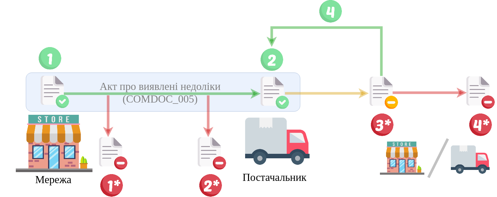

Алгоритм "Акт про виявлені недоліки" (COMDOC_005)
#####################################################################################################################

.. role:: red

.. role:: underline

.. role:: green

.. role:: orange

.. role:: purple

----------------------------------------------------

----------------------------------------------------

Можливо налаштувати процес відправки документа з окремою дією створення чернетки чи без неї:

.. csv-table:: 
  :file: COMDOC_API_work.csv
  :widths:  40, 40
  :stub-columns: 0

-----------------------------------------------

`Додаткові методи API <https://wiki.edin.ua/uk/latest/integration_2_0/APIv2/APIv2_list.html#tickets>`__

