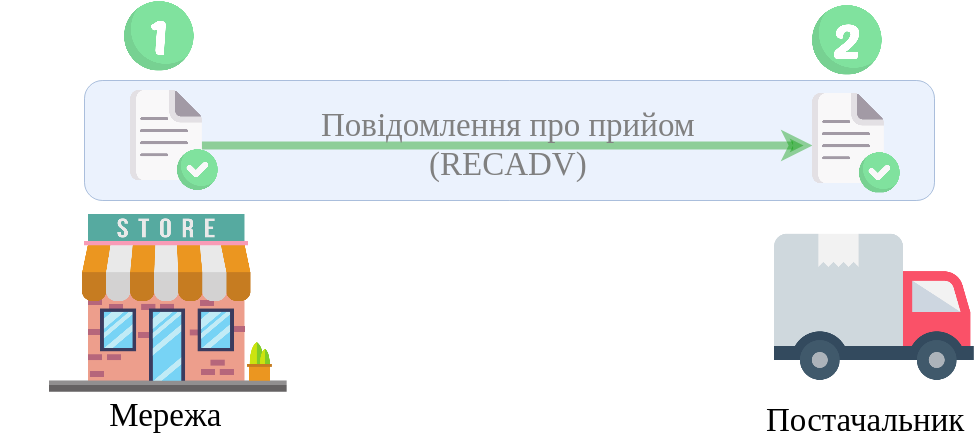

Алгоритм "Повідомлення про прийом" (RECADV)
#####################################################################################################################

.. role:: red

.. role:: underline

.. role:: green

.. role:: orange

.. role:: purple

----------------------------------------------------

----------------------------------------------------

Можливо налаштувати процес відправки документа з окремою дією створення чернетки чи без неї:

.. csv-table:: 
  :file: EDI_API_work.csv
  :widths:  40
  :stub-columns: 0

-------------------------

.. [extra] В алгоритмах з початковим створенням чернетки можливо організувати додаткову перевірку і редагування чернетки документа (за необхідності) іншими співробітниками Вашої компанії:

.. csv-table:: 
  :file: EDI_Draft_API_work.csv
  :widths:  40
  :stub-columns: 0

