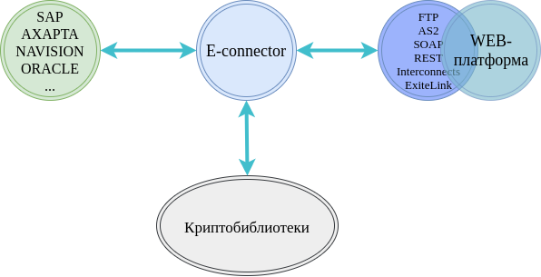

E-Connector
############

Інтеграція SAP, Microsoft Dynamics, AX/NAV, Oracle
==================================================

Основною архітектурною відмінністю при підключенні до інших ОС (відмінних від 1С | BAS) є використання в якості ERP-модуля E-connector від розробників EDIN (рис. 1).

Архітектура E-connector
==============================

*Рисунок 1 - Схема підключення та взаємодії SAP, Axapta, Navision, Oracle, Microsoft Dynamics, інших облікових систем (самописних в тому числі) і інтеграційного модуля E-connector*

**Для впровадження (установки) електронного документообігу в облікову систему користувача потрібно**:

1. E-connector, котрий складається з 3 основних компонентів:

- ESSClient.jar - виконуючий файл, написаний на java
- config.xml - файл з налаштуваннями відписання і передачі файлів
- start.bat - файл для запуску E-Connector

2. Додаткове ПЗ:

- Java client
- Встановлені основні сертифікати з повним дійсним шляхом сертифікації

**Вимоги до системи:**

#. Операційна система Windows XP SP3, Windows Vista SP2, Windows 7, Windows 8, Windows 10, Windows Server 2003 SP2; Windows Server 2008 SP2 і більш пізні версії, Linux;
#. Процесор з тактовою частотою не менше 1000 МГц;
#. Оперативної пам'яті не менше 512 Мбайт;
#. Вільного дискового простору не менше 100 Мбайт;
#. Підключення до мережі Інтернет на швидкості не менше 1 Мбіт/с.

.. note:: У разі використання Proxy необхідно налаштувати пропуск bypass до ресурсів без авторизації на Proxy, а також додати в виключення з правил кешування. Необхідно виключити ресурси EDIN з правил кешування як статичного, так і динамічного контенту.

**Налаштування**:

1. Відкрити файл конфігурації. Вказати логін, пароль до FTP (SOAP) і веб порталу;
2. Вказати налаштування каталогів (синхронізація документів), з якими працює E-connector, згідно підказкам в файлі конфігурації;
3. Установка параметрів підписання і проставлення відміток часу при підписанні в залежності від обраного режиму:

 - online - проставляється відмітка часу фактичного підписання. Передбачає прописування в налаштуваннях адреси і tcp порту АЦСК
 - offline - можливість підписання без інтернету (з періодичним включенням або перебоями) без позначки часу

4. Протестувати відправку документів
