#################################################################################
Інструкція користувача
#################################################################################

.. картинки:

.. |refresh| image:: pics_user_instruction_ettn/user_instruction_ettn_07.jpg

.. contents:: Зміст:
   :depth: 6

---------

Скорочення:

Е-ТТН – товарно-транспортна накладна в електронній формі

ОС - облікова система

ЕЦП - електронно-цифровий підпис/печатка

GLN - (Global Location Number) глобальний номер місцезнаходження

ЮЗД - юридично значимий документ/документообіг

---------

****************************************
**Робота з модулем**
****************************************

Вступ
==========================

Дана інструкція описує роботу з інтеграційним модулем сервісу EDIN "ETTN" для облікової системи (далі ОС). Інтеграційний модуль являє собою зовнішню обробку для інтеграції електронного документообігу між обліковою системою користувача та платформою EDIN 2.0. Модуль інтеграції створено для звичайних форм конфігурацій ОС, але також є можливість налаштування під нестандартні конфігурації. Для роботи з документами меню інтеграційного модуля розділено на:

* **"Вхідні"** - розділ для роботи з вхідними документами
* **"Відправлені"** - розділ для роботи з вихідними документами
* **"Чернетки"** - розділ для роботи зі створеними / підписаними, але ще не відправленими документами

.. hint::
    Розділ **"Налаштування"** описано в `Інструкції по налаштуванню <https://wiki.edin.ua/uk/latest/integration_ETTN/integration_guide.html>`__

.. image:: pics_user_instruction_ettn/user_instruction_ettn_11.jpg
   :align: center

1 "Вхідні"
================

Розділ вхідних документів (від контрагентів) при запуску модуля відкривається за замовчуванням. В журналі документів відображаються всі вхідні документи за датою їх отримання. Список документів можливо відфільтрувати за датою документа (поля "Дата з" / "по") та більш розширено за допомогою "Отбор EDI". Також можливо налаштувати кількість документів, що будуть виводитись на одній сторінці журналу (пагінація) - це дозволяє пришвидшити завантаження сторінки та роботу з новими документами. В залежності від `ролі користувача <https://wiki.edin.ua/uk/latest/ETTN_2_0/Work_with_ETTN.html#scenario>`__ (а також схеми, за якою працює дана компанія) і логіки документообігу вхідні документи можливо **"Підтвердити"**, **"Підписати"**, **"Відхилити"**. Також модуль дозволяє на підставі **"Підтвердження транспортування"** створити **"ТТН"**, **"Акт приймання-передавання"** чи одразу **"ТТН+Акт приймання передавання"**. 

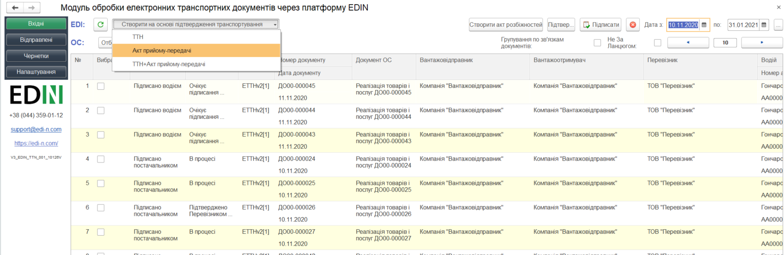

У розділі присутні кнопки оновлення списку документів |refresh| (оновлення вхідних документів з платформи електронного документообігу та довантаження створених документів з ОС).

**Групування по зв'язкам документів** – виділення пов'язаних документів однотипним кольором.

**Не за ланцюгом** – відображення всіх типів документів, що не увійшли до ланцюжка документів.

За допомогою кнопки **"Отбор EDI"** виводиться вікно для введення умов відбору документів:

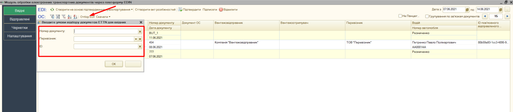

**Номер документу** - поле пошуку по повному або частковому збігу. Для часткового пошуку, використовується символ ``+``. Приклад: ``Номер: 123+`` - будуть знайдені всі документи, які починаються з 123.

**Перевізник** – вказується компанія-Перевізник. Також є можливість вибору за кодом ЄДРПОУ компанії.

**ID** – Унікальний ідентифікатор документа.

За допомогою кнопки **"Скачати"** можливо завантажити документи у вигляді zip архіву чи в PDF форматі:

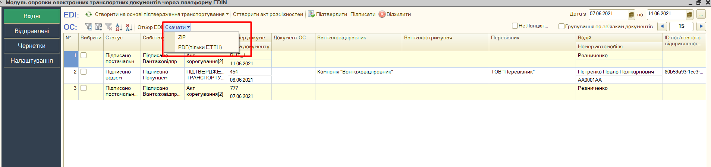

2 "Відправлені"
=======================

Розділ відправлених документів (до контрагентів) відображає в журналі документів всі відправлені документи за датою їх відправки. Аналогічно до розділу "Вхідних" документів "Відправлені" містить фільтри за датою документа (поля "Дата з" / "по") і також дозволяє налаштувати кількість документів, що будуть виводитись на одній сторінці журналу (пагінація). 

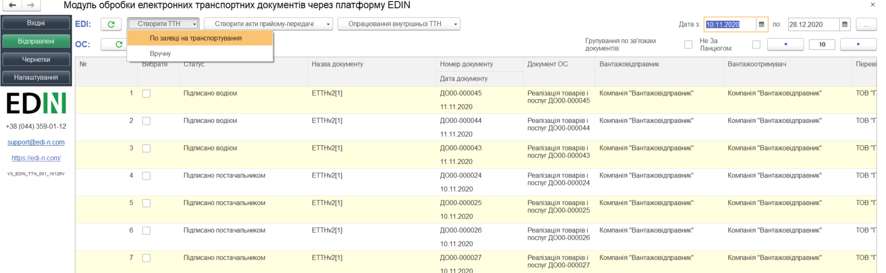

Передбачена робота з актами та додаткові дії з відправленими товарно-транспортними накладними.

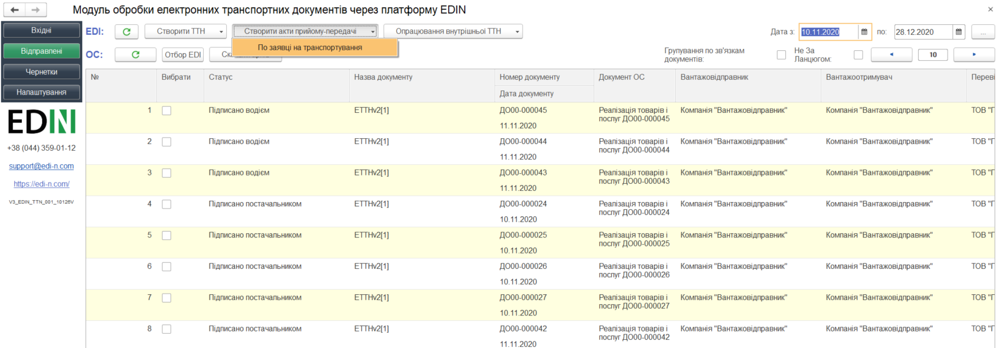

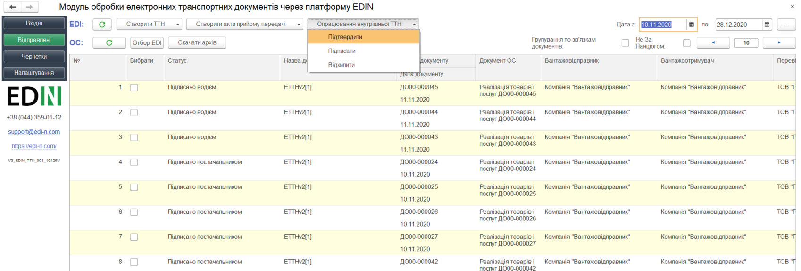

У розділі присутні кнопки оновлення списку документів |refresh| (оновлення вхідних документів з платформи електронного документообігу та довантаження створених документів з ОС).

3 "Чернетки"
=======================

"Чернетки" - це розділ, журнал якого містить створені, але ще не відправлені документи. Юридично значимі документи потрапляють до цього розділу не підписаними.

4 Створення та відправка документів
==============================================

Документи сервісу EDIN "ETTN" рекомендовано створювати з розділу "Чернетки". Для цього потрібно **"Обновити"** список документів, що можуть стати підставою до формування електронного документа (`налаштування <https://wiki.edin.ua/uk/latest/integration_ETTN/integration_guide.html>`__), обрати (відмітити галочкою) документ та натиснути **"Створити чернетку"**: 

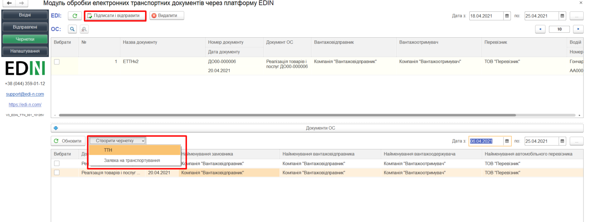

Згідно налаштувань документ-чернетка автоматично заповниться, а незаповнені поля (за потреби) можливо ввести вручну:

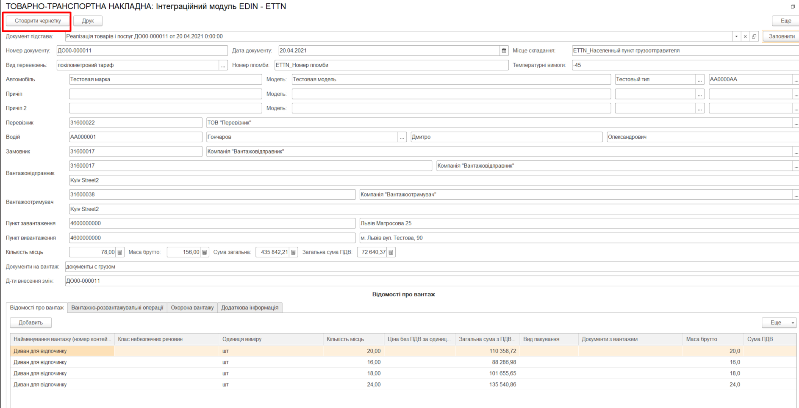

Далі потрібно обрати заповнений документ-чернетку (відмітка галочкою) та натиснути кнопку **"Підписати та відправити"**: 

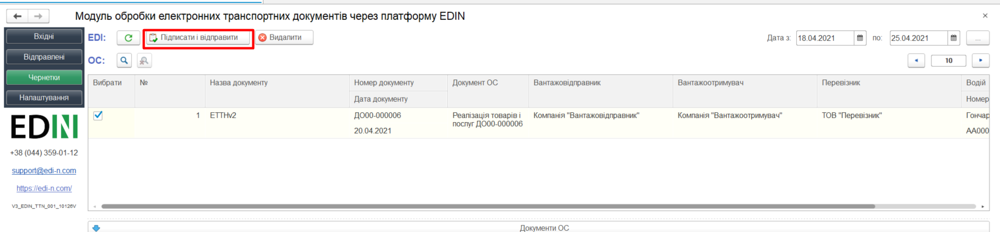

.. attention::
    Якщо при відправці документу були не заповнені обов'язкові поля, то модуль інтеграції повідомить про це чи інші помилки в службових сповіщеннях.

Для видалення чернетки також доступна кнопка "Видалити".

Аналогічно можливо створити ТТН на підставі вхідних та відправлених документів:

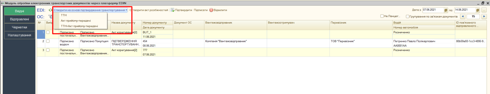

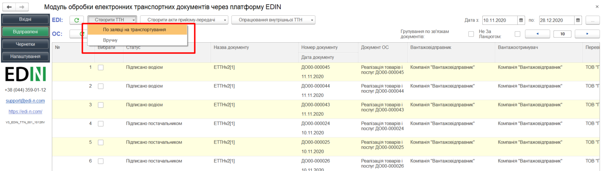

Створені документи потраплять у "Чернетки" для подальшого підписання та відправки.

-------------------------------------

.. include:: /_constant/kontakti.rst
