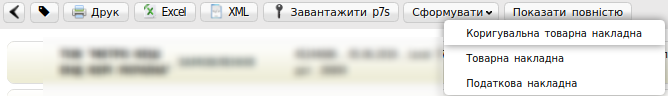
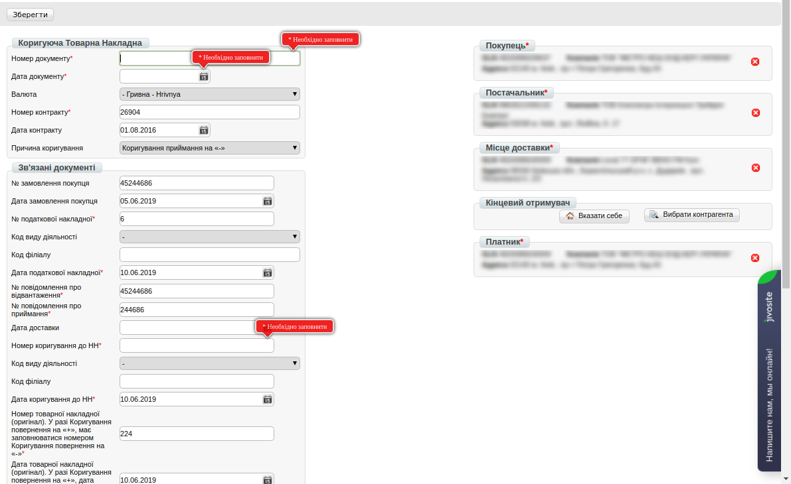
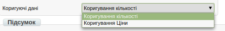
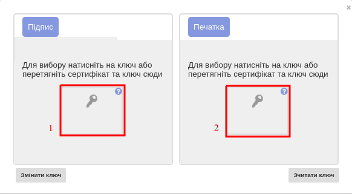
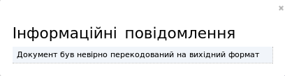
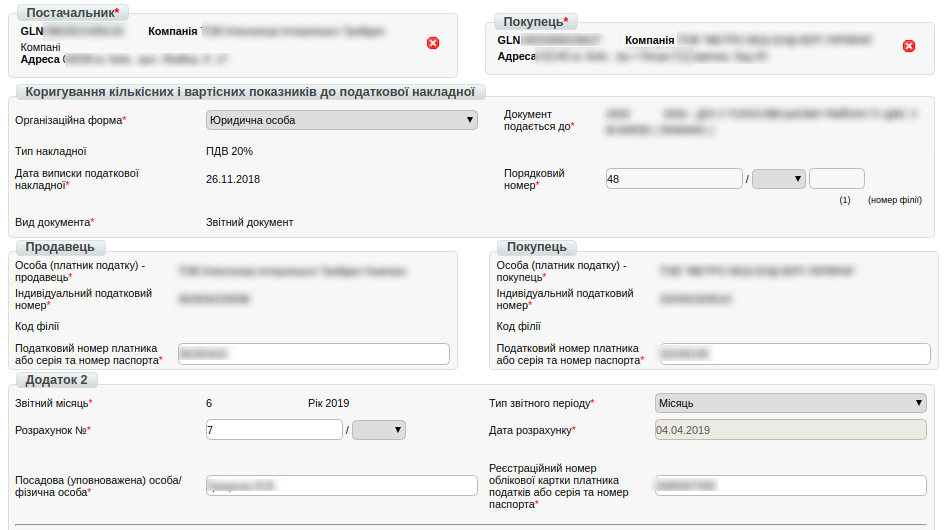
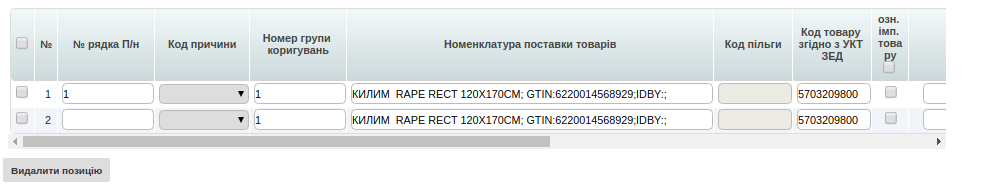
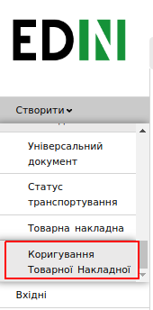

Формування Коригувальних Товарної і Податкової накладних (РКТН и РКПН)
############################################################################

.. role:: red

.. contents:: Зміст:
   :depth: 6

---------

Вступ
=======================

Дана інструкція описує порядок формування Коригувальної Товарної накладної (**РКТН**) і Коригувальної Податкової накладної (**РКПН**) на web-платформі.

.. important:: **Увага!**  Для коректного формування документів, необхідно заповнити Товарний довідник. Ви можете подивитися `Інструкцію щодо заповнення довідника <https://wiki.edi-n.com/uk/latest/general/Zapolnenie_Tovarnogo_spravochnika.html>`_.

Коригувальна товарна накладна
=============================================

Перед початком роботи з даними документами необхідно заповнити всі реквізити компанії і ПІБ підписанта.

.. important:: **Увага!** Завершеним ланцюжком документообігу з мережею, є відправлена Коригувальна товарна накладна, з коректним статусом, плюс створена на підставі РКТН і зареєстрована РКПН.

Заповнення реквізитів компанії
----------------------------------------------------

Далі, перейдіть в розділ "**Налаштування**" (у правому верхньому куті):

.. image:: pics_Formirovanie_Korrektirovochnyh_Tovarnoj_i_Nalogovoj_nakladnoj/Korrekt_01.png
   :align: center

Натисніть на закладку "**Мої компанії**" і виберыть GLN, з якого відбуватиметься відправка документів.

.. image:: pics_Formirovanie_Korrektirovochnyh_Tovarnoj_i_Nalogovoj_nakladnoj/Korrekt_02.png
   :align: center

У формі заповніть поля обов'язкові для заповнення (відзначені червоною зірочкою :red:`*` ).

.. important:: **Зверніть увагу!** Реквізити заповнюються українською мовою і повинні відповідати інформації в реєстраційних документах компанії.

.. image:: pics_Formirovanie_Korrektirovochnyh_Tovarnoj_i_Nalogovoj_nakladnoj/Korrekt_03.png
   :align: center

Після заповнення всіх даних, збережіть зміни, натиснувши на відповідну кнопку «Зберегти».

Методи створення Коригувальної товарної накладної
----------------------------------------------------

Створити РКТН можливо двома способами:

1. Через меню «Створити» вибравши Коригувальну товарну накладну
2. На підставі Товарної накладної

*Рекомендується формувати Коригувальну товарну накладну на підставі Товарної накладної.*

Нижче наведено приклад формування Коригувальної товарної накладної на підставі Товарної накладної.

Для формування комплекту документів, необхідно перейти в розділ «**Відправлені**».

Для зручності, відфільтруйте документи по потрібній мережі і вкажіть тип документа «**Товарна накладна**».

.. image:: pics_Formirovanie_Korrektirovochnyh_Tovarnoj_i_Nalogovoj_nakladnoj/Korrekt_04.png
   :align: center

Відкрийте документ «**Товарна накладна**» і натисніть кнопку «**Сформувати**», потім виберіть зі списку документ «**Коригувальна товарна накладна**».

Заповнення Коригувальної товарної накладної
----------------------------------------------------

У відкритому документі, необхідно заповнити обов'язкові дані, позначені червоною зірочкою :red:`*`, в кожному з блоків.

Обов'язковими до заповнення в документі, є блок «**Причина коригування**». Вкажіть потрібний варіант.

.. image:: pics_Formirovanie_Korrektirovochnyh_Tovarnoj_i_Nalogovoj_nakladnoj/Korrekt_07.png
   :align: center

Так само, необхідно вибрати необхідний пункт в блоці «**Коригувальні дані**».

Є кілька причин коригування:

1. **Коригування приймання на "-"** - в блоці товарних позицій в поле "Кількість товару за накладною (коректувальною)", чи в "Ціна товару" за накладною (коректувальною) вказуємо значення зі знаком "-". Поля "Замовлена кількість" і "Ціна без ПДВ" повинні залишатися незмінними.

2. **Коригування приймання на "+"** - в блоці товарних позицій в поле "Кількість товару за накладною (коректувальною)", або в "Ціна товару" за накладною (коригувальною) вказуємо значення без знаків. Поля "Замовлена кількість" і "Ціна без ПДВ" повинні залишатися незмінними.

3. **Коригування приймання повернення на "-"** - в блоці товарних позицій в поле "Кількість товару за накладною (коректувальною)", чи в "Ціна товару" за накладною (коректувальною) вказуємо значення зі знаком "-". Поля "Замовлена кількість" і "Ціна без ПДВ" повинні залишатися незмінними.

4. **Коригування приймання повернення на "+"** - в блоці товарних позицій в поле "Кількість товару за накладною (коректувальною)", або в "Ціна товару" за накладною (коригувальною) вказуємо значення без знаків. Поля "Замовлена кількість" і "Ціна без ПДВ" повинні залишатися незмінними.

Натиснувши по найменуванню товарної позиції, Ви зможете внести додаткові зміни, окрім "**Кількість**" і "**Ціна без ПДВ**".

.. image:: pics_Formirovanie_Korrektirovochnyh_Tovarnoj_i_Nalogovoj_nakladnoj/Korrekt_09.png
   :align: center

При перевірці внесених даних за товарними позиціями необхідно упевниться, що обов'язково заповнене поле «**код УКТ ЗЕД**».

У разі, якщо поле не заповнено або заповнено некоректно, при збереженні документа буде виведено повідомлення, як на зображенні нижче:

.. image:: pics_Formirovanie_Korrektirovochnyh_Tovarnoj_i_Nalogovoj_nakladnoj/Korrekt_10.png
   :align: center

Для того, щоб поле з кодом **УКТ ЗЕД** при додаванні товарної позиції заповнювалось автоматично, необхідно, щоб дані були заповнені в Товарному довіднику.

Після внесення всіх даних за товарною позицією, натисніть кнопку «**Зберегти**».

Завершивши редагування документа «**Коригувальна товарна накладна**», його необхідно зберегти, підписати ЕЦП та відправити в мережу.

Підписання документа Коригувальна Товарна Накладна
---------------------------------------------------------

Після збереження документа, його необхідно підписати Електронно-Цифровим підписом (ЕЦП).

.. image:: pics_Formirovanie_Korrektirovochnyh_Tovarnoj_i_Nalogovoj_nakladnoj/Korrekt_11.png
   :align: center

Для первинного налаштування ЕЦП, дочекайтесь завантаження сторінки, а потім натисніть кнопку “**Зчитати ключі**”.

.. image:: pics_Formirovanie_Korrektirovochnyh_Tovarnoj_i_Nalogovoj_nakladnoj/Korrekt_12.png
   :align: center

Потім, в блоці налаштування ЕЦП, натисніть на зображення ключа і виберіть з каталогу, де зберігаються Ваші секретні ключі, відповідний файл.

Види файлів електронно-цифрового підпису
----------------------------------------------------

Якщо Ви використовуєте ключі від **АЦСК "Україна"**, файли підписів секретних ключів мають розширення **.ZS2** і наступні значення в іменах файлів:

* Директор «DS»
* Бухгалтер «BS»
* Співробітник «SS»
* Печатка «S»
* Шифрування «C»
* Універсальний ключ печатки і шифрування «U»

.. image:: pics_Formirovanie_Korrektirovochnyh_Tovarnoj_i_Nalogovoj_nakladnoj/Korrekt_14.png
   :align: center

Якщо Ви використовуєте ключі від **АЦСК “ПриватБанк”**, файли підписів секрентних ключів мають розширення **.jks**:

.. image:: pics_Formirovanie_Korrektirovochnyh_Tovarnoj_i_Nalogovoj_nakladnoj/Korrekt_15.png
   :align: center

Якщо Ви використовуєте ключі від будь-яких інших **АЦСК**, файли підписів секрентних ключів мають найменування **Key-6.dat**:

.. image:: pics_Formirovanie_Korrektirovochnyh_Tovarnoj_i_Nalogovoj_nakladnoj/Korrekt_16.png
   :align: center

Після вибору секретних ключів, введіть паролі під кожним з них, а потім натисніть кнопку “**Зчитати ключі**”

.. image:: pics_Formirovanie_Korrektirovochnyh_Tovarnoj_i_Nalogovoj_nakladnoj/Korrekt_17.png
   :align: center

При коректному зчитуванні ключів, в блоці “**ЕЦП**” з’явиться інформація про власників ключів. Після перевірки інформації натисніть кнопку “**Підписати**”.

.. image:: pics_Formirovanie_Korrektirovochnyh_Tovarnoj_i_Nalogovoj_nakladnoj/Korrekt_18.png
   :align: center

Після підписання натисніть на кнопку “**Відправити**”.

Статуси по Коригувальній товарній накладній
----------------------------------------------------

Після відправки відповідних документів, торговельна мережа обробляє їх і надає їм статуси. Статуси відображаються в розділі "**Відправлені**", навпроти кожного документа.

Приклад коректного статусу:

.. image:: pics_Formirovanie_Korrektirovochnyh_Tovarnoj_i_Nalogovoj_nakladnoj/Korrekt_19.png
   :align: center

Приклад некоректного статусу:

- «**Документ переданий партнеру**» - товарна накладна коректна.
- «**Документ переданий на ящик партнера**» - товарна накладна коректна.
- «**Правильний канал не знайдено. Немає з'єднання з партнером**» - в товарній накладній зазначений некоректний GLN одержувача і покупця.
- «**Помилка конвертації на вихідний формат**» - є помилка у формі заповнення товарної накладної. Деякі поля були не заповнені або заповнені некоректно.

У разі виникнення подібної помилки прохання звертатися за адресою ел. пошти support@edi-n.com

Коригувальна Податкова накладна
==========================================================

Коригувальна Податкова накладна формується на підставі раніше відправленої Коригувальної товарної накладної.

Для формування документа РКПН, перейдіть в розділ «**Відправлені**», відфільтруйте документи за потрібною роздрібною мережею і типом «**Коригувальна товарна накладна**».

.. image:: pics_Formirovanie_Korrektirovochnyh_Tovarnoj_i_Nalogovoj_nakladnoj/Korrekt_21.png
   :align: center

Відкрийте документ «**Коригувальна товарна накладна**» і натисніть кнопку «**Сформувати**», потім виберіть зі списку документ «**Коригувальна податкова накладна**».

.. image:: pics_Formirovanie_Korrektirovochnyh_Tovarnoj_i_Nalogovoj_nakladnoj/Korrekt_22.png
   :align: center

У сформованому документі «**Коригувальна податкова накладна**», дані автоматично підтягнуться з "Коригувальної товарної накладної" - їх необхідно звірити, після цього приступити до внесення корегованих даних.

Внизу документа знаходиться перелік товарних позицій, які переносяться з документа «Коригування до Товарної Накладної».

Всі інші поля ви заповнюєте самостійно згідно чинного податкового законодавства України.

Після заповнення всіх даних, документ необхідно зберегти, підписати ЕЦП та відправити аналогічно "Коригувальній Товарній накладній".

Документ буде доставлений покупцеві для подальшої реєстрації на сервері ЄРПН.

Статуси по Коригувальній податковій накладній
----------------------------------------------------

Після перевірки документа органом Державної Податкової Інспекції, йому буде присвоєно статус.

На коректний документ надійде статус «**Зареєстровано в ЄРПН і відправлено покупцеві**».

На некоректний документ надійде статус  «**Помилка при реєстрації в ЄРПН**».

У разі отримання статусу «**Помилка при реєстрації в ЄРПН**» прохання звертатися за адресою ел. пошти support@edi-n.com.

Формування РКТН і РКПН, через функціонал «Створити документ»
==============================================================

У разі, якщо документ «**Товарна накладна**» не відправився, «**Коригувальну товарну накладну**», необхідно сформувати самостійно через меню «**Створити**».

Додавання товарних позицій
----------------------------------------------------

Із випадаючого списка, виберіть документ «**Коригування товарної накладної**».

У сформованому документі всі реквізити необхідно ввести вручну, на підставі паперових документів.

Після внесення реквізитів в документ, потрібно ввести товарні позиції. Для цього натисніть кнопку «**Додати позицію**».

.. image:: pics_Formirovanie_Korrektirovochnyh_Tovarnoj_i_Nalogovoj_nakladnoj/Korrekt_26.png
   :align: center

У формі, що з'явилася, заповніть всі обов'язкові поля, позначені червоною зірочкою :red:`*`. Після внесення даних збережіть зміни.

.. image:: pics_Formirovanie_Korrektirovochnyh_Tovarnoj_i_Nalogovoj_nakladnoj/Korrekt_27.png
   :align: center

Зверніть увагу, що для того, щоб поле «**код УКТ ЗЕД**» при виборі товарної позиції заповнювалось автоматично, дані необхідно заповнити в Товарному довіднику.

Заповнення даних документа відбувається аналогічно пунктам 5 і 6 цієї інструкції.

Після додавання всіх товарних позицій, документ необхідно зберегти, підписати ЕЦП та відправити в торговельну мережу.

Ця процедура, аналогічна пунктам 8 та 9 даної інструкції.

Формування Коригувальної податкової накладної
----------------------------------------------------

Перейдіть в розділ «**Відправлені**», знайдіть і відкрийте раніше відправлену "Товарну накладну".

.. image:: pics_Formirovanie_Korrektirovochnyh_Tovarnoj_i_Nalogovoj_nakladnoj/Korrekt_28.png
   :align: center

У відкритому документі натисніть кнопку «Сформувати», потім виберіть зі списку документ «**Податкова накладна**».

Дані в документі будуть заповнені автоматично на підставі "Товарної накладної". У "Податковій накладній" необхідно заповнити порядковий номер.

Після додавання всіх товарних позицій, документ необхідно зберегти, підписати ЕЦП та відправити в торговельну мережу.

Ця процедура, аналогічна пунктам 6 та 7 даної інструкції.

Подальше формування і відправка документа **Коригувальна податкова накладна** відбувається аналогічно пунктам 12 і 13 даної інструкції.

.. include:: kontakti.rst
