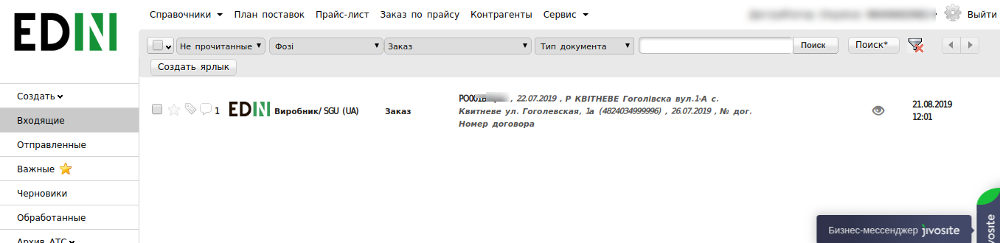
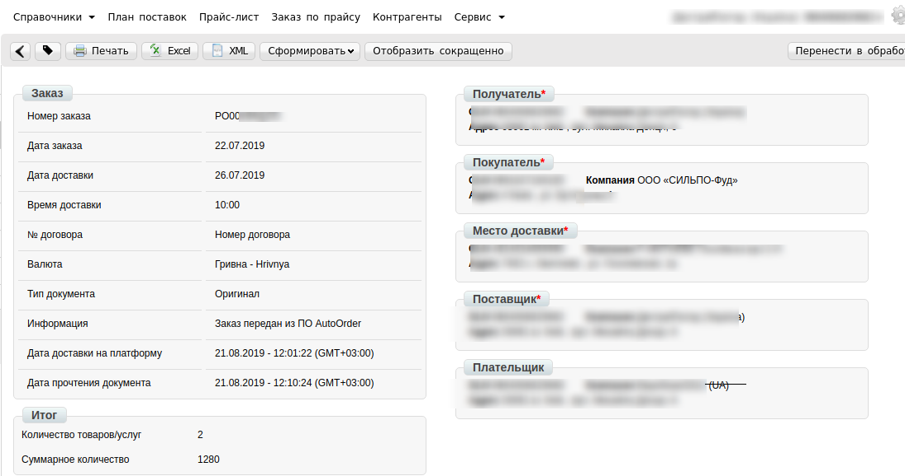
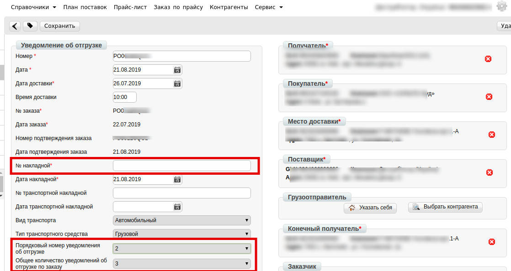
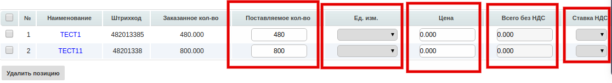

######################################################################
Інструкція по роботі з мережею Фоззі на веб-платформі EDI-Network
######################################################################

.. role:: red

.. contents:: Зміст:
   :depth: 6

---------

****************************************
**Вступ**
****************************************

Дана інструкція описує порядок формування документів  «Підтвердження замовлення» (ORDRSP) і «Повідомлення про відвантаження» (DESADV) у відповідь на **Замовлення**, та підписання або відмову від підписання Комерційного документа «Прибуткова Накладна» по мережі Фоззі. 
Також описаний порядок роботи з  документом «Повідомлення про повернення» (RETANN), підписання або відмову від підписання Комерційного документа «Накладна на повернення» (COMDOC).

.. admonition:: Важливо!

   Накладна на повернення формується Покупцем. Постачальник повинен в себе в обліку врахувати саме підписані обома сторонами накладні на повернення, а відповідно виходячи із їх даними скласти розрахунки коригування до податкових накладних. 
   Ціни в накладних на повернення беруться із останніх прибуткових накладних проведених в обліковій системі Покупця на моменту формування замовлень на повернення. При тому якщо повертається кількість більша ніж є в останньому прихідному документів – то береться передаючий йому документ приходу й так далі.

.. image:: pics_EDI-N_OKKO_instruction/1.jpg
   :align: center

*****************************************************************************************
1. Формування вихідного документа **«Підтвердження замовлення»(ORDRSP)** у відповідь на Замовлення 
*****************************************************************************************

.. admonition:: Важливо!

   Даний документ формується відразу після отримання замовлення від мережі.

Для того, що б знайти ваші **Замовлення**, натисніть на папку **Вхідні**.

Для зручності пошуку виберіть в першому фільтрі - **Не прочитані**, у другому - **Фоззі**, в третьому - тип документа **Замовлення**.

Для відкриття вхідного документа натисніть на нього.

У відкритому документі виберіть **Сформувати** → **Підтвердження замовлення**.

.. image:: pics_Rabota_s_Fozzy/Rabota_s_Fozzy_4.png
   :align: center

У відкритому вікні з'явиться **Форма** для заповнення необхідних реквізитів документа. Всі поля, позначені червоною зірочкою * є обов'язковими для заповнення. Інформація про Покупця, Постачальника та Місце доставки автоматично заповниться із Замовлення. 

1. **Номер** - може збігатися з номером замовлення.
2. **Дата** - дата підтвердження, автоматично вказується поточна дата.
3. **Дата замовлення** автоматично переноситься з замовлення.
4. **Узгоджена дата поставки** - дата фактичного постачання товару по даному замовленню, переноситься автоматично з замовлення (в разі, якщо з мережею узгоджений перенесення на іншу дату, її потрібно змінити).
5. **Дії** - вибираються зі списку такі дії: **Буде доставлено**, **Зміна кількості**, або **Відмовлено**.

Нижче на сторінці створеного документу знаходиться перелік товарних позицій, які були замовлені, і їх кількість. Зверніть увагу, що у табличній частині з позиціями немає цін:

.. image:: pics_Rabota_s_Fozzy/Rabota_s_Fozzy_2.png
   :align: center

Інформація по позиціям:

#. **Номер** - номер повідомлення про відвантаження по даному замовленню (Автоматично встановлюється номер замовлення).
#. **Назва позиції** - дата повідомлення про відвантаження, автоматично встановлюється поточна дата.
#. **Штрихкод** - дата фактичної доставки по даному замовленню. Переноситься автоматично з замовлення. Якщо з мережею узгоджений перенесення на інший день, дату необхідно змінити.
#. **Кільксть** автоматично переноситься з замовлення.
#. **Одиниці вимірювання** автоматично переноситься з замовлення.
#. **№ артикула покупця** - номер Видаткової Накладної по даному замовленню
#. **Мінімальна кільксть замовлення** автоматично переноситься з замовлення.

Для відправки документа натискаємо на кнопку **Зберегти**, внесені зміни вступають в силу, а потім - **Надіслати**:

************************************************************************************
2. Формування вихідного документа **«Повідомлення про відвантаження»(DESADV)**
************************************************************************************

Розглянемо формування «Повідомлення про відвантаження» на підставі «Підтвердження замовлення».

Перейдіть в розділ **Вихідні**, у виберіть другому фільтрі - **Фоззі**, в третьому - тип документа **Підтвердження замовлення**.

У відкритому документі натисніть **Сформувати** → **Повідомлення про відвантаження**.

У вікні з'явиться **Форма** для заповнення необхідних реквізитів документа, деякі поля заповняться із Замовлення. Всі поля, позначені червоною зірочкою *** обов’язкові до заповнення**.

1. **Номер** - номер повідомлення про відвантаження по даному замовленню (Автоматично встановлюється номер замовлення)
2. **Дата** - дата повідомлення про відвантаження, автоматично встановлюється поточна дата
3. **Дата доставки** - дата фактичної доставки по даному замовленню. Переноситься автоматично з замовлення. Якщо з мережею узгоджений перенесення на інший день, дату необхідно змінити, але не раніше дати формування докмента
4. **№ накладної** - можливо вказати номер Видаткової Накладної по даному замовленню, або свій внутрішній номер
5. **Дата накладної** - дата Видаткової Накладної
6. **Порядковий № Повідомлення про відвантаження** - на кожну одиницю транспорту потрібно своє повідомлення з порядковиим номером (якщо авто=1, то повідомлення=1)
7. **Загальна кількість Повідомлень про відвантаження** - на кожну одиницю транспорту потрібно своє повідомлення, у цьому полі необхідно вказати їх загальку кількість(кількість авто = кількості повідомлень)
8. **№ замовлення** автоматично переноситься з замовлення
9. **Дата замовлення** автоматично переноситься з замовлення

.. admonition:: Важливо!

   У разі створення декількох видаткових накладних на одне замовлення, необхідно на кожну накладну сформувати **повідомлення про відвантаження**.

Нижче на сторінці сформованого документа знаходиться перелік товарних позицій, які були замовлені, і їх кількість а також ціна, ставка ПДВ та інша інформвція що заповниться із Товарного довідника.

**Поставляєма кількість** -  кількість що поставляється в одиниці транспорту, значення повинно дорівнювати замовленому. В даному розділі необхідно вказати **кількість тов.позицій**, яка поставляється, що відповідає тій кількості, **що у вас вказано у видатковій накладній**.

4. **Поставляєма кількість** - можливо вказати номер Видаткової Накладної по даному замовленню, або свій внутрішній номер
5. **одиниці виміру** - дата Видаткової Накладної
6. **Порядковий № Повідомлення про відвантаження** - на кожну одиницю транспорту потрібно своє повідомлення з порядковиим номером (якщо авто=1, то повідомлення=1)
7. **Загальна кількість Повідомлень про відвантаження** - на кожну одиницю транспорту потрібно своє повідомлення, у цьому полі необхідно вказати їх загальку кількість(кількість авто = кількості повідомлень)
8. **№ замовлення** автоматично переноситься з замовлення
9. **Дата замовлення** автоматично переноситься з замовлення

Для відправлення документа натискаємо на кнопку **Зберегти**, після чого всі внесені зміни вступають в силу, а потім - **Надіслати**:

.. image:: pics_EDI-N_OKKO_instruction/15.png
   :align: center

.. admonition:: Важливо!

   Різниця між вказаною кількістю товару в повідомленні про відвантаження та фактично прийнятою кількістю, зазначається в паперовому акті недовозу(невідповідності).
************************************************************************************
3. Формування документа **«Інструкція з транспортування» (IFTMIN)**
************************************************************************************
Створення документа відбувається на підставі «**Замовлення**».

Перейдіть в розділ «**Вхідні**», для зручності пошуку виберіть в фільтрі необхідну мережу і тип документа «**Замовлення**».

.. image:: pics_formirovanie_dokumenta_Instrukcija_po_transportirovke_IFTMIN_na_platforme/formirovanie_dokumenta_Instrukcija_po_transportirovke_IFTMIN_na_platforme_01.png
   :align: center

У відкритому документі, натисніть кнопку «**Сформувати**» і виберіть зі списку документ «**Інструкція з транспортування**».

.. image:: pics_formirovanie_dokumenta_Instrukcija_po_transportirovke_IFTMIN_na_platforme/formirovanie_dokumenta_Instrukcija_po_transportirovke_IFTMIN_na_platforme_02.png
   :align: center
   
У вікні з'явиться **Форма** для заповнення необхідних реквізитів документа. Всі поля, позначені червоною зірочкою ***** обов'язкові для заповнення.

Заповнення документа (IFTMIN)
========================================================

#. **Номер** документа повинен бути наступного формату **X_Y**, де:

- **Х - це порядковий номер машини, на поставку**
- **Y - це загальна кількість машин, на поставку**

Важливо, для кожної машини на поставку в один день повинен бути індивідуальний номер машини. Дві машини з однаковим номером машини будуть групуватися в одну.

Мінімальна к-ть 1, Максимальна - 99.
Х повинен бути менше або рівним Y. *Наприклад: 2_5*

2. **Дата** - фактична дата відправки поставки
#. **Номер замовлення** - підтягується автоматично із замовлення
#. **Фактична кількість палет** - кількість палет, що відвантажується в вантажний транспорт
#. **Максимальна кількість палет** - максимальна місткість палет (вантажний транспорт)
#. **Вантажопідйомність** - маса вантажу, на перевезення якого розрахований транспортний засіб

.. image:: pics_formirovanie_dokumenta_Instrukcija_po_transportirovke_IFTMIN_na_platforme/formirovanie_dokumenta_Instrukcija_po_transportirovke_IFTMIN_na_platforme_03.png
   :align: center
   
После внесения всех данных в документе, нажмите кнопку «**Сохранить**», затем «**Отправить**».

.. image:: pics_formirovanie_dokumenta_Instrukcija_po_transportirovke_IFTMIN_na_platforme/formirovanie_dokumenta_Instrukcija_po_transportirovke_IFTMIN_na_platforme_04.png
   :align: center

Відправлений документ автоматично потрапляє в папку «**Відправлені**» і буде знаходиться в ланцюжку документів разом із **Замовленням** і **Підтвердженням замовлення**.

************************************************************************************
4. Обробка документа **«Повідомлення про прийом» (RECADV)**
************************************************************************************

.. admonition:: Важливо!

   Просимо підписати чи відхилити документ, не пізніше наступного дня, після отримання Прибуткової накладної! Накладна містить **фактичну** кількість прийнятого товару.

:red:`Перед підписання потрібно звірити вірність вказаних:`

:red:`- номера та дати видаткової накладної постачальника`

:red:`- кількості та номенклатури поставки`

:red:`- загальної суми накладної, а у випадку розходження – по кожному товару знайти причину невідповідності.`

.. image:: pics_EDI-N_OKKO_instruction/16.png
   :align: center

Для відкриття вхідного документа натисніть на нього.

.. image:: pics_EDI-N_OKKO_instruction/17.png
   :align: center

Для того, щоб перевірити відображення всіх переданих даних електронного документа, натисніть **"Показати повністю"**.

Лінією прокрутки, перевірте правильність даних в табличній частині та полі **"Підсумок"**. 
Для друку документа натисніть кнопку **Друк**. Якщо документ необхідно зберегти в форматі Exсel або XML натисніть кнопку **Exсel** або **XML** відповідно.

Для завершення документообігу по данній поставці, натисніть кнопку **«Закрити поставку»**.

.. image:: pics_EDI-N_OKKO_instruction/23.png
   :align: center

Після підписання документа, натисніть кнопку **"Відправити"**.

.. image:: pics_EDI-N_OKKO_instruction/24.png
   :align: center

************************************************************************************
5. Відмова від підписання Коммерційного документа «Прибуткова Накладна»
************************************************************************************

Якщо дані в цьому комерційному документі невірні, тоді ви можете **відмовитися** від підписання даного документа. Для цього необхідно в відкритому документі справа вгорі натиснути **ярлик**:

.. image:: pics_EDI-N_OKKO_instruction/25.png
   :align: center

Після цього з'явиться вікно, в якому необходимо **підтвердити відмову** від Підписання.

.. image:: pics_EDI-N_OKKO_instruction/26.png
   :align: center

В наступному вікні потрібно ввести причину відмови від підписання і натиснути **ОК**.

.. image:: pics_EDI-N_OKKO_instruction/27.png
   :align: center

.. admonition:: Важливо!

   Просимо вказати розгорнуту причину відмови, а також правильну інформацію, яка має бути вказана в Прибутковій накладній! Не припустимо писати - «сума видаткової накладної відрізняється від суми прибуткової накладної» або «не коректна кількість прийнятого товару» тощо. З такого тексту не зрозуміло які мають бути вірні дані по загальній сумі, по загальній кількості та по конкретній позиції (кількості та/або ціні) тощо.

------------------

.. include:: kontakti.rst

