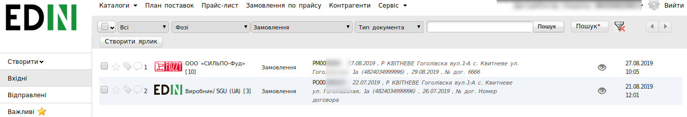
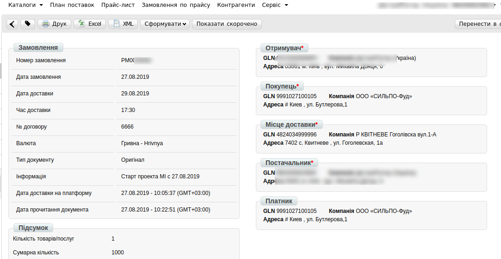
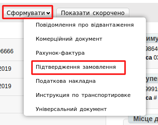
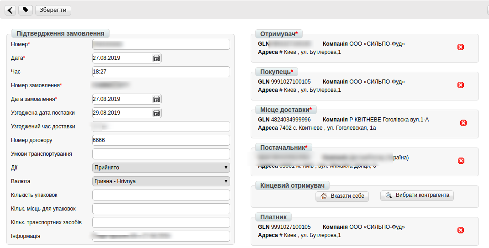
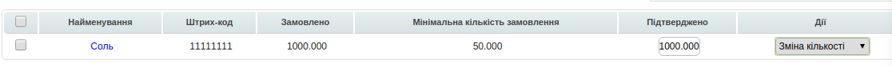

######################################################################
Інструкція по роботі з мережею Фоззі на веб-платформі EDI-Network
######################################################################

.. role:: red

.. contents:: Зміст:
   :depth: 6

---------

****************************************
**Вступ**
****************************************
Дана інструкція описує порядок формування документів для документотобігу із мережею Фоззі.

Дана інструкція описує порядок формування документів від постачальника «Підтвердження замовлення» (ORDRSP) і «Повідомлення про відвантаження» (DESADV) у відповідь на **Замовлення** по мережі Фоззі. 

*****************************************************************************************
1. Формування вихідного документа **«Підтвердження замовлення»(ORDRSP)** у відповідь на Замовлення 
*****************************************************************************************

.. admonition:: Важливо!

   Даний документ формується відразу після отримання замовлення від мережі.

Для того, що б знайти ваші **Замовлення**, натисніть на папку **Вхідні**.

Для зручності пошуку виберіть в першому фільтрі - **Не прочитані**, у другому - **Фоззі**, в третьому - тип документа **Замовлення**.

Для відкриття вхідного документа натисніть на нього.

У відкритому документі виберіть **Сформувати** → **Підтвердження замовлення**.

У відкритому вікні з'явиться **Форма** для заповнення необхідних реквізитів документа. Всі поля, позначені червоною зірочкою * є обов'язковими для заповнення. Інформація про Покупця, Постачальника та Місце доставки автоматично заповниться із Замовлення. 

1. **Номер** - може збігатися з номером замовлення.
2. **Дата** - дата підтвердження, автоматично вказується поточна дата.
3. **Дата замовлення** автоматично переноситься з замовлення.
4. **Узгоджена дата поставки** - дата фактичного постачання товару по даному замовленню, переноситься автоматично з замовлення (в разі, якщо з мережею узгоджений перенесення на іншу дату, її потрібно змінити).
5. **Дії** - вибираються зі списку такі дії: **Буде доставлено**, **Зміна кількості**, або **Відмовлено**.

Нижче на сторінці створеного документу знаходиться перелік товарних позицій, які були замовлені, і їх кількість. Зверніть увагу, що у табличній частині з позиціями немає цін:

Інформація по позиціям, автоматично переноситься із Замовлення:

#. **Номер** - номер позиції
#. **Назва позиції** - назва позиції іх товарного довідника
#. **Штрихкод** - штрихкод товарної позиції, полегшує пошук, переноситься автоматично з замовлення
#. **Кільксть** автоматично переноситься з замовлення.
#. **Одиниці вимірювання** автоматично переноситься з замовлення
#. **№ артикула покупця** - автоматично переноситься з замовлення
#. **Мінімальна кільксть замовлення** автоматично переноситься з замовлення

Для відправки документа натискаємо на кнопку **Зберегти**, внесені зміни вступають в силу, а потім - **Відправити**.

.. image:: pics_Rabota_s_Fozzy/Rabota_s_Fozzy_006.png
   :align: center

************************************************************************************
2. Формування вихідного документа **«Повідомлення про відвантаження»(DESADV)**
************************************************************************************

Розглянемо формування «Повідомлення про відвантаження» на підставі вихідного документа «Підтвердження замовлення».

Перейдіть в розділ **Вихідні**, у виберіть другому фільтрі - **Фоззі**, в третьому - тип документа **Підтвердження замовлення**.

У відкритому документі натисніть **Сформувати** → **Повідомлення про відвантаження**.

У вікні з'явиться **Форма** для заповнення необхідних даних документа, деякі поля заповняться із Замовлення. Всі поля, позначені червоною зірочкою *** обов’язкові до заповнення**.

.. image:: pics_Rabota_s_Fozzy/Rabota_s_Fozzy_007.png
   :align: center

1. **Номер** - номер повідомлення про відвантаження по даному замовленню (Автоматично встановлюється номер замовлення)
2. **Дата** - дата повідомлення про відвантаження, автоматично встановлюється поточна дата
3. **Дата доставки** - дата фактичної доставки по даному замовленню. Переноситься автоматично з замовлення. Якщо з мережею узгоджений перенесення на інший день, дату необхідно змінити, але не раніше дати формування докмента
4. **№ накладної** - можливо вказати номер Видаткової Накладної по даному замовленню, або свій внутрішній номер
5. **Дата накладної** - дата Видаткової Накладної
6. **Порядковий № Повідомлення про відвантаження** - на кожну одиницю транспорту потрібно своє повідомлення з порядковиим номером (якщо № авто=1, то повідомлення=1)
7. **Загальна кількість Повідомлень про відвантаження** - на кожну одиницю транспорту потрібно своє повідомлення, у цьому полі необхідно вказати їх загальку кількість(кількість авто = кількості повідомлень)
8. **№ замовлення** автоматично переноситься з замовлення
9. **Дата замовлення** автоматично переноситься з замовлення

.. admonition:: Важливо!

   У разі створення декількох автомобілів з вантажем на одне замовлення, необхідно на кожну накладну сформувати **повідомлення про відвантаження**.

Нижче на сторінці сформованого документа знаходиться перелік товарних позицій, які були замовлені, їх кількість а також ціна, ставка ПДВ та інша інформація що заповниться із Товарного довідника.

.. image:: pics_Rabota_s_Fozzy/Rabota_s_Fozzy_008.png
   :align: center

**Поставляєма кількість** -  кількість що поставляється в одиниці транспорту (в авто), значення повинно дорівнювати замовленому. В даному розділі необхідно вказати **кількість тов.позицій**, яка поставляється, що відповідає тій кількості, **що у вас відправленно у одному авто**.

1. **Поставляєма кількість** - кількість що поставляється в одиниці транспорту
2. **Одиниці виміру** - одиниці вимірювання кількості
3. **Ціна** - ціна за позицію 
4. **Всього без ПДВ** - сумма по позиціям
5. **Ставка ПДВ** - виберіть % ставки із списку

Для відправлення документа натискаємо на кнопку **Зберегти**, після чого всі внесені зміни вступають в силу, а потім - **Відправити**:

.. image:: pics_Rabota_s_Fozzy/Rabota_s_Fozzy_009.png
   :align: center

.. admonition:: Важливо!

   Різниця між вказаною кількістю товару в повідомленні про відвантаження та фактично прийнятою кількістю, зазначається в Акті невідповідності від мережі.

************************************************************************************
3. Формування документа **«Інструкція з транспортування» (IFTMIN)**
************************************************************************************

.. admonition:: Важливо!

   У разі створення декількох Повідомленнь про відвантаження»(DESADV), необхідно на кожне сформувати свою Інструкцію з транспортування» (IFTMIN).
   
Створення документа відбувається на підставі «**Замовлення**».

Перейдіть в розділ «**Вхідні**», для зручності пошуку виберіть в фільтрі необхідну мережу і тип документа «**Замовлення**».

.. image:: pics_formirovanie_dokumenta_Instrukcija_po_transportirovke_IFTMIN_na_platforme/formirovanie_dokumenta_Instrukcija_po_transportirovke_IFTMIN_na_platforme_01.png
   :align: center

У відкритому документі, натисніть кнопку «**Сформувати**» і виберіть зі списку документ «**Інструкція з транспортування**».

.. image:: pics_formirovanie_dokumenta_Instrukcija_po_transportirovke_IFTMIN_na_platforme/formirovanie_dokumenta_Instrukcija_po_transportirovke_IFTMIN_na_platforme_02.png
   :align: center
   
У вікні з'явиться **Форма** для заповнення необхідних реквізитів документа. Всі поля, позначені червоною зірочкою ***** обов'язкові для заповнення.

#. **Номер** документа повинен бути наступного формату **X_Y**, де:

- **Х - це порядковий номер машини, на поставку** (порядковий № Повідомлення про відвантаження)
- **Y - це загальна кількість машин, на поставку** (загальна кількість Повідомлень про відвантаження)

Важливо, для кожної машини на поставку в один день повинен бути індивідуальний номер машини. Дві машини з однаковим номером машини будуть групуватися в одну.

Мінімальна к-ть 1, Максимальна - 99.
Х повинен бути менше або рівним Y. *Наприклад: 2_5*

2. **Дата** - фактична дата відправки поставки
#. **Номер замовлення** - підтягується автоматично із замовлення
#. **Фактична кількість палет** - кількість палет, що відвантажується в вантажний транспорт
#. **Максимальна кількість палет** - максимальна місткість палет (вантажний транспорт)
#. **Вантажопідйомність** - маса вантажу, на перевезення якого розрахований транспортний засіб

.. image:: pics_formirovanie_dokumenta_Instrukcija_po_transportirovke_IFTMIN_na_platforme/formirovanie_dokumenta_Instrukcija_po_transportirovke_IFTMIN_na_platforme_03.png
   :align: center
   
После внесения всех данных в документе, нажмите кнопку «**Сохранить**», затем «**Отправить**».

.. image:: pics_formirovanie_dokumenta_Instrukcija_po_transportirovke_IFTMIN_na_platforme/formirovanie_dokumenta_Instrukcija_po_transportirovke_IFTMIN_na_platforme_04.png
   :align: center

Відправлений документ автоматично потрапляє в папку «**Відправлені**» і буде знаходиться в ланцюжку документів разом із **Замовленням** і **Підтвердженням замовлення** і **Повідомленням про відвантаження**.

************************************************************************************
4. Обробка вхідного документа **«Повідомлення про прийом» (RECADV)**
************************************************************************************
Даний документ інформує про кількість отриманих товарних позицій і може вказувати на розбіжності між фактично отриманим товаром і зазначеним у документації.

Повідомлення про прийом містить **фактичну** кількість прийнятого товару.

:red:`Перед закриттям поставки потрібно звірити вірність вказаних позицій: кількість та номенклатуру прийнятих позицій, ціну з ПДВ та без ПДВ, одиниці виміру;`

У журналі документів, а також в самому документі, червоним буде виділено попередження **Поставка потребує закриття!**

Для завершення документообігу по данній поставці, натисніть кнопку **«Закрити поставку»**.

У випадку розходження між відправленною і фактично прийнятою кількістю товару – мережа надішле вам Акт невідповідності, де буде зазначено розбіжності по кожному товару та причина невідповідності.

------------------

.. include:: kontakti.rst

