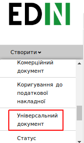
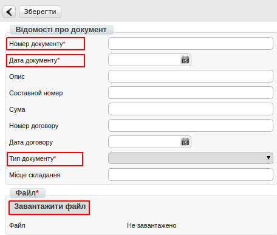

####################################################################################
Формування документа «Універсальний документ» (CONDRA) на платформі
####################################################################################

.. role:: red

.. contents:: Зміст:
   :depth: 6

---------

Вступ
=======================================

Дана інструкція описує порядок формування та відправки документа «**Універсальний документ**» (CONDRA).

Формування Універсального документа
=======================================

Для того, щоб сформувати «**Універсальний документ**» (CONDRA) необхідно скористатися функціоналом створення документа.

Для цього, натисніть кнопку «**Створити**» і виберіть зі списку пункт «**Універсальний документ**». Після чого відкриється форма для заповнення даних.

У вікні з'явиться **Форма** для заповнення необхідних реквізитів документа. Всі поля, позначені червоною зірочкою :red:`*` є обов'язковими для заповнення.

1. **Номер** — довільний номер, який присвоюється документу.
2. **Дата** — дата документа, автоматично вказана поточна дата.
3. **Тип документа** — необхідно вибрати зі списку потрібний тип документа.
4. **Файл** — вкладення, що відповідає зформованому документу.

Щоб додати вкладення, натисніть кнопку «**Завантажити файл**», виберіть з каталогу відповідний і натисніть «**Відкрити**».

Після внесення всіх змін, документ необхідно зберегти і підписати ЕЦП. Для цього натисніть на відповідні кнопки.

.. image:: pics_Rabota_s_dokumentom_Universalnyj_dokument_CONDRA/Rabota_s_dokumentom_Universalnyj_dokument_CONDRA_03.png
   :align: center

Підписання документа
=======================================

Для первинного налаштування ЕЦП, дочекайтеся завантаження сторінки, а потім натисніть кнопку “**Зчитати ключі**”.

.. image:: pics_Rabota_s_dokumentom_Universalnyj_dokument_CONDRA/Rabota_s_dokumentom_Universalnyj_dokument_CONDRA_04.png
   :align: center

Потім, в блоці налаштування ЕЦП, натисніть на зображення ключа і виберіть з каталогу, де зберігаються Ваші секретні ключі, відповідний файл.

.. image:: pics_Rabota_s_dokumentom_Universalnyj_dokument_CONDRA/Rabota_s_dokumentom_Universalnyj_dokument_CONDRA_05.png
   :align: center

Види файлів електронно-цифрового підпису
================================================

Якщо Ви використовуєте ключі від **АЦСК "Україна"**, файли підписів секретних ключів мають розширення **.ZS2** і наступні значення в іменах файлів:

* Директор «DS»
* Бухгалтер «BS»
* Співробітник «SS»
* Печатка «S»
* Шифрування «C»
* Універсальний ключ печатки і шифрування «U»

.. image:: pics_Rabota_s_dokumentom_Universalnyj_dokument_CONDRA/Rabota_s_dokumentom_Universalnyj_dokument_CONDRA_06.png
   :align: center

Якщо Ви використовуєте ключі від **АЦСК “ПриватБанк”**, файли підписів секрентних ключів мають розширення **.jks**:

.. image:: pics_Rabota_s_dokumentom_Universalnyj_dokument_CONDRA/Rabota_s_dokumentom_Universalnyj_dokument_CONDRA_07.png
   :align: center

Якщо Ви використовуєте ключі від будь-яких інших **АЦСК**, файли підписів секрентних ключів мають найменування **Key-6.dat**:

.. image:: pics_Rabota_s_dokumentom_Universalnyj_dokument_CONDRA/Rabota_s_dokumentom_Universalnyj_dokument_CONDRA_08.png
   :align: center

Після вибору секретних ключів, введіть паролі під кожним з них, а потім натисніть кнопку “**Зчитати ключі**”.

.. image:: pics_Rabota_s_dokumentom_Universalnyj_dokument_CONDRA/Rabota_s_dokumentom_Universalnyj_dokument_CONDRA_09.png
   :align: center

При коректному зчитуванні ключів, в блоці “**ЕЦП**” з’явиться інформація про власників ключів. Після перевірки інформації натисніть кнопку “**Підписати**”.

.. image:: pics_Rabota_s_dokumentom_Universalnyj_dokument_CONDRA/Rabota_s_dokumentom_Universalnyj_dokument_CONDRA_10.png
   :align: center

Після підписання натисніть на кнопку “**Відправити**”.

.. image:: pics_Rabota_s_dokumentom_Universalnyj_dokument_CONDRA/Rabota_s_dokumentom_Universalnyj_dokument_CONDRA_11.png
   :align: center

.. include:: kontakti.rst
